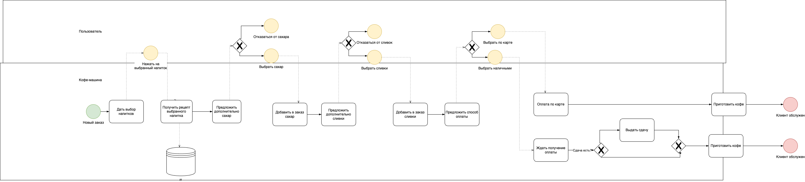
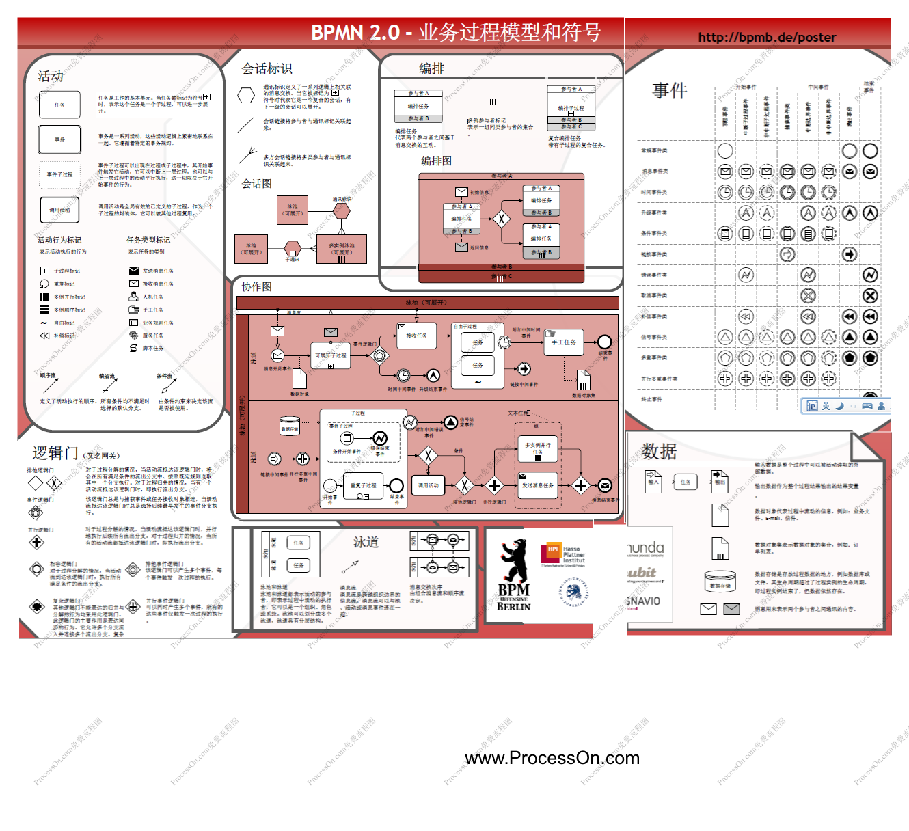

# Rubiesh 1

- [Rubiesh 1](#rubiesh-1)
  - [Билет 1](#билет-1)
      - [1. Уровень бизнес-логики в программных системах зачем нужен, какую роль играет, как взаимодействует с другими уровнями.软件系统中为什么需要业务逻辑层，它扮演什么角色，它如何与其他层交互。](#1-уровень-бизнес-логики-в-программных-системах-зачем-нужен-какую-роль-играет-как-взаимодействует-с-другими-уровнями软件系统中为什么需要业务逻辑层它扮演什么角色它如何与其他层交互)
      - [2. Распределенные транзакции, спецификация XA分布式事务，XA 规范](#2-распределенные-транзакции-спецификация-xa分布式事务xa-规范)
      - [3. Диаграмма BPMN 2.0 для бизнес-процесса управления автомашина по продаже кофе (кофе-машина). Автомат должен уметь приготавливать несколько видов кофе, добавлять в кофе сливки и сахар и принимать к оплате наличные и карты и выдавать сдачу.管理咖啡自动售货机（咖啡机）的业务流程的 BPMN 2.0 图。该机器必须能够准备多种类型的咖啡、向咖啡中添加奶油和糖、接受现金和银行卡付款以及找零。](#3-диаграмма-bpmn-20-для-бизнес-процесса-управления-автомашина-по-продаже-кофе-кофе-машина-автомат-должен-уметь-приготавливать-несколько-видов-кофе-добавлять-в-кофе-сливки-и-сахар-и-принимать-к-оплате-наличные-и-карты-и-выдавать-сдачу管理咖啡自动售货机咖啡机的业务流程的-bpmn-20-图该机器必须能够准备多种类型的咖啡向咖啡中添加奶油和糖接受现金和银行卡付款以及找零)
  - [Билет 2](#билет-2)
      - [1. Spring Boot зачем нужен, как применяется, отличие от Spring обычного  为什么需要Spring Boot，如何使用，与普通Spring的区别](#1-spring-boot-зачем-нужен-как-применяется-отличие-от-spring-обычного--为什么需要spring-boot如何使用与普通spring的区别)
      - [2. Программное и декларативное выполнение транзакций в spring  Spring 中事务的编程式和声明式执行](#2-программное-и-декларативное-выполнение-транзакций-в-spring--spring-中事务的编程式和声明式执行)
      - [3. Нарисовать BPMN 2.0 диаграмму: 1 ноября и 1 апреля должны отчислять студентов у которых хотя бы одна Академ. задолженность. 画一张 BPMN 2.0 图：11 月 1 日和 4 月 1 日，至少有一项学术债务的学生必须被开除。](#3-нарисовать-bpmn-20-диаграмму-1-ноября-и-1-апреля-должны-отчислять-студентов-у-которых-хотя-бы-одна-академ-задолженность-画一张-bpmn-20-图11-月-1-日和-4-月-1-日至少有一项学术债务的学生必须被开除)
  - [Билет 3](#билет-3)
      - [1. BPMN и моделирование бизнес процессов.BPMN 和业务流程建模。](#1-bpmn-и-моделирование-бизнес-процессовbpmn-和业务流程建模)
      - [2. Политика безопасности в корпоративных приложения, зачем, за что отвечают, особенности реализации на уровне Бизнес-логики企业应用程序中的安全策略、原因、它们负责什么、业务逻辑级别的实现功能](#2-политика-безопасности-в-корпоративных-приложения-зачем-за-что-отвечают-особенности-реализации-на-уровне-бизнес-логики企业应用程序中的安全策略原因它们负责什么业务逻辑级别的实现功能)
      - [3. Написать класс, реализующий транзакцию, которая получает Почку, Seller и Buyer и совершает акт купли-продажи. Причем продавец не может суммарно продать, а покупатель купить более 2 почек.编写一个类，实现一个交易，该交易接收一个Kidney（肾）、Seller（卖家）和Buyer（买家），并执行买卖行为。卖家不能累计出售超过2个肾，买家也不能购买超过2个肾。](#3-написать-класс-реализующий-транзакцию-которая-получает-почку-seller-и-buyer-и-совершает-акт-купли-продажи-причем-продавец-не-может-суммарно-продать-а-покупатель-купить-более-2-почек编写一个类实现一个交易该交易接收一个kidney肾seller卖家和buyer买家并执行买卖行为卖家不能累计出售超过2个肾买家也不能购买超过2个肾)
  - [Билет 4](#билет-4)
      - [1. BPMN](#1-bpmn)
      - [2. Spring security (роли и т.д.)](#2-spring-security-роли-и-тд)
      - [3. Spring MVC rest. Штука, которая переводит деньги, и проверяет не превышен ли лимит переводов за месяц. Spring MVC 的 REST 接口：一个用于转账的功能，并检查当月的转账额度是否已超限。](#3-spring-mvc-rest-штука-которая-переводит-деньги-и-проверяет-не-превышен-ли-лимит-переводов-за-месяц-spring-mvc-的-rest-接口一个用于转账的功能并检查当月的转账额度是否已超限)
  - [Билет 5](#билет-5)
      - [1. Основные концепции использующиеся в разработке бизнес логики. 开发业务逻辑时使用的基本概念。](#1-основные-концепции-использующиеся-в-разработке-бизнес-логики-开发业务逻辑时使用的基本概念)
      - [2. Выполнение. Распределенные транзакции в Spring и Jakarta EE. 实现。Spring 和 Jakarta EE 中的分布式事务。](#2-выполнение-распределенные-транзакции-в-spring-и-jakarta-ee-实现spring-和-jakarta-ee-中的分布式事务)
      - [3. BPMN для управления ядерным реактором. Исключение несанкционированной ядерной реакции с помощью отрицательной обратной связи. (BPMN для ядерного реактора. Должен реализовывать аварийную остановку) 用于核反应堆控制的 BPMN。使用负反馈消除未经授权的核反应。 （核反应堆BPMN。应实施紧急停堆）](#3-bpmn-для-управления-ядерным-реактором-исключение-несанкционированной-ядерной-реакции-с-помощью-отрицательной-обратной-связи-bpmn-для-ядерного-реактора-должен-реализовывать-аварийную-остановку-用于核反应堆控制的-bpmn使用负反馈消除未经授权的核反应-核反应堆bpmn应实施紧急停堆)
  - [Билет 6](#билет-6)
      - [1. Описание bpmn 2.0. принципы построения, основные элементы.bpmn 2.0 的说明。构建原则、基本要素。](#1-описание-bpmn-20-принципы-построения-основные-элементыbpmn-20-的说明构建原则基本要素)
      - [2. Spring Security. Что, зачем, почему. Аннотации, файлы конфигурации.Spring Security，是什么，用处，为什么，注释，配置文件](#2-spring-security-что-зачем-почему-аннотации-файлы-конфигурацииspring-security是什么用处为什么注释配置文件)
      - [3. REST API для системы быстрых платежей с проверкой месячного ограничения переводов в 100 000 р用于快速支付系统的 REST API，可检查每月 100,000 卢布的转账限额](#3-rest-api-для-системы-быстрых-платежей-с-проверкой-месячного-ограничения-переводов-в-100-000-р用于快速支付系统的-rest-api可检查每月-100000-卢布的转账限额)
  - [Билет 7](#билет-7)
      - [1. Объекты потока-управления BPMN 2.0 BPMN 2.0 控制流对象](#1-объекты-потока-управления-bpmn-20-bpmn-20-控制流对象)
      - [2. JAAS (спизжено с конспекта) 2. JAAS](#2-jaas-спизжено-с-конспекта-2-jaas)
      - [3. Написать класс (валидатор) для автобуса, который позволяет покупать пассажиру билет. Деньги не списываются, если у человека недостаточно средств. Если человек уже оплатил и второй раз прикладывает карту, то средства не списываются. А также обнуляется билет по окончанию дня у данного пассажира.  为允许乘客购买车票的公共汽车编写一个类（验证器）。如果一个人没有足够的资金，钱不会被注销。如果一个人已经付款并再次申请该卡，则不会扣除资金。乘客的机票也会在当天结束时重置。](#3-написать-класс-валидатор-для-автобуса-который-позволяет-покупать-пассажиру-билет-деньги-не-списываются-если-у-человека-недостаточно-средств-если-человек-уже-оплатил-и-второй-раз-прикладывает-карту-то-средства-не-списываются-а-также-обнуляется-билет-по-окончанию-дня-у-данного-пассажира--为允许乘客购买车票的公共汽车编写一个类验证器如果一个人没有足够的资金钱不会被注销如果一个人已经付款并再次申请该卡则不会扣除资金乘客的机票也会在当天结束时重置)
- [Rubiesh 2](#rubiesh-2)
  - [Билет ?:](#билет-)
      - [1. Распределённая обработка в JMS (Jakarta Messaging)  JMS（Jakarta Messaging）中的分布式处理](#1-распределённая-обработка-в-jms-jakarta-messaging--jmsjakarta-messaging中的分布式处理)
      - [2. Bpms описание, плюсы, минусы  Bpm 描述、优点、缺点](#2-bpms-описание-плюсы-минусы--bpm-描述优点缺点)
      - [3. Написать планировщик, используя Java SE, который запускается каждый день в 00.00 и отправляет сообщения от студентов преподавателю, когда тот проверит рубежку. Во избежание ddos атаки интервал между сообщениями 5 секунд.  使用 Java SE 编写一个调度程序，每天 00:00 运行，并在老师检查里程碑时将学生的消息发送给老师。为了避免ddos攻击，消息之间的间隔为5秒。](#3-написать-планировщик-используя-java-se-который-запускается-каждый-день-в-0000-и-отправляет-сообщения-от-студентов-преподавателю-когда-тот-проверит-рубежку-во-избежание-ddos-атаки-интервал-между-сообщениями-5-секунд--使用-java-se-编写一个调度程序每天-0000-运行并在老师检查里程碑时将学生的消息发送给老师为了避免ddos攻击消息之间的间隔为5秒)
  - [Билет ?:](#билет--1)
      - [1. Active mq, архитектура, +/-, область применения  Active mq、架构、+/-、范围](#1-active-mq-архитектура---область-применения--active-mq架构-范围)
      - [2. Жизненный цикл BPM: фазы и что на них происходит  BPM 生命周期：各个阶段以及其中发生的情况](#2-жизненный-цикл-bpm-фазы-и-что-на-них-происходит--bpm-生命周期各个阶段以及其中发生的情况)
      - [3. С помощью jakarta ee сделать планировщик: Блокировать стулом дверь аудитории после 5 минут от начала пары, если лектор в аудитории и включил проектор и при этом в аудитории есть пара. Получить расписание можно по isu api.  使用 jakarta ee 制定计划：如果讲师在观众席中并且已打开投影仪并且观众席中有一对夫妇，则在课程开始 5 分钟后用椅子挡住教室门。您可以使用 isu api 获取时间表。](#3-с-помощью-jakarta-ee-сделать-планировщик-блокировать-стулом-дверь-аудитории-после-5-минут-от-начала-пары-если-лектор-в-аудитории-и-включил-проектор-и-при-этом-в-аудитории-есть-пара-получить-расписание-можно-по-isu-api--使用-jakarta-ee-制定计划如果讲师在观众席中并且已打开投影仪并且观众席中有一对夫妇则在课程开始-5-分钟后用椅子挡住教室门您可以使用-isu-api-获取时间表)
  - [Билет ?:](#билет--2)
      - [1. Протоколы их плюсы и минусы  协议及其优缺点](#1-протоколы-их-плюсы-и-минусы--协议及其优缺点)
      - [2. Основные компоненты jbms (Camunda?)  jbms的主要组件（Camunda？）](#2-основные-компоненты-jbms-camunda--jbms的主要组件camunda)
      - [3. Написать Quartz, который каждый день в 10 и 22 проверяет у пациентов температуру, если было уже в 2 раза превышение, то вызвать врачей для проведения теста ПЦР, если тест положительный, то ограничить пациента и всех, кто с ним контактировал на 10 дней, все методы для работы с врачами уже есть  写信给Quartz，每天10点和22点检查病人的体温，如果已经高了一倍，那就打电话给医生进行PCR检测，如果检测结果呈阳性，那就限制病人和所有接触过的人他呆了10天，仅此而已。已经有与医生合作的方法了](#3-написать-quartz-который-каждый-день-в-10-и-22-проверяет-у-пациентов-температуру-если-было-уже-в-2-раза-превышение-то-вызвать-врачей-для-проведения-теста-пцр-если-тест-положительный-то-ограничить-пациента-и-всех-кто-с-ним-контактировал-на-10-дней-все-методы-для-работы-с-врачами-уже-есть--写信给quartz每天10点和22点检查病人的体温如果已经高了一倍那就打电话给医生进行pcr检测如果检测结果呈阳性那就限制病人和所有接触过的人他呆了10天仅此而已已经有与医生合作的方法了)
  - [Билет 3:](#билет-3-1)
      - [1. Ресурсы и сообщения JMS  JMS 资源和消息](#1-ресурсы-и-сообщения-jms--jms-资源和消息)
      - [2. Установка и конфигурация jbpm (Camunda?)  jbpm 安装和配置（Camunda？）](#2-установка-и-конфигурация-jbpm-camunda--jbpm-安装和配置camunda)
      - [3. Планировщик на Spring: просыпается каждые 5 минут рабочего времени с 11:00 до 17:00 (по будням), исключая обеденные перерыв с 13:00 до 15:00 и выполняет:  春季调度程序：从 11:00 到 17:00（工作日），每 5 分钟工作时间唤醒一次，不包括 13:00 到 15:00 的午休时间，并执行：](#3-планировщик-на-spring-просыпается-каждые-5-минут-рабочего-времени-с-1100-до-1700-по-будням-исключая-обеденные-перерыв-с-1300-до-1500-и-выполняет--春季调度程序从-1100-到-1700工作日每-5-分钟工作时间唤醒一次不包括-1300-到-1500-的午休时间并执行)
  - [Билет 4:](#билет-4-1)
      - [1. Модели поставки сообщений в JMS  JMS 消息传递模型](#1-модели-поставки-сообщений-в-jms--jms-消息传递模型)
      - [2. Архитектура jBPM (Camunda)  jBPM 架构 (Camunda)](#2-архитектура-jbpm-camunda--jbpm-架构-camunda)
      - [3. Написать планировщик в cron, который каждый день в 5 утра кроме января, июля и августа будет запускать три скрипта  在 cron 中编写一个调度程序，除了一月、七月和八月之外，每天早上 5 点运行三个脚本](#3-написать-планировщик-в-cron-который-каждый-день-в-5-утра-кроме-января-июля-и-августа-будет-запускать-три-скрипта--在-cron-中编写一个调度程序除了一月七月和八月之外每天早上-5-点运行三个脚本)


## Билет 1

#### 1. Уровень бизнес-логики в программных системах зачем нужен, какую роль играет, как взаимодействует с другими уровнями.<br>软件系统中为什么需要业务逻辑层，它扮演什么角色，它如何与其他层交互。

Уровень бизнес-логики (Business Logic Layer, BLL) играет ключевую роль в программных системах, так как он отвечает за выполнение основных операций и правил, связанных с бизнесом или функциональностью приложения.  
业务逻辑层（Business Logic Layer, BLL）在软件系统中是一个非常重要的层级。它负责处理系统的核心功能和规则，确保数据在系统中的处理符合特定的业务需求。

1. Зачем нужен уровень бизнес-логики  
   为什么需要业务逻辑层  
   Основная причина существования уровня бизнес-логики — это изоляция и управление сложными бизнес-правилами и процессами, которые не должны находиться в интерфейсе пользователя или на уровне работы с базой данных.
   业务逻辑层的主要目的是将复杂的业务规则从表示层（UI）和数据访问层中分离出来，确保系统架构清晰、可维护。这种分离让系统具备更好的可扩展性和可测试性。

   - **Модульность и поддерживаемость**: Благодаря разделению логики можно изменять бизнес-правила без необходимости изменять интерфейс или работу с данными.  
     **模块化和可维护性**：通过将业务逻辑集中到一个独立的层，开发者可以更轻松地管理业务规则的变化，而不需要影响整个系统的其他部分。
   - **Снижение зависимости**: Уровень бизнес-логики снижает зависимость между интерфейсом пользователя (уровень представления) и уровнем данных, что облегчает тестирование и разработку.  
     **减少耦合**：业务逻辑层减少了表示层和数据访问层之间的耦合，使得前端和后端可以独立地进行开发和测试。
   - Повышение повторного использования: Логика, сосредоточенная на одном уровне, может быть использована повторно в различных интерфейсах, таких как веб-приложения и мобильные приложения.  
     **提高复用性**：业务逻辑可以被多个不同的表示层（例如Web端、移动端）所复用，避免重复开发。

2. **它扮演什么角色**
   Уровень бизнес-логики — это ядро системы, которое отвечает за выполнение бизнес-процессов, проверку данных и реализацию всех операций, связанных с бизнес-правилами:  
   业务逻辑层的核心角色是处理与业务相关的所有操作、规则和决策，它是系统中业务流程的中枢。它包括以下几个功能：

   - **Обработка бизнес-правил**: Уровень бизнес-логики проверяет правильность данных и применяет бизнес-правила, такие как лимиты на переводы денег в банковской системе.  
     **处理业务规则**：业务逻辑层应用系统的业务规则，确保数据的合法性和正确性。例如，银行系统中的业务逻辑可能会规定某个账户的转账金额不能超过一定的限额。  
   - **Выполнение бизнес-процессов**: В сложных системах этот уровень управляет выполнением последовательных шагов бизнес-процессов, обеспечивая их правильное выполнение.  
     **执行业务流程**：在复杂的系统中，业务逻辑层处理多个步骤的业务流程，确保这些步骤按照规定的顺序和条件执行。  
   - **Координация взаимодействия между уровнями**: Уровень бизнес-логики выступает связующим звеном между интерфейсом пользователя и уровнем данных, обеспечивая правильную обработку данных.  
     **协调其他层的交互**：业务逻辑层在一定程度上作为中介，协调表示层和数据访问层之间的交互，确保表示层展示的数据正确，数据访问层存储的数据符合业务规则。

3. **它如何与其他层交互**

   В архитектуре с разделением на три уровня, уровень бизнес-логики взаимодействует с уровнем представления и уровнем данных:  
   在三层架构中，业务逻辑层通常位于表示层和数据访问层之间。其主要作用是协调其他层的数据流动：

   - **Взаимодействие с уровнем представления**: Уровень представления (интерфейс пользователя) передает запросы от пользователя на уровень бизнес-логики, который обрабатывает их и возвращает результаты. Интерфейс не занимается логикой обработки данных напрямую.  
     **与表示层交互**：表示层负责用户界面交互，它将用户请求传递给业务逻辑层，业务逻辑层根据这些请求执行相应的操作并返回处理结果。表示层不直接处理数据，而是依赖业务逻辑层来执行具体的操作。
   - **Взаимодействие с уровнем данных**: Уровень бизнес-логики взаимодействует с базой данных через уровень доступа к данным (Data Access Layer), получая и передавая данные, а также гарантируя выполнение всех правил при изменении данных.  
     **与数据访问层交互**：业务逻辑层从数据访问层获取、处理数据，再将结果返回表示层。数据访问层的职责是与数据库或其他存储系统交互，而业务逻辑层确保这些数据符合业务规则，并做出相应的决策。

#### 2. Распределенные транзакции, спецификация XA<br>分布式事务，XA 规范

Распределённые транзакции (Distributed Transactions) — это способ координации выполнения одной транзакции между несколькими независимыми системами или ресурсами, такими как базы данных, очереди сообщений и другие хранилища данных.  
分布式事务（Distributed Transaction）是指在多个独立的资源管理器（如多个数据库、消息队列等）之间协调执行的事务。由于这些资源可能位于不同的节点上，因此需要一个机制来保证这些资源的一致性，确保事务要么在所有资源上成功提交，要么全部回滚。这就是分布式事务要解决的问题。

1. Что такое распределенные транзакции?  
   分布式事务是什么？  

   Распределенные транзакции обеспечивают согласованность данных между несколькими ресурсами в распределенной системе. Это необходимо, когда одна транзакция затрагивает несколько независимых систем, и нужно гарантировать, что все операции будут выполнены или отменены как единое целое (ACID-принципы).  
   分布式事务是为了保证多个系统之间的数据一致性而设计的，它确保了在一个复杂的分布式环境中，数据操作可以像本地事务一样进行原子性（Atomicity）、一致性（Consistency）、隔离性（Isolation）、持久性（Durability），即ACID特性。

   Основной механизм координации распределенных транзакций — это протокол двухфазной фиксации (Two-Phase Commit, 2PC):  
   分布式事务通过**两阶段提交协议（Two-Phase Commit, 2PC）**来协调多个节点的操作：

   - **Первая фаза: подготовка (Prepare)**: Координатор транзакции (Transaction Manager) отправляет всем участникам запрос на подготовку к фиксации. Если все ресурсы готовы, то переходит ко второй фазе.  
     **第一阶段：准备（Prepare）**：事务管理器向所有参与的资源管理器发送准备请求，询问它们是否可以提交该事务。如果所有资源管理器都返回准备成功，则事务管理器进入第二阶段。
   - **Вторая фаза: фиксация или откат (Commit/Rollback)**: Если все участники готовы, координатор отправляет команду фиксации, в противном случае — откат.  
     **第二阶段：提交（Commit）或回滚（Rollback）**：如果所有资源管理器都同意提交，事务管理器发送提交命令；否则，发送回滚命令，撤销事务。
2. **Что такое спецификация XA?**  
   **XA规范是什么？**

   XA — это стандарт распределенной обработки транзакций, разработанный Open Group. Он описывает интерфейсы взаимодействия между менеджером транзакций (Transaction Manager, TM) и менеджером ресурсов (Resource Manager, RM). Спецификация XA позволяет менеджеру транзакций координировать выполнение транзакции между несколькими ресурсами.  
   XA（Extended Architecture for Distributed Transaction Processing）是由开放组（Open Group）提出的一种分布式事务处理规范，它定义了事务管理器（Transaction Manager, TM）和资源管理器（Resource Manager, RM）之间的接口。XA规范帮助协调不同系统之间的事务处理，确保跨多个资源管理器的操作能够保持一致性。

   - Менеджер транзакций (TM): Координирует выполнение транзакции, управляет процессом двухфазной фиксации и отвечает за согласованность.  
     事务管理器（TM）：事务管理器负责协调整个分布式事务。它发送准备、提交或回滚的请求，并确保所有参与者能够在事务的一致性上达成共识。  
   - Менеджер ресурсов (RM): Управляет доступом к данным и отвечает за выполнение команд фиксации или отката транзакции, получаемых от TM через интерфейс XA.  
     资源管理器（RM）：资源管理器是持久性存储系统（如数据库、消息队列）的一部分，负责管理事务中的具体资源。它通过XA接口与事务管理器通信，响应提交或回滚请求。
3. **Реализация распределенных транзакций и XA**  
   **分布式事务与XA的实现**
   - **Реализация менеджера транзакций**: Инструменты, такие как Bitronix, Atomikos и Narayana, реализуют спецификацию XA и координируют транзакции между различными ресурсами.  
     **事务管理器实现**：像Bitronix、Atomikos、Narayana等都是实现了XA规范的事务管理器，它们负责协调分布式系统中的不同资源管理器，以保证事务的一致性。  
   - **Реализация менеджера ресурсов**: Большинство современных баз данных и систем сообщений, таких как MySQL, PostgreSQL, Oracle, ActiveMQ, поддерживают спецификацию XA и могут участвовать в распределенных транзакциях как менеджеры ресурсов.  
     **资源管理器实现**：大多数现代的数据库和消息队列（如MySQL、PostgreSQL、Oracle、ActiveMQ、RabbitMQ）都支持XA协议，能够作为资源管理器参与到分布式事务中。

#### 3. Диаграмма BPMN 2.0 для бизнес-процесса управления автомашина по продаже кофе (кофе-машина). Автомат должен уметь приготавливать несколько видов кофе, добавлять в кофе сливки и сахар и принимать к оплате наличные и карты и выдавать сдачу.<br>管理咖啡自动售货机（咖啡机）的业务流程的 BPMN 2.0 图。该机器必须能够准备多种类型的咖啡、向咖啡中添加奶油和糖、接受现金和银行卡付款以及找零。



[https://drive.google.com/file/d/1FcBR5zZ-QivXPxe4VO8fiK0eQmv7iv9E/view?usD=sharing](https://drive.google.com/file/d/1FcBR5zZ-QivXPxe4VO8fiK0eOmy7iy9E/view?usp=sharing)
можете исправлять если что, я хз, как это адекватно сделать

## Билет 2

#### 1. Spring Boot зачем нужен, как применяется, отличие от Spring обычного <br> 为什么需要Spring Boot，如何使用，与普通Spring的区别

1. **Зачем нужен Spring Boot  **
   **为什么需要Spring Boot**

   Spring Boot создан для упрощения разработки с использованием фреймворка Spring. Основная задача — сократить время и усилия, необходимые для создания приложения на Spring, устранив сложную ручную настройку и конфигурацию.  
   Spring Boot 是基于 Spring 框架的一个快速开发框架，旨在简化 Spring 应用程序的开发。它解决了传统 Spring 项目开发中的复杂配置问题，使开发者能够更快地构建和部署应用程序。

   1. **Упрощенная конфигурация**: В обычных Spring-приложениях разработчики сталкиваются с необходимостью настраивать множество компонентов вручную с использованием XML или аннотаций. Spring Boot использует механизм автоконфигурации (Auto Configuration), которая автоматически настраивает компоненты, минимизируя необходимость в ручной настройке.  
      **简化配置**：传统的 Spring 框架项目需要开发者手动编写大量的 XML 配置文件或注解来管理依赖注入、事务管理、安全配置等。Spring Boot 通过自动配置（Auto Configuration）和预先设定的默认配置，减少了开发者的配置负担。开发者只需要关注业务逻辑，而不是大量的框架配置。

   2. **Встроенные серверы**: Spring Boot включает в себя встроенные веб-серверы, такие как Tomcat и Jetty, что позволяет запускать приложение как обычное Java-приложение, без необходимости настройки внешнего сервера.  
      嵌入式服务器：Spring Boot 提供嵌入式的 Tomcat、Jetty 等 Web 服务器，使得开发者可以直接在应用中启动和运行服务器，而不需要像传统 Spring 项目那样单独部署到外部服务器。这使得应用程序的部署更加简单，也适合于云环境和容器化（如 Docker）部署。

   3. **Быстрое развертывание**: Spring Boot предлагает так называемые стартеры (Starters) — предварительно сконфигурированные наборы зависимостей для различных функций, например, для веб-приложений, доступа к данным, безопасности и т. д. Это позволяет разработчику начать работу намного быстрее.  
      **快速启动**：Spring Boot 提供了启动器依赖（Starters），例如 spring-boot-starter-web、spring-boot-starter-data-jpa 等，开发者只需引入这些启动器依赖，就能快速集成常用功能，而不需要单独引入各种依赖和配置它们。

   4. Управление и мониторинг: Spring Boot интегрирует Spring Actuator, который предоставляет готовые средства для мониторинга и управления приложением, такие как метрики, проверка состояния, информация о сессиях и многое другое.  
      简化监控和管理：Spring Boot 集成了 Spring Actuator，它为应用程序提供了健康检查、指标收集、日志记录等监控功能，方便开发者对应用的运行状态进行管理。

2. Как применяется Spring Boot  
   **如何使用 Spring Boot**
   Для использования Spring Boot достаточно выполнить несколько шагов:
   使用 Spring Boot 的开发过程非常简单，主要包括以下步骤：

   1. **Создание проекта**: Можно воспользоваться Spring Initializr для генерации базового проекта.  
      **创建项目**：可以通过 Spring Initializr（https://start.spring.io）快速创建 Spring Boot 项目，选择所需的依赖。

   2. **Главный класс**: Главный класс с аннотацией @SpringBootApplication и методом main запускает приложение:  
      **启动类**：在主类中添加 @SpringBootApplication 注解，并通过 main 方法启动应用程序。例如：

      ```java
      @SpringBootApplication
      public class MyApplication {
          public static void main(String[] args) {
              SpringApplication.run(MyApplication.class, args);
          }
      }
      ```
   3. **Автоконфигурация**: В зависимости от подключенных зависимостей Spring Boot автоматически настраивает необходимые компоненты.  
      **自动配置**：Spring Boot 会根据添加的依赖和配置自动加载所需的 Bean 和服务。例如，添加 spring-boot-starter-web 依赖后，应用程序会自动配置 Web 服务。

   4. **Разработка приложения**: После этого можно приступать к созданию REST-контроллеров, сервисов и других компонентов с использованием Spring.  
      **应用开发**：在此基础上，开发者可以使用 Spring 的注解如 @RestController、@Service 等，定义控制器、服务和业务逻辑。

3. **Отличие от обычного Spring**  
   **与普通Spring的区别**

   Основные различия между Spring Boot и обычным Spring заключаются в следующем:  
   Spring Boot 和传统的 Spring 框架在功能和开发体验上存在一些显著的区别：

   1. **Конфигурация 配置方式**：
      - Spring: В традиционном Spring много ручной настройки через XML или аннотации.  
        Spring：传统的 Spring 项目需要大量的手动配置，通常使用 XML 文件或注解来定义 Bean、事务管理、数据源等。
      - Spring Boot: Автоконфигурация уменьшает количество ручных настроек.  
        Spring Boot：Spring Boot 提供了自动配置，大多数配置项都有合理的默认值，开发者可以选择性地覆盖部分配置，而无需手动定义大量配置。
   2. **Управление зависимостями 依赖管理**：
      - Spring: Разработчики самостоятельно добавляют зависимости и следят за совместимостью версий.  
        Spring：在普通 Spring 项目中，开发者需要手动引入所需的依赖，并确保不同依赖版本之间的兼容性。
      - Spring Boot: Стартеры включают все необходимые зависимости, что упрощает конфигурацию.  
        Spring Boot：Spring Boot 提供了一系列启动器（Starters），这些启动器将常用的依赖打包在一起，简化了依赖管理。例如，spring-boot-starter-data-jpa 包含了 JPA、Hibernate、数据源驱动等常用依赖。
   3. **Настройка серверов 服务器配置**
      - Spring: Необходимо настраивать и развертывать внешние серверы приложений, такие как Tomcat.  
        Spring：传统 Spring 项目需要手动配置和部署到外部应用服务器（如 Tomcat）。
      - Spring Boot: Приложения могут запускаться на встроенных серверах без внешней настройки.  
        Spring Boot：Spring Boot 提供嵌入式的 Tomcat、Jetty 等服务器，应用程序可以打包为可执行的 JAR 文件，直接运行，无需单独配置服务器。
   4. **Эффективность разработки 开发效率**
      - Spring: Проекты на обычном Spring требуют больше времени на настройку и запуск.  
        Spring：传统的 Spring 项目启动时间较长，配置复杂，开发者需要投入较多精力进行环境配置。
      - Spring Boot: Проекты запускаются быстрее и проще в настройке, что значительно увеличивает производительность разработки.  
        Spring Boot：Spring Boot 提供了很多开箱即用的功能，通过简化配置、嵌入式服务器和自动配置，使得开发、测试、部署更加快速和高效。

#### 2. Программное и декларативное выполнение транзакций в spring <br> Spring 中事务的编程式和声明式执行

在 Spring 框架中，事务管理是一个非常重要的功能，用于确保数据的一致性和完整性。Spring 提供了两种处理事务的方式：编程式事务管理（Programmatic Transaction Management） 和 声明式事务管理（Declarative Transaction Management）。它们在使用场景和实现方式上有着显著的区别。

1. **编程式事务管理（Programmatic Transaction Management）**
   
   编程式事务管理要求开发者手动管理事务的开始、提交和回滚。这种方式虽然提供了对事务的细粒度控制，但也增加了代码的复杂性，因为开发者必须显式地处理每个事务的生命周期。

   - 优点: 灵活性高，适合复杂的事务场景，可以对事务的每个细节进行控制。
   - 缺点: 代码冗长，难以维护。开发者必须确保在出现异常时正确处理事务的回滚。
   
    ```java   
    public class MyService {

        @Autowired
        private PlatformTransactionManager transactionManager;

        public void performOperation() {
            // 获取事务定义
            DefaultTransactionDefinition def = new DefaultTransactionDefinition();
            TransactionStatus status = transactionManager.getTransaction(def);

            try {
                // 业务逻辑
                someDatabaseOperation();

                // 提交事务
                transactionManager.commit(status);
            } catch (Exception e) {
                // 事务回滚
                transactionManager.rollback(status);
                throw e;
            }
        }
    }
    ```
   在这个例子中，开发者手动控制事务的开始、提交和回滚。PlatformTransactionManager 提供了对事务的直接控制，transactionManager.getTransaction() 用于开始事务，transactionManager.commit() 提交事务，而 transactionManager.rollback() 在出现异常时回滚事务。

2. **声明式事务管理（Declarative Transaction Management）**

   声明式事务管理不需要显式地在代码中管理事务，而是通过注解或 XML 配置来定义事务的边界。Spring AOP（面向切面编程）会自动在方法执行前后处理事务的开启、提交和回滚。开发者只需要在适当的地方使用注解，框架会自动管理事务。

   - 优点: 简洁、易于维护，减少了开发者手动管理事务的负担，减少了代码的复杂度。
   - 缺点: 灵活性不如编程式事务管理，但对于大多数场景已经足够。

    ```java
    @Service
    public class MyService {

        @Transactional
        public void performOperation() {
            // 业务逻辑
            someDatabaseOperation();
        }
    }
    ```

    在这个例子中，@Transactional 注解用于声明该方法是事务性的。Spring 在方法执行前会自动开启事务，方法执行后根据情况自动提交或回滚事务。这大大简化了事务管理的工作，使得代码更加简洁。

3. 编程式与声明式事务管理的对比

| 对比项                 | 编程式事务管理                         | 声明式事务管理                      |
|------------------------|----------------------------------------|------------------------------------|
| **灵活性**             | 高，开发者可以手动控制每个事务的生命周期 | 较低，事务边界由框架自动管理        |
| **代码复杂度**         | 高，需要显式处理事务的启动、提交和回滚  | 低，只需使用注解或配置文件声明事务 |
| **维护性**             | 难以维护，代码冗长                     | 容易维护，代码更加简洁              |
| **适用场景**           | 复杂事务处理，或者需要高度定制的场景     | 常见的事务处理场景                  |

| Параметр               | Программное управление          | Декларативное управление          |
|------------------------|-------------------------------|----------------------------------|
| **Гибкость**            | Высокая                       | Низкая                           |
| **Сложность кода**      | Более сложный код              | Код проще и понятнее              |
| **Поддержка и масштабируемость** | Труднее поддерживать        | Легче поддерживать               |
| **Применение**          | Для сложных и кастомных задач  | Для стандартных транзакционных операций |

#### 3. Нарисовать BPMN 2.0 диаграмму: 1 ноября и 1 апреля должны отчислять студентов у которых хотя бы одна Академ. задолженность. <br>画一张 BPMN 2.0 图：11 月 1 日和 4 月 1 日，至少有一项学术债务的学生必须被开除。

在 BPMN 2.0 过程中，我们可以使用“事件”、“任务”、“网关”等元素来表示逻辑流程。针对你描述的情况，以下是该流程的简单解释，之后可以用图形化的工具去画出完整的 BPMN 2.0 图：

1. **开始事件**：流程从一个开始事件启动，通常用圆圈表示。
2. **检查日期**：使用一个任务节点来检查当前日期。
3. **分支网关**：根据日期，使用条件判断网关来分支。这里会有两个主要分支：
   - **11 月 1 日**：如果日期是 11 月 1 日，继续流程。
   - **4 月 1 日**：如果日期是 4 月 1 日，继续流程。
   - **其他日期**：结束流程，因为只有在特定日期才会进行下一步操作。
4. **检查学术债务**：在正确的日期范围内，执行另一个任务来检查学生是否有学术债务。
5. **分支网关**：再次使用网关，判断是否至少有一项学术债务：
   - **有债务**：如果学生有学术债务，进入下一个步骤。
   - **无债务**：如果没有债务，结束流程。
6. **开除学生**：如果学生在上述条件下符合标准，执行开除任务。
7. **结束事件**：整个流程结束，用一个圆圈带实线表示。

## Билет 3

#### 1. BPMN и моделирование бизнес процессов.<br>BPMN 和业务流程建模。

1. 什么是 BPMN
   
   BPMN（Business Process Model and Notation，业务流程模型与标注）是一种用于业务流程建模的标准化图形符号方法。它帮助企业以可视化的方式描述、分析和优化业务流程，并使业务分析师、开发人员和管理人员能够通过统一的语言理解和交流复杂的业务流程。

2. BPMN 的核心组件
   
   BPMN 包含以下几类主要元素：

   事件（Event）：表示流程中的某一时刻的状态变化。分为开始事件、结束事件和中间事件。
   活动（Activity）：代表流程中的任务或操作，可以是简单任务或复合任务。
   网关（Gateway）：用于控制流程的分支、合并或决策，常见的有并行网关和排他网关。
   顺序流（Sequence Flow）：表示活动之间的执行顺序。
   泳道（Swimlane）：用于划分不同角色或部门的责任。

   这些元素共同构建了一个完整的业务流程模型，帮助理解业务中的每个操作步骤及其交互关系。

   

3. BPMN 的作用
   
   BPMN 的主要功能包括：

   统一的业务流程表示：通过标准化的符号和规则，BPMN 帮助业务人员和技术团队使用相同的语言交流。
   可视化流程优化：通过流程建模，可以直观识别瓶颈、冗余流程，从而进行优化。
   支持流程自动化：BPMN 模型可用于业务流程管理系统（BPMS）实现自动化执行。
4. 业务流程建模
   
   业务流程建模是描述企业内部业务操作如何运作的技术，通过对任务、角色、数据流的详细描述，帮助组织识别潜在的效率问题和改进机会。BPMN 作为业务流程建模的工具，可以帮助企业更清晰地理解和分析复杂的工作流。

#### 2. Политика безопасности в корпоративных приложения, зачем, за что отвечают, особенности реализации на уровне Бизнес-логики<br>企业应用程序中的安全策略、原因、它们负责什么、业务逻辑级别的实现功能

1. Зачем нужны политики безопасности в корпоративных приложениях?  
   为什么企业应用程序需要安全策略？

   Политики безопасности в корпоративных приложениях необходимы для защиты данных, систем и ресурсов от различных угроз, таких как несанкционированный доступ, утечки данных, внутренние угрозы и кибератаки. Основные причины:  
   企业应用程序中的安全策略用于保护数据、系统和资源，防止未经授权的访问、数据泄露、内部威胁以及网络攻击等风险。主要原因包括：

   **Защита конфиденциальных данны**х: Корпоративные приложения часто обрабатывают конфиденциальную информацию, такую как персональные данные клиентов, финансовые отчеты и коммерческую тайну.  
   保护敏感数据: 企业应用程序通常处理敏感信息，例如客户的个人数据、财务报告和商业机密。安全策略可防止未经授权的访问。

   Соответствие нормативным требованиям: Различные отрасли обязаны соблюдать законы и нормативы (GDPR, HIPAA, SOX и т. д.).  
   符合法律法规要求: 各行业需要遵守法律法规（如GDPR、HIPAA、SOX等），这些法规要求实施严格的安全措施。

   Защита от внешних атак: Приложения могут быть объектами кибератак, таких как взломы, DDoS-атаки и фишинговые атаки.  
   防范外部攻击: 应用程序可能成为网络攻击的目标，如入侵、DDoS攻击和钓鱼攻击。安全策略可将这些风险降到最低。

   Защита от внутренних угроз: Политики безопасности помогают предотвратить случайные или умышленные действия сотрудников, которые могут привести к утечке данных.  
   防止内部威胁: 安全策略有助于防止员工的意外或恶意行为，这些行为可能导致数据泄露或系统故障。

2. За что отвечают политики безопасности?  
   安全策略的职责

   - Аутентификация: Удостоверение личности пользователя (например, через пароли, двухфакторную аутентификацию, биометрические данные).  
     身份验证: 验证用户身份（例如通过密码、双因素认证或生物特征）。这可以防止未经授权的人员访问系统。

   - Авторизация: Определение прав доступа пользователя к определенным ресурсам и действиям в системе.  
     授权: 确定用户是否有权访问特定资源或执行特定操作。例如，人力资源人员可以访问员工的个人数据，而其他员工则不能。

   - Журналирование и мониторинг: Отслеживание действий пользователей в системе для выявления подозрительных действий.  
     日志记录和监控: 记录用户在系统中的操作，以便发现可疑行为或安全事件。

   - Шифрование данных: Обеспечение защиты данных как в процессе передачи, так и при хранении, используя криптографические методы.  
     数据加密: 在传输和存储过程中使用加密技术保护数据。

   - Управление уязвимостями: Обнаружение и устранение уязвимостей в приложениях для предотвращения атак.  
     漏洞管理: 发现并修复应用程序中的漏洞，以防止攻击。

3. Особенности реализации на уровне бизнес-логики  
   业务逻辑级别的安全实现特点

   На уровне бизнес-логики реализуются многие аспекты политики безопасности, особенно в крупных корпоративных системах. Бизнес-логика определяет, какие данные и функции доступны конкретным пользователям, а также каким образом должны быть обработаны данные с учетом требований безопасности.  
   在企业应用程序的业务逻辑层，很多安全措施都会被具体实现，尤其是大型企业系统。业务逻辑层负责确定哪些用户可以访问哪些数据和功能，并确保数据在处理过程中符合安全要求。

   Основные аспекты реализации безопасности на уровне бизнес-логики:  
   业务逻辑层安全实现的主要方面：

   - Ролевое управление доступом (RBAC): Права доступа распределяются на основе ролей, присвоенных пользователям (например, администратор, менеджер, обычный пользователь).  
     基于角色的访问控制 (RBAC): 权限基于用户的角色进行分配（如管理员、经理、普通用户）。业务逻辑通过检查用户角色来确定哪些操作允许执行。

     Пример: Бизнес-логика проверяет, имеет ли пользователь с ролью "Менеджер" доступ к изменению статуса заказов, а другие роли — нет.  
     示例: 业务逻辑会检查只有角色为“经理”的用户才能更改订单状态，其他角色的用户则不能。

   - Контроль на уровне атрибутов (ABAC): Доступ управляется на основе атрибутов (например, время, местоположение, должность).  
     基于属性的访问控制 (ABAC - Attribute-Based Access Control)：访问权限根据用户的属性来决定，如时间、地点或职位等。业务逻辑可以根据这些属性动态调整访问权限。
   - Разделение данных по уровню чувствительности: Бизнес-логика должна учитывать, какие данные считаются конфиденциальными, и обеспечивать соответствующие меры их защиты.  
     数据敏感性级别：业务逻辑应对不同敏感级别的数据采取不同的安全措施。

   - Логирование и аудиты: Важная функция на уровне бизнес-логики — логирование всех операций, особенно связанных с критичными изменениями в системе.  
     日志记录和审核功能 (Logging and Auditing)：业务逻辑会记录用户操作，特别是涉及敏感信息的操作，以便后续审计。
     
   - Верификация данных на входе: Бизнес-логика должна обрабатывать валидацию данных для защиты от инъекций SQL, XSS и других атак.  
     输入验证 (Input Validation)：业务逻辑需要验证输入数据，以防止SQL注入、XSS攻击等。 
      
   - Ограничение по времени выполнения задач: Некоторые действия могут быть разрешены только в определённое время (например, рабочие часы).  
     任务执行时间限制：某些操作只能在特定时间内进行，业务逻辑可用来限制这些行为。

4. Примеры механизмов безопасности в бизнес-логике  
   业务逻辑层的安全机制实例

- Квоты и лимиты: Лимиты на количество операций, которые может выполнять пользователь за определённый период.  
  配额和限额 (Quotas and Limits)：限制用户在一定时间段内可以执行的操作数量。业务逻辑可以设置每日提现限额等。
- Восстановление после ошибок: Если система сталкивается с ошибкой, бизнес-логика может предусмотреть меры для безопасного завершения операций.  
  故障恢复 (Error Recovery)：当系统遇到安全问题时，业务逻辑可以确保安全终止操作，并通知相关人员。

- Многоуровневая проверка прав доступа: Для особо чувствительных операций может требоваться утверждение несколькими уровнями.  
  多级权限检查 (Multi-level Authorization)：对于某些高风险操作，业务逻辑可以要求多重验证。

#### 3. Написать класс, реализующий транзакцию, которая получает Почку, Seller и Buyer и совершает акт купли-продажи. Причем продавец не может суммарно продать, а покупатель купить более 2 почек.<br>编写一个类，实现一个交易，该交易接收一个Kidney（肾）、Seller（卖家）和Buyer（买家），并执行买卖行为。卖家不能累计出售超过2个肾，买家也不能购买超过2个肾。

```java
class KidneyService {
    @Autowired
    private KidneyRepository kidneyRepo;
    @Autowired
    private SellerRepository sellerRepo;
    @Autowired
    private BuyerRepository buyerRepo;
    @Transactional
    public void kidneyTrading(Kidney kidney, Seller s, Buyer b) {
        Seller seller = sellerRepo.findSellerByld(s.getld());
        Buyer buyer - buyerRepo.findSellerByld(b.getld());
        
        List<Kidney> sellerSoldKidneys - seller.getSoldKidneys();
        List<Kidney> buyerBoughtKidneys - buyer.getBoughtKidneys();
        
        if (sellerSoldKidneys >= 2 || buyerBoughtKidneys >- 2)
            throw new KidneyLimitExceededException("Fuck trading"); //extends RuntimeException
        sellerSoldKidneys.add(kidney);
        buyerBoughtKidneys.add(kidney);
        
        kidney.setOwner(buyer);
        // He обязательно
        
        kidneyRepo.save(kidney);
        sellerRepo.save(seller);
        buyerRepo.save(buyer);
    }
}
```

P.S. Я нихуя не понял, что хотят, можно реализовать еще 1000 разными способами
в зависимости от того, что Цопа блядь имеет в виду  
附：我他妈的不明白他们想要什么，你可以用 1000 多种不同的方式来实现它，这取决于 Tsopa 的想法

## Билет 4

#### 1. BPMN

1. 什么是 BPMN
   
   BPMN（Business Process Model and Notation，业务流程模型与标注）是一种用于业务流程建模的标准化图形符号方法。它帮助企业以可视化的方式描述、分析和优化业务流程，并使业务分析师、开发人员和管理人员能够通过统一的语言理解和交流复杂的业务流程。

2. BPMN 的核心组件
   
   BPMN 包含以下几类主要元素：

   事件（Event）：表示流程中的某一时刻的状态变化。分为开始事件、结束事件和中间事件。
   活动（Activity）：代表流程中的任务或操作，可以是简单任务或复合任务。
   网关（Gateway）：用于控制流程的分支、合并或决策，常见的有并行网关和排他网关。
   顺序流（Sequence Flow）：表示活动之间的执行顺序。
   泳道（Swimlane）：用于划分不同角色或部门的责任。

   这些元素共同构建了一个完整的业务流程模型，帮助理解业务中的每个操作步骤及其交互关系。

3. BPMN 的作用
   
   BPMN 的主要功能包括：

   统一的业务流程表示：通过标准化的符号和规则，BPMN 帮助业务人员和技术团队使用相同的语言交流。
   可视化流程优化：通过流程建模，可以直观识别瓶颈、冗余流程，从而进行优化。
   支持流程自动化：BPMN 模型可用于业务流程管理系统（BPMS）实现自动化执行。
4. 业务流程建模
   
   业务流程建模是描述企业内部业务操作如何运作的技术，通过对任务、角色、数据流的详细描述，帮助组织识别潜在的效率问题和改进机会。BPMN 作为业务流程建模的工具，可以帮助企业更清晰地理解和分析复杂的工作流。

#### 2. Spring security (роли и т.д.)

Spring Security 是一个强大的安全框架，用于为 Spring 应用程序提供身份验证、授权和其他安全相关功能。

1. Что такое роли и зачем они нужны?  
   什么是角色？为什么需要角色？

   Роли – это абстракция прав доступа, которая определяет, какие действия может выполнять пользователь в системе. Роли обычно основываются на должностных обязанностях пользователей, например, "администратор", "пользователь", "менеджер".  
   在安全系统中，角色是对用户权限的抽象，它定义了用户可以在系统中执行哪些操作。角色通常是根据用户的职能或职责划分的（如“管理员”、“用户”、“经理”）。

   Зачем нужны роли?  
   为什么需要角色？

   - Упрощение управления правами: Вместо того чтобы задавать права для каждого пользователя, можно назначить права ролям, а затем присваивать роли пользователям.  
     简化权限管理：而不是为每个用户单独定义权限，系统通过将权限赋予角色，然后将角色赋予用户来管理权限。

   - Увеличение безопасности: С помощью ролей администраторы могут четко определять, какие пользователи могут получить доступ к определенным ресурсам.  
     安全性增强：通过角色，管理员可以清晰定义系统中哪些用户可以访问哪些资源。

2. Как управлять ролями в Spring Security?  
   如何在 Spring Security 中管理角色？

   在 Spring Security 中，角色管理通过 GrantedAuthority 和 Role 进行。Spring Security 将角色视为权限的一部分，每个角色通常以 ROLE_ 开头。

   主要概念：Основные концепции:

   - GrantedAuthority (предоставленные права): Это интерфейс, который представляет права пользователя в системе. Роли являются конкретной реализацией этих прав.  
     GrantedAuthority（授权权限）：这是 Spring Security 中的一个接口，它表示某个用户在系统中的权限。角色是 GrantedAuthority 的一种具体实现。

   - Role (роль): Это набор прав, назначаемых пользователю в системе.  
     Role（角色）：角色是在系统中分配给用户的权限集。
   
   使用注解管理角色 Управление ролями с аннотациями

   Spring Security 提供了几种注解来简化角色管理，常见的有：

   `@Secured`：指定用户必须具备某些角色才能访问特定方法。

   ```java
   @Secured("ROLE_ADMIN")
   public String adminOnlyMethod() {
       // 只有具有 ROLE_ADMIN 角色的用户才能访问此方法
       // Только пользователи с ролью ROLE_ADMIN могут получить доступ к этому методу
   }
   ```

   `@PreAuthorize`：允许基于表达式的权限控制，可以更加灵活。

   ```java
   @PreAuthorize("hasRole('ROLE_USER')")
   public String userOnlyMethod() {
       // 具有 ROLE_USER 角色的用户可以访问
       // Доступ только для пользователей с ролью ROLE_USER
   }

   ```
   
   `@PostAuthorize`：在方法执行后检查权限。

   ```
   @PostAuthorize("returnObject.owner == authentication.name")
   public String ownerOnlyMethod() {
       // 只有方法返回的对象与当前用户匹配时，才允许访问
       // Доступ разрешен, если возвращаемый объект принадлежит текущему пользователю
   }
   ```

3. Как настроить роли и права?  
   如何配置角色和权限？

   - 基于内存的角色配置 Настройка ролей в памяти

     ```java
     @Configuration
     public class SecurityConfig extends WebSecurityConfigurerAdapter {
         @Override
         protected void configure(AuthenticationManagerBuilder auth) throws Exception {
             auth.inMemoryAuthentication()
                 .withUser("user").password("{noop}password").roles("USER")
                 .and()
                 .withUser("admin").password("{noop}admin").roles("ADMIN");
         }
     }
     ```

   - Управление ролями на основе базы данных  
     基于数据库的角色管理

     ```java
     @Service
     public class MyUserDetailsService implements UserDetailsService {

         @Autowired
         private UserRepository userRepository;

         @Override
         public UserDetails loadUserByUsername(String username) throws UsernameNotFoundException {
             User user = userRepository.findByUsername(username);
             if (user == null) {
                 throw new UsernameNotFoundException("User not found");
             }

             return new org.springframework.security.core.userdetails.User(
                 user.getUsername(),
                 user.getPassword(),
                 mapRolesToAuthorities(user.getRoles())
             );
         }

         private Collection<? extends GrantedAuthority> mapRolesToAuthorities(Collection<Role> roles) {
             return roles.stream()
                         .map(role -> new SimpleGrantedAuthority(role.getName()))
                         .collect(Collectors.toList());
         }
     }
     ```

     В этом коде мы загружаем пользователя из базы данных и преобразуем роли в объекты GrantedAuthority, которые понятны Spring Security.  
     在此代码中，我们从数据库中获取用户信息，并将用户角色映射为 Spring Security 可识别的 GrantedAuthority。

4. Динамические роли и права

   有时需要根据业务逻辑动态分配权限。在这种情况下，Spring Security 允许基于业务需求动态定义角色和权限。

   Права на основе бизнес-логики: Хранение прав в базе данных позволяет гибко изменять доступ к ресурсам в зависимости от текущих потребностей.
   基于业务逻辑的权限：通过在数据库或外部系统中存储用户权限，可以在运行时动态调整用户的访问级别。

#### 3. Spring MVC rest. Штука, которая переводит деньги, и проверяет не превышен ли лимит переводов за месяц. <br>Spring MVC 的 REST 接口：一个用于转账的功能，并检查当月的转账额度是否已超限。

```java
@RestController
public class Moneycontroller {
    final UserRepository userRepository;
    
    @Autowired
    public Moneycontroller(UserRepository UserRepository) {
        this.userRepository = UserRepository;
    }
    
    @PostMapping("/transfer")
    @Transactional
    public void transferMoney(@RequestParam long from, @RequestParam long to, @RequestParam long amount) {
        User sender = userRepository.getByld(from);
        User receiver = userRepository.getByld(to);
        
        if (sender.getTransferLimit() < sender.calculateMonthlyTransferredAmount() + amount) {
            throw new TransferLimitExceededException();
        }
        
        if (sender.getBalance() < amount) {
            throw new NotEnoughMoneyException();
        }
        
        sender.setBalance(sender.getBalance() - amount);
        receiver.setBalance(receiver.getBalance() + amount);
    }
}
```

## Билет 5

#### 1. Основные концепции использующиеся в разработке бизнес логики. <br>开发业务逻辑时使用的基本概念。

1. 业务逻辑（Business Logic）：业务逻辑是指应用程序中实现业务规则和流程的部分。它包含了特定于业务的逻辑，用于处理数据和执行特定的任务。
2. 服务层（Service Layer）：服务层是业务逻辑的主要部分，负责处理业务操作并协调不同的数据访问对象（DAO）
3. 数据访问对象（DAO）：数据访问对象（DAO）是用于与数据库交互的模式。DAO 提供了与持久层的接口，隐藏了底层数据库的复杂性。
4. 模型（Model）：模型代表业务实体，通常对应于数据库中的表。模型包含了与实体相关的数据和行为。
5. 控制器（Controller）：控制器负责处理用户输入并调用相应的服务层方法。
6. 事务管理（Transaction Management）：事务管理确保在业务操作中数据的一致性和完整性。它处理数据库操作的提交和回滚，以防止部分操作导致数据不一致。
7. 验证（Validation）：验证是确保输入数据符合业务规则的过程。可以在控制器或服务层进行数据验证。
8. 安全性（Security）：安全性是保护业务逻辑和数据的关键部分。使用如 Spring Security 等框架来管理用户认证和授权。
9. 事件驱动架构（Event-Driven Architecture）：事件驱动架构通过事件的发布和订阅来促进不同模块之间的解耦。这种方法允许应用程序对特定事件作出反应。
10. 状态机（State Machine）：状态机用于建模复杂的业务流程，允许系统在不同状态之间转换。它适用于需要跟踪状态变化的场景。

#### 2. Выполнение. Распределенные транзакции в Spring и Jakarta EE. <br>实现。Spring 和 Jakarta EE 中的分布式事务。

1. 分布式事务的概念
   
   分布式事务是指涉及多个资源（如数据库、消息队列等）的事务。

   在分布式环境中，需要确保所有参与者的操作要么全部成功，要么全部失败，以保持数据一致性。

2. XA 协议
   
   XA 协议是处理分布式事务的标准，它提供了一种两阶段提交协议（2PC）。

   - 第一阶段：准备阶段，所有参与者都准备提交，但不执行。
   - 第二阶段：提交阶段，协调者决定是否提交所有参与者的操作。

3. Spring 中的分布式事务
   Spring提供灵活的事务管理，支持声明式和编程式事务，能够与多种事务管理器（如JTA、Hibernate等）集成。
   在 Spring 中，可以使用 Bitronix 或 Atomikos 等事务管理器来支持分布式事务。

   ```java
   @Configuration
   @EnableTransactionManagement
   @EnableJpaRepositories(basePackages = "com.blps.lab1.databaseJPA")
   public class TransactionManagementConfig {

       @Bean(name = "bitronixTransactionManager")
       public BitronixTransactionManager bitronixTransactionManager() throws Throwable {
           BitronixTransactionManager transactionManager = TransactionManagerServices.getTransactionManager();
           transactionManager.setTransactionTimeout(10000);// 设置超时时间
           return transactionManager;
       }

       @Bean
       public PlatformTransactionManager platformTransactionManager() {
           return new JpaTransactionManager(entityManagerFactory().getObject());
       }
   }
   ```

4. Jakarta EE 中的分布式事务
   Jakarta EE 使用 Java Transaction API (JTA) 来处理分布式事务。

   - 事务管理器：Jakarta EE 容器提供一个内置的事务管理器。

   - @Transactional 注解：可以在 EJB 和 CDI bean 上使用来管理事务。

   ```java
   @Stateless
   public class MyEJB {

       @Inject
       private UserTransaction userTransaction;

       public void performDistributedTransaction() {
           try {
               userTransaction.begin();

               // 执行数据库操作
               // Execute database operations

               userTransaction.commit();
           } catch (Exception e) {
               userTransaction.rollback();
           }
       }
   }
   ``` 

#### 3. BPMN для управления ядерным реактором. Исключение несанкционированной ядерной реакции с помощью отрицательной обратной связи. (BPMN для ядерного реактора. Должен реализовывать аварийную остановку) <br>用于核反应堆控制的 BPMN。使用负反馈消除未经授权的核反应。 （核反应堆BPMN。应实施紧急停堆）

## Билет 6

#### 1. Описание bpmn 2.0. принципы построения, основные элементы.<br>bpmn 2.0 的说明。构建原则、基本要素。

1. BPMN 2.0 简介
   BPMN 2.0（业务流程建模符号 2.0） 是一种标准化的图形表示法，用于业务流程的建模和描述。它为不同的利益相关者（如业务分析师、技术开发人员和管理人员）提供了一个统一的模型，促进了沟通与理解。

2. 构建原则
   - 可视化：BPMN 2.0 通过图形化的方式展示流程，使其易于理解和沟通。
   - 一致性：所有 BPMN 元素具有明确的定义和语义，确保模型的一致性。
   - 可扩展性：BPMN 2.0 允许用户根据需求扩展和自定义模型，满足不同场景的需求。
   - 适应性：支持建模不同类型的业务流程，包括核心业务流程、支持流程和管理流程。

3. 基本要素
   1. 流程元素
      - 事件（Event）：表示流程中的某个发生的事情，分为开始事件、结束事件和中间事件。  
      - 活动（Activity）：表示需要执行的工作，可以是任务（Task）或子流程（Sub-Process）。  
      - 网关（Gateway）：用于控制流程的分支和合并，支持不同的逻辑判断。
   2. 连接元素
      - 序列流（Sequence Flow）：表示流程中的活动顺序。  
      - 消息流（Message Flow）：表示不同参与者之间的信息传递。  
      - 关联（Association）：用于连接文本注释和流程元素。  
   4. 泳道元素
      - 泳道（Lane）：用于组织和区分不同角色或部门的活动。
      - 池（Pool）：表示参与者的边界，可以包含一个或多个泳道。


#### 2. Spring Security. Что, зачем, почему. Аннотации, файлы конфигурации.<br>Spring Security，是什么，用处，为什么，注释，配置文件

1. 什么是 Spring Security
   
   Spring Security 是一个功能强大且高度可定制的身份验证和访问控制框架。它是 Spring 生态系统中的一部分，提供了保护应用程序的安全机制。

2. 为什么需要 Spring Security
   
   - 安全性：保护应用程序免受未授权访问、数据泄露和攻击。
   - 身份验证：确保用户身份的合法性，支持多种身份验证机制（如表单登录、JWT、OAuth2 等）。
   - 授权：根据用户角色和权限控制对资源的访问。
   - 灵活性：能够与不同的认证提供者（如 LDAP、数据库等）集成，提供可扩展的安全方案。
  
3. Spring Security 的注释

   Spring Security 提供了多种注释，用于声明安全性和访问控制。常用的注释包括：
   - @EnableWebSecurity：启用 Spring Security 的 Web 安全支持。
   - @PreAuthorize：在方法执行之前进行授权检查。
   - @PostAuthorize：在方法执行之后进行授权检查。
   - @Secured：对方法进行安全性检查，允许指定的角色访问。
   - @RolesAllowed：限制某个方法只能被具有指定角色的用户访问。

4. Spring Security 的配置文件
   Spring Security 的配置可以通过 Java 配置类或 XML 配置文件实现。以下是使用 Java 配置类的示例：

   ```java
   @Configuration
   @EnableWebSecurity
   public class SecurityConfig extends WebSecurityConfigurerAdapter {

       @Override
       protected void configure(HttpSecurity http) throws Exception {
           http
               .authorizeRequests()
                   .antMatchers("/public/**").permitAll() // 允许所有用户访问 /public/** 路径
                   .anyRequest().authenticated() // 其他请求需要身份验证
                   .and()
               .formLogin() // 使用表单登录
                   .loginPage("/login") // 自定义登录页面
                   .permitAll() // 允许所有用户访问登录页面
                   .and()
               .logout() // 登出配置
                   .permitAll();
       }

       @Override
       protected void configure(AuthenticationManagerBuilder auth) throws Exception {
           auth
               .inMemoryAuthentication() // 使用内存中的用户存储
                   .withUser("user").password("{noop}password").roles("USER") // 创建一个用户
                   .and()
                   .withUser("admin").password("{noop}admin").roles("ADMIN"); // 创建一个管理员
       }
   }
   ```

#### 3. REST API для системы быстрых платежей с проверкой месячного ограничения переводов в 100 000 р<br>用于快速支付系统的 REST API，可检查每月 100,000 卢布的转账限额

```java
@RestController
public class Moneycontroller {
    final UserRepository userRepository;
    @Autowired
    public Moneycontroller(UserRepository UserRepository) {
        this.userRepository = UserRepository;
    }
    @PostMapping("/transfer")
    @Transactional
    public void transferMoney(@RequestParam long from, @RequestParam long to, @RequestParam long amount) {
        User sender = userRepository.getByld(from);
        User receiver = userRepository.getByld(to);

        if (sender.getTransferLimit() < sender.calculateMonthlyTransferredAmount() + amount) {
            throw new TransferLimitExceededException();
        }

        if (sender.getBalance() < amount) {
            throw new NotEnoughMoneyException();
        }
        
        sender.setBalance(sender.getBalance() - amount);
        receiver.setBalance(receiver.getBalance() + amount);
    }
}
```

## Билет 7

#### 1. Объекты потока-управления BPMN 2.0 <br>BPMN 2.0 控制流对象

#### 2. JAAS (спизжено с конспекта) <br>2. JAAS

1. **JAAS 简介**

   **JAAS（Java 身份验证和授权服务）** 是 Java 平台的一部分，用于提供基于角色的访问控制。  
   **JAAS (Java Authentication and Authorization Service)** is a part of the Java platform that provides role-based access control.

   它允许开发人员在 Java 应用程序中实现身份验证（确定用户的身份）和授权（确定用户是否有权访问资源）的功能。  
   It allows developers to implement authentication (determining the identity of the user) and authorization (determining whether a user has permission to access resources) in Java applications.

2. **JAAS 的主要组件**

   JAAS 主要包括以下组件：

   - **登录模块（Login Module）**：
     - 登录模块负责处理用户的身份验证。  
       **Login Module**: The login module is responsible for handling user authentication.

   - **Subject**：
     - Subject 表示一个用户或一组用户，包含其身份和相关的安全凭证。  
       **Subject**: A subject represents a user or a group of users and contains their identities and associated security credentials.

   - **Callback Handler**：
     - 用于与用户交互，获取用户的凭证（如用户名和密码）。  
       **Callback Handler**: Used for interacting with the user to obtain user credentials (like username and password).

   - **登录配置文件**：
     - 配置文件指定哪些登录模块可以用于身份验证，并定义其顺序。  
       **Login Configuration**: The configuration file specifies which login modules can be used for authentication and defines their order.

3. **JAAS 的工作流程**

   JAAS 的工作流程通常如下：

   1. **用户请求登录**：用户通过提供凭证（如用户名和密码）请求访问受保护的资源。  
      **User Requests Login**: The user requests access to protected resources by providing credentials (like username and password).

   2. **创建 Subject**：JAAS 创建一个 Subject 对象以表示该用户。  
      **Create Subject**: JAAS creates a Subject object to represent the user.

   3. **调用登录模块**：JAAS 调用配置的登录模块进行身份验证。  
      **Invoke Login Module**: JAAS invokes the configured login modules to perform authentication.

   4. **验证凭证**：登录模块验证用户的凭证，如果验证通过，则将用户的身份和权限添加到 Subject。  
      **Validate Credentials**: The login module validates the user’s credentials; if successful, it adds the user’s identity and permissions to the Subject.

   5. **访问控制**：在身份验证成功后，应用程序可以根据用户的角色和权限控制访问。  
      **Access Control**: Once authentication is successful, the application can control access based on the user’s roles and permissions.

4. **示例代码**

   以下是使用 JAAS 进行身份验证的简单示例：

   ```java
   import javax.security.auth.login.LoginContext;
   import javax.security.auth.login.LoginException;

   public class JAASExample {
       public static void main(String[] args) {
           try {
               LoginContext lc = new LoginContext("MyLoginModule");
               lc.login(); // 执行登录
               System.out.println("登录成功");

               // 执行受保护的操作
           } catch (LoginException e) {
               System.out.println("登录失败: " + e.getMessage());
           }
       }
   }
   ```

在此示例中，我们创建了一个 `LoginContext` 对象，并使用指定的登录模块进行身份验证。  
In this example, we create a `LoginContext` object and use the specified login module for authentication.

1. **总结**

JAAS 是 Java 平台上实现安全性的关键工具，提供了一种灵活的方法来处理用户身份验证和授权。  
JAAS is a key tool for implementing security in the Java platform, providing a flexible way to handle user authentication and authorization.

通过使用登录模块、Subject 和回调处理程序，开发人员可以构建安全的 Java 应用程序，并有效地控制对资源的访问。  
By using login modules, Subjects, and callback handlers, developers can build secure Java applications and effectively control access to resources.

#### 3. Написать класс (валидатор) для автобуса, который позволяет покупать пассажиру билет. Деньги не списываются, если у человека недостаточно средств. Если человек уже оплатил и второй раз прикладывает карту, то средства не списываются. А также обнуляется билет по окончанию дня у данного пассажира. <br> 为允许乘客购买车票的公共汽车编写一个类（验证器）。如果一个人没有足够的资金，钱不会被注销。如果一个人已经付款并再次申请该卡，则不会扣除资金。乘客的机票也会在当天结束时重置。

```java
@RestController
public class Buscontroller {
    public static final long PRICE = 666;

    private final PassengerRepository passengerRepository;

    @Autowired
    public BusController(PassengerRepository passengerRepository) {
        this.passengerRepository = passengerRepository;
    }

    @PostMapping
    public void pay(long passengerld) {
        User passenger = passengerRepository.getByld(passengerld);
        
        if (passenger.getBalance() < PRICE ) {
            throw new NotEnoughMoneyException();
        }

        if (passenger.getEastPaidvay() == LocalDateTime.now().toLocalDate()) {
            return; // уже оплачено
        }
        
        passenger.setBalance(passenger.getBalance() - PRICE);
    }
}
```

# Rubiesh 2

## Билет ?:

#### 1. Распределённая обработка в JMS (Jakarta Messaging) <br> JMS（Jakarta Messaging）中的分布式处理

#### 2. Bpms описание, плюсы, минусы <br> Bpm 描述、优点、缺点

#### 3. Написать планировщик, используя Java SE, который запускается каждый день в 00.00 и отправляет сообщения от студентов преподавателю, когда тот проверит рубежку. Во избежание ddos атаки интервал между сообщениями 5 секунд. <br> 使用 Java SE 编写一个调度程序，每天 00:00 运行，并在老师检查里程碑时将学生的消息发送给老师。为了避免ddos攻击，消息之间的间隔为5秒。

## Билет ?:

#### 1. Active mq, архитектура, +/-, область применения <br> Active mq、架构、+/-、范围

#### 2. Жизненный цикл BPM: фазы и что на них происходит <br> BPM 生命周期：各个阶段以及其中发生的情况

#### 3. С помощью jakarta ee сделать планировщик: Блокировать стулом дверь аудитории после 5 минут от начала пары, если лектор в аудитории и включил проектор и при этом в аудитории есть пара. Получить расписание можно по isu api. <br> 使用 jakarta ee 制定计划：如果讲师在观众席中并且已打开投影仪并且观众席中有一对夫妇，则在课程开始 5 分钟后用椅子挡住教室门。您可以使用 isu api 获取时间表。

## Билет ?:

#### 1. Протоколы их плюсы и минусы <br> 协议及其优缺点

#### 2. Основные компоненты jbms (Camunda?) <br> jbms的主要组件（Camunda？）

#### 3. Написать Quartz, который каждый день в 10 и 22 проверяет у пациентов температуру, если было уже в 2 раза превышение, то вызвать врачей для проведения теста ПЦР, если тест положительный, то ограничить пациента и всех, кто с ним контактировал на 10 дней, все методы для работы с врачами уже есть <br> 写信给Quartz，每天10点和22点检查病人的体温，如果已经高了一倍，那就打电话给医生进行PCR检测，如果检测结果呈阳性，那就限制病人和所有接触过的人他呆了10天，仅此而已。已经有与医生合作的方法了

## Билет 3:

#### 1. Ресурсы и сообщения JMS <br> JMS 资源和消息

#### 2. Установка и конфигурация jbpm (Camunda?) <br> jbpm 安装和配置（Camunda？）

#### 3. Планировщик на Spring: просыпается каждые 5 минут рабочего времени с 11:00 до 17:00 (по будням), исключая обеденные перерыв с 13:00 до 15:00 и выполняет: <br> 春季调度程序：从 11:00 到 17:00（工作日），每 5 分钟工作时间唤醒一次，不包括 13:00 到 15:00 的午休时间，并执行：

## Билет 4:

#### 1. Модели поставки сообщений в JMS <br> JMS 消息传递模型

#### 2. Архитектура jBPM (Camunda) <br> jBPM 架构 (Camunda)

#### 3. Написать планировщик в cron, который каждый день в 5 утра кроме января, июля и августа будет запускать три скрипта <br> 在 cron 中编写一个调度程序，除了一月、七月和八月之外，每天早上 5 点运行三个脚本

