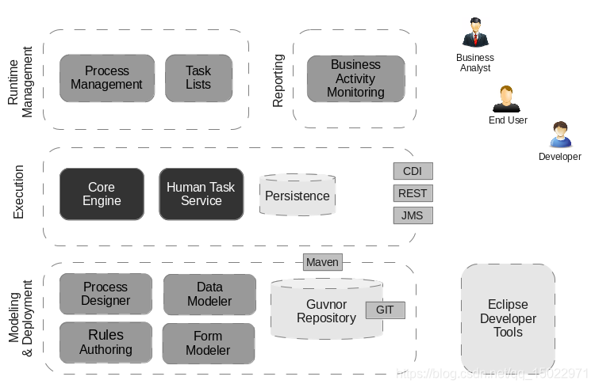

## [MainPage](../index.md)/[Business Logic](README.md)/Rubiesh

- [Rubiesh 2](#rubiesh-2)
  - [Билет ?:](#билет-)
      - [1. Распределённая обработка в JMS (Jakarta Messaging)  JMS（Jakarta Messaging）中的分布式处理](#1-распределённая-обработка-в-jms-jakarta-messaging--jmsjakarta-messaging中的分布式处理)
      - [2. BPMS описание, плюсы, минусы  BPMS 描述、优点、缺点](#2-bpms-описание-плюсы-минусы--bpms-描述优点缺点)
      - [3. Написать планировщик, используя Java SE, который запускается каждый день в 00.00 и отправляет сообщения от студентов преподавателю, когда тот проверит рубежку. Во избежание ddos атаки интервал между сообщениями 5 секунд.  使用 Java SE 编写一个调度程序，每天 00:00 运行，并在老师检查里程碑时将学生的消息发送给老师。为了避免ddos攻击，消息之间的间隔为5秒。](#3-написать-планировщик-используя-java-se-который-запускается-каждый-день-в-0000-и-отправляет-сообщения-от-студентов-преподавателю-когда-тот-проверит-рубежку-во-избежание-ddos-атаки-интервал-между-сообщениями-5-секунд--使用-java-se-编写一个调度程序每天-0000-运行并在老师检查里程碑时将学生的消息发送给老师为了避免ddos攻击消息之间的间隔为5秒)
  - [Билет ?:](#билет--1)
      - [1. Active mq, архитектура, +/-, область применения  Active mq、架构、+/-、范围](#1-active-mq-архитектура---область-применения--active-mq架构-范围)
      - [2. Жизненный цикл BPM: фазы и что на них происходит  BPM 生命周期：各个阶段以及其中发生的情况](#2-жизненный-цикл-bpm-фазы-и-что-на-них-происходит--bpm-生命周期各个阶段以及其中发生的情况)
      - [3. С помощью jakarta ee сделать планировщик: Блокировать стулом дверь аудитории после 5 минут от начала пары, если лектор в аудитории и включил проектор и при этом в аудитории есть пара. Получить расписание можно по isu api.  使用 jakarta ee 制定计划：如果讲师在观众席中并且已打开投影仪并且观众席中有一对夫妇，则在课程开始 5 分钟后用椅子挡住教室门。您可以使用 isu api 获取时间表。](#3-с-помощью-jakarta-ee-сделать-планировщик-блокировать-стулом-дверь-аудитории-после-5-минут-от-начала-пары-если-лектор-в-аудитории-и-включил-проектор-и-при-этом-в-аудитории-есть-пара-получить-расписание-можно-по-isu-api--使用-jakarta-ee-制定计划如果讲师在观众席中并且已打开投影仪并且观众席中有一对夫妇则在课程开始-5-分钟后用椅子挡住教室门您可以使用-isu-api-获取时间表)
  - [Билет ?:](#билет--2)
      - [1. Протоколы MQTT их плюсы и минусы  MQTT 协议及其优缺点](#1-протоколы-mqtt-их-плюсы-и-минусы--mqtt-协议及其优缺点)
      - [2. Основные компоненты jbms (Camunda?)  jbms的主要组件（Camunda？）](#2-основные-компоненты-jbms-camunda--jbms的主要组件camunda)
      - [3. Написать Quartz, который каждый день в 10 и 22 проверяет у пациентов температуру, если было уже в 2 раза превышение, то вызвать врачей для проведения теста ПЦР, если тест положительный, то ограничить пациента и всех, кто с ним контактировал на 10 дней, все методы для работы с врачами уже есть  写信给Quartz，每天10点和22点检查病人的体温，如果已经高了一倍，那就打电话给医生进行PCR检测，如果检测结果呈阳性，那就限制病人和所有接触过的人他呆了10天，仅此而已。已经有与医生合作的方法了](#3-написать-quartz-который-каждый-день-в-10-и-22-проверяет-у-пациентов-температуру-если-было-уже-в-2-раза-превышение-то-вызвать-врачей-для-проведения-теста-пцр-если-тест-положительный-то-ограничить-пациента-и-всех-кто-с-ним-контактировал-на-10-дней-все-методы-для-работы-с-врачами-уже-есть--写信给quartz每天10点和22点检查病人的体温如果已经高了一倍那就打电话给医生进行pcr检测如果检测结果呈阳性那就限制病人和所有接触过的人他呆了10天仅此而已已经有与医生合作的方法了)
  - [Билет 3:](#билет-3-1)
      - [1. Ресурсы и сообщения JMS  JMS 资源和消息](#1-ресурсы-и-сообщения-jms--jms-资源和消息)
      - [2. Установка и конфигурация jbpm (Camunda?)  jbpm 安装和配置（Camunda？）](#2-установка-и-конфигурация-jbpm-camunda--jbpm-安装和配置camunda)
    - [jBPM的安装和配置步骤](#jbpm的安装和配置步骤)
      - [3. Планировщик на Spring: просыпается каждые 5 минут рабочего времени с 11:00 до 17:00 (по будням), исключая обеденные перерыв с 13:00 до 15:00 и выполняет:  春季调度程序：从 11:00 到 17:00（工作日），每 5 分钟工作时间唤醒一次，不包括 13:00 到 15:00 的午休时间，并执行：](#3-планировщик-на-spring-просыпается-каждые-5-минут-рабочего-времени-с-1100-до-1700-по-будням-исключая-обеденные-перерыв-с-1300-до-1500-и-выполняет--春季调度程序从-1100-到-1700工作日每-5-分钟工作时间唤醒一次不包括-1300-到-1500-的午休时间并执行)
  - [Билет 4:](#билет-4-1)
      - [1. Модели поставки сообщений в JMS  JMS 消息传递模型](#1-модели-поставки-сообщений-в-jms--jms-消息传递模型)
      - [2. Архитектура jBPM (Camunda)  jBPM 架构 (Camunda)](#2-архитектура-jbpm-camunda--jbpm-架构-camunda)
      - [3. Написать планировщик в cron, который каждый день в 5 утра кроме января, июля и августа будет запускать три скрипта  在 cron 中编写一个调度程序，除了一月、七月和八月之外，每天早上 5 点运行三个脚本](#3-написать-планировщик-в-cron-который-каждый-день-в-5-утра-кроме-января-июля-и-августа-будет-запускать-три-скрипта--在-cron-中编写一个调度程序除了一月七月和八月之外每天早上-5-点运行三个脚本)
  - [Билет 6:](#билет-6-1)
      - [1. Асинхронная обработка в jms  jms中的异步处理](#1-асинхронная-обработка-в-jms--jms中的异步处理)
      - [2. Bpms описание, плюсы, минусы (было)  Bpms 描述、优点、缺点](#2-bpms-описание-плюсы-минусы-было--bpms-描述优点缺点)
      - [3. Написать планировщик, используя Java SE, который запускается каждый день в 00.00 и отправляет сообщения от студентов преподавателю, когда тот проверит рубежку. Во избежание ddos атаки интервал между сообщениями 5 секунд  使用 Java SE 编写一个调度程序，每天 00:00 运行，并在老师检查里程碑时将学生的消息发送给老师。为避免ddos攻击，消息间隔为5秒](#3-написать-планировщик-используя-java-se-который-запускается-каждый-день-в-0000-и-отправляет-сообщения-от-студентов-преподавателю-когда-тот-проверит-рубежку-во-избежание-ddos-атаки-интервал-между-сообщениями-5-секунд--使用-java-se-编写一个调度程序每天-0000-运行并在老师检查里程碑时将学生的消息发送给老师为避免ddos攻击消息间隔为5秒)
  - [Билет 7：](#билет-7-1)
      - [1. планировщик задачи: что зачем и где](#1-планировщик-задачи-что-зачем-и-где)
      - [2. camunda: компоненты, возможности](#2-camunda-компоненты-возможности)
      - [3. Java класс с JMS для оповещения рецензентов о проверке научных статей](#3-java-класс-с-jms-для-оповещения-рецензентов-о-проверке-научных-статей)
  - [Билет 8：](#билет-8)
      - [1. основные компоненты bpms](#1-основные-компоненты-bpms)
      - [2. Протоколы MQTT их плюсы и минусы](#2-протоколы-mqtt-их-плюсы-и-минусы)
      - [3. Написать Quartz, который каждый день в 10 и 22 проверяет у пациентов температуру, если было уже в 2 раза превышение, то вызвать врачей для проведения теста ПЦР, если тест положительный, то ограничить пациента и всех, кто с ним контактировал на 10 дней, все методы для работы с врачами уже есть](#3-написать-quartz-который-каждый-день-в-10-и-22-проверяет-у-пациентов-температуру-если-было-уже-в-2-раза-превышение-то-вызвать-врачей-для-проведения-теста-пцр-если-тест-положительный-то-ограничить-пациента-и-всех-кто-с-ним-контактировал-на-10-дней-все-методы-для-работы-с-врачами-уже-есть)
  - [Билет 9：](#билет-9)
      - [1. JMS资源和消息](#1-jms资源和消息)
      - [2. Транзакции в Camunda:](#2-транзакции-в-camunda)
    - [结论](#结论)
      - [3. Планировщик на Spring: просыпается каждые 5 минут рабочего времени с 11:00 до 17:00 (по будням), исключая обеденные перерыв с 13:00 до 15:00 и выполняет:](#3-планировщик-на-spring-просыпается-каждые-5-минут-рабочего-времени-с-1100-до-1700-по-будням-исключая-обеденные-перерыв-с-1300-до-1500-и-выполняет)
  - [Билет 10：](#билет-10)
      - [1. планировщик задачи: что зачем и где  任务调度程序：什么、为什么以及在哪里](#1-планировщик-задачи-что-зачем-и-где--任务调度程序什么为什么以及在哪里)
      - [2. Rabbit MQ](#2-rabbit-mq)
      - [3. Написать JMS сервер прием и передача](#3-написать-jms-сервер-прием-и-передача)
  - [Билет 11：](#билет-11)
      - [1. архитектура JMS](#1-архитектура-jms)
      - [2. Quartz - уже точно не помню, вроде способы конфигурации, и ещё что-то](#2-quartz---уже-точно-не-помню-вроде-способы-конфигурации-и-ещё-что-то)
      - [3. как сконфигурировать и запустить проект в Camunda (Сконфигурировать камунду, чтобы он был Standalone(через приложение)/Embedded (через pom))](#3-как-сконфигурировать-и-запустить-проект-в-camunda-сконфигурировать-камунду-чтобы-он-был-standaloneчерез-приложениеembedded-через-pom)
  - [Билет 12：](#билет-12)
      - [1. Асинхронность 异步](#1-асинхронность-异步)
      - [2. Крон （Cron）](#2-крон-cron)
      - [3. Как бы ты развернул камунду в вайлдфлае в станделон режиме](#3-как-бы-ты-развернул-камунду-в-вайлдфлае-в-станделон-режиме)
  - [Доп вопросы：](#доп-вопросы)
      - [1. Camunda cockpit](#1-camunda-cockpit)
      - [2. планировщик задач в spring и jakarta ee](#2-планировщик-задач-в-spring-и-jakarta-ee)
      - [3. Spring 中的任务调度程序：](#3-spring-中的任务调度程序)
      - [4. Распределенные системы JMS  分布式 JMS 系统](#4-распределенные-системы-jms--分布式-jms-系统)


## Билет 1

#### 1. Уровень бизнес-логики в программных системах зачем нужен, какую роль играет, как взаимодействует с другими уровнями.<br>软件系统中为什么需要业务逻辑层，它扮演什么角色，它如何与其他层交互。

Уровень бизнес-логики (Business Logic Layer, BLL) играет ключевую роль в программных системах, так как он отвечает за выполнение основных операций и правил, связанных с бизнесом или функциональностью приложения.  
业务逻辑层（Business Logic Layer, BLL）在软件系统中是一个非常重要的层级。它负责处理系统的核心功能和规则，确保数据在系统中的处理符合特定的业务需求。

1. Зачем нужен уровень бизнес-логики  
   为什么需要业务逻辑层  
   Основная причина существования уровня бизнес-логики — это изоляция и управление сложными бизнес-правилами и процессами, которые не должны находиться в интерфейсе пользователя или на уровне работы с базой данных.
   业务逻辑层的主要目的是将复杂的业务规则从表示层（UI）和数据访问层中分离出来，确保系统架构清晰、可维护。这种分离让系统具备更好的可扩展性和可测试性。

   - **Модульность и поддерживаемость**: Благодаря разделению логики можно изменять бизнес-правила без необходимости изменять интерфейс или работу с данными.  
     **模块化和可维护性**：通过将业务逻辑集中到一个独立的层，开发者可以更轻松地管理业务规则的变化，而不需要影响整个系统的其他部分。
   - **Снижение зависимости**: Уровень бизнес-логики снижает зависимость между интерфейсом пользователя (уровень представления) и уровнем данных, что облегчает тестирование и разработку.  
     **减少耦合**：业务逻辑层减少了表示层和数据访问层之间的耦合，使得前端和后端可以独立地进行开发和测试。
   - Повышение повторного использования: Логика, сосредоточенная на одном уровне, может быть использована повторно в различных интерфейсах, таких как веб-приложения и мобильные приложения.  
     **提高复用性**：业务逻辑可以被多个不同的表示层（例如Web端、移动端）所复用，避免重复开发。

2. **它扮演什么角色**
   Уровень бизнес-логики — это ядро системы, которое отвечает за выполнение бизнес-процессов, проверку данных и реализацию всех операций, связанных с бизнес-правилами:  
   业务逻辑层的核心角色是处理与业务相关的所有操作、规则和决策，它是系统中业务流程的中枢。它包括以下几个功能：

   - **Обработка бизнес-правил**: Уровень бизнес-логики проверяет правильность данных и применяет бизнес-правила, такие как лимиты на переводы денег в банковской системе.  
     **处理业务规则**：业务逻辑层应用系统的业务规则，确保数据的合法性和正确性。例如，银行系统中的业务逻辑可能会规定某个账户的转账金额不能超过一定的限额。  
   - **Выполнение бизнес-процессов**: В сложных системах этот уровень управляет выполнением последовательных шагов бизнес-процессов, обеспечивая их правильное выполнение.  
     **执行业务流程**：在复杂的系统中，业务逻辑层处理多个步骤的业务流程，确保这些步骤按照规定的顺序和条件执行。  
   - **Координация взаимодействия между уровнями**: Уровень бизнес-логики выступает связующим звеном между интерфейсом пользователя и уровнем данных, обеспечивая правильную обработку данных.  
     **协调其他层的交互**：业务逻辑层在一定程度上作为中介，协调表示层和数据访问层之间的交互，确保表示层展示的数据正确，数据访问层存储的数据符合业务规则。

3. **它如何与其他层交互**

   В архитектуре с разделением на три уровня, уровень бизнес-логики взаимодействует с уровнем представления и уровнем данных:  
   在三层架构中，业务逻辑层通常位于表示层和数据访问层之间。其主要作用是协调其他层的数据流动：

   - **Взаимодействие с уровнем представления**: Уровень представления (интерфейс пользователя) передает запросы от пользователя на уровень бизнес-логики, который обрабатывает их и возвращает результаты. Интерфейс не занимается логикой обработки данных напрямую.  
     **与表示层交互**：表示层负责用户界面交互，它将用户请求传递给业务逻辑层，业务逻辑层根据这些请求执行相应的操作并返回处理结果。表示层不直接处理数据，而是依赖业务逻辑层来执行具体的操作。
   - **Взаимодействие с уровнем данных**: Уровень бизнес-логики взаимодействует с базой данных через уровень доступа к данным (Data Access Layer), получая и передавая данные, а также гарантируя выполнение всех правил при изменении данных.  
     **与数据访问层交互**：业务逻辑层从数据访问层获取、处理数据，再将结果返回表示层。数据访问层的职责是与数据库或其他存储系统交互，而业务逻辑层确保这些数据符合业务规则，并做出相应的决策。

#### 2. Распределенные транзакции, спецификация XA<br>分布式事务，XA 规范

Распределённые транзакции (Distributed Transactions) — это способ координации выполнения одной транзакции между несколькими независимыми системами или ресурсами, такими как базы данных, очереди сообщений и другие хранилища данных.  
分布式事务（Distributed Transaction）是指在多个独立的资源管理器（如多个数据库、消息队列等）之间协调执行的事务。由于这些资源可能位于不同的节点上，因此需要一个机制来保证这些资源的一致性，确保事务要么在所有资源上成功提交，要么全部回滚。这就是分布式事务要解决的问题。

1. Что такое распределенные транзакции?  
   分布式事务是什么？  

   Распределенные транзакции обеспечивают согласованность данных между несколькими ресурсами в распределенной системе. Это необходимо, когда одна транзакция затрагивает несколько независимых систем, и нужно гарантировать, что все операции будут выполнены или отменены как единое целое (ACID-принципы).  
   分布式事务是为了保证多个系统之间的数据一致性而设计的，它确保了在一个复杂的分布式环境中，数据操作可以像本地事务一样进行原子性（Atomicity）、一致性（Consistency）、隔离性（Isolation）、持久性（Durability），即ACID特性。

   Основной механизм координации распределенных транзакций — это протокол двухфазной фиксации (Two-Phase Commit, 2PC):  
   分布式事务通过**两阶段提交协议（Two-Phase Commit, 2PC）**来协调多个节点的操作：

   - **Первая фаза: подготовка (Prepare)**: Координатор транзакции (Transaction Manager) отправляет всем участникам запрос на подготовку к фиксации. Если все ресурсы готовы, то переходит ко второй фазе.  
     **第一阶段：准备（Prepare）**：事务管理器向所有参与的资源管理器发送准备请求，询问它们是否可以提交该事务。如果所有资源管理器都返回准备成功，则事务管理器进入第二阶段。
   - **Вторая фаза: фиксация или откат (Commit/Rollback)**: Если все участники готовы, координатор отправляет команду фиксации, в противном случае — откат.  
     **第二阶段：提交（Commit）或回滚（Rollback）**：如果所有资源管理器都同意提交，事务管理器发送提交命令；否则，发送回滚命令，撤销事务。
2. **Что такое спецификация XA?**  
   **XA规范是什么？**

   XA — это стандарт распределенной обработки транзакций, разработанный Open Group. Он описывает интерфейсы взаимодействия между менеджером транзакций (Transaction Manager, TM) и менеджером ресурсов (Resource Manager, RM). Спецификация XA позволяет менеджеру транзакций координировать выполнение транзакции между несколькими ресурсами.  
   XA（Extended Architecture for Distributed Transaction Processing）是由开放组（Open Group）提出的一种分布式事务处理规范，它定义了事务管理器（Transaction Manager, TM）和资源管理器（Resource Manager, RM）之间的接口。XA规范帮助协调不同系统之间的事务处理，确保跨多个资源管理器的操作能够保持一致性。

   - Менеджер транзакций (TM): Координирует выполнение транзакции, управляет процессом двухфазной фиксации и отвечает за согласованность.  
     事务管理器（TM）：事务管理器负责协调整个分布式事务。它发送准备、提交或回滚的请求，并确保所有参与者能够在事务的一致性上达成共识。  
   - Менеджер ресурсов (RM): Управляет доступом к данным и отвечает за выполнение команд фиксации или отката транзакции, получаемых от TM через интерфейс XA.  
     资源管理器（RM）：资源管理器是持久性存储系统（如数据库、消息队列）的一部分，负责管理事务中的具体资源。它通过XA接口与事务管理器通信，响应提交或回滚请求。
3. **Реализация распределенных транзакций и XA**  
   **分布式事务与XA的实现**
   - **Реализация менеджера транзакций**: Инструменты, такие как Bitronix, Atomikos и Narayana, реализуют спецификацию XA и координируют транзакции между различными ресурсами.  
     **事务管理器实现**：像Bitronix、Atomikos、Narayana等都是实现了XA规范的事务管理器，它们负责协调分布式系统中的不同资源管理器，以保证事务的一致性。  
   - **Реализация менеджера ресурсов**: Большинство современных баз данных и систем сообщений, таких как MySQL, PostgreSQL, Oracle, ActiveMQ, поддерживают спецификацию XA и могут участвовать в распределенных транзакциях как менеджеры ресурсов.  
     **资源管理器实现**：大多数现代的数据库和消息队列（如MySQL、PostgreSQL、Oracle、ActiveMQ、RabbitMQ）都支持XA协议，能够作为资源管理器参与到分布式事务中。

#### 3. Диаграмма BPMN 2.0 для бизнес-процесса управления автомашина по продаже кофе (кофе-машина). Автомат должен уметь приготавливать несколько видов кофе, добавлять в кофе сливки и сахар и принимать к оплате наличные и карты и выдавать сдачу.<br>管理咖啡自动售货机（咖啡机）的业务流程的 BPMN 2.0 图。该机器必须能够准备多种类型的咖啡、向咖啡中添加奶油和糖、接受现金和银行卡付款以及找零。


[https://drive.google.com/file/d/1FcBR5zZ-QivXPxe4VO8fiK0eQmv7iv9E/view?usD=sharing](https://drive.google.com/file/d/1FcBR5zZ-QivXPxe4VO8fiK0eOmy7iy9E/view?usp=sharing)
можете исправлять если что, я хз, как это адекватно сделать

## Билет 2

#### 1. Spring Boot зачем нужен, как применяется, отличие от Spring обычного <br> 为什么需要Spring Boot，如何使用，与普通Spring的区别

1. **Зачем нужен Spring Boot  **
   **为什么需要Spring Boot**

   Spring Boot создан для упрощения разработки с использованием фреймворка Spring. Основная задача — сократить время и усилия, необходимые для создания приложения на Spring, устранив сложную ручную настройку и конфигурацию.  
   Spring Boot 是基于 Spring 框架的一个快速开发框架，旨在简化 Spring 应用程序的开发。它解决了传统 Spring 项目开发中的复杂配置问题，使开发者能够更快地构建和部署应用程序。

   1. **Упрощенная конфигурация**: В обычных Spring-приложениях разработчики сталкиваются с необходимостью настраивать множество компонентов вручную с использованием XML или аннотаций. Spring Boot использует механизм автоконфигурации (Auto Configuration), которая автоматически настраивает компоненты, минимизируя необходимость в ручной настройке.  
      **简化配置**：传统的 Spring 框架项目需要开发者手动编写大量的 XML 配置文件或注解来管理依赖注入、事务管理、安全配置等。Spring Boot 通过自动配置（Auto Configuration）和预先设定的默认配置，减少了开发者的配置负担。开发者只需要关注业务逻辑，而不是大量的框架配置。

   2. **Встроенные серверы**: Spring Boot включает в себя встроенные веб-серверы, такие как Tomcat и Jetty, что позволяет запускать приложение как обычное Java-приложение, без необходимости настройки внешнего сервера.  
      嵌入式服务器：Spring Boot 提供嵌入式的 Tomcat、Jetty 等 Web 服务器，使得开发者可以直接在应用中启动和运行服务器，而不需要像传统 Spring 项目那样单独部署到外部服务器。这使得应用程序的部署更加简单，也适合于云环境和容器化（如 Docker）部署。

   3. **Быстрое развертывание**: Spring Boot предлагает так называемые стартеры (Starters) — предварительно сконфигурированные наборы зависимостей для различных функций, например, для веб-приложений, доступа к данным, безопасности и т. д. Это позволяет разработчику начать работу намного быстрее.  
      **快速启动**：Spring Boot 提供了启动器依赖（Starters），例如 spring-boot-starter-web、spring-boot-starter-data-jpa 等，开发者只需引入这些启动器依赖，就能快速集成常用功能，而不需要单独引入各种依赖和配置它们。

   4. Управление и мониторинг: Spring Boot интегрирует Spring Actuator, который предоставляет готовые средства для мониторинга и управления приложением, такие как метрики, проверка состояния, информация о сессиях и многое другое.  
      简化监控和管理：Spring Boot 集成了 Spring Actuator，它为应用程序提供了健康检查、指标收集、日志记录等监控功能，方便开发者对应用的运行状态进行管理。

2. Как применяется Spring Boot  
   **如何使用 Spring Boot**
   Для использования Spring Boot достаточно выполнить несколько шагов:
   使用 Spring Boot 的开发过程非常简单，主要包括以下步骤：

   1. **Создание проекта**: Можно воспользоваться Spring Initializr для генерации базового проекта.  
      **创建项目**：可以通过 Spring Initializr（https://start.spring.io）快速创建 Spring Boot 项目，选择所需的依赖。

   2. **Главный класс**: Главный класс с аннотацией @SpringBootApplication и методом main запускает приложение:  
      **启动类**：在主类中添加 @SpringBootApplication 注解，并通过 main 方法启动应用程序。例如：

      ```java
      @SpringBootApplication
      public class MyApplication {
          public static void main(String[] args) {
              SpringApplication.run(MyApplication.class, args);
          }
      }
      ```
   3. **Автоконфигурация**: В зависимости от подключенных зависимостей Spring Boot автоматически настраивает необходимые компоненты.  
      **自动配置**：Spring Boot 会根据添加的依赖和配置自动加载所需的 Bean 和服务。例如，添加 spring-boot-starter-web 依赖后，应用程序会自动配置 Web 服务。

   4. **Разработка приложения**: После этого можно приступать к созданию REST-контроллеров, сервисов и других компонентов с использованием Spring.  
      **应用开发**：在此基础上，开发者可以使用 Spring 的注解如 @RestController、@Service 等，定义控制器、服务和业务逻辑。

3. **Отличие от обычного Spring**  
   **与普通Spring的区别**

   Основные различия между Spring Boot и обычным Spring заключаются в следующем:  
   Spring Boot 和传统的 Spring 框架在功能和开发体验上存在一些显著的区别：

   1. **Конфигурация 配置方式**：
      - Spring: В традиционном Spring много ручной настройки через XML или аннотации.  
        Spring：传统的 Spring 项目需要大量的手动配置，通常使用 XML 文件或注解来定义 Bean、事务管理、数据源等。
      - Spring Boot: Автоконфигурация уменьшает количество ручных настроек.  
        Spring Boot：Spring Boot 提供了自动配置，大多数配置项都有合理的默认值，开发者可以选择性地覆盖部分配置，而无需手动定义大量配置。
   2. **Управление зависимостями 依赖管理**：
      - Spring: Разработчики самостоятельно добавляют зависимости и следят за совместимостью версий.  
        Spring：在普通 Spring 项目中，开发者需要手动引入所需的依赖，并确保不同依赖版本之间的兼容性。
      - Spring Boot: Стартеры включают все необходимые зависимости, что упрощает конфигурацию.  
        Spring Boot：Spring Boot 提供了一系列启动器（Starters），这些启动器将常用的依赖打包在一起，简化了依赖管理。例如，spring-boot-starter-data-jpa 包含了 JPA、Hibernate、数据源驱动等常用依赖。
   3. **Настройка серверов 服务器配置**
      - Spring: Необходимо настраивать и развертывать внешние серверы приложений, такие как Tomcat.  
        Spring：传统 Spring 项目需要手动配置和部署到外部应用服务器（如 Tomcat）。
      - Spring Boot: Приложения могут запускаться на встроенных серверах без внешней настройки.  
        Spring Boot：Spring Boot 提供嵌入式的 Tomcat、Jetty 等服务器，应用程序可以打包为可执行的 JAR 文件，直接运行，无需单独配置服务器。
   4. **Эффективность разработки 开发效率**
      - Spring: Проекты на обычном Spring требуют больше времени на настройку и запуск.  
        Spring：传统的 Spring 项目启动时间较长，配置复杂，开发者需要投入较多精力进行环境配置。
      - Spring Boot: Проекты запускаются быстрее и проще в настройке, что значительно увеличивает производительность разработки.  
        Spring Boot：Spring Boot 提供了很多开箱即用的功能，通过简化配置、嵌入式服务器和自动配置，使得开发、测试、部署更加快速和高效。

#### 2. Программное и декларативное выполнение транзакций в spring <br> Spring 中事务的编程式和声明式执行

在 Spring 框架中，事务管理是一个非常重要的功能，用于确保数据的一致性和完整性。Spring 提供了两种处理事务的方式：编程式事务管理（Programmatic Transaction Management） 和 声明式事务管理（Declarative Transaction Management）。它们在使用场景和实现方式上有着显著的区别。

1. **编程式事务管理（Programmatic Transaction Management）**
   
   编程式事务管理要求开发者手动管理事务的开始、提交和回滚。这种方式虽然提供了对事务的细粒度控制，但也增加了代码的复杂性，因为开发者必须显式地处理每个事务的生命周期。

   - 优点: 灵活性高，适合复杂的事务场景，可以对事务的每个细节进行控制。
   - 缺点: 代码冗长，难以维护。开发者必须确保在出现异常时正确处理事务的回滚。
   
    ```java   
    public class MyService {

        @Autowired
        private PlatformTransactionManager transactionManager;

        public void performOperation() {
            // 获取事务定义
            DefaultTransactionDefinition def = new DefaultTransactionDefinition();
            TransactionStatus status = transactionManager.getTransaction(def);

            try {
                // 业务逻辑
                someDatabaseOperation();

                // 提交事务
                transactionManager.commit(status);
            } catch (Exception e) {
                // 事务回滚
                transactionManager.rollback(status);
                throw e;
            }
        }
    }
    ```
   在这个例子中，开发者手动控制事务的开始、提交和回滚。PlatformTransactionManager 提供了对事务的直接控制，transactionManager.getTransaction() 用于开始事务，transactionManager.commit() 提交事务，而 transactionManager.rollback() 在出现异常时回滚事务。

2. **声明式事务管理（Declarative Transaction Management）**

   声明式事务管理不需要显式地在代码中管理事务，而是通过注解或 XML 配置来定义事务的边界。Spring AOP（面向切面编程）会自动在方法执行前后处理事务的开启、提交和回滚。开发者只需要在适当的地方使用注解，框架会自动管理事务。

   - 优点: 简洁、易于维护，减少了开发者手动管理事务的负担，减少了代码的复杂度。
   - 缺点: 灵活性不如编程式事务管理，但对于大多数场景已经足够。

    ```java
    @Service
    public class MyService {

        @Transactional
        public void performOperation() {
            // 业务逻辑
            someDatabaseOperation();
        }
    }
    ```

    在这个例子中，@Transactional 注解用于声明该方法是事务性的。Spring 在方法执行前会自动开启事务，方法执行后根据情况自动提交或回滚事务。这大大简化了事务管理的工作，使得代码更加简洁。

3. 编程式与声明式事务管理的对比

| 对比项                 | 编程式事务管理                         | 声明式事务管理                      |
|------------------------|----------------------------------------|------------------------------------|
| **灵活性**             | 高，开发者可以手动控制每个事务的生命周期 | 较低，事务边界由框架自动管理        |
| **代码复杂度**         | 高，需要显式处理事务的启动、提交和回滚  | 低，只需使用注解或配置文件声明事务 |
| **维护性**             | 难以维护，代码冗长                     | 容易维护，代码更加简洁              |
| **适用场景**           | 复杂事务处理，或者需要高度定制的场景     | 常见的事务处理场景                  |

| Параметр               | Программное управление          | Декларативное управление          |
|------------------------|-------------------------------|----------------------------------|
| **Гибкость**            | Высокая                       | Низкая                           |
| **Сложность кода**      | Более сложный код              | Код проще и понятнее              |
| **Поддержка и масштабируемость** | Труднее поддерживать        | Легче поддерживать               |
| **Применение**          | Для сложных и кастомных задач  | Для стандартных транзакционных операций |

#### 3. Нарисовать BPMN 2.0 диаграмму: 1 ноября и 1 апреля должны отчислять студентов у которых хотя бы одна Академ. задолженность. <br>画一张 BPMN 2.0 图：11 月 1 日和 4 月 1 日，至少有一项学术债务的学生必须被开除。

在 BPMN 2.0 过程中，我们可以使用“事件”、“任务”、“网关”等元素来表示逻辑流程。针对你描述的情况，以下是该流程的简单解释，之后可以用图形化的工具去画出完整的 BPMN 2.0 图：

1. **开始事件**：流程从一个开始事件启动，通常用圆圈表示。
2. **检查日期**：使用一个任务节点来检查当前日期。
3. **分支网关**：根据日期，使用条件判断网关来分支。这里会有两个主要分支：
   - **11 月 1 日**：如果日期是 11 月 1 日，继续流程。
   - **4 月 1 日**：如果日期是 4 月 1 日，继续流程。
   - **其他日期**：结束流程，因为只有在特定日期才会进行下一步操作。
4. **检查学术债务**：在正确的日期范围内，执行另一个任务来检查学生是否有学术债务。
5. **分支网关**：再次使用网关，判断是否至少有一项学术债务：
   - **有债务**：如果学生有学术债务，进入下一个步骤。
   - **无债务**：如果没有债务，结束流程。
6. **开除学生**：如果学生在上述条件下符合标准，执行开除任务。
7. **结束事件**：整个流程结束，用一个圆圈带实线表示。

## Билет 3

#### 1. BPMN и моделирование бизнес процессов.<br>BPMN 和业务流程建模。

1. 什么是 BPMN
   
   BPMN（Business Process Model and Notation，业务流程模型与标注）是一种用于业务流程建模的标准化图形符号方法。它帮助企业以可视化的方式描述、分析和优化业务流程，并使业务分析师、开发人员和管理人员能够通过统一的语言理解和交流复杂的业务流程。

2. BPMN 的核心组件
   
   BPMN 包含以下几类主要元素：

   事件（Event）：表示流程中的某一时刻的状态变化。分为开始事件、结束事件和中间事件。
   活动（Activity）：代表流程中的任务或操作，可以是简单任务或复合任务。
   网关（Gateway）：用于控制流程的分支、合并或决策，常见的有并行网关和排他网关。
   顺序流（Sequence Flow）：表示活动之间的执行顺序。
   泳道（Swimlane）：用于划分不同角色或部门的责任。

   这些元素共同构建了一个完整的业务流程模型，帮助理解业务中的每个操作步骤及其交互关系。

   

3. BPMN 的作用
   
   BPMN 的主要功能包括：

   统一的业务流程表示：通过标准化的符号和规则，BPMN 帮助业务人员和技术团队使用相同的语言交流。
   可视化流程优化：通过流程建模，可以直观识别瓶颈、冗余流程，从而进行优化。
   支持流程自动化：BPMN 模型可用于业务流程管理系统（BPMS）实现自动化执行。
4. 业务流程建模
   
   业务流程建模是描述企业内部业务操作如何运作的技术，通过对任务、角色、数据流的详细描述，帮助组织识别潜在的效率问题和改进机会。BPMN 作为业务流程建模的工具，可以帮助企业更清晰地理解和分析复杂的工作流。

#### 2. Политика безопасности в корпоративных приложения, зачем, за что отвечают, особенности реализации на уровне Бизнес-логики<br>企业应用程序中的安全策略、原因、它们负责什么、业务逻辑级别的实现功能

1. Зачем нужны политики безопасности в корпоративных приложениях?  
   为什么企业应用程序需要安全策略？

   Политики безопасности в корпоративных приложениях необходимы для защиты данных, систем и ресурсов от различных угроз, таких как несанкционированный доступ, утечки данных, внутренние угрозы и кибератаки. Основные причины:  
   企业应用程序中的安全策略用于保护数据、系统和资源，防止未经授权的访问、数据泄露、内部威胁以及网络攻击等风险。主要原因包括：

   **Защита конфиденциальных данны**х: Корпоративные приложения часто обрабатывают конфиденциальную информацию, такую как персональные данные клиентов, финансовые отчеты и коммерческую тайну.  
   保护敏感数据: 企业应用程序通常处理敏感信息，例如客户的个人数据、财务报告和商业机密。安全策略可防止未经授权的访问。

   Соответствие нормативным требованиям: Различные отрасли обязаны соблюдать законы и нормативы (GDPR, HIPAA, SOX и т. д.).  
   符合法律法规要求: 各行业需要遵守法律法规（如GDPR、HIPAA、SOX等），这些法规要求实施严格的安全措施。

   Защита от внешних атак: Приложения могут быть объектами кибератак, таких как взломы, DDoS-атаки и фишинговые атаки.  
   防范外部攻击: 应用程序可能成为网络攻击的目标，如入侵、DDoS攻击和钓鱼攻击。安全策略可将这些风险降到最低。

   Защита от внутренних угроз: Политики безопасности помогают предотвратить случайные или умышленные действия сотрудников, которые могут привести к утечке данных.  
   防止内部威胁: 安全策略有助于防止员工的意外或恶意行为，这些行为可能导致数据泄露或系统故障。

2. За что отвечают политики безопасности?  
   安全策略的职责

   - Аутентификация: Удостоверение личности пользователя (например, через пароли, двухфакторную аутентификацию, биометрические данные).  
     身份验证: 验证用户身份（例如通过密码、双因素认证或生物特征）。这可以防止未经授权的人员访问系统。

   - Авторизация: Определение прав доступа пользователя к определенным ресурсам и действиям в системе.  
     授权: 确定用户是否有权访问特定资源或执行特定操作。例如，人力资源人员可以访问员工的个人数据，而其他员工则不能。

   - Журналирование и мониторинг: Отслеживание действий пользователей в системе для выявления подозрительных действий.  
     日志记录和监控: 记录用户在系统中的操作，以便发现可疑行为或安全事件。

   - Шифрование данных: Обеспечение защиты данных как в процессе передачи, так и при хранении, используя криптографические методы.  
     数据加密: 在传输和存储过程中使用加密技术保护数据。

   - Управление уязвимостями: Обнаружение и устранение уязвимостей в приложениях для предотвращения атак.  
     漏洞管理: 发现并修复应用程序中的漏洞，以防止攻击。

3. Особенности реализации на уровне бизнес-логики  
   业务逻辑级别的安全实现特点

   На уровне бизнес-логики реализуются многие аспекты политики безопасности, особенно в крупных корпоративных системах. Бизнес-логика определяет, какие данные и функции доступны конкретным пользователям, а также каким образом должны быть обработаны данные с учетом требований безопасности.  
   在企业应用程序的业务逻辑层，很多安全措施都会被具体实现，尤其是大型企业系统。业务逻辑层负责确定哪些用户可以访问哪些数据和功能，并确保数据在处理过程中符合安全要求。

   Основные аспекты реализации безопасности на уровне бизнес-логики:  
   业务逻辑层安全实现的主要方面：

   - Ролевое управление доступом (RBAC): Права доступа распределяются на основе ролей, присвоенных пользователям (например, администратор, менеджер, обычный пользователь).  
     基于角色的访问控制 (RBAC): 权限基于用户的角色进行分配（如管理员、经理、普通用户）。业务逻辑通过检查用户角色来确定哪些操作允许执行。

     Пример: Бизнес-логика проверяет, имеет ли пользователь с ролью "Менеджер" доступ к изменению статуса заказов, а другие роли — нет.  
     示例: 业务逻辑会检查只有角色为“经理”的用户才能更改订单状态，其他角色的用户则不能。

   - Контроль на уровне атрибутов (ABAC): Доступ управляется на основе атрибутов (например, время, местоположение, должность).  
     基于属性的访问控制 (ABAC - Attribute-Based Access Control)：访问权限根据用户的属性来决定，如时间、地点或职位等。业务逻辑可以根据这些属性动态调整访问权限。
   - Разделение данных по уровню чувствительности: Бизнес-логика должна учитывать, какие данные считаются конфиденциальными, и обеспечивать соответствующие меры их защиты.  
     数据敏感性级别：业务逻辑应对不同敏感级别的数据采取不同的安全措施。

   - Логирование и аудиты: Важная функция на уровне бизнес-логики — логирование всех операций, особенно связанных с критичными изменениями в системе.  
     日志记录和审核功能 (Logging and Auditing)：业务逻辑会记录用户操作，特别是涉及敏感信息的操作，以便后续审计。
     
   - Верификация данных на входе: Бизнес-логика должна обрабатывать валидацию данных для защиты от инъекций SQL, XSS и других атак.  
     输入验证 (Input Validation)：业务逻辑需要验证输入数据，以防止SQL注入、XSS攻击等。 
      
   - Ограничение по времени выполнения задач: Некоторые действия могут быть разрешены только в определённое время (например, рабочие часы).  
     任务执行时间限制：某些操作只能在特定时间内进行，业务逻辑可用来限制这些行为。

4. Примеры механизмов безопасности в бизнес-логике  
   业务逻辑层的安全机制实例

- Квоты и лимиты: Лимиты на количество операций, которые может выполнять пользователь за определённый период.  
  配额和限额 (Quotas and Limits)：限制用户在一定时间段内可以执行的操作数量。业务逻辑可以设置每日提现限额等。
- Восстановление после ошибок: Если система сталкивается с ошибкой, бизнес-логика может предусмотреть меры для безопасного завершения операций.  
  故障恢复 (Error Recovery)：当系统遇到安全问题时，业务逻辑可以确保安全终止操作，并通知相关人员。

- Многоуровневая проверка прав доступа: Для особо чувствительных операций может требоваться утверждение несколькими уровнями.  
  多级权限检查 (Multi-level Authorization)：对于某些高风险操作，业务逻辑可以要求多重验证。

#### 3. Написать класс, реализующий транзакцию, которая получает Почку, Seller и Buyer и совершает акт купли-продажи. Причем продавец не может суммарно продать, а покупатель купить более 2 почек.<br>编写一个类，实现一个交易，该交易接收一个Kidney（肾）、Seller（卖家）和Buyer（买家），并执行买卖行为。卖家不能累计出售超过2个肾，买家也不能购买超过2个肾。

```java
class KidneyService {
    @Autowired
    private KidneyRepository kidneyRepo;
    @Autowired
    private SellerRepository sellerRepo;
    @Autowired
    private BuyerRepository buyerRepo;
    @Transactional
    public void kidneyTrading(Kidney kidney, Seller s, Buyer b) {
        Seller seller = sellerRepo.findSellerByld(s.getld());
        Buyer buyer - buyerRepo.findSellerByld(b.getld());
        
        List<Kidney> sellerSoldKidneys - seller.getSoldKidneys();
        List<Kidney> buyerBoughtKidneys - buyer.getBoughtKidneys();
        
        if (sellerSoldKidneys >= 2 || buyerBoughtKidneys >= 2)
            throw new KidneyLimitExceededException("Fuck trading"); //extends RuntimeException
        sellerSoldKidneys.add(kidney);
        buyerBoughtKidneys.add(kidney);
        
        kidney.setOwner(buyer);
        // He обязательно
        
        kidneyRepo.save(kidney);
        sellerRepo.save(seller);
        buyerRepo.save(buyer);
    }
}
```

P.S. Я нихуя не понял, что хотят, можно реализовать еще 1000 разными способами
в зависимости от того, что Цопа блядь имеет в виду  
附：我他妈的不明白他们想要什么，你可以用 1000 多种不同的方式来实现它，这取决于 Tsopa 的想法

## Билет 4

#### 1. BPMN

1. 什么是 BPMN
   
   BPMN（Business Process Model and Notation，业务流程模型与标注）是一种用于业务流程建模的标准化图形符号方法。它帮助企业以可视化的方式描述、分析和优化业务流程，并使业务分析师、开发人员和管理人员能够通过统一的语言理解和交流复杂的业务流程。

2. BPMN 的核心组件
   
   BPMN 包含以下几类主要元素：

   事件（Event）：表示流程中的某一时刻的状态变化。分为开始事件、结束事件和中间事件。
   活动（Activity）：代表流程中的任务或操作，可以是简单任务或复合任务。
   网关（Gateway）：用于控制流程的分支、合并或决策，常见的有并行网关和排他网关。
   顺序流（Sequence Flow）：表示活动之间的执行顺序。
   泳道（Swimlane）：用于划分不同角色或部门的责任。

   这些元素共同构建了一个完整的业务流程模型，帮助理解业务中的每个操作步骤及其交互关系。

3. BPMN 的作用
   
   BPMN 的主要功能包括：

   统一的业务流程表示：通过标准化的符号和规则，BPMN 帮助业务人员和技术团队使用相同的语言交流。
   可视化流程优化：通过流程建模，可以直观识别瓶颈、冗余流程，从而进行优化。
   支持流程自动化：BPMN 模型可用于业务流程管理系统（BPMS）实现自动化执行。
4. 业务流程建模
   
   业务流程建模是描述企业内部业务操作如何运作的技术，通过对任务、角色、数据流的详细描述，帮助组织识别潜在的效率问题和改进机会。BPMN 作为业务流程建模的工具，可以帮助企业更清晰地理解和分析复杂的工作流。

#### 2. Spring security (роли и т.д.)

Spring Security 是一个强大的安全框架，用于为 Spring 应用程序提供身份验证、授权和其他安全相关功能。

1. Что такое роли и зачем они нужны?  
   什么是角色？为什么需要角色？

   Роли – это абстракция прав доступа, которая определяет, какие действия может выполнять пользователь в системе. Роли обычно основываются на должностных обязанностях пользователей, например, "администратор", "пользователь", "менеджер".  
   在安全系统中，角色是对用户权限的抽象，它定义了用户可以在系统中执行哪些操作。角色通常是根据用户的职能或职责划分的（如“管理员”、“用户”、“经理”）。

   Зачем нужны роли?  
   为什么需要角色？

   - Упрощение управления правами: Вместо того чтобы задавать права для каждого пользователя, можно назначить права ролям, а затем присваивать роли пользователям.  
     简化权限管理：而不是为每个用户单独定义权限，系统通过将权限赋予角色，然后将角色赋予用户来管理权限。

   - Увеличение безопасности: С помощью ролей администраторы могут четко определять, какие пользователи могут получить доступ к определенным ресурсам.  
     安全性增强：通过角色，管理员可以清晰定义系统中哪些用户可以访问哪些资源。

2. Как управлять ролями в Spring Security?  
   如何在 Spring Security 中管理角色？

   在 Spring Security 中，角色管理通过 GrantedAuthority 和 Role 进行。Spring Security 将角色视为权限的一部分，每个角色通常以 ROLE_ 开头。

   主要概念：Основные концепции:

   - GrantedAuthority (предоставленные права): Это интерфейс, который представляет права пользователя в системе. Роли являются конкретной реализацией этих прав.  
     GrantedAuthority（授权权限）：这是 Spring Security 中的一个接口，它表示某个用户在系统中的权限。角色是 GrantedAuthority 的一种具体实现。

   - Role (роль): Это набор прав, назначаемых пользователю в системе.  
     Role（角色）：角色是在系统中分配给用户的权限集。
   
   使用注解管理角色 Управление ролями с аннотациями

   Spring Security 提供了几种注解来简化角色管理，常见的有：

   `@Secured`：指定用户必须具备某些角色才能访问特定方法。

   ```java
   @Secured("ROLE_ADMIN")
   public String adminOnlyMethod() {
       // 只有具有 ROLE_ADMIN 角色的用户才能访问此方法
       // Только пользователи с ролью ROLE_ADMIN могут получить доступ к этому методу
   }
   ```

   `@PreAuthorize`：允许基于表达式的权限控制，可以更加灵活。

   ```java
   @PreAuthorize("hasRole('ROLE_USER')")
   public String userOnlyMethod() {
       // 具有 ROLE_USER 角色的用户可以访问
       // Доступ только для пользователей с ролью ROLE_USER
   }

   ```
   
   `@PostAuthorize`：在方法执行后检查权限。

   ```
   @PostAuthorize("returnObject.owner == authentication.name")
   public String ownerOnlyMethod() {
       // 只有方法返回的对象与当前用户匹配时，才允许访问
       // Доступ разрешен, если возвращаемый объект принадлежит текущему пользователю
   }
   ```

3. Как настроить роли и права?  
   如何配置角色和权限？

   - 基于内存的角色配置 Настройка ролей в памяти

     ```java
     @Configuration
     public class SecurityConfig extends WebSecurityConfigurerAdapter {
         @Override
         protected void configure(AuthenticationManagerBuilder auth) throws Exception {
             auth.inMemoryAuthentication()
                 .withUser("user").password("{noop}password").roles("USER")
                 .and()
                 .withUser("admin").password("{noop}admin").roles("ADMIN");
         }
     }
     ```

   - Управление ролями на основе базы данных  
     基于数据库的角色管理

     ```java
     @Service
     public class MyUserDetailsService implements UserDetailsService {

         @Autowired
         private UserRepository userRepository;

         @Override
         public UserDetails loadUserByUsername(String username) throws UsernameNotFoundException {
             User user = userRepository.findByUsername(username);
             if (user == null) {
                 throw new UsernameNotFoundException("User not found");
             }

             return new org.springframework.security.core.userdetails.User(
                 user.getUsername(),
                 user.getPassword(),
                 mapRolesToAuthorities(user.getRoles())
             );
         }

         private Collection<? extends GrantedAuthority> mapRolesToAuthorities(Collection<Role> roles) {
             return roles.stream()
                         .map(role -> new SimpleGrantedAuthority(role.getName()))
                         .collect(Collectors.toList());
         }
     }
     ```

     В этом коде мы загружаем пользователя из базы данных и преобразуем роли в объекты GrantedAuthority, которые понятны Spring Security.  
     在此代码中，我们从数据库中获取用户信息，并将用户角色映射为 Spring Security 可识别的 GrantedAuthority。

4. Динамические роли и права

   有时需要根据业务逻辑动态分配权限。在这种情况下，Spring Security 允许基于业务需求动态定义角色和权限。

   Права на основе бизнес-логики: Хранение прав в базе данных позволяет гибко изменять доступ к ресурсам в зависимости от текущих потребностей.
   基于业务逻辑的权限：通过在数据库或外部系统中存储用户权限，可以在运行时动态调整用户的访问级别。

#### 3. Spring MVC rest. Штука, которая переводит деньги, и проверяет не превышен ли лимит переводов за месяц. <br>Spring MVC 的 REST 接口：一个用于转账的功能，并检查当月的转账额度是否已超限。

```java
@RestController
public class Moneycontroller {
    final UserRepository userRepository;
    
    @Autowired
    public Moneycontroller(UserRepository UserRepository) {
        this.userRepository = UserRepository;
    }
    
    @PostMapping("/transfer")
    @Transactional
    public void transferMoney(@RequestParam long from, @RequestParam long to, @RequestParam long amount) {
        User sender = userRepository.getByld(from);
        User receiver = userRepository.getByld(to);
        
        if (sender.getTransferLimit() < sender.calculateMonthlyTransferredAmount() + amount) {
            throw new TransferLimitExceededException();
        }
        
        if (sender.getBalance() < amount) {
            throw new NotEnoughMoneyException();
        }
        
        sender.setBalance(sender.getBalance() - amount);
        receiver.setBalance(receiver.getBalance() + amount);
    }
}
```

## Билет 5

#### 1. Основные концепции использующиеся в разработке бизнес логики. <br>开发业务逻辑时使用的基本概念。

1. 业务逻辑（Business Logic）：业务逻辑是指应用程序中实现业务规则和流程的部分。它包含了特定于业务的逻辑，用于处理数据和执行特定的任务。
2. 服务层（Service Layer）：服务层是业务逻辑的主要部分，负责处理业务操作并协调不同的数据访问对象（DAO）
3. 数据访问对象（DAO）：数据访问对象（DAO）是用于与数据库交互的模式。DAO 提供了与持久层的接口，隐藏了底层数据库的复杂性。
4. 模型（Model）：模型代表业务实体，通常对应于数据库中的表。模型包含了与实体相关的数据和行为。
5. 控制器（Controller）：控制器负责处理用户输入并调用相应的服务层方法。
6. 事务管理（Transaction Management）：事务管理确保在业务操作中数据的一致性和完整性。它处理数据库操作的提交和回滚，以防止部分操作导致数据不一致。
7. 验证（Validation）：验证是确保输入数据符合业务规则的过程。可以在控制器或服务层进行数据验证。
8. 安全性（Security）：安全性是保护业务逻辑和数据的关键部分。使用如 Spring Security 等框架来管理用户认证和授权。
9. 事件驱动架构（Event-Driven Architecture）：事件驱动架构通过事件的发布和订阅来促进不同模块之间的解耦。这种方法允许应用程序对特定事件作出反应。
10. 状态机（State Machine）：状态机用于建模复杂的业务流程，允许系统在不同状态之间转换。它适用于需要跟踪状态变化的场景。

#### 2. Выполнение. Распределенные транзакции в Spring и Jakarta EE. <br>实现。Spring 和 Jakarta EE 中的分布式事务。

1. 分布式事务的概念
   
   分布式事务是指涉及多个资源（如数据库、消息队列等）的事务。

   在分布式环境中，需要确保所有参与者的操作要么全部成功，要么全部失败，以保持数据一致性。

2. XA 协议
   
   XA 协议是处理分布式事务的标准，它提供了一种两阶段提交协议（2PC）。

   - 第一阶段：准备阶段，所有参与者都准备提交，但不执行。
   - 第二阶段：提交阶段，协调者决定是否提交所有参与者的操作。

3. Spring 中的分布式事务
   Spring提供灵活的事务管理，支持声明式和编程式事务，能够与多种事务管理器（如JTA、Hibernate等）集成。
   在 Spring 中，可以使用 Bitronix 或 Atomikos 等事务管理器来支持分布式事务。

   ```java
   @Configuration
   @EnableTransactionManagement
   @EnableJpaRepositories(basePackages = "com.blps.lab1.databaseJPA")
   public class TransactionManagementConfig {

       @Bean(name = "bitronixTransactionManager")
       public BitronixTransactionManager bitronixTransactionManager() throws Throwable {
           BitronixTransactionManager transactionManager = TransactionManagerServices.getTransactionManager();
           transactionManager.setTransactionTimeout(10000);// 设置超时时间
           return transactionManager;
       }

       @Bean
       public PlatformTransactionManager platformTransactionManager() {
           return new JpaTransactionManager(entityManagerFactory().getObject());
       }
   }
   ```

4. Jakarta EE 中的分布式事务
   Jakarta EE 使用 Java Transaction API (JTA) 来处理分布式事务。

   - 事务管理器：Jakarta EE 容器提供一个内置的事务管理器。

   - @Transactional 注解：可以在 EJB 和 CDI bean 上使用来管理事务。

   ```java
   @Stateless
   public class MyEJB {

       @Inject
       private UserTransaction userTransaction;

       public void performDistributedTransaction() {
           try {
               userTransaction.begin();

               // 执行数据库操作
               // Execute database operations

               userTransaction.commit();
           } catch (Exception e) {
               userTransaction.rollback();
           }
       }
   }
   ``` 

#### 3. BPMN для управления ядерным реактором. Исключение несанкционированной ядерной реакции с помощью отрицательной обратной связи. (BPMN для ядерного реактора. Должен реализовывать аварийную остановку) <br>用于核反应堆控制的 BPMN。使用负反馈消除未经授权的核反应。 （核反应堆BPMN。应实施紧急停堆）

## Билет 6

#### 1. Описание bpmn 2.0. принципы построения, основные элементы.<br>bpmn 2.0 的说明。构建原则、基本要素。

1. BPMN 2.0 简介
   BPMN 2.0（业务流程建模符号 2.0） 是一种标准化的图形表示法，用于业务流程的建模和描述。它为不同的利益相关者（如业务分析师、技术开发人员和管理人员）提供了一个统一的模型，促进了沟通与理解。

2. 构建原则
   - 可视化：BPMN 2.0 通过图形化的方式展示流程，使其易于理解和沟通。
   - 一致性：所有 BPMN 元素具有明确的定义和语义，确保模型的一致性。
   - 可扩展性：BPMN 2.0 允许用户根据需求扩展和自定义模型，满足不同场景的需求。
   - 适应性：支持建模不同类型的业务流程，包括核心业务流程、支持流程和管理流程。

3. 基本要素
   1. 流程元素
      - 事件（Event）：表示流程中的某个发生的事情，分为开始事件、结束事件和中间事件。  
      - 活动（Activity）：表示需要执行的工作，可以是任务（Task）或子流程（Sub-Process）。  
      - 网关（Gateway）：用于控制流程的分支和合并，支持不同的逻辑判断。
   2. 连接元素
      - 序列流（Sequence Flow）：表示流程中的活动顺序。  
      - 消息流（Message Flow）：表示不同参与者之间的信息传递。  
      - 关联（Association）：用于连接文本注释和流程元素。  
   4. 泳道元素
      - 泳道（Lane）：用于组织和区分不同角色或部门的活动。
      - 池（Pool）：表示参与者的边界，可以包含一个或多个泳道。


#### 2. Spring Security. Что, зачем, почему. Аннотации, файлы конфигурации.<br>Spring Security，是什么，用处，为什么，注释，配置文件

1. 什么是 Spring Security
   
   Spring Security 是一个功能强大且高度可定制的身份验证和访问控制框架。它是 Spring 生态系统中的一部分，提供了保护应用程序的安全机制。

2. 为什么需要 Spring Security
   
   - 安全性：保护应用程序免受未授权访问、数据泄露和攻击。
   - 身份验证：确保用户身份的合法性，支持多种身份验证机制（如表单登录、JWT、OAuth2 等）。
   - 授权：根据用户角色和权限控制对资源的访问。
   - 灵活性：能够与不同的认证提供者（如 LDAP、数据库等）集成，提供可扩展的安全方案。
  
3. Spring Security 的注释

   Spring Security 提供了多种注释，用于声明安全性和访问控制。常用的注释包括：
   - @EnableWebSecurity：启用 Spring Security 的 Web 安全支持。
   - @PreAuthorize：在方法执行之前进行授权检查。
   - @PostAuthorize：在方法执行之后进行授权检查。
   - @Secured：对方法进行安全性检查，允许指定的角色访问。
   - @RolesAllowed：限制某个方法只能被具有指定角色的用户访问。

4. Spring Security 的配置文件
   Spring Security 的配置可以通过 Java 配置类或 XML 配置文件实现。以下是使用 Java 配置类的示例：

   ```java
   @Configuration
   @EnableWebSecurity
   public class SecurityConfig extends WebSecurityConfigurerAdapter {

       @Override
       protected void configure(HttpSecurity http) throws Exception {
           http
               .authorizeRequests()
                   .antMatchers("/public/**").permitAll() // 允许所有用户访问 /public/** 路径
                   .anyRequest().authenticated() // 其他请求需要身份验证
                   .and()
               .formLogin() // 使用表单登录
                   .loginPage("/login") // 自定义登录页面
                   .permitAll() // 允许所有用户访问登录页面
                   .and()
               .logout() // 登出配置
                   .permitAll();
       }

       @Override
       protected void configure(AuthenticationManagerBuilder auth) throws Exception {
           auth
               .inMemoryAuthentication() // 使用内存中的用户存储
                   .withUser("user").password("{noop}password").roles("USER") // 创建一个用户
                   .and()
                   .withUser("admin").password("{noop}admin").roles("ADMIN"); // 创建一个管理员
       }
   }
   ```

#### 3. REST API для системы быстрых платежей с проверкой месячного ограничения переводов в 100 000 р<br>用于快速支付系统的 REST API，可检查每月 100,000 卢布的转账限额

```java
@RestController
public class Moneycontroller {
    final UserRepository userRepository;
    @Autowired
    public Moneycontroller(UserRepository UserRepository) {
        this.userRepository = UserRepository;
    }
    @PostMapping("/transfer")
    @Transactional
    public void transferMoney(@RequestParam long from, @RequestParam long to, @RequestParam long amount) {
        User sender = userRepository.getByld(from);
        User receiver = userRepository.getByld(to);

        if (sender.getTransferLimit() < sender.calculateMonthlyTransferredAmount() + amount) {
            throw new TransferLimitExceededException();
        }

        if (sender.getBalance() < amount) {
            throw new NotEnoughMoneyException();
        }
        
        sender.setBalance(sender.getBalance() - amount);
        receiver.setBalance(receiver.getBalance() + amount);
    }
}
```

## Билет 7

#### 1. Объекты потока-управления BPMN 2.0 <br>BPMN 2.0 控制流对象

#### 2. JAAS (спизжено с конспекта) <br>2. JAAS

1. **JAAS 简介**

   **JAAS（Java 身份验证和授权服务）** 是 Java 平台的一部分，用于提供基于角色的访问控制。  
   **JAAS (Java Authentication and Authorization Service)** is a part of the Java platform that provides role-based access control.

   它允许开发人员在 Java 应用程序中实现身份验证（确定用户的身份）和授权（确定用户是否有权访问资源）的功能。  
   It allows developers to implement authentication (determining the identity of the user) and authorization (determining whether a user has permission to access resources) in Java applications.

2. **JAAS 的主要组件**

   JAAS 主要包括以下组件：

   - **登录模块（Login Module）**：
     - 登录模块负责处理用户的身份验证。  
       **Login Module**: The login module is responsible for handling user authentication.

   - **Subject**：
     - Subject 表示一个用户或一组用户，包含其身份和相关的安全凭证。  
       **Subject**: A subject represents a user or a group of users and contains their identities and associated security credentials.

   - **Callback Handler**：
     - 用于与用户交互，获取用户的凭证（如用户名和密码）。  
       **Callback Handler**: Used for interacting with the user to obtain user credentials (like username and password).

   - **登录配置文件**：
     - 配置文件指定哪些登录模块可以用于身份验证，并定义其顺序。  
       **Login Configuration**: The configuration file specifies which login modules can be used for authentication and defines their order.

3. **JAAS 的工作流程**

   JAAS 的工作流程通常如下：

   1. **用户请求登录**：用户通过提供凭证（如用户名和密码）请求访问受保护的资源。  
      **User Requests Login**: The user requests access to protected resources by providing credentials (like username and password).

   2. **创建 Subject**：JAAS 创建一个 Subject 对象以表示该用户。  
      **Create Subject**: JAAS creates a Subject object to represent the user.

   3. **调用登录模块**：JAAS 调用配置的登录模块进行身份验证。  
      **Invoke Login Module**: JAAS invokes the configured login modules to perform authentication.

   4. **验证凭证**：登录模块验证用户的凭证，如果验证通过，则将用户的身份和权限添加到 Subject。  
      **Validate Credentials**: The login module validates the user’s credentials; if successful, it adds the user’s identity and permissions to the Subject.

   5. **访问控制**：在身份验证成功后，应用程序可以根据用户的角色和权限控制访问。  
      **Access Control**: Once authentication is successful, the application can control access based on the user’s roles and permissions.

4. **示例代码**

   以下是使用 JAAS 进行身份验证的简单示例：

   ```java
   import javax.security.auth.login.LoginContext;
   import javax.security.auth.login.LoginException;

   public class JAASExample {
       public static void main(String[] args) {
           try {
               LoginContext lc = new LoginContext("MyLoginModule");
               lc.login(); // 执行登录
               System.out.println("登录成功");

               // 执行受保护的操作
           } catch (LoginException e) {
               System.out.println("登录失败: " + e.getMessage());
           }
       }
   }
   ```

在此示例中，我们创建了一个 `LoginContext` 对象，并使用指定的登录模块进行身份验证。  
In this example, we create a `LoginContext` object and use the specified login module for authentication.

1. **总结**

JAAS 是 Java 平台上实现安全性的关键工具，提供了一种灵活的方法来处理用户身份验证和授权。  
JAAS is a key tool for implementing security in the Java platform, providing a flexible way to handle user authentication and authorization.

通过使用登录模块、Subject 和回调处理程序，开发人员可以构建安全的 Java 应用程序，并有效地控制对资源的访问。  
By using login modules, Subjects, and callback handlers, developers can build secure Java applications and effectively control access to resources.

#### 3. Написать класс (валидатор) для автобуса, который позволяет покупать пассажиру билет. Деньги не списываются, если у человека недостаточно средств. Если человек уже оплатил и второй раз прикладывает карту, то средства не списываются. А также обнуляется билет по окончанию дня у данного пассажира. <br> 为允许乘客购买车票的公共汽车编写一个类（验证器）。如果一个人没有足够的资金，钱不会被注销。如果一个人已经付款并再次申请该卡，则不会扣除资金。乘客的机票也会在当天结束时重置。

```java
@RestController
public class Buscontroller {
    public static final long PRICE = 666;

    private final PassengerRepository passengerRepository;

    @Autowired
    public BusController(PassengerRepository passengerRepository) {
        this.passengerRepository = passengerRepository;
    }

    @PostMapping
    public void pay(long passengerld) {
        User passenger = passengerRepository.getByld(passengerld);
        
        if (passenger.getBalance() < PRICE ) {
            throw new NotEnoughMoneyException();
        }

        if (passenger.getEastPaidvay() == LocalDateTime.now().toLocalDate()) {
            return; // уже оплачено
        }
        
        passenger.setBalance(passenger.getBalance() - PRICE);
    }
}
```

# Rubiesh 2

## Билет ?:

#### 1. Распределённая обработка в JMS (Jakarta Messaging) <br> JMS（Jakarta Messaging）中的分布式处理

这段话存在一些拼写错误和描述不准确的地方，以下是修改后的版本：

JMS基本概念

JMS是什么  
JMS (Java Message Service) 是 Java EE中的一项技术，提供消息传递功能。

JMS规范  
JMS定义了用于访问消息中间件的接口，但不提供具体的实现。实现JMS接口的消息中间件称为JMS Provider，例如ActiveMQ。

- **JMS Provider**: 实现JMS接口和规范的消息中间件。
- **JMS Message**: JMS中的消息，JMS消息由三部分组成：
  1. **消息头**: 每个消息头字段都有相应的getter和setter方法。
  2. **消息属性**: 如果需要除了消息头字段之外的其他值，可以使用消息属性。
  3. **消息体**: 封装具体的消息数据。
- **JMS Producer**: 消息生产者，负责创建和发送消息的客户端应用。
- **JMS Consumer**: 消息消费者，接收和处理消息的客户端应用。
   消息的消费可以采用以下两种方法之一:
  1. **同步消费**: 通过调用消费者的receive方法从目的地显式提取消息，receive方法可以一直阻塞，直到消息到达。
  2. **异步消费**: 客户端可以为消费者注册一个消息监听器，以定义在消息到达时所采取的动作。

- **JMS Domains**: 消息传递域。JMS规范定义了两种消息传递域：点对点 (Point-to-Point, 简写为PTP) 消息传递域和发布/订阅 (Publish/Subscribe, 简写为pub/sub) 消息传递域。
1. **点对点消息传递域** 的特点如下:
   1. 每个消息只能有一个消费者。
   2. 消息的生产者和消费者之间没有时间上的相关性。无论消费者在生产者发送消息时是否处于运行状态，消费者都可以提取消息。
2. **发布/订阅消息传递域** 的特点如下:
   1. 每个消息可以有多个消费者。
   2. 生产者和消费者之间存在时间上的相关性。订阅某个主题的消费者只能消费自它订阅之后发布的消息。JMS规范允许客户端创建持久订阅，这在一定程度上缓解了时间相关性的要求。持久订阅允许消费者消费它在未激活状态时发送的消息。
3. 在点对点消息传递域中，目的地被称为**队列** (Queue)；在发布/订阅消息传递域中，目的地被称为**主题** (Topic)。

- **Connection Factory**: 连接工厂，用于创建连接对象，以连接到JMS Provider。
- **JMS Connection**: 封装了客户端与JMS提供者之间的虚拟连接。
- **JMS Session**: 是生产和消费消息的单线程上下文。会话用于创建消息生产者 (Producer)、消息消费者 (Consumer) 和消息 (Message) 等。会话提供事务性上下文，在该上下文中，一组发送和接收操作被组合为一个原子操作。
- **Destination**: 消息发送到的目的地。
- **Acknowledge**: 确认消息已被接收（签收）。
- **Transaction**: 事务，确保消息的发送和接收操作要么全部成功，要么全部失败。
- **JMS Client**: 用于收发消息的Java应用。
- **Non-JMS Client**: 使用JMS Provider的本地API编写的应用程序，用来替代JMS API实现收发消息的功能，通常会提供其他的一些特性，例如：CORBA、RMI等。
- **Administered Objects**: 预定义的JMS对象，通常在Provider规范中有定义，提供给JMS客户端来访问，例如：ConnectionFactory和Destination。

这是修改后的内容，修正了拼写错误和一些不准确的描述。

#### 2. BPMS описание, плюсы, минусы <br> BPMS 描述、优点、缺点

**BPMS（Business Process Management System，业务流程管理系统）** 是一类用于支持和自动化业务流程管理的工具。它帮助企业设计、执行、监控和优化业务流程，提升运营效率并简化复杂的工作流程。BPMS不仅提供了业务流程的可视化，还允许流程的自动化执行，并通过集成各类系统和应用程序来加强协作。

**BPMS的核心功能：**
1. **流程建模（Process Modeling）**：BPMS支持业务人员和IT团队通过图形界面设计和定义业务流程。用户可以直观地创建流程图，并指定每个步骤的参与者、操作和条件。

2. **流程执行（Process Execution）**：BPMS将业务流程转化为可执行的工作流，自动分配任务给相关人员或系统，并根据设定的规则启动、暂停或结束流程。

3. **流程监控（Process Monitoring）**：通过实时监控功能，BPMS可以跟踪流程的执行进展，提供有关各个流程步骤的状态、效率和瓶颈的详细报告。

4. **流程优化（Process Optimization）**：BPMS分析流程的执行数据，通过识别瓶颈和低效环节，提出优化建议，帮助企业持续改进业务流程。

5. **集成能力（Integration Capabilities）**：BPMS可以与其他企业系统（如ERP、CRM、HR系统等）集成，实现数据共享和跨系统的自动化工作流。

6. **流程自动化（Process Automation）**：BPMS支持自动化重复性任务，减少人为干预，使得业务流程能够以更高的速度和准确性运行。

**BPMS的优点：**
1. **提高效率**：通过自动化工作流和减少手工操作，BPMS可以显著提高任务的执行速度，并减少人为错误。
2. **流程透明化**：通过监控和报告，企业可以清楚地了解流程的每个环节和其运行效率，便于发现问题并及时调整。
3. **灵活应变**：BPMS能够快速适应业务需求的变化，调整流程设计，并立即实施。
4. **协作性增强**：通过整合不同部门或系统，BPMS促进了各业务单元之间的无缝协作。
5. **合规性管理**：BPMS提供了记录和审计流程执行的能力，帮助企业更好地遵循合规要求。

**BPMS的缺点：**
1. **实施复杂性**：BPMS的设计、定制和实施需要投入大量时间和资源，尤其是当企业的业务流程复杂时。
2. **高成本**：购买、定制和维护BPMS系统的成本较高，尤其对于中小型企业而言，可能是一项较大的投资。
3. **员工抵触**：引入BPMS系统可能要求员工改变现有的工作流程，这可能引起初期的抵触和适应期。
4. **依赖技术支持**：BPMS系统的操作和维护通常需要依赖专业技术人员，一旦系统出现问题，可能会对业务造成影响。

**BPMS的应用场景：**
1. **银行业**：自动化审批流程（如贷款审批）、风险评估、客户关系管理等。
2. **制造业**：供应链管理、生产流程优化、质量控制。
3. **服务行业**：客户投诉处理、服务请求管理、客户反馈跟踪。
4. **政府和公共服务**：审批流程自动化、预算管理、合同管理。

BPMS通过系统化的业务流程管理，能够大幅提升企业的整体运营效率，优化资源分配，使得复杂的业务流程变得更加清晰和可控。

#### 3. Написать планировщик, используя Java SE, который запускается каждый день в 00.00 и отправляет сообщения от студентов преподавателю, когда тот проверит рубежку. Во избежание ddos атаки интервал между сообщениями 5 секунд. <br> 使用 Java SE 编写一个调度程序，每天 00:00 运行，并在老师检查里程碑时将学生的消息发送给老师。为了避免ddos攻击，消息之间的间隔为5秒。

## Билет ?:

#### 1. Active mq, архитектура, +/-, область применения <br> Active mq、架构、+/-、范围

**ActiveMQ** 是一个开源的消息中间件，支持 **JMS（Java消息服务）** 规范，同时兼容多种协议，允许应用程序之间以松耦合、可靠的方式进行异步通信。ActiveMQ 的架构设计灵活，支持多种拓扑结构，如点对点（PTP）和发布/订阅（Pub/Sub）模式。

**ActiveMQ的架构**
ActiveMQ 的架构可以分为以下几个主要组成部分：

1. **Broker（代理）**：ActiveMQ 的核心，负责管理客户端连接、处理消息传递、存储消息和路由消息。Broker 可以部署在单台服务器上，也可以通过集群提高可用性和性能。

2. **Producers（生产者）**：生产者是发送消息的客户端应用程序，它将消息发送到消息代理（Broker）。这些消息可以发送到特定的队列（Queue）或主题（Topic）。

3. **Consumers（消费者）**：消费者是接收并处理消息的客户端应用程序。消费者可以同步（通过轮询获取消息）或异步（通过监听器自动获取消息）地接收消息。

4. **Queues（队列）**：在点对点（PTP）模式下，消息被发送到队列中，且每条消息只有一个消费者能够接收。生产者和消费者之间没有时间上的依赖，消息可以在代理中暂存，直到被某个消费者处理。

5. **Topics（主题）**：在发布/订阅（Pub/Sub）模式下，消息被发送到主题，所有订阅该主题的消费者都能够接收相同的消息。与队列不同，发布/订阅模式有时间上的相关性，只有在订阅后发布的消息才能被接收。

6. **Message Store（消息存储）**：ActiveMQ 支持持久化消息存储，确保在系统故障或重启后消息不会丢失。它可以使用数据库、文件系统或第三方存储系统来持久化消息。

7. **Connectors（连接器）**：ActiveMQ 支持多种通信协议，如 OpenWire、AMQP、STOMP、MQTT 等，确保它可以与各种系统和语言集成。

8. **Network of Brokers（代理网络）**：ActiveMQ 支持将多个 Broker 连接成一个集群，以实现负载均衡和高可用性。消息可以在 Broker 之间路由，从而提高系统的可扩展性。

**ActiveMQ的优点**
1. **支持多种协议**：ActiveMQ 支持多种消息协议，如 AMQP、STOMP、MQTT、OpenWire 等，具备良好的跨平台集成能力。
2. **高性能和扩展性**：ActiveMQ 支持多线程并发处理，能够在大规模、高并发场景下提供良好的消息传递性能。通过代理网络（Broker Network），可以实现横向扩展。
3. **可靠的消息传递**：支持持久化消息存储，确保消息不会因为系统故障而丢失。还支持事务和消息确认机制，确保消息的可靠传递。
4. **灵活的架构**：支持多种消息传递模式（如点对点、发布/订阅），并且可以根据需求选择不同的消息持久化机制或集群架构。
5. **开源且易于定制**：作为开源软件，ActiveMQ 允许开发者根据具体业务需求进行自定义和扩展，成本相对较低。

**ActiveMQ的缺点**
1. **较高的维护成本**：由于 ActiveMQ 的灵活性，部署和配置可能相对复杂，尤其是在大规模集群环境下，维护工作量较大。
2. **延迟问题**：在处理高并发、大量消息时，某些配置不当可能导致消息处理延迟，性能需要通过细致的调整来优化。
3. **内存管理问题**：在处理大量非持久性消息时，如果消息积压严重，可能导致内存占用过高，甚至发生内存泄漏。
4. **较长学习曲线**：对于没有经验的开发团队，学习如何有效地部署、配置和优化 ActiveMQ 可能需要较多时间。

**ActiveMQ的适用范围**
ActiveMQ 适用于多种场景，特别是在分布式系统中，它作为消息队列工具发挥重要作用。以下是一些常见的应用场景：

1. **企业级集成**：ActiveMQ 常用于在企业应用中实现系统间的松耦合和异步通信，特别是在微服务架构和 SOA（面向服务架构）中，ActiveMQ 可以作为服务间消息通信的中间件。

2. **实时数据传输**：在需要实时处理数据的系统中，如物联网（IoT）设备通信、金融交易系统，ActiveMQ 能够通过支持多种协议进行高效的数据传输和处理。

3. **事件驱动架构**：在事件驱动的架构中，ActiveMQ 作为事件流的消息队列，处理异步事件和通知，使得系统更具扩展性和灵活性。

4. **任务调度与工作流管理**：在需要分布式任务调度或工作流管理的系统中，ActiveMQ 可以作为核心消息传递组件，协调任务的执行。

5. **日志和监控系统**：ActiveMQ 可以在日志收集、分析系统中传递和聚合分布式系统中的日志和监控信息。

总之，ActiveMQ 作为一款强大的消息中间件工具，广泛应用于需要可靠、灵活的消息传递和异步通信的场景中。

#### 2. Жизненный цикл BPM: фазы и что на них происходит <br> BPM 生命周期：各个阶段以及其中发生的情况

**BPM生命周期** 是一个持续改进的过程，通常分为五个主要阶段，每个阶段涉及不同的活动和目标。BPM的生命周期帮助企业通过系统化的管理流程，优化运营效率并实现业务目标。以下是BPM生命周期的各个阶段及其主要活动：

1. **设计（Design）/ Проектирование**
在设计阶段，企业分析和定义当前的业务流程，识别需要优化的部分，并设计新的流程模型。主要活动包括：
- **流程分析**：通过访谈、观察和数据分析，了解现有流程的结构、步骤和效率。
- **流程建模**：使用图形化工具（如BPMN）创建新的业务流程模型，明确每个步骤、角色和责任。
- **目标设定**：定义流程的期望目标和性能指标（KPI），以便后续的监控和优化。
  
Целью этапа проектирования является создание модели бизнес-процесса, которая будет оптимальной для компании.

1. **建模（Modeling）/ Моделирование**
在建模阶段，详细设计业务流程，考虑各种输入、输出和资源的使用情况。关键任务包括：
- **场景模拟**：测试不同的流程路径和业务场景，以验证流程在各种情况下的运行效果。
- **资源分配**：评估流程中所需的资源（人力、技术、时间等），确保流程设计在资源限制下也能高效运行。
  
Моделирование позволяет протестировать бизнес-процесс перед его внедрением, проверяя его производительность и корректность.

1. **执行（Execution）/ Исполнение**
执行阶段是将设计和建模的业务流程应用到实际业务运营中。它包括流程的自动化或半自动化执行。主要活动：
- **流程自动化**：使用BPMS或其他工具自动化流程的部分或全部操作，减少人为干预和错误。
- **任务分配**：将具体任务分配给员工或系统，按照预设的工作流执行。
- **集成系统**：确保流程与企业的其他IT系统（如ERP、CRM等）集成，数据能够流畅传递。
  
На этапе исполнения бизнес-процесс начинает работать на практике, используя автоматизированные системы и реальных участников.

1. **监控（Monitoring）/ Мониторинг**
监控阶段通过持续的跟踪和分析来评估流程的执行效果，确保其符合设定的目标和KPI。关键任务包括：
- **实时监控**：通过BPMS或其他工具，实时跟踪流程的进展，了解任务的完成情况、资源使用情况等。
- **绩效分析**：收集和分析流程执行的性能数据，找出瓶颈和低效环节。
- **报告与反馈**：生成报告，将监控结果反馈给管理层，以便做出调整和优化决策。
  
Мониторинг помогает вовремя выявлять узкие места и сбои в процессе, а также дает возможность оценить его эффективность.

5. **优化（Optimization）/ Оптимизация**
在优化阶段，基于监控和分析的数据，对流程进行调整和改进，确保其不断提高效率并适应业务变化。主要活动：
- **瓶颈消除**：识别和消除流程中的低效或阻塞点，使流程更顺畅。
- **流程改进**：基于监控数据，重新设计部分流程或调整资源分配，以提升性能。
- **反馈循环**：通过员工和客户反馈，持续优化流程，使其更贴近实际需求和市场环境。

Оптимизация — это процесс непрерывного улучшения, который позволяет компании оставаться гибкой и эффективной в меняющихся условиях.

**总结**
BPM生命周期的五个阶段（设计、建模、执行、监控、优化）相互关联，构成一个持续改进的循环。企业通过BPM实现了对业务流程的系统化管理，不断优化运营效率和业务目标的达成。

Жизненный цикл BPM помогает компаниям постоянно совершенствовать свои процессы, повышая их эффективность и адаптируя к изменяющимся условиям рынка.

#### 3. С помощью jakarta ee сделать планировщик: Блокировать стулом дверь аудитории после 5 минут от начала пары, если лектор в аудитории и включил проектор и при этом в аудитории есть пара. Получить расписание можно по isu api. <br> 使用 jakarta ee 制定计划：如果讲师在观众席中并且已打开投影仪并且观众席中有一对夫妇，则在课程开始 5 分钟后用椅子挡住教室门。您可以使用 isu api 获取时间表。

## Билет ?:

#### 1. Протоколы MQTT их плюсы и минусы <br> MQTT 协议及其优缺点

**MQTT（Message Queuing Telemetry Transport）** 是一种轻量级的消息传输协议，主要用于在低带宽、不稳定网络条件下的物联网（IoT）设备之间进行通信。它基于发布/订阅模型，提供了可靠的消息传递机制，并且占用极少的带宽资源，适合资源受限的设备和网络。

**MQTT协议的优点 / Плюсы протокола MQTT**

1. **轻量级（Lightweight）**
   MQTT 消息头非常小，开销很低，适用于带宽有限、网络资源稀缺的环境，如物联网设备、传感器网络等。

   Протокол MQTT обладает минимальными накладными расходами, что делает его идеальным для сетей с ограниченной пропускной способностью и ресурсов.

2. **支持QoS（Quality of Service）等级**
   MQTT 提供了三种不同的QoS（服务质量）级别： 
   - QoS 0：消息至少发送一次，可能丢失或重复。
   - QoS 1：消息至少传递一次，确保消息到达，但可能重复。
   - QoS 2：消息仅传递一次，确保消息既不会丢失也不会重复。

   MQTT поддерживает три уровня качества обслуживания (QoS), что позволяет настраивать надежность доставки сообщений в зависимости от требований.

3. **基于发布/订阅的灵活通信模型**
   发布/订阅模型允许多个客户端同时订阅主题（Topic），实现一对多的通信方式，灵活性强，适用于复杂的物联网系统。

   Модель "публикация/подписка" позволяет устройствам эффективно обмениваться данными в архитектуре один-ко-многим.

4. **低能耗（Low Power Consumption）**
   由于 MQTT 协议是轻量级的且支持持久化会话，它对设备的功耗要求很低，适合电池供电的设备。

   MQTT минимизирует потребление энергии, что делает его подходящим для устройств с ограниченным энергопотреблением, таких как сенсоры.

5. **持久连接（Persistent Connection）**
   MQTT 支持客户端保持长时间的持久连接，这对于不稳定的网络环境（如蜂窝网络、卫星通信）非常有用，因为它可以自动恢复连接。

   MQTT поддерживает постоянные соединения, что особенно полезно в условиях нестабильных сетей.

6. **良好的扩展性（Scalability）**
   MQTT 适用于从小型设备网络到大型分布式系统的广泛应用场景，具有良好的扩展性。

   Протокол хорошо масштабируется и может использоваться как для небольших, так и для крупных сетей IoT.

**MQTT协议的缺点 / Минусы протокола MQTT**

1. **安全性较弱（Weak Security）**
   MQTT 本身不内置加密机制，安全性依赖于传输层协议（如TLS/SSL）的保护。如果没有额外的安全措施，可能面临数据泄露和攻击风险。

   MQTT не предоставляет встроенных механизмов безопасности, что требует дополнительных мер для защиты данных, таких как использование TLS/SSL.

2. **复杂消息排查（Complex Message Debugging）**
   由于 MQTT 的发布/订阅模型是异步的，消息在不同设备之间传递时不容易追踪和调试，尤其是在大规模系统中。

   В асинхронной архитектуре "публикация/подписка" бывает сложно отладить и отслеживать сообщения в больших системах.

3. **不适合高吞吐量场景（Not Suitable for High Throughput Applications）**
   虽然 MQTT 在资源受限环境中表现出色，但对于需要高吞吐量和低延迟的应用来说，性能可能不够理想。

   MQTT не подходит для приложений, где требуются высокая пропускная способность и минимальные задержки.

4. **主题管理复杂（Topic Management Complexity）**
   在大型物联网系统中，随着设备和主题的增多，管理和维护MQTT的主题结构可能变得复杂，容易导致不一致性。

   В больших системах управление темами (Topics) может стать сложным и запутанным, что увеличивает риск ошибок.

5. **有限的消息大小（Limited Message Size）**
   MQTT 的消息大小通常较小（默认情况下限制在256MB），对于需要传输大数据的应用（如视频流）来说不太合适。

   Протокол имеет ограничения по размеру сообщений, что делает его неподходящим для передачи больших объемов данных.

**MQTT的适用场景 / Применение MQTT**

1. **物联网（IoT）设备通信**：MQTT 广泛应用于物联网环境中，适用于需要低功耗、低带宽和可靠消息传递的设备，如智能家居、远程监控、传感器网络等。
   
   MQTT широко используется в IoT, где важны низкое энергопотребление, ограниченная пропускная способность и надежная доставка сообщений, например, в умных домах, мониторинге и сетях сенсоров.

2. **远程控制与监控**：如工业自动化、能源管理、智能农业等领域，MQTT 可以用于远程控制设备并监控其运行状态。

   В таких областях, как промышленная автоматизация, управление энергией и умное сельское хозяйство, MQTT используется для удаленного управления и мониторинга.

3. **移动应用**：由于 MQTT 能够有效处理低带宽和高延迟的网络环境，它适合蜂窝网络中运行的移动应用程序，如实时消息传递、位置跟踪等。

   MQTT также подходит для мобильных приложений, работающих в сотовых сетях, таких как обмен сообщениями в реальном времени или отслеживание местоположения.

4. **远程医疗**：在医疗设备的远程监控系统中，MQTT 可以用于传递患者的健康数据，确保及时响应和处理。

   В телемедицине MQTT используется для передачи данных о состоянии здоровья пациентов, что обеспечивает оперативное реагирование и обработку информации.

综上所述，MQTT 是一种轻量、高效的通信协议，特别适合物联网和远程监控应用，但在需要高安全性、复杂调试和大数据传输的场景中，可能需要结合其他技术加以使用。

#### 2. Основные компоненты jbms (Camunda?) <br> jbms的主要组件（Camunda？）

JBPM（Java Business Process Management）和Camunda BPMN都是用来实现业务流程管理的开源平台。虽然它们有一些相似之处，但**Camunda** 更加现代化并且与 BPMN 2.0 标准高度兼容。以下是 **Camunda BPM** 作为一个典型业务流程管理系统（BPMS）的主要组件：

1. **流程引擎（Process Engine）/ Процессный движок**
   **主要功能：**
   - 核心组件，负责执行和管理业务流程，按照BPMN 2.0模型定义的工作流。
   - 支持流程启动、暂停、终止和恢复等操作。
   - 负责管理流程实例的生命周期，包括任务的分配、完成和监控。

   **Задача процессного движка** заключается в том, чтобы интерпретировать и выполнять процессы, смоделированные в соответствии с BPMN.

   **功能**：这个组件实现了业务流程的自动化执行，它解析 BPMN 文件中的流程定义，并根据这些定义创建和管理工作流。

2. **任务列表（Tasklist）/ Список задач**
   **主要功能：**
   - 用于用户任务的管理和交互，用户可以通过它查看和处理分配给他们的任务。
   - 提供了一个用户界面，用户可以领取任务、提交任务结果并查看任务的当前状态。
   
   **Список задач** позволяет пользователям видеть назначенные им задачи и взаимодействовать с ними в удобной форме.

   **功能**：在企业中，任务列表帮助员工查看当前需要处理的任务并提供提交任务结果的界面。

3. **决策引擎（Decision Engine）/ Движок решений**
   **主要功能：**
   - 实现 DMN（Decision Model and Notation）标准，允许根据规则和条件动态决策。
   - 处理业务规则和决策表，支持基于数据自动执行的业务决策。

   **Движок решений** отвечает за выполнение бизнес-правил и принятие решений на основе логики, определенной в DMN.

   **功能**：这个组件可以用于自动化决策，尤其是规则较多的场景，如贷款审批、信用评估等。

4. **建模器（Modeler）/ Моделировщик**
   **主要功能：**
   - 提供了一个图形化的工具，用于设计和定义业务流程（BPMN 2.0）、决策表（DMN）以及用例（CMMN）。
   - 支持流程设计人员直观地绘制流程图，定义业务流程中的任务、事件、网关等元素。

   **Моделировщик** позволяет проектировать бизнес-процессы, используя графический интерфейс, поддерживающий стандарт BPMN.

   **功能**：通过拖拽式的设计方式，业务分析师可以方便地定义工作流程并与技术人员进行沟通。

5. **Cockpit（控制台）/ Cockpit**
   **主要功能：**
   - 用于实时监控和管理流程的执行状态。
   - 管理员可以通过它监控正在运行的流程实例，查看历史数据，识别并解决流程中的问题。
   
   **Cockpit** предоставляет интерфейс для мониторинга и администрирования процессов в реальном времени.

   **功能**：这个组件帮助管理员查看流程实例的执行情况，确保业务流程的顺利运行，并识别潜在的瓶颈。

6. **外部任务（External Tasks）/ Внешние задачи**
   **主要功能：**
   - 允许流程与外部系统进行交互，通过 REST API 来完成任务。
   - 支持分布式系统架构，外部服务可以通过轮询方式获取任务并完成。
   
   **Внешние задачи** позволяют взаимодействовать с внешними сервисами или приложениями в рамках бизнес-процесса.

   **功能**：当需要与外部系统（如微服务、第三方服务）交互时，外部任务使得系统间的集成更加灵活。

7. **事件驱动的架构（Event-driven Architecture）/ Архитектура, управляемая событиями**
   **主要功能：**
   - 支持事件驱动的业务流程，能够响应外部或内部事件（如时间事件、消息事件、信号事件等）。
   - 允许流程根据触发的事件执行下一步操作。

   **Архитектура, управляемая событиями** позволяет процессам адаптироваться к событиям, которые происходят внутри или вне системы.

   **功能**：业务流程可以根据特定事件（如系统故障、订单完成）灵活调整流程路径。

8. **集成与API（Integration and API）/ Интеграция и API**
   **主要功能：**
   - Camunda 提供丰富的 REST 和 Java API，便于将业务流程与外部系统、数据库、消息队列等进行集成。
   - 通过这些 API，开发者可以更好地控制流程的执行和管理。

   **Интеграция** позволяет подключить системы и базы данных для полного автоматизированного управления процессами.

   **功能**：API使得Camunda可以无缝地集成到现有的IT系统中，从而支持复杂的业务逻辑和数据交互。

总结 / Заключение:
Camunda BPM 提供了一个全面的业务流程管理解决方案，涵盖了从设计、执行到监控的各个环节。它通过图形化的工具、灵活的API、以及广泛的集成能力，为企业提供了高效管理业务流程的手段。

#### 3. Написать Quartz, который каждый день в 10 и 22 проверяет у пациентов температуру, если было уже в 2 раза превышение, то вызвать врачей для проведения теста ПЦР, если тест положительный, то ограничить пациента и всех, кто с ним контактировал на 10 дней, все методы для работы с врачами уже есть <br> 写信给Quartz，每天10点和22点检查病人的体温，如果已经高了一倍，那就打电话给医生进行PCR检测，如果检测结果呈阳性，那就限制病人和所有接触过的人他呆了10天，仅此而已。已经有与医生合作的方法了

## Билет 3:

#### 1. Ресурсы и сообщения JMS <br> JMS 资源和消息

**Ресурсы и сообщения JMS / JMS 资源和消息**

**JMS（Java Message Service）** 是一个Java EE技术中的消息中间件规范，它允许应用程序通过异步消息传递的方式进行通信。JMS系统中的**资源和消息**是其核心概念，下面是它们的详细说明。

**Ресурсы JMS / JMS 资源**

JMS中的资源是指用于创建、发送、接收和处理消息的各种对象和组件。主要资源包括：

1. **ConnectionFactory / 连接工厂**  
   - **Описание**: Этот объект отвечает за создание соединений с провайдером JMS.
   - **作用**：连接工厂是客户端用来创建与JMS消息中间件之间连接的对象。  
   - **Пример**: ConnectionFactory может быть настроен для использования таких провайдеров как ActiveMQ, HornetQ или других.

2. **Connection / 连接**  
   - **Описание**: Представляет собой виртуальное соединение между клиентом и провайдером JMS. Оно создается с помощью ConnectionFactory.
   - **作用**：连接封装了客户端与JMS提供者之间的通信链路，用来创建会话。  
   - **Пример**: Connection connection = connectionFactory.createConnection();

3. **Session / 会话**  
   - **Описание**: Это объект, через который происходят операции отправки и получения сообщений. Каждая сессия работает в одном потоке.
   - **作用**：会话是用于生产和消费消息的上下文，它提供了一个事务性环境，可以保证一组消息操作作为原子操作执行。  
   - **Пример**: Session session = connection.createSession(false, Session.AUTO_ACKNOWLEDGE);

4. **Destination / 目标**  
   - **Описание**: Представляет собой место назначения для сообщений — это может быть либо очередь (Queue) в режиме point-to-point, либо тема (Topic) в режиме publish/subscribe.
   - **作用**：消息发送到的目的地，目标可以是队列（Queue）或主题（Topic），取决于消息传递的模型。  
   - **Пример**: Queue queue = session.createQueue("exampleQueue");

5. **MessageProducer / 消息生产者**  
   - **Описание**: Клиентское приложение, которое создаёт и отправляет сообщения на определенное место назначения (Destination).
   - **作用**：消息生产者是发送消息的客户端应用，它将消息发送到指定的目标。  
   - **Пример**: MessageProducer producer = session.createProducer(queue);

6. **MessageConsumer / 消息消费者**  
   - **Описание**: Приложение, которое получает и обрабатывает сообщения с определённого места назначения (Destination).
   - **作用**：消息消费者是从目标接收消息的客户端应用，消费这些消息。  
   - **Пример**: MessageConsumer consumer = session.createConsumer(queue);

**Сообщения JMS / JMS 消息**

JMS中的消息是指客户端应用在生产和消费过程中传递的信息。消息通常由三个部分组成：

1. **Message Header / 消息头**  
   - **Описание**: Заголовок содержит обязательную информацию, такую как идентификатор сообщения, время отправки, приоритет и т.д.
   - **作用**：消息头包含了与消息路由和传递相关的元数据信息，如消息ID、时间戳、优先级等。  
   - **Пример**: header.setJMSPriority(5); // Установить приоритет сообщения.

2. **Message Properties / 消息属性**  
   - **Описание**: Свойства предоставляют дополнительную информацию, которая может быть использована приложениями для фильтрации сообщений.
   - **作用**：消息属性允许添加用户自定义的字段，用于传递额外的信息或进行消息过滤。  
   - **Пример**: message.setStringProperty("User", "Tolia");

3. **Message Body / 消息体**  
   - **Описание**: Основное содержимое сообщения, которое может быть текстом, байтами, объектами и т.д.
   - **作用**：消息体封装了实际的数据内容，可以是文本消息（TextMessage）、字节消息（BytesMessage）、对象消息（ObjectMessage）等。  
   - **Пример**: TextMessage message = session.createTextMessage("Hello, World!");

   Основные типы сообщений JMS:
   - **TextMessage**: текстовое сообщение, наиболее часто используемое.
   - **BytesMessage**: сообщение, содержащее байтовый поток.
   - **ObjectMessage**: сообщение, содержащее Java-объект (требуется сериализация).
   - **MapMessage**: сообщение, содержащее набор пар "ключ-значение".
   - **StreamMessage**: сообщение, содержащее поток примитивных типов данных.

**Преимущества использования JMS / JMS的优点**

1. **Асинхронность / 异步性**: Отправители и получатели могут работать независимо во времени.
2. **Надежность / 可靠性**: JMS поддерживает гарантированную доставку сообщений.
3. **Гибкость / 灵活性**: JMS поддерживает разные модели обмена сообщениями (PTP и Pub/Sub).
4. **Масштабируемость / 可扩展性**: JMS можно интегрировать в сложные распределенные системы.

**Недостатки JMS / JMS的缺点**

1. **Сложность настройки / 配置复杂**: Настройка провайдеров и ресурсов требует времени.
2. **Задержки / 延迟**: При большой нагрузке возможны задержки в доставке сообщений.
3. **Зависимость от провайдера / 对提供商的依赖**: Реализация может зависеть от конкретного JMS-провайдера.

JMS предоставляет универсальный механизм для обмена сообщениями в распределённых системах, способствуя увеличению надежности и асинхронного взаимодействия.

#### 2. Установка и конфигурация jbpm (Camunda?) <br> jbpm 安装和配置（Camunda？）

jBPM（Java Business Process Management）是一个基于Java的开源业务流程管理系统，用于定义、执行、监控和优化业务流程。它提供了基于BPMN 2.0的可视化工具来设计和管理业务流程，并且易于与企业系统集成。

### jBPM的安装和配置步骤

**前提条件**
- **Java Development Kit (JDK)**：需要安装JDK 8或以上版本。
- **Apache Maven**：用于构建和管理Java项目。
- **数据库**：jBPM支持多种数据库（例如H2、MySQL、PostgreSQL等），可以根据需要选择数据库。

**下载jBPM**
你可以从[jBPM官方网站](https://www.jbpm.org/download.html)下载jBPM的最新版本。根据需求，jBPM提供了多种安装方式：
- **jBPM Full Installer**：包含完整的开发环境（KIE Workbench、WildFly等），用于快速安装和配置。
- **Spring Boot Starter**：用于将jBPM集成到Spring Boot应用中。
- **Docker Images**：用于在Docker环境下部署jBPM。

**使用 jBPM Full Installer 安装**

**步骤 1：下载和解压安装包**
从官方网站下载 jBPM Full Installer，下载完成后解压文件。

**步骤 2：安装jBPM**
1. 打开终端（Windows下打开命令行），导航到解压后的目录。
2. 运行以下命令来安装并启动jBPM：
   ```bash
   ./standalone.sh (Linux/Mac)
   standalone.bat (Windows)
   ```
   这将启动 jBPM 的 WildFly 服务器，并在后台运行 KIE Workbench。

**步骤 3：访问 KIE Workbench**
安装完成后，可以通过浏览器访问 KIE Workbench 管理控制台：
```
http://localhost:8080/business-central
```
默认登录的用户名和密码为 `admin` 和 `admin`。

在 KIE Workbench 中，你可以开始建模业务流程，管理规则，进行流程实例的监控等。

**使用 Spring Boot 与 jBPM 集成**

jBPM 提供了 Spring Boot Starter，可以轻松地将 jBPM 引入到 Spring Boot 项目中。

**步骤 1：配置 Maven 项目**
在 `pom.xml` 文件中添加以下依赖：
```xml
<dependency>
    <groupId>org.kie</groupId>
    <artifactId>jbpm-spring-boot-starter-basic</artifactId>
    <version>7.73.0.Final</version> <!-- 版本号根据需求选择最新的 -->
</dependency>
```

**步骤 2：配置数据源和jBPM**
在 `application.properties` 中配置数据源和 jBPM 相关参数：
```properties
spring.datasource.url=jdbc:h2:mem:testdb
spring.datasource.driver-class-name=org.h2.Driver
spring.datasource.username=sa
spring.datasource.password=
```

**步骤 3：定义流程文件**
在资源目录中添加 `.bpmn` 文件来定义业务流程。jBPM 支持标准 BPMN 2.0 流程定义语言。

**步骤 4：运行项目**
启动Spring Boot应用，jBPM将自动进行初始化并加载定义的流程。

**数据库配置**
jBPM默认使用H2数据库，但你也可以配置其他数据库，例如MySQL或PostgreSQL。下面是配置PostgreSQL的示例：

```properties
spring.datasource.url=jdbc:postgresql://localhost:5432/jbpm
spring.datasource.username=jbpmuser
spring.datasource.password=jbpm123
spring.datasource.driver-class-name=org.postgresql.Driver
```

**jBPM 的优缺点**

**优点**：
- 支持标准BPMN 2.0，具备可视化的流程设计工具。
- 集成KIE Workbench，提供了丰富的流程管理功能。
- 能够处理长时间运行的业务流程。
- 易于与Spring Boot等框架集成，支持微服务架构。

**缺点**：
- 需要配置数据库和其他依赖，初始设置较为复杂。
- 对于复杂系统的性能调优可能需要花费更多时间。
- 学习成本较高，特别是对于初学者来说，掌握jBPM的全部功能需要较多时间。

**其他配置**

**邮件通知配置**
可以通过配置邮件服务器，实现流程中的通知功能。配置 `jbpm.mail.smtp.host` 等参数，来设置 SMTP 邮件服务器。

**日志和监控**
你可以通过 jBPM 提供的管理工具，监控流程的执行情况。也可以集成第三方监控工具（如Prometheus、Grafana）来监控流程的运行状态。

---

Camunda 是一个轻量级的开源业务流程管理（BPM）平台，支持 BPMN 2.0 流程建模和执行。它可以帮助企业通过自动化工作流和业务流程来提高效率和管理复杂性。Camunda 包含一个强大的流程引擎、REST API 和基于 Web 的流程建模工具。

**Camunda 安装和配置步骤**

**前提条件**
- **Java Development Kit (JDK)**：Camunda 需要 JDK 8 或以上版本。
- **Apache Maven**：如果你想使用 Maven 来构建项目。
- **数据库**：Camunda 默认使用 H2 内存数据库，但也支持 MySQL、PostgreSQL 等。

**下载 Camunda**
你可以从 [Camunda 官方网站](https://camunda.com/download/) 下载最新版本的 Camunda BPM 平台。你可以选择不同的安装包：
- **Camunda Platform Run**：这是一个轻量级的独立发行版，可以快速安装和运行。
- **Camunda Spring Boot Starter**：用于与 Spring Boot 集成。
- **Docker Images**：用于在 Docker 中运行 Camunda。

**使用 Camunda Platform Run 安装**

**步骤 1：下载和解压**
从官网下载 Camunda Platform Run 版本。下载完成后，将文件解压到你想要的目录。

**步骤 2：启动 Camunda**
进入解压后的目录，运行以下命令来启动 Camunda：
```bash
./start.sh (Linux/Mac)
start.bat (Windows)
```

Camunda 启动成功后，你可以通过浏览器访问：
```
http://localhost:8080
```

**步骤 3：登录到 Camunda Admin**
Camunda 提供了一个基于 Web 的 Admin 界面，你可以在其中管理用户、查看任务和执行流程实例。

默认的管理员账户：
```
用户名：demo
密码：demo
```

**使用 Spring Boot 与 Camunda 集成**

**步骤 1：配置 Maven 项目**
在 `pom.xml` 中添加 Camunda Spring Boot Starter 依赖：
```xml
<dependency>
    <groupId>org.camunda.bpm.springboot</groupId>
    <artifactId>camunda-bpm-spring-boot-starter</artifactId>
    <version>7.17.0</version>
</dependency>
```

**步骤 2：配置数据库**
你可以在 `application.properties` 文件中配置 Camunda 所使用的数据库。例如，配置 MySQL 数据库：
```properties
spring.datasource.url=jdbc:mysql://localhost:3306/camunda
spring.datasource.username=root
spring.datasource.password=password
spring.datasource.driver-class-name=com.mysql.cj.jdbc.Driver
```

**步骤 3：定义 BPMN 流程**
在资源目录（`src/main/resources`）中创建 `.bpmn` 文件，定义业务流程。Camunda 支持标准的 BPMN 2.0 流程定义。

**步骤 4：运行项目**
启动 Spring Boot 项目，Camunda 将自动加载并执行 BPMN 流程。

**数据库配置**

Camunda 默认使用 H2 内存数据库。如果需要使用其他数据库（如 MySQL 或 PostgreSQL），可以通过以下方式配置：

- **MySQL 配置**：
```properties
spring.datasource.url=jdbc:mysql://localhost:3306/camunda
spring.datasource.username=root
spring.datasource.password=root
spring.datasource.driver-class-name=com.mysql.cj.jdbc.Driver
```

- **PostgreSQL 配置**：
```properties
spring.datasource.url=jdbc:postgresql://localhost:5432/camunda
spring.datasource.username=camundauser
spring.datasource.password=yourpassword
spring.datasource.driver-class-name=org.postgresql.Driver
```

**Web 应用和 REST API**

Camunda 提供了基于 Web 的应用，允许用户管理流程、执行任务、查看报告等：
- **Tasklist**：用于查看和处理用户任务。
- **Cockpit**：用于监控流程实例和调试流程。
- **Admin**：用于管理用户、权限和配置。

你可以通过 REST API 来与 Camunda 引擎进行交互。访问 REST API 的地址为：
```
http://localhost:8080/engine-rest
```

**部署 BPMN 流程**

可以通过以下方式部署 BPMN 流程：
- **通过 Camunda Modeler**：使用 Camunda Modeler（基于桌面的 BPMN 设计工具）设计 BPMN 流程后，直接部署到运行中的 Camunda 实例。
- **通过 REST API 部署**：将 BPMN 文件通过 REST API 上传并部署。
- **Spring Boot 自动部署**：将 BPMN 文件放置于 `src/main/resources` 目录，Spring Boot 在启动时会自动部署这些流程。

**优缺点**

**优点**：
- **轻量级**：Camunda 是轻量级的 BPM 平台，适合微服务架构。
- **高可扩展性**：它可以处理大规模的流程和任务。
- **易于集成**：Camunda 提供了与 Java 和 Spring Boot 的无缝集成，还支持 Docker 和 Kubernetes。
- **标准化**：遵循 BPMN 2.0 标准，可以与其他 BPM 工具互操作。

**缺点**：
- **需要一定学习曲线**：虽然 Camunda 界面友好，但对于复杂的业务流程和规则，仍然需要一定的学习时间。
- **基本功能免费，进阶功能收费**：一些高级功能和工具，如优化工具和企业级支持，是付费提供的。

**日志和监控**

Camunda 支持通过 Cockpit 来实时监控业务流程和流程实例的执行情况。你还可以将 Camunda 与第三方工具（如 Prometheus 和 Grafana）集成，以进行更加深入的监控和分析。

---

通过这些步骤，您可以轻松安装并配置 Camunda 来管理您的业务流程。对于开发者来说，Camunda 提供了易于集成和高效的 BPM 解决方案。

#### 3. Планировщик на Spring: просыпается каждые 5 минут рабочего времени с 11:00 до 17:00 (по будням), исключая обеденные перерыв с 13:00 до 15:00 и выполняет: <br> 春季调度程序：从 11:00 到 17:00（工作日），每 5 分钟工作时间唤醒一次，不包括 13:00 到 15:00 的午休时间，并执行：

## Билет 4:

#### 1. Модели поставки сообщений в JMS <br> JMS 消息传递模型

JMS（Java Message Service）定义了两种主要的消息传递模型，分别是点对点（Point-to-Point, PTP）模型和发布/订阅（Publish/Subscribe, Pub/Sub）模型。每种模型都有不同的消息传递机制，适合不同的应用场景。

**点对点（Point-to-Point, PTP）消息模型**

在点对点模型中，消息的传递通过队列（Queue）进行，主要特征如下：

- **消息目的地**：消息被发送到一个特定的队列，队列保存消息直到消息被消费者读取。
- **单一消费者**：每条消息只能有一个消费者。即使有多个消费者监听同一个队列，只有一个消费者能够接收并处理某条特定的消息。
- **没有时间相关性**：消息的生产者和消费者不必同时存在。生产者可以发送消息到队列，消费者可以在生产者断开连接后读取队列中的消息。

**典型应用场景**：任务调度系统、订单处理系统等需要可靠传递的场景。

示例流程：
1. **消息生产者**向队列发送消息。
2. 队列保存消息，等待消费者读取。
3. **消息消费者**从队列中取出并处理消息。

**发布/订阅（Publish/Subscribe, Pub/Sub）消息模型**

在发布/订阅模型中，消息通过主题（Topic）进行传递，主要特征如下：

- **消息目的地**：消息被发布到主题中，多个消费者可以订阅相同的主题。
- **多消费者**：每条消息可以被多个消费者接收和处理。生产者发布的每一条消息都会发送给所有订阅了该主题的消费者。
- **时间相关性**：生产者和消费者必须同时存在。消费者只能接收订阅后发布的消息，错过的消息不会被重新发送。为了缓解这一限制，JMS支持**持久订阅**，即使消费者不在线，消息也会在消费者重新上线后传递给它。

**典型应用场景**：新闻发布系统、股票市场数据分发系统等需要广播消息的场景。

示例流程：
1. **消息生产者**将消息发布到主题。
2. **订阅了该主题的多个消费者**都会接收到并处理消息。

**消息模型对比**

|  | **点对点（PTP）** | **发布/订阅（Pub/Sub）** |
| --- | --- | --- |
| **消息目的地** | 队列（Queue） | 主题（Topic） |
| **消费者数量** | 每条消息只能有一个消费者 | 每条消息可以有多个消费者 |
| **时间相关性** | 消费者和生产者无需同时存在 | 消费者必须订阅后才能接收消息（除非使用持久订阅） |
| **应用场景** | 任务处理、订单系统 | 广播消息、新闻发布 |

**总结**

- **点对点模型**适用于消息需要可靠传递给唯一消费者的场景，消息不会丢失，可以离线处理。
- **发布/订阅模型**适用于消息需要同时发送给多个消费者的场景，适合需要实时广播和多方消费的场合。

#### 2. Архитектура jBPM (Camunda) <br> jBPM 架构 (Camunda)



从上图我们可以看到JBPM的核心架构的各个模块划分以及各个组件：

- 核心引擎（Core Engine）是JBPM整个项目的核心，支撑着整个工作流的复杂行为的顺利执行，它是由纯JAVA编写的，在你的项目中，它可以作为你的项目的一部分嵌入到项目中，也可以被当作一个单独的服务进行独立部署，然后通过基于网页的方式或者远程调用接口的方式进行通讯连接
  - 提供了一个可配置项时人工任务服务，它可以管理有人类角色参与的人工任务的生命周期
  - 还提供了另外一个核心功能就是在对运行时，工作流状态的持久化，包括运行时发生的所有的日志和审计追踪信息
  - 应用连接到核心引擎,可以通过java API或者以至于CDI 服务，也可用过REST或者JMS API
- 基于网页的工具允许你建模，模拟仿真，和部署你的工作流，以及相关的配置，比如 数据模型，表格和规则等等
  - 工作流设计器Process Designer，需求提出者可以通过它设计，模拟自己的工作流，这一切在网页上点点就行了
  - 数据建模器Data Modeler，可以让那些非技术相关的人员可以创建，查看，修改工作流中的数据模型
  - 基于网页的表格建模器Form Modeler，也允许你创建，生成或者编辑你工作流中的表格
  - 规则创建器Rules Authoring，你可以通过它在你的工作流中指定或者创建不同的业务规则组合，比如决策表，指导规则等。
  - 所有的材料都时通过Guvnor进行存储和管理的，包括版本管理和部署（可以通过Git得到存储的信息），
- 基于网页的管理控制台允许使用者管理自己的工作流的开始和检查，也可以管理他们的任务列表，还可以查看工作流的监控状态和监控报告
- 基于Eclipse的开发者工具是Eclipse IDE的一种拓展，目的是为了让开发者能够通过简单的拖拽的方式构建自己的工作流，测试自己的工作流和debug自己的工作流等

下面对上图中的每个功能点进行详细介绍：

**核心引擎（Core Engine）：**
核心引擎（Core Engine）是JBPM整个项目的核心，支撑着整个工作流的复杂行为的顺利执行，它是由纯JAVA编写的，在你的项目中，它可以作为你的项目的一部分嵌入到项目中，也可以被当作一个单独的服务进行独立部署，然后通过基于网页的方式或者远程调用接口的方式进行通讯连接,它最重要的特性是下面​：
- 稳定：他能稳定的执行工作流实例JBPM还可以整合一些其他的核心服务
- 支持最新的BPMN2.0规范用于建模和执行工作流
- 具有很强的性能和可拓展性
- 轻量：可以在任何支持JAVA运行环境中运行，不需要任何容器
- 可选择的可插拔的持久化工具，默认是JPA实现
- 可插拔的事务支持，默认是JTA实现
- 通用性：是一款具备通用性的JBPM引擎，可以被用来支持其它节点和别的工作流语言
- 监听各种类型的事件
- 可以将正在运行的工作流迁移到定义的新版本的工作流上
- JBPM还可以整合一些其他的核心服务：
  - 历史日志可以存储有关jBPM引擎中所有进程执行的所有信息。 如果您需要访问历史信息，则必须这样做，因为运行时持久性仅存储所有活动流程实例的当前状态。 历史记录日志可用于存储活动和已完成流程实例的所有当前和历史状态。 它可用于查询与流程实例的执行相关的任何信息，用于监控，分析等。
  - 当人类参与者需要参与该过程时，人工任务服务可用于管理人工任务。 它是完全可插拔的，默认实现基于WS-HumanTask规范，并管理任务的生命周期，任务列表，任务表单以及一些更高级的功能，如升级，委派，基于规则的分配等。

**业务中心（Business Central）：**
业务中心是一个web应用，它具备工作流管理的整个生命周期的支持，包括工作流的创建，部署，执行和监控，它将一系列基于Web的工具组合到一个可配置的解决方案中，以管理业务解决方案所需的所有资源和运行时数据，它提供的服务能力如下：
- 存储服务，可以用来存储你的工作流和相关的资源，通过使用Git的仓库实现，支持版本控制远程Git访问（像访问一个文件系统一样）还支持REST风格的访问
- 基于web的用户界面，可以通过web页面直接管理你的流程，还支持其它组件的可视化，比如设计器，数据和表格的建模器还支持分类，构建和部署
- 协同工作特性，支持多个角色（如开发者和需求提出者）工作在同一个项目上，

**业务流程设计器（Process Designer）：**
这个基于web的JBPM设计器，可以让你在网页上直接进行工作流建模，他向Eclipse插件一样，为你提供了一个可视化的可拖拽的建模环境，它还支持与Eclipse插件的无缝配合使用，同时也支持流程模拟。

**数据模型器（Data Modeler）：**
一般工作流都会需要一个数据模型，这个数据模拟器可以为那非技术开发人员提供查看编辑和创建数据模型的功能，
- 通常，业务流程分析师或数据分析师将捕获流程或应用程序的需求，并将这些需求转换为一组正式的相互关联的数据结构。 新的Data Modeler工具为构建逻辑和物理数据模型提供了简单，直接和直观的帮助，无需高级开发技能或显式编码。 数据建模器透明地集成到Business Central中。 其主要目标是使数据模型在流程改进周期中拥有较高的优先级，并通过集成使用数据结构（以及将用于与之交互的表单）实现全流程自动化

**业务流程管理（Process Management）**
工作流和它运行时的所有信息都可以通过业务中心（Business Central）进行管理，它主要是面向流程管理员，它的主要特性如下：
- 作业管理：可以查看已经被编排的作业，也支持作业编排在一个KieServer实例上运行
- 执行错误管理：管理员可查看从KieServer实例上上报上来的所有执行失败的信息，查看详细的错误栈信息，和错误知识点
- 人工任务管理：可以获得所有的任务列表，查看当前的被分配人，评论，活动日志等详细信息，以及向不同用户发送提醒和转发任务等
- 流程实例管理：可以控制工作流的开始，也可以过滤出流程实例，查看指定的流程实例的状态
- 流程定义管理：可以看到部署到Kie Server的流程列表和详细信息

**任务收件箱（Task Inbox）：**
作为整个工作流的一部分，涉及到工作流中的人需要去审查，批准或者提供额外的信息，业务中心（Business Central）提供了一个任务收件箱，潜在的任务参与者可以用过这个功能管理自己索要负责的工作，因此使用者可以获取所有任务的列表，使用自定义的表单或者添加评论来完成协作。

**业务活动监视器（Business Activity Monitoring）：**
在6.版本中，JBPM中提供了一个全新的功能BAM（Business Activity Monitoring），使得非开发人员也可以通过仪表板上面的显示信息，使得工作流的监视和上报功能变得从未如此简单。

支持的关键特性如下：

- 可插拔的图表架构
- 自定义工具
- 针对不同的用户配置，设置不同粒度的访问权限
- 外部系统可以通过不同的协议获取相关的数据
- 支持搜索和过滤功能，基于内存和SQL
- 数据导出为Excel或者CSV的格式
- 交互式的报告表格配置
- 关键指标的图形化显示
- 可视化仪表板配置，支持拖拉的方式

目标用户如下：
- 管理者/工作流的拥有者，仪表板和报告的使用者
- IT/系统架构师，连接和数据提取
- 分析师/开发者，仪表板的组合和配置

**Eclipse开发者工具（Eclipse Developer Tools）：**
Eclipse开发者工具是Eclipse 上面的一组插件，你可以在自己的开发环境中建模你的工作流，提供了可视化的建模工具包括很多很厉害的测试和debug能力。

包括下面这些特性：
- 用于创建新jBPM项目的向导
- 一个支持BPMN2.0流程规范的编辑器
- 能够插入您自己的特定于域的节点
- 验证功能
- 运行时支持
- 图形化调试，以查看所选会话的所有正在运行的流程实例，可视化一
- 特定流程实例的当前状态等。

#### 3. Написать планировщик в cron, который каждый день в 5 утра кроме января, июля и августа будет запускать три скрипта <br> 在 cron 中编写一个调度程序，除了一月、七月和八月之外，每天早上 5 点运行三个脚本

## Билет 6:

#### 1. Асинхронная обработка в jms <br> jms中的异步处理

在 JMS（Java Message Service）中，异步处理是指消息消费者无需主动请求消息，而是由消息代理（如 ActiveMQ）将消息推送给消费者，使其能够在后台异步处理收到的消息。这种异步消息处理模式解耦了消息生产者和消费者，允许它们独立运行，提高了系统的并发能力和响应速度。

JMS 异步处理的基本流程
1. 消息生产者（Producer）发送消息：
- 生产者创建并发送消息到一个 Destination（队列Queue或主题Topic）。
- 消息被发送后，生产者可以立即返回，而不需要等待消息被消费。
2. 消息存储在 Broker 中：
- 生产者发送的消息存储在消息代理（Broker）中，如 ActiveMQ。
- 如果是点对点模型，消息存储在队列中，等待消费者消费。
- 如果是发布/订阅模型，消息发布到主题，等待所有订阅者接收。
3. 消息消费者（Consumer）接收消息：
- 消费者通过 MessageListener 进行异步消息处理。消费者注册一个 MessageListener 到代理，当有新的消息到达时，代理会将消息推送给消费者。
- 消费者无需主动轮询消息，而是等待系统调用监听器中的 onMessage() 方法来处理消息。


#### 2. Bpms описание, плюсы, минусы (было) <br> Bpms 描述、优点、缺点

- Приложения, автоматизирующие управление бизнес-процессами предприятия.
- Позволяют задавать правила управления бизнес-процессом в виде диаграмм (например, BPMN).
- Могут быть отдельными приложениями, могут -- библиотеками, встраиваемыми в ИС.
- Могут управлять только бизнес-логикой, могут ещё и генерировать интерфейс.
---
业务流程管理系统（BPMS）：
- 自动化企业业务流程管理的应用程序。
- 允许您以图表的形式设置业务流程管理规则（例如BPMN）。
- 它们可以是单独的应用程序，也可以是内置于IS 中的库。
- 他们只能管理业务逻辑，也可以生成界面。

---

- [+] Гибкая адаптация бизнес-процессов под меняющиеся требования.
- [+] Возможна модификация бизнес-процесса без участия специалиста (теоретически).
- [+] Автоматизируемый процесс должен быть специфицирован.
- [−] Сгенерированный интерфейс обычно неудобен. 
- [−] Генерируемая программно логика может быть неэффективной в плане быстродействия.
- [−] “Внедрение ради внедрения”.
---
优点：
- [+] 灵活调整业务流程以适应不断变化的需求。
- [+] 可以在没有专家参与的情况下修改业务流程（理论上）。
- [+] 必须指定要自动化的流程。
- [+*] 流程不仅被记录，而且被执行。这使您可以在将流程集成到日常工作之前对其进行预先测试并纠正薄弱环节

缺点：
- [−] 生成的界面通常不方便。
- [−] 软件生成的逻辑在性能方面可能效率低下。
- [−]“为了实施而实施”- 


#### 3. Написать планировщик, используя Java SE, который запускается каждый день в 00.00 и отправляет сообщения от студентов преподавателю, когда тот проверит рубежку. Во избежание ddos атаки интервал между сообщениями 5 секунд <br> 使用 Java SE 编写一个调度程序，每天 00:00 运行，并在老师检查里程碑时将学生的消息发送给老师。为避免ddos攻击，消息间隔为5秒

## Билет 7：

#### 1. планировщик задачи: что зачем и где

任务调度程序是一个程序，通常称为操作系统服务，它根据各种条件启动其他程序，例如：
- 到达一定时间；
- 操作系统向某种状态的转变（不作为、睡眠模式等）；
- 通过用户界面接收管理员的请求

使用任务调度程序的原因有以下几点：
a. 自动化流程：
任务调度程序可以自动化地执行定期维护、备份、数据处理等工作，减少人工干预，避免遗漏任务。
b. 提高效率：
通过定时自动执行任务，可以确保任务按时完成，优化资源利用率。调度程序可以根据系统负载动态调整任务执行时间，防止系统过载。
c. 统一管理：
调度程序提供集中化的任务管理方式，可以集中控制和监控多个任务的执行状态，方便管理和维护。
d. 可扩展性：
对于分布式系统，任务调度可以扩展到多个节点，通过负载均衡优化资源分配，确保系统在高并发情况下依然稳定运行。
e. 精确控制：
通过调度程序，管理员可以精确设定任务的执行时间、频率和条件，确保重要任务按优先级执行，满足业务需求。


在哪里使用：
操作系统级别的任务调度
- Windows 的任务计划程序（Task Scheduler）：可以定期执行备份、系统扫描等任务。
- Linux/Unix 的 cron：可以按照设定的时间表在后台定期运行脚本或命令。

Cron是Linux中的一个任务调度程序，用于在指定时间（在后台）执行任务。
Crontab 是用于管理 Cron 调度程序的命令。 crontab 命令创建一个 crontab 文件，其中包含用于启动 cron 守护程序的命令和说明。

#### 2. camunda: компоненты, возможности

Camunda — это набор приложений Modeler, Task List, BPMN Engine, DMN Engine,Cockpit, Admin,Optimize.

- Modeler - 用于创建业务流程模型的应用程序
- Tasklist - 用于任务管理的 Web 应用程序
- Process Engines - Camunda 的“Ядро”，负责解释业务流程。
- Cockpit 是一个用于查看进程状态的 Web 应用程序。
- Admin - 用于管理用户和访问权限的 Web 应用程序
- Optimize - 用于分析和优化业务流程的（付费）应用程序。


#### 3. Java класс с JMS для оповещения рецензентов о проверке научных статей

## Билет 8：

#### 1. основные компоненты bpms

- Process engine – “движок” для моделирования и исполнения компонентов приложения, управляемых бизнес-правилами.
- Business analytics – формирует аналитику по работе бизнес-процесса, отчёты, дашборды и т.д.
- Content management – среда для управления документами, изображениями и прочими файлами.
- Collaboration tools – инструменты интеграции с подсистемами, “внешними” по отношению к BPMS.

---

- 流程引擎——用于建模和执行由业务规则控制的应用程序组件的“引擎”。
- 业务分析 – 生成有关业务流程、报告、仪表板等操作的分析。
- 内容管理——管理文档、图像和其他文件的环境。
- 协作工具——与 BPMS“外部”子系统的集成工具。

#### 2. Протоколы MQTT их плюсы и минусы

**消息队列遥测传输 (MQTT)：**
- 应用层网络协议。
- 二进制协议，运行在TCP/IP 之上。
- 使用发布者-订阅者模型。
- 最初设计用于组织设备之间的交互。
- 重量轻且易于使用。
- 在物联网世界中广泛应用。

优点和缺点：
- [+] 轻量、快速。
- [+] 对网络带宽要求不高。
- [+] 实现多种消息传递模型。
- [−] 不灵活：例如，仅支持5 种类型的错误消息，并且在建立HTTP 连接后无法通知客户端错误。
- [−] 可能存在可扩展性问题。

**高级消息队列协议 (AMQP)**
- 二进制应用层，通常在TCP“之上”运行。
- 基础设施的关键元素是AMQP 代理。
- 主要元素是框架。
- 消息自我描述（自我描述）。
- 帧内容有9种类型——open（连接）、begin（会话）、attach（链接）、传输（消息）、流、处置、分离（链接）、结束（会话）、关闭（连接）。

优点和缺点：
- [+] 比MQTT 更强大——更多类型的消息，更多的处理可能性。
- [+] 支持交易。
- [+] 支持有关消息处理的各种通知机制。
- [−] 比MQTT“更重”。
- [−] 库和API 选择不当。

**面向流文本的消息传递协议 (STOMP)**
- 短信协议。
- 应用层，类似于HTTP。
- 主要的“理念”是消息的简单性和可读性，没有不必要的内容
元信息和标记。

优点和缺点：
- [+] 文本。
- [+] 简单。
- [+] 可读性好。
- [−] 文本。
- [−] 简单。

**可扩展消息传递和状态协议 (XMPP)：**
- 应用层，可以在TCP 或HTTP“之上”工作。
- 基于文本、基于XML。
- 从一开始就设计为可扩展——支持语音、视频、
文件等
- 为了与其他协议集成，有一个传输机制。

优点和缺点：
- [+] 灵活。
- [+] 强大。
- [+] 可扩展。
- [+] 文本。
- [+] 受欢迎，图书馆级别的良好支持。
- [−] 文本。
- [−] XML 的可读性比纯文本差。
- [−] 相当“重”。
- [−] 专为IM 设计


#### 3. Написать Quartz, который каждый день в 10 и 22 проверяет у пациентов температуру, если было уже в 2 раза превышение, то вызвать врачей для проведения теста ПЦР, если тест положительный, то ограничить пациента и всех, кто с ним контактировал на 10 дней, все методы для работы с врачами уже есть

## Билет 9：

#### 1. JMS资源和消息

**Ресурсы и сообщения JMS / JMS 资源和消息**

**JMS（Java Message Service）** 是一个Java EE技术中的消息中间件规范，它允许应用程序通过异步消息传递的方式进行通信。JMS系统中的**资源和消息**是其核心概念，下面是它们的详细说明。

**Ресурсы JMS / JMS 资源**

JMS中的资源是指用于创建、发送、接收和处理消息的各种对象和组件。主要资源包括：

1. **ConnectionFactory / 连接工厂**  
   - **Описание**: Этот объект отвечает за создание соединений с провайдером JMS.
   - **作用**：连接工厂是客户端用来创建与JMS消息中间件之间连接的对象。  
   - **Пример**: ConnectionFactory может быть настроен для использования таких провайдеров как ActiveMQ, HornetQ или других.

2. **Connection / 连接**  
   - **Описание**: Представляет собой виртуальное соединение между клиентом и провайдером JMS. Оно создается с помощью ConnectionFactory.
   - **作用**：连接封装了客户端与JMS提供者之间的通信链路，用来创建会话。  
   - **Пример**: Connection connection = connectionFactory.createConnection();

3. **Session / 会话**  
   - **Описание**: Это объект, через который происходят операции отправки и получения сообщений. Каждая сессия работает в одном потоке.
   - **作用**：会话是用于生产和消费消息的上下文，它提供了一个事务性环境，可以保证一组消息操作作为原子操作执行。  
   - **Пример**: Session session = connection.createSession(false, Session.AUTO_ACKNOWLEDGE);

4. **Destination / 目标**  
   - **Описание**: Представляет собой место назначения для сообщений — это может быть либо очередь (Queue) в режиме point-to-point, либо тема (Topic) в режиме publish/subscribe.
   - **作用**：消息发送到的目的地，目标可以是队列（Queue）或主题（Topic），取决于消息传递的模型。  
   - **Пример**: Queue queue = session.createQueue("exampleQueue");

5. **MessageProducer / 消息生产者**  
   - **Описание**: Клиентское приложение, которое создаёт и отправляет сообщения на определенное место назначения (Destination).
   - **作用**：消息生产者是发送消息的客户端应用，它将消息发送到指定的目标。  
   - **Пример**: MessageProducer producer = session.createProducer(queue);

6. **MessageConsumer / 消息消费者**  
   - **Описание**: Приложение, которое получает и обрабатывает сообщения с определённого места назначения (Destination).
   - **作用**：消息消费者是从目标接收消息的客户端应用，消费这些消息。  
   - **Пример**: MessageConsumer consumer = session.createConsumer(queue);

**Сообщения JMS / JMS 消息**

JMS中的消息是指客户端应用在生产和消费过程中传递的信息。消息通常由三个部分组成：

1. **Message Header / 消息头**  
   - **Описание**: Заголовок содержит обязательную информацию, такую как идентификатор сообщения, время отправки, приоритет и т.д.
   - **作用**：消息头包含了与消息路由和传递相关的元数据信息，如消息ID、时间戳、优先级等。  
   - **Пример**: header.setJMSPriority(5); // Установить приоритет сообщения.

2. **Message Properties / 消息属性**  
   - **Описание**: Свойства предоставляют дополнительную информацию, которая может быть использована приложениями для фильтрации сообщений.
   - **作用**：消息属性允许添加用户自定义的字段，用于传递额外的信息或进行消息过滤。  
   - **Пример**: message.setStringProperty("User", "Tolia");

3. **Message Body / 消息体**  
   - **Описание**: Основное содержимое сообщения, которое может быть текстом, байтами, объектами и т.д.
   - **作用**：消息体封装了实际的数据内容，可以是文本消息（TextMessage）、字节消息（BytesMessage）、对象消息（ObjectMessage）等。  
   - **Пример**: TextMessage message = session.createTextMessage("Hello, World!");

   Основные типы сообщений JMS:
   - **TextMessage**: текстовое сообщение, наиболее часто используемое.
   - **BytesMessage**: сообщение, содержащее байтовый поток.
   - **ObjectMessage**: сообщение, содержащее Java-объект (требуется сериализация).
   - **MapMessage**: сообщение, содержащее набор пар "ключ-значение".
   - **StreamMessage**: сообщение, содержащее поток примитивных типов данных.

#### 2. Транзакции в Camunda:

在**Camunda**中，事务（transaction）是业务流程引擎执行的关键部分，它确保流程的所有步骤（活动）要么全部成功执行，要么在遇到错误时全部回滚，保证数据的一致性和完整性。Camunda事务管理是围绕**流程实例**和**数据库**交互进行的，下面我会详细描述Camunda中的事务管理机制。

**Camunda中的事务**

Camunda引擎基于Java EE的事务管理模型，使用数据库事务来管理流程的执行。通常，一个事务涉及对多个数据库表的操作（如任务的创建、流程状态的更新等），在这些操作完成前，所有的更改不会提交到数据库。如果其中某个操作失败，整个事务将会回滚，之前所有的更改都会被撤销。

Camunda使用了**事务边界（Transaction Boundaries）**的概念来定义一个事务的起点和终点。事务边界在业务流程中非常重要，因为它决定了哪些操作属于同一个事务，以及在执行过程中哪里可以进行回滚。

**Camunda中事务的关键点**

**1. **同步与异步边界****
在Camunda中，流程的执行可以是同步的或异步的。同步意味着所有任务在一个事务内执行，如果出现错误，整个事务回滚。而异步意味着事务可以分为多个独立的执行步骤，允许在不同事务中处理这些步骤。

- **同步操作**：Camunda默认情况下会在一个事务中执行多个活动，直到某个特定的流程活动被标记为异步。
- **异步边界**：通过设置某个任务或事件为异步（例如在流程设计中勾选"异步继续"选项），Camunda引擎会在该活动之前提交当前事务，后续活动将在新的事务中执行。这有助于将长时间运行的任务分隔成不同的事务，以避免事务长时间锁定数据库资源。

**2. **自动事务管理****
Camunda在执行流程时会自动处理事务。例如，当一个流程实例启动时，Camunda会自动开启一个数据库事务，执行一系列任务、决策或调用子流程，最后提交该事务。如果执行期间发生错误（如调用外部服务失败），事务将被回滚。

**3. **错误和补偿处理****
在业务流程中，可能会遇到未预料到的错误。Camunda支持**错误边界事件（Error Boundary Events）**，当错误发生时，可以使用这些边界事件处理错误，而不必终止整个流程。这样的事件可以触发补偿流程或手动干预。

此外，Camunda支持**补偿机制**，允许在某些活动失败时，执行定义的补偿行为。补偿活动通常用于回滚已经完成的部分任务。例如，若订单处理流程中某个步骤失败，补偿机制可以自动取消先前的订单记录。

**4. **事务传播（Transaction Propagation）****
在Camunda中，事务传播模型决定了事务如何在不同的流程或任务之间传播。Camunda基于Spring和JTA的事务传播模型，支持以下几种传播行为：
- **REQUIRED**：默认传播行为，如果当前没有事务，则启动一个新的事务；如果有，则加入当前事务。
- **REQUIRES_NEW**：每次都开启一个新的事务，不管当前是否有事务存在。
- **MANDATORY**：要求当前必须存在事务，否则抛出异常。
- **SUPPORTS**：当前存在事务则加入，没有事务则不启动新的事务。

这些事务传播行为可以根据业务需求进行配置，确保复杂场景下的流程一致性。

**5. **持久化与事务提交****
Camunda通过将流程执行的数据持久化到数据库中来管理事务。引擎会将流程实例的状态、任务、历史数据等持久化到指定的数据库中。在事务提交时，Camunda会确保这些数据的一致性。

**Camunda事务的优点**

1. **数据一致性**：事务管理确保流程的各个步骤不会产生不一致的数据。如果某个步骤失败，事务会回滚，保证数据的完整性。
   
2. **异步操作支持**：通过异步边界，Camunda可以处理长时间运行的任务而不锁定数据库资源。这种异步机制确保了流程可以继续执行，而不会因为一个长时间运行的任务而阻塞整个流程。

3. **灵活的错误处理**：通过错误边界事件和补偿机制，Camunda允许开发者定义复杂的错误处理逻辑，确保在遇到异常时有合理的恢复措施。

4. **与Spring/JTA集成**：Camunda与Spring和JTA紧密集成，提供了强大的事务管理能力，支持多种事务传播模型，满足不同的业务需求。

**Camunda事务的缺点**

1. **复杂性**：事务管理在复杂流程中会变得非常复杂，尤其是涉及多个异步步骤、子流程和外部系统时，需要细心处理每个事务边界。

2. **资源消耗**：长时间运行的事务可能导致资源锁定问题，尤其是在同步操作未分解为异步任务时，可能会对数据库产生压力。

3. **调试困难**：当流程失败时，调试事务问题可能比较困难，尤其是涉及嵌套的异步任务和补偿机制时，需要对事务日志和流程历史进行深入分析。

**Camunda事务的配置**

在Camunda中配置事务主要通过BPMN流程设计器和Camunda的配置文件（如`application.yml`或`application.properties`）来实现。

- **异步边界的配置**：在BPMN模型中，可以通过勾选任务或事件的“异步继续”属性来设置异步边界。
- **事务传播配置**：通过Spring配置文件或JTA配置文件设置事务传播行为，确保不同流程或任务之间的事务管理符合业务需求。
  
### 结论

在Camunda中，事务是确保业务流程顺利执行的关键部分。通过事务管理，Camunda能够确保流程的可靠性和数据一致性，支持复杂的业务场景和长时间运行的任务。然而，事务管理的复杂性也要求开发人员在设计流程时仔细考虑每个步骤的事务边界，以避免潜在的性能问题或数据不一致风险。

#### 3. Планировщик на Spring: просыпается каждые 5 минут рабочего времени с 11:00 до 17:00 (по будням), исключая обеденные перерыв с 13:00 до 15:00 и выполняет:

## Билет 10：

#### 1. планировщик задачи: что зачем и где <br> 任务调度程序：什么、为什么以及在哪里

任务调度程序（Task Scheduler）是一个软件组件，负责自动执行预定的任务或作业。它通常用于在特定时间、日期或事件触发时运行任务，广泛应用于系统管理、自动化和定时操作等场景。以下是关于任务调度程序的详细信息：

**什么是任务调度程序**

任务调度程序是一种工具或系统，允许用户或管理员定义、管理和运行在预定时间或特定条件下自动执行的任务。它可以是独立的应用程序、操作系统的一部分或集成在其他软件中。

**任务调度程序的功能**

1. **定时执行**：按照预设的时间表定期执行任务，例如每日备份、每周报告等。
2. **事件触发**：根据特定事件（如系统启动、用户登录、文件创建等）触发任务。
3. **条件执行**：根据特定条件执行任务，例如文件存在与否、网络连接状态等。
4. **依赖关系管理**：确保任务按特定顺序执行，某些任务的执行依赖于其他任务的完成。
5. **日志记录和通知**：记录任务执行的结果，发送通知或报告执行状态。

**为什么需要任务调度程序**

1. **自动化**：减少手动干预，提高效率和准确性。自动执行重复性任务节省时间和人力资源。
2. **可靠性**：确保任务按时执行，避免因人为错误或疏忽导致的任务遗漏。
3. **资源优化**：合理安排任务执行的时间，避免高峰时段的资源竞争，提高系统的总体性能。
4. **监控与维护**：通过定期执行维护任务（如系统清理、日志分析），保持系统健康，确保长期稳定运行。

**任务调度程序的应用场景**

1. **系统管理**：定期备份、更新、清理临时文件等操作。
2. **数据处理**：自动执行数据导入、导出、转换等任务，处理大数据集。
3. **报告生成**：根据时间表生成业务报告、财务报表，减少人工操作。
4. **应用程序维护**：定时检查和维护应用程序的状态，自动重启服务等。

**常见的任务调度程序**

1. **Windows 任务计划程序**：Windows操作系统内置的任务调度工具，允许用户创建和管理计划任务。
2. **Cron**：Linux和Unix系统中常用的任务调度程序，用于定期执行脚本和命令。
3. **Quartz**：一个功能强大的Java任务调度库，适用于需要在Java应用程序中执行计划任务的场景。
4. **Apache Airflow**：一个用于管理和调度复杂数据工作流的工具，特别适合数据工程和数据科学领域。

**总结**

任务调度程序是自动化和系统管理的关键工具，能够有效地管理和执行预定任务，减少人工干预，提升效率和可靠性。根据具体需求选择合适的任务调度程序，可以显著提高工作流的自动化程度和系统的维护效率。

#### 2. Rabbit MQ

RabbitMQ 是一个开源的消息代理软件，它实现了高级消息队列协议（AMQP），用于在不同应用程序和服务之间传递消息。RabbitMQ 是企业级消息传递的流行选择，广泛应用于分布式系统和微服务架构中。

**RabbitMQ 的主要特点**

1. **可靠性**：RabbitMQ 提供了可靠的消息传递机制，包括持久化、消息确认和事务。它可以确保消息不会丢失，即使在系统崩溃或网络故障的情况下。

2. **灵活的路由**：RabbitMQ 允许使用多种交换机（Exchange）类型来路由消息，包括：
   - **Direct Exchange**：基于路由键直接路由到指定队列。
   - **Topic Exchange**：基于主题匹配进行消息路由，支持复杂的路由规则。
   - **Fanout Exchange**：将消息广播到所有绑定的队列，不考虑路由键。
   - **Headers Exchange**：根据消息头中的属性进行路由。

3. **消息队列**：RabbitMQ 使用队列来存储待处理的消息。消费者可以从队列中获取消息进行处理，支持多个消费者并行处理。

4. **支持多种协议**：除了 AMQP，RabbitMQ 还支持 MQTT、STOMP 和 HTTP 等多种消息传递协议，便于与不同的应用程序集成。

5. **可扩展性**：RabbitMQ 支持水平扩展，可以通过集群模式来增加系统的处理能力，处理更多的消息和连接。

6. **管理界面**：RabbitMQ 提供了一个用户友好的管理界面，方便用户监控队列、交换机和消费者的状态，管理用户和权限。

**RabbitMQ 的优点**

- **高性能**：RabbitMQ 能够处理大量的并发消息，适用于高负载的应用场景。
- **可配置性强**：用户可以灵活配置交换机、队列、绑定和路由规则，以满足不同的应用需求。
- **支持多种语言**：RabbitMQ 提供多种客户端库，支持 Java、Python、Ruby、C#、Go 等多种编程语言。
- **社区活跃**：RabbitMQ 拥有一个活跃的开源社区，提供了丰富的文档和支持。

**RabbitMQ 的缺点**

- **学习曲线**：对于初学者来说，RabbitMQ 的配置和使用可能会有一定的学习曲线，尤其是在理解消息路由和队列管理方面。
- **资源占用**：RabbitMQ 在高负载情况下可能会占用较多的系统资源，需要合理配置以避免性能瓶颈。
- **网络延迟**：在高延迟的网络环境中，消息传递的速度可能会受到影响。

**RabbitMQ 的应用场景**

1. **微服务架构**：在微服务中，RabbitMQ 可用于服务之间的异步通信，解耦服务，提高系统的灵活性。
2. **任务队列**：用于后台处理任务的队列，例如图像处理、数据分析等，消费者可以异步处理任务，避免阻塞主应用程序。
3. **实时数据处理**：用于实时流数据的处理，如日志收集、监控数据传输等。
4. **事件驱动架构**：支持事件驱动模型，应用程序可以基于事件进行交互。

**总结**

RabbitMQ 是一个功能强大的消息代理，适用于各种应用场景。通过提供可靠的消息传递和灵活的路由机制，RabbitMQ 在现代分布式系统和微服务架构中发挥了重要作用。选择 RabbitMQ 可以帮助提高系统的可扩展性和灵活性，优化应用程序之间的通信。

#### 3. Написать JMS сервер прием и передача

## Билет 11：

#### 1. архитектура JMS

#### 2. Quartz - уже точно не помню, вроде способы конфигурации, и ещё что-то

Quartz 是一个完全用 Java 编写的开源作业调度框架，设计用于 J2SE 和 J2EE 应用程序。它提供了极大的灵活性，同时又不牺牲简单性。

Quartz 的核心组件
1. Scheduler（调度器）：
   - Scheduler 是任务调度的核心组件，负责管理任务的调度和执行。通过 Scheduler，开发者可以启动、暂停、恢复任务，或查询任务的状态。
2. Job（任务）：
   - Job 是用户定义的具体任务逻辑。每个 Job 都实现了 Job 接口，并在 execute() 方法中编写需要执行的业务逻辑。每次调度器触发时，都会执行该方法。
3. JobDetail（任务详细信息）：
   - JobDetail 包含了任务的元数据，比如任务的名称、任务所属的组，以及与任务相关的配置信息。JobDetail 用来描述任务的具体内容和执行方式。
4. Trigger（触发器）：
   - Trigger 定义了任务的执行时间和频率。常见的触发器包括 SimpleTrigger（执行一次或按照固定的时间间隔执行）和 CronTrigger（基于 Cron 表达式定义的复杂时间调度）。
   - CronTrigger 是 Quartz 中最灵活的触发器，支持类似于 Linux cron 表达式的调度，能够实现按秒、分钟、小时、天、月等进行复杂时间调度。
5. Calendar（日历）：
   - Calendar 用于排除某些特殊时间段（例如节假日）的任务执行，提供更精确的调度控制。

Quartz 的基本工作流程
1. 定义 Job：实现 Job 接口并编写业务逻辑。
2. 配置 JobDetail：创建一个 JobDetail 对象，用于保存任务的详细信息。
3. 定义 Trigger：定义一个 Trigger 来指定任务的执行时间和频率。
4. 调度任务：将 JobDetail 和 Trigger 注册到 Scheduler 中，并启动调度器。


#### 3. как сконфигурировать и запустить проект в Camunda (Сконфигурировать камунду, чтобы он был Standalone(через приложение)/Embedded (через pom))

## Билет 12：

#### 1. Асинхронность 异步

#### 2. Крон （Cron）

Cron 是一种基于时间的作业调度器，通常用于类 Unix 系统（如 Linux 和 macOS）。它允许用户在指定的时间、日期或周期性地自动执行命令或脚本。Cron 是实现定期任务和自动化管理的重要工具。

**Cron 的基本概念**

1. **Cron Daemon**：
   - Cron 是在后台运行的守护进程，负责根据配置的时间表执行指定的任务。

2. **Cron 表（Crontab）**：
   - Cron 表是一个包含计划任务的文件，用户可以通过 `crontab` 命令来创建和编辑。每个用户都有自己的 Cron 表。

3. **Cron 表的格式**：
   - Cron 表的每一行代表一个任务，包括六个字段：
     ```
     * * * * * command_to_execute
     ┬ ┬ ┬ ┬ ┬
     │ │ │ │ │
     │ │ │ │ └─── 星期几（0-7）（0和7都是星期天）
     │ │ │ └─────── 月（1-12）
     │ │ └─────────── 日（1-31）
     │ └─────────────── 时（0-23）
     └─────────────────── 分（0-59）
     ```
   - 每个字段可以使用数字、星号（`*` 表示每个可能的值）以及其他特殊字符（如逗号和斜杠）来指定。

**Cron 的特殊字符**

- `*`：表示该字段的每个可能值。
- `,`：列出多个值。例如，`1,2,3` 表示第1、第2和第3分钟。
- `-`：指定范围。例如，`1-5` 表示从第1到第5分钟。
- `/`：指定增量。例如，`*/5` 表示每5分钟执行一次。

**Cron 示例**

以下是一些常见的 Cron 任务示例：

1. 每天凌晨 1 点执行备份脚本：
   ```
   0 1 * * * /path/to/backup.sh
   ```

2. 每小时执行一次清理任务：
   ```
   0 * * * * /path/to/cleanup.sh
   ```

3. 每周一中午 12 点发送报告：
   ```
   0 12 * * 1 /path/to/send_report.sh
   ```

4. 每分钟检查服务器状态：
   ```
   * * * * * /path/to/check_server.sh
   ```

**Cron 的优点**

- **自动化**：允许定期执行任务，减少手动干预，提高工作效率。
- **灵活性**：用户可以根据需求设置复杂的调度规则。
- **资源节约**：通过计划在低峰时段执行任务，优化资源利用。

**Cron 的缺点**

- **配置复杂性**：对于新手来说，编写和理解 Cron 表可能比较困难。
- **调试难度**：如果任务未按预期执行，查找问题可能比较复杂。

**总结**

Cron 是一种强大而灵活的作业调度工具，广泛应用于系统管理和自动化任务中。通过合理配置 Cron 表，用户可以有效地管理定期任务，提高工作效率。了解 Cron 的基本用法和配置方法，对于系统管理员和开发者来说都是一项重要技能。

#### 3. Как бы ты развернул камунду в вайлдфлае в станделон режиме

## Доп вопросы：

#### 1. Camunda cockpit

Camunda Cockpit 是 Camunda BPM 平台中的一个可视化工具，主要用于监控和管理业务流程。它提供了一个用户友好的界面，使用户能够实时查看流程实例的状态、执行历史以及相关的任务和事件。

**主要功能**

- 实时监控：
  
  Camunda Cockpit 提供对正在运行的流程实例的实时监控，包括每个流程实例的状态、进度和活动。

- 流程实例管理：

  用户可以查看、暂停、终止和删除正在运行的流程实例。可以根据不同的过滤条件（如状态、发起人等）搜索流程实例。

- 历史数据分析：

  Cockpit 允许用户查看已完成的流程实例的历史数据，包括执行时间、任务完成情况和任何出错的实例。可以生成各种统计报告。

- 任务管理：

  可以查看当前待处理的任务，包括分配给不同用户的任务，用户可以直接在 Cockpit 中完成这些任务。

- 事件监控：

  Cockpit 能够监控流程中的事件，包括用户任务、服务任务和事件子流程的执行情况。

- 用户友好的界面：

  提供直观的仪表板和图形化的流程图，用户可以轻松地查看和分析流程执行情况。

#### 2. планировщик задач в spring и jakarta ee

#### 3. Spring 中的任务调度程序：

Spring 中的任务调度程序提供了一个用于定期执行任务的框架，支持多种调度方式，包括基于时间的调度和基于事件的调度。使用 Spring 的任务调度程序可以轻松实现周期性任务、延迟任务以及更复杂的调度需求。

**1. 主要组件**

Spring 提供了几个主要的组件来支持任务调度：

- **TaskScheduler**：一个接口，定义了调度任务的方法。可以实现不同类型的调度器，比如使用定时任务、Cron 表等。

- **@Scheduled 注解**：用于在方法上声明任务调度，可以通过简单的注解来实现定时任务。

- **TaskExecutor**：一个接口，允许在多个线程中异步执行任务。

**2. 使用 @Scheduled 注解**

使用 `@Scheduled` 注解非常简单，可以通过以下步骤实现任务调度：

**步骤**

1. **添加依赖**：
   如果使用 Spring Boot，可以在 `pom.xml` 中添加以下依赖（如果使用的是 Spring Framework，确保有对应的任务调度库）：

   ```xml
   <dependency>
       <groupId>org.springframework.boot</groupId>
       <artifactId>spring-boot-starter</artifactId>
   </dependency>
   ```

2. **启用调度**：
   在 Spring Boot 应用的主类或配置类上添加 `@EnableScheduling` 注解，以启用调度功能。

   ```java
   import org.springframework.boot.SpringApplication;
   import org.springframework.boot.autoconfigure.SpringBootApplication;
   import org.springframework.scheduling.annotation.EnableScheduling;

   @SpringBootApplication
   @EnableScheduling
   public class MyApplication {
       public static void main(String[] args) {
           SpringApplication.run(MyApplication.class, args);
       }
   }
   ```

3. **创建定时任务**：
   在一个组件类中创建一个使用 `@Scheduled` 注解的方法，设置调度表达式。

   ```java
   import org.springframework.scheduling.annotation.Scheduled;
   import org.springframework.stereotype.Component;

   @Component
   public class MyScheduledTasks {

       @Scheduled(fixedRate = 5000) // 每 5 秒执行一次
       public void reportCurrentTime() {
           System.out.println("现在时间是: " + System.currentTimeMillis());
       }

       @Scheduled(cron = "0 0/1 * * * ?") // 每分钟的第 0 秒执行
       public void executeTask() {
           System.out.println("每分钟执行一次任务");
       }
   }
   ```

**3. 调度表达式**

- **fixedRate**：指定两次任务之间的固定时间间隔（以毫秒为单位）。
- **fixedDelay**：指定上一个任务完成后，等待指定时间再执行下一个任务。
- **cron**：使用 Cron 表达式定义更复杂的调度规则。例如，`0 0/5 * * * ?` 表示每 5 分钟执行一次。

**4. TaskExecutor**

除了 `@Scheduled` 注解，Spring 还提供了 `TaskExecutor` 接口，用于执行异步任务。可以创建一个 `@Bean` 来定义一个线程池，并在代码中使用它。

```java
import org.springframework.context.annotation.Bean;
import org.springframework.context.annotation.Configuration;
import org.springframework.scheduling.annotation.EnableAsync;
import org.springframework.scheduling.concurrent.ThreadPoolTaskExecutor;

@Configuration
@EnableAsync
public class AsyncConfig {
    
    @Bean
    public ThreadPoolTaskExecutor taskExecutor() {
        ThreadPoolTaskExecutor executor = new ThreadPoolTaskExecutor();
        executor.setCorePoolSize(2);
        executor.setMaxPoolSize(5);
        executor.setQueueCapacity(10);
        executor.setThreadNamePrefix("MyExecutor-");
        executor.initialize();
        return executor;
    }
}
```

**优缺点**

- **优点**：
  - **简单易用**：通过注解轻松实现任务调度。
  - **灵活性**：支持多种调度策略和复杂的 Cron 表达式。
  - **集成性强**：可以与其他 Spring 组件无缝集成。

- **缺点**：
  - **调试复杂性**：对于复杂的任务调度，调试和监控可能比较困难。
  - **性能影响**：如果任务执行时间过长，可能影响到其他任务的执行。

**总结**

Spring 的任务调度程序提供了强大而灵活的定时任务功能。通过简单的配置和注解，用户可以轻松实现定期任务和异步任务，提高应用程序的自动化和响应能力。

#### 4. Распределенные системы JMS <br> 分布式 JMS 系统

分布式 JMS（Java Message Service）系统是一种用于实现跨多个系统和服务之间的消息传递的架构。它允许应用程序在不同的 JVM（Java Virtual Machine）之间进行异步通信，通常用于在分布式环境中解耦应用程序的各个组件。以下是有关分布式 JMS 系统的一些关键点。

**1. JMS 概述**

JMS 是 Java EE（企业版）中的一项标准 API，提供了在 Java 应用程序之间发送消息的机制。JMS 的主要功能是实现消息的生产者、消费者以及消息中间件的接口。它允许应用程序以可靠的方式交换消息，而无需直接了解彼此的实现细节。

**2. 分布式 JMS 系统的组成部分**

分布式 JMS 系统通常包含以下几个关键组件：

- JMS Provider（消息中间件）： 提供 JMS 接口实现的系统，如 ActiveMQ、RabbitMQ、Apache Qpid 等。它负责管理消息的传递、存储和分发。

- 消息生产者（Producer）： 生成并发送消息的客户端应用程序。生产者可以将消息发送到指定的目的地（如队列或主题）。

- 消息消费者（Consumer）： 接收并处理来自消息中间件的消息的客户端应用程序。消费者可以以同步或异步的方式接收消息。

- 目的地（Destination）： 消息的传递目标，分为队列（Queue）和主题（Topic）：

  - 队列：点对点通信，消息只会被一个消费者消费。
  - 主题：发布/订阅模型，多个消费者可以订阅相同的主题，接收同一条消息。

**3. 分布式系统中的消息传递模式**

在分布式 JMS 系统中，主要有两种消息传递模式：

- 点对点（Point-to-Point, P2P）： 在点对点模式中，消息从生产者发送到一个特定的队列，只有一个消费者可以从该队列中提取消息。此模式确保消息的唯一性和顺序性。

- 发布/订阅（Publish/Subscribe, Pub/Sub）： 在发布/订阅模式中，消息被发送到一个主题，所有订阅了该主题的消费者都能接收到消息。此模式适合需要广播消息的场景，如通知系统或事件驱动架构。

**4. 分布式 JMS 系统的优点**
- 解耦合： 通过消息传递，生产者和消费者之间不需要直接依赖，降低了系统间的耦合度。

- 可伸缩性： 可以根据需要增加生产者和消费者的数量，轻松扩展系统。

- 可靠性： 消息中间件通常提供消息持久化、事务支持和重试机制，确保消息的可靠传递。

- 异步处理： 生产者可以继续执行其他任务，而不必等待消费者处理消息，从而提高了系统的响应能力。

**5. 分布式 JMS 系统的缺点**
- 复杂性： 分布式系统的管理和维护可能比较复杂，需要处理网络延迟、消息丢失等问题。

- 性能开销： 消息中间件可能会引入额外的性能开销，尤其是在高负载的情况下。

- 消息顺序： 在某些情况下，特别是使用多个消费者时，可能会导致消息的顺序被打乱。

**6. 适用场景**
- 企业应用集成： 不同的业务系统之间需要交换数据和事件时，使用 JMS 可以实现高效的集成。

- 事件驱动架构： 在微服务架构中，各个服务之间需要以事件的形式进行通信，JMS 提供了一种理想的解决方案。

- 异步任务处理： 处理长时间运行的任务时，可以将任务信息发送到消息队列，由消费者异步处理，提高系统的响应能力。

**总结**
分布式 JMS 系统是实现异步、解耦和可靠通信的重要工具，广泛应用于企业级应用和微服务架构中。通过合理设计和配置，分布式 JMS 系统能够有效提升系统的灵活性和可伸缩性。