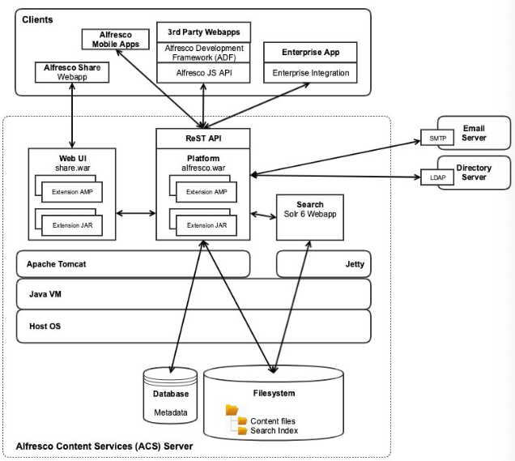
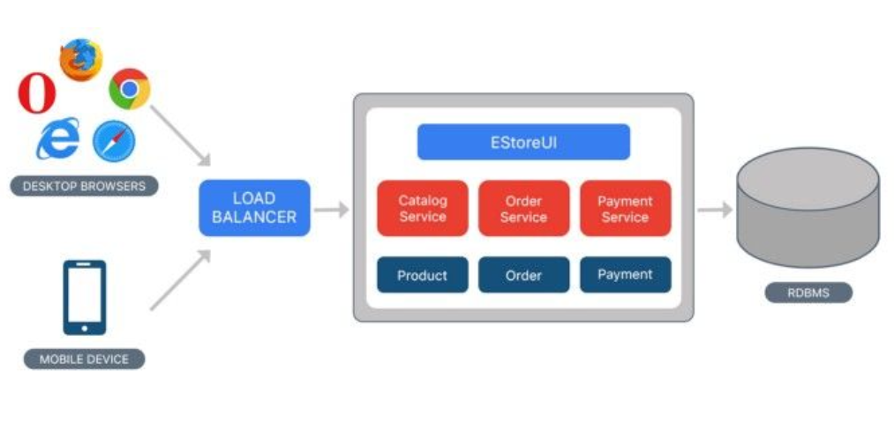
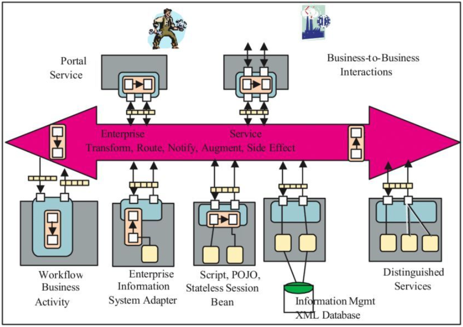
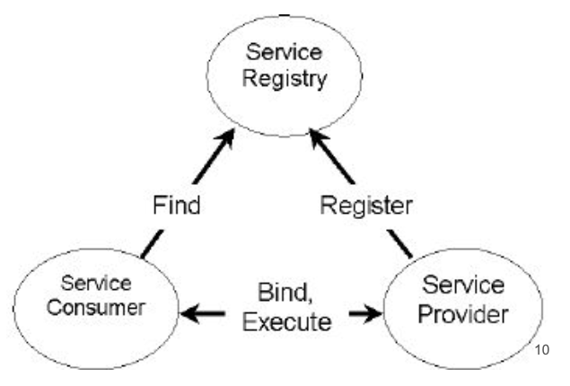
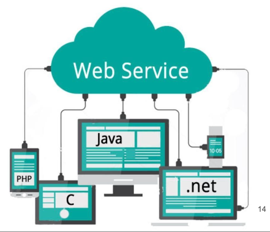
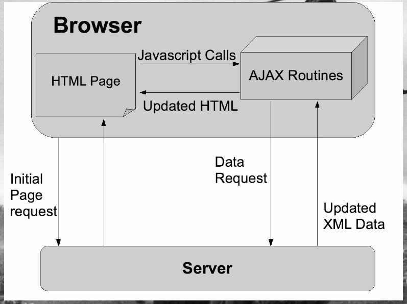

# Сервис-ориентированная архитектура

## 1. Введение

### Контекст проблемы

Современные информационные системы:
- Сложные.
- Распределённые и
гетерогенные.
- Часто используют
“зоопарк” технологий.
- Имеют длительный
жизненный цикл.
- Бизнес-требования
часто меняются.

### “Монолитная” архитектура

### Сервис-ориентированная архитектура

Приложение делится на модули – сервисы. Сервисы:
- Изолированы друг от друга.
- Обладают слабой связанностью (low coupling).
- Заменяемы.
- Общаются по стандартизированным протоколам.
- Нет никакого индустриального стандарта – можно использовать любые технологии.

### Принципы SOA

- Standardized Contract – интерфейсы взаимодействия должны быть чётко специфицированы.
- Reference Autonomy – взаимосвязи между сервисами должны быть сведены к минимуму.
- Location Transparency – то, где физически располагается сервис, не должно иметь значения при взаимодействии с ним.
- Longevity – сервисы должны разрабатываться с учётом возможности их длительного использования.
- Abstraction – внутренняя логика сервиса должна быть скрыта от клиента.
- Autonomy – сервисы должны самостоятельно контролировать собственную функциональность.
- Statelessness – сервис не должен сохранять состояние между обращениями к нему.
- Granularity – сервис должен реализовывать чётко специфицированный и логически обоснованный набор функций.
- Normalization – сервисы должны быть декомпозированы и нормализованы, чтобы минимизировать избыточность. 
- Composability – функциональность сервиса может строиться на базе функциональности других сервисов.
- Discovery – сервисы должны сопровождаться метаданными, позволяющими эффективно идентифицировать и использовать их.
- Reusability – логика приложения разбивается на локальные сервисы, что позволяет повторно использовать код.
- Encapsulation – в сервисы можно “оборачивать” функциональность приложений, построенных по принципам, отличным от SOA.

### Структура приложения

Любая SOA-система состоит из трёх видов “блоков”:

- Поставщик (service provider).
- Брокер (broker) / реестр (registry) / репозиторий (repository).
- Потребитель (requester / consumer).

### Подходы к реализации, стандарты и протоколы

Тысячи их (SOA – это не только веб-сервисы!):
- Веб-сервисы на базе WSDL и SOAP.
- Системы обмена сообщениями (JMS, ActiveMQ / RabbitMQ).
- RESTful HTTP.
- WCF (by M$).
- Apache Thrift.
- gRPC (by Google).
- Микросервисы.

### Pros & Cons

Достоинства:
- Декомпозиция модулей.
- Можно использовать в разных модулях разные технологии.
- Можно модернизировать модули независимо друг от друга.
- (Теоретически) лучшая масштабируемость.
- Удобная интеграция “из коробки”.

Недостатки:
- Усложнение архитектуры.
- Система теряет целостность.
- Сложнее тестировать.
- Сложнее поддерживать.

## 2. Веб-сервисы

### Что такое веб-сервис

- Сервис, реализуемый одним устройством и используемый другими устройствами, взаимодействующими с первым через интернет.
- Приложение, запущенное на ЭВМ, “слушающее” запросы на определённом порту и возвращающее в ответ на них статический или динамический контент.

### Особенности веб-сервисов

- “Жёсткой” спецификации нет.
- Зато есть общие подходы к реализации.
- Практически любое веб-приложение подходит под определение веб-сервиса.
- В общем случае, веб-сервис более специализирован по сравнению с веб- приложением.

### Какие бывают веб-сервисы

- AJAX.
- RESTful.
- Использующие языки спецификации веб-
сервисов (WSDL, JSON-RPC etc).
- Стандартизированные W3C (на базе SOAP).
- Сервис может относиться сразу к нескольким категориям!

### AJAX

