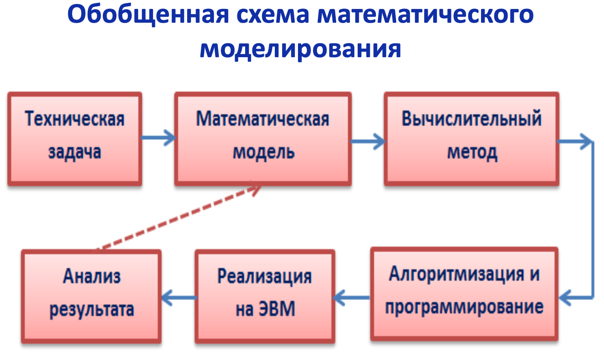

## [MainPage](../index.md)/[Computatioonal&Mathematics](README.md)/Exam

- [1.Основные свойства численных методов.(数字方法的主要特性)](#1основные-свойства-численных-методов数字方法的主要特性)
- [2. Этапы решения задач численными методами.(使用数值方法解决问题的步骤)](#2-этапы-решения-задач-численными-методами使用数值方法解决问题的步骤)
- [3. Решение систем линейных уравнений. Метод Гаусса.(高斯法)](#3-решение-систем-линейных-уравнений-метод-гаусса高斯法)
- [4. Метод Гаусса с выбором главного элемента.(高斯消元法)](#4-метод-гаусса-с-выбором-главного-элемента高斯消元法)
- [5. Метод Гаусса-Зейделя.(高斯赛德尔迭代)](#5-метод-гаусса-зейделя高斯赛德尔迭代)
- [6. Метод простой итерации.(简单迭代法)](#6-метод-простой-итерации简单迭代法)
- [7. Условия сходимости итерационных методов решения СЛАУ.(迭代法解线性方程组的收敛性)](#7-условия-сходимости-итерационных-методов-решения-слау迭代法解线性方程组的收敛性)
- [8. Методы решения нелинейных уравнений. Метод касательных.(解决非线性方程的方法。切线法。)](#8-методы-решения-нелинейных-уравнений-метод-касательных解决非线性方程的方法切线法)
- [9.  Метод деления отрезка пополам.(二分法)](#9--метод-деления-отрезка-пополам二分法)
- [10. Методы решения нелинейных уравнений. Метод простой итерации.(解决非线性方程,简单迭代法)](#10-методы-решения-нелинейных-уравнений-метод-простой-итерации解决非线性方程简单迭代法)

# 1.Основные свойства численных методов.(数字方法的主要特性)

- Устойчивость. Решение задачи $y^\ast$ называется устойчивым по исходным данным $x^\ast$, если оно зависит от исходных данных непрерывным образом. Это означает, что малому изменению исходных данных соответствует малое изменение решения. Алгоритм считается устойчивым, если он обеспечивает нахождение существующего и единственного решения при различных исходных данных.  
  可持续性。 如果 $y^\ast$ 问题的解以连续方式依赖于初始数据，则称它相对于初始数据 $x^\ast$ 是稳定的。 这意味着原始数据的微小变化对应于解决方案的微小变化。 如果算法为各种输入提供现有且唯一的解决方案，则该算法被认为是稳定的。
- Сходимость. Численное решение задачи должно стремиться к точному решению задачи.  
  收敛性。 问题的数值解应该趋向于问题的精确解。
  Алгоритм сходится, если последовательность приближений  
  算法收敛，如果近似序列

  $$x_1,x_2,\cdots,x_n\to x^\ast, n\to\infty, \lim_{n\to\infty}x_n=x^\ast$$

- Корректность. Численные методы применяются к корректно поставленным задачам.  
  正确性。 数值方法适用于适定问题。

  Задача называется поставленной корректно, если выполняются следующие условия:  
  如果满足以下条件，则称问题是适定的：

  1. решение задачи существует и единственно при любых допустимых исходных данных.  
    问题的解存在并且对于任何可接受的初始数据都是唯一的。
  2. решение устойчиво по отношению к малым изменениям исходных данных.
    解决方案相对于初始数据的微小变化是稳定的。

# 2. Этапы решения задач численными методами.(使用数值方法解决问题的步骤)

问题建模：将实际问题转化为数学模型。这涉及确定问题的目标、边界条件、约束条件和输入数据等。

离散化：将连续的问题转化为离散的形式。这包括将空间和时间划分为离散的网格或网点，以便在这些点上进行计算。

近似方法选择：选择适当的数值方法来近似问题的解。这取决于问题的性质和要求，可能涉及差分方法、插值方法、优化算法等。

算法设计：设计实现所选数值方法的计算算法。这包括确定迭代方案、数值格式和计算步骤等。

计算过程：执行计算算法以获得数值解。这涉及输入初始条件、迭代计算并更新解，直到满足收敛准则或达到预定的计算步数。

结果评估：评估数值解的准确性和可靠性。这包括分析解的误差、收敛性以及与实际问题的比较等。

结果解释：解释数值解的物理或实际意义，并根据需要进行结果的可视化和解释。

误差分析和改进：分析误差来源并识别改进的可能性。这可能涉及调整离散化参数、改进算法或选择更精确的数值方法等。

# 3. Решение систем линейных уравнений. Метод Гаусса.(高斯法)
消元阶段：将线性方程组表示为增广矩阵，其中包含系数矩阵和右侧常数向量。通过一系列行变换，将增广矩阵转化为上三角矩阵，其中主对角线上的元素都不为零。

回代阶段：从最后一行开始，逐步求解变量的值。将求解出的变量值代入上面的方程，依次向上进行回代，直到求解出所有变量的值。

- Прямые методы. Метод Гаусса 直接方法：高斯方法
    - Основан на приведении матрицы системы к треугольному виду так, чтобы ниже ее главной диагонали находились только нулевые элементы.  
      它基于将系统矩阵变为三角形，以便只有零元素位于其主对角线下方。
    - Прямой ход метода Гаусса состоит в последовательном исключении неизвестных из уравнений системы. Сначала с помощью первого уравнения исключается $x_1$ из всех последующих уравнений системы. Затем с помощью второго уравнения исключается $x_2$ из третьего и всех последующих уравнений и т.д.
      高斯方法的直接过程在于从系统方程中连续消除未知数。  首先，使用第一个方程，将 $x_1$ 从系统的所有后续方程中排除。然后，使用第二个方程，从第三个和所有后续方程中消去 $x_2$，依此类推。

      Этот процесс продолжается до тех пор, пока в левой части последнего (n-го) уравнения не останется лишь один член с неизвестным $x_n$ , т. е. матрица системы будет приведена к треугольному виду.  
      这个过程一直持续到最后一个（第 n 个）方程的左边只剩下一个未知的 $x_n$ 项，即系统的矩阵被简化为三角形。
    - Обратный ход метода Гаусса состоит в последовательном вычислении искомых неизвестных: решая последнее уравнение, находим единственное в этом уравнении неизвестное $x_n$. Далее, используя это значение, из предыдущего уравнения вычисляем $x_{n−1}$ и т. д. Последним найдем $x_1$ из первого уравнения.  
      Gauss 方法的反向过程包括所需未知数的顺序计算：通过求解最后一个方程，我们找到该方程中唯一的未知数 $x_n$。  然后，使用这个值，我们从前面的等式计算 $x_{n−1}$，依此类推。最后，我们从第一个等式中找到 $x_1$。

      Метод имеет много различных вычислительных схем, но в каждой из них основным требованием является $\det A \ne 0$.  
      该方法有许多不同的计算方案，但在每个方案中，主要要求是 $\det A \ne 0$。

    - Рассмотрим наиболее распространенную схему единственного деления. 考虑最常见的单除法方案：

      $$\begin{split}
      a_{11}x_1+a_{12}x_2+\cdots+a_{1n}x_n=b_1,\\
      a_{21}x_1+a_{22}x_2+\cdots+a_{2n}x_n=b_2,\\
      ...................................................\\
      a_{nn}x_1+a_{n2}x_2+\cdots+a_{nn}x_n=b_n
      \end{split}
      $$

      直接法：
      - Шаг 1 步骤 1
        Исключим $x_1$ из второго уравнения: умножим первое уравнение на $(−a_{21}/ a_{11})$ и прибавим ко второму.  
        从第二个等式中消去 $x_1$：将第一个等式乘以 $(−a_{21}/ a_{11})$ 并添加到第二个等式中。

        Исключим $x_1$ из третьего уравнения: умножим первое уравнение на $(− a_{31}/a_{11})$ и прибавим к третьему...  
        从第三个等式中消去 $x_1$：将第一个等式乘以 $(− a_{31}/a_{11})$ 并添加到第三个...

        Исключим $x_1$ из последнего уравнения: умножим первое уравнение на $(− a_{n1}/ a_{11})$ и прибавим к последнему. Получим равносильную систему уравнений (2):  
        从最后一个等式中消去 $x_1$：将第一个等式乘以 $(− a_{n1}/ a_{11})$ 并添加到最后一个等式中。 我们得到一个等价的方程组（2）：

        $$\begin{split}
          a_{11}x_1+a_{12}x_2+a_{13}x_3+\cdots+a_{1n}x_n &=b_1,\\
          a_{22}^{(1)}x_2+a_{23}^{(1)}x_3+\cdots+a_{2n}^{(1)}x_n &=b_2^{(1)},\\
          a_{32}^{(1)}x_2+a_{33}^{(1)}x_3+\cdots+a_{3n}^{(1)}x_n &=b_3^{(1)}\\
          \cdots&=\cdots\\
          a_{n2}^{(1)}x_2+a_{n3}^{(1)}x_3+\cdots+a_{nn}^{(1)}x_n &=b_n^{(1)}
        \end{split}\qquad
        \begin{split}
          a_{ij}^{(1)}=a_{ij}-\frac{a_{i1}}{a_{11}}a_{1j},i,j=2,3,\cdots,n\\
          b_{i}^{(1)}=b_i-\frac{a_{i1}}{a_{11}}b_1,i=2,3,\cdots,n\\
        \end{split}
        $$

      - Шаг 2: 
        Исключим $x_2$ из третьего уравнения: умножим второе уравнение на $(-a'_{32}/a'_{22})$ и прибавим к третьему (и т.д. для следующих уравнений)  
        从第三个等式中消去 $x2$：将第二个等式乘以 $(-a'_{32}/a'_{22})$ 并添加到第三个等式（以此类推以下等式）

        Исключим $x_2$ из последнего уравнения: умножим второе уравнение на $(-a'_{n2}/a'_{22})$ и прибавим к последнему.  
        从最后一个等式中消去 $x_2$：将第二个等式乘以 $(-a'_{n2}/a'_{22})$ 并添加到最后一个等式中。

        Получим:

        $$
        \begin{split}
          a_{11}x_1+a_{12}x_2+a_{13}x_3+\cdots+a_{1n}x_n &=b_1,\\
          a_{22}^{(1)}x_2+a_{23}^{(1)}x_3+\cdots+a_{2n}^{(1)}x_n &=b_2^{(1)},\\
          a_{33}^{(2)}x_3+\cdots+a_{3n}^{(2)}x_n &=b_3^{(2)}\\
          \cdots&=\cdots\\
          a_{n3}^{(2)}x_3+\cdots+a_{nn}^{(2)}x_n &=b_n^{(2)}
        \end{split}
        \qquad
        \begin{split}
          a_{ij}^{(2)}=a_{ij}^{(1)}-\frac{a_{i2}^{(1)}}{a_{22}^{(1)}}a_{2j},i,j=3,4,\cdots,n\\
          b_{i}^{(2)}=b_i^{(1)}-\frac{a_{i2}^{(1)}}{a_{22}^{(1)}}b_2^{(1)},i=3,4,\cdots,n\\
        \end{split}
        $$

      Продолжим до тех пор, пока матрица системы (3) не примет треугольный вид (4):  
      我们继续直到系统 (3) 的矩阵采用三角形形式 (4)：

      $$\begin{split}
          a_{11}x_1+a_{12}x_2+a_{13}x_3+\cdots+a_{1n}x_n &=b_1,\\
          a_{22}^{(1)}x_2+a_{23}^{(1)}x_3+\cdots+a_{2n}^{(1)}x_n &=b_2^{(1)},\\
          a_{33}^{(2)}x_3+\cdots+a_{3n}^{(2)}x_n &=b_3^{(2)}\\
          \cdots&=\cdots\\
          a_{nn}^{(n-1)}x_n &=b_n^{(n-1)}
        \end{split}
      $$

      Матрица системы (4) имеет треугольный вид  конец прямого хода.

      Требование : Если в процессе исключения неизвестных, коэффициенты:

      $$a_{11},a_{22}^1,a_{33}^2,\cdots=0$$

      тогда необходимо соответственным образом переставить уравнения системы.

      Перестановка уравнений должна быть предусмотрена в вычислительном алгоритме при его реализации на компьютере.

      **Обратный ход:**

      $$\begin{split}
        &x_n=b_n^{(n-1)}/a_{nn}^{(n-1)}\\
        &.......\\
        &x_2=\frac{1}{a_{22}^{(1)}}(b_2^{(1)}-a_{23}^{(1)}x_3-\cdots-a_{2n}^{(1)}x_n)\\
        &x_1=\frac{1}{a_{11}}(b_1^-a_{12}x_2-a_{13}x_3-\cdots-a_{1n}x_n)
      \end{split}$$

      Трудоемкость метода. Для реализации метода Гаусса требуется примерно $2/3 n^3$ операций для прямого хода и n2 операций для обратного хода.
      
      Общее количество операций: $2/3 n^3 + n^2$.

# 4. Метод Гаусса с выбором главного элемента.(高斯消元法)
首先，将线性方程组表示为增广矩阵，其中包含系数矩阵和右侧常数向量。

在每个消元步骤中，选择主元元素，即在当前列中绝对值最大的元素。这样可以减小舍入误差并提高计算的准确性。

如果选择的主元不在当前行，需要进行行交换，将主元所在的行移到当前行的位置。

使用所选的主元元素将当前列的其他元素消为零。为此，将当前行乘以适当的倍数，并从下面的行中减去该倍数乘以主元所在列的元素。

重复上述步骤，逐渐将增广矩阵转化为上三角形式。

在回代阶段，从最后一行开始，逐步求解变量的值。将求解出的变量值代入上面的方程，依次向上进行回代，直到求解出所有变量的值。

通过使用主元选择，高斯消元法可以减小舍入误差并提高数值解的准确性。这种方法对于处理病态（ill-conditioned）的方程组尤为有用，其中系数矩阵的条件数较大。

# 5. Метод Гаусса-Зейделя.(高斯赛德尔迭代)
高斯-塞德尔方法是一种逐步逼近的方法，它在每个迭代步骤中使用最新的估计值来更新解向量。相比于高斯消元法，高斯-塞德尔方法的收敛速度更快，尤其在对角元素相对较大的对称正定矩阵中效果更好。

然而，需要注意的是，高斯-塞德尔方法并不总是收敛。对于某些线性方程组，可能需要进一步的技术手段来确保收敛性和稳定性。

# 6. Метод простой итерации.(简单迭代法)

# 7. Условия сходимости итерационных методов решения СЛАУ.(迭代法解线性方程组的收敛性)
矩阵范数条件：迭代矩阵的范数应小于1。这是最常见的收敛条件之一。常见的矩阵范数有1-范数、2-范数和无穷大范数等。

对角占优条件：如果系数矩阵的每一行（或每一列）的对角元素的绝对值大于等于该行（或该列）其他元素绝对值之和，那么称系数矩阵满足对角占优条件。对角占优条件有助于确保迭代法的收敛性。

正定矩阵条件：如果系数矩阵是对称正定的，那么迭代法通常会收敛。对称正定矩阵具有一些特殊性质，可以确保迭代法的收敛性。

对称性条件：对称的系数矩阵通常有助于迭代法的收敛。对称矩阵具有一些特殊的性质，可以简化迭代算法并提高收敛速度。

# 8. Методы решения нелинейных уравнений. Метод касательных.(解决非线性方程的方法。切线法。)
方法在非线性方程求解中是一种常用的数值方法之一。也称为牛顿迭代法。它通过利用函数的切线来逐步逼近方程的根。具体步骤如下：

选择初始估计值x₀。

计算函数在 $x₀$ 处的值 $f(x₀)$ 和导数在x₀处的值 $f'(x₀)$。

使用切线的斜率来计算下一个近似根x₁。计算公式如下：
$$x₁ = x₀ - f(x₀)/f'(x₀)$$

重复步骤2和步骤3，计算下一个近似根，直到满足预先设定的停止准则，如误差小于一定阈值或达到最大迭代次数。

返回最终的近似根。

牛顿法的优点是收敛速度通常很快，尤其是当初始估计值接近根时。然而，它也有一些注意事项：

初始估计值的选择很重要，不同的初始估计值可能会导致不同的根或迭代过程不收敛。
在某些情况下，牛顿法可能会陷入局部最小值或发散，特别是在函数具有复杂性或奇点的情况下。
对于方程组的求解，需要使用扩展的牛顿法，也称为牛顿-拉夫逊法。

# 9.  Метод деления отрезка пополам.(二分法)
二分法（又称为区间减半法或二分搜索法）是一种常用的数值方法，用于解决非线性方程的数值逼近。它通过将待求解的区间逐步减半，直到找到方程的根或达到预定的精度要求。具体步骤如下：

选择一个包含根的初始区间 $[a, b]$，确保方程在该区间内是连续的且根存在。

计算区间中点 $c = (a + b) / 2$。

计算函数在中点 c 处的值 $f(c)$。

检查 $f(c)$ 是否接近于零，或是否满足预定的精度要求。如果满足条件，则 c 是方程的近似根，算法结束。

如果 $f(c)$ 与零的符号相同，则将 c 作为新的右区间边界 b，并返回步骤2。

如果 $f(c)$ 与零的符号相反，则将 c 作为新的左区间边界 a，并返回步骤2。

重复步骤2到步骤6，直到找到方程的根或达到预定的精度要求。

二分法的优点是简单易懂，每一步都可以确保区间中包含根，并且收敛速度相对较快。然而，它也有一些注意事项：

初始区间的选择很重要，不同的初始区间可能导致不同的根或迭代过程不收敛。
如果方程在区间的端点上没有变号，二分法可能无法找到根。
对于具有多个根的方程，二分法只能找到一个根。

# 10. Методы решения нелинейных уравнений. Метод простой итерации.(解决非线性方程,简单迭代法)
它通过将原始方程转化为等价的迭代形式，逐步逼近方程的根。具体步骤如下：

将非线性方程表示为函数的形式，即 $f(x) = 0$。

将方程转化为迭代形式，即 $x = g(x)$，其中 $g(x)$ 是新的函数形式。

选择初始估计值 $x₀$。

通过以下迭代步骤更新估计值 x 的值：
$$x₁ = g(x₀)$$
$$x₂ = g(x₁)$$
$$...$$
$$xₙ₊₁ = g(xₙ)$$

重复步骤4，直到满足预设的停止准则，如误差小于一定阈值或达到最大迭代次数。

返回最终的近似根 $xₙ$。

简单迭代法的成功与否取决于迭代函数 g(x) 的选择和初始估计值 x₀ 的选取。对于迭代函数 $g(x)$，需要满足以下条件以确保收敛性：

在根附近，$g(x)$ 的导数的绝对值小于 1，即 $|g'(x)| < 1$。
$g(x)$ 在根附近是连续的。
此外，初始估计值 x₀ 的选择也很重要。不同的初始估计值可能导致不同的根或迭代过程不收敛。

需要注意的是，简单迭代法可能遇到收敛速度慢的问题，特别是在接近根的情况下。为了提高迭代的收敛速度，可以使用其他更高级的迭代方法，如牛顿法或割线法。

