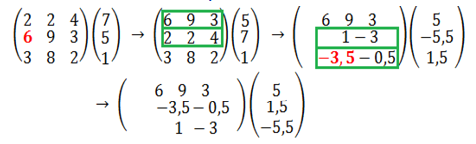
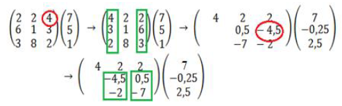

<head>
    
    
</head>

## [MainPage](../index.md)/[Computatioonal&Mathematics](README.md)/Exam

- [1.Основные свойства численных методов.(数字方法的主要特性)](#1основные-свойства-численных-методов数字方法的主要特性)
- [2. Этапы решения задач численными методами.(使用数值方法解决问题的步骤)](#2-этапы-решения-задач-численными-методами使用数值方法解决问题的步骤)
- [3. Решение систем линейных уравнений. Метод Гаусса.(高斯法)](#3-решение-систем-линейных-уравнений-метод-гаусса高斯法)
- [4. Метод Гаусса с выбором главного элемента.(高斯消元法)](#4-метод-гаусса-с-выбором-главного-элемента高斯消元法)
- [5. Метод Гаусса-Зейделя.(高斯赛德尔迭代)](#5-метод-гаусса-зейделя高斯赛德尔迭代)
- [6. Метод простой итерации.(简单迭代法)](#6-метод-простой-итерации简单迭代法)
- [7. Условия сходимости итерационных методов решения СЛАУ.(迭代法解线性方程组的收敛性)](#7-условия-сходимости-итерационных-методов-решения-слау迭代法解线性方程组的收敛性)
- [8. Методы решения нелинейных уравнений. Метод касательных.(解决非线性方程的方法。切线法。)](#8-методы-решения-нелинейных-уравнений-метод-касательных解决非线性方程的方法切线法)
- [9.  Метод деления отрезка пополам.(二分法)](#9--метод-деления-отрезка-пополам二分法)
- [10. Методы решения нелинейных уравнений. Метод простой итерации.(解决非线性方程,简单迭代法)](#10-методы-решения-нелинейных-уравнений-метод-простой-итерации解决非线性方程简单迭代法)

# 1.Основные свойства численных методов.(数字方法的主要特性)

- Устойчивость. Решение задачи $y^\ast$ называется устойчивым по исходным данным $x^\ast$, если оно зависит от исходных данных непрерывным образом. Это означает, что малому изменению исходных данных соответствует малое изменение решения. Алгоритм считается устойчивым, если он обеспечивает нахождение существующего и единственного решения при различных исходных данных.  
  可持续性。 如果 $y^\ast$ 问题的解以连续方式依赖于初始数据，则称它相对于初始数据 $x^\ast$ 是稳定的。 这意味着原始数据的微小变化对应于解决方案的微小变化。 如果算法为各种输入提供现有且唯一的解决方案，则该算法被认为是稳定的。
- Сходимость. Численное решение задачи должно стремиться к точному решению задачи.  
  收敛性。 问题的数值解应该趋向于问题的精确解。
  Алгоритм сходится, если последовательность приближений  
  算法收敛，如果近似序列

  $$x_1,x_2,\cdots,x_n\to x^\ast, n\to\infty, \lim_{n\to\infty}x_n=x^\ast$$

- Корректность. Численные методы применяются к корректно поставленным задачам.  
  正确性。 数值方法适用于适定问题。

  Задача называется поставленной корректно, если выполняются следующие условия:  
  如果满足以下条件，则称问题是适定的：

  1. решение задачи существует и единственно при любых допустимых исходных данных.  
    问题的解存在并且对于任何可接受的初始数据都是唯一的。
  2. решение устойчиво по отношению к малым изменениям исходных данных.
    解决方案相对于初始数据的微小变化是稳定的。

# 2. Этапы решения задач численными методами.(使用数值方法解决问题的步骤)

问题建模：将实际问题转化为数学模型。这涉及确定问题的目标、边界条件、约束条件和输入数据等。

离散化：将连续的问题转化为离散的形式。这包括将空间和时间划分为离散的网格或网点，以便在这些点上进行计算。

近似方法选择：选择适当的数值方法来近似问题的解。这取决于问题的性质和要求，可能涉及差分方法、插值方法、优化算法等。

算法设计：设计实现所选数值方法的计算算法。这包括确定迭代方案、数值格式和计算步骤等。

计算过程：执行计算算法以获得数值解。这涉及输入初始条件、迭代计算并更新解，直到满足收敛准则或达到预定的计算步数。

结果评估：评估数值解的准确性和可靠性。这包括分析解的误差、收敛性以及与实际问题的比较等。

结果解释：解释数值解的物理或实际意义，并根据需要进行结果的可视化和解释。

误差分析和改进：分析误差来源并识别改进的可能性。这可能涉及调整离散化参数、改进算法或选择更精确的数值方法等。

# 3. Решение систем линейных уравнений. Метод Гаусса.(高斯法)
消元阶段：将线性方程组表示为增广矩阵，其中包含系数矩阵和右侧常数向量。通过一系列行变换，将增广矩阵转化为上三角矩阵，其中主对角线上的元素都不为零。

回代阶段：从最后一行开始，逐步求解变量的值。将求解出的变量值代入上面的方程，依次向上进行回代，直到求解出所有变量的值。

- Прямые методы. Метод Гаусса 直接方法：高斯方法
    - Основан на приведении матрицы системы к треугольному виду так, чтобы ниже ее главной диагонали находились только нулевые элементы.  
      它基于将系统矩阵变为三角形，以便只有零元素位于其主对角线下方。
    - Прямой ход метода Гаусса состоит в последовательном исключении неизвестных из уравнений системы. Сначала с помощью первого уравнения исключается $x_1$ из всех последующих уравнений системы. Затем с помощью второго уравнения исключается $x_2$ из третьего и всех последующих уравнений и т.д.
      高斯方法的直接过程在于从系统方程中连续消除未知数。  首先，使用第一个方程，将 $x_1$ 从系统的所有后续方程中排除。然后，使用第二个方程，从第三个和所有后续方程中消去 $x_2$，依此类推。

      Этот процесс продолжается до тех пор, пока в левой части последнего (n-го) уравнения не останется лишь один член с неизвестным $x_n$ , т. е. матрица системы будет приведена к треугольному виду.  
      这个过程一直持续到最后一个（第 n 个）方程的左边只剩下一个未知的 $x_n$ 项，即系统的矩阵被简化为三角形。
    - Обратный ход метода Гаусса состоит в последовательном вычислении искомых неизвестных: решая последнее уравнение, находим единственное в этом уравнении неизвестное $x_n$. Далее, используя это значение, из предыдущего уравнения вычисляем $x_{n−1}$ и т. д. Последним найдем $x_1$ из первого уравнения.  
      Gauss 方法的反向过程包括所需未知数的顺序计算：通过求解最后一个方程，我们找到该方程中唯一的未知数 $x_n$。  然后，使用这个值，我们从前面的等式计算 $x_{n−1}$，依此类推。最后，我们从第一个等式中找到 $x_1$。

      Метод имеет много различных вычислительных схем, но в каждой из них основным требованием является $\det A \ne 0$.  
      该方法有许多不同的计算方案，但在每个方案中，主要要求是 $\det A \ne 0$。

    - Рассмотрим наиболее распространенную схему единственного деления. 考虑最常见的单除法方案：

      $$\begin{split}
      a_{11}x_1+a_{12}x_2+\cdots+a_{1n}x_n=b_1,\\
      a_{21}x_1+a_{22}x_2+\cdots+a_{2n}x_n=b_2,\\
      ...................................................\\
      a_{n1}x_1+a_{n2}x_2+\cdots+a_{nn}x_n=b_n
      \end{split}
      $$

      直接法：
      - Шаг 1 步骤 1
        Исключим $x_1$ из второго уравнения: умножим первое уравнение на $(−a_{21}/ a_{11})$ и прибавим ко второму.  
        从第二个等式中消去 $x_1$：将第一个等式乘以 $(−a_{21}/ a_{11})$ 并添加到第二个等式中。

        Исключим $x_1$ из третьего уравнения: умножим первое уравнение на $(− a_{31}/a_{11})$ и прибавим к третьему...  
        从第三个等式中消去 $x_1$：将第一个等式乘以 $(− a_{31}/a_{11})$ 并添加到第三个...

        Исключим $x_1$ из последнего уравнения: умножим первое уравнение на $(− a_{n1}/ a_{11})$ и прибавим к последнему. Получим равносильную систему уравнений (2):  
        从最后一个等式中消去 $x_1$：将第一个等式乘以 $(− a_{n1}/ a_{11})$ 并添加到最后一个等式中。 我们得到一个等价的方程组（2）：

        $$\begin{split}
          a_{11}x_1+a_{12}x_2+a_{13}x_3+\cdots+a_{1n}x_n &=b_1,\\
          a_{22}^{(1)}x_2+a_{23}^{(1)}x_3+\cdots+a_{2n}^{(1)}x_n &=b_2^{(1)},\\
          a_{32}^{(1)}x_2+a_{33}^{(1)}x_3+\cdots+a_{3n}^{(1)}x_n &=b_3^{(1)}\\
          \cdots&=\cdots\\
          a_{n2}^{(1)}x_2+a_{n3}^{(1)}x_3+\cdots+a_{nn}^{(1)}x_n &=b_n^{(1)}
        \end{split}\qquad
        \begin{split}
          a_{ij}^{(1)}=a_{ij}-\frac{a_{i1}}{a_{11}}a_{1j},i,j=2,3,\cdots,n\\
          b_{i}^{(1)}=b_i-\frac{a_{i1}}{a_{11}}b_1,i=2,3,\cdots,n\\
        \end{split}
        $$

      - Шаг 2: 
        Исключим $x_2$ из третьего уравнения: умножим второе уравнение на $(-a'_{32}/a'_{22})$ и прибавим к третьему (и т.д. для следующих уравнений)  
        从第三个等式中消去 $x2$：将第二个等式乘以 $(-a'_{32}/a'_{22})$ 并添加到第三个等式（以此类推以下等式）

        Исключим $x_2$ из последнего уравнения: умножим второе уравнение на $(-a'_{n2}/a'_{22})$ и прибавим к последнему.  
        从最后一个等式中消去 $x_2$：将第二个等式乘以 $(-a'_{n2}/a'_{22})$ 并添加到最后一个等式中。

        Получим:

        $$
        \begin{split}
          a_{11}x_1+a_{12}x_2+a_{13}x_3+\cdots+a_{1n}x_n &=b_1,\\
          a_{22}^{(1)}x_2+a_{23}^{(1)}x_3+\cdots+a_{2n}^{(1)}x_n &=b_2^{(1)},\\
          a_{33}^{(2)}x_3+\cdots+a_{3n}^{(2)}x_n &=b_3^{(2)}\\
          \cdots&=\cdots\\
          a_{n3}^{(2)}x_3+\cdots+a_{nn}^{(2)}x_n &=b_n^{(2)}
        \end{split}
        \qquad
        \begin{split}
          a_{ij}^{(2)}=a_{ij}^{(1)}-\frac{a_{i2}^{(1)}}{a_{22}^{(1)}}a_{2j},i,j=3,4,\cdots,n\\
          b_{i}^{(2)}=b_i^{(1)}-\frac{a_{i2}^{(1)}}{a_{22}^{(1)}}b_2^{(1)},i=3,4,\cdots,n\\
        \end{split}
        $$

      Продолжим до тех пор, пока матрица системы (3) не примет треугольный вид (4):  
      我们继续直到系统 (3) 的矩阵采用三角形形式 (4)：

      $$\begin{split}
          a_{11}x_1+a_{12}x_2+a_{13}x_3+\cdots+a_{1n}x_n &=b_1,\\
          a_{22}^{(1)}x_2+a_{23}^{(1)}x_3+\cdots+a_{2n}^{(1)}x_n &=b_2^{(1)},\\
          a_{33}^{(2)}x_3+\cdots+a_{3n}^{(2)}x_n &=b_3^{(2)}\\
          \cdots&=\cdots\\
          a_{nn}^{(n-1)}x_n &=b_n^{(n-1)}
        \end{split}
      $$

      Матрица системы (4) имеет треугольный вид  конец прямого хода.  
      系统 (4) 的矩阵在向前行程的末端具有三角形形状。

      Требование : Если в процессе исключения неизвестных, коэффициенты:  
      要求：若在消除未知数的过程中，系数：

      $$a_{11},a_{22}^1,a_{33}^2,\cdots=0$$

      тогда необходимо соответственным образом переставить уравнения системы.  
      那么就需要相应地重新排列系统的方程。

      Перестановка уравнений должна быть предусмотрена в вычислительном алгоритме при его реализации на компьютере.  
      当计算算法在计算机上实现时，必须在计算算法中提供方程的重新排列。

      **Обратный ход:**

      $$\begin{split}
        &x_n=b_n^{(n-1)}/a_{nn}^{(n-1)}\\
        &.......\\
        &x_2=\frac{1}{a_{22}^{(1)}}(b_2^{(1)}-a_{23}^{(1)}x_3-\cdots-a_{2n}^{(1)}x_n)\\
        &x_1=\frac{1}{a_{11}}(b_1^-a_{12}x_2-a_{13}x_3-\cdots-a_{1n}x_n)
      \end{split}$$

      Трудоемкость метода. Для реализации метода Гаусса требуется примерно $2/3 n^3$ операций для прямого хода и n2 операций для обратного хода.  
      该方法的复杂性。 为了实现高斯方法，正向行程大约需要 $2/3 n^3$ 运算，反向行程大约需要 n2 次运算。
      
      Общее количество операций: $2/3 n^3 + n^2$.  
      操作总数：$2/3 n^3 + n^2$。

# 4. Метод Гаусса с выбором главного элемента.(高斯消元法)

首先，将线性方程组表示为增广矩阵，其中包含系数矩阵和右侧常数向量。

在每个消元步骤中，选择主元元素，即在当前列中绝对值最大的元素。这样可以减小舍入误差并提高计算的准确性。

如果选择的主元不在当前行，需要进行行交换，将主元所在的行移到当前行的位置。

使用所选的主元元素将当前列的其他元素消为零。为此，将当前行乘以适当的倍数，并从下面的行中减去该倍数乘以主元所在列的元素。

重复上述步骤，逐渐将增广矩阵转化为上三角形式。

在回代阶段，从最后一行开始，逐步求解变量的值。将求解出的变量值代入上面的方程，依次向上进行回代，直到求解出所有变量的值。

通过使用主元选择，高斯消元法可以减小舍入误差并提高数值解的准确性。这种方法对于处理病态（ill-conditioned）的方程组尤为有用，其中系数矩阵的条件数较大。

- Прямые методы. Метод Гаусса с выбором главного элемента  
  直接方法。 选择主要元素的高斯方法

  Схема с выбором главного элемента является одной из модификаций метода Гаусса.  
  选择主元素的方案是高斯方法的修改之一。

  Среди ведущих элементов могут оказаться очень маленькие по абсолютной величине. При делении на такие ведущие элементы получается большая погрешность округления (вычислительная погрешность).  
  在主导元素中，可能存在绝对值很小的元素。 当除以此类前导元素时，会得到较大的舍入误差（计算误差）。

  Идеей метода Гаусса с выбором главного элемента является такая перестановка уравнений, чтобы на k-ом шаге исключения ведущим элементом 𝑎𝑖𝑖 оказывался наибольший по модулю элемент k-го столбца.  
  选择主元素的高斯方法的思想是对方程进行这样的重新排列，以便在第 k 步消除时，主元素 𝑎𝑖𝑖 变成第 k 列的元素，其中最大绝对值。

  Т.е. на очередном шаге k в уравнениях, начиная от k до последнего ( i=k,k+1,...,n ) в столбце k выбирают максимальный по модулю элемент и строки i и k меняются местами. Это выбор главного элемента «по столбцу».  
  那些。 在方程的下一步 k 中，从第 k 列开始到最后一个 ( i=k,k+1,...,n )，选择具有最大绝对值的元素，并交换第 i 行和第 k 行。 这是“按列”选择主要元素。

  Выбор главного элемента «по строке» - на очередном шаге k в строке k, начиная со столбца k ( j=k,k+1,...,n ) справа выбирается максимальный по модулю элемент. Столбцы j и k меняются местами.  
  “按行”选择主要元素 - 在第 k 行的下一步 k 中，从右侧的第 k 列 ( j=k,k+1,...,n) 开始，选择绝对值最大的元素。 j 列和 k 列交换。

  Выбор главного элемента «по столбцу»:  
  “按列”选择主要元素：

  

  Выбор главного элемента «по строке»:  
  “按行”选择主要元素：

  

# 5. Метод Гаусса-Зейделя.(高斯赛德尔迭代)

高斯-塞德尔方法是一种逐步逼近的方法，它在每个迭代步骤中使用最新的估计值来更新解向量。相比于高斯消元法，高斯-塞德尔方法的收敛速度更快，尤其在对角元素相对较大的对称正定矩阵中效果更好。

然而，需要注意的是，高斯-塞德尔方法并不总是收敛。对于某些线性方程组，可能需要进一步的技术手段来确保收敛性和稳定性。

Метод Гаусса-Зейделя является модификацией метода простой итерации и обеспечивает более быструю сходимость к решению системы уравнений.  
Gauss-Seidel 方法是简单迭代方法的改进，为求解方程组提供更快的收敛速度。

Идея метода: при вычислении компонента $x_i^{(k+1)}$ вектора неизвестных на $(k+1)$-й итерации используются $x_1^{(k+1)},x_2^{(k+1)},\cdots,x_{i-1}^{(k+1)}$, уже вычисленные на $(k+1)$-й итерации. Значения остальных компонент $x_{i+1}^{(k+1)},x_{i+2}^{(k+1)},\cdots,x_n^{(k+1)}$ берутся из предыдущей итерации.  
方法思想：在第 $(k+1)$ 次迭代计算未知向量的分量 $x_i^{(k+1)}$ 时，$x_1^{(k+1)} ,x_2^{(k+1)},\cdots,x_{i-1}^{(k+1)}$，已在第 $(k+1)$ 次迭代中计算。其余分量的值 $x_{i+1}^{(k+1)},x_{i+2}^{(k+1)},\cdots,x_n^{(k+1) }$ 取自之前的迭代。

Так же как и в методе простых итераций строится эквивалентная СЛАУ и за начальное приближение принимается вектор правых частей (как правило, но может быть выбран и нулевой вектор):  $x_i^0=(d_1,d_2,\cdots,d_n)$.  
与简单迭代法一样，构造一个等价的 SLAE，并取右侧向量作为初始近似值（作为规则，但也可以选择零向量）： $x_i^0=(d_1,d_2 ,\cdots,d_n)$。

$$\begin{cases}
    x_1=c_{11}x_1 + c_{12}x_2 + \cdots + c_{1n}x_n + d_1\\
    x_2=c_{21}x_1 + c_{22}x_2 + \cdots + c_{2n}x_n + d_2\\
    ...................................................\\
    x_n=c_{n1}x_1 + c_{n2}x_2 + \cdots + c_{nn}x_n + d_n\\
\end{cases}$$

Тогда приближения к решению системы методом Зейделя  определяются следующей системой равенств:  
然后，通过 Seidel 方法对系统解的近似由以下方程组确定：

$$\begin{cases}
    x_1^{(k+1)}=c_{11}x_1^{(k)} + c_{12}x_2^{(k)} + \cdots + c_{1n}x_n^{(k)} + d_1\\
    x_2^{(k+1)}=c_{21}x_1^{(k+1)} + c_{22}x_2^{(k)} + \cdots + c_{2n}x_n^{(k)} + d_2\\
    x_3^{(k+1)}=c_{31}x_1^{(k+1)} + c_{32}x_2^{(k+1)} + c_{33}x_3^{(k)} + \cdots + c_{3n}x_n^{(k)} + d_3\\
    ...................................................\\
    x_n^{(k+1)}=c_{n1}x_1^{(k)} + c_{n2}x_2^{(k)} + \cdots + c_{nn}x_n^{(k)} + d_n\\
\end{cases}$$

Рабочая формула метода Гаусса-Зейделя:  
高斯-赛德尔法的工作公式：

$$x_i^{(k+1)}=\frac{b_i}{a_{ii}}-\sum_{j=1}^{i-1}\frac{a_{ij}}{a_{ii}}x_j^{k+1}-\sum_{j=i+1}^n\frac{a_{ij}}{a_{ii}}x_j^k\quad i=1,2,\cdots,n$$

Итерационный процесс продолжается до тех пор, пока:  
迭代过程一直持续到：

$$|x_1^{(k)}-x_1^{(k-1)}|\le\varepsilon, |x_2^{(k)}-x_2^{(k-1)}|\le\varepsilon,|x_3^{(k)}-x_3^{(k-1)}|\le\varepsilon$$

Достоинства метода: 
- Является универсальным и простым для реализации на ЭВМ.
- Обеспечивает более быструю сходимость (по сравнению с методом постой итерации) 

Недостатки метода: 
- Является трудоемким

该方法的优点：
- 它是通用的并且易于在计算机上实现。
- 提供更快的收敛（与不断迭代方法相比）

该方法的缺点：
- 有一定难度

# 6. Метод простой итерации.(简单迭代法)

Рассмотрим систему линейных уравнений с невырожденной матрицей ($det\ A\ne 0$):  
考虑具有非奇异矩阵 ($det\ A\ne 0$) 的线性方程组：

$$\begin{cases}
    a_{11}x_1+a_{12}x_2+\cdots+a_{1n}x_n=b_1,\\
    a_{21}x_1+a_{22}x_2+\cdots+a_{2n}x_n=b_2,\\
    ...................................................\\
    a_{n1}x_1+a_{n2}x_2+\cdots+a_{nn}x_n=b_n
\end{cases}\qquad(5)$$

Приведем систему уравнений к виду $(6)$, выразив неизвестные
$x_1, x_2, \cdots, x_n$ соответственно из первого, второго и т.д. уравнений системы $(5)$:  
让我们将方程组简化为 $(6)$ 形式，表示未知数
$x_1, x_2, \cdots, x_n$ 分别来自第一个、第二个等。 系统方程$(5)$：

$$\begin{cases}
    x_1=\frac{a_{12}}{a_{11}}x_2 + \frac{a_{13}}{a_{11}}x_3 + \cdots + \frac{a_{1n}}{a_{11}}x_n - \frac{b_1}{a_{11}}\\
    x_2=\frac{a_{21}}{a_{22}}x_1 + \frac{a_{23}}{a_{22}}x_3 + \cdots + \frac{a_{2n}}{a_{22}}x_n - \frac{b_2}{a_{22}}\\
    ...................................................\\
    x_n=\frac{a_{n1}}{a_{nn}}x_1 + \frac{a_{n2}}{a_{nn}}x_2 + \cdots + \frac{a_{n-1n-1}}{a_{nn}}x_{n-1} - \frac{b_n}{a_{nn}}\\
\end{cases}\qquad(6)$$

Обозначим: 得到

$$c_{ij}=\begin{cases}
    0\quad при\ i=j\\
    -\frac{b_i}{a_{ii}}\quad при\ i\ne j\\
\end{cases}$$

$$d_i=\frac{b_i}{a_{ii}}\quad i=1,2,\cdots,n$$

Тогда получим: 然后得到

$$\begin{cases}
    x_1=c_{11}x_1 + c_{12}x_2 + \cdots + c_{1n}x_n + d_1\\
    x_2=c_{21}x_1 + c_{22}x_2 + \cdots + c_{2n}x_n + d_2\\
    ...................................................\\
    x_n=c_{n1}x_1 + c_{n2}x_2 + \cdots + c_{nn}x_n + d_n\\
\end{cases}$$

Или в векторно-матричном виде: $\vec{x} = \vec{C}\vec{x} + \vec{D}$, где $\vec{x}$ – вектор неизвестных, $\vec{C}$ ‒ матрица коэффициентов преобразованной системы размерности $n\cdot n$, $\vec{D}$ ‒ вектор правых частей преобразованной системы.  
或者以向量矩阵形式：$\vec{x} = \vec{C}\vec{x} + \vec{D}$，其中 $\vec{x}$ 是未知数向量，$\vec{C}$ 是系数 $n\cdot n$ 维变换系统的矩阵，$\vec{D}$ 是变换系统右侧的向量。

Систему (6) представим в сокращенном виде:  
我们以缩写形式呈现系统（6）：

$$x_i=\sum_{i=1}^nc_{ij}x_j+d_i,\quad i=1,2,\cdots,n$$

$$c_{ij}=\begin{cases}
    0, \quad при\ i=j\\
    -\frac{a_{ij}}{a_{ii}}, \quad при\ i\ne j\\
\end{cases}$$

$$d_i=\frac{b_i}{a_{ii}},\quad i=1,2,\cdots,n$$

Рабочая формула метода простой итерации:  
简单迭代法的工作公式为：

$$\begin{cases}
    x_1^{(k+1)}=c_{11}x_1^{(k)} + c_{12}x_2^{(k)} + \cdots + c_{1n}x_n^{(k)} + d_1\\
    x_2^{(k+1)}=c_{21}x_1^{(k)} + c_{22}x_2^{(k)} + \cdots + c_{2n}x_n^{(k)} + d_2\\
    ...................................................\\
    x_n^{(k+1)}=c_{n1}x_1^{(k)} + c_{n2}x_2^{(k)} + \cdots + c_{nn}x_n^{(k)} + d_n\\
\end{cases}$$

$$x_i^{k+1}=\frac{b_i}{a_{ii}}-\sum_{j=1,j\ne i}^n\frac{a_{ij}}{a_{ii}}x_j^k,\quad i=1,2,\cdots,n$$

# 7. Условия сходимости итерационных методов решения СЛАУ.(迭代法解线性方程组的收敛性)

矩阵范数条件：迭代矩阵的范数应小于1。这是最常见的收敛条件之一。常见的矩阵范数有1-范数、2-范数和无穷大范数等。

对角占优条件：如果系数矩阵的每一行（或每一列）的对角元素的绝对值大于等于该行（或该列）其他元素绝对值之和，那么称系数矩阵满足对角占优条件。对角占优条件有助于确保迭代法的收敛性。

正定矩阵条件：如果系数矩阵是对称正定的，那么迭代法通常会收敛。对称正定矩阵具有一些特殊性质，可以确保迭代法的收敛性。

对称性条件：对称的系数矩阵通常有助于迭代法的收敛。对称矩阵具有一些特殊的性质，可以简化迭代算法并提高收敛速度。

Теорема. Достаточным условием сходимости итерационного процесса к решению системы при любом начальном векторе $x_i^{(0)}$ является выполнение условия  преобладания диагональных элементов или доминирование диагонали:  
定理。 对于任何初始向量 $x_i^{(0)}$，迭代过程收敛到系统解的充分条件是满足对角元素占优势或对角线占优势的​​条件：

$$\lvert a_{ii}\rvert \ge \sum_{i\ne j}\lvert a_{ij}\rvert,\qquad 1,2,\cdots,n$$

При этом хотя бы для одного уравнения неравенство должно выполняться строго. Эти условия являются достаточными для сходимости метода, но они не являются необходимыми, т. е. для некоторых систем итерации сходятся и при нарушении этого условия.  
在这种情况下，对于至少一个方程，必须严格满足不等式。 这些条件足以使方法收敛，但它们不是必需的，即对于某些系统，即使违反此条件，迭代也会收敛。

Теорема. Достаточным условием сходимости итерационного метода к решению системы при любом начальном векторе $x_i^{(0)}$ является требование к норме матрицы $С$:  
定理。 对于任何初始向量 $x_i^{(0)}$，迭代方法收敛求解系统的充分条件是矩阵 $C$ 的范数的要求：

$$\lvert\lvert C\rvert\rvert=\max_{1\le i\le n,1\le j\le n}\sum_{j=1}^n\lvert c_{ij}\rvert\lt 1$$

$$\lvert\lvert C\rvert\rvert=\sqrt{\sum_{i=1}^n\sum_{j=1}^nc_{ij}^2}\lt 1$$

Условие сходимости $\lvert\lvert C\rvert\rvert \lt 1$ в этом методе равносильно условию диагонального преобладания.  
该方法中的收敛条件$\lvert\lvert C\rvert\rvert \lt 1$等价于对角优势条件。

# 8. Методы решения нелинейных уравнений. Метод касательных.(解决非线性方程的方法。切线法。)
方法在非线性方程求解中是一种常用的数值方法之一。也称为牛顿迭代法。它通过利用函数的切线来逐步逼近方程的根。具体步骤如下：

选择初始估计值x₀。

计算函数在 $x₀$ 处的值 $f(x₀)$ 和导数在x₀处的值 $f'(x₀)$。

使用切线的斜率来计算下一个近似根x₁。计算公式如下：
$$x₁ = x₀ - f(x₀)/f'(x₀)$$

重复步骤2和步骤3，计算下一个近似根，直到满足预先设定的停止准则，如误差小于一定阈值或达到最大迭代次数。

返回最终的近似根。

牛顿法的优点是收敛速度通常很快，尤其是当初始估计值接近根时。然而，它也有一些注意事项：

初始估计值的选择很重要，不同的初始估计值可能会导致不同的根或迭代过程不收敛。
在某些情况下，牛顿法可能会陷入局部最小值或发散，特别是在函数具有复杂性或奇点的情况下。
对于方程组的求解，需要使用扩展的牛顿法，也称为牛顿-拉夫逊法。

# 9.  Метод деления отрезка пополам.(二分法)

二分法（又称为区间减半法或二分搜索法）是一种常用的数值方法，用于解决非线性方程的数值逼近。它通过将待求解的区间逐步减半，直到找到方程的根或达到预定的精度要求。具体步骤如下：

选择一个包含根的初始区间 $[a, b]$，确保方程在该区间内是连续的且根存在。

计算区间中点 $c = (a + b) / 2$。

计算函数在中点 c 处的值 $f(c)$。

检查 $f(c)$ 是否接近于零，或是否满足预定的精度要求。如果满足条件，则 c 是方程的近似根，算法结束。

如果 $f(c)$ 与零的符号相同，则将 c 作为新的右区间边界 b，并返回步骤2。

如果 $f(c)$ 与零的符号相反，则将 c 作为新的左区间边界 a，并返回步骤2。

重复步骤2到步骤6，直到找到方程的根或达到预定的精度要求。

二分法的优点是简单易懂，每一步都可以确保区间中包含根，并且收敛速度相对较快。然而，它也有一些注意事项：

初始区间的选择很重要，不同的初始区间可能导致不同的根或迭代过程不收敛。
如果方程在区间的端点上没有变号，二分法可能无法找到根。
对于具有多个根的方程，二分法只能找到一个根。

# 10. Методы решения нелинейных уравнений. Метод простой итерации.(解决非线性方程,简单迭代法)

它通过将原始方程转化为等价的迭代形式，逐步逼近方程的根。具体步骤如下：

将非线性方程表示为函数的形式，即 $f(x) = 0$。

将方程转化为迭代形式，即 $x = g(x)$，其中 $g(x)$ 是新的函数形式。

选择初始估计值 $x₀$。

通过以下迭代步骤更新估计值 x 的值：

$$x₁ = g(x₀)$$
$$x₂ = g(x₁)$$
$$...$$
$$xₙ₊₁ = g(xₙ)$$

重复步骤4，直到满足预设的停止准则，如误差小于一定阈值或达到最大迭代次数。

返回最终的近似根 $xₙ$。

简单迭代法的成功与否取决于迭代函数 g(x) 的选择和初始估计值 x₀ 的选取。对于迭代函数 $g(x)$，需要满足以下条件以确保收敛性：

在根附近，$g(x)$ 的导数的绝对值小于 1，即 $|g'(x)| < 1$。
$g(x)$ 在根附近是连续的。
此外，初始估计值 x₀ 的选择也很重要。不同的初始估计值可能导致不同的根或迭代过程不收敛。

需要注意的是，简单迭代法可能遇到收敛速度慢的问题，特别是在接近根的情况下。为了提高迭代的收敛速度，可以使用其他更高级的迭代方法，如牛顿法或割线法。

