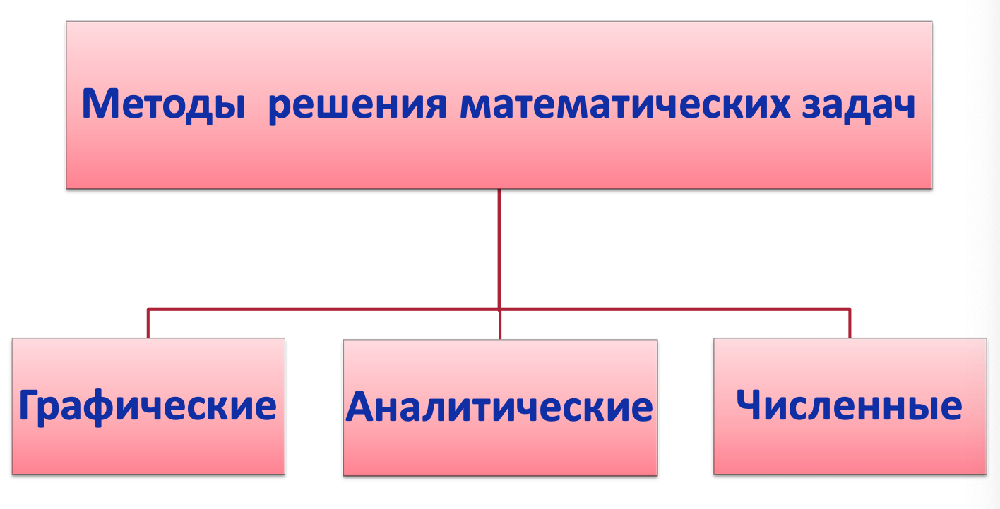
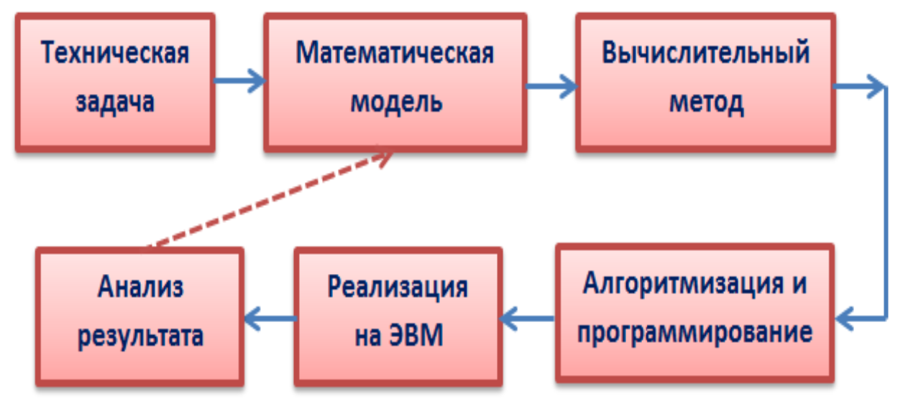
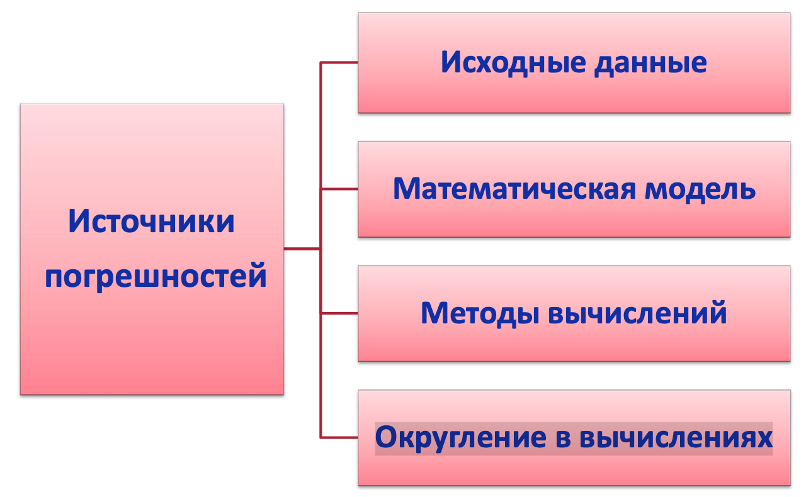
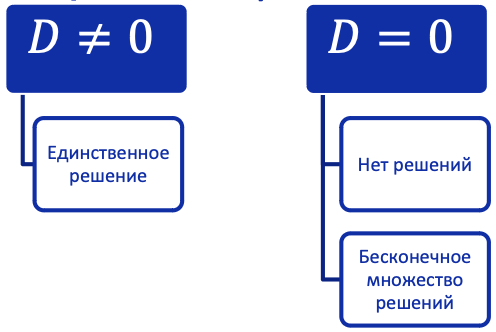

<head>
    
    
</head>

## [MainPage](../index.md)/[Algorithm&DataStructures](README.md)/Lecture

课程总计 108 学时，包含：
- 讲座 - 16 小时
- 实验课 - 32 小时
- CPC - 55.2 小时

Задачей изучения дисциплины «Вычислительная математика»
является формирование у студента необходимых знаний:
- о вычислительной математике как о разделе высшей математики;
- о классификации численных методов;
- о причинах возникновения погрешностей и их учете при оценке результата вычислений;
- об основах численных методах линейной алгебры, о решении нелинейных уравнений и систем, о приближении функций, об основах дифференцирования и интегрирования функций;  

学习 “计算数学” 学科的任务是使学生具备必要的知识：
- 关于计算数学作为高等数学的一个分支；
- 关于数值方法的分类；
- 关于错误的原因及其在评估计算结果时的考虑；
- 关于线性代数数值方法的基础，关于求解非线性方程和系统，关于函数逼近，关于函数微分和积分的基础；

В результате лабораторных занятий студент должен уметь:
- выбрать численный метод, которым необходимо воспользоваться при решении конкретной задачи;
- написать программное приложение, реализующее данный метод; - адекватно оценить полученные результаты.  
  
作为实验室研究的结果，学生应该能够：
- 选择在解决特定问题时必须使用的数值方法；
- 编写实现此方法的软件应用程序；
- 充分评估获得的结果。

评分内容：

项目|最低分|最高分
---|---|---
实验 1|6|9
实验 2|6|11
实验 3|6|9
实验 4|6|9
实验 5|7|11
实验 6|7|11
测试 1|5|10
测试 2|5|10

期末考试形式：зачёт

## Lecture 1

解决数学问题的方法：
- 图像法
- 解析法
- 数值法

Численные методы — приближенные способы решения типовых задач математики, которые наиболее часто встречаются на практике.  
数值方法是解决实践中最常遇到的典型数学问题的近似方法。

- Примерами типовых задач являются численное решение уравнений, систем, численные дифференцирование и интегрирование и др.  
  典型问题的例子有方程、系统的数值解、数值微分和积分等。

- Применение численных методов сводит решение задачи к выполнению конечного числа арифметических действий над числами.  
- 数值方法的应用将问题的求解简化为对数字进行有限次数的算术运算。

- Главная задача численных методов - получить приближенное решение задачи с заданной степенью точности, или, по крайней мере, оцениваемой точностью.  
  数值方法的主要任务是以给定的精度或至少估计的精度获得问题的近似解。

- Когда применяются численные методы?  
  什么时候使用数值方法？

  - Когда задача трудно решается точными аналитическими методами.  
    当问题难以用精确的分析方法解决时。
  - Когда перед нами стоит сложная задача, например математической физики.  
    当我们面临一项艰巨的任务时，比如数学物理。

Обобщенная схема математического моделирования  
数学建模的广义方案

> 技术问题 -> 数学模型 -> 计算方法 -> 算法与程序 -> 计算机实现 -> 结果分析
> 结果分析 -> 数学模型

误差分析

>误差来源
>- 初始数据
>- 数学模型
>- 计算方法
>- 计算中的四舍五入

Абсолютная и относительная погрешности  
绝对和相对误差

- Абсолютная погрешность: 绝对误差
  $$\Delta a^* = |a^* - a|$$

  其中：
  - $a^*$ - приближенное значение числа $a$.  
    数 $a$ 的近似值。
  - Точное число заключено в границах $a = a^* \pm \Delta a^*$  
    确切的数字在范围 $a = a^* \pm \Delta a^*$ 内：
- Предельная абсолютная погрешность(граница абсолютной погрешности) $\Delta a$:  
  极限绝对误差（absolute error limit）$\Delta a$：
  $$\Delta a^*\le \Delta_a$$
- Относительная погрешность: 相对误差
  $$\delta a^* = |\frac{a^*-a}{a^*}|$$
- Предельная относительная погрешность (граница относительной погрешности)  
  Limiting relative error（相对误差极限）
  $$\delta a^* \le \delta_a$$

Так как значение точного числа 𝑎 неизвестно, то часто пользуются  
由于确切数𝑎的值未知，所以经常使用

приближенными оценками предельных погрешностей:  
边际误差的近似估计：

$$\delta a\approx\frac{\Delta_a}{|a^*|}\quad\Delta a\approx|a^*|\delta_a$$

Вычислительная погрешность 误差计算

Проведение численных расчётов на компьютере неизбежно связано с погрешностью округления, которые возникают в силу ограниченности разрядной сетки компьютера при представлении в нем вещественных чисел.  
在计算机上进行数值计算不可避免地会出现舍入误差，这是由于计算机在表示实数时的位格有限而产生的。

В современных компьютерах реализован стандарт двоичной арифметики IEEE. Стандарт предусматривает два основных типа чисел с плавающей точкой: числа одинарной и двойной точности.  
现代计算机执行 IEEE 二进制算术标准。  该标准提供两种主要类型的浮点数：单精度和双精度。

类型 Тип|长度 Длина|符号 Знак|尾数 Мантисса|幂Порядок
---|---|---|---|---
单精度 Одинарная точность|4 byte|1 bit|23 bit|8 bit
双精度 Двойная точность|8 byte|1 bit|52 bit|11 bit

Хранение в компьютере в логарифмическом виде – мантисса и порядок: $x = \pm m\cdot a^p$, где $m$ – мантисса, $p$ – порядок, а – основание степени.  
在计算机中以对数形式存储 - 尾数和阶数：$x = \pm m\cdot a^p$，其中 $m$ 是尾数，$p$ 是阶数，是度数的底数。

Мантисса записывается в нормализованной форме: $2.578\cdot10^2$ Компьютерное представление: $2.578E+02$.  
尾数以标准化形式书写：$2.578\cdot10^2$ 计算机表示：$2.578E+02$。

Вычислительная погрешность 计算误差

精度|单精度|双精度
---|---|---
Наименьшее значение (UFL), порог машинного нуля 最低值（UFL），机器零阈值|$\approx10^{-38}$|$\approx10^{-308}$
Наибольшее значение (OFL), порог переполнения 最大值（OFL），溢出阈值|$\approx10^{+38}$|$\approx10^{+308}$
Машинное эпсилон ($\varepsilon_{маш}$), машинная погрешность 机器 epsilon ($\varepsilon_{маш}$)，机器误差|$\approx10^{-8}$|$\approx10^{-16}$

Свойства численных методов 数值方法的性质

- Устойчивость. Решение задачи $y^*$ называется устойчивым по исходным данным $x^*$, если оно зависит от исходных данных непрерывным образом. Это означает, что малому изменению исходных данных соответствует малое изменение решения. Алгоритм считается устойчивым, если он обеспечивает нахождение существующего и единственного решения при различных исходных данных.
- Сходимость. Численное решение задачи должно стремиться к точному решению задачи.  
  Алгоритм сходится, если последовательность приближений

  $$x_1,x_2,\cdots,x_n\to x^*, n\to\infty, \lim_{n\to\infty}x_n=x^*$$

- Корректность. Численные методы применяются к корректно поставленным задачам.

Задача называется поставленной корректно, если выполняются следующие условия:

1. решение задачи существует и единственно при любых допустимых исходных данных.
2. решение устойчиво по отношению к малым изменениям исходных данных.

МЕТОДЫ РЕШЕНИЯ СИСТЕМ ЛИНЕЙНЫХ АЛГЕБРАИЧЕСКИХ УРАВНЕНИЙ  
求解线性代数方程组的方法

Рассмотрим систему $n$ линейных алгебраических уравнений с $n$ неизвестными:  
考虑一个包含 $n$ 个未知数的 $n$ 个线性代数方程组：

$$\begin{split}
  a_{11}x_1+a_{12}x_2+\cdots+a_{1n}x_n=b_1,\\
  a_{21}x_1+a_{22}x_1+\cdots+a_{2n}x_n=b_2,\\
  ..................................................\\
  a_{n1}x_1+a_{n2}x_1+\cdots+a_{nn}x_n=b_3,\\
\end{split}$$

В векторно-матричном виде:在向量矩阵形式中：

$$\bm{Ax=b}$$

где: 
- А – матрица системы, 系统矩阵
- х – вектор неизвестных, 未知数向量
- b – вектор правых частей: 右侧部分的向量：

  $$A=\begin{pmatrix}
    a_{11} & a_{12} & \cdots & a_{1n}\\
    a_{11} & a_{12} & \cdots & a_{1n}\\
    \cdots & \cdots & \cdots & \cdots\\
    a_{11} & a_{12} & \cdots & a_{1n}\\
  \end{pmatrix}
  x=\begin{pmatrix}
    x_1\\
    x_2\\
    \vdots\\
    x_n\\
  \end{pmatrix}
  b=\begin{pmatrix}
    b_1\\
    b_2\\
    \vdots\\
    b_n\\
  \end{pmatrix}$$

Решение задачи 题解

Система линейных алгебраических уравнений может: 线性代数方程组可以：
- Не иметь решений. 无解
- Иметь бесконечное множество решений. 有无限解
- Иметь единственное решение. 有唯一解

Если система линейных уравнений имеет хотя бы одно решение, то ее называют совместной.  
如果一个线性方程组至少有一个解，则称它是一致的。

Система линейных уравнений, не имеющая решений, называется несовместной.  
没有解的线性方程组称为不一致的。

Система, имеющая единственное решение, называется определенной.  
具有唯一解的系统称为确定的。

Система, имеющая множество решений, называется неопределенной.  
具有多个解的系统称为不定系统。

Теорема Кронекера-Капелли 克罗内克-卡佩利定理

Система линейных алгебраических уравнений совместна тогда и только тогда, когда ранг матрицы системы равен рангу расширенной матрицы системы, т.е. $rang(A)=rang(A|B)$.  
当且仅当系统矩阵的秩等于系统扩展矩阵的秩时，线性代数方程组是一致的，即 $rang(A)=rang(A|B)$ 

1. Если $rangA \ne rang(A|B)$, то СЛАУ несовместна (не имеет решений).
2. Если $rangA = rang(A|B)<n$, то СЛАУ является неопределённой (имеет бесконечное количество решений).
3. Если $rangA = rang(A|B) =n$, то СЛАУ является определённой (имеет единственное решение).

1. 如果 $rangA \ne rang(A|B)$，则 SLAE 不一致（无解）。
2. 如果 $rangA = rang(A|B)<n$，则 SLAE 是不确定的（它有无限多个解）。
3. 如果 $rangA = rang(A|B) =n$，则 SLAE 是确定的（有唯一解）。

МЕТОДЫ РЕШЕНИЯ ЛИНЕЙНЫХ СИСТЕМ 求解线性系统的方法
- ПРЯМЫЕ (ТОЧНЫЕ?) 直接（准确？）
  - Используют конечные соотношения (формулы) для вычисления неизвестных. Они дают решение за конечное число арифметических операций. Эти методы сравнительно просты и наиболее универсальны, т. е. пригодны для решения широкого класса линейных систем.  
    使用有限比率（公式）计算未知数。  他们给出了有限数量的算术运算的解决方案。  这些方法相对简单且最通用，即它们适用于求解范围广泛的线性系统。  

  - Иногда прямые методы называют точными, имея в виду, что при отсутствии ошибок в исходных данных и при выполнении элементарных операций результат будет точным. Однако, при реализации метода на ЭВМ неизбежны ошибки округления и, как следствие, наличие вычислительной погрешности. 
    有时直接方法称为精确的，这意味着在初始数据没有错误并且执行基本操作时，结果将是准确的。然而，当在计算机上实施该方法时，舍入误差是不可避免的，因此存在计算误差。

  - Недостатки: 缺点：
    - требуют хранения в оперативной памяти компьютера сразу всей матрицы, и при больших значениях n расходуется много места в памяти.  
      要求一次性将整个矩阵存储在计算机的 RAM 中，对于较大的 $n$ 值，会消耗大量的内存空间。
    - не учитывают структуру матрицы при большом числе нулевых элементов в разреженных матрицах (например, клеточных или ленточных); эти элементы занимают место в памяти машины, и над ними проводятся арифметические действия.  
      不考虑稀疏矩阵中具有大量零元素的矩阵结构（例如，元胞或磁带）；  这些元素占用机器内存中的空间，并对它们执行算术运算。
    - происходит накапливание погрешностей в процессе решения, поскольку вычисления на любом этапе используют результаты предыдущих операций. Применяются для систем ($n < 1000$) с плотно заполненной с матрицей и не близким к нулю определителем.
      求解过程中存在错误累积，因为任何阶段的计算都使用先前操作的结果。  它们用于具有密集填充矩阵和非零行列式的系统（$n < 1000$）。

  - Прямые методы.Правило Крамера 直接方法：克莱默规则

    Формулы Крамера. Каждое неизвестное представляется в виде отношения определителей (детерминантов). Используется для систем размерностью $n=2, 3$.  
    克莱默公式。 每个未知数都表示为决定因素（决定因素）的比率。 用于维度 $n=2, 3$ 的系统。

    $$\begin{split}
      a_{11}x_1+a_{12}x_2+\cdots+a_{1n}x_n=b_1,\\
      a_{21}x_1+a_{22}x_2+\cdots+a_{2n}x_n=b_2,\\
      ...................................................\\
      a_{nn}x_1+a_{n2}x_2+\cdots+a_{nn}x_n=b_n
    \end{split}
    $$

    $$x_j=\frac{\det A_j}{\det A}, j=1,\cdots,n$$

    $\det A_j$ – определитель матрицы, получаемой заменой $j$-го столбца матрицы A столбцом правых частей $b$

    $$x_1=\frac{\Delta x_1}{\Delta}, x_2=\frac{\Delta x_2}{\Delta}, x_3=\frac{\Delta x_3}{\Delta}, \cdots, x_n=\frac{\Delta x_n}{\Delta}$$

    $$\Delta=\begin{vmatrix}
      a_{11} & a_{12} & \cdots & a_{1n}\\
      a_{21} & a_{22} & \cdots & a_{2n}\\
      \cdots & \cdots & \cdots & \cdots\\
      a_{n1} & a_{n2} & \cdot & a_{nn}
    \end{vmatrix}
    \Delta x_1=\begin{vmatrix}
      b_{1} & a_{12} & \cdots & a_{1n}\\
      b_{2} & a_{22} & \cdots & a_{2n}\\
      \cdots & \cdots & \cdots & \cdots\\
      b_{n} & a_{n2} & \cdot & a_{nn}
    \end{vmatrix}
    \Delta x_1=\begin{vmatrix}
      a_{11} & b_{1} & \cdots & a_{1n}\\
      a_{21} & b_{2} & \cdots & a_{2n}\\
      \cdots & \cdots & \cdots & \cdots\\
      a_{n1} & b_{n} & \cdot & a_{nn}
    \end{vmatrix}
    \cdots
    \Delta x_n=\begin{vmatrix}
      b_{1} & a_{12} & \cdots & b_{1}\\
      b_{2} & a_{22} & \cdots & b_{2}\\
      \cdots & \cdots & \cdots & \cdots\\
      b_{n} & a_{n2} & \cdot & b_{n}
    \end{vmatrix}$$

    При большом числе уравнений потребуется выполнить огромное число арифметических операций, поскольку для вычислений $n$ неизвестных необходимо найти значения $n + 1$ определителей. Количество арифметических операций: $N ≈ n \cdot n!$
    对于大量的方程，需要执行大量的算术运算，因为为了计算 $n$ 个未知数，需要找到 $n + 1$ 个行列式的值。 算术运算次数：$N ≈ n \cdot n!$

    При $n=100$ потребуется совершить 10158 операций. Много это или сойдет для человека/ЭВМ?  
    当 $n=100$ 时，将需要 10158 次操作。 它对人/计算机来说是否可行？
  - Прямые методы. Метод Гаусса 直接方法：高斯方法
    - Основан на приведении матрицы системы к треугольному виду так, чтобы ниже ее главной диагонали находились только нулевые элементы.  
      它基于将系统矩阵变为三角形，以便只有零元素位于其主对角线下方。
    - Прямой ход метода Гаусса состоит в последовательном исключении неизвестных из уравнений системы. Сначала с помощью первого уравнения исключается $x_1$ из всех последующих уравнений системы. Затем с помощью второго уравнения исключается $x_2$ из третьего и всех последующих уравнений и т.д.
      高斯方法的直接过程在于从系统方程中连续消除未知数。  首先，使用第一个方程，将 $x_1$ 从系统的所有后续方程中排除。然后，使用第二个方程，从第三个和所有后续方程中消去 $x_2$，依此类推。

      Этот процесс продолжается до тех пор, пока в левой части последнего (n-го) уравнения не останется лишь один член с неизвестным $x_n$ , т. е. матрица системы будет приведена к треугольному виду.  
      这个过程一直持续到最后一个（第 n 个）方程的左边只剩下一个未知的 $x_n$ 项，即系统的矩阵被简化为三角形。
    - Обратный ход метода Гаусса состоит в последовательном вычислении искомых неизвестных: решая последнее уравнение, находим единственное в этом уравнении неизвестное $x_n$. Далее, используя это значение, из предыдущего уравнения вычисляем $x_{n−1}$ и т. д. Последним найдем $x_1$ из первого уравнения.  
      Gauss 方法的反向过程包括所需未知数的顺序计算：通过求解最后一个方程，我们找到该方程中唯一的未知数 $x_n$。  然后，使用这个值，我们从前面的等式计算 $x_{n−1}$，依此类推。最后，我们从第一个等式中找到 $x_1$。

      Метод имеет много различных вычислительных схем, но в каждой из них основным требованием является $\det A \ne 0$.  
      该方法有许多不同的计算方案，但在每个方案中，主要要求是 $\det A \ne 0$。

    - Рассмотрим наиболее распространенную схему единственного деления. 考虑最常见的单除法方案：

      $$\begin{split}
      a_{11}x_1+a_{12}x_2+\cdots+a_{1n}x_n=b_1,\\
      a_{21}x_1+a_{22}x_2+\cdots+a_{2n}x_n=b_2,\\
      ...................................................\\
      a_{nn}x_1+a_{n2}x_2+\cdots+a_{nn}x_n=b_n
      \end{split}
      $$

      直接法：
      - Шаг 1 步骤 1
        Исключим $x_1$ из второго уравнения: умножим первое уравнение на $(−a_{21}/ a_{11})$ и прибавим ко второму.  
        从第二个等式中消去 $x_1$：将第一个等式乘以 $(−a_{21}/ a_{11})$ 并添加到第二个等式中。

        Исключим $x_1$ из третьего уравнения: умножим первое уравнение на $(− a_{31}/a_{11})$ и прибавим к третьему...  
        从第三个等式中消去 $x_1$：将第一个等式乘以 $(− a_{31}/a_{11})$ 并添加到第三个...

        Исключим $x_1$ из последнего уравнения: умножим первое уравнение на $(− a_{n1}/ a_{11})$ и прибавим к последнему. Получим равносильную систему уравнений (2):  
        从最后一个等式中消去 $x_1$：将第一个等式乘以 $(− a_{n1}/ a_{11})$ 并添加到最后一个等式中。 我们得到一个等价的方程组（2）：

        $$\begin{split}
          a_{11}x_1+a_{12}x_2+a_{13}x_3+\cdots+a_{1n}x_n &=b_1,\\
          a_{22}^{(1)}x_2+a_{23}^{(1)}x_3+\cdots+a_{2n}^{(1)}x_n &=b_2^{(1)},\\
          a_{32}^{(1)}x_2+a_{33}^{(1)}x_3+\cdots+a_{3n}^{(1)}x_n &=b_3^{(1)}\\
          \cdots&=\cdots\\
          a_{n2}^{(1)}x_2+a_{n3}^{(1)}x_3+\cdots+a_{nn}^{(1)}x_n &=b_n^{(1)}
        \end{split}\qquad
        \begin{split}
          a_{ij}^{(1)}=a_{ij}-\frac{a_{i1}}{a_{11}}a_{1j},i,j=2,3,\cdots,n\\
          b_{i}^{(1)}=b_i-\frac{a_{i1}}{a_{11}}b_1,i=2,3,\cdots,n\\
        \end{split}
        $$

      - Шаг 2: 
        Исключим $x2$ из третьего уравнения: умножим второе уравнение на $(-a'_{32}/a'_{22})$ и прибавим к третьему (и т.д. для следующих уравнений)  
        从第三个等式中消去 $x2$：将第二个等式乘以 $(-a'_{32}/a'_{22})$ 并添加到第三个等式（以此类推以下等式）
        Исключим $x_2$ из последнего уравнения: умножим второе уравнение на $(-a'_{n2}/a'_{22})$ и прибавим к последнему.  
        从最后一个等式中消去 $x_2$：将第二个等式乘以 $(-a'_{n2}/a'_{22})$ 并添加到最后一个等式中。

        Получим:

        $$\begin{split}
          a_{11}x_1+a_{12}x_2+a_{13}x_3+\cdots+a_{1n}x_n &=b_1,\\
          a_{22}^{(1)}x_2+a_{23}^{(1)}x_3+\cdots+a_{2n}^{(1)}x_n &=b_2^{(1)},\\
          a_{33}^{(2)}x_3+\cdots+a_{3n}^{(2)}x_n &=b_3^{(2)}\\
          \cdots&=\cdots\\
          a_{n3}^{(2)}x_3+\cdots+a_{nn}^{(2)}x_n &=b_n^{(2)}
        \end{split}\qquad
        \begin{split}
          a_{ij}^{(2)}=a_{ij}^{(1)}-\frac{a_{i2}^{(1)}}{a_{22}^{(1)}}a_{2j},i,j=3,4,\cdots,n\\
          b_{i}^{(2)}=b_i^{(1)}-\frac{a_{i2}^{(1)}}{a_{22}^{(1)}}b_2^{(1)},i=3,4,\cdots,n\\
        \end{split}
        $$
      Продолжим до тех пор, пока матрица системы (3) не примет треугольный вид (4):  
      我们继续直到系统 (3) 的矩阵采用三角形形式 (4)：

      $$\begin{split}
          a_{11}x_1+a_{12}x_2+a_{13}x_3+\cdots+a_{1n}x_n &=b_1,\\
          a_{22}^{(1)}x_2+a_{23}^{(1)}x_3+\cdots+a_{2n}^{(1)}x_n &=b_2^{(1)},\\
          a_{33}^{(2)}x_3+\cdots+a_{3n}^{(2)}x_n &=b_3^{(2)}\\
          \cdots&=\cdots\\
          a_{nn}^{(n-1)}x_n &=b_n^{(n-1)}
        \end{split}
      $$
      Матрица системы (4) имеет треугольный вид  конец прямого хода.

      Требование : Если в процессе исключения неизвестных, коэффициенты:

      $$a_{11},a_{22}^1,a_{33}^2,\cdots=0$$

      тогда необходимо соответственным образом переставить уравнения системы.

      Перестановка уравнений должна быть предусмотрена в вычислительном алгоритме при его реализации на компьютере.

      **Обратный ход:**

      $$\begin{split}
        x_n=b_n^{(n-1)}/a_{nn}^{(n-1)}\\
        .......\\
        x_2=\frac{1}{a_{22}^{(1)}}(b_2^{(1)}-a_{23}^{(1)}x_3-\cdots-a_{2n}^{(1)}x_n)\\
        x_1=\frac{1}{a_{11}}(b_1^-a_{12}x_2-a_{13}x_3-\cdots-a_{1n}x_n)
      \end{split}$$

- ИТЕРАЦИОННЫЕ (ПРИБЛИЖЕННЫЕ) 迭代（近似）

