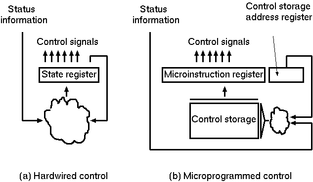
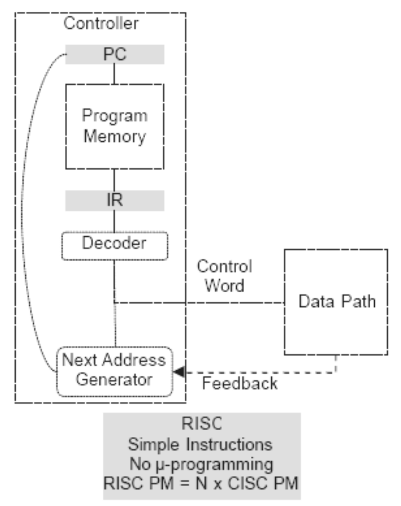
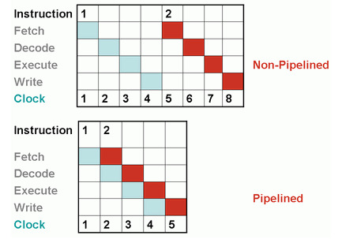
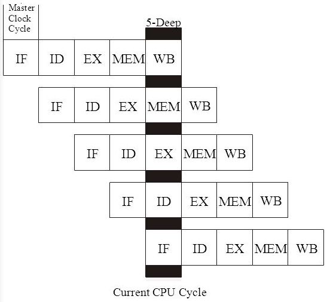

# Exam <!-- omit from toc -->

- [All](#all)
  - [1. Что такое компьютерная система? Отличие информационной и управляющей системы? Почему большинство современных компьютерных систем считаются системами с преобладающей программной составляющей? Примеры. Понятие информационного процессора.](#1-что-такое-компьютерная-система-отличие-информационной-и-управляющей-системы-почему-большинство-современных-компьютерных-систем-считаются-системами-с-преобладающей-программной-составляющей-примеры-понятие-информационного-процессора)
  - [2. Системная инженерия. Понятие системы. Варианты рассмотрения систем. Модульность. Жизненный цикл. Операционное окружение и обеспечивающие системы. Заинтересованные стороны (stakeholders). Проблема передачи информации при разработке компьютерных систем.](#2-системная-инженерия-понятие-системы-варианты-рассмотрения-систем-модульность-жизненный-цикл-операционное-окружение-и-обеспечивающие-системы-заинтересованные-стороны-stakeholders-проблема-передачи-информации-при-разработке-компьютерных-систем)
  - [3. Цели и задачи архитектурного проектирования компьютерных систем, его эффект. Понятие архитектуры. Различные трактовки (Гради Буч, ISO 42010 и д.р.) и их практическая значимость.](#3-цели-и-задачи-архитектурного-проектирования-компьютерных-систем-его-эффект-понятие-архитектуры-различные-трактовки-гради-буч-iso-42010-и-др-и-их-практическая-значимость)
  - [4. Реле как базис компьютерной системы. Область применения и принципы построения систем на базе реле. Примеры релейных схем и принцип их функционирования. Формирование логического базиса.](#4-реле-как-базис-компьютерной-системы-область-применения-и-принципы-построения-систем-на-базе-реле-примеры-релейных-схем-и-принцип-их-функционирования-формирование-логического-базиса)
  - [5. Принципы кодирования информации в компьютерных системах. Двоичный код, достоинства и недостатки. Машинное слово и адресация. Код грея, BCD, Base64.](#5-принципы-кодирования-информации-в-компьютерных-системах-двоичный-код-достоинства-и-недостатки-машинное-слово-и-адресация-код-грея-bcd-base64)
  - [6. Что такое комбинационная схема? Состояние и параллелизм в комбинационных схемах и схемах с регистрами, переходные процессы. Чтение и запись значений в регистры. Состояние x и z. Параллелизм уровня битов. Особенности поведения комбинационных схем по сравнению с программами.](#6-что-такое-комбинационная-схема-состояние-и-параллелизм-в-комбинационных-схемах-и-схемах-с-регистрами-переходные-процессы-чтение-и-запись-значений-в-регистры-состояние-x-и-z-параллелизм-уровня-битов-особенности-поведения-комбинационных-схем-по-сравнению-с-программами)
  - [7. Аппаратное обеспечение. Виды монтажа и особенности производства. Навесной и поверхностный монтаж. Интегральные схемы. Проблемы, специфичные для аппаратного обеспечения: производство, эксплуатация, устаревание.](#7-аппаратное-обеспечение-виды-монтажа-и-особенности-производства-навесной-и-поверхностный-монтаж-интегральные-схемы-проблемы-специфичные-для-аппаратного-обеспечения-производство-эксплуатация-устаревание)
  - [8. 2-этапное производство, варианты обеспечения. Понятия Hardware и Software, их свойства. Сравнение с понятиями программного и аппаратного обеспечения. Особенности. Причины разделения. Принципы совместного проектирование (HW/SW CoDesign).](#8-2-этапное-производство-варианты-обеспечения-понятия-hardware-и-software-их-свойства-сравнение-с-понятиями-программного-и-аппаратного-обеспечения-особенности-причины-разделения-принципы-совместного-проектирование-hwsw-codesign)
  - [9. Понятие модели вычислений (MoC). Сопоставление понятия парадигмы программирования и MoC. Примеры MoC (последовательные, параллельные, функциональные) и их роль в разработке компьютерных систем. Использование MoC в разных вычислительных платформах.](#9-понятие-модели-вычислений-moc-сопоставление-понятия-парадигмы-программирования-и-moc-примеры-moc-последовательные-параллельные-функциональные-и-их-роль-в-разработке-компьютерных-систем-использование-moc-в-разных-вычислительных-платформах)
  - [10. Универсальный процессор и его свойства. Машина Тьюринга и полнота по Тьюрингу. Виды процессоров (СБИС, FPGA, CGRA, GPU, DSP, CPU) и их сопоставление с точки зрения универсальности и эффективности.](#10-универсальный-процессор-и-его-свойства-машина-тьюринга-и-полнота-по-тьюрингу-виды-процессоров-сбис-fpga-cgra-gpu-dsp-cpu-и-их-сопоставление-с-точки-зрения-универсальности-и-эффективности)
  - [11. Архитектура фон Неймана. Принципы. Свойства. Особенности и ограничения. Применение на практике. Машинное слово. Понятие системы команд и её роль в построении процессоров. Control Unit и DataPath.](#11-архитектура-фон-неймана-принципы-свойства-особенности-и-ограничения-применение-на-практике-машинное-слово-понятие-системы-команд-и-её-роль-в-построении-процессоров-control-unit-и-datapath)
  - [12. Гарвардская архитектура и её отличия от архитектуры фон Неймана. Принципы. Свойства. Особенности и ограничения. Применение на практике. Подходы к обходу ограничений архитектуры. Машинное слово. Control Unit и DataPath.](#12-гарвардская-архитектура-и-её-отличия-от-архитектуры-фон-неймана-принципы-свойства-особенности-и-ограничения-применение-на-практике-подходы-к-обходу-ограничений-архитектуры-машинное-слово-control-unit-и-datapath)
  - [13. Механизм микроопераций, микропрограммирование и его роль в развитии компьютерных систем. Особенности и ограничения. Применение на практике. Пример оптимизации через микрокод. NISC архитектура.](#13-механизм-микроопераций-микропрограммирование-и-его-роль-в-развитии-компьютерных-систем-особенности-и-ограничения-применение-на-практике-пример-оптимизации-через-микрокод-nisc-архитектура)
  - [14. Что такое CISC? Роль в развитии компьютерных систем. Применение на практике. Достоинства и недостатки. Отличия от архитектуры фон Неймана. Особенности программирования.](#14-что-такое-cisc-роль-в-развитии-компьютерных-систем-применение-на-практике-достоинства-и-недостатки-отличия-от-архитектуры-фон-неймана-особенности-программирования)
  - [15. Что такое RISC? Роль в развитии компьютерных систем. Применение на практике. Достоинства и недостатки. Отличия от архитектуры фон Неймана. Особенности программирования.](#15-что-такое-risc-роль-в-развитии-компьютерных-систем-применение-на-практике-достоинства-и-недостатки-отличия-от-архитектуры-фон-неймана-особенности-программирования)
  - [16. Конвейеризированное исполнение команд. Стадии конвейера. Виды конфликтов (по данным, по управлению), их примеры и влияние на производительность. Достоинства и недостатки.](#16-конвейеризированное-исполнение-команд-стадии-конвейера-виды-конфликтов-по-данным-по-управлению-их-примеры-и-влияние-на-производительность-достоинства-и-недостатки)
  - [17. Виды конфликтов при работе конвейера и механизмы их разрешения, сокращения их числа. Пузырёк, разворачивание циклов, предсказания переходов (статические и динамические).](#17-виды-конфликтов-при-работе-конвейера-и-механизмы-их-разрешения-сокращения-их-числа-пузырёк-разворачивание-циклов-предсказания-переходов-статические-и-динамические)
  - [18. Что такое SOP (Stack-Oriented Processors, стековый процессор)? Роль в развитии компьютерных систем. Применение на практике. Достоинства и недостатки. Отличия от архитектуры фон Неймана. Особенности программирования.](#18-что-такое-sop-stack-oriented-processors-стековый-процессор-роль-в-развитии-компьютерных-систем-применение-на-практике-достоинства-и-недостатки-отличия-от-архитектуры-фон-неймана-особенности-программирования)
  - [19. Поддержка операций ввода-вывода в фон Неймановских процессорах. Поддержка на уровне системы команд (порт, отображение в память). Программно-управляемый ввод-вывод. Ввод-вывод через механизм прерываний. Механизм прямого доступа к памяти.](#19-поддержка-операций-ввода-вывода-в-фон-неймановских-процессорах-поддержка-на-уровне-системы-команд-порт-отображение-в-память-программно-управляемый-ввод-вывод-ввод-вывод-через-механизм-прерываний-механизм-прямого-доступа-к-памяти)
  - [20. Параллелизм уровня задач. Кооперативная многозадачность. Принцип работы и подходы к реализации. Примеры использования. Достоинства и ограничения. Зелёные процессы. Проблема синхронизации процессов по управлению и по данным. Сравнение с альтернативами.](#20-параллелизм-уровня-задач-кооперативная-многозадачность-принцип-работы-и-подходы-к-реализации-примеры-использования-достоинства-и-ограничения-зелёные-процессы-проблема-синхронизации-процессов-по-управлению-и-по-данным-сравнение-с-альтернативами)
  - [21. Параллелизм уровня задач. Вытесняющая многозадачность. Механизмы переключения задач. Примеры использования. Достоинства и ограничения. Проблема синхронизации процессов по управлению и по данным. Сравнение с альтернативами.](#21-параллелизм-уровня-задач-вытесняющая-многозадачность-механизмы-переключения-задач-примеры-использования-достоинства-и-ограничения-проблема-синхронизации-процессов-по-управлению-и-по-данным-сравнение-с-альтернативами)
  - [22. Система прерываний. Виды прерываний. Механизм обработки прерываний по шагам. Задачи, решаемые механизмом прерываний. Сторожевой таймер.](#22-система-прерываний-виды-прерываний-механизм-обработки-прерываний-по-шагам-задачи-решаемые-механизмом-прерываний-сторожевой-таймер)
  - [23. Параллелизм уровня задач. Проблемы совмещения, изоляции и взаимодействия задач между собой. Методы разрешения данных проблем (с точки зрения опыта программиста и пользователя): распределение по адресному пространству, банки памяти, сегментная организация памяти и виртуальная память.](#23-параллелизм-уровня-задач-проблемы-совмещения-изоляции-и-взаимодействия-задач-между-собой-методы-разрешения-данных-проблем-с-точки-зрения-опыта-программиста-и-пользователя-распределение-по-адресному-пространству-банки-памяти-сегментная-организация-памяти-и-виртуальная-память)
  - [24. Сегментная и виртуальная память. Решаемые задачи и принципы работы. Проблема фрагментации. Достоинства и недостатки.](#24-сегментная-и-виртуальная-память-решаемые-задачи-и-принципы-работы-проблема-фрагментации-достоинства-и-недостатки)
  - [25. Иерархия памяти (явная и скрытая). Виды памяти. Особенности использования на практике. Устройство памяти с произвольным доступом. Устройство и принцип работы ROM, SRAM, DRAM ячеек.](#25-иерархия-памяти-явная-и-скрытая-виды-памяти-особенности-использования-на-практике-устройство-памяти-с-произвольным-доступом-устройство-и-принцип-работы-rom-sram-dram-ячеек)
  - [26. Механизм кеширования в компьютерных системах, принцип локальности. Функционирование кеш памяти процессора (чтение, запись). Виды кеш промахов.  Механизм вытеснения (LRU, PLRU).](#26-механизм-кеширования-в-компьютерных-системах-принцип-локальности-функционирование-кеш-памяти-процессора-чтение-запись-виды-кеш-промахов--механизм-вытеснения-lru-plru)
  - [27. Устройство кеш-памяти процессора. Ассоциативность кеш-памяти (полностью ассоциативная, прямое отображение, множественно-ассоциативный кеш). Принципы работы. Детальное описание принципов работы кеш-памяти с разными вариантами ассоциативности.](#27-устройство-кеш-памяти-процессора-ассоциативность-кеш-памяти-полностью-ассоциативная-прямое-отображение-множественно-ассоциативный-кеш-принципы-работы-детальное-описание-принципов-работы-кеш-памяти-с-разными-вариантами-ассоциативности)
  - [28. Иерархия кеш-памяти процессора. Причины множества уровней кеша. Разделённый/унифицированный, включающий/исключающий, частный/общий. Типовые уровни кеша в современных процессорах.](#28-иерархия-кеш-памяти-процессора-причины-множества-уровней-кеша-разделённыйунифицированный-включающийисключающий-частныйобщий-типовые-уровни-кеша-в-современных-процессорах)
  - [29. Когерентность кеш-памяти. Возможные состояния кеш линий. Механизмы обмена информацией между кешами: справочник, отслеживание и перехват. CAP теорема.](#29-когерентность-кеш-памяти-возможные-состояния-кеш-линий-механизмы-обмена-информацией-между-кешами-справочник-отслеживание-и-перехват-cap-теорема)
  - [30. Закон Мура. Закон Деннарда. Закон Амдала. Power-wall. Memory-wall. Их роль в развитии компьютерных систем. Источники роста производительности процессоров тогда и сегодня.](#30-закон-мура-закон-деннарда-закон-амдала-power-wall-memory-wall-их-роль-в-развитии-компьютерных-систем-источники-роста-производительности-процессоров-тогда-и-сегодня)
  - [31. Проблема обеспечения реального времени в современных компьютерных системах. Влияние параллелизма уровня инструкций, языков программирования высокого уровня, многозадачности и организации памяти.](#31-проблема-обеспечения-реального-времени-в-современных-компьютерных-системах-влияние-параллелизма-уровня-инструкций-языков-программирования-высокого-уровня-многозадачности-и-организации-памяти)
  - [32. Уровневая организация компьютерных систем. Элементы уровня организации. Уровневый архитектурный стиль. Примеры. Явление разделения на уровни (disaggregation) и их смешения. Документирование инструментальных цепочек.](#32-уровневая-организация-компьютерных-систем-элементы-уровня-организации-уровневый-архитектурный-стиль-примеры-явление-разделения-на-уровни-disaggregation-и-их-смешения-документирование-инструментальных-цепочек)
  - [33. Особенности реализации структурного программирования в фон Неймановских процессорах. Работа с памятью, регистрами. Реализация процедур. Реентерабельность.](#33-особенности-реализации-структурного-программирования-в-фон-неймановских-процессорах-работа-с-памятью-регистрами-реализация-процедур-реентерабельность)
  - [34. Уровни параллелизма. Параллелизм уровня бит. Низкоуровневый параллелизм. Параллелизм уровня инструкций. Параллелизм уровня задач. Примеры и особенности.](#34-уровни-параллелизма-параллелизм-уровня-бит-низкоуровневый-параллелизм-параллелизм-уровня-инструкций-параллелизм-уровня-задач-примеры-и-особенности)
  - [35. Параллелизм уровня инструкций. Суперскалярные процессора. Особенности и принципы работы. Сравнение с VLIW и практика использования. Достоинства и недостатки. Барьеры памяти.](#35-параллелизм-уровня-инструкций-суперскалярные-процессора-особенности-и-принципы-работы-сравнение-с-vliw-и-практика-использования-достоинства-и-недостатки-барьеры-памяти)
  - [36. Параллелизм уровня инструкций. VLIW процессора. Особенности и принципы работы. Сравнение с суперскалярными и практика использования. Достоинства и недостатки. Барьеры памяти.](#36-параллелизм-уровня-инструкций-vliw-процессора-особенности-и-принципы-работы-сравнение-с-суперскалярными-и-практика-использования-достоинства-и-недостатки-барьеры-памяти)
  - [37. Программируемые логические контроллеры (ПЛК). Область применения. Особенности аппаратуры и программирования по сравнению с компьютерами общего назначения.](#37-программируемые-логические-контроллеры-плк-область-применения-особенности-аппаратуры-и-программирования-по-сравнению-с-компьютерами-общего-назначения)
  - [38. Программируемые логические интегральные схемы (ПЛИС). Область применения. Особенности. Устройство. Задачи высокоуровневого синтеза, достоинства и недостатки.](#38-программируемые-логические-интегральные-схемы-плис-область-применения-особенности-устройство-задачи-высокоуровневого-синтеза-достоинства-и-недостатки)
  - [39. Классификация Флинна. Выделяемые классы и примеры машин этих классов. SIMT архитектура.](#39-классификация-флинна-выделяемые-классы-и-примеры-машин-этих-классов-simt-архитектура)
  - [40. Классификация Дункана. Цели и задачи, классификация первого уровня. Синхронные архитектуры (векторные, SIMD, ассоциативные массивы, систолические). Принципы их работы и примеры.](#40-классификация-дункана-цели-и-задачи-классификация-первого-уровня-синхронные-архитектуры-векторные-simd-ассоциативные-массивы-систолические-принципы-их-работы-и-примеры)
  - [41. Классификация Дункана. Цели и задачи, классификация первого уровня. MIMD архитектуры (распределённая и разделяемая память). Примеры и принципы их работы.](#41-классификация-дункана-цели-и-задачи-классификация-первого-уровня-mimd-архитектуры-распределённая-и-разделяемая-память-примеры-и-принципы-их-работы)
  - [42. Классификация Дункана. Цели и задачи, классификация первого уровня. MIMD парадигмы (MIMD/SIMD, потоки данных, редукционные, wavefront). Примеры и принципы их работы.](#42-классификация-дункана-цели-и-задачи-классификация-первого-уровня-mimd-парадигмы-mimdsimd-потоки-данных-редукционные-wavefront-примеры-и-принципы-их-работы)
- [PPA](#ppa)
  - [1.Spraying атака. Суть. Виды. Методы противодействия.](#1spraying-атака-суть-виды-методы-противодействия)
  - [2.Shell-скрипты. Недостатки. Почему до сих пор используются. Возможные альтернативы.](#2shell-скрипты-недостатки-почему-до-сих-пор-используются-возможные-альтернативы)
  - [3.Принципы работы и уязвимости GSM-сетей, методы защиты.](#3принципы-работы-и-уязвимости-gsm-сетей-методы-защиты)
  - [4.Уязвимость Heartbleed. Какие ещё вызовы и угрозы безопасности существуют в современной веб-разработке, как защитить свои веб-приложения от возможных атак.](#4уязвимость-heartbleed-какие-ещё-вызовы-и-угрозы-безопасности-существуют-в-современной-веб-разработке-как-защитить-свои-веб-приложения-от-возможных-атак)
  - [5.Как работает Garbage Collector. Проблемы. Инкрементальный Garbage Collector.](#5как-работает-garbage-collector-проблемы-инкрементальный-garbage-collector)
  - [6.Что такое FSD (полностью самостоятельное вождение). Технические средства. Существующие проблемы.](#6что-такое-fsd-полностью-самостоятельное-вождение-технические-средства-существующие-проблемы)
  - [7.Блокчейн. Устройство и уязвимости.](#7блокчейн-устройство-и-уязвимости)
  - [8.GPS и ГЛОНАСС: Принцип работы, уязвимости, средства защиты.](#8gps-и-глонасс-принцип-работы-уязвимости-средства-защиты)
  - [9.Каковы основные принципы и методики, которые позволяют обнаруживать и анализировать ошибки в компиляторах? Приведите 2 способа и их краткое описание.](#9каковы-основные-принципы-и-методики-которые-позволяют-обнаруживать-и-анализировать-ошибки-в-компиляторах-приведите-2-способа-и-их-краткое-описание)
  - [10.Почему программисту важно знать о текущих абстракциях и думать на уровень ниже, чем он работает. Примеры, процессор Skylake и параллельное программирование.](#10почему-программисту-важно-знать-о-текущих-абстракциях-и-думать-на-уровень-ниже-чем-он-работает-примеры-процессор-skylake-и-параллельное-программирование)
  - [11.Вирусы-вымогатели. Суть, механизмы обеспечения незаметности и шифрования. Защита.](#11вирусы-вымогатели-суть-механизмы-обеспечения-незаметности-и-шифрования-защита)
  - [12.Технические средства и принципы фильтрации интернет-трафика. Способы обхода.](#12технические-средства-и-принципы-фильтрации-интернет-трафика-способы-обхода)
  - [13.Суть обработки естественного языка(NLP). Основные этапы. Проблемы. Полисемия.](#13суть-обработки-естественного-языкаnlp-основные-этапы-проблемы-полисемия)


## All

### 1. Что такое компьютерная система? Отличие информационной и управляющей системы? Почему большинство современных компьютерных систем считаются системами с преобладающей программной составляющей? Примеры. Понятие информационного процессора.  
什么是计算机系统？ 信息系统和控制系统之间的区别？ 为什么大多数现代计算机系统被认为是软件主导的系统？ 例子。 信息处理器的概念。

Современная КС - неоднородная система, у которой есть кибернетическая подсистема управления, определяющая вариативность ее поведения.  
现代计算机科学是一个异构系统，具有决定其行为可变性的控制论控制子系统。

Примеры: светодиодная лампа (контроллер напряжения), кабель для зарядки мобильника (контроллер для проверки совместимости на предмет безопасной зарядки), умные часы, интерактивные детские игрушки, автомобили (в т.ч. беспилотные), станки с ЧПУ и т.д.  
例如：LED灯（电压控制器）、手机充电线（用于检查安全充电兼容性的控制器）、智能手表、互动儿童玩具、汽车（包括自动驾驶汽车）、数控机床等。

Компьютеры управляет "пассивными" компонентами и объединяет их в систему, является мозгом системы.  
计算机控制“无源”组件并将它们集成到系统中；它们是系统的大脑。

Программная система (software system) - система, состоящая из программного обеспечения, аппаратных средств и данных, которая обеспечивает свою основную ценность за счет выполнения программного обеспечения.  
软件系统：由软件、硬件和数据组成的系统，通过执行软件提供其主要价值。

КС делятся на две большие группы:  
CS分为两大组：

- информационные системы - получение набора данных на входе, преобразование/накопление и выдача в измененном/обработанном виде;  
  信息系统——接收一组数据作为输入、转换/累积并以修改/处理的形式输出；

  Пример: поисковик в интернете 示例：互联网搜索引擎

  Особенности: 特点：

  1. приоритет - производительность (быстрее = лучше);  
     优先级 - 性能（更快=更好）；
  2. спекулятивные вычисления (выполняемые для предотвращения задержки, если потом выяснится, что они были необходимы);  
     推测性计算（这样做是为了防止后来证明有必要时出现延误）；
  3. параллелизм в рамках вытесняющей многозадачности (быстро решаются задачи, но тяжело качественно реализовать -> проблемы с надежностью, плаванием времени работы и т.д.);  
     抢占式多任务框架内的并行性（问题很快解决，但难以高效实现->可靠性、浮动时间等问题）；
  4. кластерные и облачные вычисления (масштабирование аппаратуры в рантайме; пример: AWS Lambda - вычисл. сервис, отвечающий за выполнение некоторого кода по событию-триггеру и автомат. выделение вычисл. ресурсов).  
     集群和云计算（运行时的硬件扩展；例如：AWS Lambda 是一种计算服务，负责根据触发事件执行一些代码并自动分配计算资源）。

  - управляющие системы - взаимодействие с реальным физ. миром с целью управления или контроля за ним.  
    控制系统-与真实物理的交互。 以管理或控制世界为目的。

    - имеют специальное аппаратное исполнение (адаптация набора IO-портов под окружение, в котором система будет работать; адаптация корпуса компьютера под место установки; подбор процессоров с учетом используемых алгоритмов и оптимизации энергопотребления; дополнительное экранирование и т.п.)  
      具有特殊的硬件设计（使一组IO端口适应系统运行的环境；使计算机机箱适应安装位置；选择处理器时考虑到所使用的算法和功耗优化；额外的屏蔽， ETC。）

    - располагаются на объекте управления или в непосредственной близости (пинг до Вояджера составляет несколько дней); ИС же, как правило, удалённая.  
      位于控制设施内或附近（ping 通 Voyager 需要几天时间）； 一般来说，IS 是远程的。

автономная эксплуатация (отдельная батарея)  
自主操作（独立电池）

требование систем реального времени (точных требований к временным задержкам КС - предсказуемо и в заданное время, но не обязательно быстро, 100% точно и надежно), т.к. он работает в физическом времени, а не своем.  
实时系统的要求（对 CS 时间延迟的确切要求 - 可预测且在给定时间，但不一定很快，100% 准确且可靠），因为 他在物理时间里工作，而不是在他自己的时间里。

Пример - водосброс на ГЭС (вода скапл. в водохранилищах, есть датчик превышения уровня воды для открытия водосброса; откр. через 5 минут, т.к. иначе будет дёргаться с каждой волной и выйдет из строя)  
示例-水力发电站的溢洪道（水库积水，有超过水位的传感器打开溢洪道；5分钟内打开，否则会随着波浪而抽动而失效）

ИУС = ИС + УС вместе; пример - видеокодек (конвертирование видео - ИС, запуск на плеере - УС, т.к. упр. кол-вом кадров в секунду)  
IUS = IS + US 合起来； 示例 - 视频编解码器（视频转换 - IS，在播放器上启动 - US，因为它控制每秒的帧数）

Подавляющее большинство совр. систем имеют преобладающую программную составляющую, потому что почти вся основная функциональность реализуется на уровне ПО, и если раньше значительная часть бюджета уходила на разработку оборудования и минимум на поддержку и разработку ПО, то сейчас тенденция совершенно обратная. Причина этого в том, что индустрия за 70 лет сильно разрослась, и если раньше программист занимался почти всем, то сейчас, например, аппаратка и веб - это слишком разные специальности.  
绝大多数现代 系统具有主要的软件组件，因为几乎所有主要功能都是在软件级别实现的，如果以前预算的很大一部分花在硬件开发上，而最少的预算花在支持和软件开发上，那么现在的趋势完全相反。 原因在于，70 年来，这个行业已经取得了长足的发展，如果说以前程序员几乎包揽了所有事情，那么现在，例如，硬件和网络是截然不同的专业。

Система с преобл. прогр. сост. - система, в которой разработка и/или интеграция ПО являются приоритетными аспектами.  
系统具有主导地位 程序。 比较。 - 软件开发和/或集成是优先考虑的系统。

Примеры: 例子：
- Отдельные программные приложения ИС  
  选定的 IS 软件应用程序
- ВсС
- Линейки программных продуктов и семейств продуктов Системы систем  
  软件产品线和产品系列 系统的系统

информационный процессор 信息处理器

Процессор, который в ответ на команду выполняет действие над концептуальной схемой и/или информационной базой.  
响应命令，对概念图和/或信息库执行操作的处理器。

Информационный процессор (система обработки информации) - система (будь то электрическая, механическая или биологическая), которая принимает информацию (последовательность перечисленных символов или состояний) в одной форме и преобразует ее в другую форму, например к статистике через алгоритмический процесс.  
信息处理器（信息处理系统）——一种系统（无论是电气、机械还是生物），它以一种形式获取信息（一系列列出的符号或状态）并将其转换为另一种形式，例如通过算法过程转换为统计数据。

Системы обработки информации состоит из четырех основных частей, или подсистем:  
信息处理系统由四个主要部分或子系统组成：

- ввод 输入
- процессор 中央处理器
- хранение 贮存
- вывод 输出

Процессор - цифровая схема, которая выполняет операции с некоторым внешним источником данных, обычно памятью или каким-либо другим потоком данных. Обычно он принимает форму микропроцессора, который может быть реализован на одном кристалле металл-оксид-полупроводниково-интегральной схемы.  
处理器是一种数字电路，它对某些外部数据源（通常是内存或其他数据流）执行操作。 它通常采用微处理器的形式，可以在单个金属氧化物半导体集成电路芯片上实现。

Действия, выполняемые с информацией, называются информационными процессами.  
利用信息执行的操作称为信息过程。

Информационный процесс – это процесс, в результате которого осуществляются прием, передача (обмен), преобразование и использование информации.  
信息过程是信息的接收、传输（交换）、转换和使用的过程。

В информационных процессах выделяются перечисленные выше виды процессов: получение, хранение, передача, обработка, использование информации.  
在信息处理中，上面列出的处理类型分为：接收、存储、传输、处理和使用信息。

### 2. Системная инженерия. Понятие системы. Варианты рассмотрения систем. Модульность. Жизненный цикл. Операционное окружение и обеспечивающие системы. Заинтересованные стороны (stakeholders). Проблема передачи информации при разработке компьютерных систем.

系统工程。 系统的概念。 考虑系统的选项。 模块化。 生命周期。 运行环境和支撑系统。 利益相关方（利益相关者）。计算机系统开发中的信息传输问题。

Системная инженерия (SE) - это междисциплинарный подход и средство, позволяющее реализовать успешные системы и фокусирующееся на:  
系统工程 (SE) 是一种用于实现成功系统的跨学科方法和工具，重点关注：

- целостном и одновременном понимании потребностей заинтересованных сторон (стейкхолдеров)  
  全面、同步地了解相关方（利益相关者）的需求
- изучении возможностей  
  探索可能性
- документировании требований  
  记录要求
- синтезе, проверке, приёмке и разработке решений при рассмотрении всей проблемы, от исследования концепции системы до вывода ее из эксплуатации  
  考虑整个问题（从系统概念研究到退役）时综合、验证、验收和开发解决方案

Короче, это индустрия, которая рассматривает все важные аспекты разработки системы, от замысла до утилизации, и собирает требования к ней, чтобы ничего не пропустить.  
简而言之，这个行业着眼于系统开发的所有重要方面，从构思到处置，并收集其需求，以便不遗漏任何内容。

Пример - американская военка, которая состоит из громоздких многоуровневых систем.  
一个例子是美国的军事系统，它由繁琐的多级系统组成。

Система - комбинация взаимодействующих частей, организованных для достижения одной или нескольких поставленных целей. Может рассматриваться как поставляемые ею услуги или продукт (например, авиационная система = авиация). Ему не хватило этих определений.  
系统是为实现一个或多个指定目标而组织的交互部分的组合。 可以被认为是它提供的服务或产品（例如航空系统=航空）。 这些定义对他来说还不够。

Система - совокупность частей, обладающих эмерджентностью (получением принципиально нового свойства при соединении частей).  
系统是已出现的部件的集合（当部件连接时获得全新的属性）。

Модульность - выбор гранулярности компонентов, уровня абстракции и вычисл. платформ, имеющий решающее значение при разработке КС. Иными словами, вся внутр. организация целевой системы явл. совокупностью взаимосвязанных модулей.  
模块化——组件粒度、抽象级别和计算的选择。 平台，这对于CS的发展至关重要。 换句话说，所有内部 目标系统的组织 一组互连的模块。

Stakeholder - физическое и юридическое лицо, которое может накладывать ограничения на систему, т.е., например, юзверь, определяющий дизайн; разработчик, определяющий используемые технологии; директор, заинтересованный в актуальности и спросе на рынке.  
利益相关者 - 可以对系统施加限制的个人或法人实体，即决定设计的用户； 定义所使用技术的开发人员； 对市场相关性和需求感兴趣的总监。

Жизненный цикл системы - эволюция интересующей системы со временем от концепции до вывода из эксплуатации.  
系统生命周期——感兴趣的系统从概念到退役的随时间的演变。

Типичные этапы ЖЦ:
- Этап концепции: выполняется для оценки новых возможностей бизнеса и разработки предварительных требований к системе и осуществимого проектного решения. Для компьютерной системы это анализ требований и архитектурное проектирование. Какие проблемы решаются, есть ли стейкхолдеры, каков замысел.  
  概念阶段：评估新的商业机会并制定初步的系统要求和可行的设计解决方案。 对于计算机系统来说，这就是需求分析和架构设计。 解决什么问题，有没有利益相关者，意图是什么。
- Этап разработки: выполняется для создания интересующей системы, которая отвечает требованиям заказчика и может быть произведена, протестирована, оценена, эксплуатируется, поддерживается и выводится из эксплуатации. Для КС это написание исходного кода или организация вычислительного процесса.  
  开发阶段：创建一个满足客户要求并且可以生产、测试​​、评估、操作、支持和退役的感兴趣的系统。 对于计算机科学来说，这是编写源代码或组织计算过程。
- Этап производства: выполняется для производства или изготовления продукта, тестирования продукта и производства соответствующих вспомогательных и обеспечивающих систем по мере необходимости. Для компьютерной системы это разработка аппаратного обеспечения, подготовка исполняемых артефактов и распространение (короче, запуск компилятора и получение бинаря 🙂)  
  制造阶段：生产或制造产品、测试产品并根据需要生产相关的支持和使能系统。 对于计算机系统来说，这是硬件开发、可执行工件的准备和分发（简而言之，启动编译器并获取二进制文件:)
- Этап использования: эксплуатация продукта, предоставление услуг в намеченных условиях и обеспечение постоянной операционной эффективности.  
  使用阶段：操作产品、按预期提供服务并确保持续的运营效率。
- Этап поддержки: предоставление услуг логистики, технического обслуживания, обновления и поддержки, которые обеспечивают непрерывную работу интересующей системы и устойчивое обслуживание.  
  支持阶段：提供后勤、维护、升级和支持服务，确保感兴趣的系统持续运行和可持续服务。
- Этап вывода из эксплуатации: обеспечение удаления интересующей системы и соответствующих эксплуатационных и вспомогательных услуг, эксплуатация и поддержка самой выводимой из эксплуатации системы.  
  退役阶段：确保移除感兴趣的系统以及相关的运营和支持服务、退役系统本身的运营和支持。

Операционная среда - простр-во, где разворачивается система. Ключевое свойство системы - функциональность. Она зависит от операционных сред, в которых люди, другие системы или физические объекты взаимодействуют с интересующей системой. Если мы сохраним интерфейс для операционной среды, обычно мы можем полностью изменить внутреннюю организацию, и это никого не волнует. Если же окружения не будет, то система будет бесполезна.  
运行环境是系统部署的空间。 系统的关键属性是功能。 它取决于人、其他系统或物理对象与感兴趣的系统交互的操作环境。如果我们保留与操作环境的接口，通常我们可以彻底改变内部组织，而没有人会在意。 如果没有环境，那么系统就毫无用处。

Обеспечивающая система - система, которая дополняет, выступает как вспомогательная к интересующей системе на этапах ее жизненного цикла, но не обязательно вносит непосредственный вклад в ее функционирование во время эксплуатации. Пример - JVM на компьютере. (сказал что это не так) нужен другой придумать  
支持系统是在其生命周期阶段对感兴趣的系统进行补充和辅助的系统，但不一定对其运行期间的功能做出直接贡献。 示例 - 计算机上的 JVM。 （说这不是真的）我们需要想出别的办法

Варианты рассмотрения систем.  
考虑系统的选项。

Система – 系统
1) сочетание взаимодействующих элементов, организованных для достижения одной или более заявленных целей  
   为实现一个或多个既定目标而组织的相互作用元素的组合
2) элемент некоторой надсистемы и связанные с ними stakeholders  
   某些超级系统的元素和相关利益相关者

ПРИМЕЧАНИЕ 1 Система может рассматриваться как продукт или как услуги, которые она предоставляет.  
注 1：系统既可以被视为产品，也可以被视为其提供的服务。

ПРИМЕЧАНИЕ 2 На практике толкование его значения часто уточняется использованием ассоциативного существительного, например, авиационная система. Если говорить в общем то система - это конструкция из взаимодействующих компонентов(полупроводники, конденсаторы, резисторы, триггеры и т.д.), включающая в себя множество информационных компонентов(программы, данные)  
注2：在实践中，其含义的解释通常通过使用关联名词来澄清，例如，航空器系统。 一般来说，系统是由相互作用的组件（半导体、电容器、电阻器、触发器等）组成的结构，其中包含许多信息组件（程序、数据）

Проблема передачи информации при разработке компьютерных систем.  
计算机系统开发中的信息传输问题。

Барри Бём - бедный менеджмент может увеличить стоимость разработки ПО быстрее, чем любой другой фактор.  
Barry Boehm - 管理不善可以比任何其他因素更快地增加软件开发成本。

Типовые проблемы создания компьютерных систем:  
创建计算机系统的典型问题：
1. Формулирование/генерация требований: “мы не можем объяснить, чего мы хотим”, собрать адекватное описание того, что нужно сделать или задать правильные вопросы.  
   制定/生成需求：“我们无法解释我们想要什么”，收集需要做什么的充分描述或提出正确的问题。
2. Передача/сохранение информации: есть два человека, которые много знают, но разное. Но они не могут грамотно передать свои знания друг другу и совместно применить их при разработки системы  
   信息的传递/保留：有两个人知道很多，但事情不同。 但他们无法在开发系统时有效地相互转移知识并共同应用
3. Использование информации: допустим, задача в прочтении книг и использовании информации (например, GoF и паттерны), и человек начинает применять свои паттерны ко всему подряд, делая структуру красивой, но сложной, неудобной и с дофигищей кода.  
   使用信息：假设任务是阅读书籍并使用信息（例如GoF和模式），一个人开始将他的模式应用到一切事物上，使结构变得漂亮，但复杂、不方便且有很多代码。
4. Неполнота, неоднозначность, нераспределенность (один человек знает всё, а другие - ничего), противоречивость, стремление к решению…  
   不完整、模糊、缺乏分布（一个人知道一切，而其他人一无所知）、不一致、渴望解决方案……

Цитата Барри – ничто не может испортить бюджет так быстро, как плохой менеджмент  
巴里语录：没有什么比糟糕的管理更快地毁掉预算了。

Менеджмент – такие люди, основанная задача которых, чтобы процессы в проекте шли, чтобы информация переходила так как надо.  
管理层的主要任务是确保项目流程继续进行，以便信息按其应有的方式流动。

Ключевые проблемы:  
关键的问题：
1. Генерирование/формулирование информации – представитель бизнеса, который понимает хорошо, что происходит, но сказать ничего не может, потому что человек интуитивно понимает, но реализовать не может.  
   生成/制定信息——业务代表很了解正在发生的事情，但不能说什么，因为一个人直观地理解，但无法执行。
2. Передача/сохранение информации – комментарии в исходном коде, так как они повторяют информацию (про matrixMul (matrix1, matrix2) ) Код это и есть описание алгоритма  
   传输/保存信息-源代码中的注释，因为它们重复信息（关于matrixMul（matrix1，matrix2））代码是算法的描述
3. Комментарии нужны, когда используется нестандартное решение, которое производительность выше, библиотека кривая, бизнес требования хромают.  
   使用非标准方案、性能更高、库歪、业务需求蹩脚的时候需要评论。
4. Использование информации – сформулировали, зафиксировали, прочитали.  
   信息的使用——制定、记录、阅读。
5. Неполнота – задокументировать всё невозможно  
   不完整——不可能记录一切
6. Неоднозначность – всегда найдется тот, кто неправильно поймет  
   歧义——总会有人误解
7. Нераспределенность – команда из 5 человек, которые не могут понимать одно и тоже о проекте  
   缺乏分配——一个由 5 个人组成的团队对项目的理解不能相同
8. Противоречивость – устаревшие документации, неактуальная документация хуже, чем ее полное отсутствие  
   不一致——过时的文档，不相关的文档比没有文档更糟糕
9.  Стремление к решению других проблем – не на основании нужд системы или проекта, а по третьим причинам. Никто не был еще уволен за выбор решений от IBM  
    解决其他问题的愿望——不是基于系统或项目的需要，而是出于第三个原因。 没有人因选择 IBM 解决方案而被解雇

Пример про сеньора и джуна, менеджера и разработчика  
一个关于高级人员和初级人员、经理和开发人员的示例

### 3. Цели и задачи архитектурного проектирования компьютерных систем, его эффект. Понятие архитектуры. Различные трактовки (Гради Буч, ISO 42010 и д.р.) и их практическая значимость.

计算机系统架构设计的目标和目标及其效果。 架构学的概念。 各种解释（Grady Booch、ISO 42010 等）及其实际意义。

Архитектура - всё важное. (интернет)  
建筑是一切重要的因素。 （互联网）

Архитектура - набор проектных решений, которые в случае неверного применения могут привести к краху проекта, поэтому они определяют его успешность.  
架构是一组设计决策，如果应用不当，可能会导致项目崩溃，因此它们决定了项目的成功。  
Короче: если назвать переменную индекса hui, то от проекта не убудет, но если лажа в принципиальной части, то это peacedeath.  
简而言之：如果你调用索引变量 hui，那么该项目不会造成任何损害，但如果基本部分搞砸了，那么这就是死了。

Архитектура программного обеспечения (ru) Eoin Woods (SEI 2010) — это набор проектных решений, которые, если они будут приняты неправильно, могут привести к отмене вашего проекта  
软件架构 (en) Eoin Woods (SEI 2010) 是一组设计决策，如果做出错误，可能会导致项目取消  
Должна проектироваться на ранней стадии разработки проекта.  
应在项目开发的早期阶段进行设计。

Архитектура ISO 42010 - концепции и свойства + среда (опер. окруж.) + элементы, взаимосвязи (внутри) + проектирование и развитие (ЖЦ); у любой системы всегда есть архитектура.  
架构ISO 42010 - 概念和属性+环境（操作环境）+元素、关系（内部）+设计和开发（LC）； 任何系统总是有一个架构。

Описание архитектуры - рабочий продукт, используемый для выражения архитектуры. В случае утери ее можно легко восстановить.  
架构描述是用于表达架构的工作产品。 如果丢失，可以轻松恢复。  
Архитектура = (Проектные решения → логика + физика + взаимосвязи)   
架构=（设计解决方案→逻辑+物理+关系）

Классическое определение: Гради Буч 经典定义：格雷迪·布奇
Архитектура: логическая и физическая структура компонентов системы и их взаимосвязи, сформированные всеми стратегическими и тактическими проектными решениями, применяемыми во время разработки.  
架构：系统组件及其关系的逻辑和物理结构，由开发过程中做出的所有战略和战术设计决策决定。

Логический взгляд 逻辑视图  
на систему учитывает концепции, созданные в концептуальной модели, и устанавливает существование и роль ключевых абстракций и механизмов, которые будут определять архитектуру и общий дизайн системы.  
系统上的概念考虑了概念模型中创建的概念，并建立了关键抽象和机制的存在和作用，这些抽象和机制将定义系统的体系结构和总体设计。

Физическая модель 物理模型
системы описывает конкретный программный и аппаратный состав реализации системы. Очевидно, что физическая модель зависит от конкретной технологии  
系统描述了系统实现的具体软硬件组成。 显然，物理模型取决于具体技术  
Без проектирования архитектуры с большой вероятностью пришлось бы ее перекраивать и терять еще больше времени, чем с ним. Также это позволяет раньше находить ошибки, что тоже экономит время.  
如果不设计架构，很可能需要重新绘制，并且比设计架构浪费更多的时间。 这也可以让您更早地发现错误，从而节省时间。  
Если найти ошибку в момент эксплуатации, а не раньше, стоимость её исправления возрастает экспоненциально (условно, 500, а не 4 раз).  
如果您在操作时而不是更早发现错误，则修复错误的成本会呈指数级增加（相对而言，是 500 倍，而不是 4 倍）。  

Цели и задачи архитектурного проектирования:  
架构设计的目的和目标：
1. Компьютерная система состоит из АО и ПО -> нельзя рассматривать их в вакууме, необходимо создать механизм связи между их разработчиками.  
   计算机系统由硬件和软件组成 -> 它们不能被孤立地考虑；有必要在它们的开发人员之间创建通信机制。
2. Включает в себя не только технические вопросы, но и вопросы, связанные с проектом:  
   不仅包括技术问题，还包括与项目相关的问题：
   - Команда и компетентность. Если используется стек технологий, по которым нет специалистов, это значительно повышает риски при создании проекта.  
     团队和能力。 如果使用没有专家的技术堆栈，则会显着增加创建项目时的风险。
   - Время выхода на рынок. Если внедрение системы займёт несколько лет, велика вероятность того, что по истечении этих сроков она станет бесполезной.  
     上市时间。 如果一个系统的实施需要几年的时间，那么在这些时间之后它很可能会变得毫无用处。
   - Обслуживание, поддержка, развёртывание, обновление системы и тд.  
     维护、支持、部署、系统更新等。 
3. Система обладает архитектурой независимо от её описания. Однако без её документации внедрить какие-то изменения/исправления/дополнения будет сложнее. Наличие спроектированной архитектуры позволяет относительно просто и быстро изменять систему.  
   无论其描述如何，系统都有一个架构。 然而，如果没有它的文档，实施任何更改/更正/添加都会更加困难。 拥有设计好的架构使得更改系统变得相对容易和快速。
4. Методы системного проектирования и архитектурного проектирования нацелены на то, чтобы помочь людям решить все необходимые для достижения успеха вопросы.  
   系统工程和架构设计方法旨在帮助人们解决取得成功所需的所有问题。

   Архитектурное проектирование не даёт прямой выгоды и тратит много времени и денег в краткосрочной перспективе, но позволяет много сэкономить в долгосрочной и нарушить закон Хофштадтера (любое дело длится дольше ожидаемого времени).  
   建筑设计并不能提供直接的效益，短期内会浪费大量的时间和金钱，但从长远来看可以节省很多，并且违反了霍夫施塔特定律（一切都比预期需要更长的时间）。

Эффект архитектурного проектирования  
建筑设计效果

Находится в хитром балансе между тем, сколько денег вы можете потратить, чтобы снизить риски облажаться в процессе выполнения проекта по времени.  
在你可以花多少钱来降低项目随着时间的推移搞砸的风险之间，这是一个棘手的平衡。

Арх. Док. Позволяет проще погружать людей в проекты – спорно, редко бывает актуальной и правильной версии  
Арх. Док. 使人们更容易沉浸在项目中 - 有争议，很少有最新且正确的版本

Бредовые пункты: 废话要点：

Система делается быстрее или дешевле – нет, если с или без арх.проект. – разница в том что есть этот этап.  
该系统变得更快或更便宜 - 不，无论是否有架构设计。 ——不同的是，有这个阶段。

Качественнее – лучше код написан? Пальцем в небо.  
更好的质量意味着更好的代码？ 手指向天空。

Лучше поддерживается, легче вносить правки – пример лаб3 с просто питоном и ООП В жабе  
更好的支持，更容易进行编辑 - 示例 lab3 仅使用 python 和 OOP В жабе  


### 4. Реле как базис компьютерной системы. Область применения и принципы построения систем на базе реле. Примеры релейных схем и принцип их функционирования. Формирование логического базиса.

继电器作为计算机系统的基础。 构建基于中继的系统的范围和原则。 继电器电路示例及其工作原理。 形成逻辑基础。

Реле - коммутационный аппарат, скачкообразно принимающий при воздействии на него внешних физических явлений конечное число значений выходной величины, автоматизирует замыкание или размыкание электрической цепи.  
继电器是一种开关装置，当受到外部物理现象时，它会间歇性地接收有限数量的输出值，并自动闭合或断开电路(circuit)。

1. Лежит в основе вычислительной платформы “релейных схем”. Устройство:  
   是“接力电路”计算平台的基础。 设备：
   - два проводника (вход и выход), между ними металлический ключ (нормально разомкнутый или замкнутый);  
     两个导体（输入和输出），它们之间有一个金属按键（常开或常闭）；
   - магнитная катушка, при подаче тока на которую ключ автоматически замыкается или размыкается, при снятии – ключ возвращается в нормальное состояние автоматически.  
     磁性线圈，当通电时钥匙会自动关闭或打开；当移除时，钥匙会自动返回到其正常状态。
2. С точки зрения современного положения дел:  
   从目前的情况来看：

- реле бывают не только электрические, но и механические (включая пневматические), тепловые, оптические, акустические и магнитные, что позволяет применять их в тех областях, в которых электрические компоненты работать не могут;  
  继电器不仅是电气的，而且是机械的（包括气动的）、热的、光学的、声学的和磁力的，这使得它们可以用于电气元件无法工作的区域；
- используются реже, т.к. дорого и неудобно и громко  
  使用频率较低，因为 昂贵、不方便、噪音大
- современные ПЛК (программируемые логические контроллеры) (высокотехнологичный инструмент для автоматизации производственных процессов) в качестве одного из инструментов программирования поддерживают язык релейных диаграмм  
  现代PLC（可编程逻辑控制器）（一种用于自动化生产过程的高科技工具）支持梯形图语言作为编程工具之一

1. Несколько примеров:


Про двигатель ES STOP Start Run Motor  
关于 ES STOP 启动运行电机


Элементы цифровой схемотехники:  
数字电路元件：

1. двоичная логика; 二元逻辑；
2. полный набор булевых функций: 全套布尔函数：
   - И, ИЛИ, НЕ; 与、或、非；
   - штрих Шеффера $x\vert y=\overline{xy}$
   - стрелка Пирса $x\downarrow y=\overline{(x\lor y)}$
3. комбинационные схемы; 组合电路；
4. триггер — хранение состояния. 触发-状态存储。

Практика применения реле 继电器使用练习
- Непосредственное применение, силовые шкафы управления. 
  直接应用，电源控制柜。
- Там, где электроника не работает (неэлектрические реле). 
  电子设备无法工作的地方（非电气继电器）。
- Программируемые логические контроллеры (ПЛК) для автоматизации производственных процессов (АСУТП) программируют на языках релейных диаграмм (ISO-61131) т.к.: 
  用于工业过程自动化 (APCS) 的可编程逻辑控制器 (PLC) 采用梯形图语言 (ISO-61131) 进行编程，因为：
  - работает — не трогай; 它有效 - 不要碰它；
  - все привыкли. 大家都习惯了。

### 5. Принципы кодирования информации в компьютерных системах. Двоичный код, достоинства и недостатки. Машинное слово и адресация. Код грея, BCD, Base64.

计算机系统中的信息编码原理。 二进制代码，优点和缺点。 机器字和寻址。 格雷码、BCD、Base64。


Распределение на зоны, зона высокого сигнала, зона низкого сигнала и запретная зона  
分为区域、高信号区域、低信号区域和禁区

Достоинства двоичного 二进制的优点
- Надежно и помехоустойчиво. 可靠且抗噪音。
- Простая арифметика. 简单的算术。
- Диапазоны и точность наращиваются разрядностью (слева и справа соответственно).  
  范围和精度随位深度增加（分别在左侧和右侧）
- Погрешности "by design", а не "by implementation"-   
  “设计”错误，而不是“实现”错误 -

  By dis - есть инженеры, которые запроектировали точность, by impl – погрешность определяется на этапе производства  
  通过dis - 有工程师设计了精度，通过impl - 误差在生产阶段确定

Недостатки 缺陷
- Нечитаемое представление. 
  难以阅读的演示文稿。
- Простые десятичные дроби записываются в виде бесконечных двоичных дробей. 
  简单的有限十进制分数可能被写成无限的二进制分数。
- Дискретное кодирование сигналов (точность).  
  离散信号编码（精度）。

Машинное слово — единица данных, естественная для обработки вычислителем. Пример: сложение, пересылка, и т.п.  
机器字是计算机自然处理的数据单元。 例如：添加、转发等。

- Целые числа: 整数：
  - Позиционные системы счисления.  
    位置数字系统。
  - Дополнительный код. 补码。（取代减法 Subtraction）
  - Big & Little endian. 大端和小端。
- Дроби: 分数
  - С фиксированной точкой. 有固定点
  - С плавающей точкой. 浮点
- Перечисления: 接送服务：
  - Двоично-десятичное кодирование. 二进制十进制编码。
  - Символы (старые кодировки). 符号（旧编码）。
- Тегированные данные. 标记数据。
  При переменной длине М. с. более полно используется память машины. В одной ячейке памяти может размещаться несколько М. с., одно целое М. с. или часть его. В соответствии с этим производится адресация всего М. с., начала и конца его или только начала, но с обязательным указанием длины  
  具有可变长度 M. s. 机器的内存得到更充分的利用。 一个存储单元可以包含多个存储单元，或者一个完整的存储单元。 或其中的一部分。 据此，整个 MS、其开头和结尾或仅开头均被寻址，但必须指示长度

Код Грея 格雷码
две "соседние" кодовые комбинации различаются только цифрой в одном двоичном разряде.  
两个“相邻”代码组合仅在一个二进制数字的位数上有所不同。

BCD binary-coded decimal
форма записи рациональных чисел, когда каждый десятичный разряд числа записывается в виде его четырёхбитного двоичного кода  
有理数的一种书写形式，将数字的每个小数位写为其四位二进制代码


Base64
стандарт кодирования двоичных данных при помощи только 64 символов ASCII. Алфавит кодирования содержит латинские символы A-Z, a-z, цифры 0-9 (всего 62 знака) и 2 дополнительных символа.  
仅使用 64 个 ASCII 字符对二进制数据进行编码的标准。 编码字母表包含拉丁字符 A-Z、a-z、数字 0-9（总共 62 个字符）和 2 个附加字符。

Base58
Similar to Base64, but modified to avoid non-alphanumeric chars and letters that might look ambiguous when printed (0, I, O, l).  
与 Base64 类似，但经过修改以避免打印时可能看起来不明确的非字母数字字符和字母 (0、I、O、l)。


### 6. Что такое комбинационная схема? Состояние и параллелизм в комбинационных схемах и схемах с регистрами, переходные процессы. Чтение и запись значений в регистры. Состояние x и z. Параллелизм уровня битов. Особенности поведения комбинационных схем по сравнению с программами.  
什么是组合电路？ 组合电路和寄存器电路中的状态和并行性、瞬态过程。 向寄存器读取和写入值。 状态 x 和 z。 位级并行。 组合电路与程序相比的行为特征。

Комбинационная схема – схема, составленная из набора логических элементов, в совокупности реализующая заданную таблицу истинности.  
组合电路是由一组逻辑元件组成的电路，这些逻辑元件一起实现给定的真值表。


Логические операции позволяют реализовать произвольную математическую функцию (см. изображение), причем это может быть реализовано для:  
逻辑运算允许您实现任意数学函数（见图），这可以实现为：

- черного ящика, когда мы реализуем таблицу истинности;  
  当我们实现真值表时出现黑匣子；
- белого ящика, когда мы понимаем особенности входных / выходных данных и их взаимосвязей, а значит на основании этого понимания творчески оптимизировать комбинационную схему или “раскладывать” ее на многошаговый процесс.  
  白盒，当我们了解输入/输出数据的特征及其关系时，因此基于这种理解，创造性地优化组合电路或将其“分解”为多步骤过程。

Основные свойства любой комбинационной схемы:  
任何组合电路的基本属性：
- возможность установления стабильного состояния при корректном входе;  
  通过正确的输入建立稳定状态的能力；
- задержка установления стабильного состояния после изменения входных значений (зависит от условий окружающей среды);  
  改变输入值后建立稳定状态的延迟（取决于环境条件）；
- параллельная работа элементов комбинационной схемы;  
  组合电路元件的并联操作；
- накопление ошибки в физическом процессе, что может привести к ошибке на логическом уровне.  
  物理过程中错误的累积可能导致逻辑级别的错误。

Последняя проблема решается при помощи буфера, который “выравнивает” аналоговый сигнал, лежащий в основе логического.  
后一个问题可以通过使用“均衡”逻辑信号下的模拟信号的缓冲器来解决。

1. Особенности “последовательного выполнения”  
   “顺序执行”的特点
При помощи триггеров, у нас есть возможность реализовать “защелкивание” состояния в схеме.  
借助触发器，我们有机会实现电路中状态的“锁存”。


Вход, отмеченный треугольником – управление защелкой состояния. Защелкивание может происходить при разных событиях управляющего сигнала: изменение с 0 на 1 (положительный фронт), с 1 на 0 (отрицательный фронт), по состоянию (пока сигнал единичный, входное значения защелкивается).  
标有三角形的输入是状态锁存控制。 锁存可能发生在控制信号的不同事件期间：按状态从 0 变为 1（正边沿）、从 1 变为 0（负边沿）（当信号为单个信号时，输入值被锁存）。

Это позволяет следующее:  
这允许以下操作：

- разбить большую комбинационную схему на несколько (использование вместо буфера);  
  将一个大的组合电路分成几个（使用而不是缓冲器）；
- хранить состояние внутри схемы, а значит производить вычислительный процесс в несколько шагов (реализация счетчика, сокращение размера схемы за счет нескольких этапов вычислений).  
  存储电路内部的状态，这意味着分几个步骤执行计算过程（实现计数器，由于多个计算阶段而减少电路的大小）。

Важно понимать, что процессы во всех комбинационных схемах происходят параллельно, а значит у нас открываются возможности для синхронных цифровых схем, в которых “защелкивание” значений в триггерах происходит одновременно.  
重要的是要理解所有组合电路中的过程都是并行发生的，这意味着我们有机会使用同步数字电路，其中触发器中的值的“锁存”同时发生。

Примечания: 笔记：
- одновременность весьма условна;  
  同时性是有很大条件的；
- синхронный сигнал должен ориентироваться на самую долгую комбинационную схему, в противном случае схема работать не сможет;  
  同步信号必须面向最长的组合电路，否则电路将无法工作；
- работа с синхронной схемотехникой приводит к дискретизации аналоговых сигналов, что также вносит погрешность в работу систем (особенно систем управления).  
  使用同步电路会导致模拟信号采样，这也会给系统（尤其是控制系统）的操作带来错误。

Синхронные схемы позволяют нам делать следующее:  
同步电路允许我们执行以下操作：

- Конвейеризация вычислений (количество стадий конвейера равно количеству обрабатываемых в такт значений);  
  计算的流水线（流水线的级数等于每个时钟处理的值的数量）；
- Управлять тактовой частотой схемы, так как мы всегда можем разделить комбинационную схему триггером на часть до и после, при этом если  
  控制电路的时钟频率，因为我们总是可以将带有触发器的组合电路分为前后部分，并且如果
1) комбинационные схемы делятся ровно пополам, то у нас нет избыточных задержек;  
   组合电路被正好分成两半，这样我们就不会出现过多的延迟；
2) триггер имеет свою длительность срабатывания.  
   触发器有其自己的操作持续时间。

Удвоение частоты в данном случае едва увеличит производительность в два раза.  
在这种情况下，将频率加倍几乎不会使性能加倍。

Особенности “условного оператора”
“条件运算符”的特点

Ветвление в булевых компьютерах реализовано в два подхода:  
布尔计算机中的分支通过两种方法实现：
- через состояние (по сути реализован в современных процессорах, когда состояние регистров определяет следующий шаг вычислительного процесса);  
  通过状态（基本上在现代处理器中实现，此时寄存器的状态决定计算过程的下一步）；
- через спекулятивные вычисления и выбор результата (мультиплексор). Основы работы логических компьютеров:  
  通过推测性计算和结果选择（多路复用器）。 逻辑计算机基础：

Параллелизм на уровне битов — вид параллельных вычислений, основанный на увеличении размера машинного слова.  
位级并行是一种基于增加机器字大小的并行计算。

Пример оптимизация за счёт параллелизма уровня битов для сложения бинарных чисел:  
由于添加二进制数的位级并行性而优化的示例：

- машинное слово: 8 бит, данные: 16 бит, в таком случае сложение производится несколько шагов:  
  机器字：8 位，数据：16 位，在这种情况下，加法需要几个步骤：
- сложение младших битов, фиксация бита переполнения и сохранение результата в память; – сложение старших битов, добавление бита переполнения (если бы установлен) и сохранение результата в память;  
  添加最低有效位，修复溢出位并将结果存储在内存中； – 添加最高有效位，添加溢出位（如果设置）并将结果存储在内存中；
- машинное слово: 16 бит, данные: 16 бит, сложение осуществляется в рамках большой комбинационной схемы за один такт (примечание: комбинационная схема в 16 бит будет работать на меньшей частоте которая отсутствует внутри, хотите понять как работает – рисуйте схему;  
  机器字：16位，数据：16位，加法是在一个时钟周期内的大型组合电路内进行的（注意：16位组合电路将以内部不可用的较低频率运行，如果您想了解它是如何工作的，画出电路；

Состояние x и z.  
状态 x 和 z。
Очевидное 0 и 1.  
明显的 0 和 1。

z — отключено, когда ваш источник данных (провод) висит в воздухе. 0 обычно не кодируют нулевым уровнем сигнала.  
z - 当您的数据源（电线）悬挂在空中时禁用。 0 通常不被编码为零信号电平。

x — неизвестно, значение может быть произвольным, т.к. таблица истинности определена частично. Примеры:
деление на 0;  
x - 未知，该值可以是任意的，因为 真值表是部分定义的。 例子：
除以 0；

квадратный корень из отрицательного числа;  
负数的平方根；

пример "Шифратор (4-to-2)" выше.  
例如上面的“编码器（4 到 2）”。

Ключевые отличия схемотехники от программирования  
电路设计和编程之间的主要区别
- Все процессы между регистрами всегда происходят параллельно. Не читайте код как алгоритм, рисуйте схему.  
  寄存器之间的所有进程始终并行发生。 不要把代码当成算法来读，画个图。
- Нет понятия "система остановилась". Она всегда работает, если есть питание.  
  不存在“系统已停止”的概念。 只要有电源，它总是有效的。
- Передача сигнала — физический аналоговый процесс. Есть питание и контакт — есть передача.  
  信号传输是一个物理模拟过程。 有力量和接触——就有传输。
- Таблица истинности неполна — результат будет случайным (и возможно воспроизводимым).  
  真值表不完整——结果是随机的（并且可能是可重现的）。

### 7. Аппаратное обеспечение. Виды монтажа и особенности производства. Навесной и поверхностный монтаж. Интегральные схемы. Проблемы, специфичные для аппаратного обеспечения: производство, эксплуатация, устаревание.
硬件。 安装类型和生产特点。 壁挂式和表面安装。 集成电路。 硬件特定问题：制造、操作、过时。

Монтаж радиоэлектронной аппаратуры (РЭА)
Ключевые тенденции:
▪ рост уровня интеграции
▪ снижение затрат на производство изделия
▪ усложнение производственной цепочки
Навесной монтаж
Способ монтажа электронных схем, при котором расположенные на изолирующем шасси радиоэлементы соединяются друг с другом проводами или непосредственно выводами.
Достоинства:

● простота производства
● простота подготовки производства
● гибкость (если не "залить компаундом") 
Недостатки:
● сложность автоматизации, дорого в серии
● надёжность (если не "залить компаундом")
● плотность ограничена прямотой рук монтажника (из-за размера и чел. фактора)

Монтаж на печатную плату
Печатная плата — пластина из диэлектрика, на поверхности и/или в объёме которой сформированы электропроводящие цепи электронной схемы. Электрическое и механическое соединение компонентов.
Проще говоря: роботы размещают поверхностным монтажом малюсенькие элементы на платах.
Различают:

● одно- и двухслойные платы,
● многослойные платы.
Виды монтажа компонентов:

● выводной (в отверстие)
● поверхностный
● встроенный 
Достоинства:
● автоматизация
● плотность размещения компонент
● размеры
● стоимость в серии 
Недостатки:
● необходимость подготовки производства
● удлинение производственной цепочки
● сложность внесения исправлений 
"Гибкость" печатных плат:
● джампер (by design)
● "перерезать дорожку"
● "навесная дорожка"

Интегральные схемы
Про производство
Начиная с песка
Выращиваем монокристалл кремния (буля)
Нарезаем на подложки (wafer)
Фотолитография
Наносим материал для рисунка
Наносим фоторезист
Засвечиваем с маской
Удаляем отработанный фоторезист
Повторяем слой за слоем
Interconect, объединяем транзисторы
Распиливаем подложку на чипы и монтируем их
Проблемы аппаратуры в программных системах
Производство
1. Логистика
2. Склады
3. Специалисты
4. Производственная цепочка
5. Тестирование
6. Упаковка
7. Дистрибуция
8. Гарантийный ремонт
Эксплуатация
▪ Амортизация. Выход оборудования из строя.
▪ Необходимость физического доступа.
▪ Особенности среды эксплуатации.
▪ Долгосрочные эффекты
o Оловянные нитевидные кристаллы в электронной технике
Обслуживание стареющей аппаратуры
1. Срок службы. Деградация надёжности. Стоимость обслуживания.
2. Ремонт требует запасных компонентов.
▪ Дорогое хранение.
▪ Конечный запас.
3. Воспроизведение:
▪ Вытеснение устаревшей элементной базы.
▪ Устаревшую элементную базу дорого производить.
▪ Низкий спрос. Штучное производство.
▪ Барахолки.
4. Вывод из эксплуатации сопутствующего оборудования:
▪ CD-ROM в компьютерах не устанавливается.
▪ 2.5 дискеты больше не производят.
Варианты замены устаревшей аппаратуры
1. Перепроектирование на новой элементной базе.
2. Модульная организация. Стандартные интерфейсы. Имитация старых систем.
3. Виртуализация.
4. Проблема пользовательского опыта: компьютер 80-ых позволяет внести запись в БД, пока современный только загружается.
Парадокс Тесея

### 8. 2-этапное производство, варианты обеспечения. Понятия Hardware и Software, их свойства. Сравнение с понятиями программного и аппаратного обеспечения. Особенности. Причины разделения. Принципы совместного проектирование (HW/SW CoDesign).
2 阶段生产、供应选项。 硬件和软件的概念及其属性。 软件和硬件概念的比较。 特点。 分离的原因。 协同设计原则（HW/SW CoDesign）。

2阶段生产和供应选项通常指在制造业中的生产流程和供应链管理中的概念。

1. **2阶段生产：** 这是指将生产过程划分为两个阶段进行。第一阶段通常包括生产原材料或半成品，第二阶段则是将这些原材料或半成品加工成最终产品。这种方法可以提高生产的灵活性和效率，同时降低库存和生产成本。

2. **供应选项：** 这涉及到供应链管理中的不同供应策略和模式，包括单一供应商、多个供应商、垂直整合、水平合作等多种选择，用于满足企业的生产和供应需求。

**硬件和软件的概念及属性：**

1. **硬件：** 硬件是指计算机系统中的物理组件，包括处理器、内存、存储设备、输入输出设备等。硬件的属性包括实体性、可靠性、性能、功耗等。

2. **软件：** 软件是指计算机系统中的程序和数据，包括操作系统、应用软件、编程代码等。软件的属性包括可编程性、易变性、易复制性、易传播性等。

**软件和硬件概念的比较：**

1. **可编程性：** 软件具有较高的可编程性，可以通过编程语言进行修改和定制；硬件通常需要物理更改或配置。

2. **复杂性：** 软件在设计和开发过程中通常比硬件更容易实现复杂的功能和逻辑。

3. **易变性：** 软件可以通过更新和修改来适应不同的需求和环境，而硬件的变化通常需要较长的时间和成本。

4. **易复制性：** 软件可以轻松复制和传播，而硬件的复制需要大量的制造和生产成本。

**特点：**

1. **硬件特点：** 实体性强、稳定可靠、性能高、功耗大、难以更改和定制。
2. **软件特点：** 可编程性强、易变性高、易复制传播、复杂功能实现。

**分离的原因：**
硬件和软件分离的原因包括：
1. **灵活性需求：** 软件的可编程性和易变性使得它更适合于灵活地适应不同的需求和环境。
2. **更新和维护：** 软件可以通过更新和修改来进行维护和改进，而硬件的更改需要更多的时间和资源。
3. **成本考虑：** 软件的复制和传播成本相对较低，对于大规模生产和分发更具优势。

**协同设计原则（HW/SW CoDesign）：**
协同设计是指硬件和软件在设计和开发过程中密切协作的原则，旨在优化系统的整体性能和功能。
- **硬件与软件协同设计**：硬件设计者和软件开发者需要密切合作，以确保硬件和软件之间的良好兼容性和协作性，从而实现系统级别的优化和提升。
- **优点**：协同设计可以提高系统的性能、功耗、成本等方面的优化，同时加快产品开发周期和提高产品质量。
- **缺点**：协同设计需要硬件和软件领域的专业知识和技能，协调工作可能会增加一定的复杂性和成本。

### 9. Понятие модели вычислений (MoC). Сопоставление понятия парадигмы программирования и MoC. Примеры MoC (последовательные, параллельные, функциональные) и их роль в разработке компьютерных систем. Использование MoC в разных вычислительных платформах.
计算模型（MoC）的概念。 编程范式和MoC概念的比较。 MoC（串行、并行、功能）示例及其在计算机系统开发中的作用。 在不同的计算平台上使用MoC。

计算模型（Model of Computation，MoC）是描述计算过程和计算机系统如何执行计算的数学或抽象模型。MoC可以描述计算中的并发、通信、同步等方面的行为，是计算机科学中的重要概念之一。以下是关于MoC的概念、编程范式和MoC的比较，以及MoC的示例和作用。

1. 概念和比较：
- **计算模型（MoC）：** MoC描述了计算过程中的基本原理和计算系统的运行方式，包括并行性、同步性、通信等方面。常见的MoC包括有限状态机、Petri网、数据流模型等。
- **编程范式：** 编程范式是一种程序设计的方法论或风格，它描述了如何组织和表达计算过程。常见的编程范式有面向过程编程、面向对象编程、函数式编程等。

1. MoC示例和作用：
- **串行模型：** 串行模型是指计算过程中的操作按顺序依次执行的模型。在计算机系统中，常见的串行模型是基于冯·诺伊曼架构的计算模型，它具有顺序性和确定性的特点。
- **并行模型：** 并行模型是指计算过程中的操作可以同时进行的模型。常见的并行模型包括数据并行、任务并行等，用于提高计算性能和效率。
- **功能模型：** 功能模型强调计算过程中的功能和数据流动，而非具体的计算顺序。数据流模型是一种常见的功能模型，它描述了数据如何在系统中流动以及对数据进行处理的过程。

1. 在计算机系统开发中的作用：
- **并行性优化：** MoC可以帮助优化计算过程中的并行性，提高系统的计算效率和性能。
- **通信与同步：** MoC可以描述计算过程中的通信和同步机制，有助于设计和实现具有良好通信和同步特性的系统。
- **模拟和验证：** MoC可以用于系统的建模、仿真和验证，帮助理解和分析系统的行为。

1. 在不同计算平台上使用MoC：
- **嵌入式系统：** 在嵌入式系统中，MoC可以帮助设计和优化计算任务的并行性和通信特性，以满足实时性和资源限制。
- **分布式系统：** 在分布式系统中，MoC可以描述节点之间的通信和同步机制，有助于设计和实现分布式系统的通信和协作。
- **云计算和大数据：** 在云计算和大数据领域，MoC可以帮助优化并行计算任务和数据流程，提高计算和数据处理的效率。

总体而言，MoC是描述计算过程和系统行为的重要概念，它在计算机系统开发中具有多方面的作用，可以帮助优化计算性能、设计良好的通信与同步机制，并在不同的计算平台上应用。

### 10. Универсальный процессор и его свойства. Машина Тьюринга и полнота по Тьюрингу. Виды процессоров (СБИС, FPGA, CGRA, GPU, DSP, CPU) и их сопоставление с точки зрения универсальности и эффективности.  
通用处理器及其属性。 图灵机和图灵完备性。 处理器类型（VLSI、FPGA、CGRA、GPU、DSP、CPU）及其在多功能性和效率方面的比较。

通用处理器是一种能够执行广泛任务的处理器，它具有以下属性：

1. **通用性：** 能够执行多种类型的任务，如数学运算、逻辑运算、数据处理、控制流程等。
2. **程序控制：** 通过编程指令来控制其行为，可以执行不同的算法和程序。
3. **存储器：** 通用处理器通常具有内置的寄存器和高速缓存，用于存储指令、数据和中间结果。
4. **操作系统支持：** 可以运行通用操作系统，如Windows、Linux等，支持多任务处理和资源管理。
5. **灵活性：** 可以通过软件编程进行灵活配置和扩展，具有较高的灵活性和可定制性。

图灵机是一种理论上的抽象计算模型，由英国数学家阿兰·图灵提出，用于描述计算过程和可计算问题的特性。图灵完备性是指某个计算模型能够模拟图灵机，即能够解决图灵可计算问题。

处理器类型（VLSI、FPGA、CGRA、GPU、DSP、CPU）在多功能性和效率方面有所不同：

1. **VLSI（Very Large Scale Integration）：** VLSI处理器是通过集成大量的逻辑门和功能模块来实现的，具有高度集成和优化的特点，适合用于通用计算和数字信号处理等应用。
2. **FPGA（Field Programmable Gate Array）：** FPGA具有可编程的硬件资源，可以根据需要重新配置其逻辑功能和连接关系，灵活性高，适合用于快速原型开发和定制化设计。
3. **CGRA（Coarse-Grained Reconfigurable Array）：** CGRA是一种粗粒度可重构架构，具有较大的计算单元和较少的控制逻辑，适合并行计算和数据流处理。
4. **GPU（Graphics Processing Unit）：** GPU主要用于图形处理，具有大量的并行处理单元和高带宽内存，也可以用于科学计算和并行计算任务。
5. **DSP（Digital Signal Processor）：** DSP专门用于数字信号处理，具有高性能和低功耗的特点，适合处理实时信号和信号处理算法。
6. **CPU（Central Processing Unit）：** CPU是通用处理器的一种，适用于执行通用计算任务、运行操作系统和应用程序等。

这些处理器类型在不同领域和应用场景中发挥着不同的作用，可以根据需求选择合适的处理器类型来实现多功能性和高效率的计算和处理。

### 11. Архитектура фон Неймана. Принципы. Свойства. Особенности и ограничения. Применение на практике. Машинное слово. Понятие системы команд и её роль в построении процессоров. Control Unit и DataPath.  
冯·诺依曼架构。 原则。 特性。 特点和限制。 实际应用。 机字。 指令系统的概念及其在处理器构造中的作用。 控制单元和数据路径。

- Логическое развитие машины Тьюринга.  
  图灵机的逻辑发展。
- Ключевые отличия: 主要区别：
  - лента заменена на Random-Access Memory (RAM);  
    磁带被随机存取存储器（RAM）取代；
  - инструкции и данные объединены.  
    指令和数据相结合。
- Призвана быть максимально простой в реализации и производстве.  
  设计得在实施和生产中尽可能简单。


Особенности машины фон Неймана  
冯诺依曼机的特点

1. Использование двоичного кодирования.  
   采用二进制编码。
   - Встречается троичное и двоично-десятичное кодирование.  
     有三进制和二进制十进制编码。
2. Программное управление. Команды выполняются последовательно, одна за другой.  
   软件控制。 命令按顺序执行，一个接一个。
   - оследовательность сегодня условна.  
     今天的一致性是有条件的。
3. Память компьютера используется для однородного хранения данных и программ.  
   计算机存储器用于统一存储数据和程序。
   - Однородность сегодня спорна.  
     如今，一致性是有争议的。
4. Ячейки памяти компьютера имеют адреса. Random-Access Memory.  
   计算机存储单元有地址。 随机存取存储器。
   - Адрес не сводится к целому числу сегодня.  
     今天地址没有减少为整数。
   - Память не является пассивным элементом сегодня.  
     如今，记忆不再是被动的元素。
5. Возможность условного перехода.
   有条件过渡的可能性。
  - И сегодня им не ограничивается.  
    今天它不仅限于他们。

Виды инструкций процессора фон Неймана  
冯诺依曼处理器指令的类型

1. Работа с памятью 运用记忆
   - Запись констант в регистры.  
     将常量写入寄存器。
   - Копирование данных между памятью и регистрами.  
     在内存和寄存器之间复制数据。
2. Арифметические и логические операции  
   算术和逻辑运算
   - Арифметика.  
     算术。
   - Битовые операции.  
     位运算。
   - Сравнения.  
     比较。
   - Операции с плавающей точкой.  
     浮点运算。
3. Управляющие операции  
   控制操作
   - Безусловный и условный переходы.  
     无条件和条件跳转。
   - Косвенный переход.  
    间接转让。
   - Вызов и возврат из подпрограмм.  
     调用子程序并从子程序返回。
4. Инструкции для сопроцессоров  
   协处理器指令
   - Загрузка данных и получение результатов.  
     加载数据并获取结果。
   - Управление операциями сопроцессора.  
     协处理器操作的控制。
 
Процессор фон Неймана на практике  
冯诺依曼处理器的实践  
- В чистом виде практически не встречается.  
  几乎从未发现过它的纯净形式。
- Влияние на индустрию трудно переоценить.  
  对行业的影响很难高估。
- Элементы архитектуры присутствуют в подавляющем большинстве процессоров и средств разработки.  
  架构元素存在于绝大多数处理器和开发工具中。
- Ловушка обратной совместимости.  
  向后兼容性陷阱。
- Структурное (процедурное) программирование, ООП — наследие фон Неймана.  
  结构（过程）编程，OOP - 冯·诺依曼的遗产。
  
В вычислительной и иной программируемой технике машинным словом называется единица данных, которая выбрана естественной для данной архитектуры процессора.  
在计算和其他可编程技术中，机器字是为给定处理器架构自然选择的数据单元。


Если ISA и микроархитектура отличаются на уровне MoC — обычно требуется уровень виртуализации (ПО, аппаратура. транслятор...).  
如果 ISA 和微架构在 MoC 级别不同，则通常需要虚拟化级别（软件、硬件、转换器...）。

ControlUnit  — это компонент центрального процессора (ЦП) компьютера, который управляет работой процессора. CU обычно использует двоичный декодер для преобразования закодированных инструкций в сигналы синхронизации и управления, которые управляют работой других блоков.  
控制单元是计算机中央处理单元 (CPU) 的一个组件，用于控制处理器的操作。 CU 通常使用二进制解码器将编码指令转换为控制其他块操作的定时和控制信号。

DataPath - это АЛУ, набор регистров и внутренняя шина(и) ЦП, которые позволяют данным передаваться между ними  
DataPath 是 ALU、寄存器组和内部 CPU 总线，允许在它们之间传输数据


### 12. Гарвардская архитектура и её отличия от архитектуры фон Неймана. Принципы. Свойства. Особенности и ограничения. Применение на практике. Подходы к обходу ограничений архитектуры. Машинное слово. Control Unit и DataPath.  
哈佛架构及其与冯诺依曼架构的差异。 原则。 特性。 特点和限制。 实际应用。 绕过架构限制的方法。 机字。 控制单元和数据路径。

Гарвардская архитектура – архитектура в которой память команд и память данных физически разделены, имеют собственные наборы шин для взаимодействия. А значит:  
哈佛架构是一种指令存储器和数据存储器在物理上分开并有自己的一组总线进行交互的架构。 意思是：

- Одновременный доступ к памяти (многопортовая память является редкостью).  
  同时内存访问（多端口内存很少见）。
- Разные длины машинного слова и адреса для данных и программ.  
  数据和程序的机器字长和地址不同。
  - Оптимизация под решаемую задачу.  
    优化手头的任务。
  - Данные и память программ всегда перемешаны (например, непосредственная адресация и указатели на функции).  
    数据和程序存储器总是混合的（例如直接寻址和函数指针）。
- Два физических канала между процессором и памятью.  
  处理器和内存之间的两个物理通道。

Применение двух системных шин для обращения к памяти программ и памяти данных в гарвадской архитектуре имеет два недостатка — высокую стоимость и большое количество внешних выводов микропроцессора. При использованиии двух шин для передачи команд и данных, микропроцессор должен иметь почти вдвое больше выводов, так как шина адреса и шина данных составляют основную часть выводов микропроцессора. Для уменьшения количества выводов кристалла микропроцессора фирмы-производители микросхем объединили шины данных и шины адреса для внешней памяти данных и программ, оставив только различные сигналы управления (WR, RD, IRQ) а внутри микропроцессора сохранили классическую гарвардскую архитектуру.  
哈佛架构中使用两条系统总线来访问程序存储器和数据存储器有两个缺点——成本高和微处理器的外部引脚数量多。 当使用两条总线传输命令和数据时，微处理器必须具有几乎两倍的引脚，因为地址总线和数据总线构成了微处理器引脚的大部分。 为了减少微处理器芯片的引脚数量，芯片制造商将数据总线和地址总线组合在一起，用于外部数据和程序存储器，只留下各种控制信号（WR、RD、IRQ），并在微处理器内部保留了经典的哈佛架构。

Доступ к памяти реализуется через независимые кеши для данных и программ, за счет чего, с точки зрения внутренней организации процессора, доступ реализован независимо, при этом канал между процессором и памятью один  
内存的访问是通过数据和程序独立的缓存来实现的，因此，从处理器的内部组织来看，访问是独立实现的，而处理器和内存之间的通道是一条通道。

Такое решение получило название модифицированная гарвардская архитектура.  
这个解决方案被称为改进的哈佛架构。

Еще как минус могу назвать невозможность генерировать программу, так как нельзя выполнить ничего из области памяти.  
我能说出的另一个缺点是无法生成程序，因为无法从内存区域执行任何操作。

Архитектура "Память инструкций как данные" (Instruction-memory-as-data) – реализуется возможность читать и писать данные в память программ.  
指令存储器即数据架构——实现了在程序存储器中读取和写入数据的能力。

Позволяет генерировать и запускать машинный код.  
允许您生成并运行机器代码。

Архитектура "Данные как память для инструкций" (Data-memory-as-instruction) – реализует возможность запуска инструкций из памяти команд. Также позволяет генерировать и запускать машинный код, при этом параллельный доступ в некоторых экземплярах реализуется за счет возможности параллельной работы с разными сегментами памяти.  
数据存储器即指令架构——实现从指令存储器运行指令的能力。 它还允许您生成和运行机器代码，同时由于能够与不同的内存段并行工作，因此在某些情况下实现了并行访问。

Гарвардская архитектура широко применяется во внутренней структуре современных высокопроизводительных микропроцессоров, где используется отдельная кэш-память для хранения команд и данных.  
哈佛架构广泛应用于现代高性能微处理器的内部结构，它使用独立的高速缓冲存储器来存储指令和数据。


Принстонская архитектура (фон Неймановская). Узкое место -- совместная память:  
普林斯顿建筑（冯·诺依曼）。 瓶颈是共享内存：

- доступ к инструкциям и данным  
  访问指令和数据
- по очереди по одному каналу.  
  轮流播放一个频道。

Гарвардская архитектура. Памяти разделены:  
哈佛建筑。 记忆分为：

- память инструкций и память данных -- разные устройства,  
  指令存储器和数据存储器是不同的设备，
- каналы инструкций и данных физически разделены.  
  指令和数据通道在物理上是分开的。

Гарвардская архитектура. Особенности  
哈佛建筑。 特点

Достоинства 优点

1. Два физических канала между процессором и памятью.  
   处理器和内存之间的两个物理通道。
2. Одновременный доступ к памяти.  
   同时内存访问。
3. Разная ширина машинного слова и адреса для данных и программ.  
   数据和程序的机器字和地址宽度不同。
   - Оптимизация под решаемую задачу.  
     优化手头的任务。
4. Изоляция памяти инструкций.  
   指令存储器隔离。

Недостатки

1. Сложность и стоимость реализации.  
   实施的复杂性和成本。
2. Изоляция инструкций и данных:  
   指令和数据的隔离：
   - Запуск результата компиляции  
     运行编译结果
   - Указатели на функции.  
     函数指针。

Вариации Гарвардской архитектуры  
哈佛建筑的变体

Архитектура "Память инструкций как данные"  (Instruction-memory-as-data)  指令存储器即数据架构
: реализуется возможность читать и писать данные в память программ. Позволяет генерировать и запускать машинный код.  
实现了向​​程序存储器读写数据的能力。 允许您生成并运行机器代码。


Архитектура "Память данных как инструкции"  (Data-memory-as-instruction)  数据存储器即指令架构
: реализует возможность запуска инструкций из памяти данных. Позволяет генерировать и запускать машинный код, но параллельный доступ ограничен.  
实现从数据存储器运行指令的能力。 允许您生成并运行机器代码，但并发访问受到限制。

Модифицированная Гарвардская архитектура (main stream)  修改后的哈佛架构（主流）
: Доступ к памяти реализуется через независимые кеши для данных и программ, за счет чего, с точки зрения внутренней организации процессора, доступ реализован независимо, при этом канал между процессором и памятью один.  
内存访问是通过数据和程序独立的缓存来实现的，因此，从处理器的内部组织来看，访问是独立实现的，而处理器和内存之间的通道是一个。


ControlUnit  — это компонент центрального процессора (ЦП) компьютера, который управляет работой процессора. CU обычно использует двоичный декодер для преобразования закодированных инструкций в сигналы синхронизации и управления, которые управляют работой других блоков.  
控制单元是计算机中央处理单元 (CPU) 的一个组件，用于控制处理器的操作。 CU 通常使用二进制解码器将编码指令转换为控制其他块操作的定时和控制信号。

DataPath - это АЛУ, набор регистров и внутренняя шина(и) ЦП, которые позволяют данным передаваться между ними  
DataPath 是 ALU、寄存器组和内部 CPU 总线，允许在它们之间传输数据

Принцип работы с данными в DataPath  
在 DataPath 中处理数据的原则

- Accumulator Architectures
- Register-to-Memory Architectures
- Register-to-Register Architectures
- Memory-to-Memory Architectures
- Stack Architectures
- 累加器架构
- 寄存器到内存架构
- 寄存器到寄存器架构
- 内存到内存架构
- 堆栈架构

### 13. Механизм микроопераций, микропрограммирование и его роль в развитии компьютерных систем. Особенности и ограничения. Применение на практике. Пример оптимизации через микрокод. NISC архитектура.  
微操作、微编程的机制及其在计算机系统开发中的作用。 特点和限制。 实际应用。 通过微代码优化的示例。 NISC 架构。

Инструкции прибывают из памяти, обычно из высокоскоростного кэша. Далее они входят в декодер, который разбивает каждую инструкцию на одну или несколько микроопераций. Хотя они выполняют меньше одной инструкции, они значительно больше. Следствие – необходимость "программирования" системы команд процессоров, что вылилось в понятие микрокода – программы, реализующей набор инструкций процессора.  
指令来自内存，通常来自高速缓存。 然后，它们进入解码器，解码器将每条指令分解为一个或多个微操作。 尽管它们执行的指令少于一条，但它们的数量要大得多。 结果是需要对处理器命令系统进行“编程”，从而产生了微代码的概念——实现一组处理器指令的程序。

Hardwired 硬连线
: при помощи аппаратных комбинационных схем, декодирующих инструкции в последовательности сигналов.  
使用硬件组合电路将指令解码为信号序列。

Microcoded 微编码
: при помощи исполнения микропрограммы, реализующей необходимые функции.  
使用执行微程序来实现必要的功能。

Микропрограмма (микрокод) 固件（微代码）
: программа, реализующая набор инструкций процессора.  
实现一组处理器指令的程序。




1. Выделяем сигналы управления:
    - защёлкивание регистров;
    - чтение/запись в память;
    - селекторы мультиплексоров.
2. Создаём память микрокоманд. Ширина слова соответствует количеству сигналов.
3. Определяем микрокоманду чтения инструкции (`00-01`).
4. Создаём декодер кода операции в адрес микрокоманд.
5. Реализуем операции в рамках микрокоманд (`n1-n4`), завершая их `micro_jmp 00`.

1、选择控制信号：
     - 锁存寄存器；
     - 读/写内存；
     - 多路复用器选择器。
2. 创建微指令存储器。 字宽对应于信号的数量。
3. 定义读取指令的微指令（`00-01`）。
4. 创建操作码解码器到微指令地址。
5. 我们在微命令 (`n1-n4`) 中实现操作，并使用 `micro_jmp 00` 完成它们。

```text
           00 01 ... n1 n2 n3 n4
latch_PC    1  0 ...  1  1  1  0
mux_PC     +1  0 ... +1 +1 +1  0

latch_IR    1  0 ...  0  0  0  0
latch_AR    0  0 ...  0  1  1  0

MUX2        0  0 ... PM  0 DM  0
ALU         0  0 ... +0  0 +A  0

OE          0  0 ...  0  0  1  0
WR          0  0 ...  0  0  0  1

latch_mPC   1  1 ...  1  1  1  1
mux_mPC    +1 DC ... +1 +1 +1 =0
               |
               +-- mpc <- decoder(IR)
```

**Микропрограммное управление.**

Достоинства:

1. Простота реализации (CISC).
2. Возможность "программирования" системы команд.
3. Доступ к микрокоду для программиста.
4. Генерация ISA под задачу (сократить объём, повысить эффективность), см. [УВК «Самсон» -- базовая ЭВМ РВСН](https://www.computer-museum.ru/articles/sistemi_kompleksi/90/).  

1. 易于实施（CISC）。
2. 对命令系统进行“编程”的可能性。
3. 程序员访问微代码。
4. 任务的ISA生成（减少体积，提高效率），参见[UVK“Samson”-战略导弹部队的基础计算机](https://www.computer-museum.ru/articles/sistemi_kompleksi/90/).  

Недостатки:

1. Хранение микрокода в процессоре.
2. CISC долго учить.
3. Разнообразие архитектур $\rightarrow$ проблемы инструментария.
4. Разнообразие команд (форматы, размеры, длительности, доступ). Усложняет:
    - оптимизацию процессора;
    - инструментарий.
5. Микрокод привносит все проблемы программирования (сложность, отладка, методы).

1. 在处理器中存储微代码。
2. CISC需要较长时间学习。
3. 各种架构$\rightarrow$ 检测问题。
4. 各种命令（格式、大小、持续时间、访问权限）。 复杂化：
     - 处理器优化；
     - 工具。
5. 微代码介绍了编程的所有问题（复杂性、调试、技术）。


А что если отказаться от системы команд и оставить только микрокод?  
如果我们放弃命令系统，只留下微码怎么办？


Достоинства:

1. Упрощение аппаратуры.
2. Максимальная эффективность программного управления.
3. Нет ISA, нет проблем её проектирования.  

1、设备简化。
2、程序控制效率最大化。
3.无ISA，无设计问题。

Недостатки:

1. Невозможность бинарной совместимости.
2. Низкая плотность машинного кода.  
1. 无法实现二进制兼容性。
2. 机器代码密度低。

Использование:

1. Применяется в ускорителях, в высокоуровневом синтезе (HLS), спец. вычислителях.
2. Проект [NITTA](https://ryukzak.github.io/projects/nitta/) -- CGRA процессор, где вычислительные блоки управляются в стиле NISC.  

1. 用于加速器、高级合成（HLS）、特殊应用。 电脑。
2. 项目 [NITTA](https://ryukzak.github.io/projects/nitta/) - CGRA 处理器，其中计算单元以 NISC 风格控制。

### 14. Что такое CISC? Роль в развитии компьютерных систем. Применение на практике. Достоинства и недостатки. Отличия от архитектуры фон Неймана. Особенности программирования.  
什么是 CISC？ 在计算机系统开发中的作用。 实际应用。 的优点和缺点。 与冯诺依曼架构的差异。 编程的特点。

**CISC (Complex Instruction Set Computer)** - компьютерная архитектура, в которой одна инструкция может выполнять несколько низкоуровневых операций (загрузка из/в память, арифметические операции) или используют многоэтапные операции или разные режимы адресации.  
**CISC（复杂指令集计算机）**是一种计算机体系结构，其中一条指令可以执行多个低级操作（从内存加载/加载到内存、算术运算）或使用多级操作或不同的寻址模式。

**Переменная длина инструкций.**  
**可变指令长度。**

Обычно ориентирована на микропрограммное управление, т.к. оно позволяет легко формировать множество команд со сложным поведением и поднять уровень машинных инструкций. CISC позволяет, например, реализовать интересующие варианты адресации и операции, работающие в потоковом режиме или с произвольным числом аргументов (расчёт многочлена в одну инструкцию).  
通常专注于微程序控制，因为 它可以轻松创建具有复杂行为的多个命令并提高机器指令的水平。 例如，CISC 允许实现在流模式下或使用任意数量的参数（在一条指令中计算多项式）工作的有趣的寻址选项和操作。

**Причины появления: ** **出现原因：**
- Низкоуровневые языки
- Неразвитость компиляторов на раннем этапе (программист на ассемблере сам писал код лучше)
- Отсутствие стандартизации по языкам и архитектурам
- 低级语言
- 早期缺乏编译器的开发（汇编程序员自己编写了更好的代码）
- 缺乏跨语言和架构的标准化

**Достоинства:** **优点：**
- Минимизация объёма программ (меньше инструкций) 
- Минимизация накладных расходов
- Удобство программирования на ассемблере (меньше косяков) 
- Высокая производительность (меньше декодирования и вспомогательных регистров)
- 最小化程序量（更少的指令）
- 最大限度地减少管理费用
- 易于汇编程序编程（错误更少）
- 高性能（较少的解码和辅助寄存器）

**Недостатки:** **缺陷：**
- Сложное устройство Control Unit (автоматы, счётчики, усложнение доступа к памяти) и процессора;
- Сложная система команд (из-за длины слов тяжело дизассемблировать, анализировать и использовать)
- Компилятору сложно генерировать эффективный машинный код под разные архитектуры
- 复杂的控制单元设备（机器、计数器、复杂的内存访问）和处理器；
- 复杂的命令系统（由于文字较长，难以拆解、分析和使用）
- 编译器很难为不同的架构生成高效的机器代码


**Микропрограммное управление.**

Достоинства:

1. Простота реализации (CISC).
2. Возможность "программирования" системы команд.
3. Доступ к микрокоду для программиста.
4. Генерация ISA под задачу (сократить объём, повысить эффективность), см. [УВК «Самсон» -- базовая ЭВМ РВСН](https://www.computer-museum.ru/articles/sistemi_kompleksi/90/).  

1. 易于实施（CISC）。
2. 对命令系统进行“编程”的可能性。
3. 程序员访问微代码。
4. 任务的ISA生成（减少体积，提高效率），参见[UVK“Samson”-战略导弹部队的基础计算机](https://www.computer-museum.ru/articles/sistemi_kompleksi/90/).  

Недостатки:

1. Хранение микрокода в процессоре.
2. CISC долго учить.
3. Разнообразие архитектур $\rightarrow$ проблемы инструментария.
4. Разнообразие команд (форматы, размеры, длительности, доступ). Усложняет:
    - оптимизацию процессора;
    - инструментарий.
5. Микрокод привносит все проблемы программирования (сложность, отладка, методы).

1. 在处理器中存储微代码。
2. CISC需要较长时间学习。
3. 各种架构$\rightarrow$ 检测问题。
4. 各种命令（格式、大小、持续时间、访问权限）。 复杂化：
     - 处理器优化；
     - 工具。
5. 微代码介绍了编程的所有问题（复杂性、调试、技术）。

### 15. Что такое RISC? Роль в развитии компьютерных систем. Применение на практике. Достоинства и недостатки. Отличия от архитектуры фон Неймана. Особенности программирования.  
什么是RISC？ 在计算机系统开发中的作用。 实际应用。 的优点和缺点。 与冯诺依曼架构的差异。 编程的特点。

**RISC (Reduced Instruction Set Computer)** - быстродействие за счёт простого кодирования упрощенного набора инструкций.  
**RISC（精简指令集计算机）** - 由于对简化指令集进行简单编码而获得性能。

Оппозиция CISC (сложные системы команд создают больше проблем, чем мешают)  
反对 CISC（复杂的指挥系统造成的问题多于造成的伤害）

**Основная идея** - минимальный набор унифицированных команд, ориентированных на быстрое исполнение и реализация “сложного поведения” их последовательностями.  
**主要思想**是一组最小的统一命令，专注于通过其序列快速执行和实现“复杂行为”。

**Предпосылки и особенности:**
1. Многие инструкции юзаются чаще других, а поддержка остальных делает архитектуру сложнее, их можно представить как последовательность простых.
2. Человечество научилось писать хорошие компиляторы и стало ориентироваться на ЯП высокого уровня (уход от ассемблера -> актуально удобство не написания, а генерации кода).
3. Освобождение площади внутри процессора от декодера и памяти микрокоманд -> расширение регистровых файлов
4. Плотность кода у RISC больше -> более частая выборка команд, чем в CISC
5. Освобождение площади внутри процессора от декодера и памяти микрокоманд (микрокод либо отсутствует, либо проще) -> Можно сделать кэш команд и нивелировать предыдущий недостаток, а также регистровые файлы
6. Команды более шаблонны -> Простой машинный код и декодирование
7. Малое кол-во быстро исполняемых однотипных команд -> структура CPU проще (можно упростить CU), оптимизации производительности на уровне инструкций.
8. Легко сделать конвейерное исполнение (не грузить длинную команду, а параллельно исполнять набор коротких)

**先决条件和功能：**
1. 许多指令比其他指令使用得更频繁，并且支持其他指令会使体系结构更加复杂；它们可以表示为简单指令的序列。
2.人类学会了编写优秀的编译器，并开始关注高级语言（远离汇编程序->不编写的便利，但生成代码很重要）。
3.从解码器和微指令存储器中释放处理器内部的空间->扩展寄存器文件
4. RISC比CISC有更大的代码密度->更频繁的取指令
5.从解码器和微指令存储器中释放处理器内部的空间（微代码丢失或更简单）->您可以制作指令缓存并消除之前的缺点，以及寄存器文件
6.命令更多样板 -> 简单的机器代码和解码
7.同类型快速执行指令数量少->CPU结构更简单（CU可以简化），指令级性能优化。
8. 很容易进行管道执行（不要加载长命令，而是并行执行一组短命令）

RISC обычно немного мощнее CISC (для “средних программ”, но те используются чаще “сложных”)  
RISC 通常比 CISC 更强大一些（对于“中等程序”，但它们比“复杂程序”使用得更频繁）

Проще отлаживать машинный код  
更容易调试机器代码  
Радикально снижается сложность разработки процессора Использование в рамках СнК
处理器开发的复杂性从根本上降低。在 SoC 内使用

Адаптация под конкретные нужды с помощью спец. расширений  
使用特殊的适应特定需求 扩展



CISC ещё жив, потому что:  
CISC 仍然存在，因为：
-	Обратная совместимость (смена архитектуры на RISC может привести к тормозам)
-	Более высокая серийность CISC -> Более дешевое производство
-	Присутствие RISC-ядер в CISC-процессорах

CISC 仍然存在，因为：
- 向后兼容性（将架构更改为 RISC 可能会导致速度变慢）
- 更高的 CISC 序列化 -> 更便宜的生产
- CISC 处理器中存在 RISC 内核

### 16. Конвейеризированное исполнение команд. Стадии конвейера. Виды конфликтов (по данным, по управлению), их примеры и влияние на производительность. Достоинства и недостатки.  
流水线命令执行。 输送机阶段。 冲突类型（根据数据、管理）、示例以及对生产力的影响。 的优点和缺点。

- RISC. Работа конвейера 精简指令集计算机。 输送机操作





----

- RISC. Типовая организация 精简指令集计算机。 典型组织


---

- RISC. Проблемы конвейеризации 精简指令集计算机。 流水线问题

- Структурные конфликты / Structural dependency  
  结构性冲突/结构性依赖
- Конфликты по данным / Data Dependency / Data Hazard  
  数据冲突/数据依赖/数据危险
- Конфликты по управлению / Control Dependency / Branch Hazards  
  管理冲突/控制依赖/分支危险

----

- Структурные конфликты / Structural Dependency 结构依赖性

- Конфликт из-за ресурсов. Аппаратура не позволяет выполнить все возможные комбинации инструкций.  
  资源冲突。 硬件不允许您执行所有可能的指令组合。
- Пример: одновременный доступ к единой памяти команд/данных.  
  示例：同时访问单个命令/数据存储器。
    - Гарвардская архитектура. 哈佛架构
    - Двухпортовая память. 双端口内存
    - Отдельные кеши для инструкций и данных. 指令和数据的独立缓存

```text
|    Tick | 1       | 2       | 3       | 4           |
| Instr.  |         |         |         |             |
|---------|---------|---------|---------|-------------|
| I1      | IF(Mem) | ID      | EX      | **Mem**     |
| I2      |         | IF(Mem) | ID      | EX          |
| I3      |         |         | IF(Mem) | ID          |
| I4      |         |         |         | **IF(Mem)** |
```

----

**Разрешение конфликта пузырьком 气泡冲突解决**

```text
|    Tick | 1       | 2       | 3       | 4       | 5   | 6   | 7       |
| Instr.  |         |         |         |         |     |     |         |
|---------|---------|---------|---------|---------|-----|-----|---------|
| I1      | IF(Mem) | ID      | EX      | **Mem** | WB  |     |         |
| I2      |         | IF(Mem) | ID      | EX      | Mem | WB  |         |
| I3      |         |         | IF(Mem) | ID      | EX  | Mem | WB      |
| I4      |         |         |         | 0       | 0   | 0   | IF(Mem) |
```

- `0` -- пустая операция: 空操作：
    - занимает конвейер; 占用传送带；
    - не выполняет никаких действий. 不执行任何操作。

----

**Конфликты по данным / Data Dependency (Hazard) 数据冲突/数据依赖性（危险）**

- Конфликт из-за зависимостей команд, исполняемых конвейером.  
  由于管道执行的命令的依赖性而导致的冲突。
- Конфликт всегда связан с записью в регистр.  
  冲突始终与写入寄存器有关。

<div class="row"><div class="col">

- RAW -- Read after Write <br/> (Data-dependency)

```text
i1. R3 <- R1 - R2
i2. R5 <- R3 + R4
```

- WAR -- Write after Read <br/> (Anti-dependency)

```text
i1. R3 <- R1 + R2
i2. R1 <- R4 + R5
```

- WAW -- Write after Write <br/> (Output dependency)

```text
i1. R3 <- R1 + R2
i2. R3 <- R4 + R5
```

</div><div class="col">


</div></div>

----

**Механизмы разрешения Data Hazard 数据危险解决机制**

- 1. Вставка пузырька. 气泡插入
- 2. Исполнения не по порядку (out-of-order). Решение принимается: 执行无序（out-of-order）。 作出决定：
    - компилятором; 编译器；
    - процессором. 处理器。

```text
i1. R3 <- R1 - R2      i1. R3 <- R1 - R2
i2. R5 <- R3 + R4   => i3. R8 <- R7 + R6
i3. R8 <- R7 + R6      i4. R11 <- R9 + R10
i4. R11 <- R9 + R10    i2. R5 <- R3 + R4
```

- 3. Проброс операндов между стадиями процессора (operand forwarding), минуя регистровый файл.  
  操作数在处理器级之间转发，绕过寄存器文件。
- 4. Переименования регистров -- если зависимость по данным ложная, промежуточный результат одной из записей может быть переназначен на другой регистр на лету.  
  寄存器重命名 - 如果数据依赖性为假，则可以将其中一个记录的中间结果重新分配给另一个寄存器。

----

- Конфликты по управлению / Control Dependency / Branch Hazards 管理冲突/控制依赖/分支危险

- Конфликт из-за операций условного и/или безусловного перехода.  
  由于条件和/或无条件跳转操作而导致的冲突。
- В конвейер могут быть загружены ненужные команды.  
  不必要的命令可能会加载到管道中。
- Ошибка перехода требует сброса конвейера.  
  转换错误需要重置管道。


- Основной метод решения: предсказание переходов (branch prediction).  
  主要解决方法：分支预测。
- Уязвимость 漏洞 [Spectre](https://en.wikipedia.org/wiki/Spectre_(security_vulnerability)).

---

**Конвейер на практике**

pic -- 2; i7 -- 14; p4 -- 20; xeon -- 30; <br/> Xelerated X10q Network Processor -- 200 стадий.

Преимущества: 优点

- повышение производительности и утилизации ресурсов.  
  提高生产力和资源利用率。

Недостатки:

- снижение скорости исполнения отдельной команды;
- не все операции за один машинный цикл;
- необходимость разрешения конфликтов;
- непредсказуемое время исполнения;
- противоречие с фон Неймановской архитектурой (единая память);
- уязвимости "косвенных каналов".  
- 降低单个命令的执行速度；
- 并非所有操作都在一个机器周期内执行；
- 解决冲突的需要；
- 不可预测的执行时间；
- 与冯·诺依曼架构（单一内存）矛盾；
- “间接渠道”的漏洞。

Некоторые оптимизации для конвейера (далее детали): loop unrolling, hyper-threading, branch prediction.  
管道的一些优化（详细信息如下）：循环展开、超线程、分支预测。

----

**Loop Unrolling 循环展开**

is a loop transformation technique that helps to optimize the execution time of a program. We basically remove or reduce iterations. Loop unrolling increases the program’s speed by eliminating loop control instruction and loop test instructions.  
是一种循环转换技术，有助于优化程序的执行时间。 我们基本上删除或减少迭代。 循环展开通过消除循环控制指令和循环测试指令来提高程序的速度。

<div class="row"><div class="col">

```c
for (int x = 0; x < 100; x++) {
    delete(x);
}
```

</div><div class="col">

```c
for (int x = 0; x < 100; x += 5 ) {
    delete(x);
    delete(x + 1);
    delete(x + 2);
    delete(x + 3);
    delete(x + 4);
}
```

</div></div>

----

### 17. Виды конфликтов при работе конвейера и механизмы их разрешения, сокращения их числа. Пузырёк, разворачивание циклов, предсказания переходов (статические и динамические).  
输送机运行期间的冲突类型以及解决冲突和减少冲突数量的机制。 气泡、循环展开、转换预测（静态和动态）。

### 18. Что такое SOP (Stack-Oriented Processors, стековый процессор)? Роль в развитии компьютерных систем. Применение на практике. Достоинства и недостатки. Отличия от архитектуры фон Неймана. Особенности программирования.  
什么是SOP（Stack-Oriented Processors，堆栈处理器）？ 在计算机系统开发中的作用。 实际应用。 的优点和缺点。 与冯诺依曼架构的差异。 编程的特点。  

堆栈处理器（Stack-Oriented Processors，简称SOP）是一种计算机处理器架构，其设计和操作方式主要基于堆栈结构。堆栈结构是一种数据结构，遵循后进先出（Last In First Out，LIFO）的原则，即最后放入的数据最先被取出。

**作用：**
1. **数据存储和处理：** 堆栈处理器通过堆栈结构来存储和处理数据。操作数和指令通常被存储在堆栈中，处理器执行指令时从堆栈中取出操作数进行计算。
2. **简化指令设计：** 堆栈处理器的指令设计相对简单，因为它们通常只需处理堆栈上的数据，不需要额外的寻址模式或寄存器操作。

**实际应用：**
堆栈处理器在某些特定的计算设备和嵌入式系统中有一定的应用，例如：
- 低功耗设备：堆栈处理器通常具有简单的指令集和低功耗设计，适用于一些要求节能的应用场景。
- 嵌入式系统：某些嵌入式系统对处理器的简单性和稳定性要求较高，堆栈处理器可以满足这些需求。

**优点：**
1. **简化设计：** 堆栈处理器的指令设计相对简单，有利于处理器的设计和实现。
2. **节省存储器：** 堆栈结构可以有效地利用寄存器和内存空间，节省存储器资源。
3. **节省功耗：** 简单的指令集和操作模式有助于降低功耗。

**缺点：**
1. **效率较低：** 由于堆栈操作通常需要多次读写内存或寄存器，因此在某些计算任务上效率可能不如其他架构。
2. **指令复杂度：** 有些复杂的指令和数据处理任务可能不太适合堆栈处理器的设计和操作方式。

**与冯诺依曼架构的差异：**
- 冯诺依曼架构使用存储器和寄存器来存储指令和数据，通过指令流的方式执行计算任务，而堆栈处理器主要基于堆栈结构来存储和处理数据。
- 冯诺依曼架构的指令集包含了对寄存器和内存的操作，而堆栈处理器的指令集主要包括堆栈操作和基本的数据运算指令。

**编程的特点：**
在堆栈处理器上编程通常具有以下特点：
1. **堆栈操作：** 编程中会涉及到堆栈的入栈和出栈操作，需要注意堆栈的状态和指针位置。
2. **简化指令：** 堆栈处理器的指令集相对简单，编程过程中需要注意如何有效地利用指令进行数据操作和计算。
3. **少量寄存器：** 一些堆栈处理器可能只有少量的寄存器可用，因此需要合理地管理寄存器的使用。
4. **适应性：** 由于堆栈处理器的设计简单，编程过程中需要适应堆栈结构和操作方式，有时需要通过巧妙的设计来提高效率。

### 19. Поддержка операций ввода-вывода в фон Неймановских процессорах. Поддержка на уровне системы команд (порт, отображение в память). Программно-управляемый ввод-вывод. Ввод-вывод через механизм прерываний. Механизм прямого доступа к памяти.  
支持冯·诺依曼处理器中的 I/O 操作。 命令系统级支持（端口、内存映射）。 软件控制的 I/O。 通过中断机制进行 I/O。 直接内存访问机制。  

冯·诺依曼处理器（Von Neumann Architecture）中的输入/输出（I/O）操作可以通过多种方式来实现和支持：

1. **命令系统级支持（端口、内存映射）：**
   - 冯·诺依曼处理器可以通过在指令集中提供特定的输入/输出指令来支持I/O操作。这些指令可以包括读取输入端口、写入输出端口等操作。
   - 内存映射I/O是一种常见的方式，通过将I/O设备的寄存器映射到内存地址空间中，可以通过读写这些内存地址来进行I/O操作。

2. **软件控制的 I/O：**
   - 在冯·诺依曼架构中，可以通过编程的方式使用软件来控制I/O操作。这通常涉及将数据写入特定的I/O寄存器或端口，或者从中读取数据。
   - 软件控制的I/O可以在应用程序中通过系统调用或底层编程接口来实现，使得程序可以与外部设备进行通信和交互。

3. **通过中断机制进行 I/O：**
   - 中断是一种在处理器执行过程中可以暂停当前任务并转向处理某些特定事件或情况的机制。在I/O操作中，中断机制可以用于响应外部设备发送的信号或请求。
   - 外部设备可以通过向处理器发送中断请求来通知其完成了某个I/O操作或需要处理某个事件。处理器在收到中断请求时会暂停当前任务，转向处理中断服务程序，并在完成后返回到原来的任务继续执行。

4. **直接内存访问（Direct Memory Access，DMA）机制：**
   - DMA机制允许外部设备直接访问计算机内存，而无需经过处理器的直接干预。这样可以加快数据传输速度和减轻处理器负担。
   - 冯·诺依曼处理器可以支持DMA控制器，通过DMA控制器可以实现在处理器不参与的情况下，外部设备与内存之间的数据传输。

总体而言，冯·诺依曼处理器可以通过指令级的支持、软件编程、中断机制和DMA机制等多种方式来实现和支持I/O操作。这些机制可以灵活地应用于不同的应用场景和需求，使得处理器能够有效地与外部设备进行通信和数据交换。

### 20. Параллелизм уровня задач. Кооперативная многозадачность. Принцип работы и подходы к реализации. Примеры использования. Достоинства и ограничения. Зелёные процессы. Проблема синхронизации процессов по управлению и по данным. Сравнение с альтернативами.  
任务级并行性。 协作多任务处理。 操作原则和实施方法。 使用示例。 优点和局限性。 绿色流程。 同步控制和数据过程的问题。 与替代方案的比较。

任务级并行性是指在计算系统中，将一个任务分解为多个子任务，并同时执行这些子任务的能力。协作多任务处理则是指多个任务之间相互协作、共享资源、实现任务间的数据交换和通信。

**操作原则和实施方法：**
1. **任务分解：** 将大任务分解为多个小任务，每个小任务可以独立执行或依赖其他任务的结果。
2. **资源分配：** 确保每个任务能够获得所需的计算资源和存储资源。
3. **通信机制：** 设计合适的通信机制，使得任务间可以进行数据交换和协作。
4. **任务调度：** 使用合适的调度算法，如优先级调度、轮转调度等，确保任务按照一定的顺序执行。

**使用示例：**
- 并行计算：将复杂的计算任务分解为多个子任务，分配给不同的处理单元并行执行。
- 多任务操作系统：操作系统中同时运行多个任务，通过任务调度算法实现任务级并行性。

**优点和局限性：**
- **优点：**
  - 提高系统整体性能和吞吐量。
  - 更有效地利用计算资源。
  - 提高系统的响应速度和处理能力。
- **局限性：**
  - 需要合适的任务分解和调度算法，否则可能导致资源竞争和效率下降。
  - 部分任务可能存在依赖关系，需要考虑任务间的依赖和协作。
  - 可能增加系统复杂性和开发难度。

**绿色流程：**
绿色流程指的是对系统进行优化，以减少能源消耗和环境影响的方法。在任务级并行性和协作多任务处理中，可以通过优化任务调度和资源分配，以及利用节能的硬件设备，实现绿色流程。

**同步控制和数据过程的问题：**
在任务级并行性和协作多任务处理中，同步控制和数据过程的问题是需要重点考虑的：
- **同步控制：** 确保任务间的同步操作，避免数据竞争和不一致性。
- **数据过程：** 保证任务间的数据传递和处理过程正确无误。

**与替代方案的比较：**
- 与单任务处理相比，任务级并行性和协作多任务处理可以提高系统性能和资源利用率。
- 与硬件级并行处理相比，任务级并行性更易于实现和管理，但在某些情况下可能存在调度开销和任务间通信的瓶颈。

总体而言，任务级并行性和协作多任务处理可以提高系统的效率和性能，但需要综合考虑任务分解、资源管理、调度算法等因素，以充分发挥其优势并解决可能存在的问题。

### 21. Параллелизм уровня задач. Вытесняющая многозадачность. Механизмы переключения задач. Примеры использования. Достоинства и ограничения. Проблема синхронизации процессов по управлению и по данным. Сравнение с альтернативами.  
任务级并行性。 抢占式多任务处理。 任务切换机制。 使用示例。 优点和局限性。 同步控制和数据过程的问题。 与替代方案的比较。  

任务级并行性（Task-Level Parallelism）是指在计算系统中，多个任务（或线程）同时执行以提高系统整体性能的能力。抢占式多任务处理是一种多任务处理方式，允许操作系统根据一定的调度算法，在任务执行过程中主动切换执行权。

**任务切换机制：**
抢占式多任务处理中，任务切换是通过操作系统的调度器来实现的。当一个任务需要让出CPU，或者有更高优先级的任务需要执行时，调度器会暂停当前任务的执行，并将执行权交给下一个任务。任务切换包括保存当前任务的上下文（如寄存器状态、程序计数器等），加载下一个任务的上下文，并开始执行下一个任务的指令。

**使用示例：**
- 操作系统中的多任务处理：例如，Windows、Linux等操作系统支持同时运行多个应用程序或进程，并通过抢占式调度来实现任务切换。
- 实时系统中的任务调度：实时系统需要及时响应外部事件，通过抢占式调度可以确保高优先级的任务能够及时执行。

**优点和局限性：**
- **优点：**
  - 提高系统的响应速度和处理能力。
  - 允许系统同时执行多个任务，更有效地利用CPU资源。
  - 支持多任务并发执行，增强系统的并行性。
- **局限性：**
  - 任务切换会引入一定的开销，包括上下文切换开销和调度器开销。
  - 高频繁的任务切换可能导致系统性能下降。
  - 对于实时系统来说，抢占式调度可能引入不确定性，影响系统的实时性能。

**同步控制和数据过程的问题：**
在抢占式多任务处理中，同步控制和数据过程的问题是需要注意的：
- **同步控制：** 确保多个任务之间的同步操作，避免数据竞争和不一致性。可以使用同步机制如互斥锁、信号量等来实现同步控制。
- **数据过程：** 确保任务间的数据传递和处理过程正确无误，避免数据丢失或损坏。

**与替代方案的比较：**
- 与非抢占式多任务处理相比，抢占式多任务处理允许更高优先级的任务中断正在执行的低优先级任务，提高了系统的实时响应性和灵活性。
- 与硬件级并行处理相比，抢占式多任务处理更灵活，但也存在调度开销和任务切换开销。同时，需要合适的调度策略和同步控制机制来保证系统的稳定性和性能。

### 22. Система прерываний. Виды прерываний. Механизм обработки прерываний по шагам. Задачи, решаемые механизмом прерываний. Сторожевой таймер.  
中断系统。 中断的类型。 中断处理机制逐级进行。 通过中断机制解决的问题。 看门狗定时器。  

中断系统是计算机系统中的一种机制，用于处理外部事件或内部条件发生的通知。当发生中断时，处理器会暂停当前执行的任务，转而执行与中断相关的处理程序，处理完中断后再返回原任务继续执行。

**中断的类型：**
1. **外部中断：** 来自外部设备的中断信号，如键盘输入、鼠标操作、网络数据到达等。
2. **内部中断：** 由处理器内部硬件或软件引发的中断，如除零错误、内存访问错误、软件中断等。
3. **定时器中断：** 由计时器或定时器引发的中断，用于定时执行某些任务，如实现时间片轮转调度。

**中断处理机制逐级进行：**
1. **中断请求（IRQ）：** 外部设备或内部条件发生时发出中断请求信号。
2. **中断控制器：** 中断控制器接收并管理各个中断请求信号，决定哪个中断被优先处理。
3. **中断服务例程（ISR）：** 中断服务例程是与中断相关联的处理程序，用于处理特定中断类型的事件。
4. **中断返回：** 处理完中断后，通过中断返回指令返回到原任务继续执行。

**通过中断机制解决的问题：**
1. **实时响应：** 中断机制可以实现对外部事件的实时响应，提高系统的实时性能。
2. **异步处理：** 处理器可以在处理中断的同时继续执行其他任务，实现异步处理。
3. **节省资源：** 不需要轮询检测外部事件，节省了系统资源和能耗。

**看门狗定时器（Watchdog Timer）：**
看门狗定时器是一种特殊的定时器，用于监测系统是否正常运行。它会定期向处理器发送中断信号，如果处理器没有及时响应或处理器停止工作，则看门狗定时器会触发重启系统或执行预定义的故障处理程序，以保证系统的稳定性和可靠性。看门狗定时器通常用于嵌入式系统和关键应用场景中。

### 23. Параллелизм уровня задач. Проблемы совмещения, изоляции и взаимодействия задач между собой. Методы разрешения данных проблем (с точки зрения опыта программиста и пользователя): распределение по адресному пространству, банки памяти, сегментная организация памяти и виртуальная память.  
任务级并行性。 任务相互组合、隔离和交互的问题。 解决这些问题的方法（从程序员和用户体验的角度）：地址空间、存储体、分段内存组织和虚拟内存的分配。  

任务级并行性涉及同时执行多个任务以提高系统整体性能的概念。然而，任务之间的相互组合、隔离和交互可能会带来一些问题。以下是这些问题以及解决方法的讨论：

**问题：**
1. **任务相互组合：** 不同任务可能需要共享资源或数据，并行执行时可能会相互影响。
2. **任务隔离：** 需要确保不同任务之间的操作相互独立，不会相互干扰或产生冲突。
3. **任务交互：** 某些任务可能需要与其他任务进行交互，如数据传递、通信等。

**解决方法：**

1. **地址空间分配：**
   - **问题解决：** 通过为每个任务分配独立的地址空间，确保任务之间的数据和操作相互隔离，避免资源冲突。
   - **实现方式：** 操作系统可以采用虚拟内存管理技术，为每个任务分配独立的虚拟地址空间，使得每个任务认为自己独占整个内存空间，从而实现任务间的隔离。
  
2. **存储体分配：**
   - **问题解决：** 确保每个任务都有足够的存储体（内存空间）来执行操作，避免因存储体不足导致的任务失败或系统崩溃。
   - **实现方式：** 操作系统可以通过存储体管理机制，为每个任务分配足够的物理内存空间，并对内存进行合理的管理和分配，以满足任务的需求。

3. **分段内存组织：**
   - **问题解决：** 使用分段内存组织可以将任务的不同部分（段）隔离开来，使得各段之间相互独立且安全。
   - **实现方式：** 操作系统可以采用分段内存管理技术，将任务的代码段、数据段等部分分开存储，确保它们之间不会相互干扰或产生冲突。

4. **虚拟内存的分配：**
   - **问题解决：** 虚拟内存的使用可以将物理内存和虚拟地址空间分开管理，为每个任务提供统一的接口，使得任务可以独立地访问内存。
   - **实现方式：** 操作系统通过虚拟内存管理机制，为每个任务分配虚拟地址空间，并在需要时将虚拟地址映射到物理内存，从而实现任务级别的内存隔离和管理。

从程序员和用户体验的角度来看，以上解决方法主要由操作系统来实现和管理，程序员和用户通常不需要直接操作这些机制。程序员需要遵循操作系统提供的接口和规范，确保任务的设计和实现能够在这些机制下正确运行。用户体验则受益于操作系统对任务的有效管理和分配，使得系统能够更稳定、高效地运行，并且任务之间不会相互干扰或影响系统性能。

### 24. Сегментная и виртуальная память. Решаемые задачи и принципы работы. Проблема фрагментации. Достоинства и недостатки.  
段内存和虚拟内存。 需要解决的问题和运行原则。 碎片问题。 的优点和缺点。  

段内存和虚拟内存都是计算机系统中用于管理内存的技术，它们有不同的特点和适用场景。

**段内存：**
段内存是指将内存按照逻辑上的段（Segment）进行划分和管理的技术。每个段可以包含代码、数据、堆栈等不同类型的信息。每个段都有自己的属性和权限，可以根据需要对每个段进行不同的管理。

**虚拟内存：**
虚拟内存是指在物理内存（RAM）和硬盘之间划分一部分空间作为虚拟内存空间，通过虚拟内存管理技术将物理内存和虚拟地址空间进行映射，使得程序能够访问比物理内存更大的地址空间。

**需要解决的问题和运行原则：**
1. **内存管理问题：** 管理内存的分配、释放、保护等问题。
2. **地址空间问题：** 提供不同任务或进程之间的隔离性，避免相互干扰。
3. **碎片问题：** 碎片是指内存中已分配但未被使用的空间，需要解决内部碎片（分配的内存比实际需要的大）和外部碎片（无法分配出足够大的连续内存块）的问题。

**运行原则：**
- **段内存：** 每个段独立管理，根据需求分配和保护权限。
- **虚拟内存：** 将物理内存和硬盘虚拟化，按需进行页面置换，提供更大的地址空间给程序使用。

**碎片问题：**
- **优点：**
  - **段内存：** 可以灵活控制每个段的大小和权限，提高内存的利用率。
  - **虚拟内存：** 扩展了物理内存的容量，允许同时运行更多的程序或任务。
- **缺点：**
  - **段内存：** 可能存在内部碎片，导致浪费空间。
  - **虚拟内存：** 虚拟内存管理会引入一定的开销，如页面置换操作、页面错误处理等。

综合而言，段内存和虚拟内存都是内存管理的重要技术，它们在不同的应用场景下有着各自的优点和缺点。段内存适用于需要精确控制内存分配和权限的场景，虚拟内存则适用于扩展内存容量、提高系统性能和灵活性的场景。在实际应用中，操作系统会根据需求和系统特点选择合适的内存管理方式来提高系统的效率和稳定性。

### 25. Иерархия памяти (явная и скрытая). Виды памяти. Особенности использования на практике. Устройство памяти с произвольным доступом. Устройство и принцип работы ROM, SRAM, DRAM ячеек.  
内存的层次结构（显式和隐藏）。 记忆的类型。 实际使用的特点。 随机存取存储设备。 ROM、SRAM、DRAM 单元的设计和工作原理。  

内存的层次结构可以分为显式层次和隐藏层次。

1. **显式层次结构：**
   - 显式层次结构指的是在程序员或用户可直接访问和控制的层次结构。通常从高速、小容量的存储器到低速、大容量的存储器依次排列，以满足不同的访问速度和容量需求。
   - 典型的显式层次结构包括寄存器、高速缓存（Cache）、主存储器（RAM）和辅助存储器（如硬盘、SSD）等。

2. **隐藏层次结构：**
   - 隐藏层次结构指的是对程序员或用户来说是透明的，由计算机系统自动管理和调度的层次结构。隐藏层次结构主要用于优化系统性能和提高存储器访问效率。
   - 典型的隐藏层次结构包括多级缓存系统（L1 Cache、L2 Cache等）和虚拟内存等。

**记忆的类型：**
- **寄存器（Registers）：** 位于CPU内部，速度最快但容量最小，用于存储指令、操作数和中间结果等。
- **高速缓存（Cache）：** 位于CPU和主存储器之间，速度较快且容量适中，用于暂时存储经常访问的数据和指令，以提高访问速度。
- **主存储器（RAM）：** 用于存储程序和数据，速度较缓存慢但容量较大。
- **辅助存储器（如硬盘、SSD）：** 用于长期存储程序、数据和操作系统等。

**实际使用的特点：**
- **速度与容量的权衡：** 内存的层次结构根据速度和容量的需求进行划分，以平衡快速访问和存储容量之间的关系。
- **层次化管理：** 不同层次的内存由计算机系统自动管理和调度，以提高整体系统性能。

**随机存取存储设备：**
随机存取存储设备是指可以随机访问数据的存储设备，常见的有ROM、SRAM和DRAM。

- **ROM（只读存储器）：**
  - 设计：ROM的单元被设计为只能进行读取操作，不可修改。
  - 工作原理：ROM单元中的数据在生产时被编程，存储着固定的数据，例如系统的启动程序或固件。
  
- **SRAM（静态随机存取存储器）：**
  - 设计：SRAM的单元由多个触发器构成，可以保存数据并进行读写操作。
  - 工作原理：SRAM单元通过稳定的电路保持数据，并可以在需要时进行读取和写入操作，速度较快但容量较小，常用于高速缓存。

- **DRAM（动态随机存取存储器）：**
  - 设计：DRAM的单元由电容和晶体管构成，电容负责存储数据，晶体管负责读写操作。
  - 工作原理：DRAM单元存储的数据需要定期刷新以保持电荷，读取时需要经过一定的访问周期，速度较慢但容量较大，常用于主存储器。

综合而言，内存的层次结构和不同类型的存储设备在计算机系统中扮演着重要的角色，它们共同协作以提供高效的数据存储和访问。

### 26. Механизм кеширования в компьютерных системах, принцип локальности. Функционирование кеш памяти процессора (чтение, запись). Виды кеш промахов.  Механизм вытеснения (LRU, PLRU).  
计算机系统中的缓存机制，局部性原则。 处理器高速缓存的功能（读、写）。 缓存未命中的类型。 位移机制（LRU、PLRU）。

计算机系统中的缓存机制是一种优化技术，通过在处理器和主存储器之间添加高速缓存，以提高数据访问速度和系统性能。这种优化基于局部性原则，即程序在执行时具有局部性特征，包括时间局部性（近期访问的数据可能再次被访问）和空间局部性（访问的数据附近的数据也可能被访问）。

**处理器高速缓存的功能：**
1. **读取功能：** 当处理器需要访问数据时，首先检查高速缓存中是否存在该数据。如果存在，则直接从缓存读取，称为缓存命中（Cache Hit）。如果缓存中不存在，则需要从主存储器读取数据，称为缓存未命中（Cache Miss）。
2. **写入功能：** 处理器对数据的写入操作也会涉及缓存。在写操作时，有两种不同的策略：写直达（Write-Through）和写回（Write-Back）。写直达将数据同时写入缓存和主存储器，确保数据的一致性但增加了写入延迟；写回则先将数据写入缓存，只有在需要替换缓存行时才写回主存储器，提高了写入效率但可能导致缓存与主存储器的数据不一致。

**缓存未命中的类型：**
1. **冷启动未命中（Cold Start Miss）：** 缓存刚启动或刚被清空时发生的未命中，由于缓存中没有任何数据。
2. **容量未命中（Capacity Miss）：** 缓存的容量不足以容纳需要访问的数据块，导致未命中。
3. **替换未命中（Replacement Miss）：** 缓存中的数据行需要被替换，但未命中时触发的未命中。
4. **写未命中（Write Miss）：** 在写入数据时，发现对应数据块未在缓存中，导致写操作无法直接进行。

**位移机制（LRU、PLRU）：**
1. **LRU（Least Recently Used）：** 最近最少使用算法，根据数据块最近一次被访问的时间来确定替换策略，将最久未被访问的数据块替换出缓存。
2. **PLRU（Pseudo Least Recently Used）：** 伪LRU算法，将缓存行分为多个组，每个组使用二叉树结构来表示缓存行的使用情况，通过比较节点来决定替换策略，效率较高但性能略低于真正的LRU算法。

综合而言，缓存机制是计算机系统中重要的性能优化手段，通过利用局部性原则和高速缓存，提高了数据访问速度和系统整体性能。在实际应用中，需要根据具体情况选择合适的缓存替换策略和写入策略，以最大程度地发挥缓存的作用。

### 27. Устройство кеш-памяти процессора. Ассоциативность кеш-памяти (полностью ассоциативная, прямое отображение, множественно-ассоциативный кеш). Принципы работы. Детальное описание принципов работы кеш-памяти с разными вариантами ассоциативности.  
处理器高速缓存设备。 缓存关联性（全关联、直接映射、多关联缓存）。 工作原则。 详细描述具有不同关联性选项的高速缓存的操作原理。

处理器高速缓存是计算机系统中用于提高内存访问速度的关键组件之一。它通过在CPU核心和主存储器之间添加一层较小但更快的存储器，以减少对主存的频繁访问，提高程序执行效率。高速缓存的关联性决定了其操作原理和性能表现，主要包括全关联、直接映射和多关联缓存三种类型。

**1. 全关联缓存：**
- **工作原理：** 每个缓存块可以存储主存中的任意一块数据，没有固定映射关系。每次访问时，CPU会通过缓存中的标签（Tag）进行比对，以确定是否命中缓存。
- **操作原理：**
  - 读取：CPU请求数据时，先检查缓存中是否存在对应的标签。如果存在，则读取缓存中的数据；如果不存在，则从主存中读取数据，并将数据及其标签加载到缓存中。
  - 写入：CPU写入数据时，先检查缓存中是否存在对应的标签。如果存在，则将数据写入缓存；如果不存在，则将数据及其标签加载到缓存中。
- **优点：** 无论数据存储位置如何，都可以通过标签进行快速访问。
- **缺点：** 每次访问都需要比对所有缓存块的标签，成本较高。

**2. 直接映射缓存：**
- **工作原理：** 将主存中的每块数据映射到缓存中的唯一位置，每个缓存块有一个固定的索引与之对应。每次访问时，CPU直接根据索引确定缓存位置，无需比对标签。
- **操作原理：**
  - 读取：CPU根据索引确定缓存位置，直接读取对应的缓存块。
  - 写入：CPU根据索引确定缓存位置，直接将数据写入对应的缓存块。
- **优点：** 操作简单，访问速度较快。
- **缺点：** 可能发生冲突，不同数据映射到同一个缓存块的情况，导致缓存未命中。

**3. 多关联缓存（组关联缓存）：**
- **工作原理：** 将缓存分成多个组（Set），每个组中包含多个缓存块。数据的映射是通过组索引和块内偏移来确定的。每次访问时，CPU根据组索引确定缓存组，再通过块内偏移确定具体缓存块。
- **操作原理：**
  - 读取：CPU根据组索引和块内偏移确定缓存位置，读取对应的缓存块。
  - 写入：CPU根据组索引和块内偏移确定缓存位置，将数据写入对应的缓存块。
- **优点：** 减少了直接映射缓存的冲突问题，提高了命中率和访问效率。
- **缺点：** 操作复杂度介于全关联和直接映射之间，需要额外的组索引和块内偏移计算。

综合而言，不同关联性的高速缓存在性能、复杂度和成本方面有所差异。全关联缓存具有较高的命中率但成本较高，直接映射缓存简单但容易出现冲突，多关联缓存在命中率和复杂度之间取得平衡。系统设计者需要根据具体应用场景和需求选择合适的高速缓存关联性。

### 28. Иерархия кеш-памяти процессора. Причины множества уровней кеша. Разделённый/унифицированный, включающий/исключающий, частный/общий. Типовые уровни кеша в современных процессорах.  
处理器缓存层次结构。 多个缓存级别的原因。 分割/统一、包容/排他、私有/通用。 现代处理器中的典型缓存级别。

处理器缓存层次结构是指在处理器内部，将缓存按照不同层次进行划分和组织，以提高内存访问速度和系统整体性能。多个缓存级别存在的原因包括快速访问、容量需求、成本和功耗等方面的考虑。在处理器缓存层次结构中，常见的缓存特性包括分割/统一、包容/排他以及私有/通用。

**1. 多个缓存级别的原因：**
- **快速访问：** 高速缓存（Cache）位于处理器核心附近，能够更快速地响应处理器的访问请求，减少存储器访问的延迟。
- **容量需求：** 高速缓存容量有限，多级缓存结构可以满足不同层次的容量需求，保持合理的缓存大小和效率。
- **成本和功耗：** 较大容量和更高速度的缓存会增加成本和功耗，通过多级缓存可以在性能和成本之间取得平衡。

**2. 分割/统一：**
- **分割式缓存：** 将高速缓存划分为不同的数据和指令缓存，分别用于存储数据和指令，以提高访问效率。
- **统一式缓存：** 将数据和指令统一存储在同一个高速缓存中，简化管理和访问。

**3. 包容/排他：**
- **包容式缓存：** 允许多个缓存行存储同一主存行的数据，提高了缓存的命中率和效率。
- **排他式缓存：** 每个缓存行只能存储一个主存行的数据，避免了数据冲突和竞争。

**4. 私有/通用：**
- **私有式缓存：** 每个处理器核心都有自己的私有缓存，可以减少多核处理器之间的缓存竞争。
- **通用式缓存：** 多个处理器核心共享同一级缓存，可以减少缓存占用的总空间，但可能增加了竞争和延迟。

**现代处理器中的典型缓存级别：**
1. **L1 Cache（一级缓存）：** 通常是分割式、包容式和私有式缓存，每个处理器核心都有自己的L1数据缓存和指令缓存。
2. **L2 Cache（二级缓存）：** 通常是统一式、包容式或排他式缓存，用于多个处理器核心之间共享数据和指令。
3. **L3 Cache（三级缓存）：** 位于多个核心之间或者处理器核心与主存之间，用于更大容量的数据和指令共享。

在现代处理器中，多级缓存结构可以更好地满足不同层次的访问需求，提高数据的局部性和系统整体性能。同时，针对不同的应用场景和处理器设计，缓存的特性和结构也会有所不同。

### 29. Когерентность кеш-памяти. Возможные состояния кеш линий. Механизмы обмена информацией между кешами: справочник, отслеживание и перехват. CAP теорема.  
缓存一致性。 缓存行的可能状态。 缓存之间交换信息的机制：目录、窥探和拦截。 CAP定理。

**缓存一致性**是指在多个处理器或核心共享数据时，保证所有缓存中的数据副本与主存中的数据保持一致的状态。缓存一致性是确保多核处理器或多处理器系统中数据访问的正确性和可靠性的重要问题。

**缓存行的可能状态**通常包括以下几种：

1. **Invalid（无效）：** 缓存行无效，表示该数据副本不是最新的或不可用。
2. **Shared（共享）：** 缓存行是最新的，并且可以被其他缓存共享。
3. **Exclusive（独占）：** 缓存行是最新的，并且只有当前缓存可以访问和修改。
4. **Modified（修改）：** 缓存行是最新的，并且已被当前缓存修改但尚未写回主存。

**缓存之间交换信息的机制**包括目录、窥探和拦截：

1. **目录式缓存一致性**：使用目录来跟踪缓存中的数据副本状态和位置，当一个处理器修改了缓存中的数据时，会向目录发送消息通知其他缓存或处理器更新或失效相应的数据副本。
2. **窥探式缓存一致性**：处理器在访问或修改缓存时会监视总线上的消息，如果其他处理器或缓存对相同的数据进行了修改，会发出相应的窥探信号（如读取、写入、失效等），通知缓存更新或失效数据副本。
3. **拦截式缓存一致性**：处理器在访问或修改缓存时，会拦截总线上的消息并进行处理，如果其他处理器或缓存对相同的数据进行了修改，会进行相应的拦截操作，更新或失效数据副本。

**CAP定理**是分布式系统理论中的重要定理，指出在分布式系统中，一致性（Consistency）、可用性（Availability）和分区容错性（Partition Tolerance）三者不可能同时满足，只能同时满足其中两个。这意味着在分布式系统设计中需要权衡这三个方面的需求，根据具体应用场景和要求进行选择和优化。

### 30. Закон Мура. Закон Деннарда. Закон Амдала. Power-wall. Memory-wall. Их роль в развитии компьютерных систем. Источники роста производительности процессоров тогда и сегодня.  
摩尔定律。 登纳德定律。 阿姆达尔定律。 电源墙。 记忆墙。 他们在计算机系统开发中的作用。 当时和今天处理器性能增长的来源。

以下是有关计算机系统开发中重要的定律和概念：

1. **摩尔定律（Moore's Law）：**
   - 摩尔定律是由英特尔创始人之一戈登·摩尔提出的观点，大致表示每隔18到24个月，集成电路中可容纳的晶体管数量将翻倍，同时成本不变或减少。
   - 在计算机系统开发中，摩尔定律推动了芯片技术的快速发展，促进了处理器性能的持续增长和成本的降低。

2. **登纳德定律（Dennard Scaling Law）：**
   - 登纳德定律是由罗伯特·登纳德提出的观点，指出随着集成电路的缩小，晶体管密度提高时，芯片的功耗密度保持不变。
   - 登纳德定律在计算机系统开发中对于维持功耗和散热的可控性起到了关键作用。

3. **阿姆达尔定律（Amdahl's Law）：**
   - 阿姆达尔定律是由基因·阿姆达尔提出的观点，描述了在使用并行处理时，系统性能提升的上限，即取决于串行部分的比例。
   - 在计算机系统开发中，阿姆达尔定律帮助开发者理解并行计算的效果，并指导系统设计的优化和平衡。

4. **电源墙（Power Wall）：**
   - 电源墙指的是处理器功耗和散热不断增加，导致处理器性能提升受限的现象。这是由于晶体管的集成度增加，功耗也随之增加，而散热和功耗管理变得更加困难。
   - 电源墙在计算机系统开发中促使了对功耗优化和效率提升的研究和技术创新。

5. **记忆墙（Memory Wall）：**
   - 记忆墙指的是处理器和内存之间的瓶颈，由于内存访问速度相比处理器速度的增长较慢，导致内存访问成为系统性能瓶颈。
   - 记忆墙在计算机系统开发中促使了对内存层次结构、缓存技术和内存访问优化的研究和应用。

**处理器性能增长的来源**：
- **过去来源：** 过去的处理器性能增长主要来自摩尔定律、频率提升、指令级并行性、多核技术等方面的进步。
- **当前来源：** 当前处理器性能增长主要依靠架构优化、功耗管理、缓存优化、并行计算、新型存储技术（如SSD）等方面的技术创新和改进。

随着摩尔定律的逐渐失效和功耗散热等问题的加剧，处理器性能增长趋势逐渐向多核、并行计算、专用加速器等方向发展，同时也注重节能、降低功耗、提高性能的综合优化。

### 31. Проблема обеспечения реального времени в современных компьютерных системах. Влияние параллелизма уровня инструкций, языков программирования высокого уровня, многозадачности и организации памяти.  
现代计算机系统中提供实时性的问题。 指令级并行性、高级编程语言、多任务处理和内存组织的影响。

在现代计算机系统中，实时性是一个重要的问题，特别是对于需要快速响应和处理实时数据的应用场景。以下是指令级并行性、高级编程语言、多任务处理和内存组织对实时性的影响：

1. **指令级并行性：**
   - **影响：** 指令级并行性是指同时执行多条指令以提高处理器的性能。在实时系统中，指令级并行性可以加速任务的处理速度，提高实时响应性能。
   - **例子：** 使用超标量或超流水线处理器可以同时执行多个指令，加快任务处理速度。

2. **高级编程语言：**
   - **影响：** 高级编程语言的特点包括抽象、模块化和易用性，可以提高开发效率和代码可读性，但也可能引入一定的延迟和不确定性。
   - **例子：** 使用高级编程语言如Python、Java等可以快速开发实时应用，但需要注意语言特性对实时性能的影响。

3. **多任务处理：**
   - **影响：** 多任务处理技术允许系统同时执行多个任务，提高系统的并发性和资源利用率，但也需要合理的调度和管理机制来确保实时任务的优先级和响应性。
   - **例子：** 使用实时操作系统（RTOS）或调度算法如优先级调度可以保证实时任务的及时响应。

4. **内存组织：**
   - **影响：** 内存组织对实时性有直接影响，快速访问和响应内存是实时系统的关键之一。合适的内存层次结构和访问策略可以减少延迟和提高吞吐量。
   - **例子：** 使用高速缓存、内存映射和分页机制可以优化内存访问速度和效率。

总体来说，指令级并行性、高级编程语言、多任务处理和内存组织在现代计算机系统中都对实时性有着重要的影响。开发实时应用需要综合考虑这些因素，选择合适的技术和策略来保证系统的实时性能。

### 32. Уровневая организация компьютерных систем. Элементы уровня организации. Уровневый архитектурный стиль. Примеры. Явление разделения на уровни (disaggregation) и их смешения. Документирование инструментальных цепочек.  
计算机系统的层次组织。 组织层面的元素。 层次建筑风格。 例子。 分层（分解）及其混合的现象。 工具链的文档。

计算机系统的层次组织是指将计算机系统按照功能或抽象程度划分为不同的层次或级别，以便管理、设计和开发。在计算机系统的组织层面，有许多元素和层次建筑风格，例如分层（分解）和混合层次。同时，工具链的文档也是层次组织中重要的一部分。

**1. 组织层面的元素：**
在计算机系统的组织层面，常见的元素包括：
- **硬件层：** 包括处理器、存储器、输入输出设备等硬件组件。
- **操作系统层：** 控制和管理计算机系统的软件，提供用户界面、资源管理和任务调度等功能。
- **应用层：** 用户通过应用程序与计算机系统进行交互，实现各种功能和任务。

**2. 层次建筑风格：**
计算机系统的层次建筑风格包括：
- **分层结构：** 将系统划分为不同层次，每个层次有特定的功能和责任，层与层之间通过接口进行通信和交互。
- **客户-服务器模式：** 将系统划分为客户端和服务器端，客户端负责用户界面和交互，服务器端负责处理和存储数据。
- **面向服务的架构（SOA）：** 将系统划分为多个服务，每个服务提供特定的功能和接口，通过服务之间的调用实现系统功能。

**3. 分层（分解）及其混合的现象：**
在计算机系统的设计和开发中，分层（分解）是常见的做法，可以将系统的复杂性分解为较小的模块或层次，便于管理和开发。但在实际应用中，也会出现混合层次的现象，即某些模块或组件跨越多个层次，不严格遵循分层结构。

**4. 工具链的文档：**
工具链指的是用于开发、编译、调试和部署软件的一系列工具和流程。工具链的文档包括各种工具的使用手册、接口规范、参数设置等内容，帮助开发人员理解和使用工具链，提高开发效率和质量。

**示例：**
以Web应用程序为例，其层次组织可能包括：
- **客户端层：** 包括用户界面、交互逻辑和前端开发技术（HTML、CSS、JavaScript等）。
- **应用服务层：** 包括业务逻辑、数据处理和后端开发技术（Java、Python、Node.js等）。
- **数据存储层：** 包括数据库管理系统（MySQL、MongoDB等）和数据存储技术。
- **操作系统和网络层：** 提供运行环境、网络通信和安全保障。

这些层次之间通过接口和协议进行通信和交互，实现完整的Web应用程序功能。在开发过程中，开发人员可以依据层次组织和工具链的文档进行协作和开发，确保系统的可靠性和性能。

### 33. Особенности реализации структурного программирования в фон Неймановских процессорах. Работа с памятью, регистрами. Реализация процедур. Реентерабельность.  
冯·诺依曼处理器中结构化编程的实现特点。 使用内存和寄存器。 程序的执行。 重新进入。

在冯·诺依曼处理器中，结构化编程的实现特点主要涉及程序的组织结构、内存和寄存器的使用以及程序的执行方式。下面是一些关键特点：

1. **程序的组织结构：** 结构化编程强调使用结构化的控制流程，如顺序、选择和循环，以提高代码的可读性和可维护性。程序被分解成模块或函数，每个模块负责特定的功能，便于代码的重用和调试。

2. **内存和寄存器的使用：** 冯·诺依曼处理器通过内存和寄存器来存储程序和数据。内存用于存储程序的指令和数据，而寄存器则用于临时存储数据和中间结果，以及控制程序的执行流程。

3. **程序的执行：** 结构化编程的程序按照顺序执行，遵循逐条指令执行的原则。程序首先从内存中加载指令到寄存器或处理器的指令缓存中，然后逐条执行这些指令，根据指令的操作码和操作数执行相应的操作。

4. **重新进入：** 结构化编程允许程序中的函数或子程序在任何时候被调用，即允许“重新进入”。这意味着程序可以在执行过程中暂停当前的执行流程，转而执行另一个函数或子程序，然后在完成后返回原来的执行点继续执行。

总的来说，冯·诺依曼处理器结合了结构化编程的特点，通过内存和寄存器存储程序和数据，并按照顺序执行程序指令，从而实现了程序的组织和执行。同时，结构化编程的特性也使得程序的编写和调试更加方便和高效。

### 34. Уровни параллелизма. Параллелизм уровня бит. Низкоуровневый параллелизм. Параллелизм уровня инструкций. Параллелизм уровня задач. Примеры и особенности.  
并行级别。 位级并行。 低级并行性。 指令级并行性。 任务级并行性。 示例和特征。

并行级别是指计算机系统中同时执行多个任务或操作的程度，可以根据执行任务的单位和方式分为位级并行、低级并行性、指令级并行性和任务级并行性。

1. **位级并行：**
   - **定义：** 位级并行是指同时处理二进制数据的多个位或比特的能力。
   - **特征：** 位级并行通过同时处理二进制数据的不同位来提高处理速度，常见于处理器的算术逻辑单元（ALU）中。例如，在加法运算中同时处理两个二进制数的对应位，以加快计算速度。
   - **示例：** SIMD（Single Instruction, Multiple Data）指令集架构就是一种位级并行的实现，可以一次执行多个相同操作的指令。

2. **低级并行性：**
   - **定义：** 低级并行性是指通过同时执行多个指令或操作来提高计算机系统的效率。
   - **特征：** 低级并行性包括指令级并行性和任务级并行性，是计算机系统中常见的并行处理方式。它通过同时执行多个指令或任务来提高系统的整体性能。
   - **示例：** 多核处理器可以同时执行多个线程或进程，实现任务级并行性。指令级并行性则涉及到同时执行多个指令，如流水线处理器可以同时执行多条指令的不同阶段。

3. **指令级并行性：**
   - **定义：** 指令级并行性是指在同一时刻执行多条指令的能力。
   - **特征：** 指令级并行性通过将指令的不同阶段进行重叠执行来提高处理器的效率。常见的实现方式包括流水线处理器和超标量处理器。
   - **示例：** 流水线处理器将执行指令的不同阶段分开处理，允许同时执行多条指令的不同阶段。超标量处理器则可以同时执行多个指令，提高处理效率。

4. **任务级并行性：**
   - **定义：** 任务级并行性是指同时执行多个独立任务或操作的能力。
   - **特征：** 任务级并行性通过将任务分解成独立的子任务并同时执行来提高系统的整体效率。常见于多线程、多进程和分布式系统中。
   - **示例：** 在多核处理器或分布式系统中，可以同时执行多个线程或进程，每个线程或进程处理不同的任务，从而实现任务级并行性。

综上所述，位级并行、低级并行性（包括指令级并行性和任务级并行性）是计算机系统中常见的并行处理方式，它们通过同时处理多个数据、指令或任务来提高系统的效率和性能。

### 35. Параллелизм уровня инструкций. Суперскалярные процессора. Особенности и принципы работы. Сравнение с VLIW и практика использования. Достоинства и недостатки. Барьеры памяти.  
指令级并行性。 超标量处理器。 特点及工作原理。 与VLIW的比较及使用实践。 的优点和缺点。 记忆障碍。

指令级并行性（ILP，Instruction-Level Parallelism）是指在同一时间执行多条指令的能力，以提高处理器的性能和效率。超标量处理器和VLIW（Very Long Instruction Word）处理器是两种常见的实现指令级并行性的技术。

**超标量处理器的特点和工作原理：**
- **特点：** 超标量处理器可以同时执行多条指令，每个时钟周期可以执行多个指令的不同阶段。
- **工作原理：** 超标量处理器通过多个功能单元和流水线来实现指令级并行性。在每个时钟周期，处理器可以从指令流中提取多条指令，并且根据指令的特性和可执行性，将其分配给不同的功能单元并行执行。

**VLIW的特点和工作原理：**
- **特点：** VLIW处理器在每个指令中包含多个操作，同时将多个操作并行执行，而不需要动态的指令调度。
- **工作原理：** VLIW处理器的指令中包含多个操作，这些操作在设计时就被编码为一组固定的并行操作，处理器在执行时不需要动态的指令调度，可以直接并行执行指令中的多个操作。

**超标量处理器与VLIW的比较及使用实践：**
- **比较：**
  - 超标量处理器需要动态指令调度单元来选择和调度可以并行执行的指令，对硬件复杂度要求较高。
  - VLIW处理器在设计时需要将指令的并行性显式地编码到指令中，对编译器的要求较高，但可以减少处理器上的调度逻辑，降低了硬件复杂度。
- **使用实践：**
  - 超标量处理器在现代处理器中广泛使用，如Intel的Core系列处理器就是采用超标量架构。
  - VLIW处理器在一些嵌入式系统和特定领域的处理器中使用，例如TI的C6x系列DSP处理器。

**优点和缺点：**
- **优点：**
  - 提高了处理器的性能和效率，通过并行执行多条指令或操作来加速任务处理。
  - 可以充分利用硬件资源，提高处理器的吞吐量。
- **缺点：**
  - 对编译器和程序设计的要求较高，需要进行有效的指令调度和优化才能发挥性能优势。
  - 硬件复杂度较高，设计和制造成本可能会增加。

**记忆障碍：**
记忆障碍指的是由于指令执行的并行性或延迟而导致处理器在处理某些数据时需要等待内存访问或其他资源的情况。在指令级并行性中，记忆障碍可能会降低处理器的性能，因为处理器在等待数据时无法继续执行其他指令。因此，处理器设计中需要考虑如何减少记忆障碍，例如通过缓存技术、预取技术和智能调度算法来优化内存访问和数据加载。

### 36. Параллелизм уровня инструкций. VLIW процессора. Особенности и принципы работы. Сравнение с суперскалярными и практика использования. Достоинства и недостатки. Барьеры памяти.  
指令级并行性。 处理器的 VLIW。 特点及工作原理。 与超标量的比较和使用实践。 的优点和缺点。 记忆障碍。

指令级并行性（ILP）是指在同一时钟周期内同时执行多条指令的能力。这种并行性可以通过多种技术来实现，其中包括超标量处理器和VLIW（Very Long Instruction Word）处理器。

1. **超标量处理器：**
   - **特点：** 超标量处理器具有多个功能单元和流水线，可以同时执行多条指令。每个时钟周期可以执行多条指令，不需要等待前一条指令执行完毕。
   - **工作原理：** 超标量处理器通过指令调度单元和执行单元来实现指令级并行性。指令调度单元负责从指令队列中选择可执行的指令，并将其分配给执行单元进行执行。

2. **VLIW处理器：**
   - **特点：** VLIW处理器在指令中包含多个操作码和操作数，每个指令可以同时执行多个操作。指令中的操作被编译器静态分配到不同的功能单元上。
   - **工作原理：** VLIW处理器不需要指令调度单元，因为指令已经在编译时确定了执行顺序和资源分配。处理器在每个时钟周期同时执行多个操作，提高了效率和性能。

3. **比较和使用实践：**
   - **超标量处理器 vs VLIW处理器：**
     - 超标量处理器动态选择和调度指令，具有更高的灵活性和适应性，适用于各种应用场景。
     - VLIW处理器在编译时确定指令执行顺序和资源分配，需要编译器对指令进行优化，适用于特定应用场景和固定的操作序列。
   - **优点：**
     - 超标量处理器：灵活性高，适应性强，能够动态调度指令，适用于多样化的应用。
     - VLIW处理器：能够利用静态编译优化来实现高效的指令并行性，适用于特定场景的高性能要求。
   - **缺点：**
     - 超标量处理器：需要复杂的指令调度和控制逻辑，可能会增加处理器复杂度和功耗。
     - VLIW处理器：对编译器的要求较高，需要有效的静态调度和资源分配，不适合动态变化的执行流程。

4. **记忆障碍：**
   记忆障碍（Memory Wall）是指处理器速度的增长远远快于内存速度的增长，导致处理器在等待内存数据时产生的性能瓶颈。超标量处理器和VLIW处理器都会面临记忆障碍的问题，需要采取缓存技术、预取技术等措施来提高内存访问效率，缓解记忆障碍对性能的影响。

### 37. Программируемые логические контроллеры (ПЛК). Область применения. Особенности аппаратуры и программирования по сравнению с компьютерами общего назначения.  
可编程逻辑控制器（PLC）。 应用领域。 与通用计算机相比的硬件和编程特点。

可编程逻辑控制器（PLC）是一种专用的工业控制计算机，广泛应用于工业自动化和过程控制领域。以下是PLC的应用领域以及与通用计算机相比的硬件和编程特点：

**应用领域：**
1. **工业自动化：** PLC在工厂生产线、机械设备控制、制造过程控制等方面有着广泛的应用，用于自动化执行各种逻辑控制任务。
2. **建筑控制：** 在建筑系统中，PLC可用于控制照明、加热、通风、空调等设备，实现建筑物的智能化控制。
3. **交通信号：** PLC可以用于控制交通信号灯，实现交通流量的调控和管理。
4. **环境监测：** 在环境监测系统中，PLC可用于控制传感器、执行器和报警设备，实现对环境参数的实时监测和控制。

**与通用计算机相比的硬件和编程特点：**
1. **硬件特点：**
   - **稳定性和可靠性：** PLC硬件设计稳定可靠，适应工业环境的恶劣条件。
   - **实时性：** PLC具有较高的实时性能，能够实时响应各种控制任务。
   - **输入/输出接口：** PLC具有丰富的输入/输出接口，可连接各种传感器、执行器和设备。
   - **抗干扰能力：** PLC具有较强的抗干扰能力，能够应对电磁干扰和环境噪声。

2. **编程特点：**
   - **图形化编程界面：** PLC编程通常采用图形化的编程界面，如梯形图（Ladder Diagram）或功能块图（Function Block Diagram），易于理解和使用。
   - **实时监测：** PLC编程可以实时监测输入信号状态和输出信号状态，便于调试和故障排除。
   - **逻辑控制：** PLC编程主要用于实现逻辑控制任务，如开关控制、逻辑运算、定时器和计数器等功能。
   - **可扩展性：** PLC编程具有较高的可扩展性，可以根据控制需求灵活调整和修改程序。

总体而言，PLC相对于通用计算机具有更强的工业环境适应性、实时性和稳定性，适用于工业控制和自动化领域的各种控制任务。

### 38. Программируемые логические интегральные схемы (ПЛИС). Область применения. Особенности. Устройство. Задачи высокоуровневого синтеза, достоинства и недостатки.  
可编程逻辑集成电路（FPGA）。 应用领域。 特点。 设备。 高级综合任务、优点和缺点。
可编程逻辑集成电路（FPGA）是一种可编程的数字电路设备，可以根据需要对其功能和连接进行重新配置，因此在许多领域都有广泛的应用。

**应用领域：**
1. **数字信号处理（DSP）：** FPGA可用于实现数字滤波器、信号处理算法等，用于音频处理、图像处理等领域。
2. **通信和网络：** FPGA可以用于实现协议转换、数据包处理、协议分析等，用于通信设备和网络设备中。
3. **嵌入式系统：** FPGA可用于嵌入式系统中的控制器、接口和数据处理单元。
4. **高性能计算：** FPGA在科学计算、加密解密、并行计算等领域有广泛应用。
5. **工业控制：** FPGA可用于实现工业控制系统中的控制逻辑、数据采集和处理等功能。
6. **航空航天：** FPGA在航空航天领域中用于控制系统、通信系统、图像处理等。

**特点：**
1. **可重构性：** FPGA可以根据需要重新配置其逻辑功能和连接关系，灵活性高。
2. **并行性：** FPGA可以实现高度并行的计算和处理，适合处理并行任务。
3. **低延迟：** FPGA的硬件实现使其具有较低的处理延迟，适合实时性要求较高的应用。
4. **定制化：** FPGA可以根据具体应用定制化设计，提高性能和效率。
5. **低功耗：** 相对于ASIC（专用集成电路）设计，FPGA的功耗通常较低。

**设备：**
FPGA设备由逻辑单元（Look-Up Tables）、片上存储单元（Block RAM）、时钟管理单元、输入输出接口等组成，具体型号和规格有所不同，可以根据应用需求选择适当的设备。

**高级综合任务、优点和缺点：**
高级综合（High-Level Synthesis，HLS）是一种将高级语言（如C、C++）代码转换为硬件描述语言（如VHDL、Verilog）的技术，用于 FPGA 设计。

**优点：**
1. **开发效率高：** 可以使用高级语言进行 FPGA 设计，减少了硬件描述语言的编写和调试时间。
2. **抽象层次高：** 隐藏了底层硬件细节，更加关注算法和功能实现。
3. **代码复用性：** 可以将已有的高级语言代码转换为 FPGA 设计，提高了代码复用性。
4. **降低门延迟：** HLS 可以根据算法优化生成的硬件电路，提高了电路的性能和效率。

**缺点：**
1. **复杂性：** HLS 技术需要针对不同的算法和应用进行优化，需要一定的专业知识和经验。
2. **性能折衷：** 自动转换的硬件电路可能无法完全达到手动优化的性能水平。
3. **资源利用：** 由于 HLS 生成的硬件电路可能较复杂，可能会占用较多的 FPGA 资源。

总体而言，FPGA在数字信号处理、通信网络、嵌入式系统等领域有着广泛的应用，通过高级综合技术可以提高设计效率和开发速度，但也需要注意其复杂性和资源利用问题。

### 39. Классификация Флинна. Выделяемые классы и примеры машин этих классов. SIMT архитектура.  

弗林分类（Flynn's Taxonomy）是对计算机体系结构的一种分类方法，根据指令流和数据流的并行性将计算机系统划分为四种类型。这些类型是单指令单数据（SISD）、单指令多数据（SIMD）、多指令单数据（MISD）和多指令多数据（MIMD）。

1. **SISD（Single Instruction, Single Data）：**
   - 这是最简单的类型，指令流中只有一条指令同时操作单个数据流。这种结构类似传统的冯诺依曼架构。
   - 例子：传统的个人电脑或服务器处理器，其中一个核心执行一条指令处理一个数据。

2. **SIMD（Single Instruction, Multiple Data）：**
   - 在SIMD体系结构中，一组处理单元同时执行相同的指令，但是针对不同的数据。这种并行性使得适合于大规模的数据并行计算。
   - 例子：图形处理器（GPU）和向量处理器（Vector Processor）是典型的SIMD架构的机器示例。它们可以同时对多个数据进行相同的操作，例如图像处理、科学计算等。

3. **MISD（Multiple Instruction, Single Data）：**
   - 在MISD结构中，多个处理单元同时执行不同的指令，但是针对相同的数据。这种结构在实际应用中较为罕见。
   - 例子：某些并行处理器可能会采用MISD结构，但这种情况比较少见，通常用于特定的实验性研究或理论探索。

4. **MIMD（Multiple Instruction, Multiple Data）：**
   - MIMD结构中，多个处理单元同时执行不同的指令，并且可以操作不同的数据。这种结构适用于分布式和并行计算环境。
   - 例子：多核处理器、分布式计算系统、并行计算集群等都属于MIMD架构的机器示例。每个处理单元可以独立执行不同的指令，处理不同的数据，实现高度的并行性和灵活性。

SIMT（Single Instruction, Multiple Thread）是一种类似于SIMD的并行计算架构，主要用于图形处理器（GPU）中。在SIMT架构中，多个线程同时执行相同的指令，但是针对不同的数据。SIMT架构将数据并行计算和线程并行计算结合起来，能够有效利用GPU中的并行处理单元，提高计算性能和效率。 NVIDIA的CUDA架构就是基于SIMT的，并广泛应用于科学计算、深度学习等领域。

### 40. Классификация Дункана. Цели и задачи, классификация первого уровня. Синхронные архитектуры (векторные, SIMD, ассоциативные массивы, систолические). Принципы их работы и примеры.  
德鲁克（Drucker）的分类。 目的和目标，一级分类。 同步架构（矢量、SIMD、关联数组、脉动）。 他们的工作原理和例子。

德鲁克（Drucker）提出的分类方法主要用于管理学领域，通过对组织的目的和目标进行分类，将组织划分为不同类型。一级分类包括目标和目的。

1. **目标（Goals）：** 目标指的是组织所追求的具体成果或结果，通常是定量的、可衡量的，有明确的时间范围和实现方式。目标有助于组织明确方向、衡量绩效和评估成果。

   - 例子：提高销售额10%、降低生产成本20%、扩大市场份额到30%等。

2. **目的（Purpose）：** 目的则指组织存在的原因和意义，是对组织核心使命和价值观的体现，通常是更广泛、更长期的视角，不一定可以直接量化或衡量。

   - 例子：改善客户体验、推动社会公益事业、提升员工幸福感等。

同步架构是一种并行计算架构，它可以根据指令并行性的不同分为矢量、SIMD、关联数组和脉动几种类型。它们的工作原理和例子如下：

1. **矢量架构（Vector Architecture）：**
   - 工作原理：矢量架构是一种通过在单个指令周期内同时处理多个数据元素的方式来提高计算效率的架构。它适合于数据密集型计算，例如图像处理、信号处理等。
   - 例子：Intel Xeon Phi和IBM Cell Broadband Engine是具有矢量处理能力的处理器。

2. **SIMD架构（Single Instruction, Multiple Data）：**
   - 工作原理：SIMD架构也是一种并行计算架构，但是它是通过在单个指令周期内同时对多个处理单元执行相同的指令来实现的。每个处理单元可以操作不同的数据，但执行的指令是相同的。
   - 例子：GPU（图形处理器）常采用SIMD架构来实现并行计算，例如NVIDIA的CUDA架构。

3. **关联数组架构（Associative Array Architecture）：**
   - 工作原理：关联数组架构是一种高度并行化的计算架构，通过在大规模的处理单元中进行数据处理和计算，实现高性能的并行计算。
   - 例子：大规模并行计算集群（例如超级计算机）常采用关联数组架构来处理复杂的科学计算和模拟任务。

4. **脉动架构（Pulse Architecture）：**
   - 工作原理：脉动架构是一种基于时钟脉冲的并行计算架构，通过同步的脉冲信号来控制处理单元的操作，从而实现高效的并行计算。
   - 例子：在一些专用的并行计算设备中可能会采用脉动架构，例如用于深度学习的神经网络处理器。

这些同步架构的不同类型具有各自的工作原理和适用范围，可以根据具体的应用需求选择合适的架构来实现高效的并行计算。

### 41. Классификация Дункана. Цели и задачи, классификация первого уровня. MIMD архитектуры (распределённая и разделяемая память). Примеры и принципы их работы.  
德鲁克（Drucker）的分类。 目的和目标，一级分类。 MIMD 架构（分布式和共享内存）。 他们的工作示例和原则。

对于 Drucker（德鲁克）的分类，我认为你可能指的是彼得·德鲁克（Peter Drucker），他是管理学领域的著名学者和作家。他提出了管理学上的许多理论和观点。在这种情况下，我会解释德鲁克分类的基本原则，并将之与 MIMD 架构的分布式内存和共享内存进行比较。

1. **德鲁克的分类：**
   
   - **目的（Purpose）：** 指组织存在的原因、核心使命和意义，通常是更长期、更宏观的视角。
   
   - **目标（Goals）：** 指组织所追求的具体成果或结果，通常是定量的、可衡量的，有明确的时间范围和实现方式。

2. **MIMD 架构（Multiple Instruction, Multiple Data）：**

   MIMD 架构允许多个处理单元同时执行不同的指令，并且可以操作不同的数据。它可以分为分布式内存和共享内存两种类型。

   - **分布式内存架构（Distributed Memory Architecture）：**
     - **工作原理：** 每个处理单元拥有自己的本地内存，处理单元之间通过网络或通信通道进行数据传输和通信。
     - **工作示例：** 分布式计算集群是典型的分布式内存架构的例子，例如大规模的云计算环境。
     - **原则：** 数据分布在多个处理单元的本地内存中，需要进行数据传输和通信来实现协同计算。

   - **共享内存架构（Shared Memory Architecture）：**
     - **工作原理：** 所有的处理单元共享同一块内存区域，可以通过读取和写入共享内存来实现数据共享和通信。
     - **工作示例：** 多核处理器是典型的共享内存架构的例子，例如在个人电脑或服务器中常见的多核处理器。
     - **原则：** 处理单元可以并发地读取和写入共享内存，但需要合理地管理共享内存的访问以避免冲突。

德鲁克的分类和 MIMD 架构之间并没有直接的联系，但可以通过对目的和目标的分类，来解释组织的使命和追求的结果，这与计算机架构的目的和工作原理有些相似，都涉及到资源的合理利用和协同工作的方式。

### 42. Классификация Дункана. Цели и задачи, классификация первого уровня. MIMD парадигмы (MIMD/SIMD, потоки данных, редукционные, wavefront). Примеры и принципы их работы.  
德鲁克（Drucker）的分类。 目的和目标，一级分类。 MIMD 范例（MIMD/SIMD、数据流、缩减、波前）。 他们的工作示例和原则。

彼得·德鲁克（Peter Drucker）是管理学领域的著名学者，他提出了许多管理学上的理论和观点。在他的分类系统中，目的（Purpose）和目标（Goals）是两个基本概念，可以分为一级分类。

1. **目的（Purpose）：** 目的指组织存在的原因和意义，是组织的核心使命和价值观的体现，通常是更广泛、更长期的视角。

2. **目标（Goals）：** 目标指组织所追求的具体成果或结果，是可以量化和衡量的，有明确时间范围和实现方式的。

MIMD（Multiple Instruction, Multiple Data）是一种并行计算架构，它允许多个处理单元同时执行不同的指令，并且可以操作不同的数据。在 MIMD 范例中，有几种不同的架构类型，包括 MIMD/SIMD、数据流、缩减和波前等。

1. **MIMD/SIMD（Multiple Instruction, Multiple Data / Single Instruction, Multiple Data）：**
   - **工作原理：** MIMD/SIMD 结合了 MIMD 和 SIMD 的特性，即在多个处理单元中，每个单元可以同时执行多个指令，但是这些指令是针对不同的数据的，具有一定的并行性。
   - **工作示例：** 在并行计算环境中，一些任务可能需要同时对多个数据进行相同的操作，这时就可以采用 MIMD/SIMD 架构来实现。
   - **原则：** 同时利用 MIMD 和 SIMD 的并行性，实现对多个数据的高效处理。

2. **数据流（Dataflow）：**
   - **工作原理：** 数据流架构中，处理单元根据数据的可用性和操作的依赖关系来动态执行指令，而不是按照固定的程序顺序执行。每个处理单元在有数据输入时即可执行相应的操作。
   - **工作示例：** 数据流计算机是采用数据流架构的典型示例，例如MIT的Dataflow架构。
   - **原则：** 根据数据的流动情况来动态执行指令，实现对数据的高效处理。

3. **缩减（Reduction）：**
   - **工作原理：** 缩减架构主要用于并行计算中的归约操作，即将多个数据元素合并成一个结果。多个处理单元同时处理不同的数据，并将结果通过归约操作合并。
   - **工作示例：** 在科学计算中，例如求和、求平均值等操作可以采用缩减架构来加速计算。
   - **原则：** 多个处理单元同时执行归约操作，将结果合并成一个整体。

4. **波前（Wavefront）：**
   - **工作原理：** 波前架构是一种类似于数据流的并行计算架构，它通过将计算任务划分成波前（wavefront）来实现并行计算，每个波前表示一个独立的计算步骤。
   - **工作示例：** 在图像处理、模拟和渲染等领域，波前架构可以用于加速计算。
   - **原则：** 将计算任务划分成波前来实现并行计算，提高计算效率。

这些 MIMD 架构的工作示例和原则都是为了实现对多个数据的并行处理和高效计算。根据任务的特点和需求，可以选择合适的 MIMD 架构来实现高效的并行计算。


## PPA

### 1.Spraying атака. Суть. Виды. Методы противодействия.
喷射攻击。 本质。 种类。 对策。

喷射攻击" 可能是指各种类型的网络攻击，其中攻击者发送大量数据包或请求，以超出目标系统的处理能力，从而使其无法正常工作。这种攻击通常是为了使目标系统不可用或降低其性能，这可能是出于恶意目的或试图测试系统的弱点。

底线（Baseline）： 底线通常是指在监控或评估中的基础标准或参考点。在网络安全中，底线可能指的是正常的网络流量模式或系统性能水平。喷射攻击可能会使得网络流量或系统性能超出正常的底线范围，因此检测到这些异常可能是防御的一部分。

种类： 喷射攻击的种类可以包括：
DDoS（分布式拒绝服务）攻击： 攻击者通过控制多台计算机或设备，向目标系统发送大量的请求，以使其超载，无法正常响应合法用户的请求。
HTTP Flood： 攻击者发送大量的HTTP请求到目标服务器，以使其耗尽资源，导致服务不可用。
SYN Flood： 攻击者发送大量伪造的TCP连接请求（SYN），但不完成握手过程，导致目标系统消耗大量资源来处理未完成的连接。
UDP Flood： 攻击者向目标系统发送大量UDP数据包，从而使其超载，导致服务不可用。

对策： 针对喷射攻击，可以采取一些对策来减轻其影响，包括但不限于：
1. DDoS 防御服务： 使用专门的DDoS防御服务提供商，他们具有监测和过滤恶意流量的能力，可以帮助保护系统免受DDoS攻击。
2. 流量过滤： 使用防火墙或入侵检测系统来过滤掉异常的流量，以减轻攻击对系统的影响。
3. 内容分发网络（CDN）： 将内容部署在分布式的CDN上，可以帮助分散攻击流量，从而减轻对原始服务器的影响。
4. 更新安全措施： 确保系统和应用程序的安全补丁及时更新，以减少受到已知漏洞的攻击风险。


### 2.Shell-скрипты. Недостатки. Почему до сих пор используются. Возможные альтернативы.
Shell 脚本。 缺陷。 为什么它们仍然被使用？ 可能的替代方案

外壳脚本是一种在计算机操作系统中运行的脚本，用于执行一系列命令或操作。它们通常由 shell 解释器执行，例如在 Unix 或类 Unix 系统中使用的 Bash shell 或在 Windows 中使用的 PowerShell。

缺陷：
1. 安全漏洞： 外壳脚本可能存在安全漏洞，特别是当输入未经验证或未经过滤时，可能容易受到命令注入等攻击。
2. 可读性差： 外壳脚本可能因其语法和结构的灵活性而难以阅读和理解，尤其是对于复杂的脚本。
3. 跨平台兼容性： 不同操作系统和不同版本的 shell 解释器可能存在差异，因此可能需要对脚本进行修改才能在不同的环境中运行。
4. 性能问题： 一些外壳脚本可能因为解释执行的特性而导致性能较低，特别是在处理大量数据或需要高效处理的场景下。

为什么它们仍然被使用？
1. 简单快捷： 外壳脚本通常易于编写和调试，并且可以快速自动化各种任务，无需复杂的编程语言知识。
2. 广泛支持： 外壳脚本在各种操作系统中都有广泛的支持，并且是许多系统管理员和开发人员熟悉和喜欢使用的工具。
3. 灵活性： 外壳脚本可以轻松地与其他命令行工具和系统功能集成，以实现更复杂的任务，同时也能够处理系统管理和自动化方面的各种需求。

可能的替代方案：
1. 编程语言： 使用更强大和灵活的编程语言，如Python、Perl、Ruby等来替代外壳脚本，这些语言具有更好的性能、安全性和可读性。
2. 配置管理工具： 使用配置管理工具如Ansible、Chef、Puppet等来自动化系统管理任务，这些工具提供了更高级的抽象和管理能力。
3. 容器和编排系统： 使用容器技术如Docker、Kubernetes等来管理和部署应用程序，这些技术提供了更灵活、可移植和可扩展的解决方案。
4. 自动化平台： 使用自动化平台和工作流程引擎来管理复杂的工作流程和任务调度，如Jenkins、Airflow等。


### 3.Принципы работы и уязвимости GSM-сетей, методы защиты.
GSM网络的工作原理、漏洞、保护方法。

GSM（Global System for Mobile Communications）是一种广泛应用于全球移动通信的数字无线通信标准。
工作原理：
1. 信道划分： GSM网络利用频分多址（FDMA）和时分多址（TDMA）技术将无线频谱划分为多个频道和时隙，以支持多个用户同时进行通信。
2. 基站与移动设备通信： 移动设备通过与基站进行通信来接入网络。基站负责接收和发送移动设备的信号，并将其转发到核心网络。
3. 核心网络： 核心网络由移动交换中心（MSC）、家庭位置寻呼器（HLR）、移动服务交换中心（VLR）等组件组成，负责管理用户的注册、鉴权和位置更新等功能。
4. 安全机制： GSM网络采用SIM卡进行用户身份验证和加密通信，确保通信的安全性和隐私性。

漏洞：
1. 身份识别漏洞： GSM网络中使用的A5算法存在漏洞，可以被攻击者利用进行解密，从而窃取用户的通信内容和身份信息。
2. 中间人攻击： 攻击者可以利用窃听和篡改技术，伪装成合法基站与移动设备进行通信，从而窃取用户的通信内容或发送虚假信息。
3. 位置跟踪漏洞： 攻击者可以利用定位技术追踪用户的位置信息，侵犯用户的隐私。
4. 拒绝服务攻击： 攻击者可以通过向基站发送大量伪造的请求，使其超载或崩溃，从而导致网络不可用。

保护方法：

a) 加密通信： 使用更安全的加密算法和协议来保护通信内容的机密性，如使用更强大的加密算法替代已被破解的A5算法。
b) 身份认证： 加强用户身份验证和设备识别机制，防止未经授权的设备接入网络。
c) 网络监控： 实施实时监控和入侵检测系统，及时发现和阻止潜在的攻击行为。
d) 物理安全措施： 加强基站和网络设备的物理安全措施，防止攻击者对其进行物理攻击或破坏。
e) 漏洞修复： 及时修补已知漏洞，并持续改进网络安全机制，以提高网络的整体安全性和鲁棒性。


### 4.Уязвимость Heartbleed. Какие ещё вызовы и угрозы безопасности существуют в современной веб-разработке, как защитить свои веб-приложения от возможных атак.
心血漏洞。 现代 Web 开发中还存在哪些其他安全挑战和威胁，以及如何保护您的 Web 应用程序免受可能的攻击。

Heartbleed是一种安全漏洞，影响了使用OpenSSL加密库的许多Web服务器。这个漏洞允许攻击者从受影响的服务器内存中读取敏感信息，例如加密密钥、用户身份验证凭据等，而不需要任何有效的凭据。
原理：攻击者可以发送一个特制的心跳请求，其中包含一个不正确的数据长度值，导致服务器返回的响应中包含了额外的内存内容。攻击者可以通过多次发送这样的恶意请求，并收集服务器返回的内存信息，从而逐步泄露服务器内存中的敏感信息，如加密密钥、用户凭据等。

跨站脚本攻击（XSS）是一种常见的网络安全漏洞，攻击者利用这种漏洞在受害者的浏览器中执行恶意脚本。这些脚本可以窃取用户的会话令牌、cookie、密码或其他敏感信息，或者以受害者身份执行未经授权的操作。

保护措施：
HTTPS 加密：使用 HTTPS 协议加密传输数据，以防止恶意脚本在传输过程中被窃取或篡改。
定期漏洞扫描和安全审计：定期对 Web 应用程序进行漏洞扫描和安全审计，及时发现和修补潜在的漏洞。
输入验证和过滤：对用户输入数据进行验证和过滤，移除或转义特殊字符和标记，以防止恶意脚本的注入。


### 5.Как работает Garbage Collector. Проблемы. Инкрементальный Garbage Collector.
垃圾收集器的工作原理。 问题。 增量垃圾收集器。

垃圾收集器（Garbage Collector）是一种自动内存管理机制，用于在程序执行过程中自动识别和回收不再被程序使用的内存，以防止内存泄漏和提高内存利用率。

工作原理：垃圾收集器通过识别和标记不再被程序使用的内存对象，并将其释放以供重新使用。通常，它会跟踪程序中所有的引用，从根对象开始，逐步遍历整个对象图，标记所有可以访问到的对象，然后清除未标记的对象，释放它们所占用的内存。
问题：
·性能开销：垃圾收集器的运行会消耗系统资源，可能会影响程序的性能。
·内存碎片：由于垃圾收集器通常使用分代收集策略，释放的内存可能会产生碎片，降低内存的连续性。
·停顿时间：垃圾收集过程中，程序可能会暂停执行，造成停顿时间，影响用户体验

增量式垃圾收集器：为了解决停顿时间的问题，增量式垃圾收集器将垃圾收集过程分解成多个阶段，在程序执行过程中逐步完成垃圾收集工作，从而减少单次垃圾收集造成的停顿时间。
增量式垃圾收集器可以在程序执行的空闲时间进行垃圾收集，或者通过将垃圾收集工作分解成多个阶段，在程序执行过程中交替执行垃圾收集和程序代码，从而减少停顿时间的影响。


### 6.Что такое FSD (полностью самостоятельное вождение). Технические средства. Существующие проблемы.
什么是FSD（全自动驾驶）。 技术手段。 现有问题。

FSD的全称是（Full Self Driving）——完全自动驾驶，这是测试版本中最高级别的自动驾驶系统。 最终目标是实现车辆无需人工干预即可感知路况、规划路线、控制速度和方向、从起点行驶到终点。
FSD最大的特点就是缺乏高精度地图+纯视觉。 高达 99% 的 FSD 决策是由神经网络做出的，通过摄像头进行纯视觉输入，然后神经网络控制输出。通过训练，FSD神经网络可以学习识别人类驾驶环境中的各种情况并做出适当的决策。
问题出现最多的地方就是摄像头，它属于图像识别技术。例如摄像头逆光或有强光照射的下，会使摄像头致盲，无法看清前方障碍物。或者无法正确识别人类，而将他识别为不明物体，导致事故发生。


### 7.Блокчейн. Устройство и уязвимости.
区块链。 设备和漏洞。

区块链是一种去中心化的分布式数据库技术，用于记录交易和数据的不断增长的链式数据结构。
·区块（Block）：每个区块包含一定数量的交易数据
·链式结构（Chain）：区块以链式结构相互链接，从而形成一个连续的、不可篡改的链条
·节点（Node）：节点是参与区块链网络的计算机设备
·共识机制（Consensus Mechanism）：共识机制是区块链网络中确保所有节点达成一致的算法或规则
·交易（Transaction）：交易是在区块链上进行的数据传输操作

漏洞：
1. 51%攻击：当一个实体控制了超过区块链网络总算力的51%时，可以控制网络的交易记录，造成双重花费等问题。
2. 隐私泄露：区块链交易的公开性可能导致个人隐私泄露和信息泄露风险。

### 8.GPS и ГЛОНАСС: Принцип работы, уязвимости, средства защиты.
GPS 和 GLONASS：工作原理、漏洞、保护手段。

GPS和GLONASS都是全球定位卫星系统。
GPS由美国国防部维护，而GLONASS由俄罗斯维护。
工作原理：
- GPS由美国国防部维护，它由一组24颗卫星组成，分布在地球中等轨道上。每颗GPS卫星都持续地向地面发送时间和位置信息的信号。接收器通过接收来自至少四颗卫星的信号，并测量信号的传播时间来计算自身的位置、速度和时间。
- GLONASS由俄罗斯维护，也由一组24颗卫星组成，分布在地球的三个轨道平面上。每颗GLONASS卫星持续地向地面发送时间和位置信息的信号，接收器通过接收来自至少四颗卫星的信号来确定位置、速度和时间。

漏洞：GPS系统容易受到以下攻击：
信号干扰和伪造：攻击者可以通过发送干扰信号或伪造卫星信号来干扰GPS接收器，导致误导用户或使其无法正常工作。
空间信号阻塞：高楼、山脉、天气等因素可能会阻塞GPS信号的传播，影响定位的准确性和可用性。

保护手段：为了保护GPS系统，通常采取以下措施：
加密和数字签名：使用加密技术和数字签名来验证信号的真实性，防止信号的干扰和伪造。
备用系统：使用多个卫星系统的组合，如GPS和GLONASS，以增强定位的可靠性。

### 9.Каковы основные принципы и методики, которые позволяют обнаруживать и анализировать ошибки в компиляторах? Приведите 2 способа и их краткое описание.

我们检测和分析编译器错误的基本原理和技术是什么？ 给出 2 种方法及其简要说明。

目标：编译程序对于语法和语义正确的源程序要正确地编译生成等价的目标代码；而对于错误的源程序不能一发现就停止，而是要能检查出错误的性质和出错位置，并使编译能继续下去，同时尽可能多而准确地发现错误和指出各种错误。

编译器的错误处理能力
- 诊察各类错误的能力。
- 报错及时准确（出错位置，错误性质）。
- 一次编译找出错误的多少。
- 改正错误的能力。
- 遏制重复错误信息的能力。

错误分类：语法错误、语义错误。
- 语法错误：程序结构不符合语法（包括词法）规则的错误。如漏掉分号、小数点写成逗号等错误。
- 语义错误：程序不符合语义规则或超越具体计算机系统的限制。如标识符先声明再使用、溢出错误等。

错误诊察
1. 违反语法和语义规则以及超过编译系统限制的错误。由编译程序在语法和语义分析过程中诊察出来。（语义分析要借助符号表）
2. 下标越界、计算结果溢出以及动态存储数据区溢出等在目标程序运行时才能检测，因此由目标程序诊察。

对此，编译程序要生成相应的目标程序代码进行检查并处理。

错误报告

- 报告内容
  - 出错位置：即源程序中出现错误的位置。
  - 出错性质：可直接显示文字信息或者可给出错误编码。
- 报告方式
  - 分析以后在报告
  - 边分析边报告
  
错误处理

- 错误改正：指编译诊察出错误以后，根据文法进行错误改正。实际做起来很难，尽量改正如缺少分号这样的小错误。

- 错误局部化处理：发现错误后吧错误控制在局部范围，避免错误扩散，影响其他部分分析。

  一般原则：直接跳过。
  错误局部化处理的实现：递归下降分析法。
  提高错误局部化程度的方法：合法后继符号集与定制符号集。

7. 目标程序运行时错误检测与处理

  下标变量下标值越界
  计算结果溢出
  动态存储分配数据区溢出
  一般处理方法：调用异常处理，打印错误信息和运行现场（寄存器和存储器中的值）等，然后停止程序运行。

### 10.Почему программисту важно знать о текущих абстракциях и думать на уровень ниже, чем он работает. Примеры, процессор Skylake и параллельное программирование.  
为什么对于程序员来说了解当前的抽象并在低于他正在从事的工作的水平上思考很重要？ 示例：Skylake 处理器和并行编程。

对于程序员来说，了解当前的抽象并思考他正在工作的低一级非常重要，原因如下：

- 了解正在发生的事情：
  - 了解底层抽象有助于程序员理解更高级别的抽象和数据结构是如何工作的。
  - 了解以下级别的程序员可以根据硬件的特性更好地优化和改进他们的代码。
- 效率和性能：
  - 了解处理器及其功能（例如多线程和 SIMD 指令）使程序员能够编写更高效的代码。
  - 了解并行编程和硬件功能（例如缓存和内存）有助于避免瓶颈并提高程序性能。
  - 了解底层原理可以使程序员编写更高效的代码。例如，知道内存和CPU的工作原理可以帮助程序员优化内存访问模式，减少缓存未命中和CPU分支预测错误，从而提高代码的性能。
- 调试和故障排除： 
  - 理解底层原理使程序员能够更好地理解代码的行为和运行时的问题。当出现故障或性能问题时，他们可以更快速地定位并解决问题，而不是只依赖高级抽象层面的调试工具。
  - （例如当程序里大量使用尾递归的时候，可能会出现栈溢出的问题，因为大量的函数调用会不断的向栈内压入地址，当栈的空间溢出时，程序会发生异常，而不了解底层原理的程序员无法明白这一点（low-level 编程的考试问题））
- 实现底层功能： 
  - 有时，需要直接与硬件或操作系统进行交互，实现底层功能。例如，开发驱动程序、嵌入式系统或高性能计算应用程序时，需要了解底层原理和编程技术。
- 复杂系统的开发：
  - 在开发复杂系统（包括分布式应用程序和高负载服务）时，较低层的知识可以帮助您了解如何有效地使用资源并解决可扩展性和性能问题。
- 跨平台软件的开发：
  - 了解底层的知识可以帮助程序员解决跨平台软件的开发问题，例如英特尔的x86平台与苹果的arm平台基于不同的架构（x86基于CISC，而苹果的ARM基于RISC）开发，所使用的指令集存在差异，因此我们无法在mac电脑上直接运行x86的程序。程序员需要了解低一级的计算机架构原理才能解决这样的问题，例如开发转译程序（例如苹果的 Rosseta），或者移植程序以适配不同的平台

举例来说，英特尔Skylake处理器具有先进的微架构和性能特性，对于程序员来说，了解其底层原理和特性可以有以下用处：

1. 向量化指令集：

    程序员可以利用Skylake处理器的AVX和AVX-512指令集进行向量化编程，将一些循环和计算操作并行化，提高计算速度和效率。
    这需要程序员了解指令级并行编程的原理和技术，以及如何在代码中使用相应的向量化指令。
    多核处理：

2. Skylake处理器具有多核心和超线程技术，程序员可以编写并行化的多线程代码，充分利用处理器的多核能力，提高程序的并行度和性能。
    这需要程序员了解并行编程的原理和技术，以及如何设计和优化多线程代码。
    内存层次结构：

3. 程序员需要了解Skylake处理器的内存层次结构，包括高速缓存、内存控制器等，以便优化内存访问和数据局部性，提高程序的内存性能。


并行编程：

- 并行编程涉及同时执行多个任务或操作，利用计算机的多核心或多处理器架构来提高程序的性能和效率。
   为了实现有效的并行编程，程序员需要了解计算机的底层架构原理和硬件资源管理方式。
- 并行编程挑战：
   实现并行算法和程序通常面临诸多挑战，如竞态条件、死锁、数据共享等问题。
   了解底层架构和低级编程知识可以帮助程序员理解这些挑战的根本原因，并设计出更可靠、高效的并行编程解决方案。
- 优化并行性能：
   了解计算机底层的架构原理和低级编程知识可以帮助程序员优化并行程序的性能。
   例如，程序员可以利用底层的硬件并发特性，如缓存、多核心处理器等，设计出更有效率的并行算法和数据访问方式。

### 11.Вирусы-вымогатели. Суть, механизмы обеспечения незаметности и шифрования. Защита.  
勒索软件病毒。 本质是确保不可见性和加密的机制。 保护。

勒索软件病毒是一种恶意程序，它们会夺取用户计算机或数据的控制权，并要求勒索赎金以恢复对数据的访问权限或恢复设备的功能。 这是当今最危险和最常见的网络攻击类型之一。

勒索病毒的本质：
1. **数据劫持：** 勒索软件病毒劫持对文件或设备的访问，阻止用户访问数据或控制设备的能力。
2. **赎金要求：** 攻击者要求用户支付赎金以恢复对数据的访问权限或恢复设备的功能。
3. **勒索：** 攻击者经常使用威胁或勒索来迫使用户支付赎金。

隐秘和加密机制：
1. **数据加密：** 勒索病毒的主要机制之一是数据加密。 攻击者使用各种加密算法来阻止对文件或设备的访问，使得没有加密密钥就无法访问数据。
2. **使用匿名网络：** 为了实现隐秘性，攻击者可以使用 Tor 等匿名网络来隐藏自己的真实身份和位置。
3. **伪装成其他程序：** 勒索软件病毒可以伪装成其他程序或文件以绕过防病毒程序并在用户不知情的情况下安装在设备上。

防范勒索软件病毒：
1. **定期软件更新：** 定期更新操作系统和所有已安装的程序以消除恶意软件可以进入的漏洞非常重要。
2. **使用防病毒软件：** 安装并定期更新防病毒软件以检测和删除恶意软件，包括勒索软件。
3. **定期备份数据：** 定期备份数据将帮助您在遭受勒索软件攻击时恢复数据。
4. **在线警告：** 打开电子邮件中的附件以及从不受信任的来源下载文件时要小心。
5. **不要支付赎金：** 不建议向攻击者支付赎金，因为这可能会刺激他们的活动，并且不能保证返回数据访问权限。

### 12.Технические средства и принципы фильтрации интернет-трафика. Способы обхода.  
过滤互联网流量的技术手段和原理。 解决方法。

过滤互联网流量的技术手段和原理
- URL Filering：我们可以在浏览器中输入URL后使用URL过滤系统
  URL过滤的基本工作过程是检查用户请求的URL地址，将信息与URL数据库或URL列表进行比较，如果匹配某个URL则执行相应的响应动作（允许/拒绝）。 如果用户访问的URL被禁止，则URL过滤系统会拦截用户的请求，并向用户返回错误页面或重定向到指定页面，通知用户访问的页面被拒绝。
- DNS Filtering：另外，我们还可以通过过滤域名来阻止域名解析过程中的 Web 访问。
  DNS 过滤会干扰 DNS 解析过程。 DNS劫持者可以采用多种方式，例如修改DNS查询结果或在DNS缓存中注入错误的映射关系，导致用户无法正常访问互联网资源，并被重定向到其他网站，或显示错误消息。

  URL过滤和DNS过滤都属于Web过滤，但是控制粒度和实现方式不同。URL过滤是通过提取用户URL请求中的URL信息进行过滤，可以控制到网页级别；而DNS过滤是通过提取用户DNS请求中的域名信息 进行过滤，只能控制到整个域名级别。两者都有应用场景。

  例如企业需要禁止员工访问域名为 `example.news.com` 的整个网站，就可以选择DNS过滤。但是如果只是想禁止此域名的娱乐版块`example.news.com/entertainment`，那么就需要使用URL过滤。
- IP封锁
  获得正确的IP地址后，我们仍然可以使用IP阻止来阻止用户访问网站。

  当防火墙收到来自浏览器的ip请求时。 防火墙会判断该IP地址是否在黑名单中。 如果是这样，防火墙将丢弃这些请求，阻止它们到达目标服务器。 如果不在黑名单中，则会转向关键字过滤系统。
- 关键词过滤：
  与Web浏览器的连接建立后，过滤系统将检查网络流量中的内容，包括HTTP请求和响应中的文本内容、HTML标签等，并将网络流量中的内容与关键字列表进行比较，以确定是否为敏感关键字 或短语都包含在内。
- 深度数据包检测（DPI）：一种网络流量分析技术，旨在对网络数据包进行深入的内容分析和识别，从而对互联网流量进行过滤
  - 内容识别：DPI技术能够深入解析数据包的内容，包括应用层协议头部、有效载荷和应用数据，从而识别和分析网络流量中的具体内容，如HTTP请求、FTP传输、VoIP通话等。
  - 协议识别：DPI技术可以识别和分析网络流量中使用的协议和应用程序，包括常见的协议（如HTTP、FTP、SMTP等）和特定的应用程序流量（如视频流、语音通话等）。
  - 流量过滤：基于对数据包内容的识别和分析，DPI可以实现对网络流量的过滤和策略控制，允许或阻止特定类型的流量通过网络。
  - 网络安全：DPI技术可以检测和识别网络中的恶意流量和攻击行为，包括病毒传播、DDoS攻击、网络钓鱼等，帮助及时发现并应对网络安全威胁。
  - 流量优化：通过对网络流量的深入分析和识别，DPI可以帮助优化网络性能和资源利用，识别并限制带宽占用高的应用程序或服务。
  
  深度数据包检测的工作原理通常包括以下几个步骤：

  - 数据包捕获：网络设备或系统通过网络接口捕获到达的数据包，并进行存储和处理。
  - 解析数据包：对捕获的数据包进行解析和分析，提取出协议头部信息、有效载荷和应用层数据。
  - 内容识别：对数据包中的内容进行识别和分类，识别出具体的协议、应用程序或数据类型。
  - 流量分析：根据识别出的内容和协议，进行流量分析和统计，了解网络流量的特征和行为。
  - 应用策略：基于流量分析的结果，执行相应的策略控制，允许、限制或阻止特定类型的流量通过网络。

解决方法
- Proxy Server：使用代理服务器（Proxy Server）可以帮助解决流量被过滤的问题，特别是在面对网络审查或访问限制时。代理服务器充当中间人，代替客户端发起网络请求，并将响应返回给客户端。以下是使用代理服务器来绕过流量过滤的一般步骤：
  - 选择可靠的代理服务器：
    首先，你需要选择一个可靠的代理服务器。这可以是公共代理服务器，也可以是你自己搭建的私人代理服务器。确保代理服务器稳定、速度较快，并且有良好的隐私和安全性。
  - 配置浏览器或操作系统的代理设置：
    接下来，你需要配置你的浏览器或操作系统来使用代理服务器。在浏览器中，通常可以在设置或首选项中找到网络设置，然后配置代理服务器地址和端口号。对于操作系统级别的代理设置，可以在网络设置或系统设置中找到代理设置选项。
  - 连接到代理服务器：
    配置完成后，你的浏览器或操作系统会将网络流量发送到代理服务器而不是直接发送到目标服务器。代理服务器会代表你向目标服务器发送请求，并将响应返回给你的设备。
  - 访问被过滤的内容：
    通过代理服务器，你可以绕过流量过滤，访问被封锁或限制的内容和网站。代理服务器会隐藏你的真实IP地址，让目标服务器以为请求来自于代理服务器。
- VPN：VPN（Virtual Private Network，虚拟专用网络）可以帮助解决流量被过滤的问题，因为VPN可以加密网络流量并通过VPN服务器转发流量，使得网络流量看起来像是从VPN服务器发出的，从而绕过网络过滤和审查。以下是使用VPN解决流量被过滤问题的步骤：
  1. **选择合适的VPN服务提供商**：
      - 首先，您需要选择一个可信赖和稳定的VPN服务提供商。确保他们提供的VPN服务具有良好的隐私保护、加密标准高、服务器分布广泛等特点。

  2. **安装并配置VPN客户端**：
     - 下载并安装所选VPN服务提供商的VPN客户端软件。在安装完成后，打开VPN客户端并登录您的账户。

  3. **选择服务器位置**：
     - 在VPN客户端中，选择一个服务器位置，通常您可以选择距离您物理位置较近的服务器，以获得更快的连接速度和更稳定的网络体验。

  4. **连接到VPN服务器**：
     - 点击连接按钮或相应的连接选项，将您的设备连接到VPN服务器。一旦连接成功，您的网络流量将被加密并通过VPN服务器转发。

  5. **验证VPN连接**：
     - 连接成功后，您可以通过访问一些被过滤或限制的网站或服务来验证VPN连接是否正常工作。如果成功访问这些网站或服务，说明您已经成功绕过了网络过滤。

  6. **确保VPN保持连接**：
     - 在您使用互联网时，确保VPN客户端处于打开状态并保持连接。如果VPN断开连接，您的网络流量将恢复到原始状态，可能会再次受到网络过滤的影响。


### 13.Суть обработки естественного языка(NLP). Основные этапы. Проблемы. Полисемия.
自然语言处理（NLP）的本质。 主要阶段。 问题。 一词多义。

自然语言处理（NLP）是人工智能的一个分支，负责分析和理解人们用来交流的自然语言。 NLP 的主要目标是开发能够理解、解释人类并用自然语言与人类交互的计算机系统。 以下是自然语言处理的主要阶段：

1. **标记化：** 此阶段涉及将文本分解为称为标记的单独单元。 标记可以是单词、数字、标点符号和其他语言元素。

2. **预处理：** 在此阶段，清除文本中的噪音和不必要的元素，例如，删除停用词（不带有语义负载的频繁出现的单词）、纠正拼写错误等。

3. **词性标注：** 此步骤涉及识别文本中每个标记的词性，例如名词、动词、形容词等。

4. **解析：** 在这个阶段，构建依存树或句法树，显示句子中单词之间的联系及其角色。

5. **语义分析：** 此阶段的目的是理解文本的含义，识别单词和表达的含义，并分析上下文。

6. **篇章分析：** 这一阶段从更高层次分析文本的结构，包括句子之间的联系、主题关系等。

自然语言处理遇到的挑战包括：

1. **歧义：** 自然语言常常是歧义的，这可能导致不同的解释。 例如，短语“he saw a bear on the mountain”可能意味着他看到一只熊在山上，或者当他看到熊时他本人就在山上。

2. **语法和结构的复杂性：** 自然语言可以具有复杂的语法和结构，这使得分析和理解文本成为一项具有挑战性的任务。

3. **文本的异质性：** 文本在风格、内容和格式上可能是异质的，这使得它们的处理和分析变得复杂。

4. **语义方面：** 理解单词、表达方式和上下文的含义也是一项艰巨的任务，特别是在一词多义（单义性）的情况下。

一词多义是指一个词可以有几种不同的含义或含义的现象。 例如，“银行”一词可以指存储金钱的地方或金融机构。 在自然语言处理中，一词多义是主要问题之一，因为需要根据上下文正确解释单词的含义，以确保正确理解文本。

自然语言处理是一项复杂且多方面的任务，需要考虑许多因素和问题。 然而，NLP 技术的发展使得创建越来越先进的自然语言分析和交互系统成为可能。