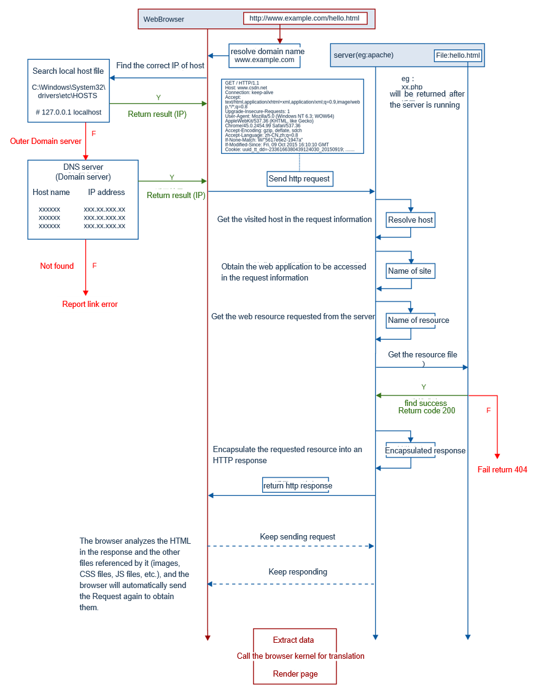

# Principles of Internet censorship and solutions

## 1. Introduction

We are living in a society with highly developed Internet technology, and this kind of technology gives us freedom to do almost anything. We can obtain, publish and spread different kinds of information between races, regions and countries. 

However, this kind of freedom may also lead to some sort of social preblems, like rumors, cyberbullying, pornography(even including child), etc. 

For example, The Nth Room Case[^1] that happened in Korea, about 260,000 people participated in sexual crimes to 76 women(including 16 underage girls), on Telegram. 

And one more example from my personal experiensce, when I was a freshman in university, I once received a message from a man called Daniil Ukraintsev on Vk written in Chinese like this.

He said a lot of a lot of rumors that insulted my government and my country. I can't stand his nonsense anymore so I asked him to shut up. 

He is not the only one. As a matter of fact, there has been such a group on the Internet spreading all kinds of fabricated rumors and try to divide our government and our nation. Many of my friends have been harassed by such people on the Internet. 

The examples I listed above are just the tip of the iceberg among the many social problems caused by the freedom given by Internet technology.

So, what I want to say is that the real freedom should be caged by limits. Like Rousseau said: Every one is born to be free, but everywhere he is in chains. And the limit of Internet is what we called Internet Censorship.

But somehow these limits also lead to many incovenience to us. While Internet censorship limits this uncontrolled freedom, It has also increased the difficulty in obtaining information, Influenced the spread of information and knowledge, and limited the use of internet service. Especially as a open source developer. I can't even normally use GitHub in China. So sometimes we need to find a way to break through this limitation. In order to do this, first thing we need to do is to understand the technical principles involved behind Internet Cnesorship.

## 2. Principle

### Web Browsing

Now let us learn about the proccess of web browsing. What exactly happened after we input a URL to our web broswer? Here is a flow chart that explain it.

Basically there are 8 steps in the Proccess of Web browsing:

1. Input URL
2. Resolve DNS
3. Build TCP link
4. Send Http request to Web server
5. Web server handle request
6. Send Http response to browser
7. Render page
8. Show Page

After we input a URL to our web browser, we need to get the IP address of domain in URL. We will first search the local hosts file in our computer which store the mapping relationship between domain names and IP addresses. If we can't find it, then we will ask the outer Domain server for IP address. After we get the IP address, we will try to make TCP connection and send Http request to the Web server. The Web server will handle the request and then send Http response to browser. Then the browser will get the response, and analyze other files referenced by HTML in response and automatically send more requests. After all the resources is given by Web server. The web page will be rendered and shown on our browser.

Now we know the proccess of Web browsing, how can we block a user from accessing web pages normally?

### URL Filtering

We can add a URL filtering system after the first step of web browsing proccess.

The basic working process of URL filtering is to check the URL address requested by the user, compare the information with the URL database or URL list, and execute the corresponding response action (allow/reject) if it matches a certain URL. If the URL that the user accesses is prohibited, the URL filtering system will block the user's request and return an error page to the user or redirect to a specified page to notify the user that the page accessed is denied. 

The URL database or list can be stored locally on the device or in the cloud. Generally, frequently accessed URLs are cached locally, and more URLs are stored in the cloud. When performing URL filtering, in order to minimize network latency, the system first will searche in the local cache, and then will searche in the cloud when the URL is not matched.

In addition, there are many ways to organize URL databases or URL lists, including URL classification, single URL blacklist, and single URL whitelist. The detailed URL filtering process is as follows.

### DNS Hijacking

URL过滤和DNS过滤都属于Web过滤，但是控制粒度和实现方式不同。URL过滤是通过提取用户URL请求中URL信息进行过滤，可以控制到网页级别；而DNS过滤是通过提取用户DNS请求中域名信息进行过滤，只能控制到整个域名级别。两者各有应用场景。

例如企业需要禁止员工访问域名为example.news.com的整个网站，就可以选择DNS过滤。但是如果只是想禁止此域名的娱乐版块 example.news.com/entertainment，那么就需要使用URL过滤。

### IP Filtering

### Packet Filtering

### Link Dump

### Internet Attack

## 3. Solution

### Hosts file

### VPN

### Proxy Server

## 4. Challenge

[^1]: [The Nth Room Case](https://en.wikipedia.org/wiki/Nth_Room_case)