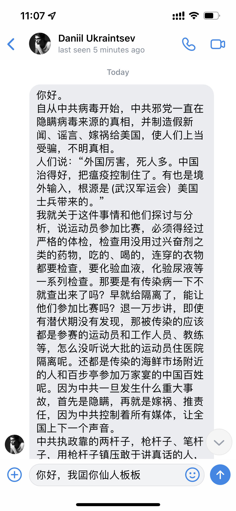

# Principles of Internet censorship and solutions

## 1. Introduction

We are living in a society with highly developed Internet technology, and this kind of technology gives us freedom to do almost anything. We can obtain, publish and spread different kinds of information between races, regions and countries. 

However, this kind of freedom may also lead to some sort of social preblems, like rumors, cyberbullying, pornography(even including child), etc. 

For example, The Nth Room Case[^1] that happened in Korea, about 260,000 people participated in sexual crimes to 76 women(including 16 underage girls), on Telegram. 

And one more example from my personal experiensce, when I was a freshman in university, I once received a message from a man called Daniil Ukraintsev on Vk written in Chinese like this.

He said a lot of a lot of rumors that insulted my government and my country. As we all know that the Covid 19 epidemic is a big tragedy of the world, and we have made great efforts to defeat it. But he says it's all because of China. He even called the Covid 19 virus is the virus of Chinese government like our government invented the virus to murder people all over the world. I can't stand his nonsense anymore so I replied him "Здравствуйте! Идите нахуй! Блин!" 

He is not the only one. As a matter of fact, there has been such a group on the Internet: they spread all kinds of fabricated rumors and try to divide our government and our nation. Many of my friends have been harassed by such people on the Internet. 

The examples I listed above are just the tip of the iceberg among the many social problems caused by the freedom given by Internet technology.

So, what I want to say is that the real freedom should be caged by limits

[^1]: [The Nth Room Case](https://en.wikipedia.org/wiki/Nth_Room_case)