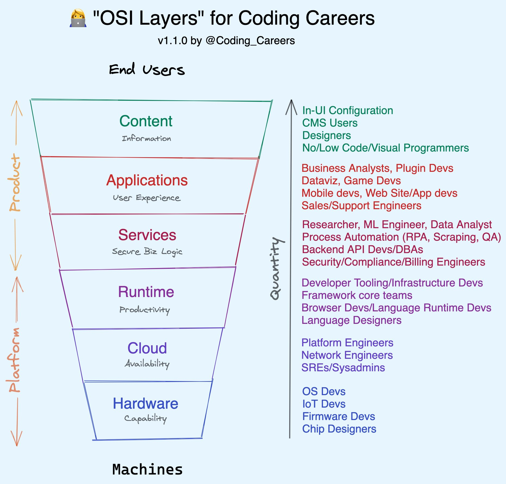
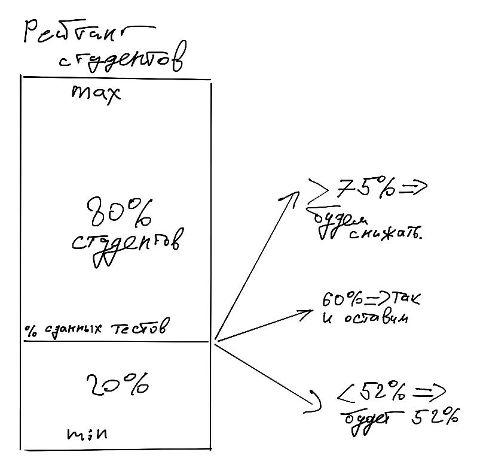

# Архитектура компьютера

## Лекция 1

## Введение. Вычислительные платформы. Курс

Пенской А.В., 2022

----

## План лекции

- Ссылки
- Рационализация. Точка зрения
- Содержание курса
- Оценивание (лабораторные, тесты, экзамен, побочные квесты)

---

## Ссылки

----

### Telegram чат


[Telegram](https://t.me/+j4M_RNLzoLthMTZi)

----

### Материалы курса


[Gitlab SE ITMO](https://gitlab.se.ifmo.ru/functional-programming/main)

- Конспект лекций прошлого года.
- Тексты слайдов.
- Инструкции и прочее.

----

### Бот

<!-- .element height="400px" -->

- Представляемся аккуратно, полным именем (ФИО). Оно будет использоваться как ключ в ведомости.
- В настоящий момент спит.

[@the_2022_csa_course_bot](t.me/the_2022_csa_course_bot)

---

## Рационализация. <br/> Точка зрения

Хороший разработчик -- тот, кто умеет делать правильные предположения:

- как устроены системы, с которыми он работает;
- как должны быть устроены системы, которые он делает;
- к каким последствиям могут приводить принятые им решения;
- какие «странности» можно ожидать и почему.

**Цель курса:**  дать базу и кругозор для таких предположений.

----

### Последствия

- отсутствие фокуса на конкретной архитектуре компьютера;
- попытки объяснить "ошибочные" решения;
- показать логику (логики) развития компьютерных систем (пантеизм vs. естественный отбор).

### Не пытаемся подготовить

- разработчика процессоров;
- программиста на низком уровне;
- программиста высокопроизводительных вычислительных алгоритмов;
- архитектора компьютерных систем.

### Уточним заголовок

- Архитектура компьютера
- Архитектура компьютерных систем
- Архитектура вычислительных платформ

----

### Вычислительная платформа

Platform-based Methodology


*Zeng, Haibo, Vishal Shah, Douglas Densmore, and Abhijit Davare. Simple Case Study in Metropolis. Vol. 4. Technical Memorandum UCB/ERL.*

----

### Иерархия уровней абстракции

 <!-- .element height="650px" -->

----

### Иерархия платформ для карьеры

 <!-- .element height="500px" -->

> [OSI Layers for Coding Careers, swyx](https://swyx.io/osi-layers-coding-careers)

----

### Тенденции

Внутри одного компьютера:

- смена основной процессорной архитектуры;
- разнообразие вычислительных платформ в обычных системах;
- реконфигурируемые вычислители.

За пределами одного компьютера:

- облачное окружение;
- распределённые системы и движение к системам систем;
- вычисление вне доверенного окружения.

*Вопрос:* дополнения?

---

## Содержание курса

(предварительное)

### Компьютерные системы в целом. Предпосылки

- 1. Введение. Вычислительные платформы. Компьютерные системы
- 2. Понятие системы и архитектуры компьютерных систем. [OMG Essence и культурные шаблоны.]
- 3. Ещё не компьютеры. Решение задач компьютерных систем без компьютеров.
- 4. Вычисления в релейных схемах и булевом базисе. Параллелизм уровня бит.
- 5. Особенности производства вычислительной техники. Why it is so hard? Законы Мура и Деннарда
- 6. Software-intensive systems. Программируемые вычислительные платформы.

----

### General-Purpose Computer. Проклятие фон Неймана

- 7. Универсальная вычислительная машина. Архитектура фон Неймана. ISA и микроархитектура. Гарвардский и Принстонский стиль.
- 8. Assembler-driven development. CISC и микропрограммное управление. NISC. Стековые процессоры.
- 9. Compiler-driven development. RISC и микроархитектура. Параллелизм уровня инструкций, конвейер.
- 10. Параллелизм уровня инструкций. Суперскалярные вычисления. EPIC. VLIW.
- 11. Иерархия памяти, кеширование.
- 12. Ввод-вывод. ISA. Многозадачность. Система прерываний. DMA.
- 13. Параллелизм уровня команд. Классификация Флинна и SIMT. Изоляция, сегменты и виртуальная память. Изоляция кода.

----

#### За пределами одного компьютера

- 14. Языки высокого уровня. Формирование иерархии вычислительных платформ. Disaggregation. Виртуальные машины и архитектура компиляторов.
- 15. Распределённые вычислительные платформы. Облачные вычислительные платформы и server-less computing. IoT, System of Systems, Fog and Edge computing.
- 16. Вычислительные платформы без доверенной среды исполнения. Blockchain and smart contracts.

#### Известные темы?

- Сетевая модель OSI
- Интерфейсы периферийных устройств. Классификация и примеры работы
- Машинная арифметика. Целые числа, фиксированная точка, плавающая точка

---

## Оценивание

|                 | баллы         |
| --------------- | ------------- |
| Лаб. 1          | $\Sigma 30$   |
| Лаб. 2          | $\Sigma 21$   |
| Лаб. 3          | $\Sigma 30$   |
| Экзамен         | 40            |
| Побочные квесты | индивидуально |
|                 | $\Sigma 121$  |

*Внимание:* у вас нет возможности пересдать/досдать в течение семестра.

---

## Лабораторные работы

Трудности формирования лабораторного курса:

- нежелательность фокусирования на узких вопросах;
- невозможность включить все рассматриваемые вопросы в лабораторный курс;
- нежелательность излишней абстрактности;
- количество студентов.

Решение:

- дать возможность специализации на интересующих вопросах;
- по возможности замкнуть учащихся на самих себя.

*Примечание:* полные версии заданий смотрите в материалах курса

----

### Лабораторная работа 1. <br/> Разбор полётов

> Murphy's law :: Anything that can go wrong will go wrong.

**Цель:** ознакомить учащегося с примером совокупности принятых решений и обстоятельств, которые привели к негативным последствиям.

**Задачи:**

1. Поиск инцидента для анализа.
2. Согласование инцидента.
3. Подготовка доклада о выбранном случае.
4. Выступление в форме диалога.
5. Добавление вашего отчёта в репозиторий и согласование вопроса на экзамен по вашему докладу.

----

#### Оценка лабораторной работы 1


Общая

|                 | баллы         |
| --------------- | ------------ |
| Лаб. 1          |              |
| - Преподаватель | 14           |
| - Студенты      | 6            |
| - Участие       | 10           |
|                 |  $\Sigma 30$ |


Студенты

| Кол-во докладов | I  | II | III место | остальные |
|-----------------|----|----|-----------|-----------|
| 1               | 1  | 0  | 0         | 0         |
| 2               | 10 | 5  | 0         | 0         |
| 3 и более       | 15 | 10 | 5         | 0         |


*Примечание:* размеры групп лучше нормализовать. Хорошая практика: выделить "излишки" в "группу Четверга" для самых больших.

----

### Лабораторная работа 2. <br/> Архитектурные принципы

**Цели:** ознакомить с принципами, не вошедшими в лекционный курс, а также продемонстрировать разное восприятие материала.

**Задачи** (для каждой темы/эссе):

1. Ознакомление с материалами.
2. Написание эссе в свободной форме, включающее:
    - основные мысли материалов;
    - характеристику значимости материала;
    - ваше рассуждение на тему.
3. Загрузка эссе в информационную систему.
4. Рецензирование чужих эссе. Double blind.

----

#### Оценка лабораторной работы 2

|                 | max           |
| --------------- | ------------- |
| Лаб. 2          |               |
| - Эссе 1        | 4             |
| - Эссе 2        | 4             |
| - Эссе 3        | 4             |
| - Отзывы        | $9 = (1+2)*3$ |
|                 | $\Sigma 21$   |

*Примечание:* сроки загрузки эссе -- жёсткие, <br/> пропустили $\rightarrow$ только на допсе.

----

(предварительные темы эссе, обновления в орг. чате)

#### Эссе 1

- [The Future of Programming -- Bret Victor -- Dropbox's DBX conference, 2013](https://www.youtube.com/watch?v=8pTEmbeENF4)
- [The Worst Programming Language Ever -- Mark Rendle -- NDC Oslo 2021](https://www.youtube.com/watch?v=vcFBwt1nu2U)

#### Эссе 2

- [How technology loses out in companies, countries & continents and what to do about it](https://www.youtube.com/watch?v=PQccNdwm8Tw)

#### Эссе 3

- [Science and Engineering for Cyber-Physical Systems -- Edward Lee -- 2021](<https://www.youtube.com/watch?v=USW_G23ksSI>)
- [Modeling in engineering and science -- Edward Lee -- Communications of the ACM -- 2019](https://dl.acm.org/doi/pdf/10.1145/3231590)

----

### Лабораторная работа 3. <br/> На кончиках пальцев

Цель:

- экспериментальное знакомство с устройством вычислительных платформ через моделирование;
- получение опыта работы с компьютерной системой на нескольких уровнях одновременно.

----

#### Состав лабораторной работы №3


1. Спецификация языка программирования
2. Транслятор
3. Спецификация системы команд
4. Модель процессора
5. Реализация алгоритма(-ов)

----

#### Варианты

Вариант определяется:

- комбинацией особенностей реализации;
- реализуемым алгоритмом.

```markdown
| Особенность              | 1.                 | 2.                  | 3.     | 4.   |
| ------------------------ | ------------------ | ------------------- | ------ | ---- |
| ЯП. Синтаксис похож на   | Java[Script]/C     | assembler           | forth  | lisp |
| ЯП. Процедуры            | нереентерабельные  | реентерабельные     | нет    |      |
| Проц. Поддержка стека    | есть               | нет                 |        |      |
| Организация памяти       | Принстонская       | Гарвардская         |        |      |
| Архитектура процессора   | CISC               | RISC                | Stack  |      |
| Внутреннее устройство    | microcode          | pipeline            | tagged | нет  |
| Представление маш. кода  | structured+binary  | structured          |        |      |
| Ввод-вывод               | SPI без прерываний | SPI прерывания      | слово  |      |
| Ввод-вывод (ISA)         | memory-mapped      | port-mapped         |        |      |
| Параллелизм              | SISD               | SISD                | SIMT   |      |
| Сторожевой таймер        | есть               | нет                 |        |      |
```

----

#### Оценка лабораторной работы №3 (требуется детализация)

|                 | max           |
| --------------- | ------------- |
| Лаб. 3          |               |
|                 | $\Sigma 30$   |

---

## Текущее тестирование

- Классический тест через бота.
- Проводится на каждом (или почти) лекционном занятии, тема: материал прошлой лекции.
- В начале занятия вам даётся 3-5 минут на его прохождение. По завершении: даётся отзыв по агрегированным данным.
- Больше половины ответов правильно -- зачёт, меньше -- незачёт.
- Результат за всё промежуточное тестирование: определяется в конце семестра, cut-of-score определяется следующим образом:
    - строится рейтинг всех студентов;
    - смотрится процент сданных тестов на уровне примерно $\frac{1}{5}$ снизу (но не менее 52%).
- Влияние на тех, кто провалил промежуточное тестирование:
    - невозможность автомата;
    - дополнительные вопросы на экзамене по проваленным темам;
    - округление перестаёт работать в пользу студента.
- Тесты не переписываются.

----

### Визуализация расчёта cut-of-score

<!-- .element height="500px" -->

---

## Побочные квесты

Возможность получить дополнительные баллы. Примеры:

- Исправление опечаток в материалах курса.
- Улучшение текстовых и графических материалов.
- Синхронизация слайдов и лекционных заметок.
- Обновление / переработка материала.
- Написание дополнительного раздела, к примеру: "Работа со строками"
- Автоматизация курса (ведомость, бот).
- Написание программных демонстраций к материалам курса.
- Выдающиеся организационные способности.

*Примечание:*

- что-то понятно -- просто сделайте Merge Request;
- что-то неоднозначное -- заведите Issue;
- что-то известное -- посмотрите в Issue.

----

### Merge request policy

- MR должны помогать преподавателю, а не становиться самостоятельной проблемой.
- Не стоит плодить без необходимости. К примеру: вы поправили 3 опечатки -- сделайте 1 запрос с 3 коммитами.
- Оформление:
    - Title -- о чём MR. Пример: typo -- исправление опечатки(-ок).
    - Description -- важные детали и комментарии: группа и ФИО автора, что сделано (не надо дублировать Title и diff, описывая, какие именно слова вы поправили и по какому правилу).
- MR должен сливаться без конфликтов. Исправление конфликтов -- задача автора MR. Если конфликт висит достаточно долго, MR будет закрыт.

----

- Ищется волонтёр(-ы), который соберёт все исправления опечаток в 1 merge request:
    - сделает cherry-pick коммитов в одну ветку (чтобы сохранить автора)
    - по ходу дела исправит все merge conflict-ы и уберёт повторы
    - закроет собранные MR с исправлениями со ссылкой на новый
    - опишет, как превратить автора коммита в студента с группой
    - оптимизирует этот процесс

---

## Экзамен

Устный групповой экзамен. Сдаётся группами лабораторной работы №1. Включает два вопроса каждому:

- по лекционным материалам;
- по материалам лабораторной работы 1 вашей группы.

Оценка:

- 40 баллов -- суть, контекст и взаимосвязи.
- 30 баллов -- суть, не выходя за пределы вопроса.
- 20 баллов -- суть, допустимы незначительные пробелы.
- 10 баллов -- ключевые моменты вопроса, есть существенные пробелы в знаниях.

Значительное внимание оказывает ваше участие в дискуссии (как положительное, так и отрицательное).

----

### Автомат

Если у вас 60+ баллов и вам достаточно.

### Упрощённый экзамен

- Экзамен проводится в формате быстрого опроса без дискуссий и уточнений.
- Максимальный балл -- 30.

### Сдача долгов, допса

Осуществляется за пределами семестра путём формирования "виртуальной группы", для которой воспроизводится лабораторный курс целиком.
