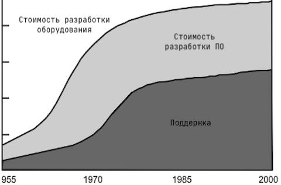
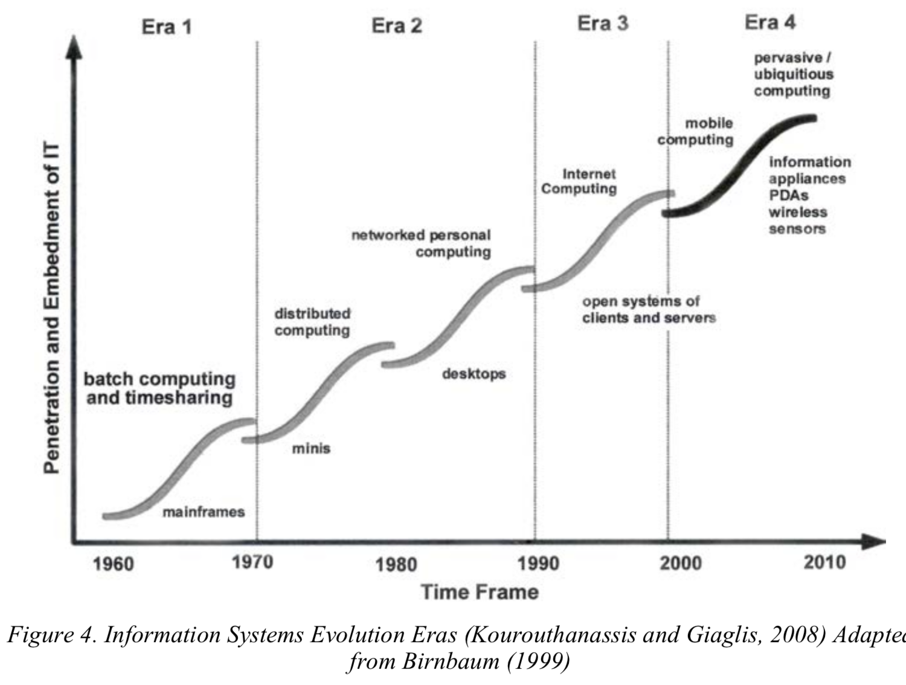
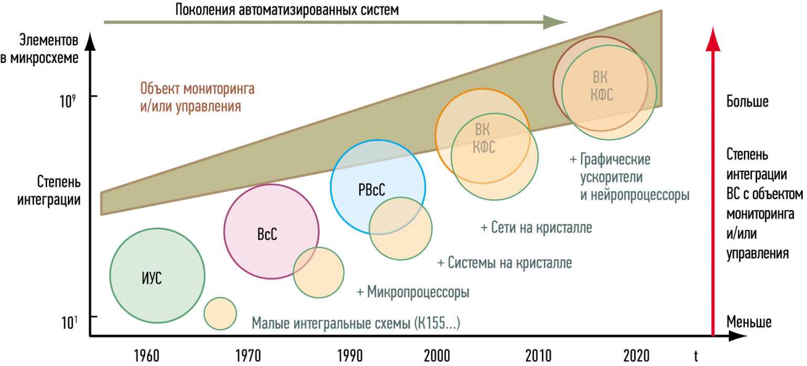
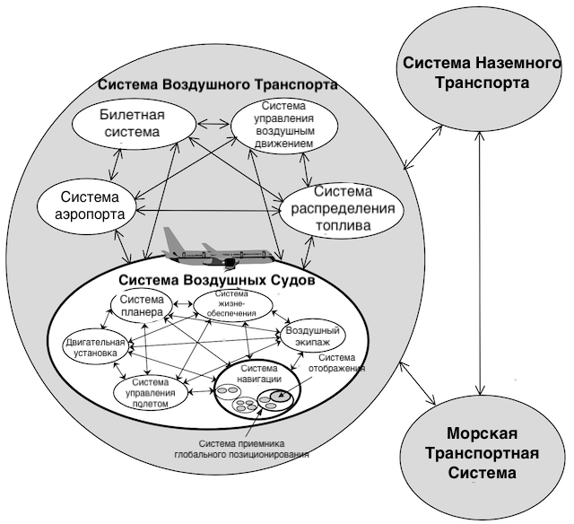
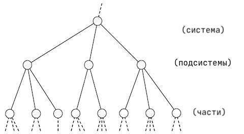
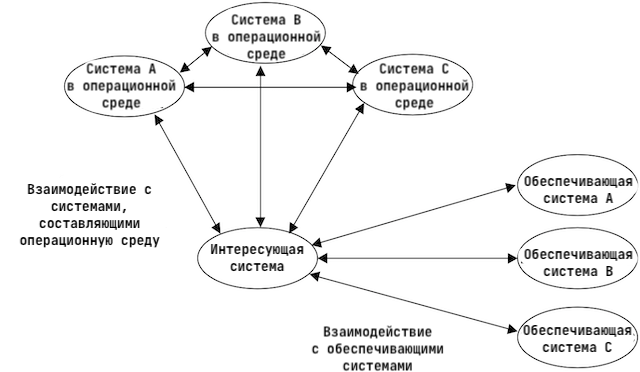
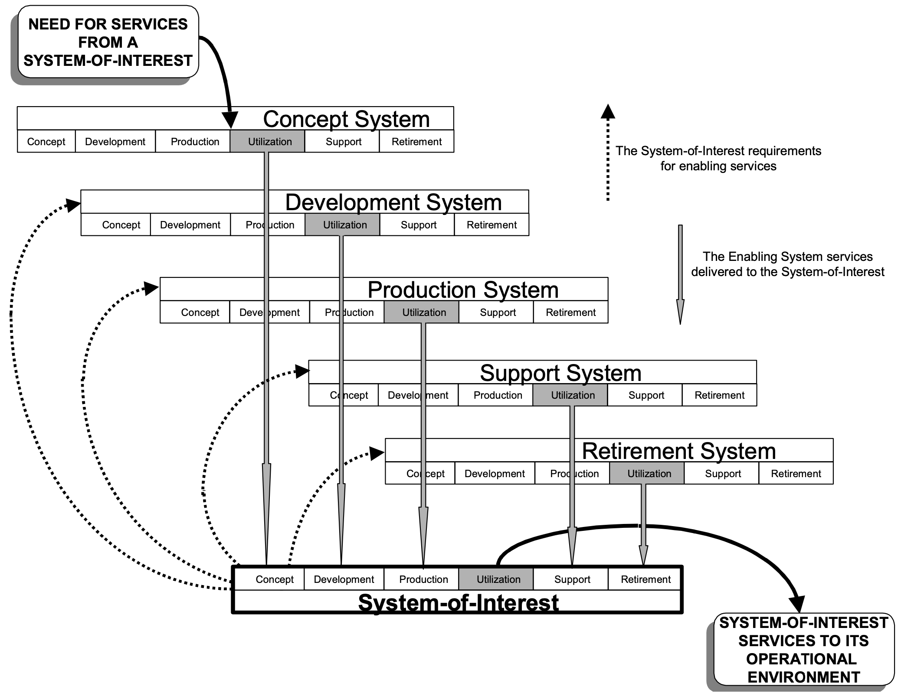
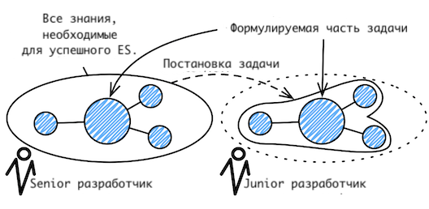
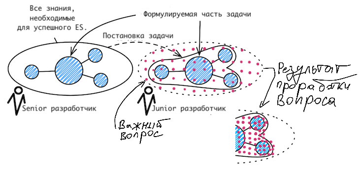
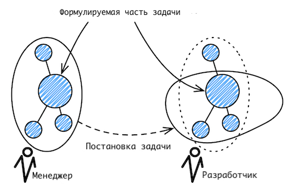

# Архитектура компьютера

## Лекция 2

## Информационные и управляющие системы. Понятие системы

Пенской А.В., 2022

----

## План лекции

- Минутка саморекламы
- Компьютерные системы, информационные и управляющие системы
- Системная инженерия. Понятие системы
- Проблемы разработки компьютерных систем

- 一分钟的自我推销
- 计算机系统、信息和控制系统
- 系统工程。 系统概念
- 计算机系统开发问题

---

## Минутка саморекламы. Проекты. Курсы 自我推销的时刻。 项目。 培训班

Особенности проектов для участия: 参与项目特点：

- Размещены на GitHub
- Лицензия -- BSD
- Задачи проектов могут стать вашими дипломами и практиками  
- 托管在 GitHub 上
- 许可证——BSD
- 项目任务可以成为你的文凭和实习

Подробнее: [Aleksandr Penskoi](https://ryukzak.github.io)

----

### NITTA

Инструментарий для генерации и программирования специализированных не фон – Неймановских процессоров, предназначенных для циклического исполнения алгоритмов управления и обработки сигналов/данных.  
用于生成和编程专用诺依曼处理器的工具，专为控制算法和信号/数据处理的循环执行而设计。

- обеспечить высокую скорость и уровень параллелизма для нерегулярных алгоритмов (где не используют GPU) и жесткое реальное время (с точностью до такта);  
  为不规则算法（不使用 GPU）和硬实时（精确到时钟周期）提供高速和并行性水平；
- сделать процессор реконфигурируемым под разные прикладные области;  
  使处理器可针对不同的应用领域进行重新配置；
- предоставить язык высокого уровня для прикладных разработчиков и быструю компиляцию.  
  为应用程序开发人员提供高级语言和快速编译。
Технологии: Haskell, Verilog, TypeScript, React, GitHub.

----

### Course-bot (Telegram)

Features: 特征：

- Quiz in test form  
  测试形式的测验
- Essay submissions by the students with cross-review  
  学生提交的论文并进行交叉评审
- Scheduling in-class presentations, including topic reviews by the teacher, agenda generation, and evaluation by the teacher and students.  
  安排课堂演示，包括教师的主题评论、议程生成以及教师和学生的评估。

Technical details:

- eDSL for describing bot in dialogue form  
  eDSL，用于以对话形式描述机器人
- Implementing on Clojure  
  在 Clojure 上实现
- Possible topics for bachelor’s or master’s thesis:  
  学士或硕士论文的可能主题：

    - eDSL for dialogue system descriptions
      用于对话系统描述的 eDSL
    - Automated testing for dialogue systems based on a property-based approach
      基于属性的方法自动测试对话系统

---

### Курс   Системная инженерия: Архитектурное моделирование компьютерных систем   系统工程：计算机系统的架构建模

> Всё, что может пойти не так, пойдёт не так.  
> 一切可能出错的事情都会出错。

--- закон Мерфи 墨菲定律

> Любое дело всегда длится дольше, чем ожидается, даже если учесть закон Хофштадтера.  
> 即使考虑到霍夫施塔特定律，任何生意所花费的时间总是比预期的要长。

--- закон Хофштадтера 霍夫施塔特定律

---

Причины: 原因：

- Современные системы имеют высокую сложность и тесно вплетены в непростые бизнес-процессы.  
  现代系统非常复杂，并且与复杂的业务流程紧密相连。
- Их разрабатывает толпа обычных людей, от которых требуется ничего не забыть, ничего не упустить, нигде не ошибиться и договориться между собой.  
  它们是由一群普通人发展起来的，要求他们不忘记任何事情，不遗漏任何事情，不犯任何错误，并在他们之间达成一致。

Данный курс учит: 本课程教授：

- базовым приёмам системной инженерии (Как создавать успешные системы?);  
  基本系统工程技术（如何创建成功的系统？）；
- архитектурному документированию (Как записать "всё важное" в виде документа?).  
  架构文档（如何以文档的形式写下“所有重要的事情”？）。

---

## Компьютерные системы 计算机系统

Для данного курса -- любые системы, оснащённые внутренними алгоритмами управления. Примеры:
对于本课程 - 任何配备内部控制算法的系统。 例子：

- светодиодная лампа;
- кабели для зарядки мобильных телефонов;
- часы и, конечно, умные часы;
- интерактивные детские игрушки;
- автомобиль и беспилотный автомобиль;
- станок;
- дверной замок;
- и т.п.
- 点灯;
- 手机充电线；
- 手表，当然还有智能手表；
- 互动儿童玩具；
- 汽车和自动驾驶汽车；
- 机器;
- 门锁;
- 等等。

----

###  具有主要软件组件的系统

**Software-intensive systems**: are systems in which software development and/or integration are dominant considerations (i.e., most complex systems these days). This includes computer-based systems ranging from individual software applications, information systems, embedded systems, software product lines and product families and systems-of-systems.

**软件密集型系统**：软件开发和/或集成是主要考虑因素的系统（即当今最复杂的系统）。 这包括基于计算机的系统，包括个人软件应用程序、信息系统、嵌入式系统、软件产品线和产品系列以及系统系统。

--- ISO/IEC/IEEE 42010

---

### Классификация компьютерных систем 计算机系统的分类

#### Информационные системы 信息系统

: получить данные, преобразовать/накопить, и выдать в измененном/обработанном виде.  
：接收数据，转换/累积，并以修改/处理的形式发出。

Особенности:

- Главный приоритет: производительность.
- Спекулятивные вычисления.
- Параллелизм.
- Кластерные и облачные вычисления.

特点：

- 首要任务：性能。
- 推测性计算。
- 并行性。
- 集群和云计算。

----

 <!-- .element height="80%" width="80%" -->

<!-- https://www.researchgate.net/publication/270586955_TOWARDS_PERVASIVE_HYBRID_INTERFACES_Integration_of_ubiquitous_computing_technology_in_the_design_process -->

---

#### Управляющие системы 控制系统

: взаимодействие с реальным физическим миром с целью контроля или управления.  
：出于控制或管理的目的与真实物理世界进行交互。

Особенности:

- встроенное исполнение (ограниченные ресурсы, специализированная аппаратура);
- работа в режиме реального времени;
- автономная эксплуатация.

特点：

- 内置设计（资源有限，专用设备）；
- 实时工作；
- 自主运行

----

#### Реальное время 即时的

- Реальное время /= быстро
- Реальное время /= абсолютная точность
- Реальное время /= 100% надёжность
- Реальное время -- предсказуемо и в заданное время

- 实时/=快速
- 实时/=绝对准确度
- 实时/= 100% 可靠性
- 实时 - 可预测且准时

Примеры:

- ГЭС, водосброс.
  水力发电站、溢洪道。
- Технически одна и та же система может быть как информационной, так и системой реального времени:
  从技术上讲，同一个系统可以既是信息系统又是实时系统：
    - Видео кодек и видео плеер.
      视频编解码器和视频播放器。 <!-- .element: class="fragment" -->

----

#### Эволюция управляющих систем 控制系统的演变

Примеры КФС: гироскутер; безопасные, энергоэффективные вращающиеся двери; провис проводов и передаваемая мощность.  
FSC 示例：悬浮滑板； 安全、节能的旋转门； 线垂和传输功率。

*Extra*: [Пенской А.В., Понятие киберфизической системы считать вредным](https://ryukzak.github.io/2019/11/15/cps-concept.html)

---

## Системная инженерия. Понятие системы 系统工程。 系统概念

Системная инженерия (SE) -- это междисциплинарный подход и средство, позволяющее реализовать успешные системы. Он фокусируется на целостном и одновременном понимании потребностей заинтересованных сторон (стейкхолдеров); изучении возможностей; документировании требований; и синтезе, проверке, приемке и разработке решений при рассмотрении всей проблемы, от исследования концепции системы до вывода системы из эксплуатации.  
系统工程（SE）是实现成功系统的跨学科方法和手段。 它侧重于全面、同步地了解相关方（利益相关者）的需求； 探索可能性； 记录要求； 在考虑整个问题（从系统概念探索到系统退役）时综合、验证、接受和开发解决方案。

--- The Guide to the Systems Engineering Body of Knowledge (SEBoK), V.1.3. 2014.  
--- 系统工程知识体系指南 (SEBoK)，V.1.3。 2014年。

----

----

### Система как совокупность частей 系统作为一组部件

System is a combination of interacting elements organized to achieve one or more stated purposes  
系统是为了实现一个或多个既定目的而组织的相互作用元素的组合

NOTE 1 A system may be considered as a product or as the services it provides.  
注 1：系统可被视为产品或其提供的服务。

NOTE 2 In practice, the interpretation of its meaning is frequently clarified by the use of an associative noun, e.g. aircraft system. Alternatively the word system may be substituted simply by a context dependent synonym, e.g. aircraft, though this may then obscure a system principles perspective.  
注 2：在实践中，其含义的解释经常通过使用关联名词来澄清，例如： 飞机系统。 或者，单词系统可以简单地由上下文相关的同义词代替，例如 飞机，尽管这可能会掩盖系统原理的观点。

Так ли это важно?  
它真的那么重要吗？

----

### Идентичность системы 系统身份

Идентичность системы определяется её функциональным местом.  
系统的身份由其功能位置决定。

----

### Операционное окружение 操作环境

The environment in which systems are deployed. The problem or opportunity in response to which the system has been developed, exists in this environment.  
系统部署的环境。 系统开发所针对的问题或机会存在于该环境中。

The operational environment is a significant factor in defining the needed system capabilities, desired stakeholder outcomes and benefits, and constraints.  
操作环境是定义所需系统功能、期望的利益相关者结果和收益以及约束的重要因素。

---

### Жизненный цикл

Жизненный цикл системы -- эволюция интересующей системы со временем от концепции до вывода из эксплуатации  
系统生命周期——感兴趣的系统从概念到退役的随时间的演变

1. Концептуальный этап
2. Этап разработки
3. Этап производства
4. Этап утилизации
5. Этап поддержки
6. Этап вывода из эксплуатации

1. 概念阶段
2. 发展阶段
3. 生产阶段
4. 处置阶段
5. 支持阶段
6. 退役阶段

----

#### Обеспечивающая система 支持系统

Обеспечивающая система -- система, которая дополняет интересующую систему на этапах ее жизненного цикла, но не обязательно вносит непосредственный вклад в ее функционирование во время эксплуатации.  
支持系统是在其生命周期阶段补充感兴趣的系统的系统，但不一定直接有助于其在运行期间的功能。

ПРИМЕЧАНИЕ 1 Например, когда система, представляющая интерес, вступает в стадию производства, требуется вспомогательная производственная система.  
注1：例如，当感兴趣的系统进入生产阶段时，需要有配套的生产系统。

ПРИМЕЧАНИЕ 2 Каждая обеспечивающая система имеет свой собственный жизненный цикл. Этот Международный стандарт применим к каждой обеспечивающей системе, когда она сама по себе рассматривается как система, представляющая интерес.  
注 2：每个使能系统都有自己的生命周期。 当每个使能系统本身被认为是感兴趣的系统时，本国际标准适用于该系统。

--- ISO 15288

----

----

### Разработка успешной системы требует 开发一个成功的系统需要

- рассмотрения её структуры
- рассмотрения её операционного окружения
- рассмотрения её жизненного цикла
- рассмотрения обеспечивающих систем

- 考虑其结构
- 考虑其运行环境
- 考虑其生命周期
- 考虑支持系统

Аналогичный результат получен в: OMG Essence, СМД-методологии.  
在 OMG Essence、SMD 方法中获得了类似的结果。

---

## Проблемы разработки компьютерных систем 计算机系统开发问题

> Poor management can increase software costs more rapidly than any other factor.   -- Barry W. Boehm
> 管理不善会比任何其他因素更快地增加软件成本。   -- 巴里·W·伯姆

Ключевые проблемы: 关键的问题：

- формулирование/генерация,
- передача/сохранение,
- использование информации.

- 配方/生成，
- 传输/保存，
- 信息的使用。

А также: неполнота, неоднозначность, нераспределённость, противоречивость, стремление к решению...  
还有：不完整、模糊、缺乏分布、不一致、渴望解决方案......

----

## Коммуникации и поиск решений 沟通和寻找解决方案

Some critical questions for the success of the system may be missed.  
系统成功的一些关键问题可能会被忽略。

- Question is beyond the competence of the developer.
- Template design dominates.
- Artificial narrowing of design requirements.
- Substitution of one task to another.
- Inefficient arrangement of priorities at designing.
- 问题超出了开发人员的能力范围。
- 模板设计占主导地位。
- 人为缩小设计要求。
- 将一项任务替换为另一项任务。
- 设计时优先级安排效率低下。
  

### Постановка задачи техническим специалистом 技术专家的任务说明

----

### Попытка разобраться самостоятельно 尝试自己解决

----

### Постановка задачи нетехническим специалистом 非技术专家对问题的陈述

