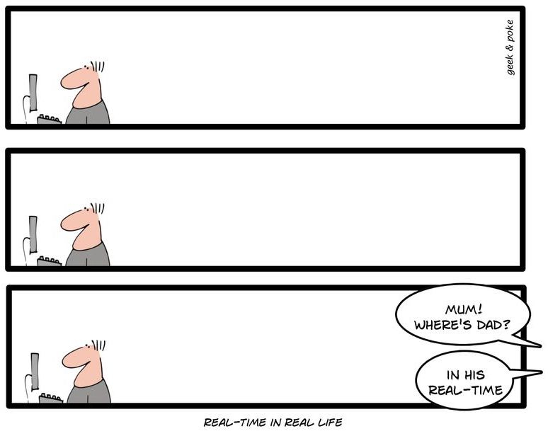
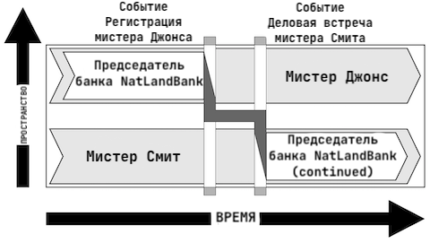

# Архитектура компьютера

## Лекция 2

## Информационные и управляющие системы. Понятие системы

Пенской А.В., 2022

----

## План лекции

- Минутка саморекламы
- Компьютерные системы, информационные и управляющие системы
- Системная инженерия. Понятие системы
- Проблемы разработки компьютерных систем

---

## Минутка саморекламы. Проекты. Курсы

Особенности проектов для участия:

- Размещены на GitHub
- Лицензия -- BSD
- Задачи проектов могут стать вашими дипломами и практиками

Подробнее: [Aleksandr Penskoi](https://ryukzak.github.io)

----

### NITTA

Инструментарий для генерации и программирования специализированных не фон – Неймановских процессоров, предназначенных для циклического исполнения алгоритмов управления и обработки сигналов/данных.

- обеспечить высокую скорость и уровень параллелизма для нерегулярных алгоритмов (где не используют GPU) и жесткое реальное время (с точностью до такта);
- сделать процессор реконфигурируемым под разные прикладные области;
- предоставить язык высокого уровня для прикладных разработчиков и быструю компиляцию.

Технологии: Haskell, Verilog, TypeScript, React, GitHub.

----

### Course-bot (Telegram)

Features:

- Quiz in test form
- Essay submissions by the students with cross-review
- Scheduling in-class presentations, including topic reviews by the teacher, agenda generation, and evaluation by the teacher and students.

Technical details:

- eDSL for describing bot in dialogue form
- Implementing on Clojure
- Possible topics for bachelor’s or master’s thesis:

    - eDSL for dialogue system descriptions
    - Automated testing for dialogue systems based on a property-based approach

----

### Курс   Системная инженерия: Архитектурное моделирование компьютерных систем

> Всё, что может пойти не так, пойдёт не так.

--- закон Мерфи

> Любое дело всегда длится дольше, чем ожидается, даже если учесть закон Хофштадтера.

--- закон Хофштадтера

----

Причины:

- Современные системы имеют высокую сложность и тесно вплетены в непростые бизнес-процессы.
- Их разрабатывает толпа обычных людей, от которых требуется ничего не забыть, ничего не упустить, нигде не ошибиться и договориться между собой.

Данный курс учит:

- базовым приёмам системной инженерии (Как создавать успешные системы?);
- архитектурному документированию (Как записать "всё важное" в виде документа?).

---

## Компьютерные системы

Для данного курса -- любые системы, оснащённые внутренними алгоритмами управления. Примеры:

- светодиодная лампа;
- кабели для зарядки мобильных телефонов;
- часы и, конечно, умные часы;
- интерактивные детские игрушки;
- автомобиль и беспилотный автомобиль;
- станок;
- дверной замок;
- и т.п.

----

### Системы с преобладающей программной составляющей

**Software-intensive systems**: are systems in which software development and/or integration are dominant considerations (i.e., most complex systems these days). This includes computer-based systems ranging from individual software applications, information systems, embedded systems, software product lines and product families and systems-of-systems.

--- ISO/IEC/IEEE 42010

---

### Классификация компьютерных систем

#### Информационные системы

: получить данные, преобразовать/накопить, и выдать в измененном/обработанном виде.

Особенности:

- Главный приоритет: производительность.
- Спекулятивные вычисления.
- Параллелизм.
- Кластерные и облачные вычисления.

----

 <!-- .element height="80%" width="80%" -->

<!-- https://www.researchgate.net/publication/270586955_TOWARDS_PERVASIVE_HYBRID_INTERFACES_Integration_of_ubiquitous_computing_technology_in_the_design_process -->

---

#### Управляющие системы

: взаимодействие с реальным физическим миром с целью контроля или управления.

Особенности:

- встроенное исполнение (ограниченные ресурсы, специализированная аппаратура);
- работа в режиме реального времени;
- автономная эксплуатация.

----

#### Реальное время

- Реальное время /= быстро
- Реальное время /= абсолютная точность
- Реальное время /= 100% надёжность
- Реальное время -- предсказуемо и в заданное время

Примеры:

- ГЭС, водосброс.
- Технически одна и та же система может быть как информационной, так и системой реального времени:
    - Видео кодек и видео плеер. <!-- .element: class="fragment" -->

----

#### Эволюция управляющих систем

Примеры КФС: гироскутер; безопасные, энергоэффективные вращающиеся двери; провис проводов и передаваемая мощность.

*Extra*: [Пенской А.В., Понятие киберфизической системы считать вредным](https://ryukzak.github.io/2019/11/15/cps-concept.html)

---

## Системная инженерия. Понятие системы

Системная инженерия (SE) -- это междисциплинарный подход и средство, позволяющее реализовать успешные системы. Он фокусируется на целостном и одновременном понимании потребностей заинтересованных сторон (стейкхолдеров); изучении возможностей; документировании требований; и синтезе, проверке, приемке и разработке решений при рассмотрении всей проблемы, от исследования концепции системы до вывода системы из эксплуатации.

--- The Guide to the Systems Engineering Body of Knowledge (SEBoK), V.1.3. 2014.

----

----

### Система как совокупность частей

System is a combination of interacting elements organized to achieve one or more stated purposes

NOTE 1 A system may be considered as a product or as the services it provides.

NOTE 2 In practice, the interpretation of its meaning is frequently clarified by the use of an associative noun, e.g. aircraft system. Alternatively the word system may be substituted simply by a context dependent synonym, e.g. aircraft, though this may then obscure a system principles perspective.

Так ли это важно?

----

### Идентичность системы

Идентичность системы определяется её функциональным местом.

----

### Операционное окружение

The environment in which systems are deployed. The problem or opportunity in response to which the system has been developed, exists in this environment.

The operational environment is a significant factor in defining the needed system capabilities, desired stakeholder outcomes and benefits, and constraints.

---

### Жизненный цикл

Жизненный цикл системы -- эволюция интересующей системы со временем от концепции до вывода из эксплуатации

1. Концептуальный этап
2. Этап разработки
3. Этап производства
4. Этап утилизации
5. Этап поддержки
6. Этап вывода из эксплуатации

----

#### Обеспечивающая система

Обеспечивающая система -- система, которая дополняет интересующую систему на этапах ее жизненного цикла, но не обязательно вносит непосредственный вклад в ее функционирование во время эксплуатации.

ПРИМЕЧАНИЕ 1 Например, когда система, представляющая интерес, вступает в стадию производства, требуется вспомогательная производственная система.

ПРИМЕЧАНИЕ 2 Каждая обеспечивающая система имеет свой собственный жизненный цикл. Этот Международный стандарт применим к каждой обеспечивающей системе, когда она сама по себе рассматривается как система, представляющая интерес.

--- ISO 15288

----

----

### Разработка успешной системы требует

- рассмотрения её структуры
- рассмотрения её операционного окружения
- рассмотрения её жизненного цикла
- рассмотрения обеспечивающих систем

Аналогичный результат получен в: OMG Essence, СМД-методологии.

---

## Проблемы разработки компьютерных систем

> Poor management can increase software costs more rapidly than any other factor.   -- Barry W. Boehm

Ключевые проблемы:

- формулирование/генерация,
- передача/сохранение,
- использование информации.

А также: неполнота, неоднозначность, нераспределённость, противоречивость, стремление к решению...

----

## Коммуникации и поиск решений

Some critical questions for the success of the system may be missed.

- Question is beyond the competence of the developer.
- Template design dominates.
- Artificial narrowing of design requirements.
- Substitution of one task to another.
- Inefficient arrangement of priorities at designing.

### Постановка задачи техническим специалистом

----

### Попытка разобраться самостоятельно

----

### Постановка задачи нетехническим специалистом

