# Архитектура компьютера

## Лекция 3

## Архитектура. Ещё не компьютеры. Решение задач компьютеров без компьютеров

Пенской А.В., 2022

----

## План лекции

- Понятие архитектуры
- Почему архитектура -- это так важно?
- Ещё не компьютеры. Решение задач компьютеров без компьютеров
    - Арифмометр и логарифмическая линейка.
    - Расчёт артиллерийских таблиц.
    - Жаккардовый ткацкий станок.
    - Странное.

- 架构概念
- 为什么架构如此重要？
- 还没有电脑。 无需计算机即可解决计算机问题
     - 算术计和计算尺。
     - 火炮表的计算。
     - 提花织机。
     - 奇怪的。
---

## Архитектура 架构

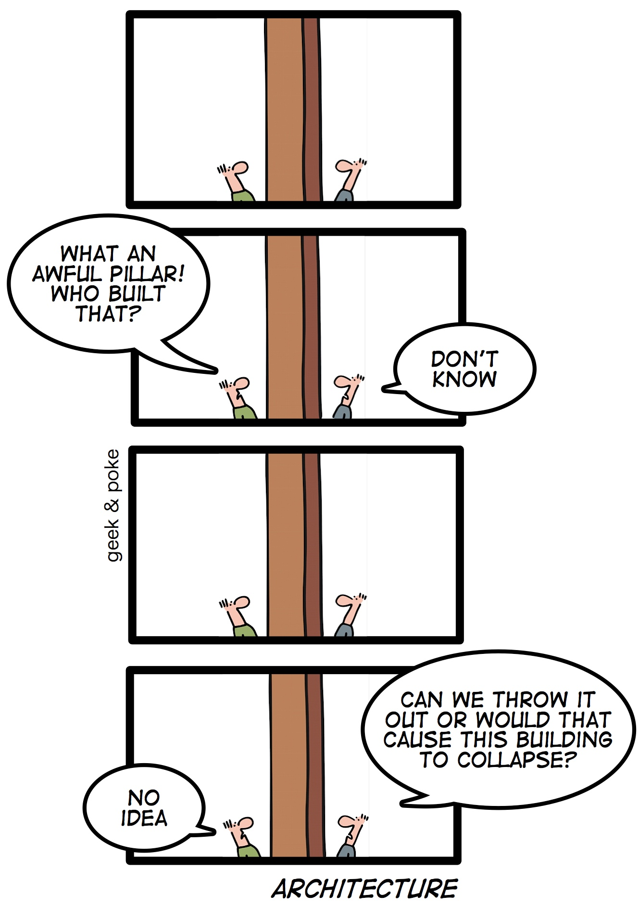<!-- .element: height="600px" -->

----

### Классическое определение: Гради Буч 经典定义：Grady Butch 经典定义

Архитектура -- логическая и физическая структура компонентов системы и их взаимосвязи, сформированные всеми стратегическими и тактическими проектными решениями, применяемыми во время разработки.  
架构是系统组件及其关系的逻辑和物理结构，由开发过程中做出的所有战略和战术设计决策决定。

*Логический взгляд* на систему учитывает концепции, созданные в концептуальной модели, и устанавливает существование и роль ключевых абстракций и механизмов, которые будут определять архитектуру и общий дизайн системы.  
系统的“逻辑视图”考虑了概念模型中创建的概念，并建立了关键抽象和机制的存在和作用，这些抽象和机制将定义系统的体系结构和总体设计。

*Физическая модель* системы описывает конкретный программный и аппаратный состав реализации системы. Очевидно, что физическая модель зависит от конкретной технологии.  
系统的“物理模型”描述了系统实现的特定软件和硬件组成。 显然，物理模型取决于具体的技术。

----

### Системно-инженерное определение: ISO 42010  系统工程定义：ISO 42010

Архитектура (системы) -- фундаментальные концепции или свойства системы в ее среде, воплощенные в ее элементах, взаимосвязях и принципах ее проектирования и развития  
（系统的）架构——系统在其环境中的基本概念或属性，体现在其设计和开发的元素、关系和原则中

Описание архитектуры -- рабочий продукт, используемый для воплощения архитектуры  
架构描述——用于实现架构的工作产品

----

### Сущностные определения 基本定义

Архитектура -- все важное  
建筑才是最重要的

--- Интернет

Software architecture (en) is the set of design decisions which, if made incorrectly, may cause your project to be cancelled.  
软件架构（en）是一组设计决策，如果做出错误，可能会导致您的项目被取消。

--- Eoin Woods (SEI 2010)

Архитектура программного обеспечения (ru) -- это набор проектных решений, которые, если они будут приняты неправильно, могут привести к отмене вашего проекта.  
软件架构 (en) 是一组设计决策，如果制定不正确，可能会导致项目取消。

--- Eoin Woods (SEI 2010)

---

## Почему архитектура -- это так важно? 为什么架构如此重要？

### V-диаграмма V形图

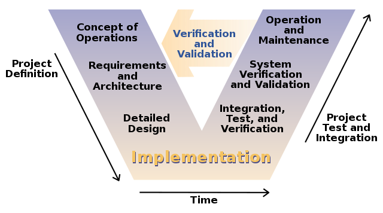

----

### Риск откладывания управления рисков 延迟风险管理的风险

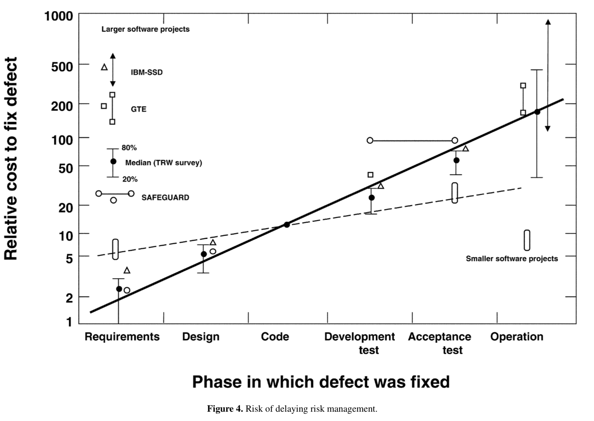

----

### Эффект архитектурного проектирования 架构设计效果

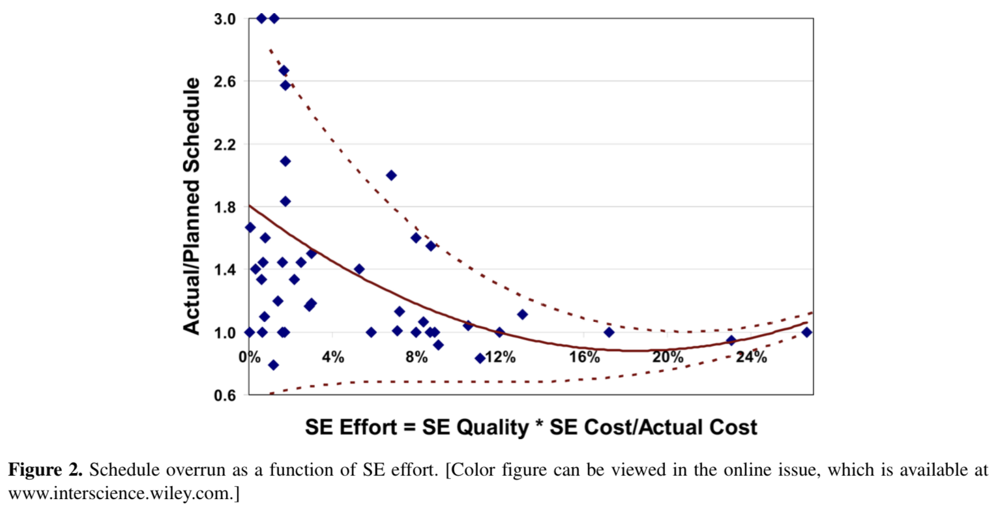

---

<div class="row"><div class="col">

## Примеры ошибок 错误示例

Выше были теоретические рассуждения.  
以上是理论上的考虑。

Теперь несколько примеров из практики.  
现在一些实践中的例子。

</div><div class="col">

<!-- .element: height="600px" -->

</div></div>

----

### Пример проблем с операционным окружением 运行环境问题示例

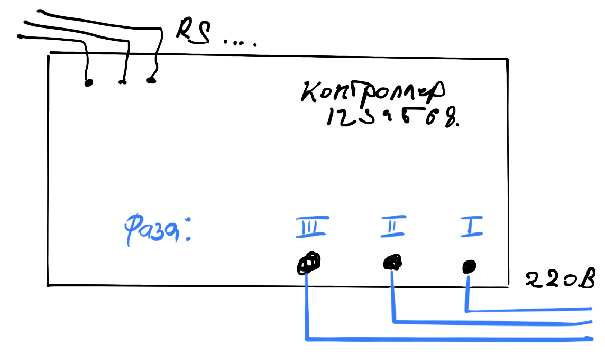

----

Подсказка: 线索：

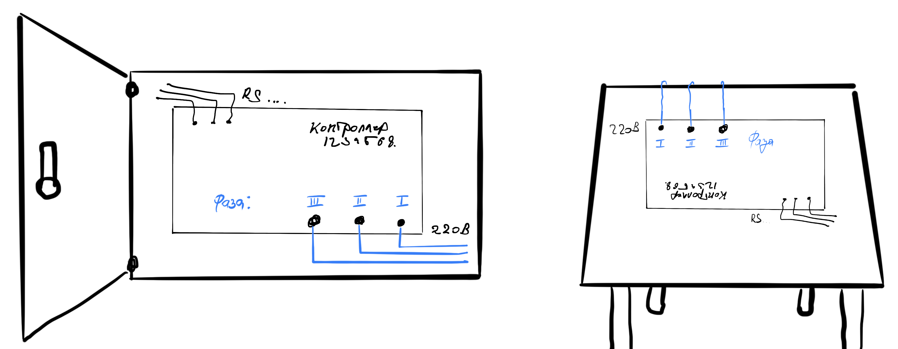

Notes: На столе разработчика -- силовые линии лучше увести со стола вверх. В шкафу -- вниз, т.к. техника безопасности.  
注意：在开发人员的桌子上，最好将电源线从桌子上移开。 在壁橱里 - 下来，因为 安全须知。

----

### Пример с коммуникацией между стадиями жизненного цикла 生命周期阶段之间通信的示例

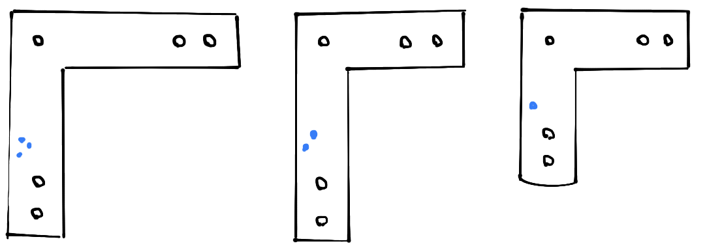

----

Подсказка: 线索：

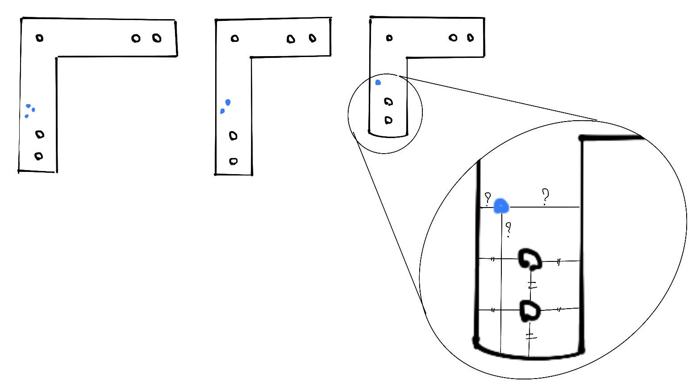

Notes: План: вырезать на лазере. Синие точки -- отверстия в качестве маркировки уголка. Делали руками, замучились отмерять.  
注： 计划：激光切割。 蓝点是作为角标记的孔。 我们用手做，我们厌倦了测量。

----

### Пример о следовании стандартам

Из описания формата JSON: 从JSON格式描述来看：

<div class="row"><div class="col">

```text
number 
    integer fraction exponent 

integer 
    digit
    onenine digits 
    '-' digit 
    '-' onenine digits 

digits 
    digit 
    digit digits 

digit 
    '0' 
    onenine 
```

</div><div class="col">

```text
onenine 
    '1' . '9' 

fraction 
    "" 
    '.' digits
    
exponent 
    "" 
    'E' sign digits 
    'e' sign digits
```

</div></div>

Что такое number?

----

#### Что такое number в JSON? JSON 中的数字是什么？

`number` может быть: short, int, long, big-int, float, double  
`number` 可以是：short、int、long、big-int、float、double

##### Контекст 语境

- JavaScript -- старая экосистема, разработанная для автоматизации веба на коленке.
    - Следствие: работа с `number` как с `long` в большинстве решений.
- Haskell -- язык, сделанный любителями и профессионалами от математики.
    - Следствие 1: есть `Integer` без ограничения диапазона значений.
    - Следствие 2: библиотека Aeson (стандарт для работы с JSON) интерпретирует `number` как `Integer`.
- Crypto & Blockchain mess -- активное использование ключей.
    - Следствие: числа в 256 бит не предел.

- JavaScript 是一个古老的生态系统，旨在使网络自动化。
     - 推论：在大多数解决方案中，将“number”视为“long”。
- Haskell 是一种由业余爱好者和数学专业人士创建的语言。
     - 推论1：存在一个不限制值范围的“Integer”。
     - 推论 2：Aeson 库（使用 JSON 的标准）将“number”解释为“Integer”。
- 加密和区块链混乱 - 积极使用密钥。
     - 推论：256 位的数量不是限制。

----

##### Проблема 问题

- Передача JSON из Haskell в веб.
- Сериализация `Integer` в `number` формирует очень длинное число, которое парсится в `long`.
- Hash перестаёт совпадать.

- 将 JSON 从 Haskell 传输到网络。
- 将“Integer”序列化为“number”会产生一个非常长的数字，该数字被解析为“long”。
- 哈希停止匹配。

##### Решение 解决方案

- предобработка текста JSON с заменой всех больших `number` на специальную строку;
- постобработка структуры с JSON с возвращением всех `number` к истинным значениям.

- JSON 文本的预处理，用特殊字符串替换所有大的“数字”；
- 使用 JSON 对结构进行后处理，将所有“数字”返回到真实值。

---

## Ещё не компьютеры <br/> Решение задач компьютеров без компьютеров

Почему это полезно: 为什么这有用：

- Во-первых, это красиво.
- Проблема абстрактных облаков и чистых IT-шников.
- Перенос технических приёмов и механизмов в современные компьютерные системы.
- Потребность в разработке компьютеров не в электронном базисе (пример: [NASA завершило конкурс на создание датчиков для венерианского ровера](https://nplus1.ru/news/2020/07/13/venus-rover-winners)).

- 首先，它很漂亮。
- 抽象云和纯IT人的问题。
- 将技术和机制转移到现代计算机系统。
- 计算机开发的需求并非建立在电子基础上（例如：[NASA 完成了为金星漫游者创建传感器的竞赛](https://nplus1.ru/news/2020/07/13/venus-rover-获胜者)）

---

### Арифмометр 加法器 <br/> Логарифмическая линейка и Ко 计算尺与 Ko

<div class="row"><div class="col">

#### Арифмометр 加法器

Сложное устройство, позволяющее складывать, вычитать, умножать и делить с фиксированным количеством разрядов.  
一种复杂的设备，允许进行固定位数的加法、减法、乘法和除法。

Принципы расчёта воплощены в механизмах устройства.  
计算原理体现在设备的机制中。

Расчёт производится по шагам (алгоритмически), с учётом переноса между разрядами.  
计算是分步骤（算法）进行的，考虑到数字之间的传输。

</div><div class="col">

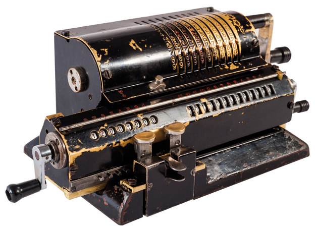

</div></div>

----

#### Логарифмическая линейка и Ко 计算尺和 Ko

Устройство, позволяющее выполнять несколько математических операций: умножение, деление, возведение в степень (квадрат и куб), вычисление  корней (квадрат и куб), логарифмов, вычисление тригонометрических и гиперболических функций, и т.п.  
一种允许您执行多种数学运算的设备：乘法、除法、求幂（平方和立方）、根计算（平方和立方）、对数、三角函数和双曲函数计算等。

Принцип расчёта -- воплощение таблицы значений в виде, позволяющем быстро находить нужные зависимости.  
计算的原理是以数值表的形式体现，可以让你快速找到必要的依赖关系。

Расчёт производится путём выставления линейки в требуемое положение (возможно, в несколько приёмов) и считывания результата.  
通过将标尺放置在所需位置（可能分几步）并读取结果来进行计算。

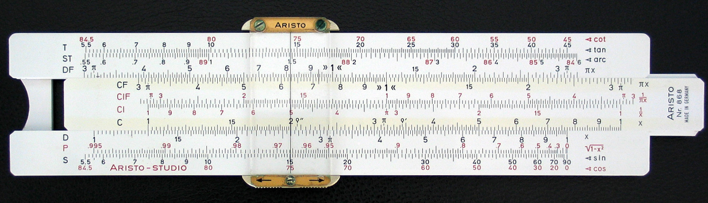

----

##### Линейка и операция деления  标尺和除法运算

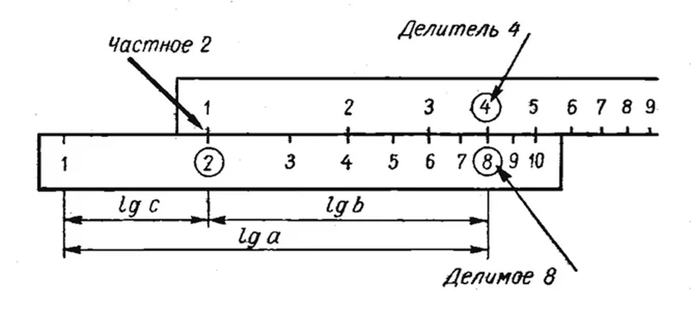

----

##### Номограмма и операции умножения  列线图和乘法运算

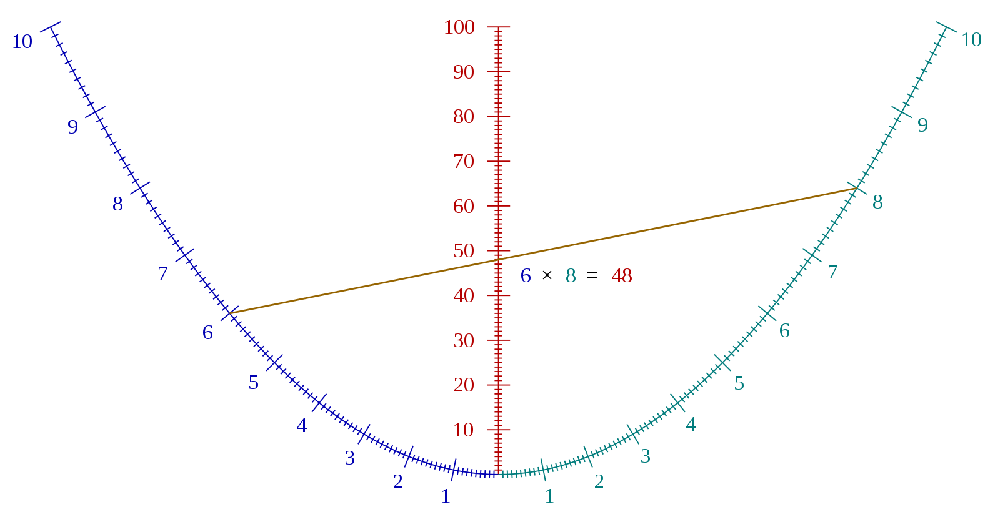

----

#### Ключевое отличие арифмометра и логарифмической линейки  加法机和计算尺之间的主要区别

<div>

- Линейка, как воплощение таблицы, содержит в себе все возможные значения.
- Рост области определения функций:
    - для арифмометра: медленный рост сложности устройства, средний рост длительности расчёта (зависит от функции);
    - для линейки: быстрый рост размера линейки, минимальный рост длительности расчёта.
- Линейка -- аналоговое устройство.
- Арифмометр -- цифровое устройство.

- 标尺作为表格的体现，包含了所有可能的值。
- 函数定义范围的增长：
     - 对于加法机：设备复杂性缓慢增加，计算持续时间平均增加（取决于功能）；
     - 对于标尺：标尺尺寸快速增加，计算持续时间增加最小。
- 标尺是模拟设备。
- 加法机是一种数字设备。

</div>

----

На практике: 实践上：

- Арифмометр -- современный вычислитель на устаревшей элементной базе.
- Линейки -- алгоритмы расчётов с применением таблиц (полностью табличный расчёт, частичный расчёт по таблицам), квантовые компьютеры (НЕ РАЗБИРАЮСЬ, МОГУ ОБМАНУТЬ!).

- 加法机是一种基于过时元素基础的现代计算器。
- 标尺 - 使用表格的计算算法（完全表格计算，部分使用表格计算），量子计算机（我不明白，我可以欺骗你！）。
