# Архитектура компьютера

## Лекция 4

## Ещё не компьютеры. Релейные схемы и булев базис

Пенской А.В., 2022

----

## План лекции

- Ещё не компьютеры (продолжение)
    - Расчёт артиллерийских таблиц. Белковые вычислители.
    - Жаккардовый ткацкий станок и программное управление.
    - Странное.
- Почти компьютер. Элементная база компьютера.
    - Реле и релейные диаграммы.
    - Цифровая элементная база. Булев базис.
        - Двоичное кодирование.

- 还没有电脑（续）
     - 火炮表的计算。 蛋白质计算器。
     - 提花织机和软件控制。
     - 奇怪的。
- 几乎是一台电脑。 计算机元件基础。
     - 继电器和继电器图。
     - 数字元素库。 布尔基础。
         - 二进制编码。

---

## Ещё не компьютеры (продолжение) 还没有电脑（续）

Почему это полезно:

- Во-первых, это красиво.
- Проблема абстрактных облаков и чистых IT-шников.
- Перенос технических приёмов и механизмов в современные компьютерные системы.
- Потребность в разработке компьютеров не в электронном базисе (пример: [NASA завершило конкурс на создание датчиков для венерианского ровера](https://nplus1.ru/news/2020/07/13/venus-rover-winners)).

- 首先，它很漂亮。
- 抽象云和纯IT人的问题。
- 将技术和机制转移到现代计算机系统。
- 计算机开发的需求不是在电子基础上（例如：[NASA 完成了为金星漫游者创建传感器的竞赛](https://nplus1.ru/news/2020/07/13/venus-rover-winners)）

---

### Расчёт артиллерийских таблиц. <br/> 火炮表的计算 <br/> Белковые вычислители <br/> 蛋白质计算器

Задача: расчёт артиллерийских таблиц для французской или российской армии.  
任务：计算法国或俄罗斯军队的火炮表。

Вычислительная задача: многократный расчёт сложной формулы с большим количеством операций для различных входных параметров.  
计算任务：对各种输入参数进行大量运算的复杂公式的重复计算。


----

Средства: 设施：

- Простейшие счётные устройства в ограниченном количестве.
- Математики, физики и другие учёные.
- Офицерский корпус и грамотные солдаты.

- 最简单的计数设备，数量有限。
- 数学家、物理学家和其他科学家。
- 军官团和有能力的士兵。

Проблемы наивного решения <br/> 天真的解决问题 <br/> (человек + лист + карандаш = сиди считай) <br/>（人+纸+铅笔=坐下来计算）:

- ошибка выбора операции;
- регистровый файл ненадёжен (почерк, адресация);
- арифметические ошибки;
- склонность людей к сокрытию ошибок.

- 操作选择错误；
- 寄存器文件不可靠（手写、寻址）；
- 算术错误；
- 人们倾向于隐藏错误。

----

#### Архитектура решения 架构解决方案

реконфигурируемый вычислитель с потоковой архитектурой  
具有流式架构的可重构计算机

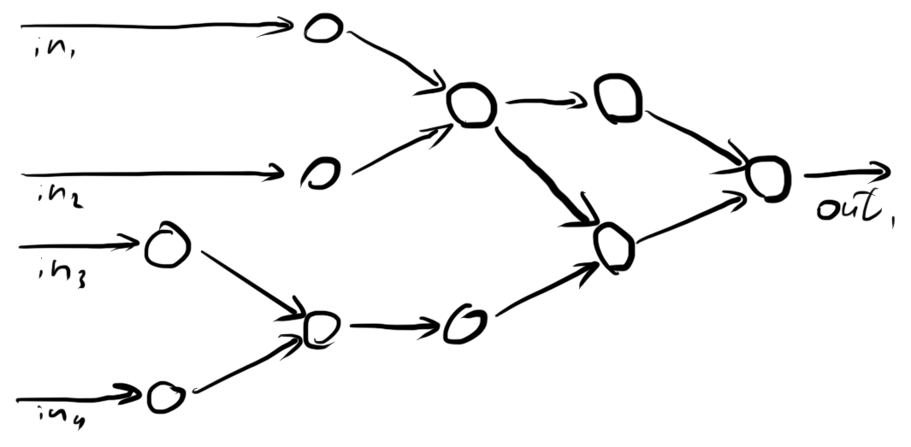

----

#### Реализация 执行

1. расчётная формула представляется в виде графа;  
   计算公式以图表的形式呈现；
2. каждой вершине графа сопоставляется человек, способный выполнить соответствующую операцию (только одну);  
   图的每个顶点都与一个能够执行相应操作的人相关联（只有一个）；
3. люди размещаются в соответствии с графом, каждый знает, кто сообщит входные данные, кому сообщить результат;  
   人员按照图表放置，每个人都知道谁将输入数据报告给谁，谁将结果报告给谁；
4. на вход графа подаются параметры для расчётов;  
   将计算参数提供给图形输入；
5. на выходе собираются результаты;  
   在输出处收集结果；
6. для повышения надёжности расчётов используется двоирование (две роты, сравниваем результаты, несовпадение -- повтор).  
   为了增加计算的可靠性，使用了加倍（两支队伍，比较结果，差异 - 重复）。

----

#### Структура белкового вычислителя 蛋白质计算机的结构

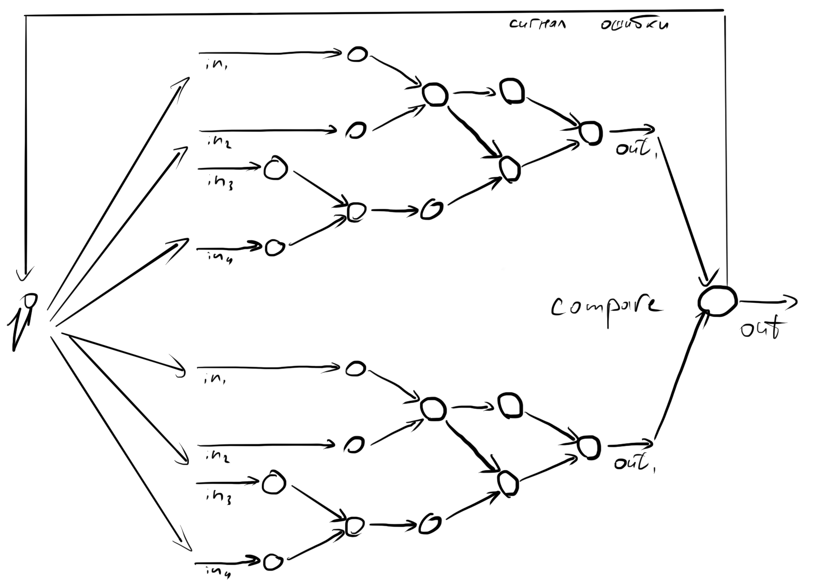

----

#### Достоинства 优点

- радикальный рост производительности за счёт параллелизма инструкций:
    - параллельного исполнения независимых операций в графе (см. далее);
    - конвейеризации расчётов (см. далее);
- радикальный рост надёжности;
    - высокий уровень специализации узлов;
    - минимальная вариативность процесса;
- возможность реконфигурации вычислителя под новую задачу.

- 由于指令并行性，性能显着提高：
     - 图中独立操作的并行执行（见下文）；
     - 计算的传送（见下文）；
- 可靠性大幅提高；
     - 节点专业化程度高；
     - 最小的过程可变性；
- 能够为新任务重新配置计算机。

----

##### Параллельное исполнение независимых операций в графе 图中独立操作的并行执行

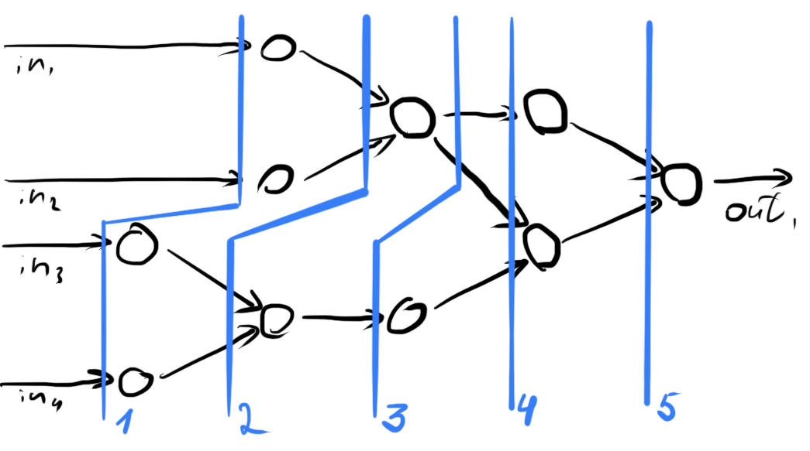

----

##### Конвейеризации расчётов 计算的传送

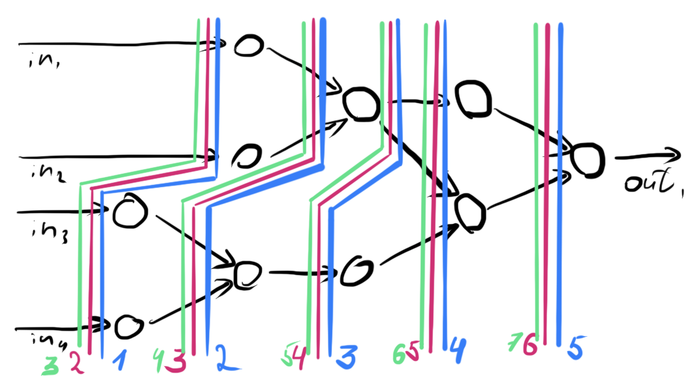

----

#### Практика 实践

На практике все перечисленные механизмы встречаются в современных компьютерных системах, в том числе:  
实际上，所有上述机制都存在于现代计算机系统中，包括：

- в процессорах общего назначения;
- в специализированных процессорах;
- в распределённых системах.

- 在通用处理器中；
- 在专用处理器中；
- 在分布式系统中。

---

### Жаккардовый ткацкий станок и программное управление 提花织机及软件控制


#### Жаккард 提花

Жаккард -- ткань с узором, на обратной стороне которой можно видеть "инвертированный" рисунок.  
提花是一种带有图案的面料，在其反面可以看到“倒”的图案。

Структура полотна: 面料结构：

- вертикальные нити -- натянуты равномерно;
- горизонтальные нити разных цветов, дисбаланс петель с одной из сторон формирует узор.

- 垂直螺纹 - 均匀拉伸；
- 不同颜色的水平线，一侧线圈的不平衡形成图案。


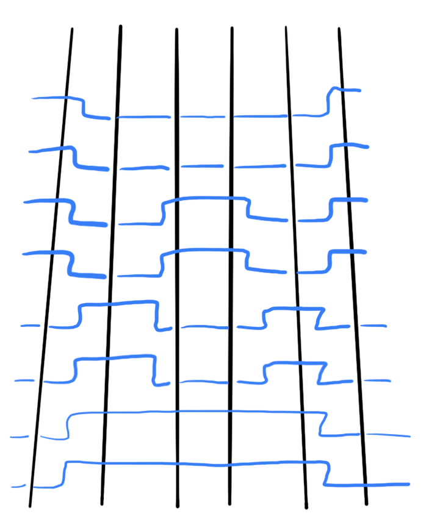


----

#### Проблема создания станка 创建机器的问题


Плетение полотна: 面料织造：

- нити разделяются на верхние и нижние по схеме узора;
- между ними пропускается челнок с горизонтальной нитью;
- повтор.

- 螺纹按花纹分为上线和下线；
- 带有水平线的梭子在它们之间穿过；
- 重复。

Узор -- уникальный (не подлежит автоматизации) или циклический.  
该模式是唯一的（不受自动化影响）或循环。


Проблема: разделение верхней и нижней нити.  
问题：面线和底线分离。

- Разделение на верхнюю и нижнюю нить нерегулярно.
- "Гребёнка" неприменима.

- 面线和底线的划分不规则。
- “梳子”不适用。

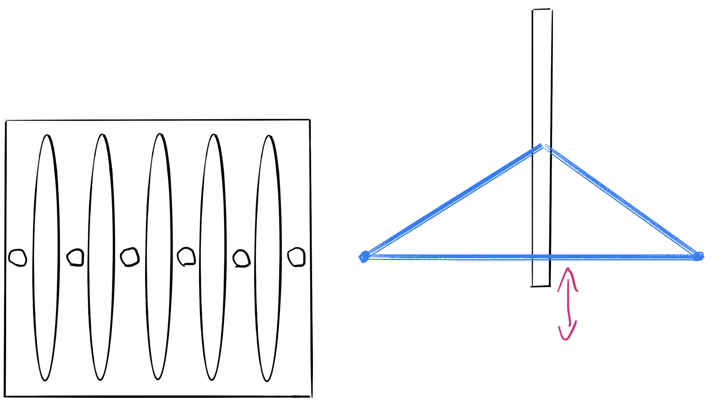


----

#### Жаккардовый ткацкий станок 提花织机


Считается первой программно-управляемой машиной.  
被认为是第一台软件控制的机器。

Элементы решения: 解决方案要素：

- "Гребёнка" заменена на систему крючков на пружинах с поворотным механизмом.
    - Нажатие на крючок позволяет зацепить нить.
    - Сильное нажатие и поворот -- освободить нить.
- Как автоматизировать регулярное (циклическое) нажатие на крючки?

- “梳子”已被带有旋转机构的弹簧钩系统所取代。
    - 按下钩子即可钩住线。
    - 用力按下并转动以释放线。
- 如何自动定期（循环）点击钩子？


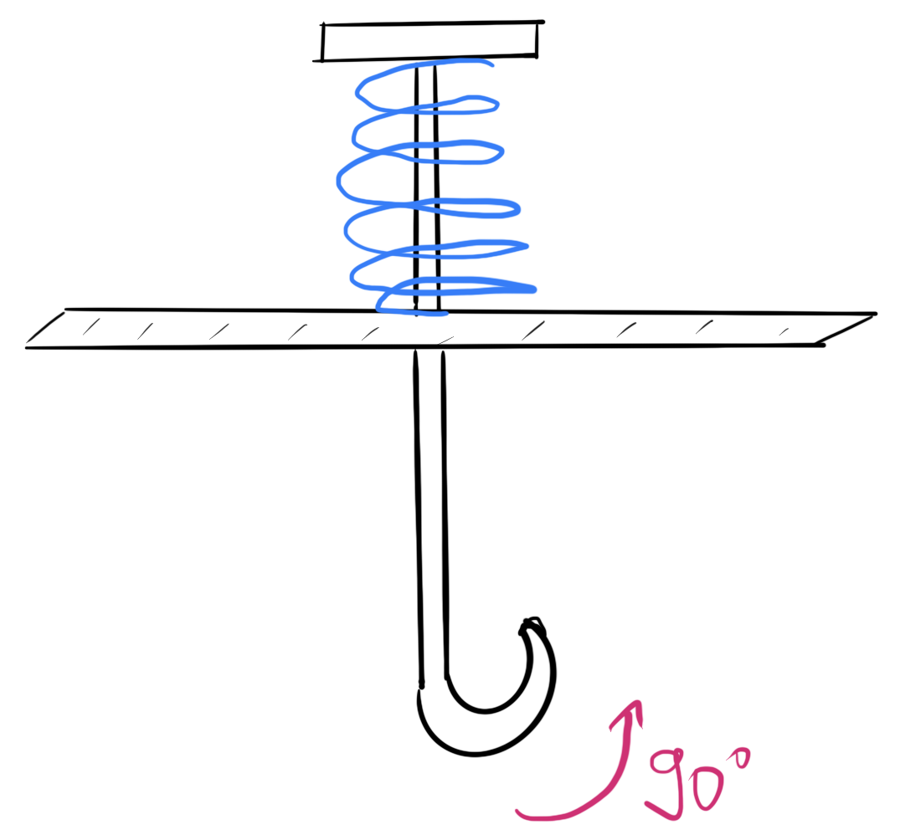 <!-- .element: height="250px" -->

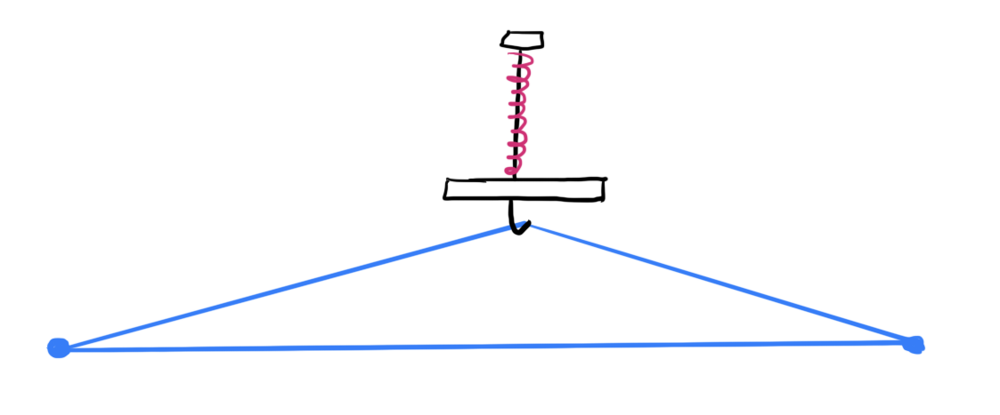


----

#### Жаккардовый ткацкий станок. Программное обеспечение 提花织机。 软件


Элементы решения: 解决方案要素：

- Пластина с отверстиями позволяет разом "нажать" нужные крючки (перфокарта).
- Лента из пластин -- программа узора.

- 带孔的板可以让您一次“按下”所需的挂钩（打孔卡）。
- 板带-图案程序。

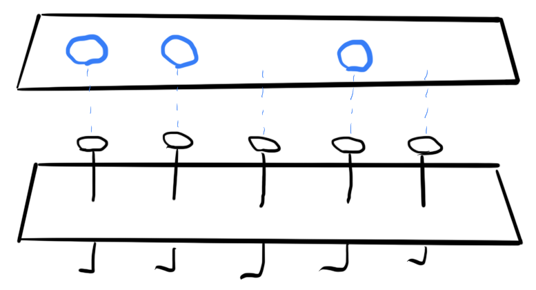 <!-- .element: height="150px" -->


Структура шага работы станка: 机器操作步骤结构：

1. Нажатие пластиной на крючки (разделение верхней и нижней).
2. Пропускание челнока.
3. Нажатие всех крючков и поворот (отпускание нитей).
4. Сдвиг ленты с пластинами.
5. Повтор.

1. 将板压在挂钩上（上下分离）。
2. 经过班车。
3. 按下所有旋梭并转动（松开线）。
4. 胶带与板的移位。
5. 重复。


----

#### Практика станка 练习机

- механика, по сути, не изменилась;
- принцип работы -- аналогично.

- 事实上，机制并没有改变；
- 操作原理相似。

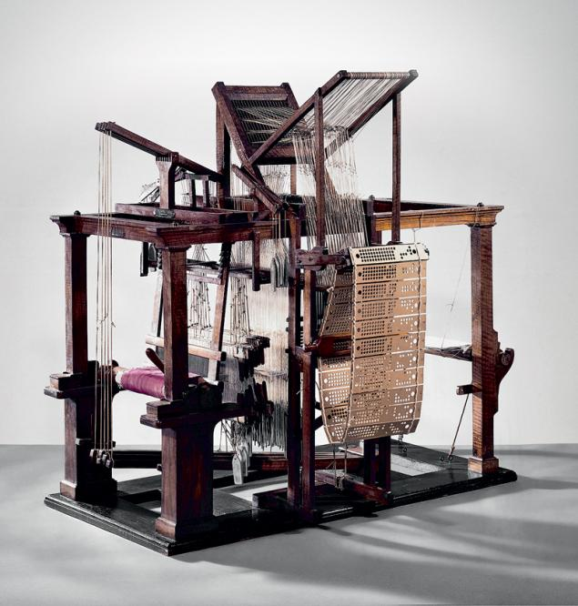  <!-- .element: height="500px" -->

Video: [link](https://www.youtube.com/watch?v=K6NgMNvK52A)

---

### Автоматические телефонные станции 自动电话交换机

*Offtopic*: Ваша возможность сделать свой вклад в материалы курса.  
*题外话*：您为课程材料做出贡献的机会。

---

### Странное 奇怪的

Данные примеры призваны скорее удивить и озадачить, нежели научить.  
这些例子的目的是让人惊讶和困惑，而不是教导。

----

#### Поиск кратчайшего пути на взвешенном графе 寻找加权图上的最短路径

Классический алгоритм Дейкстры имеет сложность $O(n^2)$. Имеется огромное количество оптимизаций и эвристических приёмов для сокращения вычислительной сложности.  
Dijkstra 的经典算法的复杂度为 $O(n^2)$。 有大量的优化和启发式方法可以降低计算复杂性。

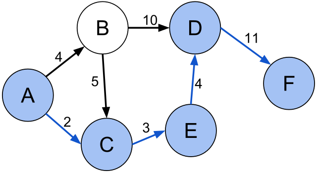

Проблема: дорожная карта региона.  
问题：该地区的路线图。

----

Альтернативное решение: 替代解决方案：

- Изготавливается натуральная модель взвешенного графа, где:
    - вершины -- контактные площадки;
    - рёбра -- проводники с сопротивлением, обратно пропорциональным весу ребра.
- Подаётся питание на интересующие вершины графа.
- Наблюдается цепочка сгоревших/нагревшихся проводников.

- 生成加权图的自然模型，其中：
     - 顶点 - 接触垫；
     - 肋是电阻与翅片重量成反比的导体。
- 向图中感兴趣的顶点供电。
- 观察到一串烧焦/加热的导体。

Площадь -- $O(n+e)$  
面积 -- $O(n+e)$

Время -- $O(n)$, при скорости около скорости света.  
时间 - $O(n)$，速度接近光速。

----

#### Задача коммивояжёра и амёба 旅行商问题和阿米巴原虫

Задача коммивояжёра -- поиск самого выгодного маршрута, проходящего через указанные города хотя бы по одному разу с последующим возвратом в исходный город.  
旅行商的任务是找到一条最有利可图的路线，该路线至少经过指定城市一次，然后返回原来的城市。

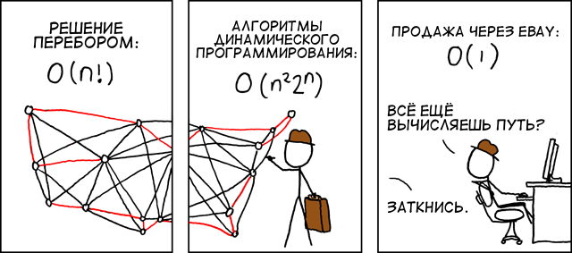

----

Альтернативное решение: 替代解决方案：

Амёба -- любит питательную среду, не любит свет, стремится занять максимальную площадь.  
阿米巴原虫——喜爱营养介质，不喜光照，力求占据最大面积。

Заявленные результаты: 陈述的结果：

- линейный рост скорости поиска от количества городов (до 8 штук);
- при росте выч. сложности по экспоненте.

- 搜索速度线性增加，具体取决于城市数量（最多 8 个）；
- 随着计算的增加。 指数复杂度。

Детали и суть по ссылке: [link](https://royalsocietypublishing.org/doi/10.1098/rsos.180396)  
详细信息和实质在链接：

*Offtopic*: Ваша возможность сделать свой вклад в материалы курса.  
*题外话*：您为课程材料做出贡献的机会。

----

#### Приставка Dendy и пистолет Dendy 控制台和枪


---

## Почти компьютер. <br/> 几乎是一台电脑 <br/> Элементная база компьютера <br/> 计算机元件库

- Реле и релейные диаграммы
- Булев базис. Элементы цифровой схемотехники

- 继电器和梯形图
- 布尔基础。 数字电路元件

---

### Реле и релейные диаграммы 继电器和梯形图

#### Электрическое реле 继电器


- вход и выход, между ними металлический ключ;
- магнитная катушка, притягивающая ключ;
- без тока возвращается в нормальное состояние: разомкнутое, замкнутое;
- состояния: $0/1$, есть питания/нет питания;
- нет сигналов, есть уровни!

- 入口和出口，它们之间有一把金属钥匙；
- 吸引钥匙的磁性线圈；
- 无电流返回正常状态：打开、关闭；
- 状态：$0/1$，有电/无电；
- 没有信号，有关卡！

Другие виды: механические, пневматические, тепловые, оптические, акустические, магнитные и т.д.  
其他类型：机械式、气动式、热式、光学式、声学式、磁式等。


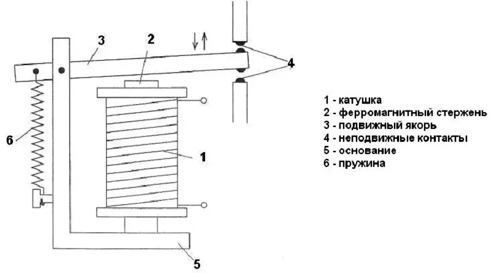

Обозначения: 名称：

- `-[ ]-` нормально разомкнутое реле 常开继电器
- `-[\]-` нормально замкнутое реле 常闭继电器


----

#### Релейная диаграмма 梯形图

Описывает схемы включения оборудования в релейные стойки.  
描述用于将设备连接到中继机架的电路。

- `-( )-` нормально неактивный актуатор 通常不活动的执行器
- `-(\)-` нормально активный актуатор 正常激活执行器

```text
 L1                                      L2
 o                                       o
 |             Logical AND               |
 |                                       |
 +--[ ]--------[ ]-----------( )---------+
 |  Key 1      Key 2         Door motor  |
 |                                       |
 |                                       |
 |             Logical OR                |
 |                                       |
 +----+--[ ]--------------+--( )---------+
 |    |  Exterior unlock  |  Unlock      |
 |    |                   |              |
 |    +--[ ]--------------+              |
 |        Interior unlock                |
 |                                       |
```

----

#### Управление двигателем 发动机控制

Классическая схема включения электродвигателя с аварийной остановкой.  
用于打开带紧急停止功能的电动机的经典电路。

```text
 L1                                        L2
 o                                         o
 |                                         |
 +--[\]---[\]----+--[ ]---+---------( )----+
 |  ES    Stop   |  Start |         Run    |
 |               |        |                |
 |               +--[ ]---+                |
 |                  Run                    |
 |                                         |
 |                                         |
 |                                         |
 +------------------[ ]-------------( )----+
 |                  Run         Motor      |
 |                                         |
```

То же вы увидите в шкафу управления. Почти один в один.  
您会在控制柜中看到同样的东西。 几乎是一对一。

----

#### Процесс управления двигателем 发动机控制流程


```text
 L1                                        L2
 o                                         o
 |                                         |
 +--[\]---[\]----+--[ ]---+---------( )----+
 |  ES    Stop   |  Start |         Run    |
 |               |        |          :     |
 |               +--[ ]---+          :     |
 |                  Run              :     |
 |                   ^               :     |
 |                   +.............../     |
 |                   v                     |
 +------------------[ ]-------------( )----+
 |                  Run             Motor  |
 |                                         |
```

```text
                            ________     (1)
   ES _______________...___/        \___ (0)
 Stop _______________...________________ (0)
         ________                        (1)
Start __/        \___...________________ (0)
           __________..._____            (1)
  Run ____/                  \__________ (0)
             ________..._______          (1)
Motor ______/                  \________ (0)

------------------ time ------------------->
```

----

Мы вернёмся снова в контексте RS-триггера.  
我们将再次讨论 RS 触发器。

*Question*: Кто-нибудь знает, что это такое и зачем?  
*问题*：有谁知道这是什么以及为什么？

----

#### Практика применения реле 继电器使用练习

- Непосредственное применение, силовые шкафы управления.
- Там, где электроника не работает (неэл. реле).
- Программируемые логические контроллеры (ПЛК) для автоматизации производственных процессов (АСУТП) программируют на языках релейных диаграмм (ISO-61131).

- 直接应用，电源控制柜。
- 电子设备不工作的地方（非电子继电器）。
- 用于工业过程自动化 (APCS) 的可编程逻辑控制器 (PLC) 采用继电器图语言 (ISO-61131) 进行编程。

---

### Цифровая элементная база. Булев базис 数字元素基础。 布尔基础


*Disclaimer*: физику и электротехнику не знаю, поэтому им учить не буду.  
*免责声明*：我不懂物理和电气工程，所以我不会教它们。

Принципы и элементы цифровой элементной базы:  
数字元素库的原理和要素：

1. двоичная логика; 二元逻辑；
2. полный набор булевых функций: 全套布尔函数：
    - И, ИЛИ, НЕ; 与、或、非；
    - штрих Шеффера（Schaeffer 行程）$x|y = \overline{x y}$;
    - стрелка Пирса（皮尔士箭头）$x \downarrow y = \overline{x \vee y}$.
3. комбинационные схемы; 组合电路；
4. триггер -- хранение состояния. 触发-状态存储


 <!-- .element: height="600px" -->


---

#### Двоичное кодирование 二进制编码

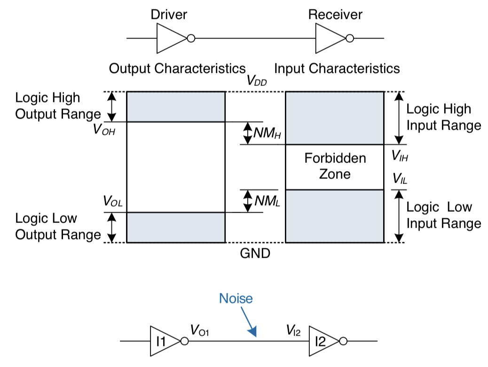 <!-- .element: height="600px" -->

----


##### Достоинства двоичного кодирования 二进制编码的优点

1. Надежно и помехоустойчиво.
2. Простая реализация арифметики.
3. Диапазоны и точность наращиваются разрядностью (слева и справа соответственно).
4. Погрешности "by design", а не "by implementation" <br/> (одинаковые компьютеры считают одинаково).

---

1. 可靠、抗噪音。
2. 简单的算术实现。
3. 范围和精度随位深度增加（分别在左侧和右侧）。
4. “设计”错误，而不是“实现”错误<br/>（相同的计算机计算相同）。

##### Недостатки 缺陷

1. Нечитаемое представление.
2. Простые десятичные дроби записываются в виде бесконечных двоичных дробей.
3. Дискретное кодирование сигналов (точность).

---

1. 不可读的演示文稿。
2. 简单的十进制分数写成无限的二进制分数。
3. 离散信号编码（精度）。


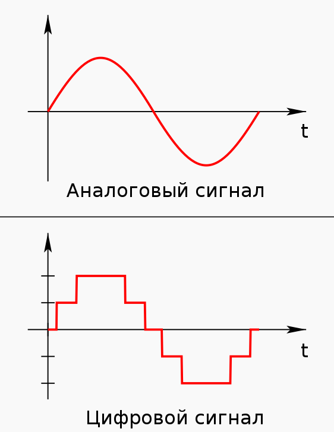


----

#### Машинное слово. Представления данных 机字。 数据视图


Машинное слово -- единица данных, естественная для обработки вычислителем. Пример: сложение, пересылка, и т.п.  
机器字是计算机自然处理的数据单元。 例如：添加、转发等。

*Disclaimer*: список неполный от слова совсем: код Грея, Base64, Base58...  
*免责声明*：该列表至少可以说是不完整的：格雷码、Base64、Base58...

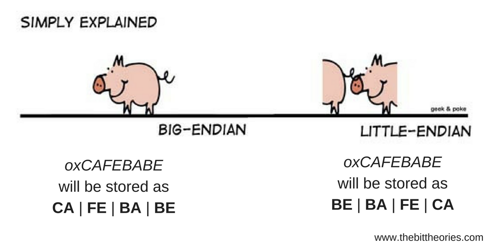


- Целые числа:
    - Позиционные системы счисления.
    - Дополнительный код.
    - Big & Little endian.
- Дробные числа:
    - Числа с фиксированной точкой.
    - Числа с плавающей точкой.
- Перечисления:
    - Двоично-десятичное кодирование.
    - Символы (старые кодировки).
- Тегированные данные.

- 整数：
     - 位置数字系统。
     - 附加代码。
     - 大端和小端。
- 小数：
     - 固定点数。
     - 浮点数字。
- 接送服务：
     - 二进制十进制编码。
     - 符号（旧编码）。
- 标记数据。


----

*Offtopic*: Классификация типов по версии IBM  
*Offtopic*：根据 IBM 版本进行类型分类

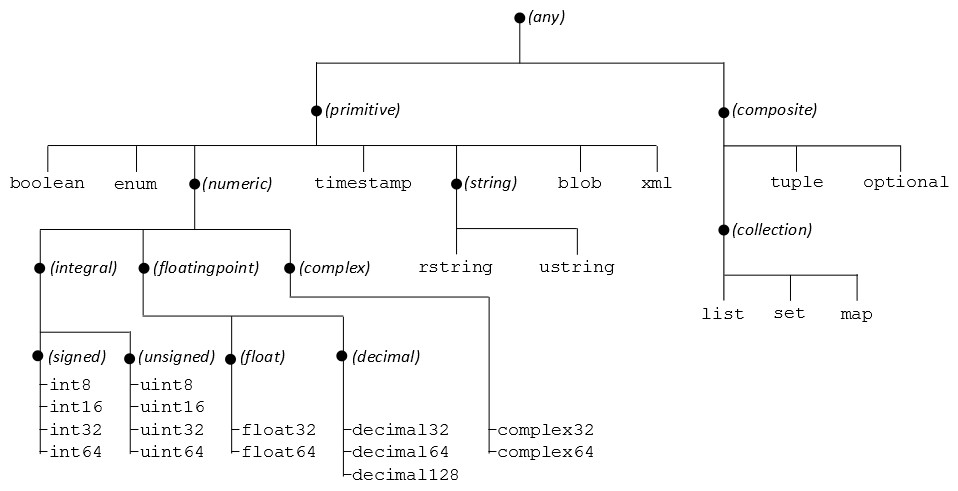
