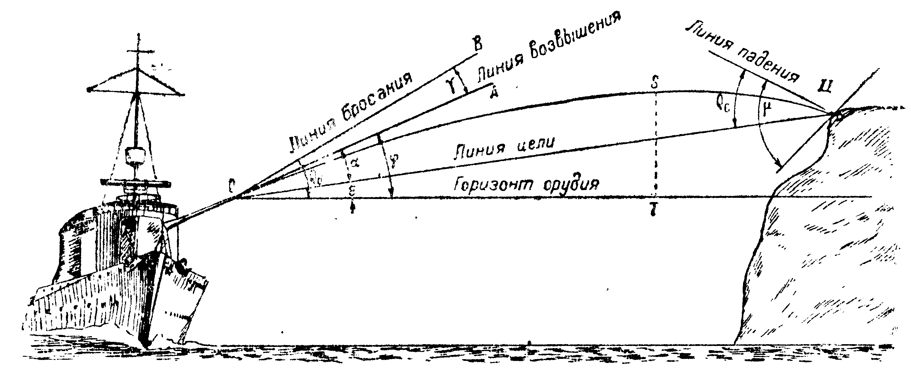
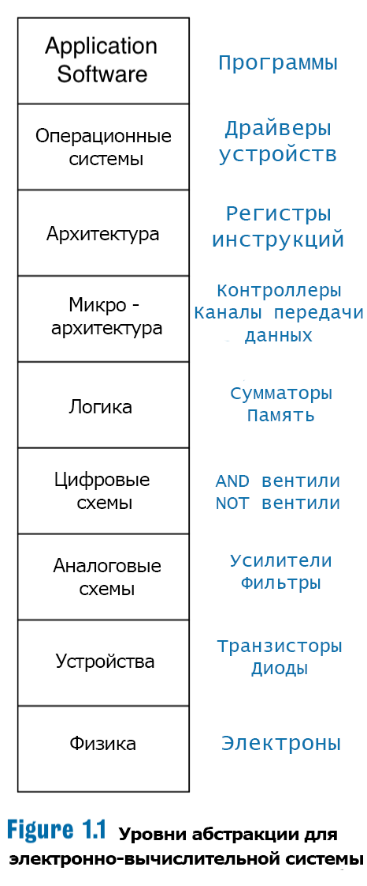

# Архитектура компьютера

## Лекция 4

## Ещё не компьютеры. Релейные схемы и булев базис

Пенской А.В., 2022

----

## План лекции

- Ещё не компьютеры (продолжение)
    - Расчёт артиллерийских таблиц. Белковые вычислители.
    - Жаккардовый ткацкий станок и программное управление.
    - Странное.
- Почти компьютер. Элементная база компьютера.
    - Реле и релейные диаграммы.
    - Цифровая элементная база. Булев базис.
        - Двоичное кодирование.

---

## Ещё не компьютеры (продолжение)

Почему это полезно:

- Во-первых, это красиво.
- Проблема абстрактных облаков и чистых IT-шников.
- Перенос технических приёмов и механизмов в современные компьютерные системы.
- Потребность в разработке компьютеров не в электронном базисе (пример: [NASA завершило конкурс на создание датчиков для венерианского ровера](https://nplus1.ru/news/2020/07/13/venus-rover-winners)).

---

### Расчёт артиллерийских таблиц. <br/> Белковые вычислители

Задача: расчёт артиллерийских таблиц для французской или российской армии.

Вычислительная задача: многократный расчёт сложной формулы с большим количеством операций для различных входных параметров.



----

Средства:

- Простейшие счётные устройства в ограниченном количестве.
- Математики, физики и другие учёные.
- Офицерский корпус и грамотные солдаты.

Проблемы наивного решения <br/> (человек + лист + карандаш = сиди считай):

- ошибка выбора операции;
- регистровый файл ненадёжен (почерк, адресация);
- арифметические ошибки;
- склонность людей к сокрытию ошибок.

----

#### Архитектура решения

реконфигурируемый вычислитель с потоковой архитектурой


----

#### Реализация

1. расчётная формула представляется в виде графа;
2. каждой вершине графа сопоставляется человек, способный выполнить соответствующую операцию (только одну);
3. люди размещаются в соответствии с графом, каждый знает, кто сообщит входные данные, кому сообщить результат;
4. на вход графа подаются параметры для расчётов;
5. на выходе собираются результаты;
6. для повышения надёжности расчётов используется двоирование (две роты, сравниваем результаты, несовпадение -- повтор).

----

#### Структура белкового вычислителя


----

#### Достоинства

- радикальный рост производительности за счёт параллелизма инструкций:
    - параллельного исполнения независимых операций в графе (см. далее);
    - конвейеризации расчётов (см. далее);
- радикальный рост надёжности;
    - высокий уровень специализации узлов;
    - минимальная вариативность процесса;
- возможность реконфигурации вычислителя под новую задачу.

----

##### Параллельное исполнение независимых операций в графе


----

##### Конвейеризации расчётов


----

#### Практика

На практике все перечисленные механизмы встречаются в современных компьютерных системах, в том числе:

- в процессорах общего назначения;
- в специализированных процессорах;
- в распределённых системах.

---

### Жаккардовый ткацкий станок и программное управление

<div class="row"><div class="col">

#### Жаккард

Жаккард -- ткань с узором, на обратной стороне которой можно видеть "инвертированный" рисунок.

Структура полотна:

- вертикальные нити -- натянуты равномерно;
- горизонтальные нити разных цветов, дисбаланс петель с одной из сторон формирует узор.

</div><div class="col">


</div></div>

----

#### Проблема создания станка

<div class="row"><div class="col">

Плетение полотна:

- нити разделяются на верхние и нижние по схеме узора;
- между ними пропускается челнок с горизонтальной нитью;
- повтор.

Узор -- уникальный (не подлежит автоматизации) или циклический.

</div><div class="col">

Проблема: разделение верхней и нижней нити.

- Разделение на верхнюю и нижнюю нить нерегулярно.
- "Гребёнка" неприменима.


</div></div>

----

#### Жаккардовый ткацкий станок

<div class="row"><div class="col">

Считается первой программно-управляемой машиной.

Элементы решения:

- "Гребёнка" заменена на систему крючков на пружинах с поворотным механизмом.
    - Нажатие на крючок позволяет зацепить нить.
    - Сильное нажатие и поворот -- освободить нить.
- Как автоматизировать регулярное (циклическое) нажатие на крючки?

</div><div class="col">

 <!-- .element: height="250px" -->


</div></div>

----

#### Жаккардовый ткацкий станок. Программное обеспечение

<div class="row"><div class="col">

Элементы решения:

- Пластина с отверстиями позволяет разом "нажать" нужные крючки (перфокарта).
- Лента из пластин -- программа узора.

 <!-- .element: height="150px" -->

</div><div class="col">

Структура шага работы станка:

1. Нажатие пластиной на крючки (разделение верхней и нижней).
2. Пропускание челнока.
3. Нажатие всех крючков и поворот (отпускание нитей).
4. Сдвиг ленты с пластинами.
5. Повтор.

</div></div>

----

#### Практика станка

- механика, по сути, не изменилась;
- принцип работы -- аналогично.

  <!-- .element: height="500px" -->

Video: [link](https://www.youtube.com/watch?v=K6NgMNvK52A)

---

### Автоматические телефонные станции

*Offtopic*: Ваша возможность сделать свой вклад в материалы курса.

---

### Странное

Данные примеры призваны скорее удивить и озадачить, нежели научить.

----

#### Поиск кратчайшего пути на взвешенном графе

Классический алгоритм Дейкстры имеет сложность $O(n^2)$. Имеется огромное количество оптимизаций и эвристических приёмов для сокращения вычислительной сложности.


Проблема: дорожная карта региона.

----

Альтернативное решение:

- Изготавливается натуральная модель взвешенного графа, где:
    - вершины -- контактные площадки;
    - рёбра -- проводники с сопротивлением, обратно пропорциональным весу ребра.
- Подаётся питание на интересующие вершины графа.
- Наблюдается цепочка сгоревших/нагревшихся проводников.

Площадь -- $O(n+e)$

Время -- $O(n)$, при скорости около скорости света.

----

#### Задача коммивояжёра и амёба

Задача коммивояжёра -- поиск самого выгодного маршрута, проходящего через указанные города хотя бы по одному разу с последующим возвратом в исходный город.


----

Альтернативное решение:

Амёба -- любит питательную среду, не любит свет, стремится занять максимальную площадь.

Заявленные результаты:

- линейный рост скорости поиска от количества городов (до 8 штук);
- при росте выч. сложности по экспоненте.

Детали и суть по ссылке: [link](https://royalsocietypublishing.org/doi/10.1098/rsos.180396)

*Offtopic*: Ваша возможность сделать свой вклад в материалы курса.

----

#### Приставка Dendy и пистолет


---

## Почти компьютер. <br/> Элементная база компьютера

- Реле и релейные диаграммы
- Булев базис. Элементы цифровой схемотехники

---

### Реле и релейные диаграммы

#### Электрическое реле

<div class="row"><div class="col">

- вход и выход, между ними металлический ключ;
- магнитная катушка, притягивающая ключ;
- без тока возвращается в нормальное состояние: разомкнутое, замкнутое;
- состояния: $0/1$, есть питания/нет питания;
- нет сигналов, есть уровни!

Другие виды: механические, пневматические, тепловые, оптические, акустические, магнитные и т.д.

</div><div class="col">


Обозначения:

- `-[ ]-` нормально разомкнутое реле
- `-[\]-` нормально замкнутое реле

</div></div>

----

#### Релейная диаграмма

Описывает схемы включения оборудования в релейные стойки.

- `-( )-` нормально неактивный актуатор

- `-(\)-` нормально активный актуатор

```text
 L1                                      L2
 o                                       o
 |             Logical AND               |
 |                                       |
 +--[ ]--------[ ]-----------( )---------+
 |  Key 1      Key 2         Door motor  |
 |                                       |
 |                                       |
 |             Logical OR                |
 |                                       |
 +----+--[ ]--------------+--( )---------+
 |    |  Exterior unlock  |  Unlock      |
 |    |                   |              |
 |    +--[ ]--------------+              |
 |        Interior unlock                |
 |                                       |
```

----

#### Управление двигателем

Классическая схема включения электродвигателя с аварийной остановкой.

```text
 L1                                        L2
 o                                         o
 |                                         |
 +--[\]---[\]----+--[ ]---+---------( )----+
 |  ES    Stop   |  Start |         Run    |
 |               |        |                |
 |               +--[ ]---+                |
 |                  Run                    |
 |                                         |
 |                                         |
 |                                         |
 +------------------[ ]-------------( )----+
 |                  Run         Motor      |
 |                                         |
```

То же вы увидите в шкафу управления. Почти один в один.

----

#### Процесс управления двигателем

```text
 L1                                        L2
 o                                         o
 |                                         |
 +--[\]---[\]----+--[ ]---+---------( )----+
 |  ES    Stop   |  Start |         Run    |
 |               |        |          :     |
 |               +--[ ]---+          :     |
 |                  Run              :     |
 |                   ^               :     |
 |                   +.............../     |
 |                   v                     |
 +------------------[ ]-------------( )----+
 |                  Run             Motor  |
 |                                         |
```

```text
                            ________     (1)
   ES _______________...___/        \___ (0)
 Stop _______________...________________ (0)
         ________                        (1)
Start __/        \___...________________ (0)
           __________..._____            (1)
  Run ____/                  \__________ (0)
             ________..._______          (1)
Motor ______/                  \________ (0)

------------------ time ------------------->
```

----

Мы вернёмся снова в контексте RS-триггера.

*Question*: Кто-нибудь знает, что это такое и зачем?

----

#### Практика применения реле

- Непосредственное применение, силовые шкафы управления.
- Там, где электроника не работает (неэл. реле).
- Программируемые логические контроллеры (ПЛК) для автоматизации производственных процессов (АСУТП) программируют на языках релейных диаграмм (ISO-61131).

---

### Цифровая элементная база. Булев базис

<div class="row"><div class="col">

*Disclaimer*: физику и электротехнику не знаю, поэтому им учить не буду.

Принципы и элементы цифровой элементной базы:

1. двоичная логика;
2. полный набор булевых функций:
    - И, ИЛИ, НЕ;
    - штрих Шеффера $x|y = \overline{x y}$;
    - стрелка Пирса $x \downarrow y = \overline{x \vee y}$.
3. комбинационные схемы;
4. триггер -- хранение состояния.

</div><div class="col">

 <!-- .element: height="600px" -->

</div></div>

---

#### Двоичное кодирование

 <!-- .element: height="600px" -->

----

<div class="row"><div class="col">

##### Достоинства двоичного кодирования

1. Надежно и помехоустойчиво.
2. Простая реализация арифметики.
3. Диапазоны и точность наращиваются разрядностью (слева и справа соответственно).
4. Погрешности "by design", а не "by implementation" <br/> (одинаковые компьютеры считают одинаково).

##### Недостатки

1. Нечитаемое представление.
2. Простые десятичные дроби записываются в виде бесконечных двоичных дробей.
3. Дискретное кодирование сигналов (точность).

</div><div class="col">


</div></div>

----

#### Машинное слово. Представления данных

<div class="row"><div class="col">

Машинное слово -- единица данных, естественная для обработки вычислителем. Пример: сложение, пересылка, и т.п.

*Disclaimer*: список неполный от слова совсем: код Грея, Base64, Base58...


</div><div class="col">

- Целые числа:
    - Позиционные системы счисления.
    - Дополнительный код.
    - Big & Little endian.
- Дробные числа:
    - Числа с фиксированной точкой.
    - Числа с плавающей точкой.
- Перечисления:
    - Двоично-десятичное кодирование.
    - Символы (старые кодировки).
- Тегированные данные.

</div></div>

----

*Offtopic*: Классификация типов по версии IBM


