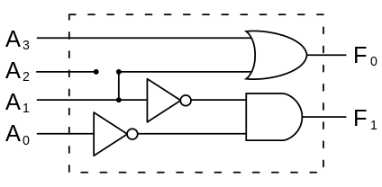

# Архитектура компьютера

## Лекция 5

## Цифровая схемотехника. Параллелизм уровня бит. Особенности производства аппаратуры

Пенской А.В., 2022

----

## План лекции

- Почти компьютер. Элементная база компьютера.
    - Цифровая элементная база. Булев базис. (продолжение)
        - Двоичное кодирование. (было)
        - Комбинационные схемы.
        - Состояние.
- Особенности производства вычислительной техники
    - Навесной монтаж
    - Монтаж на печатную плату

---

## Цифровая элементная база. <br/>Булев базис. (продолжение)

### Двоичное кодирование. (было)

----

### Комбинационные схемы

Комбинационная схема -- схема, составленная из набора логических элементов, в совокупности реализующая заданную таблицу истинности.


----

#### Функциональные возможности и построение

Функция -- отображение множества $A$ на множество $B$.

Если $A$ и $B$ конечны (представимы в виде конечной последовательности битов), тогда возможно построить эквивалентную комбинационную схему.

Способы построения:

- через таблицу истинности;
- через логику работы (алгоритмизацию).

*Offtopic*: очень похоже на логарифмическую линейку и арифмометр.

----

#### Через таблицу истинности

1. Формирование таблицы истинности.
2. Запись таблицы истинности в ДНФ или КНФ <br/> (прямо отображается в комбинационную схему).
3. Минимизация (сокращаем размер схемы).

Подробнее см. курс дискретной математики Полякова: ККНФ и КДНФ, минимизация булевых функций, метод Петрика, карты Карно и т.п.

----

##### Определение номера сигнала (3-to-2)

<div class="row"><div class="col">

###### Таблица истинности

| $x_3$ | $x_2$ | $x_1$ | $y_2$ | $y_1$ | $y$ |
|:------|:------|:------|:------|:------|:----|
| 0     | 0     | 1     | 0     | 1     | (1) |
| 0     | 1     | 0     | 1     | 0     | (2) |
| 1     | 0     | 0     | 1     | 1     | (3) |

###### КДНФ

$y_2 = \overline{x_3} x_2 \overline{x_1} \vee x_3 \overline{x_2} \overline{x_1}$

$y_1 = \overline{x_3} \overline{x_2} x_1 \vee x_3 \overline{x_2} \overline{x_1}$

###### Минимизированная функция

$y_2 = \overline{x_1}$

$y_1 = \overline{x_2}$

</div><div class="col">




(4 to 2 encoder)

</div></div>

----

#### Через логику работы

Схема строится на основе понимания функции, взаимосвязи входа и выхода. Творческий процесс. Схема может быть каскадной.

<div class="row"><div class="col">

Полный сумматор (1-bit):


- $A$, $B$ -- биты операндов;
- $S$ -- результат;
- $С_{in}$, $С_{out}$ -- бит переноса.

</div><div class="col">

Каскадный сумматор:


</div></div>

----

##### Процесс каскадного сумматора

<div class="row"><div class="col">


</div><div class="col">

```text
   C0 ________________________ (0)
           ___________________ (1)
   A0 ____/                    (0)
           ___________________ (1)
   B0 ____/                    (0)
   S0 ________________________ (0)

                ______________ (1)
   C1 _________/               (0)
           ___________________ (1)
   A1 ____/                    (0)
   B1 ________________________ (0)
                ____
   S0 _________/    \_________ (0)

                     _________ (1)
   C2 ______________/          (0)
   A2 ________________________ (0)
   B2 ________________________ (0)
                          ____ (1)
   S2 ___________________/     (0)


   ----------- time ------------->
```

</div></div>

----

#### Свойства комбинационных схем

<div class="row"><div class="col">

- возможность установления стабильного состояния при корректном входе;
- задержка установления стабильного состояния после изменения входных значений (зависит от условий окружающей среды);
- *параллелизм уровня бит* (узлы схемы работают параллельно);
- накопление ошибки в физическом процессе, что может привести к ошибке на логическом уровне (использование буфера).

</div><div class="col">

```text
   C0 ________________________ (0)
           ___________________ (1)
   A0 ____/                    (0)
           ___________________ (1)
   B0 ____/                    (0)
   S0 ________________________ (0)

                ______________ (1)
   C1 _________/               (0)
           ___________________ (1)
   A1 ____/                    (0)
   B1 ________________________ (0)
                ____
   S0 _________/    \_________ (0)

                     _________ (1)
   C2 ______________/          (0)
   A2 ________________________ (0)
   B2 ________________________ (0)
                          ____ (1)
   S2 ___________________/     (0)


   ----------- time ------------->
```

</div></div>

---

#### Реальная ситуация с двоичным кодированием

Вы ведь не думаете, что это на самом деле два состояния?

----

Заимствовано из стандарта для языка описания цифровых схем Verilog.

- Очевидное `0` и `1`.

- <div> `z` -- отключено, когда ваш источник данных (провод) висит в воздухе. `0` обычно не кодируют нулевым уровнем. </div> <!-- .element: class="fragment" -->

<div>

- `x` -- неизвестно, значение может быть произвольным, т.к. таблица истинности задана частично. Примеры:
    - деление на `0`;
    - квадратный корень из отрицательного числа;
    - пример "Определение номера сигнала (3-to-2)" выше.

</div> <!-- .element: class="fragment" -->

---

### Состояние в комбинационной схеме

Триггер -- класс электронных устройств, обладающих способностью длительно находиться в одном из двух устойчивых состояний и чередовать их под воздействием внешних сигналов.

<div class="row"><div class="col">

Триггер позволяет:

- ограничить распространение сигнала по схеме;
- зафиксировать текущее состояние сигнала в схеме.

</div><div class="col">


</div></div>

----

#### Виды триггеров

- Условие изменения состояния:
    - по фронту;
    - по уровню.
- Интерфейс:
    - D-триггер (D от англ. Delay) -- запоминает состояние входа и выдаёт его на выход.
    - RS-триггер, или SR-триггер (от англ. Set/Reset -- установить/сбросить) -- асинхронный триггер, который сохраняет своё предыдущее состояние при неактивном состоянии обоих входов и изменяет своё состояние при подаче на один из его входов активного уровня.
    - и др.

----

#### RS-триггер

Асинхронный триггер, который сохраняет своё предыдущее состояние при неактивном состоянии обоих входов и изменяет своё состояние при подаче на один из его входов активного уровня.

<div class="row"><div class="col">


</div><div class="col">

| `S` | `R` | `Q(t)`   | `NQ(t)`   |
|:----|:----|:---------|:----------|
| 0   | 1   | 0        | 1         |
| 1   | 0   | 1        | 0         |
| 0   | 0   | `Q(t-1)` | `NQ(t-1)` |
| 1   | 1   | 0        | 0         |

</div></div>

----

#### RS-триггер на реле

<div class="row"><div class="col">


</div><div class="col">

```text
 L1                      L2
 o                       o
 |                       |
 +---+---[ ]---+---(\)---+
 |   |   R     |   Q     |
 |   |         |         |
 |   +---[ ]---+         |
 |       NQ              |
 |                       |
 |   +---[ ]---+         |
 |   |   Q     |         |
 |   |         |         |
 +---+---[ ]---+---(\)---+
 |       S         NQ    |
 |                       |
```

</div></div>

----

##### `S=1; R=0`. 1


----

##### `S=1; R=0`. 2


----

##### `S=1; R=0`. 3


----

##### `S=1; R=0`. 4


----

##### `S=0; R=1`. 1


----

##### `S=0; R=1`. 2


----

##### `S=0; R=0; Q=1; NQ=0`. 1


----

##### `S=0; R=0; Q=1; NQ=0`. 2


---

### Состояния позволяют

- хранить состояние;
- многотактовые схемы, вычисления в несколько шагов:
    - переиспользование схемотехники на разных тактах: сложение 64-битных чисел на 16-битном сумматоре за 4 такта;
    - конвейерное исполнение: количество стадий определяет количество параллельно выполняемых задач;
    - итеративные расчёты;
    - программное управление;


----

- синхронная схемотехника:
    - меньше гонок, проще синхронизация;
    - частота по самой медленной комбинационной схеме;
    - дискретизация входных сигналов по времени;
    - синхронность -- условна.
- повышение частоты (разбить большую комбинационную схему на несколько, рост в пределе почти в 2 раза).


---

### Условный оператор в схемотехнике

Схемотехника не может не работать.

Подходы к реализации:

- через состояние и программное управление;
- через спекулятивные вычисления и выбор результата (мультиплексор).


----

<div class="row"><div class="col">

```verilog
assign A = f1(...);
assign B = f2(...);

always @(posedge clock) 
    begin
        if (addr == 0)
            // Q < = A
            Q <= A;
        else
            Q <= B;
end
```

Схема

</div><div class="col">

```python
a = f1(...)
b = f2(...)

if addr == 0:
    q = a;
else:
    q = b
```

О пользе ленивых вычислений

</div><div class="col">

```python
if addr == 0:
    q = f1(...)
else:
    q = f2(...)
```

ПО

</div></div>

 <!-- .element: height="200px" -->

---

### Пример схемы с состоянием

- Фрагмент примера лаб. работы № 3. Код в репозитории.
- Приведена память данных и схема чтения из неё.

```verilog
                     +--------------+  addr   +--------+
               +---->| data_address |---+---->|  data  |
               |     +--------------+   |     | memory |
           +-------+                    |     |        |
 signal -->|  MUX  |         +----------+     |        |
 data      +-------+         |                |        |
 address    ^     ^          |                |        |
 sel        |     |          |                |        | mem_out
            |     +---(+1)---+                |        |-----+
            |                |                |        |     |
            +---------(-1)---+                |        |     |
                                              |        |     |
                                              +--------+     |
                                                             v
                                        signal_latch_acc  +--------------+
                                                  ------->| acc_internal |
                                                          +--------------+
```

----

#### Реализация схемы на Verilog

<div class="row"><div class="col">

Интерфейс и инициализация

```verilog
module data_memory
  ( input wire clk

  , input wire signal_latch_data_address
  , input wire signal_data_address_sel
  , input wire signal_latch_acc

  , output wire  [7:0] acc
  );

reg [3:0] data_address;
reg [7:0] mem[15:0];
wire [7:0] mem_out;
reg [7:0] acc_internal;

// not a part of hardware
integer i;
initial begin
  data_address = 0;
  for (i = 0; i < 8; i = i+1)
    mem[i] = i[7:0];
end
```

</div><div class="col">

Адресация

```verilog
always @(posedge clk)
  if ( signal_latch_data_address )
    data_address <= 
      signal_data_address_sel
      ? data_address + 1
      : data_address - 1;
```

Чтение аккумулятора

```verilog
assign mem_out = mem[data_address];

always @(posedge clk)
  if ( signal_latch_acc )
    acc_internal <= mem_out;

assign acc = acc_internal;

endmodule
```

</div></div>

----

#### Схема с состоянием


- Так как память используется только для чтения -- она выродилась в комбинационную схему.
- Смысл цветов линий мне неизвестен.

----

#### Временная диаграмма схемы с состоянием


```verilog
// signal will establish after each clock signal
latch_data_address <= 0; data_address_sel <= 0; latch_acc <= 0; @(posedge clk);
repeat(2) @(posedge clk);

// addr to 3
latch_data_address <= 1; data_address_sel <= 1; latch_acc <= 0; @(posedge clk);
latch_data_address <= 1; data_address_sel <= 1; latch_acc <= 0; @(posedge clk);
latch_data_address <= 1; data_address_sel <= 1; latch_acc <= 0; @(posedge clk);

// latch acc
latch_data_address <= 0; data_address_sel <= 0; latch_acc <= 1; @(posedge clk);

// addr to 2
latch_data_address <= 1; data_address_sel <= 0; latch_acc <= 0; @(posedge clk);

// addr to 1 and latch acc at same time
latch_data_address <= 1; data_address_sel <= 0; latch_acc <= 1; @(posedge clk);

latch_data_address <= 0; data_address_sel <= 0; latch_acc <= 0; @(posedge clk);
repeat(2) @(posedge clk);
```

---

### Ключевые отличия схемотехники от программирования

1. Все процессы между регистрами всегда происходят параллельно. Не читайте код как алгоритм, рисуйте схему.
2. Нет понятия "система остановилась". Она всегда работает, если есть питание.
3. Передача сигнала -- физический аналоговый процесс. Есть питание и контакт -- есть передача.
4. Таблица истинности неполна -- результат будет случайным.

---

Мы обсудили:

- понятие системы
- понятие архитектуры
- примеры компьютерных систем
- базис электронных компьютерных систем
- параллелизм уровня битов и разные вычислительные механизмы

Далее погружаемся в вопросы:

- Как производится аппаратное обеспечение?
- Что такое hardware и software, и почему мы были вынуждены придумать последнее?
- Что такое универсальный процессор, какие бывают и как устроены (лаб. 3)?

---

## Особенности производства аппаратного обеспечения

Задача производства: превратить документацию в изделие

*Disclaimer*:

- только о радиоэлектронной аппаратуре (РЭА)
- я не занимаюсь производством и проектированием РЭА
- обзор не претендует на полноту
- назначение раздела: сформировать поверхностное представление
- откуда взялась "производственная документация" -- неважно

----

### Навесной монтаж

<div class="row"><div class="col">

Способ монтажа электронных схем, при котором расположенные на изолирующем шасси радиоэлементы соединяются друг с другом проводами или непосредственно выводами.

</div><div class="col">


</div></div>

----

<div class="row"><div class="col">

Достоинства:

- простота производства
- простота подготовки производства
- гибкость <br/> (если не "залить компаундом")

Недостатки:

- сложность автоматизации, дорого в серии
- надёжность <br/> (если не "залить компаундом")
- плотность ограничена прямотой рук монтажника

</div><div class="col">

На макетной плате:


</div></div>

----

### Монтаж на печатную плату

<div class="row"><div class="col">

**Печатная плата** -- пластина из диэлектрика, на поверхности и/или в объёме которой сформированы электропроводящие цепи электронной схемы. Электрическое и механическое соединение компонентов.

Различают:

- одно- и двухслойные платы,
- многослойные платы.

Виды монтажа компонентов:

- выводной (в отверстие)
- поверхностный
- встроенный

</div><div class="col">


</div></div>

----

#### Поверхностный монтаж <br/>Surface-mount technology (SMD)

<div class="row"><div class="col">


</div><div class="col">


Fan-out Wafer-Level Packaging

</div></div>

Notes: <https://tech-e.ru/2011_02_4.php>

----

##### Виды SMD компонентов

<div class="row"><div class="col">


</div><div class="col">


Ball Grid Array (BGA)

</div></div>

----

#### Встроенные компоненты


----

Достоинства:

- автоматизация
- плотность размещения компонент
- размеры
- стоимость в серии

Недостатки:

- необходимость подготовки производства
- удлинение производственной цепочки
- сложность внесения исправлений

"Гибкость" печатных плат:

- джампер (by design)
- "перерезать дорожку"
- "навесная дорожка"
