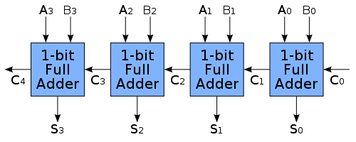
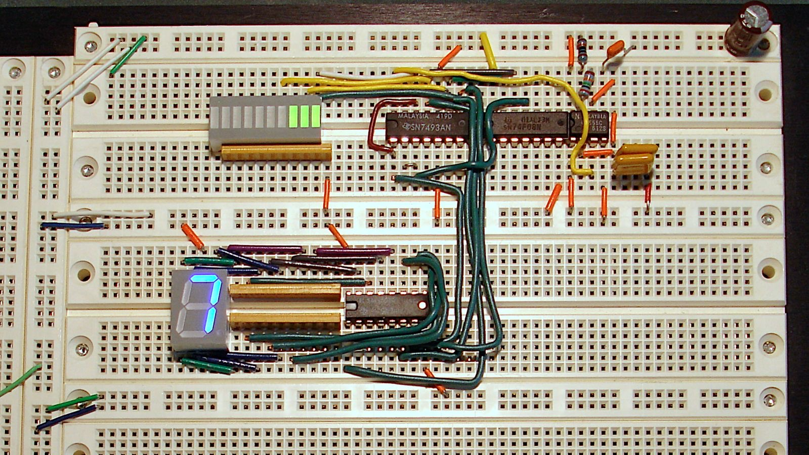

# Архитектура компьютера

## Лекция 5

## Цифровая схемотехника. Параллелизм уровня бит. Особенности производства аппаратуры 数字电路。 位级并行。 设备生产特点

Пенской А.В., 2022

----

## План лекции

- Почти компьютер. Элементная база компьютера.
    - Цифровая элементная база. Булев базис. (продолжение)
        - Двоичное кодирование. (было)
        - Комбинационные схемы.
        - Состояние.
- Особенности производства вычислительной техники
    - Навесной монтаж
    - Монтаж на печатную плату

- 几乎是一台电脑。 计算机元件基础。
     - 数字元素库。 布尔基础。 （续）
         - 二进制编码。 （曾是）
         - 组合电路。
         - 状态。
- 计算机设备生产特点
     - 壁挂式安装
     - PCB安装

---

## Цифровая элементная база. <br/>Булев базис.  <br/> (продолжение) 数字元素库。 <br/> 布尔基础。

### Двоичное кодирование. (было) 二进制编码。（曾是）

----

### Комбинационные схемы 组合电路

Комбинационная схема -- схема, составленная из набора логических элементов, в совокупности реализующая заданную таблицу истинности.  
组合电路是由一组逻辑元件组成的电路，这些逻辑元件一起实现给定的真值表。


----

#### Функциональные возможности и построение 功能与构造

Функция -- отображение множества $A$ на множество $B$.  
该函数是从集合 $A$ 到集合 $B$ 的映射。

Если $A$ и $B$ конечны (представимы в виде конечной последовательности битов), тогда возможно построить эквивалентную комбинационную схему.  
如果 $A$ 和 $B$ 是有限的（可表示为有限的位序列），则可以构造等效的组合电路。

Способы построения: 施工方法：

- через таблицу истинности;
- через логику работы (алгоритмизацию).  

- 通过真值表；
- 通过工作逻辑（算法化）。

*Offtopic*: очень похоже на логарифмическую линейку и арифмометр.  
*题外话*：与计算尺和加法机非常相似。

----

#### Через таблицу истинности

1. Формирование таблицы истинности.  
   真值表的形成。
2. Запись таблицы истинности в ДНФ или КНФ (прямо отображается в комбинационную схему).  
   记录DNF或CNF中的真值表（直接映射到组合电路）
3. Минимизация (сокращаем размер схемы).  
   最小化（减小电路尺寸）

Подробнее см. курс дискретной математики Полякова: ККНФ и КДНФ, минимизация булевых функций, метод Петрика, карты Карно и т.п.  
更多详情请参见 Polyakov 的离散数学课程：CCNF 和 CDNF、布尔函数的最小化、Petrik 方法、卡诺图等。

----

##### Определение номера сигнала (3-to-2) 确定信号数量（3对2）

<div class="row"><div class="col">

###### Таблица истинности 真值表

| $x_3$ | $x_2$ | $x_1$ | $y_2$ | $y_1$ | $y$ |
|:------|:------|:------|:------|:------|:----|
| 0     | 0     | 1     | 0     | 1     | (1) |
| 0     | 1     | 0     | 1     | 0     | (2) |
| 1     | 0     | 0     | 1     | 1     | (3) |

###### КДНФ

$y_2 = \overline{x_3} x_2 \overline{x_1} \vee x_3 \overline{x_2} \overline{x_1}$

$y_1 = \overline{x_3} \overline{x_2} x_1 \vee x_3 \overline{x_2} \overline{x_1}$

###### Минимизированная функция 最小化函数

$y_2 = \overline{x_1}$

$y_1 = \overline{x_2}$

</div><div class="col">


(4 to 2 encoder)

</div></div>

----

#### Через логику работы 通过工作逻辑

Схема строится на основе понимания функции, взаимосвязи входа и выхода. Творческий процесс. Схема может быть каскадной.  
该电路是建立在对功能以及输入和输出之间的关系的理解的基础上的。 创作过程。 该方案可以级联。

<div class="row"><div class="col">

Полный сумматор (1-bit): 全加器（1 位）：


- $A$, $B$ -- биты операндов;
- $S$ -- результат;
- $С_{in}$, $С_{out}$ -- бит переноса.

</div><div class="col">

Каскадный сумматор: 级联加法器：



</div></div>

----

##### Процесс каскадного сумматора 级联加法器过程

<div class="row"><div class="col">


</div><div class="col">

```text
   C0 ________________________ (0)
           ___________________ (1)
   A0 ____/                    (0)
           ___________________ (1)
   B0 ____/                    (0)
   S0 ________________________ (0)

                ______________ (1)
   C1 _________/               (0)
           ___________________ (1)
   A1 ____/                    (0)
   B1 ________________________ (0)
                ____
   S0 _________/    \_________ (0)

                     _________ (1)
   C2 ______________/          (0)
   A2 ________________________ (0)
   B2 ________________________ (0)
                          ____ (1)
   S2 ___________________/     (0)


   ----------- time ------------->
```

</div></div>

----

#### Свойства комбинационных схем

<div class="row"><div class="col">

- возможность установления стабильного состояния при корректном входе;
- задержка установления стабильного состояния после изменения входных значений (зависит от условий окружающей среды);
- *параллелизм уровня бит* (узлы схемы работают параллельно);
- накопление ошибки в физическом процессе, что может привести к ошибке на логическом уровне (использование буфера).
- 通过正确的输入建立稳定状态的能力；
- 改变输入值后建立稳定状态的延迟（取决于环境条件）；
- *位级并行*（电路节点并行工作）；
- 物理过程中错误的累积，可能导致逻辑级别的错误（缓冲区使用）。

</div><div class="col">

```text
   C0 ________________________ (0)
           ___________________ (1)
   A0 ____/                    (0)
           ___________________ (1)
   B0 ____/                    (0)
   S0 ________________________ (0)

                ______________ (1)
   C1 _________/               (0)
           ___________________ (1)
   A1 ____/                    (0)
   B1 ________________________ (0)
                ____
   S0 _________/    \_________ (0)

                     _________ (1)
   C2 ______________/          (0)
   A2 ________________________ (0)
   B2 ________________________ (0)
                          ____ (1)
   S2 ___________________/     (0)


   ----------- time ------------->
```

</div></div>

---

#### Реальная ситуация с двоичным кодированием 二进制编码的真实情况

Вы ведь не думаете, что это на самом деле два состояния?  
你不认为这实际上是两种状态，对吗？

----

Заимствовано из стандарта для языка описания цифровых схем Verilog.  
借用 Verilog 数字电路描述语言标准。

- Очевидное `0` и `1`.  
  明显的“0”和“1”。

- <div> `z` -- отключено, когда ваш источник данных (провод) висит в воздухе. `0` обычно не кодируют нулевым уровнем.  
  `z` -- 当您的数据源（电线）漂浮在空中时禁用。 “0”通常不在零级别编码。 </div> <!-- .element: class="fragment" -->

<div>

- `x` -- неизвестно, значение может быть произвольным, т.к. таблица истинности задана частично. Примеры:  
  `x` -- 未知，该值可以是任意的，因为 真值表已部分指定。 例子：
    - деление на `0`;  
      除以“0”
    - квадратный корень из отрицательного числа;  
      负数的平方根
    - пример "Определение номера сигнала (3-to-2)" выше.  
      上面的示例“确定信号编号（3 到 2）”

</div> <!-- .element: class="fragment" -->

---

### Состояние в комбинационной схеме 组合电路中的状态

Триггер -- класс электронных устройств, обладающих способностью длительно находиться в одном из двух устойчивых состояний и чередовать их под воздействием внешних сигналов.  
触发器是一类电子设备，能够长时间保持两种稳定状态之一，并在外部信号的影响下交替使用。

<div class="row"><div class="col">

Триггер позволяет:  
触发器允许您：

- ограничить распространение сигнала по схеме;
- зафиксировать текущее состояние сигнала в схеме.  
- 限制信号沿电路的传播；
- 记录电路中信号的当前状态。

</div><div class="col">


</div></div>

----

#### Виды триггеров

- Условие изменения состояния: 状态改变条件：
    - по фронту; 沿着前面；
    - по уровню. 按级别。
- Интерфейс: 界面：
    - D-триггер (D от англ. Delay) -- запоминает состояние входа и выдаёт его на выход.  
      D-trigger（D 源自英语 Delay）- 记住输入状态并将其输出到输出。
    - RS-триггер, или SR-триггер (от англ. Set/Reset -- установить/сбросить) -- асинхронный триггер, который сохраняет своё предыдущее состояние при неактивном состоянии обоих входов и изменяет своё состояние при подаче на один из его входов активного уровня.  
      RS-trigger 或 SR-trigger（来自英语 Set/Reset - 设置/重置）- 一种异步触发器，当两个输入均处于非活动状态时保留其先前状态，并在将活动电平应用于其中一个输入时更改其状态。
    - и др.

----

#### RS-триггер

Асинхронный триггер, который сохраняет своё предыдущее состояние при неактивном состоянии обоих входов и изменяет своё состояние при подаче на один из его входов активного уровня.  
一种异步触发器，当两个输入均无效时，它会保留其先前的状态，而当对其中一个输入施加有效电平时，会更改其状态。

<div class="row"><div class="col">


</div><div class="col">

| `S` | `R` | `Q(t)`   | `NQ(t)`   |
|:----|:----|:---------|:----------|
| 0   | 1   | 0        | 1         |
| 1   | 0   | 1        | 0         |
| 0   | 0   | `Q(t-1)` | `NQ(t-1)` |
| 1   | 1   | 0        | 0         |

</div></div>

----

#### RS-триггер на реле

<div class="row"><div class="col">


</div><div class="col">

```text
 L1                      L2
 o                       o
 |                       |
 +---+---[ ]---+---(\)---+
 |   |   R     |   Q     |
 |   |         |         |
 |   +---[ ]---+         |
 |       NQ              |
 |                       |
 |   +---[ ]---+         |
 |   |   Q     |         |
 |   |         |         |
 +---+---[ ]---+---(\)---+
 |       S         NQ    |
 |                       |
```

</div></div>

----

##### `S=1; R=0`. 1


----

##### `S=1; R=0`. 2


----

##### `S=1; R=0`. 3


----

##### `S=1; R=0`. 4


----

##### `S=0; R=1`. 1


----

##### `S=0; R=1`. 2


----

##### `S=0; R=0; Q=1; NQ=0`. 1


----

##### `S=0; R=0; Q=1; NQ=0`. 2


---

### Состояния позволяют

- хранить состояние;
- многотактовые схемы, вычисления в несколько шагов:
    - переиспользование схемотехники на разных тактах: сложение 64-битных чисел на 16-битном сумматоре за 4 такта;
    - конвейерное исполнение: количество стадий определяет количество параллельно выполняемых задач;
    - итеративные расчёты;
    - программное управление;

- 存储状态；
- 多周期电路，分几步计算：
     - 在不同时钟周期重用电路：在 4 个时钟周期内将 64 位数字加到 16 位加法器上；
     - 管道执行：阶段的数量决定了并行执行的任务数量；
     - 迭代计算；
     - 软件控制；


----

- синхронная схемотехника:
    - меньше гонок, проще синхронизация;
    - частота по самой медленной комбинационной схеме;
    - дискретизация входных сигналов по времени;
    - синхронность -- условна.
- повышение частоты (разбить большую комбинационную схему на несколько, рост в пределе почти в 2 раза).  

- 同步电路：
     - 更少的比赛，更容易同步；
     - 根据最慢组合电路的频率；
     - 按时间对输入信号进行采样；
     - 同步性是有条件的。
- 增加频率（将一个大的组合电路分成几个，将极限增加近2倍）。


---

### Условный оператор в схемотехнике

Схемотехника не может не работать.  
电路不能失效。

Подходы к реализации:  
实施办法：

- через состояние и программное управление;
- через спекулятивные вычисления и выбор результата (мультиплексор).  
- 通过状态和程序控制；
- 通过推测性计算和结果选择（多路复用器）。


----

<div class="row"><div class="col">

```verilog
assign A = f1(...);
assign B = f2(...);

always @(posedge clock) 
    begin
        if (addr == 0)
            // Q < = A
            Q <= A;
        else
            Q <= B;
end
```

Схема 方案

</div><div class="col">

```python
a = f1(...)
b = f2(...)

if addr == 0:
    q = a;
else:
    q = b
```

О пользе ленивых вычислений 关于惰性求值的好处

</div><div class="col">

```python
if addr == 0:
    q = f1(...)
else:
    q = f2(...)
```

ПО

</div></div>

 <!-- .element: height="200px" -->

---

### Пример схемы с состоянием

- Фрагмент примера лаб. работы № 3. Код в репозитории.
- Приведена память данных и схема чтения из неё.  
- 示例实验室的片段。 第 3 号工作。存储库中的代码。
- 给出了数据存储器和读取数据的电路。

```verilog
                     +--------------+  addr   +--------+
               +---->| data_address |---+---->|  data  |
               |     +--------------+   |     | memory |
           +-------+                    |     |        |
 signal -->|  MUX  |         +----------+     |        |
 data      +-------+         |                |        |
 address    ^     ^          |                |        |
 sel        |     |          |                |        | mem_out
            |     +---(+1)---+                |        |-----+
            |                |                |        |     |
            +---------(-1)---+                |        |     |
                                              |        |     |
                                              +--------+     |
                                                             v
                                        signal_latch_acc  +--------------+
                                                  ------->| acc_internal |
                                                          +--------------+
```

----

#### Реализация схемы на Verilog

<div class="row"><div class="col">

Интерфейс и инициализация  
接口及初始化

```verilog
module data_memory
  ( input wire clk

  , input wire signal_latch_data_address
  , input wire signal_data_address_sel
  , input wire signal_latch_acc

  , output wire  [7:0] acc
  );

reg [3:0] data_address;
reg [7:0] mem[15:0];
wire [7:0] mem_out;
reg [7:0] acc_internal;

// not a part of hardware
integer i;
initial begin
  data_address = 0;
  for (i = 0; i < 8; i = i+1)
    mem[i] = i[7:0];
end
```

</div><div class="col">

Адресация  
寻址

```verilog
always @(posedge clk)
  if ( signal_latch_data_address )
    data_address <= 
      signal_data_address_sel
      ? data_address + 1
      : data_address - 1;
```

Чтение аккумулятора  
读取 AC 寄存器

```verilog
assign mem_out = mem[data_address];

always @(posedge clk)
  if ( signal_latch_acc )
    acc_internal <= mem_out;

assign acc = acc_internal;

endmodule
```

</div></div>

----

#### Схема с состоянием 有状态电路


- Так как память используется только для чтения -- она выродилась в комбинационную схему.
- Смысл цветов линий мне неизвестен.
- 由于存储器仅用于读取，因此它已退化为组合电路。
- 我不知道线条颜色的含义。

----

#### Временная диаграмма схемы с состоянием 有状态电路时序图


```verilog
// signal will establish after each clock signal
latch_data_address <= 0; data_address_sel <= 0; latch_acc <= 0; @(posedge clk);
repeat(2) @(posedge clk);

// addr to 3
latch_data_address <= 1; data_address_sel <= 1; latch_acc <= 0; @(posedge clk);
latch_data_address <= 1; data_address_sel <= 1; latch_acc <= 0; @(posedge clk);
latch_data_address <= 1; data_address_sel <= 1; latch_acc <= 0; @(posedge clk);

// latch acc
latch_data_address <= 0; data_address_sel <= 0; latch_acc <= 1; @(posedge clk);

// addr to 2
latch_data_address <= 1; data_address_sel <= 0; latch_acc <= 0; @(posedge clk);

// addr to 1 and latch acc at same time
latch_data_address <= 1; data_address_sel <= 0; latch_acc <= 1; @(posedge clk);

latch_data_address <= 0; data_address_sel <= 0; latch_acc <= 0; @(posedge clk);
repeat(2) @(posedge clk);
```

---

### Ключевые отличия схемотехники от программирования 电路设计和编程之间的主要区别

1. Все процессы между регистрами всегда происходят параллельно. Не читайте код как алгоритм, рисуйте схему.
2. Нет понятия "система остановилась". Она всегда работает, если есть питание.
3. Передача сигнала -- физический аналоговый процесс. Есть питание и контакт -- есть передача.
4. Таблица истинности неполна -- результат будет случайным. 

---

1. 寄存器之间的所有进程始终并行发生。 不要把代码当成算法来读，画个图。
2. 不存在“系统已停止”的概念。 只要有电源，它总是有效的。
3. 信号传输是一个物理模拟过程。 有力量和接触——就有传输。
4. 真值表不完整——结果是随机的。

---

Мы обсудили: 我们讨论过了：

- понятие системы
- понятие архитектуры
- примеры компьютерных систем
- базис электронных компьютерных систем
- параллелизм уровня битов и разные вычислительные механизмы  

- 系统概念
- 建筑概念
- 计算机系统示例
- 电子计算机系统基础
- 位级并行性和不同的计算机制

Далее погружаемся в вопросы: 接下来我们深入探讨以下问题：

- Как производится аппаратное обеспечение?
- Что такое hardware и software, и почему мы были вынуждены придумать последнее?
- Что такое универсальный процессор, какие бывают и как устроены (лаб. 3)?

- 硬件是如何制造的？
- 什么是硬件和软件？为什么我们被迫提出后者？
- 什么是通用处理器，它们是什么以及它们是如何设计的（实验 3）？

---

## Особенности производства аппаратного обеспечения

Задача производства: превратить документацию в изделие  
生产任务：将文档变成产品

*Disclaimer*:  
*免责声明*：

- только о радиоэлектронной аппаратуре (РЭА)
- я не занимаюсь производством и проектированием РЭА
- обзор не претендует на полноту
- назначение раздела: сформировать поверхностное представление
- откуда взялась "производственная документация" -- неважно
- 仅关于无线电电子设备 (REA)
- 我不参与电子设备的生产和设计
- 审查并未声称是完整的
- 本节的目的：形成一个肤浅的想法
- “生产文档”从哪里来 - 没关系

----

### Навесной монтаж 壁挂式安装

<div class="row"><div class="col">

Способ монтажа электронных схем, при котором расположенные на изолирующем шасси радиоэлементы соединяются друг с другом проводами или непосредственно выводами.  
一种安装电子电路的方法，其中位于绝缘底盘上的无线电元件通过电线或直接通过引线相互连接。

</div><div class="col">


</div></div>

----

<div class="row"><div class="col">

Достоинства: 优点：

- простота производства
- простота подготовки производства
- гибкость (если не "залить компаундом")  
- 易于生产
- 易于生产准备
- 灵活性（如果不是“充满化合物”）

Недостатки: 缺陷：

- сложность автоматизации, дорого в серии
- надёжность (если не "залить компаундом")
- плотность ограничена прямотой рук монтажника
- 自动化复杂，系列价格昂贵
- 可靠性（如果不是“填充化合物”）
- 密度受到安装人员手的直线度的限制

</div><div class="col">

На макетной плате: 在面包板上：



</div></div>

----

### Монтаж на печатную плату

<div class="row"><div class="col">

**Печатная плата** -- пластина из диэлектрика, на поверхности и/или в объёме которой сформированы электропроводящие цепи электронной схемы. Электрическое и механическое соединение компонентов.  
**印刷电路板**是由电介质制成的板，在其表面和/或体积内形成电子电路的导电电路。 部件的电气和机械连接。

Различают: 有：

- одно- и двухслойные платы,
- многослойные платы.
- 单层和双层板，
- 多层板。

Виды монтажа компонентов: 组件安装类型：

- выводной (в отверстие)
- поверхностный
- встроенный
- 输出（进入孔）
- 肤浅的
- 内置

</div><div class="col">


</div></div>

----

#### Поверхностный монтаж Surface-mount technology (SMD) 表面贴装技术 (SMD)

<div class="row"><div class="col">


</div><div class="col">


Fan-out Wafer-Level Packaging 扇出晶圆级封装

</div></div>

Notes: <https://tech-e.ru/2011_02_4.php>

----

##### Виды SMD компонентов SMD元件类型

<div class="row"><div class="col">


</div><div class="col">


Ball Grid Array (BGA) 球栅阵列 (BGA)

</div></div>

----

#### Встроенные компоненты


----

Достоинства: 优点：

- автоматизация
- плотность размещения компонент
- размеры
- стоимость в серии
- 自动化
- 元件密度
- 方面
- 每个系列的成本

Недостатки: 缺陷：

- необходимость подготовки производства
- удлинение производственной цепочки
- сложность внесения исправлений  
- 生产准备的需要
- 延长生产链
- 修正困难

"Гибкость" печатных плат: 印刷电路板的“灵活性”：

- джампер (by design)
- "перерезать дорожку"
- "навесная дорожка"
- 跳线（设计）
- “切断道路”
- “悬空路径”
