# Архитектура компьютера

## Лекция 6

## Кремниевое производство. Ограничения аппаратуры

Пенской А.В., 2022

----

## План лекции

- Особенности производства вычислительной техники (продолжение)
    - Интегральные схемы. Кремниевое производство
- Состояние и развитие современных процессоров
    - Закон Деннарда
    - Законы Мура
    - О надёжности современного кремниевого производства
- Ограничения и трудности аппаратного обеспечения

---

### *Вопрос*: Проблема разбега в двоированной системе

<div class="row"><div class="col">

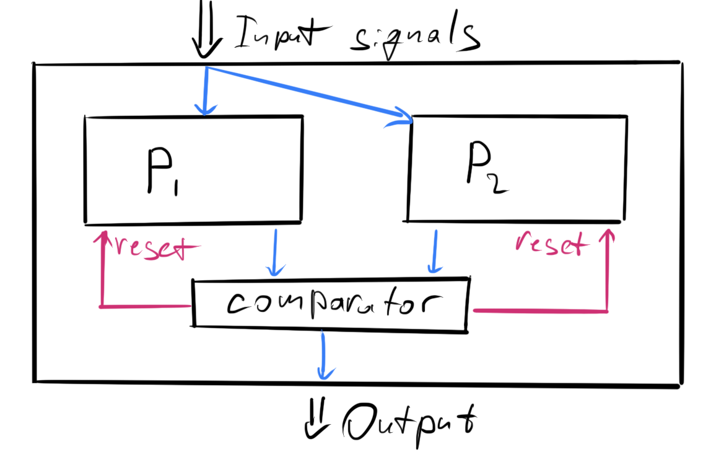

</div><div class="col">

`P1` и `P2` -- идентичные процессоры, с идентичным ПО, с единым тактовым сигналом.

`comparator` -- сравнивает результат работы `P1` и `P2` и в случае ошибки -- аварийная перезагрузка.

Почему процессоры могут регулярно выдавать разные значения?

</div></div>

----

Что не так с этой платой?

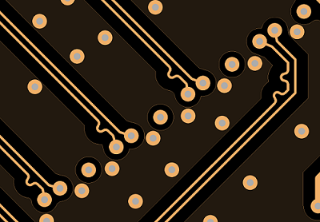  

Выравнивание длины линий на плате. <!-- .element: class="fragment" -->

---

## Интегральные схемы. Кремниевое производство

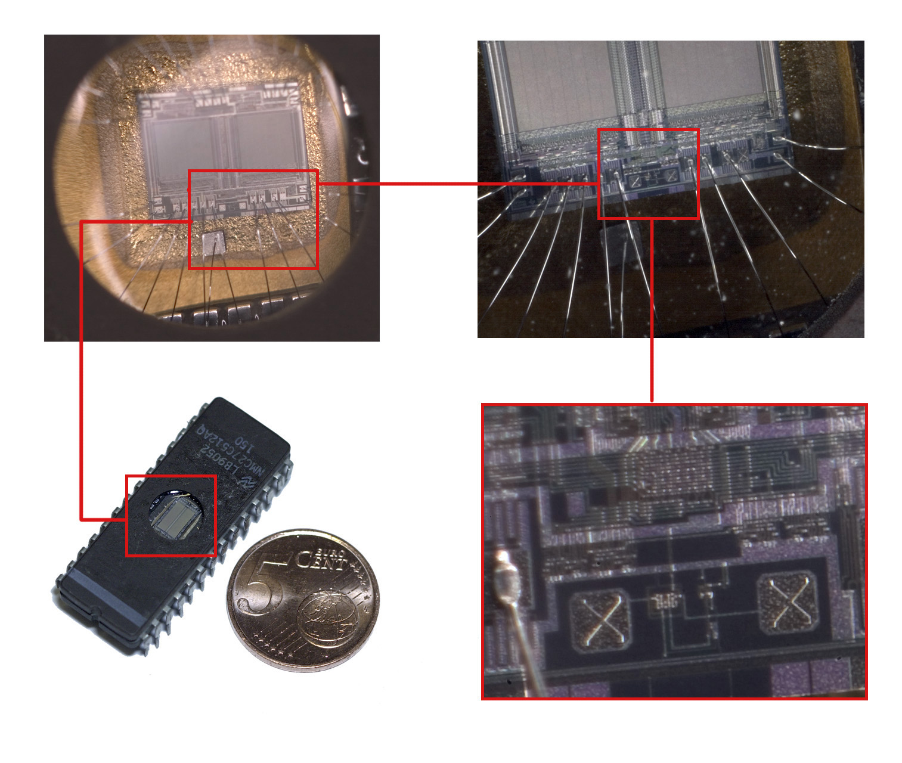 <!-- .element: height="450px" -->

[источник 1](https://habr.com/ru/company/intel/blog/110234/) | [источник 2](https://www.slideshare.net/priyankabisarya/priyanka-edited2?next_slideshow=33881038)

----

### Процесс производства чипа

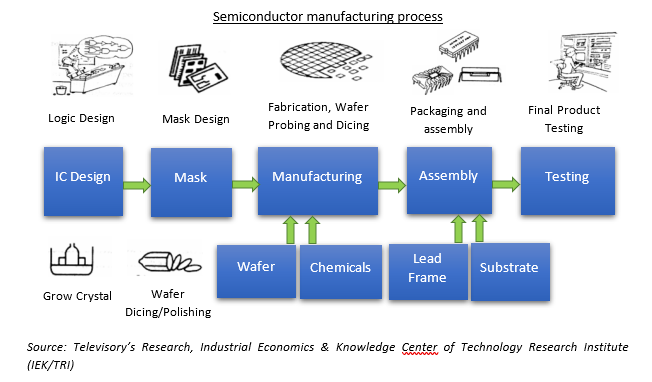

----

### Кремниевый песок

Начало производственной цепочки

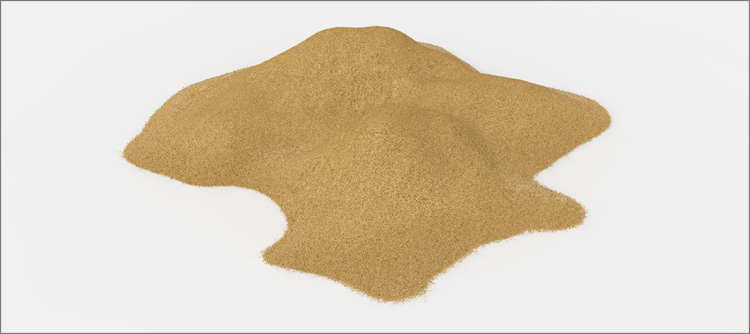

----

### Выращиваем монокристалл кремния (буля)

<div class="row"><div class="col">

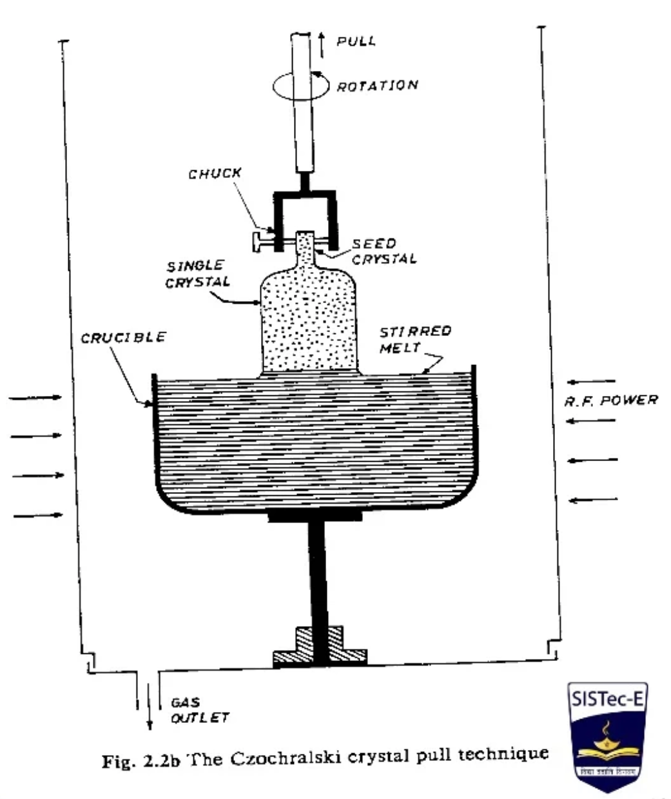

</div><div class="col">

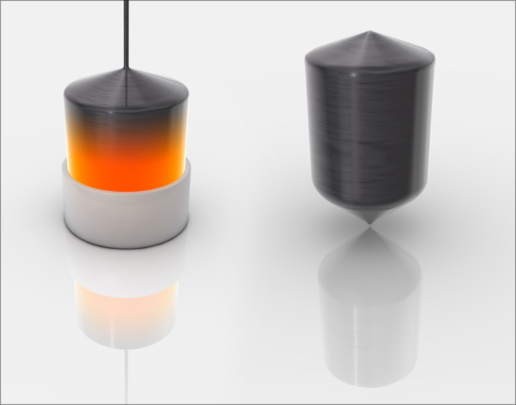

</div></div>

----

### Производим подложку будущих чипов (Wafer)

<div class="row"><div class="col">

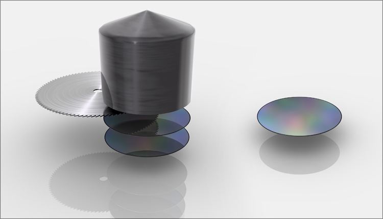

</div><div class="col">

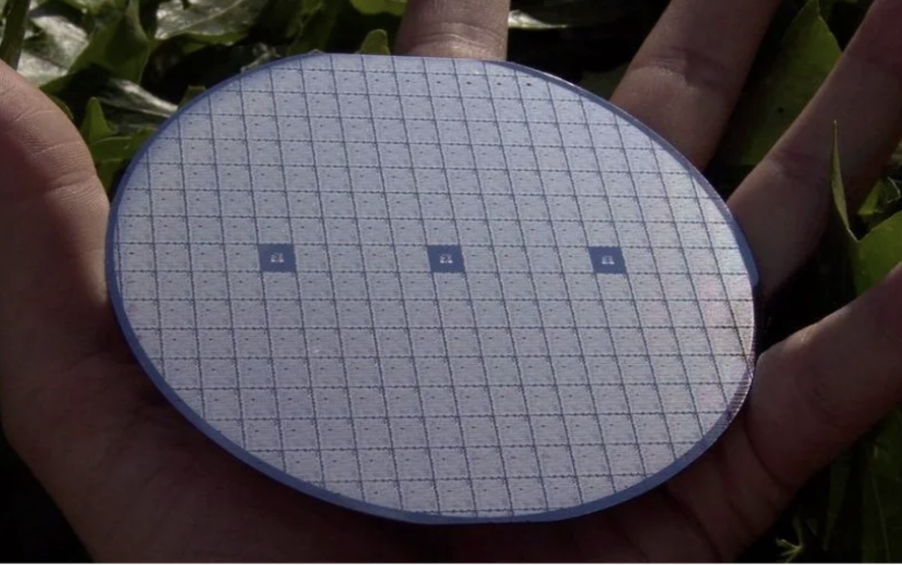

</div></div>

----

### Фотолитография и "море" транзисторов

<div class="row"><div class="col">

"свет-шаблон-фоторезист"

- На кремниевую подложку наносят материал для рисунка.
- Наносится фоторезист.
- Экспонирование через фотошаблон.
- Удаление отработанного фоторезиста.

</div><div class="col">

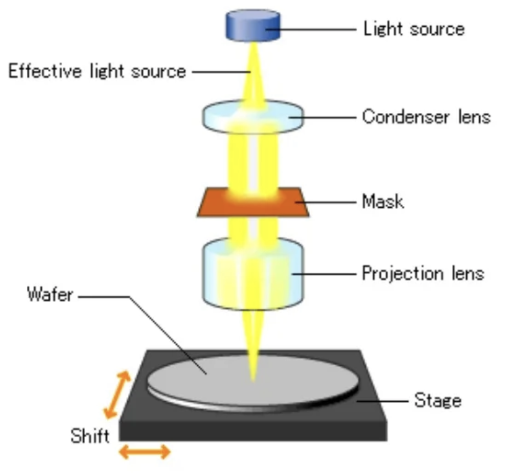

</div></div>

----

### Interconnect


----

### Структура чипа в разрезе

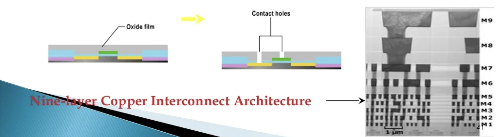

----

### Извлечение будущих чипов

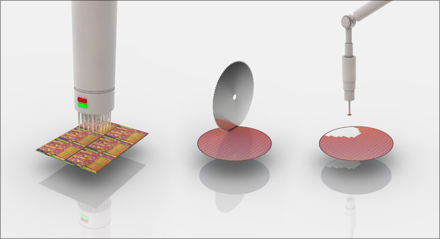

----

### Корпус и контакты

<div class="row"><div class="col">

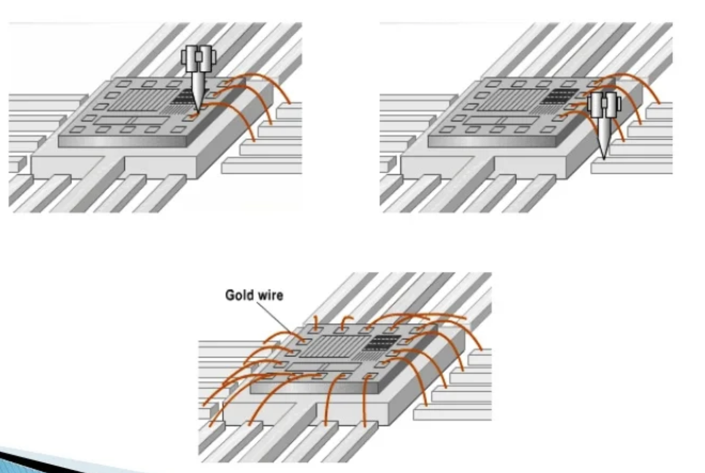

</div><div class="col">

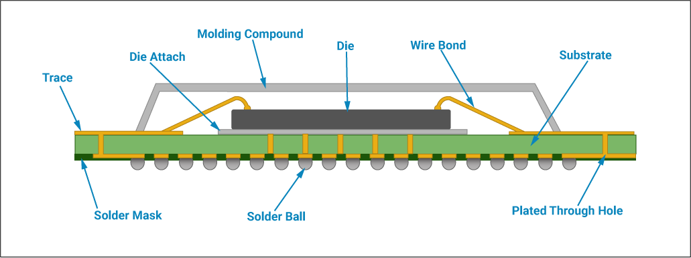

</div></div>

---

#### Современный степпер (засветка фотошаблона)

<div class="row"><div class="col">

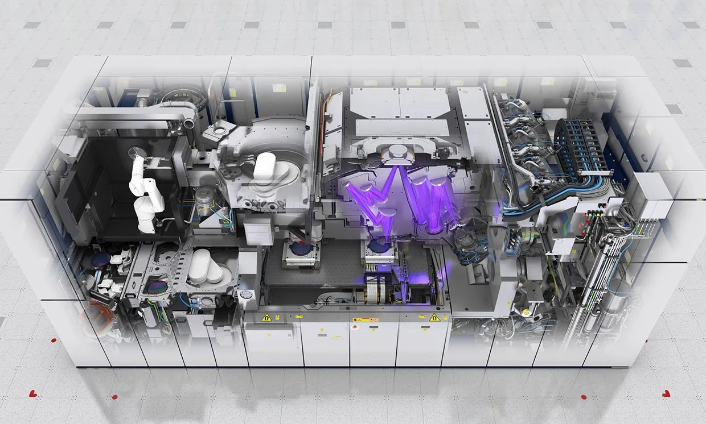

[источник](https://habr.com/ru/company/dcmiran/blog/490682/)

</div><div class="col">

<div>

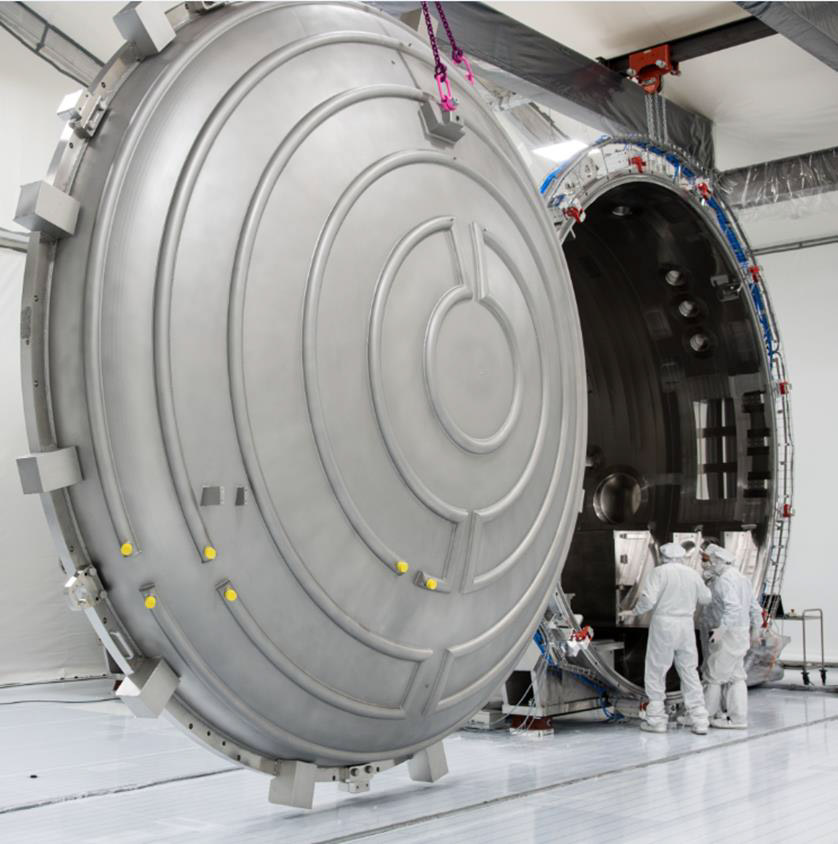

~ 180 тон, ~ двухэтажный автобус

</div> <!-- .element: class="fragment" -->

</div></div>

----

"Внутри самой современной EUV-машины каждую секунду 50 000 капель расплавленного олова падают через камеру в её основании. Пара высокоэнергетических лазеров на углекислом газе ударяет по каждой капле, создавая плазму, которая, в свою очередь, испускает свет нужной длины волны. Первый импульс преобразует каплю олова в туманную форму блина, так что второй импульс, который является более мощным и следует за ним всего через 3 микросекунды, взрывает олово в плазму, которая светится на длине волны 13,5 нанометров, как показано на видео."

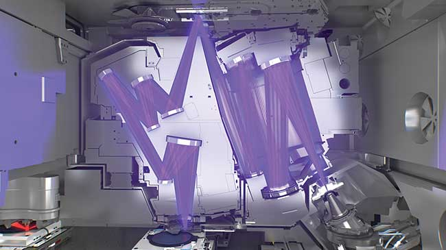<!-- .element: height="250px" -->

---

## Состояние и развитие современных процессоров

----

### Закон Деннарда

**Dennard scaling**, also known as MOSFET scaling, is a scaling law which states roughly that, as transistors get smaller, their power density stays constant, so that the power use stays in proportion with area; both voltage and current scale (downward) with length.

- Дороговизна (физическая невозможность) дальнейшего уменьшения размера транзистора.
- Токи утечки.
- Power wall и [Dark Silicon](https://en.wikipedia.org/wiki/Dark_silicon).

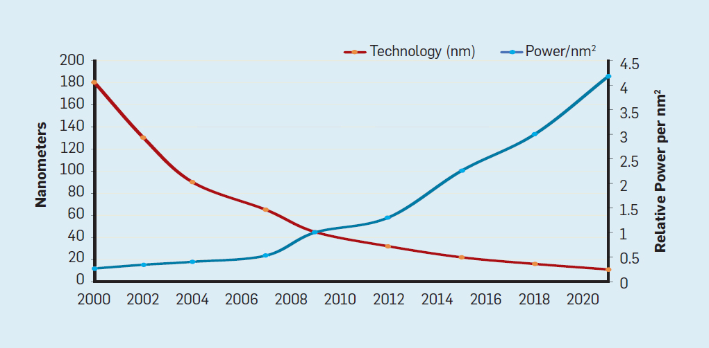 <!-- .element: height="250px" -->

----

### Закон Мура

**Moore's law** is the observation that the number of transistors in a dense integrated circuit (IC) doubles about every two years.

<div class="row"><div class="col">

- закон Амдала (фундаментальное ограничение на параллелизм, к нему мы вернемся позднее)
- накладные расходы на параллельные вычисления
- объективная сложность параллельного программирования
- доставка данных

</div><div class="col">

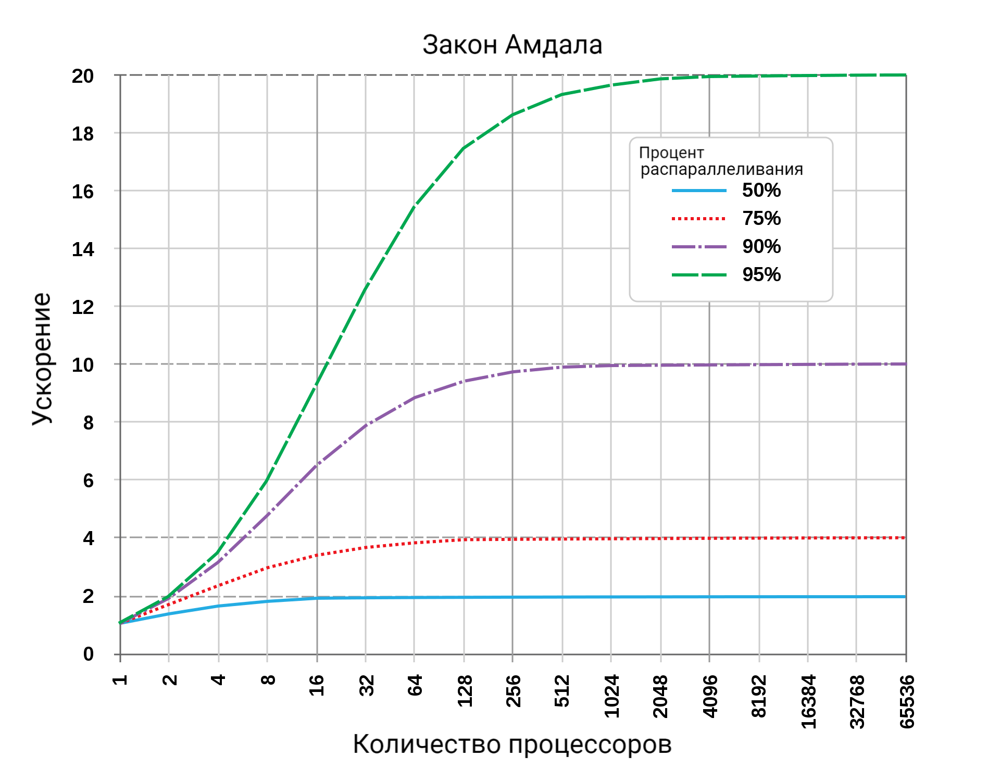

</div></div>

----

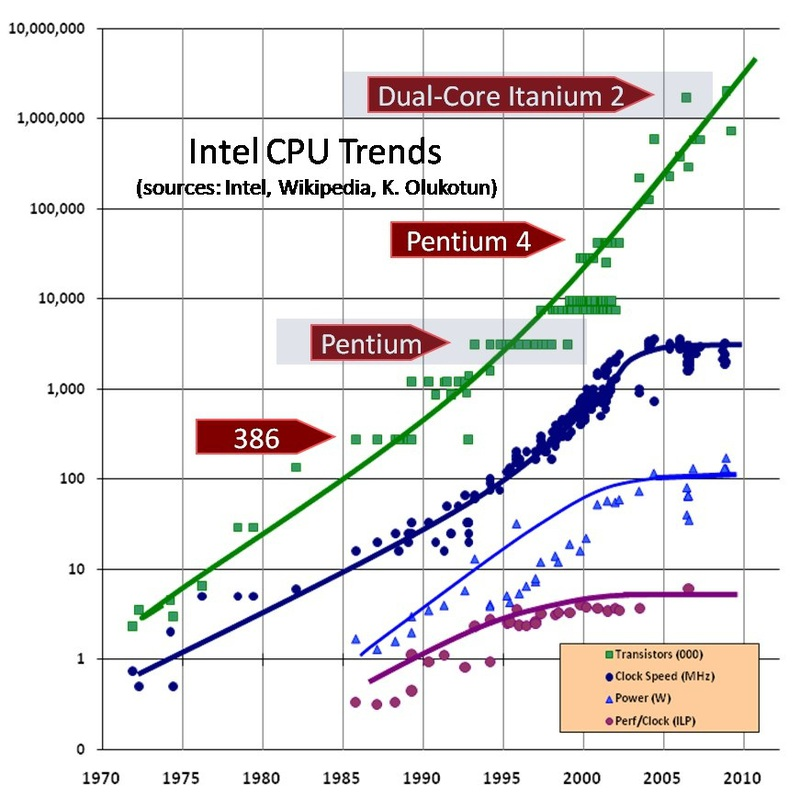 <!-- .element: height="600px" -->

- Архитектура процессора как источник роста производительности

----

### О надёжности <br/> современного кремниевого производства

- Разные частоты процессоров
- Core Single, Core Duo, Core Quad...
- Intel Pentium Celeron

---

## Ограничения и трудности аппаратного обеспечения

software system
: A system made up of software, hardware, and data that provides its primary value by the execution of the software.
: --- OMG Essence

*Вывод*: в любой программной системе (software intensive system) есть:

- software ~ программное обеспечение
- hardware ~ аппаратное обеспечение
- data ~ какие-то необходимые для работы данные, являющиеся частью системы

----

### Производство

<div class="row"><div class="col">

1. Логистика
2. Склады
3. Специалисты
4. Производственная цепочка
5. Тестирование
6. Упаковка
7. Дистрибуция
8. Гарантийный ремонт

</div><div class="col">

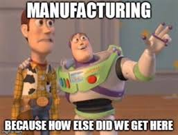

</div></div>

----

### Обслуживание стареющей аппаратуры

1. Ограниченный срок службы.
2. Рост вероятности выхода из строя и замена рабочего парка машин.
3. Затраты на обслуживание.
4. Ремонт требует запасных компонентов.
    - Дорогое хранение.
    - Конечный запас.
5. Воспроизведение:
    - Вытеснение старой элементной базы.
    - Устаревшую элементную базу невыгодно производить (спрос).
    - Штучное производство.
    - Остановка производства, поиск на барахолках.
6. Вывод из эксплуатации сопутствующего оборудования:
    - CD-ROM в компьютерах не устанавливается;
    - 2.5 дискеты больше не производят.

----

### Оловянные нитевидные кристаллы <br/> в электронной технике

<div class="row"><div class="col">

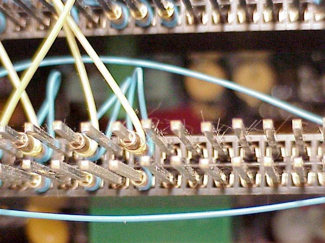

</div><div class="col">

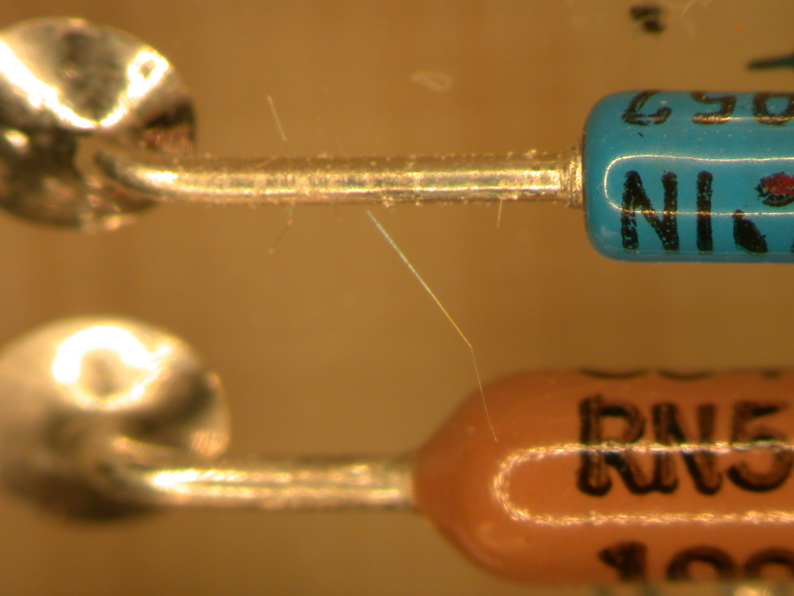

</div><div class="col">

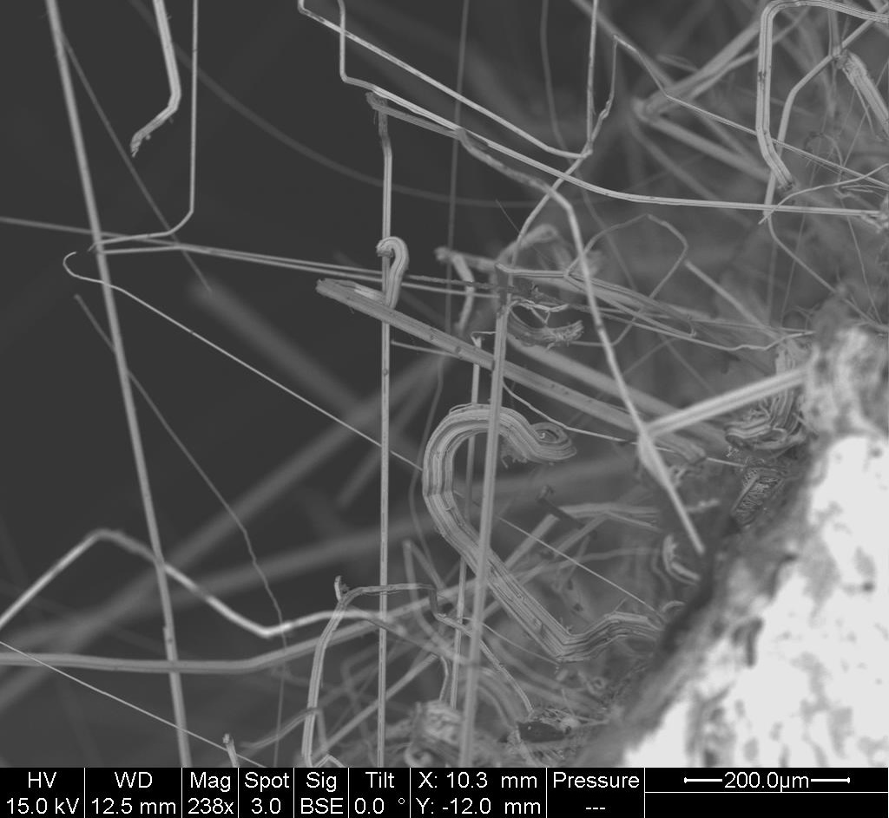

</div></div>

----

<div class="row"><div class="col">

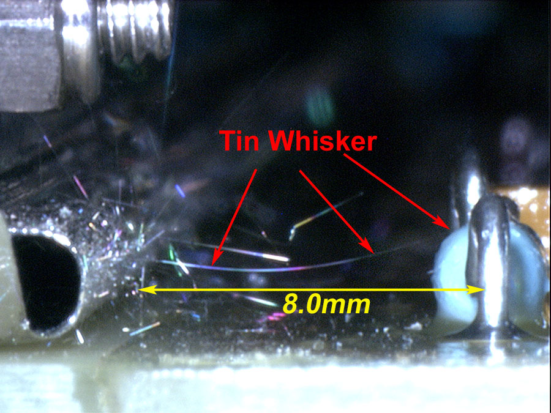

</div><div class="col">

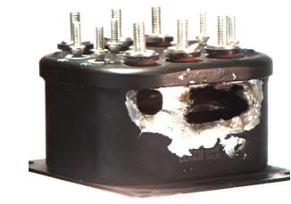

</div></div>

[источник](https://alex-avr2.livejournal.com/211190.html)

----

### Варианты замены устаревшей аппаратуры

<div class="row"><div class="col">

1. Перепроектирование на новой элементной базе (сохранение интерфейсов и ПО).
2. Модульная организация и стандартизированные интерфейсы. Имитация элементов. Парадокс Тесея.
3. Виртуализация (запуск ПО).
4. Проблема пользовательского опыта (компьютер 80-ых позволяет внести запись в БД, пока современный загружается).

</div><div class="col">

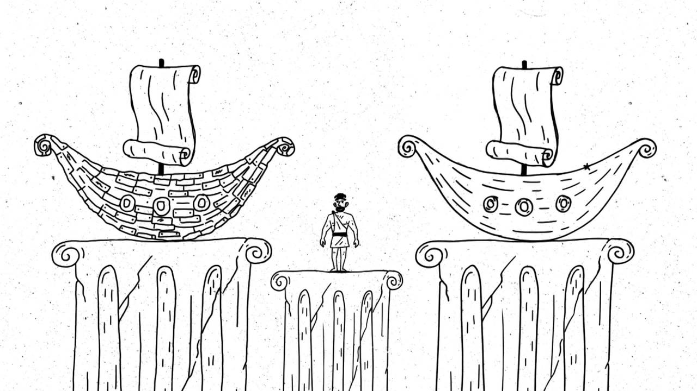

</div></div>

----

### Сложность внесения изменений

<div class="row"><div class="col">

1. Чем совершеннее технология, тем сложнее внести изменения.
    - Навесной монтаж: перерезал один провод, припаял другой.
    - Непредусмотренное изменение в процессоре <br/> $\rightarrow$ перепроектирование <br/> $\rightarrow$ перепроизводство <br/> $\rightarrow$ перепоставка.
2. Физический контакт.
    - дорого;
    - не всегда возможно;
    - [Почему управление одним реле с помощью ARM-процессора -- это нормально?](https://alex-avr2.livejournal.com/177508.html)

</div><div class="col">

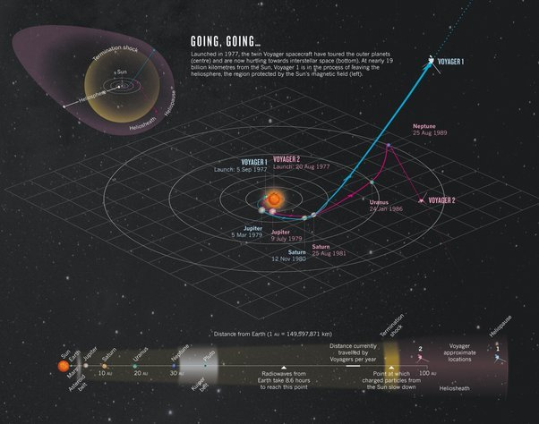

*Примечание*: речь о применении "патча", а не о его разработке.

</div></div>

----

### Почему сложность изменений -- это хорошо?

<div class="row"><div class="col">

<div>

1. Безопасность.
    - Вирус не может проникнуть в то, что нельзя инфицировать.
    - Запрет на запись в память делает её частью аппаратуры.
    - Ошибки в аппаратуре (см. доклады про делитель в Intel, "надёжный" умный замок).
2. Культура разработки. Средства и технологии верификации (в том числе формальные).

```text
- Как вам удалось написать код без ошибок? 
  - спросил программист.
- А что, можно было делать ошибки?
  - ответил электронщик.
```

</div> <!-- .element: class="fragment" -->

</div><div class="col">

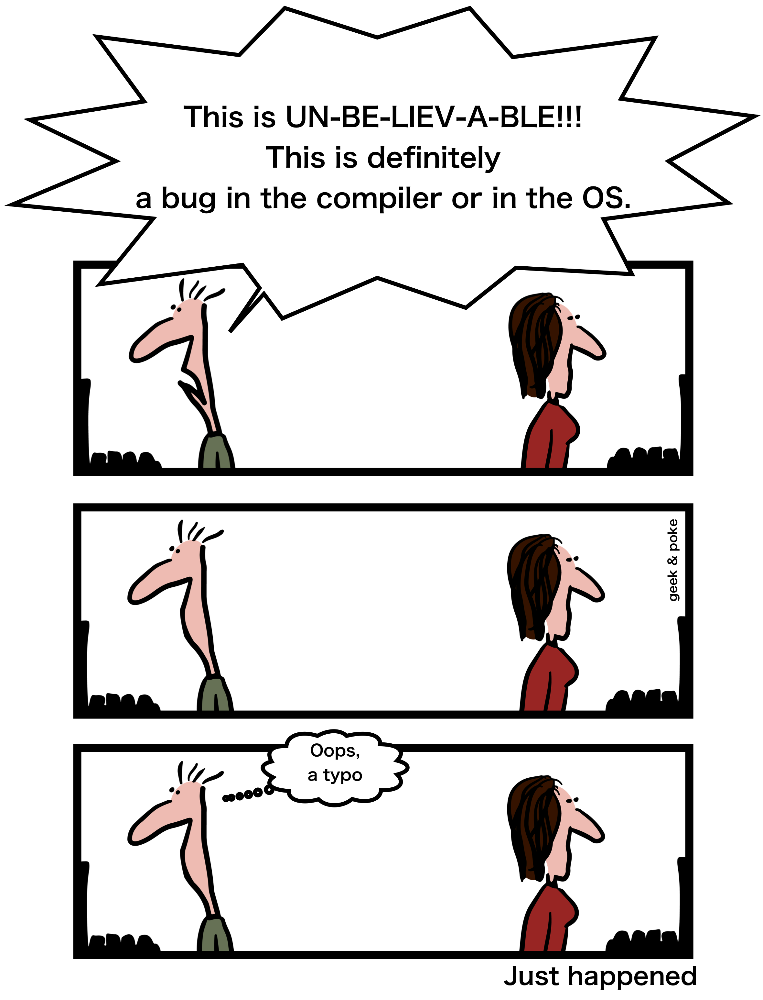

</div></div>
