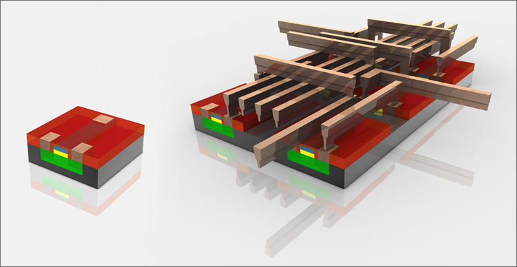

# Архитектура компьютера

## Лекция 6

## Кремниевое производство. Ограничения аппаратуры

Пенской А.В., 2022

----

## План лекции

- Особенности производства вычислительной техники (продолжение)  
  计算机技术生产的特点（续）
    - Интегральные схемы. Кремниевое производство
      集成电路。 硅生产
- Состояние и развитие современных процессоров
  现代处理器的现状和发展
    - Закон Деннарда 登纳德定律
    - Законы Мура 摩尔定律
    - О надёжности современного кремниевого производства 现代硅生产的可靠性
- Ограничения и трудности аппаратного обеспечения 硬件限制和困难

---

### *Вопрос*: Проблема разбега в двоированной системе


`P1` и `P2` -- идентичные процессоры, с идентичным ПО, с единым тактовым сигналом.  
“P1”和“P2”是相同的处理器，具有相同的软件和单个时钟信号。

`comparator` -- сравнивает результат работы `P1` и `P2` и в случае ошибки -- аварийная перезагрузка.  
`comparator` - 比较 `P1` 和 `P2` 的结果，如果出现错误 - 紧急重启。

Почему процессоры могут регулярно выдавать разные значения?  
为什么处理器会定期产生不同的值？


----

Что не так с этой платой?  
这块板有什么问题吗？

  

Выравнивание длины линий на плате.  
对齐板上线条的长度。 <!-- .element: class="fragment" -->

---

## Интегральные схемы. Кремниевое производство 集成电路。 硅生产

 <!-- .element: height="450px" -->

[источник 1](https://habr.com/ru/company/intel/blog/110234/) | [источник 2](https://www.slideshare.net/priyankabisarya/priyanka-edited2?next_slideshow=33881038)

----

### Процесс производства чипа 芯片制造工艺


----

### Кремниевый песок 硅砂

Начало производственной цепочки


----

### Выращиваем монокристалл кремния (буля) 生长硅单晶（晶锭）


----

### Производим подложку будущих чипов (Wafer) 我们生产未来芯片的基板（晶圆）


----

### Фотолитография и "море" транзисторов 光刻与晶体管的“海洋”


"свет-шаблон-фоторезист"  
“光-模板-光刻胶”

- На кремниевую подложку наносят материал для рисунка.
- Наносится фоторезист.
- Экспонирование через фотошаблон.
- Удаление отработанного фоторезиста.  
- 将图案材料施加到硅基板上。
- 应用光致抗蚀剂。
- 通过光掩模曝光。
- 去除废光刻胶。


----

### Interconnect 互连



----

### Структура чипа в разрезе 芯片剖面结构


----

### Извлечение будущих чипов 未来芯片的提取


----

### Корпус и контакты 外壳和触点


---

#### Современный степпер (засветка фотошаблона) 现代步进机（光掩模照明）


[источник](https://habr.com/ru/company/dcmiran/blog/490682/)


<div>


~ 180 тон, ~ двухэтажный автобус  
~ 180 吨， ~ 双层巴士

</div> <!-- .element: class="fragment" -->


----

"Внутри самой современной EUV-машины каждую секунду 50 000 капель расплавленного олова падают через камеру в её основании. Пара высокоэнергетических лазеров на углекислом газе ударяет по каждой капле, создавая плазму, которая, в свою очередь, испускает свет нужной длины волны. Первый импульс преобразует каплю олова в туманную форму блина, так что второй импульс, который является более мощным и следует за ним всего через 3 микросекунды, взрывает олово в плазму, которая светится на длине волны 13,5 нанометров, как показано на видео."  
“在最先进的 EUV 机器内，每秒有 50,000 滴熔融锡落入其底部的腔室。一对高能二氧化碳激光器撞击每一滴，产生等离子体，进而发射光第一个脉冲将锡滴转化为云雾薄煎饼形状，因此 3 微秒后的第二个脉冲（功率更大）将锡爆炸成以 13.5 纳米波长发光的等离子体，如视频所示。”

<!-- .element: height="250px" -->

---

## Состояние и развитие современных процессоров

----

### Закон Деннарда

**Dennard scaling**, also known as MOSFET scaling, is a scaling law which states roughly that, as transistors get smaller, their power density stays constant, so that the power use stays in proportion with area; both voltage and current scale (downward) with length.  
**登纳德缩放**，也称为 MOSFET 缩放，是一种缩放定律，粗略地指出，随着晶体管变小，它们的功率密度保持恒定，因此功耗与面积成正比； 电压和电流都随长度变化（向下）。

- Дороговизна (физическая невозможность) дальнейшего уменьшения размера транзистора.  
  进一步减小晶体管尺寸的昂贵（物理上不可能）。
- Токи утечки. 漏电流。
- Power wall и [Dark Silicon](https://en.wikipedia.org/wiki/Dark_silicon).  
  电源墙和[黑硅](https://en.wikipedia.org/wiki/Dark_silicon)。

 <!-- .element: height="250px" -->

----

### Закон Мура

**Moore's law** is the observation that the number of transistors in a dense integrated circuit (IC) doubles about every two years.  
**摩尔定律** 是指密集集成电路 (IC) 中的晶体管数量大约每两年翻一番。


- закон Амдала (фундаментальное ограничение на параллелизм, к нему мы вернемся позднее)
- накладные расходы на параллельные вычисления
- объективная сложность параллельного программирования
- доставка данных  
- 阿姆达尔定律（并行性的基本限制，我们稍后会再讨论）
- 并行计算的开销
- 并行编程的客观复杂性
- 数据传送


----

 <!-- .element: height="600px" -->

- Архитектура процессора как источник роста производительности  
  处理器架构作为性能增长的源泉

----

### О надёжности <br/> современного кремниевого производства

- Разные частоты процессоров
- Core Single, Core Duo, Core Quad...
- Intel Pentium Celeron  
- 不同的处理器频率
- 单核、双核、四核...
- 英特尔奔腾赛扬

---

## Ограничения и трудности аппаратного обеспечения

software system 软件系统

: A system made up of software, hardware, and data that provides its primary value by the execution of the software.  
由软件、硬件和数据组成的系统，通过软件的执行提供其主要价值。
: --- OMG Essence OMG 精华

*Вывод*: в любой программной системе (software intensive system) есть: *结论*：在任何软件系统（软件密集型系统）中都存在：

- software ~ программное обеспечение
- hardware ~ аппаратное обеспечение
- data ~ какие-то необходимые для работы данные, являющиеся частью системы  
- 软件 ~ 软件
- 硬件 ~ 硬件
- 数据〜作为系统一部分的工作所需的一些数据

----

### Производство 生产


1. Логистика
2. Склады
3. Специалисты
4. Производственная цепочка
5. Тестирование
6. Упаковка
7. Дистрибуция
8. Гарантийный ремонт

---

1. 物流
2. 仓库
3. 专家
4. 产业链
5. 测试
6. 包装
7. 分配
8. 保修维修


----

### Обслуживание стареющей аппаратуры 老化设备的维护

1. Ограниченный срок службы.  
   使用寿命有限。
2. Рост вероятности выхода из строя и замена рабочего парка машин.  
   工作机器组发生故障和更换的可能性增加。
3. Затраты на обслуживание.  
   维修费用。
4. Ремонт требует запасных компонентов.
   维修需要备用部件。
    - Дорогое хранение. 昂贵的存储。
    - Конечный запас. 期末库存。
5. Воспроизведение: 回放：
    - Вытеснение старой элементной базы. 更换旧元件底座。
    - Устаревшую элементную базу невыгодно производить (спрос). 生产过时的组件（需求）是无利可图的。
    - Штучное производство. 计件生产。
    - Остановка производства, поиск на барахолках. 停止生产，搜寻跳蚤市场。
6. Вывод из эксплуатации сопутствующего оборудования: 相关设备退役：
    - CD-ROM в компьютерах не устанавливается; 计算机未安装CD-ROM；
    - 2.5 дискеты больше не производят. 不再生产2.5软盘。

----

### Оловянные нитевидные кристаллы в электронной технике 电子产品中的锡须


----


[источник](https://alex-avr2.livejournal.com/211190.html)

----

### Варианты замены устаревшей аппаратуры 更换过时设备的选项


1. Перепроектирование на новой элементной базе (сохранение интерфейсов и ПО).
2. Модульная организация и стандартизированные интерфейсы. Имитация элементов. Парадокс Тесея.
3. Виртуализация (запуск ПО).
4. Проблема пользовательского опыта (компьютер 80-ых позволяет внести запись в БД, пока современный загружается).  

1. 在新的元素基础上重新设计（保留界面和软件）。
2. 模块化组织，标准化接口。 元素的模仿。 忒修斯悖论。
3. 虚拟化（启动软件）。
4. 用户体验问题（80年代的计算机允许您在现代计算机加载时在数据库中输入条目）。


----

### Сложность внесения изменений 难以做出改变


1. Чем совершеннее технология, тем сложнее внести изменения. 技术越先进，改变就越困难。
    - Навесной монтаж: перерезал один провод, припаял другой. 
      表面安装：剪断一根电线，焊接另一根电线。
    - Непредусмотренное изменение в процессоре 处理器发生意外变化
      $\rightarrow$ перепроектирование 
      $\rightarrow$ перепроизводство 
      $\rightarrow$ перепоставка.
      $\rightarrow$ 重新设计
      $\rightarrow$ 生产过剩
      $\rightarrow$ 重新交付。
2. Физический контакт. 物理接触。
    - дорого; 昂贵的;
    - не всегда возможно; 并不总是可能的；
    - [Почему управление одним реле с помощью ARM-процессора -- это нормально?](https://alex-avr2.livejournal.com/177508.html)  
      为什么使用 ARM 处理器控制一个继电器是正常的？


*Примечание*: речь о применении "патча", а не о его разработке.  
*注意*：这是关于应用“补丁”，而不是开发它。


----

### Почему сложность изменений -- это хорошо? 为什么变革的复杂性是一件好事？


<div>

1. Безопасность. 安全。
    - Вирус не может проникнуть в то, что нельзя инфицировать.  
      病毒无法穿透无法感染的物体。
    - Запрет на запись в память делает её частью аппаратуры.  
      禁止写入内存使其成为设备的一部分。
    - Ошибки в аппаратуре (см. доклады про делитель в Intel, "надёжный" умный замок).  
      硬件错误（请参阅有关英特尔分频器的报告，“可靠”的智能锁）。
2. Культура разработки. Средства и технологии верификации (в том числе формальные).  
   发展文化。 验证工具和技术（包括正式的）。

```text
- Как вам удалось написать код без ошибок? 
  - спросил программист.
- А что, можно было делать ошибки?
  - ответил электронщик.

- 你是如何成功地编写没有错误的代码的？
   - 程序员问道。
- 什么，有可能犯错误吗？
   - 电子工程师回答。
```

</div> <!-- .element: class="fragment" -->


