# Архитектура компьютера

## Лекция 7

## Программа. ПЛК. ПЛИС. <br/> Hardware и Software

Пенской А.В., 2022

----

## План лекции

- Программа. Программы аппаратного толка
    - Программируемые логические контроллеры
    - Программируемые логические интегральные схемы
- Модель вычислений (MoC)
- ПО $\leadsto$ Software. АО $\leadsto$ Hardware

---

## Программа

Computer program
: is a sequence or set of instructions in a programming language for a computer to execute. Computer programs are one component of software, which also includes documentation and other intangible components.
: --- Wikipedia

- Program is a data (separable, transferable)
- Computer $\neq$ Processor $\neq$ Аппаратура

----

### Изменение программы компьютера

<div class="row"><div class="col">

1. Легко заменяется прямо у пользователя.
2. Пользователь как Beta-тестер.
3. Возможно удалённое обновление, в том числе без информированного согласия.
4. Сервис -- вершина владения компьютерной системой.
5. Процесс создания программы может быть автоматизирован (CI/CD).
    - Воспроизводимость сборки ([bazel](https://bazel.build), [nixos](https://nixos.org), [docker](https://www.docker.com)).
    - GitFlow -- зачем так сложно?

</div><div class="col">

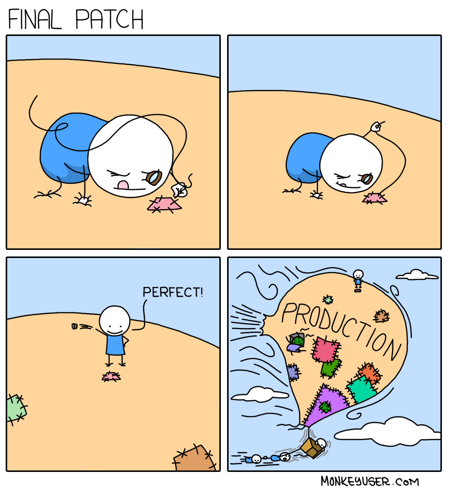

*Примечание*: речь о применении "патча", а не о его разработке.

</div></div>

----

### GitFlow -- зачем так сложно?


Notes: Поддержка множества версий и их совместной работы.

---

## Программы аппаратного толка

Некоторые разновидности программируемых компьютеров функционируют как их аппаратные прототипы. Среди них:

- Программируемые Логические Контроллеры (ПЛК)
- Программируемые Логические Интегральные Схемы (ПЛИС)

----

### Программируемые логические контроллеры

<div class="row"><div class="col">

Автоматизация при помощи релейных схем:

- плохо масштабируется,
- сложная настройка и поддержка,
- надёжность сложных схем,
- проблема соответствия документации и факта.

<!-- .element: height="200px" -->

</div><div class="col">

ПЛК
: специальная разновидность электронной вычислительной машины.

Особенности:

- являются законченными и самостоятельными устройствами;
- работа в реальном времени;
- эксплуатация в тяжёлых условиях;
- ориентированы на работу с машинами и механизмами.

</div></div>

----

#### Типовое устройство ПЛК

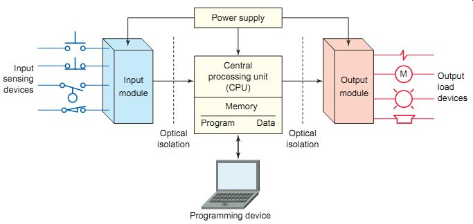

Также существуют и полностью программные реализации.

----

#### Программирование ПЛК

<div class="row"><div class="col">

IEC 61131
: standard for programmable controllers

Определяет языки для специалистов АСУТП:

- Ladder Diagram (Релейно-контактные схемы)
- Function Block Diagram (Функциональные блоковые диаграммы)
- Sequential Function Chart (Последовательностные функциональные диаграммы)
- Structured Text (Структурированный текст)

</div><div class="col">

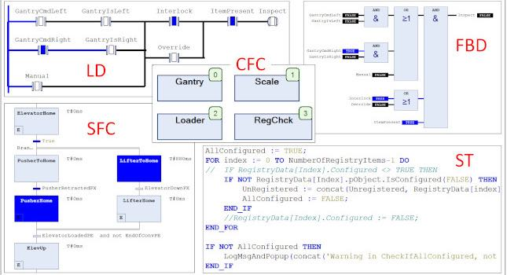

IEC 61499 -- Standard for distributed Automation. Рассмотрим ближе к концу курса в контексте распределённых платформ.

</div></div>

----

### Программируемые логические интегральные схемы

<div class="row"><div class="col">

ПЛИС
: интегральная микросхема, используемая для создания конфигурируемых цифровых электронных схем.

- Логика работы задаётся посредством программирования, а не при производстве.
- Для формирования конфигурации используется специальное ПО и HDL: Verilog, VHDL...
- "[Ре]конфигурируется", а не "программируется".

</div><div class="col">

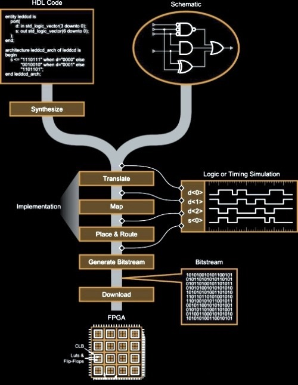<!-- .element: height="550px" -->

</div></div>

----

#### ПЛИС/СБИС (FPGA/ASIC)

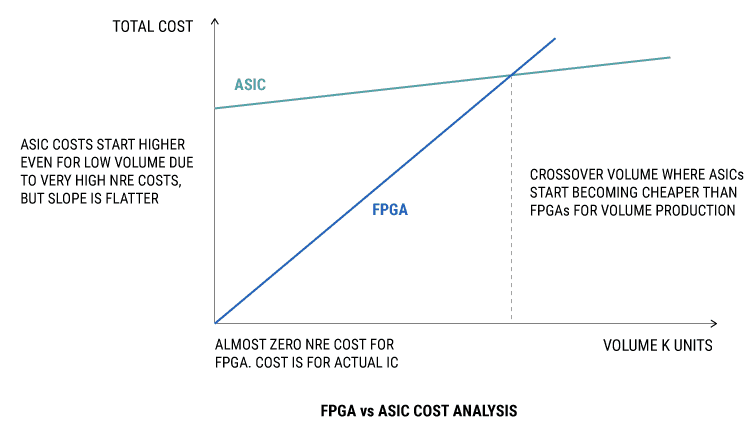

[Источник](https://towardsdatascience.com/introduction-to-fpga-and-its-architecture-20a62c14421c)

----

#### ПЛИС. Внутреннее устройство


----

##### ПЛИС. Lookup tables (LUT)

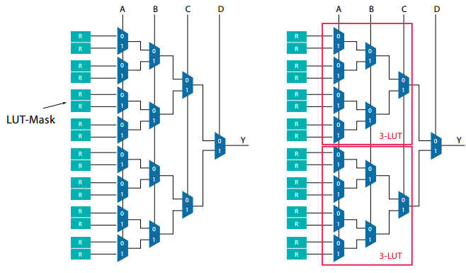

----

*Questions*:

- Можно ли это назвать программированием (ПЛК, ПЛИС)?
- Почему ПЛИС считают аппаратурой и схемотехникой?
- В чём отличие от "классических программ"?

---

## Модель вычислений

<div class="row"><div class="col">

1. Процесс компьютерной системы может быть описан моделью/спецификацией/программой.
2. MoC предоставляет язык для описания моделей процессов.
3. MoC определяет возможности вычислительной машины.
4. MoC характеризует правила исполнения, определяющие поведение моделей и вычислителей (необязательно детерминированное).
5. MoC -- минималистичны относительно реальных вычислителей.

</div><div class="col">

Model of Computation -- MoC

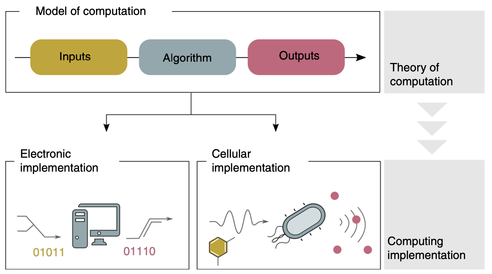

[Источник](https://www.researchgate.net/publication/337394921_Pathways_to_cellular_supremacy_in_biocomputing)

</div></div>

----

### MoC. Последовательные модели <br/> Sequential models

<div class="row"><div class="col">

allows describing a sequential process, which process can be represented as a sequence of state transitions:

- Finite state machines
- Pushdown automata
- Random access machines
- Turing machines
- von Neumann Machine

</div><div class="col">

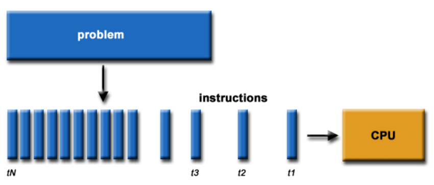

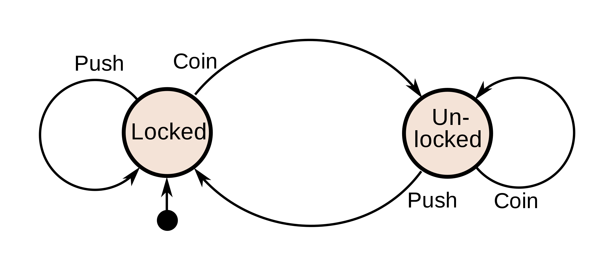

</div></div>

----

### MoC. Функциональные модели <br/> Functional models

<div class="row"><div class="col">

represent a computational process <br/> in symbol form and a set of reduction rules:

- Lambda calculus
- General recursive functions
- Combinatory logic
- Abstract rewriting systems.

[Пример символьного расчёта факториала](https://www.cl.cam.ac.uk/teaching/Lectures/funprog-jrh-1996/all.pdf)

</div><div class="col">

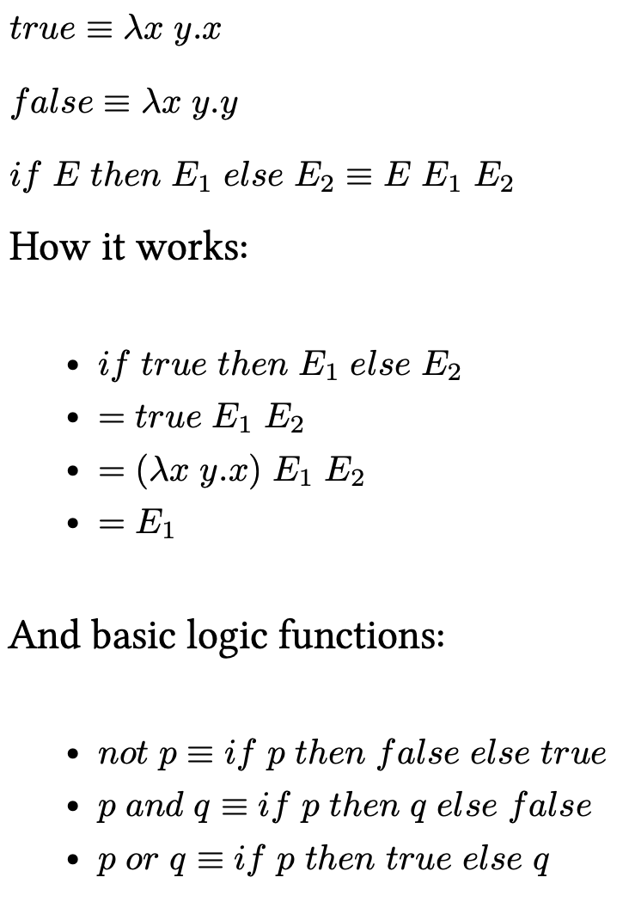<!-- .element: height="550px" -->

</div></div>

----

### MoC. Параллельные модели <br/> Concurrent models

<div class="row"><div class="col">

applied for a system which process includes several interacting processes and these interactions (usually, internal process behavior described on different MoC):

- Cellular automaton
- Kahn process networks
- Petri nets
- Synchronous Data Flow
- Interaction nets
- Actor model.

</div><div class="col">

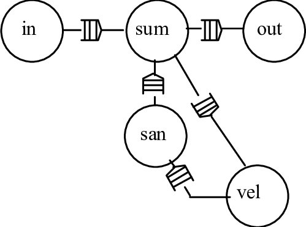<!-- .element: height="230px" -->

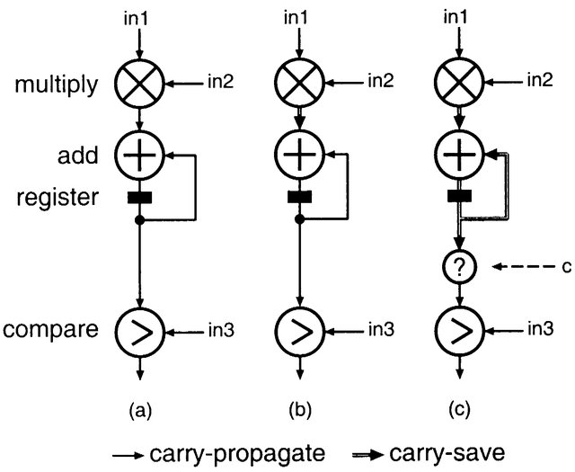<!-- .element: height="260px" -->

</div></div>

----

### MoC. Близкие понятия

Programming paradigms
: are a way to classify programming languages based on their features. Languages can be classified into multiple paradigms.

Programming style, also known as code style
: is a set of rules or guidelines used when writing the source code for a computer program. It is often claimed that following a particular programming style will help programmers read and understand source code conforming to the style and help to avoid errors and wrong assumptions.

**Programming languages**, **Architectural style**, **Computational platform**

----

### MoC. Практика

<div class="row"><div class="col">

1. Computer Science. Формальные модели.
2. Дизайн языков программирования.
3. Управление сложностью.
4. Ограничение творческого порыва.
5. Модель-ориентированная инженерия (xtUML, Capella, Switch-технология и т.п.):
    - для ответственных применений;
    - для переносимости;
    - для экспертизы.

</div><div class="col">

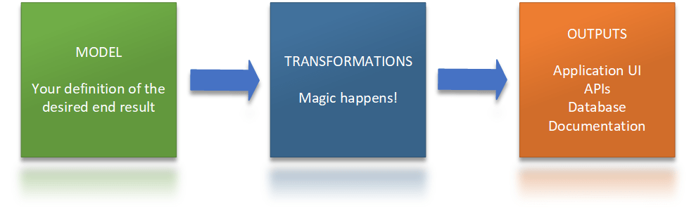

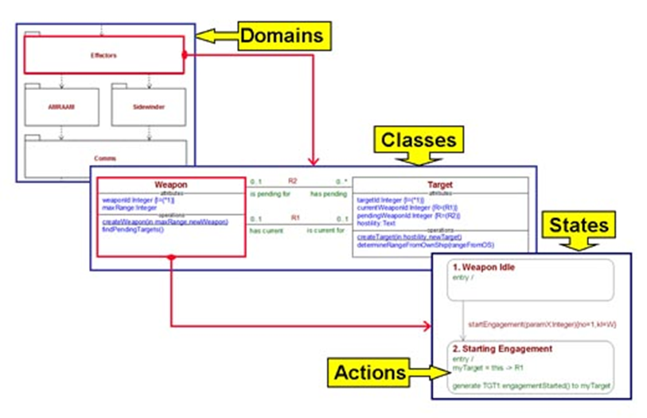

</div></div>

---

## ПО $\leadsto$ Software. АО $\leadsto$ Hardware

Программное обеспечение (ПО)
: совокупность программ, системы обработки информации и программных документов, необходимых для эксплуатации.

Аппаратное обеспечение (АО)
: электронные и механические части вычислительного устройства, входящие в состав системы или сети, исключая программное обеспечение и данные (информацию, которую вычислительная система хранит и обрабатывает). Аппаратное обеспечение включает: компьютеры и логические устройства, внешние устройства и диагностическую аппаратуру, энергетическое оборудование, батареи и аккумуляторы.

Компьютерная программа (v2)
: комбинация компьютерных инструкций и данных, позволяющая аппаратному обеспечению вычислительной системы выполнять вычисления или функции управления.

----

```text
Настал новый год, так что давайте начнем его с чего-то фундаментального, 
разберемся с тем, что беспокоило меня в течение многих лет.

На днях я обедал с подругой, которая не разбирается в компьютерах. 
Она спросила меня: "Что такое Software?"

Казалось бы, это простой вопрос для тех людей, кто зарабатывает на жизнь
созданием и разработкой программного обеспечения, но мне пришлось 
хорошенько подумать, чтобы дать объяснение, которое она смогла бы понять:

Software -- это та часть компьютерной системы, которая приспосабливает 
технику к различным видам использования. Например, на одном и том же 
компьютере, но с разным программным обеспечением, вы можете играть в игру, 
рассчитывать налоги, писать письмо или книгу, или получать ответы на 
вопросы о свиданиях.

Затем я объяснил ей, что, к сожалению, в начале истории развития 
компьютеров этой функции дали название "программное обеспечение (software)", 
в отличие от "аппаратного обеспечения (hardware)". Ее следовало бы назвать 
"гибкое программное обеспечение (flexibleware)".

К сожалению, термин "soft" многие интерпретировали как "легкий (easy)", 
что совершенно неверно. Не заблуждайтесь.
То, что мы называем "hardware", должно было называться "easyware", а то, 
что мы называем "software", можно было бы назвать "difficultware".
```

[Gerald M. Weinberg, What is Software?](http://secretsofconsulting.blogspot.com/2017/12/what-is-software.html?m=1)

----

1. Программная/аппаратная составляющая слабо связаны с SW/HW
    - Почему Minix одна из самых популярных ОС?
2. Программная/аппаратная составляющая -- это во многом о выборе MoC
    - Почему ПЛИС -- это аппаратура?
3. Разделение на SW/HW зависит от способа использования элементной базы.
    - Hardware -- то, что тяжело/долго/дорого поменять;
    - Software -- то, что легко/быстро/дешево поменять.
4. HW совпадает с аппаратной составляющей, если нет альтернатив: питание, антенны, аналоговые сигналы и т.п.

----

### Гибкости на разных стадиях жизни

1. производство;
2. сборка и комплектация:
    - макетные платы;
    - платы расширения:
        - расширение портов ввода/вывода, включая обработку данных;
        - предоставление специализированных вычислителей под конкретные задачи;
        - фиксация алгоритмов на уровне аппаратуры;
3. [ре-]конфигурирование -- настройка функционирования аппаратных средств, режимы работы;
    - джамперы, перемычки, дип-переключатели;
    - конфигурация аппаратных узлов;
    - конфигурирование данными;
4. программирование;
5. настройка/пользовательское программирование.
