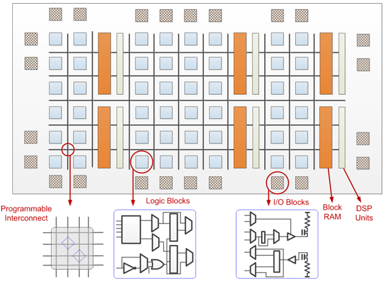

# Архитектура компьютера

## Лекция 7

## Программа. 程序。 ПЛК. ПЛИС.   Hardware и Software 硬件和软件

Пенской А.В., 2022

----

## План лекции

- Программа. Программы аппаратного толка  
  程序。 硬件方案
    - Программируемые логические контроллеры  
      可编程逻辑控制器
    - Программируемые логические интегральные схемы  
      可编程逻辑集成电路
- Модель вычислений (MoC)  
  计算模型（MoC）
- ПО $\leadsto$ Software. АО $\leadsto$ Hardware  
  ПО $\leadsto$ 软件。АО $\leadsto$ 硬件

---

## Программа

Computer program 电脑程序
: is a sequence or set of instructions in a programming language for a computer to execute. Computer programs are one component of software, which also includes documentation and other intangible components.  
是计算机执行的编程语言中的一系列或一组指令。 计算机程序是软件的组成部分，软件还包括文档和其他无形组件。
: --- Wikipedia  
--- 维基百科

- Program is a data (separable, transferable)
- Computer $\neq$ Processor $\neq$ Аппаратура
- 程序是数据（可分离、可转移）
- 计算机 $\neq$ 处理器 $\neq$ 设备

----

### Изменение программы компьютера 更改计算机程序

1. Легко заменяется прямо у пользователя.  
   用户可直接轻松更换。
2. Пользователь как Beta-тестер.  
   作为 Beta 测试人员的用户。
3. Возможно удалённое обновление, в том числе без информированного согласия.  
   可以进行远程更新，包括未经知情同意。
4. Сервис -- вершина владения компьютерной системой.  
   服务是计算机系统所有权的顶峰。
5. Процесс создания программы может быть автоматизирован (CI/CD).  
   创建程序的过程可以自动化（CI/CD）。
    - Воспроизводимость сборки 构建可重复性 ([bazel](https://bazel.build), [nixos](https://nixos.org), [docker](https://www.docker.com)).
    - GitFlow -- зачем так сложно? 为什么这么难？

*Примечание*: речь о применении "патча", а не о его разработке.  
*注意*：这是关于应用“补丁”，而不是开发它。

----

### GitFlow -- зачем так сложно? GitFlow - 为什么这么难？

Notes: Поддержка множества версий и их совместной работы.  
注：支持多个版本及其协作。

---

## Программы аппаратного толка 硬件方案

Некоторые разновидности программируемых компьютеров функционируют как их аппаратные прототипы. Среди них:  
某些类型的可编程计算机充当其硬件对应物。 他们之中：

- Программируемые Логические Контроллеры (ПЛК)
- Программируемые Логические Интегральные Схемы (ПЛИС)

- 可编程逻辑控制器（PLC）
- 可编程逻辑集成电路（FPGA）

----

### Программируемые логические контроллеры 可编程逻辑控制器

Автоматизация при помощи релейных схем:  
使用继电器电路的自动化：

- плохо масштабируется,
- сложная настройка и поддержка,
- надёжность сложных схем,
- проблема соответствия документации и факта.
- 扩展性不好
- 复杂的设置和支持，
- 复杂电路的可靠性，
- 文件与事实之间的对应问题。

<!-- .element: height="200px" -->

ПЛК 可编程逻辑控制器
: специальная разновидность электронной вычислительной машины.  
一种特殊类型的电子计算机。

Особенности: 特点：

- являются законченными и самостоятельными устройствами;
- работа в реальном времени;
- эксплуатация в тяжёлых условиях;
- ориентированы на работу с машинами и механизмами.
- 是完整且独立的设备；
- 实时工作；
- 在困难条件下运行；
- 专注于使用机器和机制。

----

#### Типовое устройство ПЛК

Также существуют и полностью программные реализации.  
也有完全的软件实现。

----

#### Программирование ПЛК

IEC 61131 
: standard for programmable controllers  
可编程控制器标准

Определяет языки для специалистов АСУТП: 为过程控制系统专家定义语言：

- Ladder Diagram (Релейно-контактные схемы)
- Function Block Diagram (Функциональные блоковые диаграммы)
- Sequential Function Chart (Последовательностные функциональные диаграммы)
- Structured Text (Структурированный текст)  
- 梯形图
- 功能框图
- 顺序功能图
- 结构化文本

IEC 61499 -- Standard for distributed Automation. Рассмотрим ближе к концу курса в контексте распределённых платформ.  
IEC 61499——分布式自动化标准。 让我们在分布式平台的背景下进一步了解本课程的结尾。

----

### Программируемые логические интегральные схемы 可编程逻辑集成电路

ПЛИС 可编程逻辑集成电路
: интегральная микросхема, используемая для создания конфигурируемых цифровых электронных схем. 用于创建可配置数字电子电路的集成电路。

- Логика работы задаётся посредством программирования, а не при производстве.  
  操作逻辑是通过编程设置的，而不是在生产过程中设置的。
- Для формирования конфигурации используется специальное ПО и HDL: Verilog, VHDL...  
  为了创建配置，使用特殊软件和 HDL：Verilog、VHDL...
- "[Ре]конфигурируется", а не "программируется".  
  “[重新]配置”而不是“编程”。

<!-- .element: height="550px" -->

----

#### ПЛИС/СБИС (FPGA/ASIC) 可编程逻辑集成电路/专用集成电路

[Источник](https://towardsdatascience.com/introduction-to-fpga-and-its-architecture-20a62c14421c)

----

#### ПЛИС. Внутреннее устройство 可编程逻辑集成电路 内部组织

----

##### ПЛИС. Lookup tables (LUT) 可编程逻辑集成电路 查找表 (LUT)

----

*Questions*: *问题*：

- Можно ли это назвать программированием (ПЛК, ПЛИС)?
- Почему ПЛИС считают аппаратурой и схемотехникой?
- В чём отличие от "классических программ"?  
- 这也能叫编程（PLC、FPGA）吗？
- 为什么 FPGA 被视为硬件和电路？
- 与“经典节目”有什么区别？

---

## Модель вычислений 计算模型

1. Процесс компьютерной системы может быть описан моделью/спецификацией/программой.
2. MoC предоставляет язык для описания моделей процессов.
3. MoC определяет возможности вычислительной машины.
4. MoC характеризует правила исполнения, определяющие поведение моделей и вычислителей (необязательно детерминированное).
5. MoC -- минималистичны относительно реальных вычислителей.  
1. 计算机系统的过程可以用模型/规范/程序来描述。
2. MoC提供了一种描述过程模型的语言。
3. MoC定义了计算机器的能力。
4. MoC描述了决定模型和计算机行为的执行规则（不一定是确定性的）。
5. MoC 相对于真实计算机来说是简约的。

Model of Computation -- MoC

[Источник](https://www.researchgate.net/publication/337394921_Pathways_to_cellular_supremacy_in_biocomputing)

----

### MoC. Последовательные модели   Sequential models 顺序模型

allows describing a sequential process, which process can be represented as a sequence of state transitions:  
允许描述一个顺序过程，该过程可以表示为一系列状态转换：

- Finite state machines
- Pushdown automata
- Random access machines
- Turing machines
- von Neumann Machine
- 有限状态机
- 下推自动机
- 随机存取机
- 图灵机
- 冯·诺依曼机

----

### MoC. Функциональные модели   Functional models 函数模型

represent a computational process 表示一个计算过程   in symbol form and a set of reduction rules: 以符号形式和一组归约规则：

- Lambda calculus
- General recursive functions
- Combinatory logic
- Abstract rewriting systems.
- 拉姆达演算
- 一般递归函数
- 组合逻辑
- 摘要重写系统。

[Пример символьного расчёта факториала](https://www.cl.cam.ac.uk/teaching/Lectures/funprog-jrh-1996/all.pdf)

<!-- .element: height="550px" -->

----

### MoC. Параллельные модели   Concurrent models 并发模型

applied for a system which process includes several interacting processes and these interactions (usually, internal process behavior described on different MoC):  
应用于一个系统，该系统的进程包括多个交互进程以及这些交互（通常是不同MoC上描述的内部进程行为）：

- Cellular automaton
- Kahn process networks
- Petri nets
- Synchronous Data Flow
- Interaction nets
- Actor model.
- 元胞自动机
- 卡恩过程网络
- 陪替氏网
- 同步数据流
- 互动网
- 演员模型。

<!-- .element: height="230px" -->

<!-- .element: height="260px" -->

----

### MoC. Близкие понятия 相关概念

Programming paradigms 编程范式
: are a way to classify programming languages based on their features. Languages can be classified into multiple paradigms.  
是一种根据编程语言的特性对编程语言进行分类的方法。 语言可以分为多种范式。

Programming style, also known as code style 编程风格，也称为代码风格
: is a set of rules or guidelines used when writing the source code for a computer program. It is often claimed that following a particular programming style will help programmers read and understand source code conforming to the style and help to avoid errors and wrong assumptions.  
是编写计算机程序源代码时使用的一组规则或指南。 人们经常声称，遵循特定的编程风格将有助于程序员阅读和理解符合该风格的源代码，并有助于避免错误和错误的假设。

**Programming languages**, **Architectural style**, **Computational platform**  
**编程语言**、**架构风格**、**计算平台**

----

### MoC. Практика 实践

1. Computer Science. Формальные модели.  
   计算机科学。 正式模型。
2. Дизайн языков программирования.  
   编程语言的设计。
3. Управление сложностью.  
   管理复杂性。
4. Ограничение творческого порыва.  
   创作冲动的限制。
5. Модель-ориентированная инженерия (xtUML, Capella, Switch-технология и т.п.):  
   基于模型的工程（xtUML、Capella、Switch技术等）：
    - для ответственных применений;  
      对于关键应用；
    - для переносимости;  
      便于携带；
    - для экспертизы.
      用于检查。

---

## ПО $\leadsto$ Software. АО $\leadsto$ Hardware

Программное обеспечение (ПО) 软件
: совокупность программ, системы обработки информации и программных документов, необходимых для эксплуатации.  
运行所必需的一套程序、信息处理系统和程序文件。

Аппаратное обеспечение (АО) 硬件
: электронные и механические части вычислительного устройства, входящие в состав системы или сети, исключая программное обеспечение и данные (информацию, которую вычислительная система хранит и обрабатывает). Аппаратное обеспечение включает: компьютеры и логические устройства, внешние устройства и диагностическую аппаратуру, энергетическое оборудование, батареи и аккумуляторы.  
系统或网络中包含的计算设备的电子和机械部分，不包括软件和数据（计算系统存储和处理的信息）。 硬件包括：计算机和逻辑器件、外部设备和诊断设备、电源设备、电池和蓄电池。

Компьютерная программа (v2) 计算机程序
: комбинация компьютерных инструкций и данных, позволяющая аппаратному обеспечению вычислительной системы выполнять вычисления или функции управления.  
计算机指令和数据的组合，允许计算系统的硬件执行计算或控制功能。

----

> Настал новый год, так что давайте начнем его с чего-то фундаментального, разберемся с тем, что беспокоило меня в течение многих лет.  
> 这是新的一年，所以让我们从一些基本的事情开始，一些多年来一直困扰我的事情。
>
> На днях я обедал с подругой, которая не разбирается в компьютерах.  
>有一天，我和一位不懂电脑的朋友共进午餐。
> Она спросила меня: "Что такое Software?"  
> 她问我：“什么是软件？”
>
> Казалось бы, это простой вопрос для тех людей, кто зарабатывает на жизнь созданием и разработкой программного обеспечения, но мне пришлось хорошенько подумать, чтобы дать объяснение, которое она смогла бы понять:  
对于以编写和开发软件为生的人来说，这似乎是一个简单的问题，但我必须努力思考才能想出一个她能理解的解释：
> 
> Software -- это та часть компьютерной системы, которая приспосабливает технику к различным видам использования. Например, на одном и том же  компьютере, но с разным программным обеспечением, вы можете играть в игру,  рассчитывать налоги, писать письмо или книгу, или получать ответы на  вопросы о свиданиях.  
> 软件是计算机系统的一部分，可以适应各种用途的技术。 例如，在同一台计算机上但使用不同的软件，您可以玩游戏、计算税款、写信或写书，或者获取约会问题的答案。
> 
> Затем я объяснил ей, что, к сожалению, в начале истории развития компьютеров этой функции дали название "программное обеспечение (software)", в отличие от "аппаратного обеспечения (hardware)". Ее следовало бы назвать "гибкое программное обеспечение (flexibleware)".  
> 然后我向她解释说，不幸的是，在计算机历史的早期，这种功能被称为“软件”，而不是“硬件”。 它应该被称为“灵活软件”。
> 
> К сожалению, термин "soft" многие интерпретировали как "легкий (easy)", что совершенно неверно. Не заблуждайтесь.То, что мы называем "hardware", должно было называться "easyware", а то, что мы называем "software", можно было бы назвать "difficultware".  
> 不幸的是，许多人将“软”一词理解为“容易”，这是完全错误的。 毫无疑问，我们所说的“硬件”应该被称为“简单软件”，而我们所说的“软件”本来应该被称为“困难软件”。

[Gerald M. Weinberg, What is Software?](http://secretsofconsulting.blogspot.com/2017/12/what-is-software.html?m=1)

----

1. Программная/аппаратная составляющая слабо связаны с SW/HW 软件/硬件组件与软件/硬件松散耦合
    - Почему Minix одна из самых популярных ОС?  
      为什么 Minix 是最流行的操作系统之一？
2. Программная/аппаратная составляющая -- это во многом о выборе MoC  
   软件/硬件组件——这很大程度上与MoC的选择有关
    - Почему ПЛИС -- это аппаратура?  
      为什么FPGA是硬件？
3. Разделение на SW/HW зависит от способа использования элементной базы.  
   软件/硬件的划分取决于元件库的使用方法
    - Hardware -- то, что тяжело/долго/дорого поменять;  
      硬件 - 改变起来困难/耗时/昂贵的东西；
    - Software -- то, что легко/быстро/дешево поменять.  
      软件 - 易于/快速/廉价更改的东西。
4. HW совпадает с аппаратной составляющей, если нет альтернатив: питание, антенны, аналоговые сигналы и т.п.  
   硬件与硬件组件一致，如果没有其他选择：电源、天线、模拟信号等。

----

### Гибкости на разных стадиях жизни 生命不同阶段的灵活性

1. производство; 生产；
2. сборка и комплектация: 组装及包装
    - макетные платы; 面包板
    - платы расширения: 扩展板
        - расширение портов ввода/вывода, включая обработку данных;  
          输入/输出端口的扩展，包括数据处理；
        - предоставление специализированных вычислителей под конкретные задачи;  
          为特定任务提供专用计算机；
        - фиксация алгоритмов на уровне аппаратуры;  
          硬件层面的算法固定；
3. [ре-]конфигурирование -- настройка функционирования аппаратных средств, режимы работы; [重新]配置——设置硬件功能、操作模式；
    - джамперы, перемычки, дип-переключатели;  
      跳线、跳线、拨码开关；
    - конфигурация аппаратных узлов; 硬件组件的配置；
    - конфигурирование данными;  
      数据配置；
4. программирование; 编程；
5. настройка/пользовательское программирование. 定制/自定义编程。
