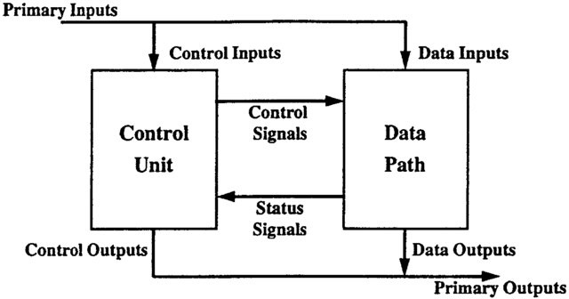

# Архитектура компьютера

## Лекция 8

### Информационный процессор. 信息处理器 <br/> Ключевые термины. 关键术语 <br/> Архитектуры процессоров. 处理器架构 <br/> Процессор фон Неймана 冯诺依曼处理器

Пенской А.В., 2022

----

### План лекции

- Информационный процессор. Универсальный процессор. Виды процессоров
- Архитектуры универсальных процессоров
- Машина Тьюринга
- Редукционные компьютеры (Reduction Machines)
- Потоковые машины (Dataflow Machines)
- Машина фон Неймана  

---

- 信息处理器。 通用处理器。 处理器类型
- 通用处理器架构
- 图灵机
- 减速机
- 数据流机器
- 冯诺依曼机

---

## Информационный процессор 信息处理器

<div class="row"><div class="col">

Информационный процессор 信息处理器
: система (электрическая, механическая или биологическая), которая принимает информацию (последовательность символов или состояний) в одной форме и обрабатывает (преобразует) ее в другую форму.  
一种系统（电气、机械或生物），以一种形式获取信息（一系列符号或状态）并将其处理（转换）为另一种形式。

Например: исходный сигнал в статистику, посредством алгоритмического процесса.  
例如：通过算法过程将原始信号转化为统计数据。

</div><div class="col">


Система обработки информации состоит из четырех основных частей или подсистем:  
信息处理系统由四个主要部分或子系统组成：

1. ввод
2. процессор
3. хранилище
4. вывод
---
1. 输入
2. 处理器
3. 储存
4. 结论

</div></div>

----

### Универсальный процессор (CPU)

HW позволяет решать широкий круг задач, настройка которых производится после производства "по месту" или в run-time.  
硬件允许您解决各种问题，其配置是在生产后“现场”或在运行时进行的。

Примечания: 笔记：

- Универсальность противоречит эффективности (производительность, энергопотребление).
- Универсальность -- теоретическое свойство.
- Современная аппаратура содержит много ПО.
- Процессор не обязан быть аппаратным.  
- 多功能性与效率（性能、能耗）相矛盾。
- 普遍性是一种理论属性。
- 现代设备包含大量软件。
- 处理器不一定是硬件。

----

### Свойства универсального (программируемого) процессора  
通用（可编程）处理器的属性

1. отделение "программирования" от этапа "производства"
2. полнота по Тьюрингу
3. отсутствие "серьезных" ограничений на "объём" программы
4. возможность изменения ПО  
---
5. “编程”与“制作”阶段分离
6. 图灵完备性
7. 节目“量”缺乏“严格”限制
8. 更改软件的可能性

---

### Виды процессоров


- Application-Specific Integrated Circuit (ASIC) **(не универсальный)**  
  专用集成电路 (ASIC) **（非通用）**
- Field-Programmable Gate Array (FPGA, ПЛИС)  
  现场可编程门阵列（FPGA、FPGA）
- Coarse-Grained Reconfigurable Arrays (CGRA)  
  粗粒度可重构阵列（CGRA）
- Digital Signal Processor (DSP)  
  数字信号处理器（DSP）
- Graphics Processing Unit (GPU)  
  图形处理单元（GPU）
- Central Processing Unit (CPU) **(основной акцент)**  
  中央处理器 (CPU) **（主要焦点）**

----

#### Field-Programmable Gate Array (FPGA) 现场可编程门阵列 (FPGA)


----

#### Coarse-Grained Reconfigurable Arrays (CGRA) 粗粒度可重构阵列 (CGRA)


----

#### Digital Signal Processor (DSP) 数字信号处理器 (DSP)


----

#### Central Processing Unit (CPU) 中央处理器 (CPU) <br/> Graphics Processing Unit (GPU) 图形处理器 (GPU)


---

## Ключевые термины 关键术语

- [Микро]процессор
- [Микро]контроллер
- Оперативная память
- Встраиваемая/встроенная система (embedded system)
- Система на Кристалле (СнК, System-on-a-Chip, SoC)
- Архитектура процессора (architecture)
- Машинное слово
- Микроархитектура процессора (microarchitecture)
- Система команд процессора
- [微处理器]
- [微]控制器
- 内存
- 嵌入式系统
- 晶体系统（SoC、片上系统、SoC）
- 处理器架构（架构）
- 机器字
- 处理器微架构（microarchitecture）
- 处理器命令系统

----

<div class="row"><div class="col">

[Микро]процессор 微处理器
: цифровая схема, которая выполняет операции с некоторым внешним источником данных, обычно памятью или другим потоком данных.  
对某些外部数据源（通常是内存或其他数据流）执行操作的数字电路。

[Микро]контроллер 微控制器
: микросхема, предназначенная для управления электронными устройствами.  
设计用于控制电子设备的芯片。
: Типичный микроконтроллер сочетает функции процессора и периферийных устройств, содержит ОЗУ и (или) ПЗУ.  
典型的微控制器结合了处理器和外围设备的功能，并包含 RAM 和/或 ROM。

</div><div class="col">

<!--  -->


Оперативная память (память) 内存(RAM)
: обычно часть компьютерной памяти, в которой хранится выполняемый машинный код, а также входные, выходные и промежуточные данные.  
通常是计算机内存的一部分，用于存储可执行机器代码以及输入、输出和中间数据。

</div></div>

----

<div class="row"><div class="col">

Встраиваемая/встроенная система (embedded system) 嵌入式系统
: специализированная микропроцессорная система управления, контроля и мониторинга, концепция разработки которой заключается в том, что такая система будет работать, будучи встроенной непосредственно в устройство, которым она управляет.  
：一种专门的微处理器控制、控制和监测系统，其设计理念是这样的系统将在直接内置于其控制的设备中的同时运行。

</div><div class="col">


Система на Кристалле (СнК, System-on-a-Chip, SoC)  
片上系统（SoC、片上系统、SoC）
: электронная схема, выполняющая функции целого устройства (например, компьютера) и размещённая на одной интегральной схеме.  
执行整个设备（例如计算机）功能并放置在单个集成电路上的电子电路。

</div></div>

----

Архитектура процессора (architecture) 处理器架构（架构）
: это то, как видит компьютер программист. Она определена набором команд (языком) и местом нахождения операндов (регистры и память).  
这就是程序员看待计算机的方式。 它由指令集（语言）和操作数的位置（寄存器和内存）定义。

- Существует множество разных архитектур: x86, MIPS, SPARC.  
- 有许多不同的架构：x86、MIPS、SPARC。

- Чтобы понять архитектуру, нужно выучить его язык.  
- 要理解架构，您需要学习它的语言。

- Слова в языке компьютера называются "инструкциями" или "командами", а словарный запас -- "системой команд".  
- 计算机语言中的单词被称为“指令”或“命令”，词汇被称为“命令系统”。

Машинное слово 机器字
: фрагмент данных фиксированного размера, обрабатываемый как единое целое с помощью набора команд или аппаратного обеспечения процессора  
由指令集或处理器硬件作为单个单元处理的固定大小的数据块

----

Микроархитектура процессора (microarchitecture) 处理器微架构
: соединение простейших цифровых элементов в логические блоки, предназначенные для выполнения команд, определенных архитектурой.  
将最简单的数字元素连接到旨在执行架构定义的命令的逻辑块中。

- Описывает, как в процессоре расположены и соединены друг с другом регистры, АЛУ, конечные автоматы, блоки памяти и т.д.  
  描述寄存器、ALU、状态机、内存块等在处理器中如何定位和相互连接。

- У каждой архитектуры может быть много микроархитектур, обеспечивающих разное соотношение производительности, цены и сложности. Они смогут выполнять одни и те же программы.  
  每个架构可以有许多微架构，提供性能、价格和复杂性的不同平衡。 他们将能够运行相同的程序。

----

Система команд процессора 处理器指令系统
: (Instruction Set Architecture -- ISA) абстрактная модель процессора, формирующая интерфейс взаимодействия между программным обеспечением и процессором, затрагивающая:  
（指令集架构 - ISA）一种抽象处理器模型，形成软件和处理器之间的接口，影响：

<div class="row"><div class="col">

1. типы данных; 数据类型；
2. систему регистров; 注册系统；
3. методы адресации; 寻址方法；
4. модели памяти; 内存模型；
5. инструкции; 使用说明；
6. обработку прерываний и исключений; 处理中断和异常；
7. методы ввода и вывода. 输入输出方式。

</div><div class="col">

<!-- .element height="275px" -->

</div></div>

Производительность, энергопотребление и задержки обычно не рассматриваются. 通常不考虑性能、功耗和延迟。

- [Meltdown and Spectre](https://meltdownattack.com)
- [Edward A. Lee Modeling in Engineering and Science](https://cacm.acm.org/magazines/2019/1/233519-modeling-in-engineering-and-science/fulltext)

Notes: ECE C61 Computer Architecture Lecture 3 – Instruction Set  
笔记：ECE C61 计算机体系结构讲座 3 – 指令集

---

### Форматы команд разных архитектур

1. MIPS32
2. Very Long Instruction Word (VLIW) 超长指令字
3. Stack Processor 堆栈处理器
4. Transport Triggered Architecture (TTA) Processor 传输触发架构（TTA）处理器
5. URISC

----

#### MIPS32 процессор


- Первые 6 бит определяют операцию (немедленное добавление).  
  前 6 位定义操作（立即加法）。
- Вторая и третья группы по 5 битов определяют номер одного из 32 регистров общего назначения MIPS32.  
  第二组和第三组 5 位定义 32 个 MIPS32 通用寄存器之一的编号。
- Последние 16 бит определяют непосредственное значение.  
  最后 16 位确定立即值。
- Значение добавляется ко второму регистру, а затем сохраняется в первом регистре.  
  该值被添加到第二个寄存器，然后存储到第一个寄存器。 
- Если происходит арифметическое переполнение, `$r1` не изменяется и устанавливается флаг переполнения.  
  如果发生算术溢出，则“$r1”保持不变并设置溢出标志。

----

#### Very Long Instruction Word (VLIW)


- Много инструкций за один такт.  
  每个时钟周期有许多指令。
- Длительность инструкции зависит от её типа.  
  指令的持续时间取决于其类型。
- Только компилятор может создавать эффективный код.  
  只有编译器才能产生高效的代码。

----

#### Stack Processor 堆栈处理器

<div class="row"><div class="col">

- Данные хранятся и обрабатываются на стеке.  
  数据在堆栈上存储和处理。
- Указание операндов не требуется (только сама операция).  
  不需要指定操作数（只需操作本身）。

</div><div class="col">


</div></div>

----

#### Transport Triggered Architecture (TTA) Processor 传输触发架构 (TTA) 处理器

<!-- .element height="400px" -->

- Инструкции для изменения данных отсутствуют.  
  没有更改数据的说明。
- Перемещение данных между "корзинами для обработки".  
  在“处理箱”之间移动数据。
- Долгая обработка + быстрая пересылка $\rightarrow$ параллелизм.  
  长处理+快进 $\rightarrow$ 并行性。
- Является примером CGRA процессора.  
  是 CGRA 处理器的示例。

----

### Ultimate Reduced Instruction Set Computer (URISC) 终极精简指令集计算机 (URISC)

- Доступна лишь одна инструкция, но есть полнота по Тьюрингу.  
  只有一条指令可用，但它是图灵完备的。
- Архитектуру можно рассматривать как предельный случай RISC.  
  该架构可以被认为是 RISC 的一个极端例子。
- Такой подход интересен скорее с теоретической точки зрения.  
  从理论角度来看，这种方法很有趣。

Варианты единственной инструкции:  
单指令选项：

- **RSSB** -- вычесть и пропустить следующую инструкцию, если вычитаемое было больше уменьшаемого.  
  如果减数大于被减数，则减去并跳过下一条指令。
- **MOV** -- переслать из первой ячейки во вторую (TTA).  
  从第一个单元发送到第二个单元 (TTA)。
- **BBJ** -- копировать один бит из первого по второму адресу памяти и передать управление на третий адрес. Последовательность инструкций может изменить значение в ячейке, на которую перейдёт управление, значит, можно выполнять вычисления, доступные обычному компьютеру.  
  从第一个内存地址复制一位到第二个内存地址，并将控制权转移到第三个地址。 指令序列可以更改控制权转移到的单元格中的值，这意味着可以执行常规计算机可以访问的计算。
- есть и другие.

----

### URISC. Пример

```rssb
; 0 - pc
; 1 - acc
; 2 - zero
; 3 - in
; 4 - out
; at start pc = 5

rssb acc      ; 5: acc = acc - acc = 0
rssb C        ; 6: C = acc = C - acc = 67 - 0 = 67
rssb out      ; 7: out = acc

rssb acc      ; 8: acc = acc - acc = 0
rssb S        ; 9: S = acc = S - acc = 83 - 0 = 83
rssb out      ; 10: out = acc

rssb acc      ; 11: acc = acc - acc = 0
rssb A        ; 12: A = acc = A - acc = 65 - 0 = 65
rssb out      ; 13: out = acc

rssb acc      ; 14: acc = acc - acc = 0
rssb one      ; 15: one = acc = one - acc = 1
rssb ip       ; 16: ip = acc = ip - 1 = 17 - 1 = 16, infinite loop

C rssb 67
S rssb 83
A rssb 65
one rssb 1
```

Программа Hello World: [src/helloworld.rssb](https://gitlab.se.ifmo.ru/computer-systems/csa-rolling/-/blob/master/src/helloworld.rssb)

---

## Архитектуры универсальных процессоров 通用处理器架构

<div class="row"><div class="col">

1. Машина Тьюринга 图灵机
2. Редукционные компьютеры (Reduction Machines) 减速机
3. Потоковые машины (Dataflow Machines) 数据流机器
4. Машина фон Неймана 冯诺依曼机
5. High-Level Language Computer Architecture. Stack computers 高级语言计算机体系结构。 堆栈计算机
6. В стиле фон Неймана $\Longrightarrow$ 冯·诺依曼的风格 $\Longrightarrow$
7. и так далее...

</div><div class="col">

### В стиле фон Неймана 冯·诺依曼风格

1. Гарвардская архитектура 哈佛建筑
2. CISC и микрокод CISC 和微码
3. RISC и конвейер RISC和流水线
4. Суперскалярные и VLIW 超标量和 VLIW
5. Иерархия памяти. Кеширование 内存的层次结构。 缓存
6. Вводы-вывод. Прерывания 输入-输出。 中断
7. Параллелизм уровня команд. [S/M]I[S/M]D. SIMT. Изоляция 命令级并行性。 [S/M]I[S/M]D。 SIMT。 绝缘

</div></div>

Can Programming be Liberated from the von Neumann Style? <br/> Backus, John. 1977 Turing Award Lecture  
编程能否从冯诺依曼风格中解放出来？ <br/>巴克斯，约翰。 1977年图灵奖演讲

---

## Машина Тьюринга 图灵机

<div class="row"><div class="col">

Машина Тьюринга включает:  
图灵机包括：

- неограниченную двустороннюю ленту, разделенную на ячейки  
  无限双面胶带，分成单元
- устройство управления (головка записи-чтения), которое может находиться в конечном числе состояний.  
  控制设备（读写头），可以处于有限数量的状态。

Управляющее устройство может:  
控制装置可以：

- перемещаться по ленте влево и вправо,  
  沿着磁带左右移动，
- читать и записывать в ячейки символы конечного алфавита.  
  将有限字母表的字符读写到单元格中。

</div><div class="col">


</div></div>

----

1. не может быть реализована на практике  
   实际中无法实施
2. обладает полнотой по Тьюрингу  
   图灵完备
3. проблема остановки  
   停止问题
4. данные и управление отделены  
   数据与控制分离

---

## Редукционные компьютеры 还原计算机

<div class="row"><div class="col">

Graph Reduction machine 图形缩减机


[An Architecture for Combinator Graph Reduction (TIGRE)](https://users.ece.cmu.edu/~koopman/tigre/index.html)

</div><div class="col">


</div></div>

- В основе лямбда-исчисление и комбинаторная логика.  
  基于 lambda 演算和组合逻辑。
- Ленивая стратегия вычислений: анализ графа (программы), поиск необходимого результата, вынужденное разворачивание стека.  
  惰性计算策略：分析图（程序），搜索所需结果，强制展开堆栈。
- Естественный параллелизм.  
  自然的并行性。

Notes: В аппаратуре встречается редко. Часто встречается в мире функционального программирования.  
注： 在硬件中很少见。 经常出现在函数式编程的世界中。

---

## Потоковые машины (Dataflow Machines)

<div class="row"><div class="col">

Dataflow architectures 数据流架构
: the executability and execution of instructions is solely determined based on the availability of input arguments to the instructions. The order of instruction execution is unpredictable.  
指令的可执行性和执行完全取决于指令输入参数的可用性。 指令执行的顺序是不可预测的。

- Отсутствует память как "бутылочное горлышко".  
  没有内存这样的瓶颈。
- Обычно CGRA архитектура.  
  典型的 CGRA 架构。
- Вспоминаем расчёт артиллерийских таблиц.  
  让我们记住计算
- Пример:  TTA

</div><div class="col">


Приходите в [NITTA](https://ryukzak.github.io/projects/nitta/) -- Dataflow со стат. планированием.  
来到 [NITTA](https://ryukzak.github.io/projects/nitta/) -- 带统计数据的数据流。 规划。

</div></div>

---

## Машина фон Неймана

<div class="row"><div class="col">

- Логическое развитие машины Тьюринга.  
  图灵机的逻辑发展。
- Ключевые отличия: 主要区别：
    - лента заменена на Random-Access Memory (RAM);  
      磁带被随机存取存储器（RAM）取代；
    - инструкции и данные объединены.  
      指令和数据相结合。
- Призвана быть максимально простой в реализации и производстве.  
  计得在实施和生产中尽可能简单

</div><div class="col">


</div></div>

----

### Особенности машины фон Неймана 冯诺依曼机的特点

1. Использование двоичного кодирования. 采用二进制编码。
    - Встречается троичное и двоично-десятичное кодирование.  
      有三进制和二进制十进制编码。
2. Программное управление. Команды выполняются последовательно, одна за другой.  
   软件控制。 命令按顺序执行，一个接一个。
    - Последовательность сегодня условна.  
      今天的顺序是有条件的。
3. Память компьютера используется для однородного хранения данных и программ.  
   计算机存储器用于统一存储数据和程序。
    - Однородность сегодня спорна.  
      如今，一致性是有争议的。 
4. Ячейки памяти компьютера имеют адреса. Random-Access Memory.  
   计算机存储单元有地址。 随机存取存储器。
    - Адрес не сводится к целому числу сегодня.  
      今天地址没有减少为整数。
    - Память не является пассивным элементом сегодня.  
      如今，记忆不再是被动的元素。
5. Возможность условного перехода.  
   有条件过渡的可能性。
    - И сегодня им не ограничивается.  
      今天它不仅限于他们。 

----

### Виды инструкций процессора фон Неймана 冯诺依曼处理器指令的类型

1. Работа с памятью
    - Запись констант в регистры.
    - Копирование данных между памятью и регистрами.
2. Арифметические и логические операции
    - Арифметика.
    - Битовые операции.
    - Сравнения.
    - Операции с плавающей точкой.
3. Управляющие операции
    - Безусловный и условный переходы.
    - Косвенный переход.
    - Вызов и возврат из подпрограмм.
4. Инструкции для сопроцессоров
    - Загрузка данных и получение результатов.
    - Управление операциями сопроцессора.
---
1. 运用记忆
     - 将常量写入寄存器。
     - 在内存和寄存器之间复制数据。
2. 算术和逻辑运算
     - 算术。
     - 位运算。
     - 比较。
     - 浮点运算。
3. 控制操作
     - 无条件和条件跳转。
     - 间接转让。
     - 调用子程序并从子程序返回。
4. 协处理器指令
     - 加载数据并获取结果。
     - 协处理器操作的控制。

----

### Пример программы

Программа -- последовательность инструкций в памяти.  
程序是内存中的一系列指令。

```text
| Address | Mnemonic       | Comment                                   |
| ------- | -------------- | ----------------------------------------- |
| 0400    | MOV CX, [0500] | CX <- [0500]                              |
| 0404    | MOV AX, 0001   | AX <- 0001                                |
| 0407    | MOV DX, 0000   | DX <- 0000                                |
| 040A    | MUL CX         | DX:AX <- AX * CX                          |
| 040C    | LOOP 040A      | Go To [040A]                              |
|         |                |   till CX->00 (CX <- CX - 1 on each step) |
| 0410    | MOV [0600], AX | [0600]<-AX                                |
| 0414    | MOV [0601], DX | [0601]<-DX                                |
| 0418    | HLT            | Stop Execution                            |
```

Факториал.

----

#### Пример процесса

Процесс -- очерёдность смены состояний процессора по мере выполнения команд.  
进程是命令执行时处理器状态发生变化的顺序。

Входные данные по адресу `0500` равны 3, выходные данные будут сохранены по адресам `[0600, 0601]`):  
地址`0500`处的输入数据为3，输出数据将存储在地址`[0600, 0601]`处）：

```text
1. {AX: -, CX: -, DX: -} Выполняется 0400 | MOV CX, [0500]
2. {AX: -, CX: 3, DX: -} Выполняется 0404 | MOV AX, 0001
3. {AX: 1, CX: 3, DX: -} Выполняется 0407 | MOV DX, 0000
    3.1. {AX: 1, CX: 3, DX: 0} Выполняется 040A | MUL CX
    3.2. {AX: 3, CX: 3, DX: 0} Выполняется 040C | LOOP 040A
                               CX не равно 0, переходим 040A.
    3.3. {AX: 3, CX: 2, DX: 0} Выполняется 040A | MUL CX
    3.4. {AX: 6, CX: 2, DX: 0} Выполняется 040C | LOOP 040A,
                               CX не равно 0, переходим 040A
    3.5. {AX: 6, CX: 1, DX: 0} Выполняется 040A | MUL CX
    3.6. {AX: 6, CX: 1, DX: 0} Выполняется 040C | LOOP 040A,
                               после декремента CX равно 0,
                               выполняем следующую инструкцию.
4. {AX: 6, CX: 0, DX: 0} Выполняется 0410 | MOV [0600], AX
5. {AX: 6, CX: 0, DX: 0} Выполняется 0414 | MOV [0601], DX
6. Выполняется 0418 | HTL, Остановить выполнение
```

----

### Процессор фон Неймана на практике 冯诺依曼处理器的实践

- В чистом виде практически не встречается.
- Влияние на индустрию трудно переоценить.
- Элементы архитектуры присутствуют в подавляющем большинстве процессоров и средств разработки.
- Ловушка обратной совместимости.
- Структурное (процедурное) программирование, <br/> ООП -- наследие фон Неймана.
---
- 几乎从未发现过它的纯净形式。
- 对行业的影响很难高估。
- 架构元素存在于绝大多数处理器和开发工具中。
- 向后兼容性陷阱。
- 结构（过程）编程，<br/> OOP - 冯·诺依曼的遗产。

<!--
Попытка сделать эскиз современного процессора:

-->

----

### Проблемы проектирования ISA для процессора фон Неймана 冯诺依曼处理器的 ISA 设计问题

1. Типы данных и их размеры (бит, кодирование, тегирование).
2. Набор команд и их взаимозаменяемость.
3. Количество операндов (1, 2 и более).
4. Расположение операндов и результата. Адресация.
---
1. 数据类型及其大小（位、编码、标记）。
2. 一组命令及其互换性。
3. 操作数的数量（1、2 或更多）。
4. 操作数和结果的排列。 寻址。

<div class="row"><div class="col">

- Подразумеваемый адрес (часть Opcode)  
  隐含地址（操作码的一部分）
- Непосредственная адресация (hardcode)  
  直接寻址（硬编码）
- Прямая адресация (указывается числом)  
  直接寻址（用数字表示）
- Относительная (базовая) адресация (`addr + base`)  
  相对（基址）寻址（`addr + base`）

</div><div class="col">

- Укороченная адресация
- Регистровая адресация
- Косвенная адресация
- Адресация слов переменной длины
- Стековая адресация
- Автоинкрементная и автодекрементная

- 短寻址
- 寄存器寻址
- 间接寻址
- 寻址可变长度字
- 堆栈寻址
- 自动递增和自动递减

</div></div>

1. Кодирование инструкций. Простота декодирования и компактность.  
2. 编码说明。 易于解码且紧凑。

----

### Устройство. Control Unit и DataPath 设备。 控制单元和数据路径

<div class="row"><div class="col">

Control Unit 控制单元
: is a component of a computer's central processing unit (CPU) that directs the operation of the processor. A CU typically uses a binary decoder to convert coded instructions into timing and control signals that direct the operation of the other units.  
是计算机中央处理单元（CPU）的一个组件，指导处理器的操作。 CU 通常使用二进制解码器将编码指令转换为指导其他单元操作的定时和控制信号。

Datapath 数据路径
: is the ALU, the set of registers, and the CPU's internal bus(es) that allow data to flow between them.  
是 ALU、一组寄存器以及允许数据在它们之间流动的 CPU 内部总线。

</div><div class="col">



</div></div>
