# Архитектура компьютера

## Лекция 9

### Процессор фон Неймана и его вариации. Гарвард. CISC 冯诺依曼处理器及其变体。 哈佛。 CISC

Пенской А.В., 2022

----

### План лекции

- Пример машины фон Неймана
- Машина фон Неймана и её вариации:
    - Способы обращения к данным
    - Организация памяти программ и данных
    - Системы команд и их особенности
        - Complex Instruction Set Computer (CISC). Control Unit и DataPath. Микрокод

---

- 冯·诺依曼机器的示例
- 冯·诺依曼机及其变体：
    - 访问数据的方式
    - 程序和数据存储器的组织
    - 命令系统及其特点
        - 复杂指令集计算机（CISC）。 控制单元和数据路径。 微码

---

### Устройство. Control Unit и DataPath (повтор) 设备。 控制单元和数据路径（重复）


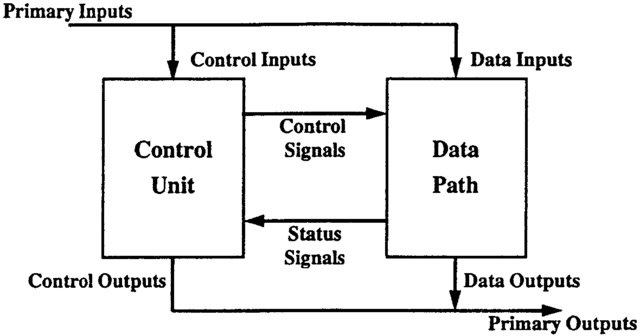


----

### Проблемы проектирования ISA для процессора фон Неймана (повтор) 冯诺依曼处理器的 ISA 设计问题（重复）

1. Типы данных и их размеры (бит, кодирование, тегирование).
2. Набор команд и их взаимозаменяемость.
3. Количество операндов (1, 2 и более).
4. Расположение операндов и результата. Адресация. 
---
1. 数据类型及其大小（位、编码、标记）。
2. 一组命令及其互换性。
3. 操作数的数量（1、2 或更多）。
4. 操作数和结果的排列。 寻址。


- Подразумеваемый адрес <br/> (часть Opcode)
- Непосредственная адресация (hardcode)
- Прямая адресация <br/> (указывается числом)
- Относительная (базовая) адресация (`addr + base`)  
---
- 隐含地址<br/>（操作码的一部分）
- 直接寻址（硬编码）
- 直接寻址<br/>（用数字表示）
- 相对（基址）寻址（`addr + base`）


- Укороченная адресация
- Регистровая адресация
- Косвенная адресация
- Адресация слов переменной длины
- Стековая адресация
- Автоинкрементная и автодекрементная  
---
- 短寻址
- 寄存器寻址
- 间接寻址
- 寻址可变长度字
- 堆栈寻址
- 自动递增和自动递减


1. Кодирование инструкций. Простота декодирования и компактность.  
  编码说明。 易于解码且紧凑。

---

## Пример процессора фон Неймана 冯诺依曼处理器的示例

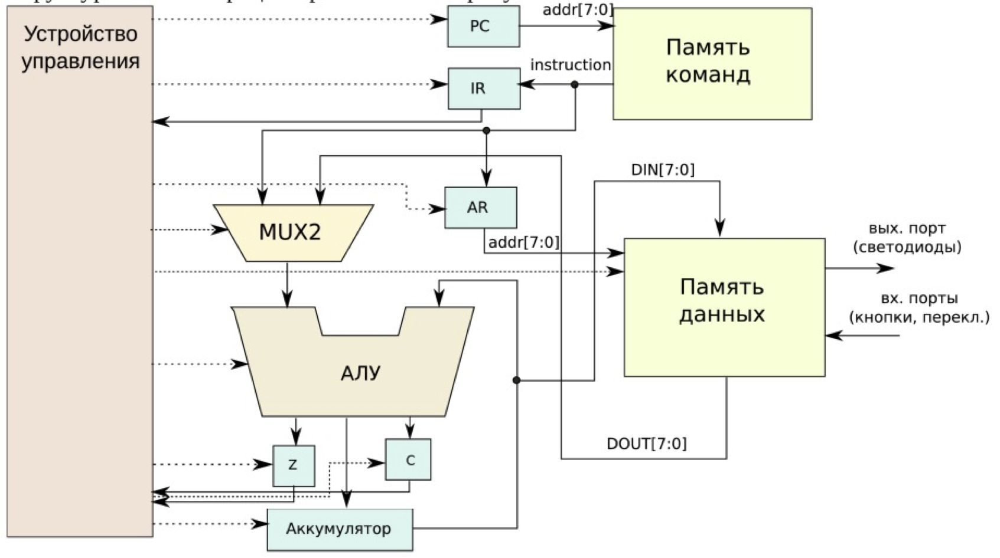

----

- Разрядность процессора: 8 бит. 
  处理器大小：8 位
- Организация памяти: Гарвардская. 
  记忆组织：哈佛。
- Внешние устройства отображаются в адресное пространство данных. Работа с ними выполняется по опросу.
  外部设备映射到数据地址空间。 与他们的合作是根据一项调查进行的。
- Регистры: 寄存器：
    - `PC` -- счетчик команд 程序计数器
    - `IR` -- регистр инструкций 指令寄存器
    - `AR` -- регистр адреса операнда 操作数地址寄存器
    - `C` -- флаг переноса/займа 进位/借位标志
    - `Z` -- флаг нуля 零标志
- Команды выполняются за 2 или 3 такта: 命令在 2 或 3 个时钟周期内执行：
    - Выборка команды. 选址周期
    - Выборка операндов. 选操作数周期
    - Выполнение команды. 执行周期
- Подсистема обработки прерываний и команды вызова подпрограмм отсутствуют.  
  没有中断处理子系统和子程序调用命令。

[Как можно смоделировать такой процессор, описанный выше?](http://amazing-new-gate.blogspot.com/2010/07/haskell.html)

----

### Пример исполнения команды 命令执行示例


```text
Add 34 + [03] -> [01] (4 байта)
```


```text
1. Чтение инструкции
  - IR <- PMem[PC]
  - PC <- PC+1
2. Инициализация акк. 34
  - {Acc, Z, C}
    <- АЛУ(...) <- MUX2(...) 
    <- PMem[PC]
  - PC <- PC+1
3. Выгрузка адреса [03]
  - AR <- PMem[PC]
  - PC <- PC+1
4. Выгрузка данных из памяти, +
  - {Acc, Z, C} 
    <- ALU(...) <- MUX2(...)
    <- DMem[AR].DOUT
5. Выгрузка адреса [01]
  - AR <- PMem[PC]
  - PC <- PC+1
6. Сохранение результата
  - DMem[AR].DIN <- Acc
```


---

## Вариации архитектуры (ISA) фон Неймана 冯·诺依曼架构变体 (ISA) 

1. Способ обработки данных  
   数据处理方法
2. Организация памяти программ и данных  
   程序和数据存储器的组织
3. Набор команд: 命令集：
    - CISC. Hardwired. Microcoded. NISC(No instruction set computing)  
      CISC。 硬连线。 微编码。无指令集计算
    - RISC. Pipelined  
      精简指令集计算机。 流水线式

Вопросы ввода-вывода, параллелизма уровня инструкций и команд, изоляции процессов, а также иерархия памяти будут рассмотрены позднее.  
I/O、指令和指令级并行性、进程隔离和内存层次结构等问题将在稍后讨论。

---

### Способ обработки данных 数据处理方法

- Accumulator Architectures
- Register-to-Register Architectures
- Register-to-Memory Architectures
- Memory-to-Memory Architectures

- 累加器架构
- 寄存器到寄存器架构
- 寄存器到内存架构
- 内存到内存架构

----

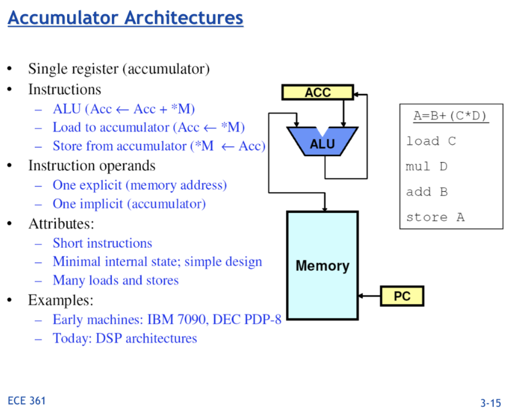<!-- .element height="700px" -->

----

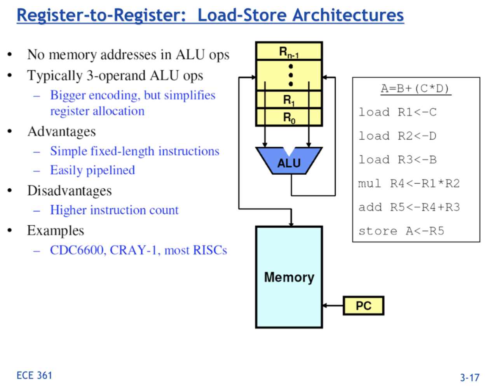<!-- .element height="700px" -->

----

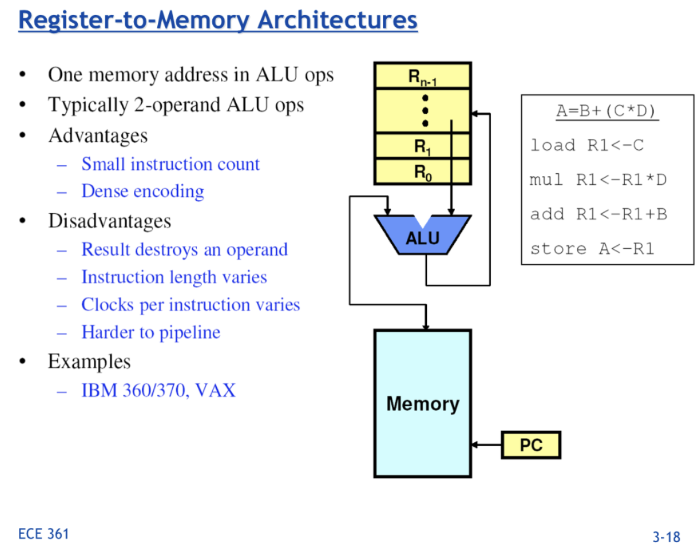<!-- .element height="700px" -->

----

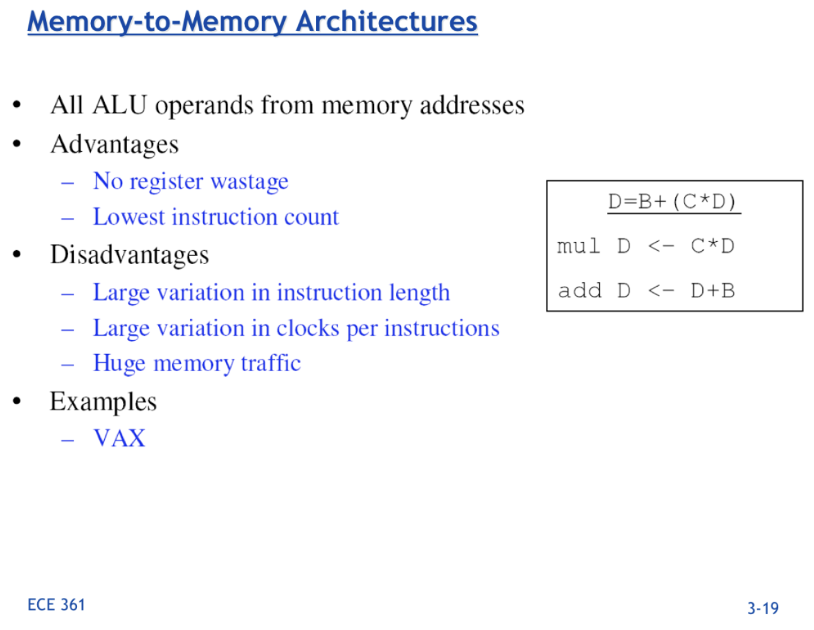<!-- .element height="700px" -->

Notes: ECE C61 Computer Architecture Lecture 3 – Instruction Set  
笔记：ECE C61 计算机体系结构讲座 3 – 指令集

---

### Организация памяти программ и данных

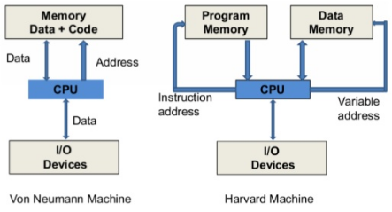


Узкое место архитектуры фон Неймана (Принстонская) -- память:  
冯·诺依曼（普林斯顿）架构的瓶颈是内存：

- доступ к инструкциям
- доступ к данным
- неодновременный доступ  
- 访问说明
- 访问数据
- 非同时访问


Отличие Гарвардской архитектуры:  
哈佛架构的区别：

- хранилище инструкций и хранилище данных -- разные физические устройства  
  指令存储和数据存储 - 不同的物理设备
- каналы инструкций и данных физически разделены  
  指令和数据通道在物理上是分开的


----

#### Особенности Гарвардской архитектуры 哈佛架构的特点

Достоинства: 优点

- Одновременный доступ к памяти.  
  同时内存访问。
- Разные ширины машинного слова и адреса для данных и программ.  
  数据和程序的机器字宽和地址不同。
    - Оптимизация под решаемую задачу.  
      优化手头的任务。
    - Данные и память программ всегда перемешаны (к примеру: непосредственная адресация и указатели на функции).  
      数据和程序存储器总是混合的（例如：直接寻址和函数指针）。
- Два физических канала между процессором и памятью.  
  处理器和内存之间的两个物理通道。
- Изоляция памяти инструкций.  
  指令存储器隔离。

Недостатки: 缺陷

- сложность и стоимость реализации;  
  实施的复杂性和成本；
- изоляция инструкций и данных.  
  指令和数据的隔离。

*Вопрос*: От чего зависит размерность машинных слов и адресных пространств?  
*问题*：什么决定了机器字和地址空间的大小？  

> 机器字和地址空间的大小由计算机体系结构和设计决定。以下是一些主要因素：
> 
> 数据总线宽度（Machine Word Size）： 机器字的大小通常与计算机的数据总线宽度相关。机器字是 CPU 一次能处理的二进制数据的位数。例如，一个32位的机器字表示CPU一次可以处理32位二进制数据，而64位的机器字表示CPU一次可以处理64位二进制数据。
> 
> 寻址能力（Address Bus Size）： 地址空间的大小由计算机的地址总线宽度决定。地址总线的宽度决定了CPU可以寻址的内存单元数量。一个32位的地址总线可以寻址2^32个内存地址，而64位的地址总线可以寻址2^64个内存地址。
> 
> 寄存器的位数： 寄存器是位于 CPU 内部的高速存储器单元，用于存储指令和数据。通常，机器字的大小与 CPU 寄存器的位数相关联。如果寄存器是n位的，那么机器字的大小通常也是n位。
> 
> 这些因素相互关联，一般来说，随着计算机体系结构的发展，人们倾向于采用更大的机器字和更大的地址空间，以提高计算机的性能和处理能力。然而，这也涉及到成本、功耗和其他设计考虑因素。

----

#### Вариации Гарвардской архитектуры 哈佛架构的变体

Архитектура "Память инструкций как данные" (Instruction-memory-as-data) 指令存储器即数据架构
: реализуется возможность читать и писать данные в память программ. Позволяет генерировать и запускать машинный код.  
实现了向​​程序存储器读写数据的能力。 允许您生成并运行机器代码。

Архитектура "Память данных как инструкции" (Data-memory-as-instruction) 数据存储器即指令架构
: реализует возможность запуска инструкций из памяти данных. Позволяет генерировать и запускать машинный код, при этом параллельный доступ ограничен.  
实现从数据存储器运行指令的能力。 允许您生成并运行机器代码，但并发访问受到限制。

Модифицированная Гарвардская архитектура (main stream) 修改后的哈佛架构（主流）
: Доступ к памяти реализуется через независимые кеши для данных и программ, за счет чего, с точки зрения внутренней организации процессора, доступ реализован независимо, при этом канал между процессором и памятью один.  
内存访问是通过数据和程序独立的缓存来实现的，因此，从处理器的内部组织来看，访问是独立实现的，而处理器和内存之间的通道是一个。

---

### Система команд и линейная функции 命令系统和线性函数

$Y = A * X + B$


```text
load R1 <- A
load R2 <- X
load R3 <- B
mul R4 <- R1 * R2
add R5 <- R4 + R3
store Y <- R5
```


```text
load R1 <- A
load R2 <- X
load R3 <- B
lfn R4 <- R1 * R2 + c
store Y <- R4
```


```text
load R1 <- A
mul R1 <- R1 * B
add R1 <- R1 + C
store Y <- R1
```


```text
mul R1 <- A * B
add Y <- R1 + C
```


```text
lfn Y <- A * B + C
```


*Вопрос*: Какой состав команд лучше и почему?  
*问题*：哪种命令组成更好，为什么？

Notes: зависит от алгоритма, неплохо бы оптимизировать под задачу.  
注意：取决于算法，最好针对任务进行优化。

---

## Complex Instruction Set Computer 复杂指令集计算机

CISC
: is a computer architecture in which single instructions can execute several low-level operations (a load from memory, an arithmetic operation, and a memory store) or are capable of multi-step operations or addressing modes within single instructions.  
是一种计算机体系结构，其中单个指令可以执行多个低级操作（从内存加载、算术运算和内存存储），或者能够在单个指令内执行多步操作或寻址模式。


Причины появления: 出现原因：

- Низкоуровневые языки.
- Разнообразие архитектур.
- Неразвитость компиляторов.
- Удобство программирования.
- Высокая производительность.
- Минимизация объёма программ.
- Минимизация накладных расходов. 
---
- 低级语言。
- 多种架构。
- 缺乏编译器的开发。
- 易于编程。
- 高性能。
- 最小化程序量。
- 最大限度地减少间接费用。


Проблемы: 问题：

- Сложная система команд (использование, анализ).  
  复杂的命令系统（使用、分析）。
- Сложное устройство Control Unit и процессора.  
  复杂的控制单元和处理器设备。
- Сложно генерировать эффективный машинный код.  
- 难以生成高效的机器代码。


----

### Реализация Control Unit 实现控制单元


Hardwired 硬连线
: при помощи аппаратных комбинационных схем, декодирующих инструкции в последовательности сигналов.  
使用硬件组合电路将指令解码为信号序列。

Microcoded 微编码
: при помощи исполнения микропрограммы, реализующей необходимые функции.  
使用执行微程序来实现必要的功能。

Микропрограмма (микрокод) 固件（微代码）
:  программа, реализующая набор инструкций процессора.  
实现一组处理器指令的程序。


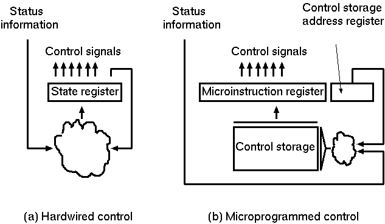

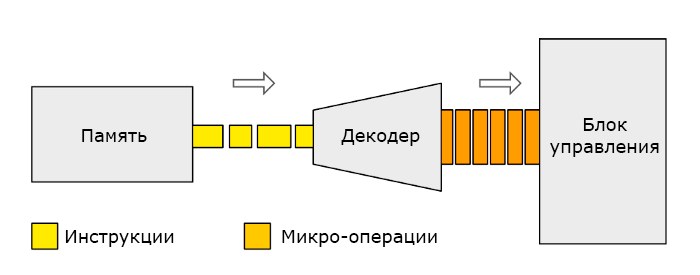


----

#### Микропрограммное управление 固件控制


Достоинства: 优点

1. Простота реализации (CISC).  
   易于实施（CISC）
2. Возможность "программирования" системы команд.  
   对命令系统进行“编程”的可能性。
3. Доступ к микрокоду для программиста.  
   程序员访问微代码。
4. Генерация ISA под задачу (сократить объём, повысить эффективность), см. [УВК «Самсон» -- базовая ЭВМ РВСН](https://www.computer-museum.ru/articles/sistemi_kompleksi/90/).  
5. 任务的ISA生成（减少体积，提高效率），参见 [УВК «Самсон» -- базовая ЭВМ РВСН](https://www.computer-museum.ru/articles/sistemi_kompleksi/90/).  


Недостатки: 缺陷

1. Хранение микрокода в процессоре.  
   在处理器中存储微代码。
2. CISC требует знаний.  
   CISC需要知识。
3. Разнообразие архитектур = проблемы инструментария.  
   架构的多样性=工具问题。
4. Разнообразие команд (форматы, размеры, длительности, доступ). Усложняет:  
   各种命令（格式、大小、持续时间、访问）。 复杂化：
    - оптимизацию процессора;  
      处理器优化；
    - инструментарий.  
      工具。
5. Микрокод привносит все проблемы программирования (сложность, отладка, методы).  
   微代码介绍了编程的所有问题（复杂性、调试、技术）。


----

#### No Instruction Set Computing (NISC) 无指令集计算 (NISC)


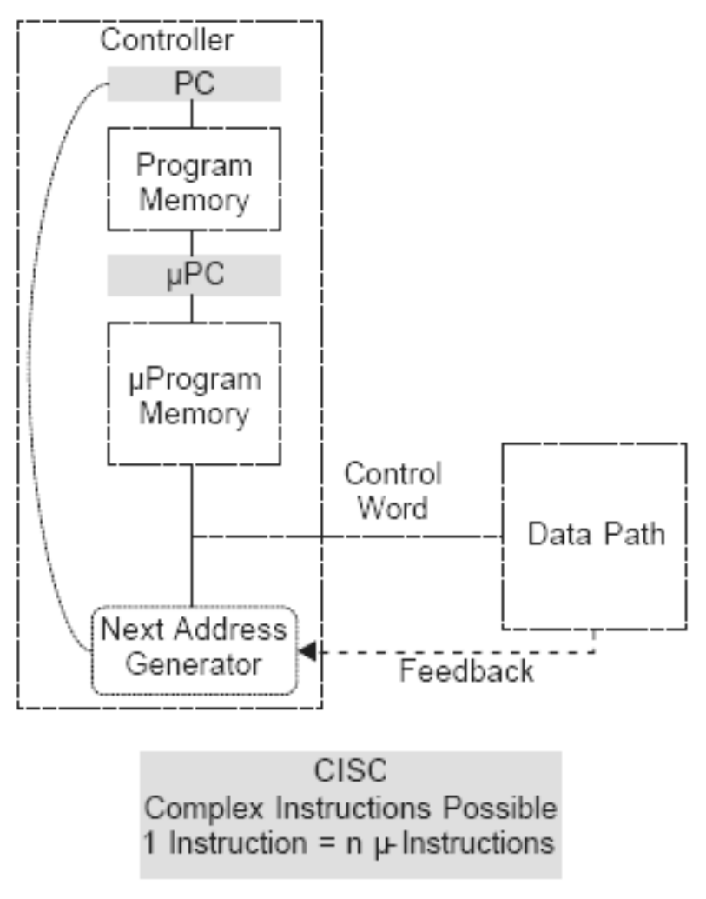


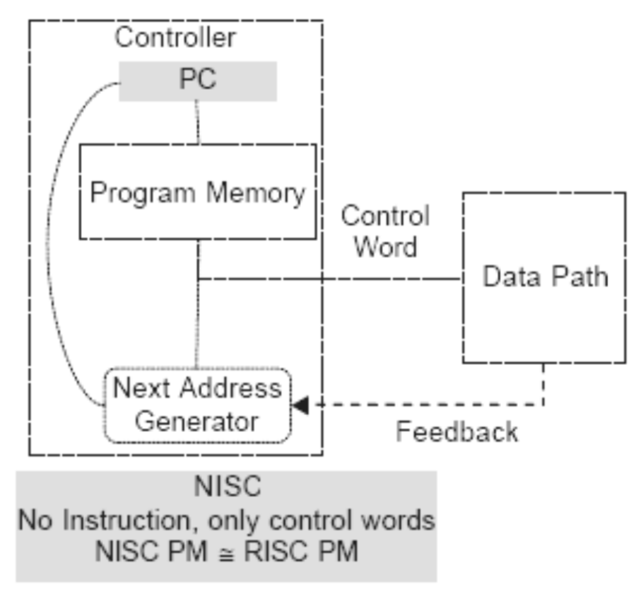


----

##### Особенности NISC

1. Убрать ISA как уровень абстракции:  
   删除 ISA 作为抽象级别：
    - упростить аппаратуру;  
      简化设备；
    - выжать максимум из процессора (максимально тонкое управление).  
      充分利用处理器（最大程度的精细控制）。
2. Убрать проблемы дизайна ISA.  
   消除ISA设计问题。
3. Сделать невозможной бинарную совместимость процессоров.  
   使处理器的二进制兼容性变得不可能。
4. Применяется для ускорителей и в области высокоуровневого синтеза (HLS).  
   适用于加速器和高级综合（HLS）应用。
5. Низкая плотность машинного кода.  
   机器代码密度低。
6. Приходите в [NITTA](https://ryukzak.github.io/projects/nitta/) -- параллельный NISC процессор.  
   来到[NITTA](https://ryukzak.github.io/projects/nitta/) - 并行NISC处理器。
