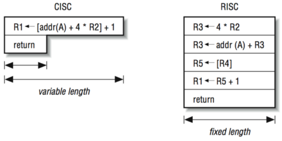

# Архитектура компьютера

## Лекция 10

### RISC. Pipeline. Структурное программирование

Пенской А.В., 2022

----

### План лекции

- Машина фон Неймана и её вариации:
    - Системы команд и их особенности
        - Complex Instruction Set Computer (CISC). Control Unit и DataPath. Микрокод (было)
        - RISC. Pipeline. Hazards. Оптимизация конвейера.
- Реализация структурного программирования

---

## Reduced Instruction Set Computer

<div class="row"><div class="col">

RISC
: подход к проектированию процессоров, где быстродействие увеличивается за счёт такого кодирования упрощённого набора инструкций.

</div><div class="col">


</div></div>

----

### RISC. Предпосылки и особенности

<div class="row"><div class="col">

1. Сложные операции:
    - встречаются редко;
    - последовательность простых команд.
2. Языки программирования высокого уровня.
3. Освобождение места от памяти микрокоманд и декодера для регистров и кэша (он тут даже нужнее).
4. Единый формат инструкций. Простота декодирования.
5. Оптимизация малого количества однообразных команд.
6. Параллелизм уровня инструкций (pipeline).

</div><div class="col">



- "То, что раньше делали корпорации, теперь доступно для двух аспирантов." СнК
- Рост производительности "средней программы" за счёт ускорения частых инструкций.
- Простой машинный код.

</div></div>

---

### RISC. Pipeline. <br/> Параллелизм уровня инструкций

<div class="row"><div class="col">

<!-- .element height="350px" -->

</div><div class="col">

<!-- .element height="350px" -->

</div></div>

Разбиваем обработку инструкции на несколько этапов и выполняем их параллельно для разных команд.

Один такт -- одна стадия конвейера.

----

#### Как построить конвейер?

1. выделить стадии выполнения команд;

2. организовать внутренние структуры процессора так, чтобы:

    - у процессора был входной (поступают команды) и выходной конец (команды "покидают" процессор);
    - структура процессора должна соответствовать стадиям выполнения команд;
    - сегменты связаны регистрами, комбинационные схемы сбалансированы;
    - все части процессора управляются одним тактовым сигналом;

3. загружать в процессор команды каждый такт;

4. разрешать конфликты из-за параллельного выполнения команд.

----

### RISC. Типовые стадии конвейера

1. Instruction Fetch. Считать инструкцию по адресу счётчика команд.

2. Instruction Decode. Декодировать инструкцию и считать регистры.

3. Instruction Execute. Выполнение операций по изменению данных:

    - Register-Register Operation (Single-cycle latency): Сложение, вычитание, сравнение и логические операции.
    - Memory Reference (Two-cycle latency): Подготовка адресов для доступа к памяти.
    - Multi-cycle Instructions (Many cycle latency): Целочисленное умножение, деление и все операции с плавающей запятой.

4. Memory Access. Операнды считываются и записываются в/из памяти.

5. Write Back. Запись результата в регистры.

----

### RISC. Работа конвейера

<div class="row"><div class="col">


</div><div class="col">


</div></div>

----

### RISC. Типовая организация


---

### RISC. Проблемы конвейеризации

- Структурные конфликты / Structural dependency
- Конфликты по данным / Data Dependency / Data Hazard
- Конфликты по управлению / Control Dependency / Branch Hazards

----

#### Структурные конфликты / Structural Dependency

- Конфликт из-за ресурсов. Аппаратура не позволяет выполнить все возможные комбинации инструкций.
- Пример: одновременный доступ к единой памяти команд/данных.
    - Гарвардская архитектура.
    - Двухпортовая память.
    - Отдельные кеши для инструкций и данных.

```text
|    Tick | 1       | 2       | 3       | 4           |
| Instr.  |         |         |         |             |
|---------|---------|---------|---------|-------------|
| I1      | IF(Mem) | ID      | EX      | **Mem**     |
| I2      |         | IF(Mem) | ID      | EX          |
| I3      |         |         | IF(Mem) | ID          |
| I4      |         |         |         | **IF(Mem)** |
```

----

#### Разрешение конфликта пузырьком

```text
|    Tick | 1       | 2       | 3       | 4       | 5   | 6   | 7       |
| Instr.  |         |         |         |         |     |     |         |
|---------|---------|---------|---------|---------|-----|-----|---------|
| I1      | IF(Mem) | ID      | EX      | **Mem** | WB  |     |         |
| I2      |         | IF(Mem) | ID      | EX      | Mem | WB  |         |
| I3      |         |         | IF(Mem) | ID      | EX  | Mem | WB      |
| I4      |         |         |         | 0       | 0   | 0   | IF(Mem) |
```

- `0` -- пустая операция:
    - занимает конвейер;
    - не выполняет никаких действий.

----

#### Конфликты по данным / Data Dependency (Hazard)

- Конфликт из-за зависимостей команд, исполняемых конвейером.
- Конфликт всегда связан с записью в регистр.

<div class="row"><div class="col">

##### RAW -- Read after Write <br/> (Data-dependency)

```text
i1. R3 <- R1 - R2
i2. R5 <- R3 + R4
```

##### WAR -- Write after Read <br/> (Anti-dependency)

```text
i1. R3 <- R1 + R2
i2. R1 <- R4 + R5
```

##### WAW -- Write after Write <br/> (Output dependency)

```text
i1. R3 <- R1 + R2
i2. R3 <- R4 + R5
```

</div><div class="col">


</div></div>

----

#### Механизмы разрешения Data Hazard

- 1. Вставка пузырька.
- 2. Исполнения не по порядку (out-of-order). Решение принимается:
    - компилятором;
    - процессором.

```text
i1. R3 <- R1 - R2      i1. R3 <- R1 - R2
i2. R5 <- R3 + R4   => i3. R8 <- R7 + R6
i3. R8 <- R7 + R6      i4. R11 <- R9 + R10
i4. R11 <- R9 + R10    i2. R5 <- R3 + R4
```

- 3. Проброс операндов между стадиями процессора (operand forwarding), минуя регистровый файл.
- 4. Переименования регистров -- если зависимость по данным ложная, промежуточный результат одной из записей может быть переназначен на другой регистр на лету.

----

#### Конфликты по управлению / Control Dependency / Branch Hazards

- Конфликт из-за операций условного и/или безусловного перехода.
- В конвейер могут быть загружены ненужные команды.
- Ошибка перехода требует сброса конвейера.


- Основной метод решения: предсказание переходов (branch prediction).
- Уязвимость [Spectre](https://en.wikipedia.org/wiki/Spectre_(security_vulnerability)).

---

#### Конвейер на практике

pic -- 2; i7 -- 14; p4 -- 20; xeon -- 30; <br/> Xelerated X10q Network Processor -- 200 стадий.

Преимущества:

- повышение производительности и утилизации ресурсов.

Недостатки:

- снижение скорости исполнения отдельной команды;
- не все операции за один машинный цикл;
- необходимость разрешения конфликтов;
- непредсказуемое время исполнения;
- противоречие с фон Неймановской архитектурой (единая память);
- уязвимости "косвенных каналов".

Некоторые оптимизации для конвейера (далее детали): loop unrolling, hyper-threading, branch prediction.

----

##### Loop Unrolling

is a loop transformation technique that helps to optimize the execution time of a program. We basically remove or reduce iterations. Loop unrolling increases the program’s speed by eliminating loop control instruction and loop test instructions.

<div class="row"><div class="col">

```c
for (int x = 0; x < 100; x++) {
    delete(x);
}
```

</div><div class="col">

```c
for (int x = 0; x < 100; x += 5 ) {
    delete(x);
    delete(x + 1);
    delete(x + 2);
    delete(x + 3);
    delete(x + 4);
}
```

</div></div>

----

##### HyperThreading

For each processor core that is physically present, the operating system addresses two virtual (logical) cores and shares the workload between them when possible. The main function of hyper-threading is to increase the number of independent instructions in the pipeline.


----

##### Branch Prediction

<div class="row"><div class="col">

- Статическое предсказание:
    - `do {<предсказанный переход>} while(условие); ...`
    - `if (условие) {<предсказанный переход>} else {...}`
- Динамическое предсказание:
    - Счётчик с накоплением для перехода из указанного адреса.
    - И т.п.

</div><div class="col">


</div></div>

----

### Branch Prediction. Пример

```c++
const unsigned arraySize = 32768;
int data[arraySize];
for (unsigned c = 0; c < arraySize; ++c)
    data[c] = std::rand() % 256;

#ifdef SORT_DATA
    std::sort(data, data + arraySize);
#endif

long long sum = 0;
for (unsigned i = 0; i < 100000; ++i) {
    for (unsigned c = 0; c < arraySize; ++c) {
        if (data[c] >= 128)
            sum += data[c];
    }
}
```

Полный код: [src/branch_prediction.cpp](https://gitlab.se.ifmo.ru/computer-systems/csa-rolling/-/blob/master/src/branch_prediction.cpp)

На сколько будет отличаться время работы для сортированного и несортированного массивов?

----

Скорость работы на несортированном и сортированном списках:

| branch_prediction_unsorted | branch_prediction_sorted   |
| -------------------------- | -------------------------- |
| Elapsed time: 19.5104      | Elapsed time: 3.83967      |
| Sum: 312426300000          | Sum: 312426300000          |

Подробнее: [stackoverflow](https://stackoverflow.com/questions/11227809/why-is-processing-a-sorted-array-faster-than-processing-an-unsorted-array)

----

### Branch Prediction. Оптимизация

- При компиляции с `-O3` ситуация меняется.

    | branch_prediction_unsorted | branch_prediction_sorted   |
    | -------------------------- | -------------------------- |
    | Elapsed time: 1.95652      | Elapsed time: 1.95178      |
    | Sum: 312426300000          | Sum: 312426300000          |

- if-statement заменяется на инструкцию условной пересылки `cmov`.
- Условие не выполнится -- пересылка данных не произойдет.
- `cmov` не требует сброса конвейера при невыполнении условия.

<div class="row"><div class="col">

```asm
cmp data[j], 128
jl .if_end
mov eax, j
mov ecx, eax
mov rcx, data[rcx]
add sum, rcx
```

`-O0`

</div><div class="col">

```asm
cmp edx, 127
cmovle edx, r15d ;r15d always equals 0
add rbx, edx ;rbx = sum
```

`-O3`

</div></div>

----

### Количество сброшенных инструкций


Процессор -- i7. Не только из-за конвейера.

---

### RISC. Практика

<div class="row"><div class="col">

Почему RISC не победил CISC? Или победил?

<div>

- Мобильные -- уже. ПК и сервера -- в процессе.
- Инструментальная поддержка (сколько лет делали `clang`?).
- Бинарная совместимость (виртуализация, аппаратная трансляция, транспиляция).
- Зависимость себестоимости от серийности.
- RISC ядро внутри CISC процессора.

</div> <!-- .element: class="fragment" -->

</div><div class="col">


</div></div>

---

## Реализация структурного программирования

(один поток)

- sequence code (фон Нейман)
- if-statement (фон Нейман)
- loops (фон Нейман)
- expressions
- procedures/functions/subroutines

----

### Распределение регистров. Выражения

<div class="row"><div class="col">


</div><div class="col">


</div></div>

- Не все регистры одинаковы (особенно в CISC).
- Проблема компилятора или программиста низкого уровня.
- Код не ограничивается выражениями.
- Кол-во регистров 32/64 бита: ARM 15/31, x86 8/16, MIPS 32/32.

----

### Процедуры. Функции. Subroutine

<div class="row"><div class="col">

1. Один вход. Один выход. jmp
2. Многократный вход.
    - Хранение адреса возврата.
    - Зарезервирован под процедуру.
3. Реентерабельный вход.
    - Один поток. Несколько потоков.
    - Зарезервированный возврат и память для каждого вызова.
4. Рекурсивные функции.
    - Автоматическая память.
    - Стек возврата.
5. Сброс регистров.
6. inline

</div><div class="col">


</div></div>
