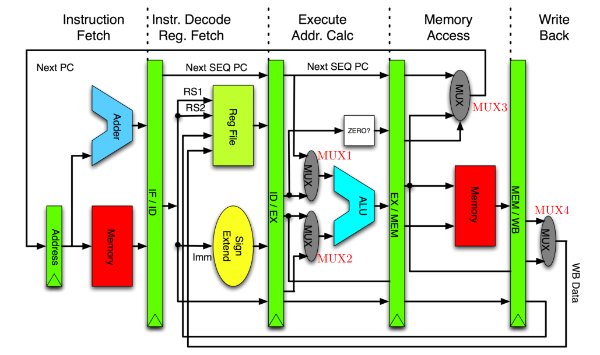

# Архитектура компьютера

## Лекция 10

### RISC. Pipeline. Структурное программирование 精简指令集计算机。 管道。 结构化编程

Пенской А.В., 2022

----

### План лекции

- Машина фон Неймана и её вариации:
    - Системы команд и их особенности
        - Complex Instruction Set Computer (CISC). Control Unit и DataPath. Микрокод (было)
        - RISC. Pipeline. Hazards. Оптимизация конвейера.
- Реализация структурного программирования
---
- 冯·诺依曼机及其变体：
     - 命令系统及其特点
         - 复杂指令集计算机（CISC）。 控制单元和数据路径。 微码（以前）
         - 精简指令集计算机。 管道。 危险。 输送机优化。
- 结构化编程的实现

---

## Reduced Instruction Set Computer 精简指令集计算机


RISC 精简指令集计算机
: подход к проектированию процессоров, где быстродействие увеличивается за счёт такого кодирования упрощённого набора инструкций.  
一种处理器设计方法，通过对一组简化的指令进行编码来提高性能。


----

### RISC. Предпосылки и особенности 精简指令集计算机。 背景与特点


1. Сложные операции: 操作复杂：
    - встречаются редко;  
      很少见；
    - последовательность простых команд.  
      一系列简单的命令。
2. Языки программирования высокого уровня.  
   高级编程语言。
3. Освобождение места от памяти микрокоманд и декодера для регистров и кэша (он тут даже нужнее).  
   释放微指令存储器和解码器的空间用于寄存器和缓存（这里更需要）。
4. Единый формат инструкций. Простота декодирования.  
   统一指令格式。 易于解码。
5. Оптимизация малого количества однообразных команд.  
   优化少量单调命令。
6. Параллелизм уровня инструкций (pipeline).  
   指令级并行性（管道）。


- "То, что раньше делали корпорации, теперь доступно для двух аспирантов." СнК  
  “过去企业所做的事情现在只需两名研究生就能完成。” SNK
- Рост производительности "средней программы" за счёт ускорения частых инструкций.  
  由于频繁指令的加速，“平均程序”的性能得到提高。
- Простой машинный код.  
  简单的机器代码。


---

### RISC. Pipeline. 精简指令集计算机。 管道。 <br/> Параллелизм уровня инструкций 指令级并行性


<!-- .element height="350px" -->


<!-- .element height="350px" -->


Разбиваем обработку инструкции на несколько этапов и выполняем их параллельно для разных команд. 我们将指令处理分为几个阶段，并针对不同的命令并行执行它们。

Один такт -- одна стадия конвейера.  
一个时钟周期 - 传送带的一级。

----

#### Как построить конвейер? 如何建造输送机？

1. выделить стадии выполнения команд;  
   突出显示命令执行的阶段；

2. организовать внутренние структуры процессора так, чтобы:  
   组织处理器的内部结构，以便：

    - у процессора был входной (поступают команды) и выходной конец (команды "покидают" процессор);  
      处理器有一个输入端（命令到达）和一个输出端（命令“离开”处理器）；
    - структура процессора должна соответствовать стадиям выполнения команд;  
      处理器的结构必须与命令执行的阶段相对应；
    - сегменты связаны регистрами, комбинационные схемы сбалансированы;  
      各段通过寄存器连接，组合电路平衡；
    - все части процессора управляются одним тактовым сигналом;  
      处理器的所有部分均由一个时钟信号控制；

3. загружать в процессор команды каждый такт;  
   每个时钟周期将命令加载到处理器中；

4. разрешать конфликты из-за параллельного выполнения команд.  
   解决由于命令并行执行而产生的冲突。

----

### RISC. Типовые стадии конвейера 精简指令集计算机。 典型的输送机阶段

1. Instruction Fetch. Считать инструкцию по адресу счётчика команд.  
   指令获取。 从程序计数器地址读取指令。

2. Instruction Decode. Декодировать инструкцию и считать регистры.  
   指令译码。 解码指令并读取寄存器。

3. Instruction Execute. Выполнение операций по изменению данных:  
   指令执行。 执行更改数据的操作：

    - Register-Register Operation (Single-cycle latency): Сложение, вычитание, сравнение и логические операции.  
      寄存器-寄存器操作（单周期延迟）：加法、减法、比较和逻辑运算。
    - Memory Reference (Two-cycle latency): Подготовка адресов для доступа к памяти.  
      内存参考（两个周期延迟）：为内存访问准备地址。
    - Multi-cycle Instructions (Many cycle latency): Целочисленное умножение, деление и все операции с плавающей запятой.  
      多周期指令（多周期延迟）：整数乘法、除法和所有浮点运算。

4. Memory Access. Операнды считываются и записываются в/из памяти.  
   内存访问。 操作数从内存中读取和写入。

5. Write Back. Запись результата в регистры.  
   回信。 将结果写入寄存器。

----

### RISC. Работа конвейера 精简指令集计算机。 输送机操作


----

### RISC. Типовая организация 精简指令集计算机。 典型组织



---

### RISC. Проблемы конвейеризации 精简指令集计算机。 流水线问题

- Структурные конфликты / Structural dependency  
  结构性冲突/结构性依赖
- Конфликты по данным / Data Dependency / Data Hazard  
  数据冲突/数据依赖/数据危险
- Конфликты по управлению / Control Dependency / Branch Hazards  
  管理冲突/控制依赖/分支危险

----

#### Структурные конфликты / Structural Dependency 结构依赖性

- Конфликт из-за ресурсов. Аппаратура не позволяет выполнить все возможные комбинации инструкций.  
  资源冲突。 硬件不允许您执行所有可能的指令组合。
- Пример: одновременный доступ к единой памяти команд/данных.  
  示例：同时访问单个命令/数据存储器。
    - Гарвардская архитектура. 哈佛架构
    - Двухпортовая память. 双端口内存
    - Отдельные кеши для инструкций и данных. 指令和数据的独立缓存

```text
|    Tick | 1       | 2       | 3       | 4           |
| Instr.  |         |         |         |             |
|---------|---------|---------|---------|-------------|
| I1      | IF(Mem) | ID      | EX      | **Mem**     |
| I2      |         | IF(Mem) | ID      | EX          |
| I3      |         |         | IF(Mem) | ID          |
| I4      |         |         |         | **IF(Mem)** |
```

----

#### Разрешение конфликта пузырьком 气泡冲突解决

```text
|    Tick | 1       | 2       | 3       | 4       | 5   | 6   | 7       |
| Instr.  |         |         |         |         |     |     |         |
|---------|---------|---------|---------|---------|-----|-----|---------|
| I1      | IF(Mem) | ID      | EX      | **Mem** | WB  |     |         |
| I2      |         | IF(Mem) | ID      | EX      | Mem | WB  |         |
| I3      |         |         | IF(Mem) | ID      | EX  | Mem | WB      |
| I4      |         |         |         | 0       | 0   | 0   | IF(Mem) |
```

- `0` -- пустая операция: 空操作：
    - занимает конвейер; 占用传送带；
    - не выполняет никаких действий. 不执行任何操作。

----

#### Конфликты по данным / Data Dependency (Hazard) 数据冲突/数据依赖性（危险）

- Конфликт из-за зависимостей команд, исполняемых конвейером.  
  由于管道执行的命令的依赖性而导致的冲突。
- Конфликт всегда связан с записью в регистр.  
  冲突始终与写入寄存器有关。


##### RAW -- Read after Write <br/> (Data-dependency)

```text
i1. R3 <- R1 - R2
i2. R5 <- R3 + R4
```

##### WAR -- Write after Read <br/> (Anti-dependency)

```text
i1. R3 <- R1 + R2
i2. R1 <- R4 + R5
```

##### WAW -- Write after Write <br/> (Output dependency)

```text
i1. R3 <- R1 + R2
i2. R3 <- R4 + R5
```


----

#### Механизмы разрешения Data Hazard 数据危险解决机制

- 1. Вставка пузырька. 气泡插入
- 2. Исполнения не по порядку (out-of-order). Решение принимается: 执行无序（out-of-order）。 作出决定：
    - компилятором; 编译器；
    - процессором. 处理器。

```text
i1. R3 <- R1 - R2      i1. R3 <- R1 - R2
i2. R5 <- R3 + R4   => i3. R8 <- R7 + R6
i3. R8 <- R7 + R6      i4. R11 <- R9 + R10
i4. R11 <- R9 + R10    i2. R5 <- R3 + R4
```

- 3. Проброс операндов между стадиями процессора (operand forwarding), минуя регистровый файл.  
  操作数在处理器级之间转发，绕过寄存器文件。
- 4. Переименования регистров -- если зависимость по данным ложная, промежуточный результат одной из записей может быть переназначен на другой регистр на лету.  
  寄存器重命名 - 如果数据依赖性为假，则可以将其中一个记录的中间结果重新分配给另一个寄存器。

----

#### Конфликты по управлению / Control Dependency / Branch Hazards 管理冲突/控制依赖/分支危险

- Конфликт из-за операций условного и/или безусловного перехода.  
  由于条件和/或无条件跳转操作而导致的冲突。
- В конвейер могут быть загружены ненужные команды.  
  不必要的命令可能会加载到管道中。
- Ошибка перехода требует сброса конвейера.  
  转换错误需要重置管道。


- Основной метод решения: предсказание переходов (branch prediction).  
  主要解决方法：分支预测。
- Уязвимость 漏洞 [Spectre](https://en.wikipedia.org/wiki/Spectre_(security_vulnerability)).

---

#### Конвейер на практике

pic -- 2; i7 -- 14; p4 -- 20; xeon -- 30; <br/> Xelerated X10q Network Processor -- 200 стадий.

Преимущества: 优点

- повышение производительности и утилизации ресурсов.  
  提高生产力和资源利用率。

Недостатки:

- снижение скорости исполнения отдельной команды;
- не все операции за один машинный цикл;
- необходимость разрешения конфликтов;
- непредсказуемое время исполнения;
- противоречие с фон Неймановской архитектурой (единая память);
- уязвимости "косвенных каналов".  
- 降低单个命令的执行速度；
- 并非所有操作都在一个机器周期内执行；
- 解决冲突的需要；
- 不可预测的执行时间；
- 与冯·诺依曼架构（单一内存）矛盾；
- “间接渠道”的漏洞。

Некоторые оптимизации для конвейера (далее детали): loop unrolling, hyper-threading, branch prediction.  
管道的一些优化（详细信息如下）：循环展开、超线程、分支预测。

----

##### Loop Unrolling 循环展开

is a loop transformation technique that helps to optimize the execution time of a program. We basically remove or reduce iterations. Loop unrolling increases the program’s speed by eliminating loop control instruction and loop test instructions.  
是一种循环转换技术，有助于优化程序的执行时间。 我们基本上删除或减少迭代。 循环展开通过消除循环控制指令和循环测试指令来提高程序的速度。


```c
for (int x = 0; x < 100; x++) {
    delete(x);
}
```


```c
for (int x = 0; x < 100; x += 5 ) {
    delete(x);
    delete(x + 1);
    delete(x + 2);
    delete(x + 3);
    delete(x + 4);
}
```


----

##### HyperThreading 超线程

For each processor core that is physically present, the operating system addresses two virtual (logical) cores and shares the workload between them when possible. The main function of hyper-threading is to increase the number of independent instructions in the pipeline.  
对于物理上存在的每个处理器核心，操作系统会寻址两个虚拟（逻辑）核心，并在可能的情况下在它们之间共享工作负载。 超线程的主要作用是增加流水线中独立指令的数量。


----

##### Branch Prediction 分支预测


- Статическое предсказание: 静态预测：
    - `do {<предсказанный переход 预测的转换>} while(условие 条件); ...`
    - `if (условие 条件) {<предсказанный переход 预测的转换>} else {...}`
- Динамическое предсказание: 动态预测：
    - Счётчик с накоплением для перехода из указанного адреса.  
      从指定地址开始转换的累积计数器
    - И т.п.


----

### Branch Prediction. Пример

```c++
const unsigned arraySize = 32768;
int data[arraySize];
for (unsigned c = 0; c < arraySize; ++c)
    data[c] = std::rand() % 256;

#ifdef SORT_DATA
    std::sort(data, data + arraySize);
#endif

long long sum = 0;
for (unsigned i = 0; i < 100000; ++i) {
    for (unsigned c = 0; c < arraySize; ++c) {
        if (data[c] >= 128)
            sum += data[c];
    }
}
```

Полный код: [src/branch_prediction.cpp](https://gitlab.se.ifmo.ru/computer-systems/csa-rolling/-/blob/master/src/branch_prediction.cpp)

На сколько будет отличаться время работы для сортированного и несортированного массивов?  
排序数组和未排序数组的运行时间有何不同？

----

Скорость работы на несортированном и сортированном списках:  
未排序和排序列表的工作速度：

| branch_prediction_unsorted | branch_prediction_sorted   |
| -------------------------- | -------------------------- |
| Elapsed time: 19.5104      | Elapsed time: 3.83967      |
| Sum: 312426300000          | Sum: 312426300000          |

Подробнее: [stackoverflow](https://stackoverflow.com/questions/11227809/why-is-processing-a-sorted-array-faster-than-processing-an-unsorted-array)

----

### Branch Prediction. Оптимизация

- При компиляции с `-O3` ситуация меняется.  
  当使用“-O3”编译时，情况会发生变化。

    | branch_prediction_unsorted | branch_prediction_sorted   |
    | -------------------------- | -------------------------- |
    | Elapsed time: 1.95652      | Elapsed time: 1.95178      |
    | Sum: 312426300000          | Sum: 312426300000          |

- if-statement заменяется на инструкцию условной пересылки `cmov`.  
  if 语句被替换为条件前向指令“cmov”。
- Условие не выполнится -- пересылка данных не произойдет.  
  不满足条件 - 不会发生数据传输。
- `cmov` не требует сброса конвейера при невыполнении условия.  
  如果不满足条件，`cmov` 不需要重置管道。


```asm
cmp data[j], 128
jl .if_end
mov eax, j
mov ecx, eax
mov rcx, data[rcx]
add sum, rcx
```

`-O0`


```asm
cmp edx, 127
cmovle edx, r15d ;r15d always equals 0
add rbx, edx ;rbx = sum
```

`-O3`


----

### Количество сброшенных инструкций 丢弃指令数


Процессор -- i7. Не только из-за конвейера. 处理器 - i7。 不仅仅是因为传送带。

---

### RISC. Практика


Почему RISC не победил CISC? Или победил? 为什么RISC没有打败CISC？ 还是他赢了？

<div>

- Мобильные -- уже. ПК и сервера -- в процессе.  
  移动 - 已经。 PC 和服务器正在进行中。
- Инструментальная поддержка (сколько лет делали `clang`?).  
  工具支持（他们制作《clang》多少年了？）。
- Бинарная совместимость (виртуализация, аппаратная трансляция, транспиляция).  
  二进制兼容性（虚拟化、硬件翻译、转译）。
- Зависимость себестоимости от серийности.  
  成本对批量生产的依赖性。
- RISC ядро внутри CISC процессора.  
  CISC 处理器内的 RISC 内核。

</div> <!-- .element: class="fragment" -->


---

## Реализация структурного программирования 结构化编程的实现

(один поток) 一根线

- sequence code (фон Нейман)  
  序列代码（冯·诺依曼）
- if-statement (фон Нейман)  
  if 语句（冯·诺依曼）
- loops (фон Нейман)  
  循环（冯·诺依曼）
- expressions  
  表达式
- procedures/functions/subroutines  
  过程/函数/子例程

----

### Распределение регистров. Выражения 登记分配。 表达式


- Не все регистры одинаковы (особенно в CISC).  
  并非所有寄存器都是相同的（特别是在 CISC 中）。
- Проблема компилятора или программиста низкого уровня.  
  编译器或低级程序员问题。
- Код не ограничивается выражениями.  
  代码不限于表达式。
- Кол-во регистров 32/64 бита: ARM 15/31, x86 8/16, MIPS 32/32.  
  寄存器数量 32/64 位：ARM 15/31、x86 8/16、MIPS 32/32。

----

### Процедуры. Функции. Subroutine 程序。 功能。 子程序


1. Один вход. Один выход. jmp  
   一个入口。 一个出口。 jmp
2. Многократный вход.  
   多个入口。
    - Хранение адреса возврата.  
      存储返回地址。
    - Зарезервирован под процедуру.  
      为程序保留。
3. Реентерабельный вход.  
   可重入输入。
    - Один поток. Несколько потоков.  
      单线程。 一些线程
    - Зарезервированный возврат и память для каждого вызова.  
      为每次调用保留返回和内存。
4. Рекурсивные функции.  
   递归函数。
    - Автоматическая память.  
      自动记忆。
    - Стек возврата.  
      返回堆栈。
5. Сброс регистров. 复位寄存器。
6. inline


