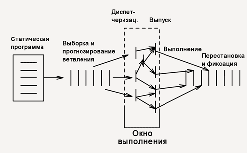

# Архитектура компьютера

## Лекция 11

### Stack. Superscalar. VLIW

Пенской А.В., 2022

----

### План лекции

- Stack-Oriented Processors (ROSC)
- Суперскалярное исполнение и VLIW

---

## Stack-Oriented Processors or ROSC

Reduced Operands Set Computer (скорее шутка, чем термин)

Стек -- это одна из простейших структур данных, которая выступает коллекцией элементов с двумя основными операциями:

- `push`, который добавляет элемент в коллекцию
- `pop`, который удаляет последний добавленный элемент из коллекции.

 <!-- .element height="300px" -->

----

### Вычисления на стеке

 <!-- .element height="600" -->

----

### Forth

Лучшим примером организации вычислительного процесса через стек является язык программирования Forth.

Форт (англ. Forth)
: императивный язык программирования на основе стека. Особенности: структурное программирование, отражение (возможность исследовать и изменять структуру программы во время выполнения), последовательное программирование и расширяемость (новые команды).

```text
 : fac recursive
   dup 1 > IF
      dup 1 - fac *
   else
      drop 1
   endif ;
```

----

```text
3 fac .
- [] Положить 3 в стек.
- [3] Выполнить слово fac.
  [3] Выполнить слово dup - дублирует самый верхний элемент стека.
    - [3, 3] Положить 1.
    - [3, 3, 1] Выполнить слово > - извлекает два значения из стека, 
                 сравнивает их и возвращает результат обратно.
    - [3, true] Извлечь значение из стека и выполнить dup 1 - fac *  
                т.к. оно true.
    - [3] Выполнить слово dup.
    - [3, 3] Положить 1.
    - [3, 3, 1] Выполнить слово '-' - извлекает два значения из стека, 
                вычитает их и возвращает результат обратно.
    - [3, 2] Выполнить слово fac рекурсивно.
        - ...
            - [3, 2, 1] Выполнить слово dup.
            - [3, 2, 1, 1] Положить 1.
            - [3, 2, 1, 1, 1] Выполнить слово >.
            - [3, 2, 1, false]  Извлечь значение из стека и выполнить 
                                `drop 1`, потому что `false`.
            - [3, 2, 1] Удалить одно значение из стека.
            - [3, 2] Положить 1. Почему мы удаляем 1 и кладем 1 снова? 
                     Нам это нужно на тот случай, если кто-то попытается 
                     вычислить '0 fac .'.
            - [3, 2, 1] Возврат.
        - ...
    - [3, 2] Выполнить слово * - взять два значения из стека, 
             перемножить их и поместить результат обратно.
    - [6].
```

----

#### Стековый процессор


----

#### Особенности стековых процессоров

<div class="row"><div class="col">

1. Система команд высокого уровня.
    - Тривиальная поддержка выражений через обратную польскую нотацию: $X=(A+B)*(C+D)$ <br/> $\rightarrow$ `A B + C D + *`.
    - Естественная поддержка процедур, рекурсии.
2. Быстрые и простые операции. Высокая производительность.
3. Threads.
4. Cache-friendly.

</div><div class="col">


- Сложность работы с:
    - динамическими структурами данных. Heap-ом.
    - структурами данных.

</div></div>

----

### G144A12

<div class="row"><div class="col">

- F18A -- асинхронный форт процессор.
- G11A12 -- multi-computer.
- With 144 independent computers, it enables parallel or pipelined programming.
- With instruction times as low as 1400 picoseconds and consuming as little as 7 picojoules of energy.
    - Частота исполнения инструкций порядка 700 MHz!
- With completely programmable I/O pins.

</div><div class="col">

Безумный стековый процессор из реального мира: [link](https://cyberleninka.ru/article/n/protsessory-greenarrays-ga144/pdf)

 <!-- .element height="500px" -->

</div></div>

---

## Параллелизм уровня инструкций

Задача: повышение уровня утилизации ресурсов.

- ресурс по обработке инструкций (декодер команд и т.п.);
- ресурс по обработке данных (умножитель, делитель, FPU).

Основной подход:

- конвейер (было);
- суперскалярные вычисления;
- VLIW.

----

### Суперскалярный процессор

<div class="row"><div class="col">

Скалярная величина
: величина, которая может быть представлена числом (целочисленным или с плавающей точкой).

Проблемы:

- разные операции выполняются в разное время (сумма, деление с плавающей точкой);
- если выполняется одна операция на стадии `Instruction Execute`, то много ресурсов простаивают.

</div><div class="col">



Решение: анализ потока инструкций на лету и автоматическая (прозрачная для программиста) параллелизация.

</div></div>

----

#### Структура суперскалярного процессора

 <!-- .element height="600" -->

Notes: 18-600 Foundations of Computer Systems, Carnegie Mellon University, J.P. Shen

----

### Very Long Instruction Word (VLIW)

<div class="row"><div class="col">

- Упростим процессор и улучшим энергопотребление, переложив работу на компилятор!
- Компилятор имеет больше информации о коде, он лучше знает, что параллельно!
- Длинная инструкция включает группу параллельных инструкций для разных исполнителей.

</div><div class="col">


Проблемы:

- Низкая плотность кода.
- Ширина команды -- огр. микроархитектуры.
- Поток управления. Процедуры. Спекулятивные вычисления.

</div></div>

----


----

### Superscalar vs. VLIW

<!-- .element height="500" -->

*Question*: какие ещё могут быть вариации?

----

### Superscalar, EPIC, Dynamic VLIW, VLIW


Notes: Understanding EPIC Architectures and Implementations, Mark Smotherman, <https://people.computing.clemson.edu/~mark/464/acmse_epic.pdf>
