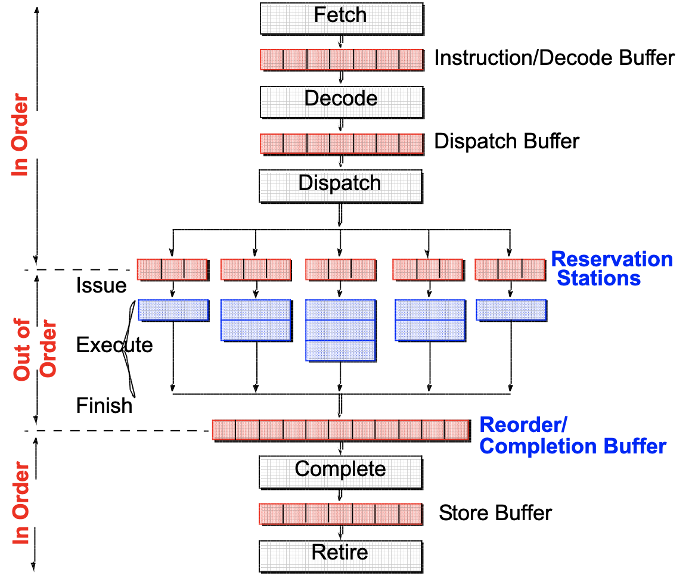

# Архитектура компьютера

## Лекция 11

### Stack. Superscalar. VLIW 堆。 超标量。 超长指令字

Пенской А.В., 2022

----

### План лекции

- Stack-Oriented Processors (ROSC)
- Суперскалярное исполнение и VLIW
- 面向堆栈的处理器（ROSC）
- 超标量执行和VLIW

---

## Stack-Oriented Processors or ROSC 面向堆栈的处理器或 ROSC

Reduced Operands Set Computer (скорее шутка, чем термин)  
减少操作数集计算机（与其说是一个术语，不如说是一个笑话）

Стек -- это одна из простейших структур данных, которая выступает коллекцией элементов с двумя основными операциями:  
堆栈是最简单的数据结构之一，它是具有两个主要操作的元素的集合：

- `push`, который добавляет элемент в коллекцию
- `pop`, который удаляет последний добавленный элемент из коллекции.
- `push`，将元素添加到集合中
- `pop`，从集合中删除最后添加的元素。

 <!-- .element height="300px" -->

----

### Вычисления на стеке 堆栈计算

 <!-- .element height="600" -->

----

### Forth

Лучшим примером организации вычислительного процесса через стек является язык программирования Forth.  
通过堆栈组织计算过程的最好例子是 Forth 编程语言。

Форт (англ. Forth)
: императивный язык программирования на основе стека. Особенности: структурное программирование, отражение (возможность исследовать и изменять структуру программы во время выполнения), последовательное программирование и расширяемость (новые команды).  
一种基于堆栈的命令式编程语言。 特点：结构化编程、反射（在运行时检查和更改程序结构的能力）、顺序编程和可扩展性（新命令）。

---

```text
 : fac recursive
   dup 1 > IF
      dup 1 - fac *
   else
      drop 1
   endif ;
```

----

```text
3 fac .
- [] Положить 3 в стек.
- [3] Выполнить слово fac.
  [3] Выполнить слово dup - дублирует самый верхний элемент стека.
    - [3, 3] Положить 1.
    - [3, 3, 1] Выполнить слово > - извлекает два значения из стека, 
                 сравнивает их и возвращает результат обратно.
    - [3, true] Извлечь значение из стека и выполнить dup 1 - fac *  
                т.к. оно true.
    - [3] Выполнить слово dup.
    - [3, 3] Положить 1.
    - [3, 3, 1] Выполнить слово '-' - извлекает два значения из стека, 
                вычитает их и возвращает результат обратно.
    - [3, 2] Выполнить слово fac рекурсивно.
        - ...
            - [3, 2, 1] Выполнить слово dup.
            - [3, 2, 1, 1] Положить 1.
            - [3, 2, 1, 1, 1] Выполнить слово >.
            - [3, 2, 1, false]  Извлечь значение из стека и выполнить 
                                `drop 1`, потому что `false`.
            - [3, 2, 1] Удалить одно значение из стека.
            - [3, 2] Положить 1. Почему мы удаляем 1 и кладем 1 снова? 
                     Нам это нужно на тот случай, если кто-то попытается 
                     вычислить '0 fac .'.
            - [3, 2, 1] Возврат.
        - ...
    - [3, 2] Выполнить слово * - взять два значения из стека, 
             перемножить их и поместить результат обратно.
    - [6].
```

----

#### Стековый процессор 堆栈处理器


----

#### Особенности стековых процессоров 堆栈处理器的特点


1. Система команд высокого уровня.  
   高层指挥系统。
    - Тривиальная поддержка выражений через обратную польскую нотацию:  
      通过逆波兰表示法对表达式的简单支持：  
      $X=(A+B)*(C+D)$ <br/> $\rightarrow$ `A B + C D + *`.
    - Естественная поддержка процедур, рекурсии.  
      自然支持过程、递归。
2. Быстрые и простые операции. Высокая производительность.  
   操作快速简便。 高性能。
3. Threads.
4. Cache-friendly.


- Сложность работы с: 合作困难：
    - динамическими структурами данных. Heap-ом.  
      动态数据结构。 堆。
    - структурами данных.  
      数据结构。


----

### G144A12


- F18A -- асинхронный форт процессор. 异步堡垒处理器。
- G11A12 -- multi-computer. 多电脑。
- With 144 independent computers, it enables parallel or pipelined programming.  
  拥有144台独立计算机，可实现并行或流水线编程。
- With instruction times as low as 1400 picoseconds and consuming as little as 7 picojoules of energy.  
  指令时间低至 1400 皮秒，消耗的能量低至 7 皮焦耳。
    - Частота исполнения инструкций порядка 700 MHz!  
      指令执行频率约为700 MHz！
- With completely programmable I/O pins.  
  具有完全可编程的 I/O 引脚。


Безумный стековый процессор из реального мира: 疯狂的现实世界堆栈处理器： [link](https://cyberleninka.ru/article/n/protsessory-greenarrays-ga144/pdf)

 <!-- .element height="500px" -->


---

## Параллелизм уровня инструкций 指令级并行性

Задача: повышение уровня утилизации ресурсов.  
目标：提高资源利用率。

- ресурс по обработке инструкций (декодер команд и т.п.);  
  处理指令的资源（命令解码器等）；
- ресурс по обработке данных (умножитель, делитель, FPU).  
  数据处理资源（乘法器、除法器、FPU）。

Основной подход: 基本做法：

- конвейер (было); 传送带（原）；
- суперскалярные вычисления; 超标量计算；
- VLIW.

----

### Суперскалярный процессор 超标量处理器


Скалярная величина 标量
: величина, которая может быть представлена числом (целочисленным или с плавающей точкой). 可以用数字（整数或浮点）表示的值。

Проблемы: 问题：

- разные операции выполняются в разное время (сумма, деление с плавающей точкой);  
  在不同时间执行不同的运算（浮点求和、除法）；
- если выполняется одна операция на стадии `Instruction Execute`, то много ресурсов простаивают.  
  如果在“指令执行”阶段执行一项操作，则许多资源处于空闲状态。


Решение: анализ потока инструкций на лету и автоматическая (прозрачная для программиста) параллелизация.  
解决方案：动态分析指令流并自动（对程序员透明）并行化。


----

#### Структура суперскалярного процессора 超标量处理器结构

 <!-- .element height="600" -->

Notes: 18-600 Foundations of Computer Systems, Carnegie Mellon University, J.P. Shen  
注释：18-600 计算机系统基础，卡内基梅隆大学，J.P. Shen

----

### Very Long Instruction Word (VLIW) 超长指令字


- Упростим процессор и улучшим энергопотребление, переложив работу на компилятор!  
  让我们通过将工作转移给编译器来简化处理器并提高功耗！
- Компилятор имеет больше информации о коде, он лучше знает, что параллельно!  
  编译器有更多关于代码的信息，它更好地知道什么是并行！
- Длинная инструкция включает группу параллельных инструкций для разных исполнителей.  
  长指令包括一组针对不同执行器的并行指令。


Проблемы: 问题：

- Низкая плотность кода.  
  低代码密度。
- Ширина команды -- огр. микроархитектуры.  
  团队宽度 - 限制。 微架构。
- Поток управления. Процедуры. Спекулятивные вычисления.  
  控制流。 程序。 推测性计算。


----


----

### Superscalar vs. VLIW 超标量与 VLIW

<!-- .element height="500" -->

*Question*: какие ещё могут быть вариации?  
*问题*：还有哪些其他变化？

----

### Superscalar, EPIC, Dynamic VLIW, VLIW 超标量、EPIC、动态 VLIW、VLIW


Notes: Understanding EPIC Architectures and Implementations, Mark Smotherman, <https://people.computing.clemson.edu/~mark/464/acmse_epic.pdf>

注释：了解 EPIC 架构和实现，Mark Smotherman，
