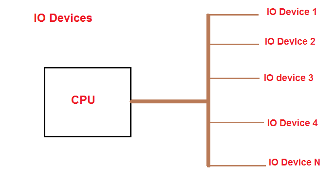
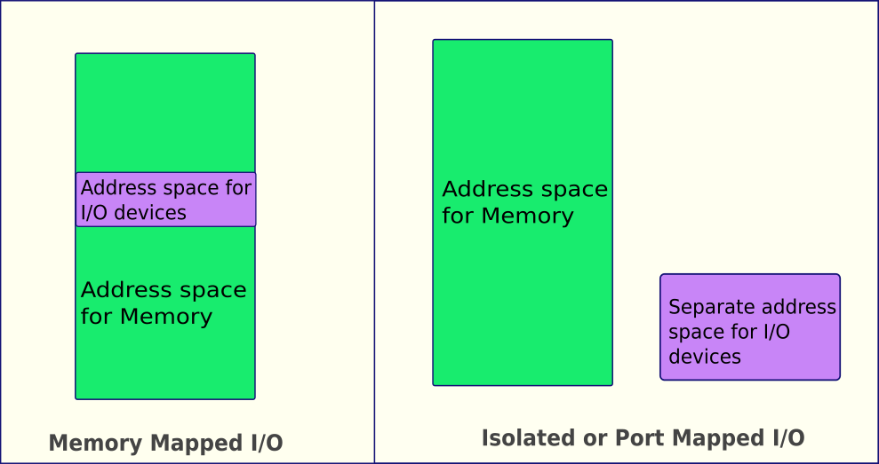
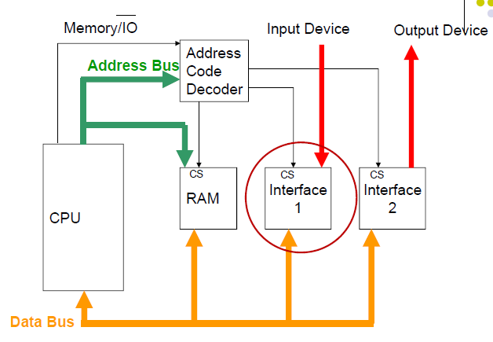
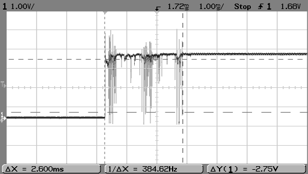
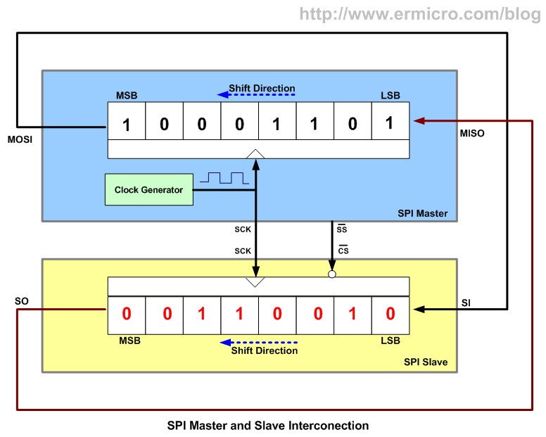
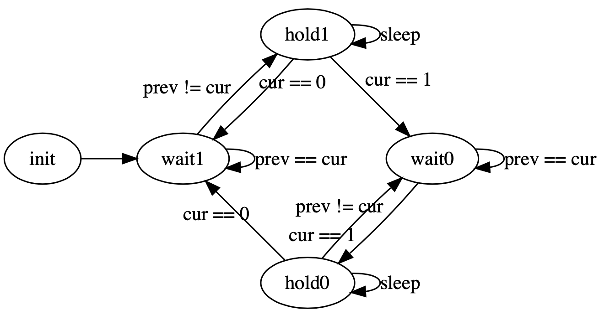
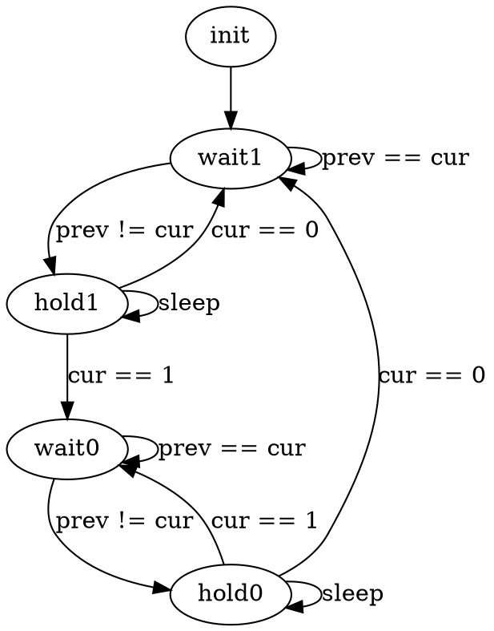
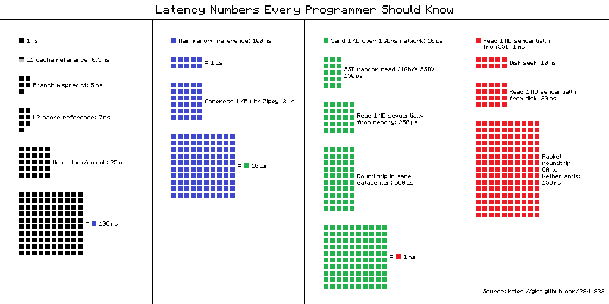
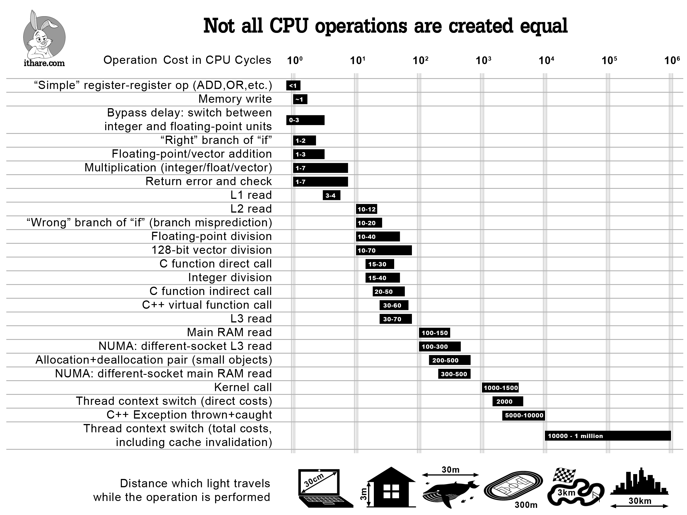

# Архитектура компьютера

## Лекция 12

### Программный ввод-вывод. Иерархия памяти. Кеширование

Пенской А.В., 2022

----

### План лекции

- Ввод-вывод. ISA
- Программно-управляемый ввод-вывод.
- Иерархия памяти

---

## Ввод-вывод

<div class="row"><div class="col">

1. **Программно-управляемый ввод-вывод** -- операции реализуются процессором. Все действия реализуются инструкциями процессора.
2. **Ввод-вывод по прерыванию**. Снимает с процессора задачу наблюдения и позволяет это реализовать по внешнему событию.
3. **Channel I/O и прямой доступ к памяти** (Direct Memory Access -- DMA). Процессор оповещается об операции завершения ввода-вывода.

</div><div class="col">



Сейчас рассмотрим только программно-управляемый ввод-вывод. Остальное -- в контексте параллелизма уровня задач.

</div></div>

----

### Ввод-вывод с точки зрения ISA

- Ввод-вывод через память. Memory-Mapped I/O (MMIO)
- Ввод-вывод через порты. Port-Mapped I/O (PMIO)



----

#### Ввод-вывод через память. <br/> Memory-Mapped I/O (MMIO)

<div class="row"><div class="col">

- Регистры внешних устройств отображаются в адресное пространство памяти.
- Ввод-вывод реализуется через инструкции доступа к памяти.
- Может быть реализован без изменения микроархитектуры процессора.

</div><div class="col">



</div></div>

----

<div class="row"><div class="col">

##### Достоинства MMIO

1. Простота процессора.
2. Единый набор механизмов доступа: (автоинкремент, векторные операции, работа с барьерами).
3. Обработка данных без переноса в память, применение функций.
4. Адресное пространство памяти условно бесконечно. Количество устройств условно не ограничено.

</div><div class="col">

##### Недостатки MMIO

1. Одна шина для ввода-вывода и доступа к памяти.
2. Неоднородность памяти, сложная конфигурация системы (включая инструментарий).
3. Конфликты с кешами и параллелизмом уровня инструкций:
    - flush при вводе-выводе;
    - порядок записи регистров.
4. Устройства ввода-вывода должны работать с избыточным адресом.
5. Возможно замедление работы, если ввод-вывод медленнее доступа к памяти.

</div></div>

----

#### Ввод-вывод через порты. <br/> Port-Mapped I/O (PMIO)

- Ввод-вывод реализуется через специализированные инструкции.
- Адресация устройств ввода-вывода не зависима от адресации памяти (Isolated I/O).

<div class="row"><div class="col">

##### Достоинства PMIO

1. Минимизация логики управления (малое адресное пространство). Оптимизация ввода-вывода.
2. Ввод-вывод и доступ к памяти явно разделены.
3. Адресное пространство однородно.
4. Простота системы в целом.

</div><div class="col">

##### Недостатки PMIO

1. Усложнение системы команд и процессора, реализующего её.
2. Данные ввода-вывода становятся данными второго сорта.
3. "Лишние" копирования данных.

</div></div>

---

### Программно-управляемый ввод-вывод

Примеры:

- получение информации от ключа
- SPI. Echo
- имитация параллелизма

Типичный подход к программированию:

1. Наблюдаем за состоянием устройства ввода-вывода.
2. Реагируем.

----

#### Пример: получение информации от ключа

Задача: посчитать количество нажатий на ключ.

```python
counter = 0

while True:
    if switch() == 1:
        counter += 1
```

Будет работать?

<div>

1. Нет, это не сигнал. Нам нужен фронт.
2. Нет, так как дребезг контактов.

 <!-- .element height="250px" -->

</div> <!-- .element: class="fragment" -->

----

- хранение `switch_prev` позволяет идентифицировать только смены состояний.
- `sleep` и повторная проверка позволяет избежать дребезга.

```python
counter = 0
switch_prev = switch() 

def sleep(ms):
    begin = now()
    while now() - begin < ms:
        pass
    
while True:
    switch_cur = switch()
    if switch_prev != switch_cur:
        if switch_cur == 1:
            sleep(200) # ms
            switch_cur = switch()
            if switch_cur == 1:
                counter += 1
                switch_prev = switch_cur
        if switch == 0:
            sleep(200) # ms
            switch_cur = switch()
            if switch_cur == 0:
                switch_prev = switch_cur
```

Проблемы?

----

##### Проблемы программно-управляемого ввода-вывода

1. Занимает процессор.
2. Процессор (алгоритм) должен регистрировать сигнал на частоте в два раза больше частоты сигнала (теорема Котельникова).
3. Потребляет много электроэнергии.
4. Как со сложным вводом-выводом?
5. Как совмещать с другими задачами?
6. Как совмещать несколько процессов?

----

#### Пример: Serial Peripheral Interface (SPI)


- **MOSI** или COPI -- выход ведущего, вход ведомого (Master Out Slave In). Передача данных от ведущего устройства ведомому.
- **MISO** или CIPO -- вход ведущего, выход ведомого (Master In Slave Out). Передача данных от ведомого устройства ведущему.
- **SCLK** или SCK — последовательный тактовый сигнал (англ. Serial Clock). Передача тактового сигнала для ведомых устройств.
- **CS** или SS — выбор микросхемы, выбор ведомого (англ. Chip Select, Slave Select).

----

<div class="row"><div class="col">

##### Временная диаграмма SPI


</div><div class="col">

##### Устройство SPI передатчиков



</div></div>

Почему сигнал CS устанавливает по нулевому значению?

RST <!-- .element: class="fragment" -->

---

#### Параллелизм ввода-вывода <br/> через конечные автоматы

Задача: посчитать количество нажатий на два ключа независимо.

Варианты реализации:

<div>

- усложняем цикл в лоб;
- разрываем поток управления в конечный автомат.

</div> <!-- .element: class="fragment" -->

----

<div class="row"><div class="col">

##### Разрываем поток управления <br/> в конечный автомат

Исполнение автомата прерывается после каждого перехода.



```python
class Counter():
  def __init__(self):
    self.state = 'wait1'
    self.counter = 0
    self.begin = None
    self.switch_prev = 0
```

</div><div class="col">

```python
def process(self, switch_cur):
  if self.state == 'wait1':
    if self.switch_prev != switch_cur:
      self.state = 'hold1'
      self.begin = now()
  elif state == 'hold1':
    if now() - self.begin > delay: 
      if switch_cur == 0:
        self.state = 'wait1'
        self.begin = None
      elif switch_cur == 1:
        self.state = 'wait0'
        self.counter += 1
        self.begin = None
        self.switch_prev = 1
  elif self.state == 'wait0':
    if self.switch_prev != switch_cur:
      self.state = 'hold0'
      self.begin = now()
  elif state == 'hold0':
    if now() - self.begin > delay: 
      if switch_cur == 0:
        self.state = 'wait1'
        self.begin = None
        self.switch_prev = 1
      elif switch_cur == 0:
        self.state = 'wait0'
        self.begin = None
```

</div></div>

Notes:



----

##### Запускаем циклы

```python
counter1 = Counter()
counter2 = Counter()

while True:
    counter1.process(switch1())
    counter2.process(switch2())
```

Особенности реализации:

1. ООП в примере используется из-за отсутствия указателей и нежелания переходить на Си.
2. `now()` -- лучше вынести на уровень цикла.
3. Инициализация сделана некорректно.
4. Все проблемы сохранились, кроме параллелизма.
5. В современном программировании: `async`/`await`, `yield`, `closure`/`callback`.

---

## Выходим за процессор <br/> и одну задачу

- Ранее мы говорили в первую очередь о вариациях процессоров с точки зрения системы команд для одной задачи.
- Сейчас мы сместимся за пределы процессора и одной задачи:
    - Память. Кеширование.
    - Параллелизм уровня задач. Изоляция.
    - Классификация Флинна.
- А потом (сколько и что успеем):
    - Собираем целое. Уровневая организация компьютера.
    - Распределённые системы и подходы к их программированию.
    - Системы вне доверительного окружения.

*Вопрос*: Что вам интереснее из двух последних пунктов? <br/> (не факт, что всё успеем)

---

## Иерархия памяти

<div class="row"><div class="col">

Задачи:

- хранение исходных данных, необходимых для работы системы (ПО, настройки, начальные значения);
- хранение и обновление рабочих данных (видеопоток, данные для расчетов, текстовый документ).

Проблема: с ростом скорости памяти растёт её стоимость (производства и размещения в нужном месте).

*Почему она нерешаема?*

</div><div class="col">


`+` Сетевые хранилища.

Чем выше -- тем быстрее и дороже. <br/> Чем ниже -- тем больше и дешевле.

</div></div>

Notes:

- память, размещённая в процессоре (по крайней мере сегодня):
    - регистры (работают на частоте процессора);
    - кеши (могут также работать на частоте процессора, кеш первого уровня имеет возможность доступа к данным за один такт);
- основная / физическая / оперативная память, как правило, размещённая в непосредственной близости от процессора с высокоскоростным произвольным доступом (но намного более медленным, по сравнению с внутрипроцессорной памятью);
- твердотельные накопители, энергонезависимая память, позволяющая хранить большой объём данных и обеспечивающая произвольный доступ к ней;
- механические накопители.

----

### Визуализация примечательных задержек 1



----

### Визуализация примечательных задержек 2

 <!-- .element height="600px" -->

---

## Типы доступа к памяти

- с произвольным доступом (задержка не зависит от истории запросов);
- с последовательным доступом (включая потоковый доступ, магнитные накопители, [AWS Tape Gateway](https://aws.amazon.com/storagegateway/vtl/));
- гибридные варианты: библиотека магнитных лент, векторные операции.

Примечания:

- Последовательный доступ, часто, означает длительную задержку при смене адреса.
- Последовательный доступ, часто, обладает высокой последовательной скоростью.

Наш фокус: от процессора до основной памяти. В другие места и виды вникать не будем (кроме прикольных отступлений).
