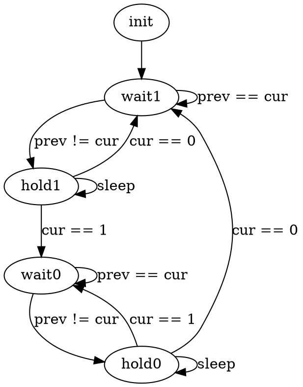

# Архитектура компьютера

## Лекция 12

### Программный ввод-вывод. Иерархия памяти. Кеширование 软件输入/输出。 内存的层次结构。 缓存

Пенской А.В., 2022

----

### План лекции

- Ввод-вывод. ISA 
- Программно-управляемый ввод-вывод.
- Иерархия памяти

---

- 输入输出。 ISA
- 软件控制的 I/O。
- 内存的层次结构

---

## Ввод-вывод


1. **Программно-управляемый ввод-вывод** -- операции реализуются процессором. Все действия реализуются инструкциями процессора.  
   **软件控制的 I/O** - 操作由处理器实现。 所有动作均由处理器指令实现。
2. **Ввод-вывод по прерыванию**. Снимает с процессора задачу наблюдения и позволяет это реализовать по внешнему событию.  
   **通过中断进行I/O**。 从处理器中删除监视任务并允许它基于外部事件来实现。
3. **Channel I/O и прямой доступ к памяти** (Direct Memory Access -- DMA). Процессор оповещается об операции завершения ввода-вывода.  
   **通道 I/O 和直接内存访问**（直接内存访问 - DMA）。 通知处理器 I/O 操作已完成。


Сейчас рассмотрим только программно-управляемый ввод-вывод. Остальное -- в контексте параллелизма уровня задач.  
现在我们只考虑软件控制的 I/O。 其余的都是在任务级并行的背景下进行的。


----

### Ввод-вывод с точки зрения ISA 从 ISA 角度看 I/O

- Ввод-вывод через память. Memory-Mapped I/O (MMIO)  
  通过内存输入/输出。 内存映射 I/O (MMIO)
- Ввод-вывод через порты. Port-Mapped I/O (PMIO)  
  通过端口输入/输出。 端口映射 I/O (PMIO)


----

#### Ввод-вывод через память. <br/> Memory-Mapped I/O (MMIO) <br/> 通过内存进行 I/O。 <br/>内存映射 I/O (MMIO)


- Регистры внешних устройств отображаются в адресное пространство памяти.
- Ввод-вывод реализуется через инструкции доступа к памяти.
- Может быть реализован без изменения микроархитектуры процессора.
- 外部设备寄存器映射到内存地址空间。
- I/O是通过内存访问指令实现的。
- 无需更改处理器微架构即可实现。


----


##### Достоинства MMIO MMIO的优点

1. Простота процессора.  
   处理器的简单性。
2. Единый набор механизмов доступа: (автоинкремент, векторные операции, работа с барьерами).  
   一套统一的访问机制：（自动增量、向量操作、与障碍一起工作）。
3. Обработка данных без переноса в память, применение функций.  
   处理数据而不将其传输到内存，应用函数。
4. Адресное пространство памяти условно бесконечно. Количество устройств условно не ограничено.  
   内存地址空间有条件地是无限的。 设备数量有条件限制。


##### Недостатки MMIO MMIO的缺点

1. Одна шина для ввода-вывода и доступа к памяти.  
   一根总线用于 I/O 和内存访问。
2. Неоднородность памяти, сложная конфигурация системы (включая инструментарий).  
   内存异构，系统配置复杂（包括工具）。
3. Конфликты с кешами и параллелизмом уровня инструкций:  
   与缓存和指令级并行性的冲突：
    - flush при вводе-выводе;  
      刷新 I/O； 
    - порядок записи регистров.  
      记录寄存器的顺序。
4. Устройства ввода-вывода должны работать с избыточным адресом.  
   I/O 设备必须使用冗余地址进行操作。
5. Возможно замедление работы, если ввод-вывод медленнее доступа к памяти.  
   如果 I/O 慢于内存访问，性能可能会降低。


----

#### Ввод-вывод через порты. <br/> Port-Mapped I/O (PMIO) <br/> 通过端口进行 I/O。 <br/> 端口映射 I/O (PMIO)

- Ввод-вывод реализуется через специализированные инструкции.
- Адресация устройств ввода-вывода не зависима от адресации памяти (Isolated I/O).  
- I/O是通过专门的指令实现的。
- I/O 设备的寻址独立于内存寻址（隔离 I/O）。


##### Достоинства PMIO PMIO的优点

1. Минимизация логики управления (малое адресное пространство). Оптимизация ввода-вывода.  
   控制逻辑最小化（小地址空间）。 I/O 优化。
2. Ввод-вывод и доступ к памяти явно разделены.  
   I/O 和内存访问明确分开。
3. Адресное пространство однородно.  
   地址空间是同质的。
4. Простота системы в целом.  
   系统整体的简单性。


##### Недостатки PMIO PMIO 的缺点

1. Усложнение системы команд и процессора, реализующего её.  
   指令系统和实现它的处理器的复杂化。
2. Данные ввода-вывода становятся данными второго сорта.  
   I/O 数据成为二等数据。
3. "Лишние" копирования данных.  
   “额外”数据复制。


---

### Программно-управляемый ввод-вывод 软件控制的 I/O

Примеры:

- получение информации от ключа  
  从密钥接收信息
- SPI. Echo SPI。 回声
- имитация параллелизма 并行模拟

Типичный подход к программированию:  
典型的编程方法：

1. Наблюдаем за состоянием устройства ввода-вывода.  
   观察I/O设备的状态。
2. Реагируем.  
   做出反应。

----

#### Пример: получение информации от ключа 示例：从密钥获取信息

Задача: посчитать количество нажатий на ключ.  
任务：计算按键的次数。

```python
counter = 0

while True:
    if switch() == 1:
        counter += 1
```

Будет работать? 将工作？

<div>

1. Нет, это не сигнал. Нам нужен фронт.  
   不，这不是信号。 我们需要一个前线。
2. Нет, так как дребезг контактов.  
   不，因为接触反弹。

 <!-- .element height="250px" -->

</div> <!-- .element: class="fragment" -->

----

- хранение `switch_prev` позволяет идентифицировать только смены состояний.  
  存储 `switch_prev` 允许您仅识别状态更改。
- `sleep` и повторная проверка позволяет избежать дребезга.
  `sleep` 和重新检查可以让您避免反弹

```python
counter = 0
switch_prev = switch() 

def sleep(ms):
    begin = now()
    while now() - begin < ms:
        pass
    
while True:
    switch_cur = switch()
    if switch_prev != switch_cur:
        if switch_cur == 1:
            sleep(200) # ms
            switch_cur = switch()
            if switch_cur == 1:
                counter += 1
                switch_prev = switch_cur
        if switch == 0:
            sleep(200) # ms
            switch_cur = switch()
            if switch_cur == 0:
                switch_prev = switch_cur
```

Проблемы?

----

##### Проблемы программно-управляемого ввода-вывода 软件控制的 I/O 问题

1. Занимает процессор.  
   占用处理器。
2. Процессор (алгоритм) должен регистрировать сигнал на частоте в два раза больше частоты сигнала (теорема Котельникова).  
   处理器（算法）必须以信号频率两倍的频率注册信号（Kotelnikov 定理）。
3. Потребляет много электроэнергии.  
   耗电量大。
4. Как со сложным вводом-выводом?  
   复杂的I/O 怎么样？
5. Как совмещать с другими задачами?  
   如何与其他任务结合？
6. Как совмещать несколько процессов?  
   如何将多个流程结合起来？

----

#### Пример: Serial Peripheral Interface (SPI) 示例：串行外设接口 (SPI)


- **MOSI** или COPI -- выход ведущего, вход ведомого (Master Out Slave In). Передача данных от ведущего устройства ведомому.  
  **MOSI** 或 COPI - 主输出、从输入（Master Out Slave In）。 从主机向从机传输数据。
- **MISO** или CIPO -- вход ведущего, выход ведомого (Master In Slave Out). Передача данных от ведомого устройства ведущему.  
  **MISO** 或 CIPO - 主输入，从输出（主输入从输出）。 将数据从从设备传输到主设备。
- **SCLK** или SCK — последовательный тактовый сигнал (англ. Serial Clock). Передача тактового сигнала для ведомых устройств.  
  **SCLK** 或 SCK - 串行时钟信号。 从设备的时钟传输。
- **CS** или SS — выбор микросхемы, выбор ведомого (англ. Chip Select, Slave Select).  
  **CS** 或 SS — 芯片选择、从机选择（Chip Select、Slave Select）。

----


##### Временная диаграмма SPI


##### Устройство SPI передатчиков


Почему сигнал CS устанавливает по нулевому значению?  
为什么CS信号设置为零？

RST <!-- .element: class="fragment" -->

---

#### Параллелизм ввода-вывода <br/> через конечные автоматы <br/> 通过有限状态机的 I/O 并行性

Задача: посчитать количество нажатий на два ключа независимо.  
任务：计算两个按键独立按下的次数。

Варианты реализации:  
实施方案：

<div>

- усложняем цикл в лоб;  
  我们直接使循环复杂化；
- разрываем поток управления в конечный автомат.  
  我们将控制流分解为有限状态机。

</div> <!-- .element: class="fragment" -->

----


##### Разрываем поток управления в конечный автомат <br/>  将控制流分解为状态机

Исполнение автомата прерывается после каждого перехода.  
每次转换后机器的执行都会中断。


```python
class Counter():
  def __init__(self):
    self.state = 'wait1'
    self.counter = 0
    self.begin = None
    self.switch_prev = 0
```


```python
def process(self, switch_cur):
  if self.state == 'wait1':
    if self.switch_prev != switch_cur:
      self.state = 'hold1'
      self.begin = now()
  elif state == 'hold1':
    if now() - self.begin > delay: 
      if switch_cur == 0:
        self.state = 'wait1'
        self.begin = None
      elif switch_cur == 1:
        self.state = 'wait0'
        self.counter += 1
        self.begin = None
        self.switch_prev = 1
  elif self.state == 'wait0':
    if self.switch_prev != switch_cur:
      self.state = 'hold0'
      self.begin = now()
  elif state == 'hold0':
    if now() - self.begin > delay: 
      if switch_cur == 0:
        self.state = 'wait1'
        self.begin = None
        self.switch_prev = 1
      elif switch_cur == 0:
        self.state = 'wait0'
        self.begin = None
```


Notes:



----

##### Запускаем циклы 运行周期

```python
counter1 = Counter()
counter2 = Counter()

while True:
    counter1.process(switch1())
    counter2.process(switch2())
```

Особенности реализации: 实现特点：

1. ООП в примере используется из-за отсутствия указателей и нежелания переходить на Си.  
   示例中使用OOP，因为缺少指针，不愿意改用C。
2. `now()` -- лучше вынести на уровень цикла.  
   `now()` - 最好将其移至循环级别。
3. Инициализация сделана некорректно.  
   初始化不正确。
4. Все проблемы сохранились, кроме параллелизма.  
   除了并行性之外，所有问题仍然存在。
5. В современном программировании: `async`/`await`, `yield`, `closure`/`callback`.  
   现代编程中：`async`/`await`、`yield`、`closure`/`callback`。

---

## Выходим за процессор <br/> и одну задачу

- Ранее мы говорили в первую очередь о вариациях процессоров с точки зрения системы команд для одной задачи.  
  之前，我们主要从一项任务的指令系统的角度讨论了处理器的变化。
- Сейчас мы сместимся за пределы процессора и одной задачи:  
  现在我们将超越处理器和一项任务：
    - Память. Кеширование.  
      记忆。 缓存。
    - Параллелизм уровня задач. Изоляция.  
      任务级并行性。 绝缘。
    - Классификация Флинна.  
      弗林分类。
- А потом (сколько и что успеем):  
  然后（我们可以做什么，做多少）：
    - Собираем целое. Уровневая организация компьютера.  
      我们收集整个东西。 计算机的层次组织。
    - Распределённые системы и подходы к их программированию.  
      分布式系统及其编程方法。
    - Системы вне доверительного окружения.  
      受信任环境之外的系统。

*Вопрос*: Что вам интереснее из двух последних пунктов? <br/> (не факт, что всё успеем)  
*问题*：您对最后两点哪一点更感兴趣？ <br/>（事实上我们并没有时间做所有事情）

---

## Иерархия памяти 内存的层次结构


Задачи: 任务：

- хранение исходных данных, необходимых для работы системы (ПО, настройки, начальные значения);  
  存储系统运行所需的初始数据（软件、设置、初始值）；
- хранение и обновление рабочих данных (видеопоток, данные для расчетов, текстовый документ).  
  存储系统运行所需的初始数据（软件、设置、初始值）；

Проблема: с ростом скорости памяти растёт её стоимость (производства и размещения в нужном месте).  
问题：随着内存速度的提高，其成本（生产和放置在正确的位置）也会增加。

*Почему она нерешаема?*  
*为什么无法解决？*


`+` Сетевые хранилища. 网络存储。

Чем выше -- тем быстрее и дороже.  
越高、越快、越贵
Чем ниже -- тем больше и дешевле.  
越低，越大，越便宜。


Notes:

- память, размещённая в процессоре (по крайней мере сегодня):  
  位于处理器中的内存（至少在今天）：
    - регистры (работают на частоте процессора);  
      寄存器（以处理器频率运行）；
    - кеши (могут также работать на частоте процессора, кеш первого уровня имеет возможность доступа к данным за один такт);  
      高速缓存（也可以以处理器速度运行，一级高速缓存具有在一个时钟周期内访问数据的能力）；
- основная / физическая / оперативная память, как правило, размещённая в непосредственной близости от процессора с высокоскоростным произвольным доступом (но намного более медленным, по сравнению с внутрипроцессорной памятью);  
  主/物理/RAM，通常位于靠近处理器的位置，具有高速随机存取（但与片上存储器相比慢得多）； 
- твердотельные накопители, энергонезависимая память, позволяющая хранить большой объём данных и обеспечивающая произвольный доступ к ней;  
  固态硬盘、非易失性存储器，允许您存储大量数据并提供对其的随机访问；
- механические накопители.  
  机械存储设备。

----

### Визуализация примечательных задержек 1 显着延迟的可视化 1


----

### Визуализация примечательных задержек 2 显着延迟的可视化 2

 <!-- .element height="600px" -->

---

## Типы доступа к памяти 内存访问的类型

- с произвольным доступом (задержка не зависит от истории запросов);  
  随机访问（延迟不依赖于请求历史记录）；
- с последовательным доступом (включая потоковый доступ, магнитные накопители, [AWS Tape Gateway](https://aws.amazon.com/storagegateway/vtl/));  
  具有顺序访问（包括流式访问、磁存储、[AWS 磁带网关](https://aws.amazon.com/storagegateway/vtl/)）；
- гибридные варианты: библиотека магнитных лент, векторные операции.  
  混合选项：磁带库、矢量操作。

Примечания:

- Последовательный доступ, часто, означает длительную задержку при смене адреса.  
  顺序访问通常意味着更改地址时的长时间延迟。
- Последовательный доступ, часто, обладает высокой последовательной скоростью.  
  串行访问通常具有较高的顺序速度。

Наш фокус: от процессора до основной памяти. В другие места и виды вникать не будем (кроме прикольных отступлений).  
我们的重点：从处理器到主内存。 我们不会深入研究其他地方和类型（除了很酷的题外话）。
