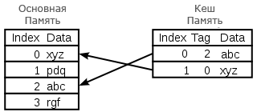

# Архитектура компьютера

## Лекция 13

### Иерархия памяти. Кеширование

Пенской А.В., 2022

----

### План лекции

- Устройство памяти с произвольным доступом: ROM, SRAM, DRAM.
- Кеширование
    - Принципы работы

---

## Устройство памяти с произвольным доступом

Массив ячеек памяти $4x3$   (4 слова по 3 бита)

- `Address` -- адрес ячейки памяти шириной 2 бита.
- `Decoder` -- [дешифратор](https://ru.wikipedia.org/wiki/Дешифратор), активирует линию.
- `wordline_i` -- линия, активирующая взаимодействие с ячейками одного машинного слова.
- `bitline_i` -- линия, на которую выставляется/читается значение бита определённой позиции.
- `stored bit` -- ячейка памяти.

----

### Технология реализации битовых ячеек

Существует много вариантов реализации ячейки.

| Memory Type | Transistors*Bit | Latency | Capacity   | Cost/GB     |
| ----------- | ------------------- | ------- | ---------- | ----------- |
| flip-flop   | ~20                 | 20 ps   | ~1-5KB     | a lot of $  |
| SRAM        | 6                   | 1-10 ns | ~10KB-10MB | ~$1000      |
| DRAM        | 1                   | 80 ns   | ~10G       | ~$10        |

Notes: <https://computationstructures.org/lectures/caches/caches.html>

----

### Read Only Memory (ROM) Cell

Память только для чтения.

Способы реализации:

- Физическое [не]размещение транзисторов (при производстве);
- Пережигание перемычек (однократное программирование, см. [PROM](https://ru.wikipedia.org/wiki/PROM)).

 <!-- .element height="600px" -->

---

### Static Random Access Memory (SRAM)

Хранение данных при помощи **состояния группы транзисторов**. Особенности:

- быстрый доступ на чтение и запись;
- значение хранится до отключения питания;
- требует довольно большое количество транзисторов (низкая плотность ячеек).

----

#### SRAM Array

 <!-- .element height="600px" -->

----

#### SRAM Read

----

#### SRAM Write

----

#### SRAM Multiport

---

### Dynamic Random Access Memory (DRAM)

Динамическая память, состояние хранится **в конденсаторе**.

- состояние конденсатора можно считать лишь раз;
- состояние конденсатора утекает;
- требуется контроллер памяти для *регенерации*;
    - увеличивает скорость доступа;
    - блокирует доступ к памяти на регенерацию.
- один транзистор и конденсатор на ячейку памяти.

----

#### DRAM Read/Write

---

## Иерархия памяти. Способ доступа

---

<!-- ## Кеширование. Необходимость

| Computer Action        | Avg Latency | Distance from Processor for Light |
| ---------------------- | ----------- | --------------------------------- |
| 3Ghz CPU 1-clock cycle | 0.3 ns      | 10 cm                             |
| Level 1 cache access   | 1 ns        | 30 cm                             |
| Level 2 cache access   | 2.8 ns      | 85 cm                             |
| Level 3 cache access   | 12.9 ns     | 4 m                               |
| RAM                    | 70-100 ns   | 20-30 m                           |
| NVMe SSD I/O           | 7-150 us    | 2-240 km                          |
| Rotational disk I/O    | 1-10 ms     | 300-3000 km                       |
| Internet               | 100+ ms     | 30000+ km (экватор ~ 40000)       |

--- -->

## Кеширование

Кеш
: промежуточный буфер с быстрым доступом, содержащий информацию, которая может быть запрошена с наибольшей вероятностью.

Зачем?

- Целесообразен, если доступ к памяти неравномерный.
- Быстрее и меньше основной памяти.
- Смена интерфейса (процессор -- кеш -- память).

----

Кеши применяются на всех уровнях компьютерных систем, но мы обсуждаем процессоры.

Встроенное противоречие:

1. Когда наборы данных очень большие, кеши плохо работают и имеют низкую временную или пространственную локальность.
2. Когда кеши работают хорошо, локальность очень высока, то есть по определению большая часть кеша простаивает большую часть времени.

Notes: [John L. Hennessy, David A. Patterson Новый золотой век для компьютерной архитектуры](https://habr.com/en/post/440760/))

----

### Принцип функционирования кеша

1. Кеш состоит из набора записей (блоков кеша, кеш-линий).
1. Запись ассоциирована с элементом в медленной памяти.
1. Запись имеет идентификатор (тег), определяющий соответствие.
1. Доступ к памяти реализуется прозрачно.
1. Память может быть изменена вне зависимости от кеша: DMA, другое ядро.

---

### Чтение данных из кеша

- Тег не найден $\rightarrow$ *кеш-промах (cache miss)*. Запрашиваем данные из памяти. Длительность непредсказуема:
    - кеш уже занят (типовая ситуация) $\rightarrow$ решение о вытеснении / замещении;
    - иерархия кешей;
    - доступ к памяти может быть заблокирован другим процессом или внутренними процессами памяти.
- Тег найден $\rightarrow$ *кеш-попадание (cache hit)*. Данные из кеша передаются в процессор.
- Чем выше *уровень попадания (hit rate)*, тем эффективнее кеш.

----

#### Запись данных в кеш. Варианты

1. *Немедленная запись* (сквозная, write-through). Изменение вызывает синхронное обновление памяти. Иногда медленнее, чем вообще без кеша, зато предсказуемо.
2. *Отложенная запись* (обратная запись, write-back). Обновление памяти при вытеснении данных, периодически или по запросу. Группировка обновлений, сокрытие промежуточных состояний.
    - Признак модификации (изменённый или «грязный»).
    - Может потребовать два обращения к памяти: для записи вытесняемого, для чтения необходимого.
    - Обратная запись может приводить к не консистентному состоянию кеша и памяти. Для самого процессора незаметна, но при доступе "других" (DMA...) кеш должен быть записан принудительно.
3. *Гибридные варианты*. Пример: немедленная запись с буферизацией.

----

#### Виды кеш-промахов

- **По чтению инструкций**. Самая большая задержка. Процессор вынужден простаивать в ожидании инструкции.
- **По чтению данных**. Меньшая задержка, так как возможно выполнение несвязанных инструкций (см. суперскаляр, reordering).
- **По записи данных**. Минимальная задержка, т.к. запись может быть поставлена в очередь.

----

### Кеш. Вытеснение / замещение

- Эвристика предсказания, какая строка вероятнее всего не потребуется для последующих операций.

- В процессорах применяются достаточно простые алгоритмы (скорость и размер реализации):
    - Least recently used (LRU);
    - Pseudo-LRU.

- Возможные оптимизации:
    - Запрет кеширования;
    - Victim Cache.

Access sequence: `A B C D E D F`

----

#### Pseudo-LRU

- Each node of the tree has a one-bit flag denoting "go left to insert a pseudo-LRU element" or "go right to insert a pseudo-LRU element".
- To find a pseudo-LRU element, traverse the tree according to the values of the flags.
- To invert nodes on the path from the root to a leaf.

Access sequence: `A B C D E`

----

#### Уровни кеширования в процессорах 1

- `L0` (Level 0 Cache, опция) -- специализированный кеш для: стека, целых чисел или с плавающей точкой. Обычно доступ за такт.
- `L1` -- быстрый кеш, неотъемлемая часть процессора. Обычно разделён:
    - кеш инструкций;
    - кеш данных;
    - частота процессора, более 1 оп. за такт;
    - Pentium 4 -- кеширование инструкций на уровне микроинструкций.

----

#### Уровни кеширования в процессорах 2

- `L2`, обычно часть процессора. От 128 Кбайт до 1-12 Мбайт. Обычно разделяется между ядрами.
- `L3` до 24 Мбайт и более. Используется для синхронизации данных между ядрами при параллельных вычислениях.
- `L4` -- экзотика для высокопроизводительных серверов и мейнфреймов. Ускорение канала к памяти. Обычно отдельная микросхема.

L0--L3 -- SRAM; L4 -- DRAM. Зачем столько?

