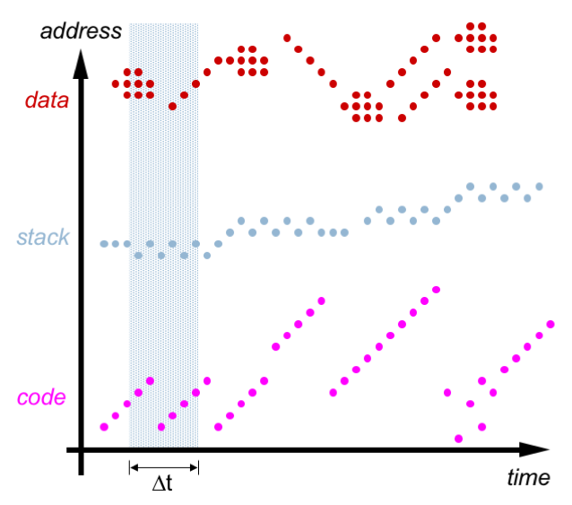

# Архитектура компьютера

## Лекция 13

### Иерархия памяти. Кеширование 内存层次结构。 缓存

Пенской А.В., 2022

----

### План лекции

- Устройство памяти с произвольным доступом: ROM, SRAM, DRAM.
- Кеширование
    - Принципы работы
  
---

- 随机存取存储器设备：ROM、SRAM、DRAM。
- 缓存
    - 工作原则

---

## Устройство памяти с произвольным доступом 随机存取存储器设备

Массив ячеек памяти $4x3$   (4 слова по 3 бита)  
存储单元数组 $4x3$  （4 个字，3 位）

- `Address` -- адрес ячейки памяти шириной 2 бита.  
  `Address` -- 2 位宽的存储单元地址。
- `Decoder` -- [дешифратор](https://ru.wikipedia.org/wiki/Дешифратор), активирует линию.  
  `Decoder` -- [decoder](https://ru.wikipedia.org/wiki/Decoder)，激活线路。
- `wordline_i` -- линия, активирующая взаимодействие с ячейками одного машинного слова.  
  `wordline_i` - 激活与一个机器字的单元格交互的一行。
- `bitline_i` -- линия, на которую выставляется/читается значение бита определённой позиции.  
  `bitline_i` - 设置/读取某个位置的位值的行。
- `stored bit` -- ячейка памяти.  
  `存储位` -- 存储单元。

----

### Технология реализации битовых ячеек 位单元实现技术

Существует много вариантов реализации ячейки. 实现单元有多种选择。

| Memory Type | Transistors*Bit | Latency | Capacity   | Cost/GB     |
| ----------- | ------------------- | ------- | ---------- | ----------- |
| flip-flop   | ~20                 | 20 ps   | ~1-5KB     | a lot of $  |
| SRAM        | 6                   | 1-10 ns | ~10KB-10MB | ~$1000      |
| DRAM        | 1                   | 80 ns   | ~10G       | ~$10        |

Notes: <https://computationstructures.org/lectures/caches/caches.html>

----

### Read Only Memory (ROM) Cell 只读存储器 (ROM) 单元

Память только для чтения.  
只读存储器。

Способы реализации:  
实施方法：

- Физическое [не]размещение транзисторов (при производстве);  
  晶体管的物理[非]放置（在生产过程中）；
- Пережигание перемычек (однократное программирование, см. [PROM](https://ru.wikipedia.org/wiki/PROM)).  
  跳线烧坏（一次性编程，请参阅 [PROM](https://ru.wikipedia.org/wiki/PROM)）。

 <!-- .element height="600px" -->

---

### Static Random Access Memory (SRAM) 静态随机存取存储器 (SRAM)

Хранение данных при помощи **состояния группы транзисторов**. Особенности:  
使用**一组晶体管的状态**存储数据。 特点：

- быстрый доступ на чтение и запись;  
  快速读写访问；
- значение хранится до отключения питания;  
  该值被存储直到电源关闭；
- требует довольно большое количество транзисторов (низкая плотность ячеек).  
  需要相当大量的晶体管（低单元密度）。

----

#### SRAM Array

 <!-- .element height="600px" -->

----

#### SRAM Read

----

#### SRAM Write

----

#### SRAM Multiport

---

### Dynamic Random Access Memory (DRAM) 动态随机存取存储器 (DRAM)

Динамическая память, состояние хранится **в конденсаторе**.  
动态存储器，状态存储**在电容器**中。

- состояние конденсатора можно считать лишь раз;  
  电容器的状态只能计数一次；
- состояние конденсатора утекает;  
  电容器的状况是否漏电；
- требуется контроллер памяти для *регенерации*;  
  *再生*需要内存控制器；
    - увеличивает скорость доступа;  
      提高访问速度；
    - блокирует доступ к памяти на регенерацию.  
      阻止对内存的访问以进行再生。
- один транзистор и конденсатор на ячейку памяти.  
  每个存储单元一个晶体管和一个电容器。

----

#### DRAM Read/Write

---

## Иерархия памяти. Способ доступа 内存的层次结构。 接入方式

---

<!-- ## Кеширование. Необходимость

| Computer Action        | Avg Latency | Distance from Processor for Light |
| ---------------------- | ----------- | --------------------------------- |
| 3Ghz CPU 1-clock cycle | 0.3 ns      | 10 cm                             |
| Level 1 cache access   | 1 ns        | 30 cm                             |
| Level 2 cache access   | 2.8 ns      | 85 cm                             |
| Level 3 cache access   | 12.9 ns     | 4 m                               |
| RAM                    | 70-100 ns   | 20-30 m                           |
| NVMe SSD I/O           | 7-150 us    | 2-240 km                          |
| Rotational disk I/O    | 1-10 ms     | 300-3000 km                       |
| Internet               | 100+ ms     | 30000+ km (экватор ~ 40000)       |

--- -->

## Кеширование 缓存

Кеш 缓存
: промежуточный буфер с быстрым доступом, содержащий информацию, которая может быть запрошена с наибольшей вероятностью.  
快速访问中间缓冲区，包含最有可能被请求的信息。

Зачем? 为了什么？

- Целесообразен, если доступ к памяти неравномерный.  
  如果内存访问不均匀，则很有用。
- Быстрее и меньше основной памяти.  
  更快、更少的主内存。
- Смена интерфейса (процессор -- кеш -- память).  
  接口的改变（处理器-高速缓存-内存）。

----

Кеши применяются на всех уровнях компьютерных систем, но мы обсуждаем процессоры.  
缓存用于计算机系统的各个级别，但我们讨论的是处理器。

Встроенное противоречие:  
内在矛盾：

1. Когда наборы данных очень большие, кеши плохо работают и имеют низкую временную или пространственную локальность.  
   当数据集非常大时，缓存性能较差，并且时间或空间局部性较低。
2. Когда кеши работают хорошо, локальность очень высока, то есть по определению большая часть кеша простаивает большую часть времени.  
   当缓存性能良好时，局部性非常高，这意味着根据定义，大部分缓存在大多数时间都是空闲的。

Notes: [John L. Hennessy, David A. Patterson Новый золотой век для компьютерной архитектуры](https://habr.com/en/post/440760/)

----

### Принцип функционирования кеша 缓存的工作原理

1. Кеш состоит из набора записей (блоков кеша, кеш-линий).  
   缓存由一组条目（缓存块、缓存行）组成
2. Запись ассоциирована с элементом в медленной памяти.  
   该条目与慢速存储器中的元素相关联。
3. Запись имеет идентификатор (тег), определяющий соответствие.  
   该条目具有标识匹配项的标识符（标签）。
4. Доступ к памяти реализуется прозрачно.  
   内存访问是透明实现的。
5. Память может быть изменена вне зависимости от кеша: DMA, другое ядро.  
   无论缓存如何，内存都可以更改：DMA、不同核心。

---

### Чтение данных из кеша 从缓存中读取数据

- Тег не найден $\rightarrow$ *кеш-промах (cache miss)*. Запрашиваем данные из памяти. Длительность непредсказуема:  
  未找到标记 $\rightarrow$ *缓存未命中*。 我们从内存中请求数据。 持续时间是不可预测的：
    - кеш уже занят (типовая ситуация) $\rightarrow$ решение о вытеснении / замещении;  
      缓存已经繁忙（典型情况）$\rightarrow$ 决定驱逐/替换；
    - иерархия кешей;  
      缓存层次结构；
    - доступ к памяти может быть заблокирован другим процессом или внутренними процессами памяти.  
      内存访问可能被另一个进程或内部内存进程阻止。
- Тег найден $\rightarrow$ *кеш-попадание (cache hit)*. Данные из кеша передаются в процессор.  
  找到标签 $\rightarrow$ *缓存命中*。 来自高速缓存的数据被传输到处理器。
- Чем выше *уровень попадания (hit rate)*, тем эффективнее кеш.  
  *命中率*越高，缓存越有效。

----

#### Запись данных в кеш. Варианты 将数据写入缓存。 选项

1. *Немедленная запись* (сквозная, write-through). Изменение вызывает синхронное обновление памяти. Иногда медленнее, чем вообще без кеша, зато предсказуемо.  
   *立即录音*（直写）。 该更改会导致同步内存更新。 有时比完全没有缓存慢，但可以预见。
2. *Отложенная запись* (обратная запись, write-back). Обновление памяти при вытеснении данных, периодически или по запросу. Группировка обновлений, сокрытие промежуточных состояний.  
   *延迟写入*（回写）。 当数据被逐出时，定期或按需更新内存。 分组更新，隐藏中间状态。
    - Признак модификации (изменённый или «грязный»).  
      修改标志（已更改或“脏”）。
    - Может потребовать два обращения к памяти: для записи вытесняемого, для чтения необходимого.  
      可能需要两次访问内存：写入正在替换的内容，以及读取需要的内容。
    - Обратная запись может приводить к не консистентному состоянию кеша и памяти. Для самого процессора незаметна, но при доступе "других" (DMA...) кеш должен быть записан принудительно.  
      写回可能会导致缓存和内存不一致的情况。 它对于处理器本身是不可见的，但是当被“其他”（DMA...）访问时，必须强制写入缓存。
3. *Гибридные варианты*. Пример: немедленная запись с буферизацией.  
   *混合选项*。 示例：带缓冲的立即录制。

----

#### Виды кеш-промахов 缓存未命中的类型

- **По чтению инструкций**. Самая большая задержка. Процессор вынужден простаивать в ожидании инструкции.  
  **通过阅读指令**。 最大的延迟。 处理器在等待指令时被迫空闲。
- **По чтению данных**. Меньшая задержка, так как возможно выполнение несвязанных инструкций (см. суперскаляр, reordering).  
  **通过读取数据**。 延迟较低，因为可以执行不相关的指令（请参阅超标量、重新排序）。
- **По записи данных**. Минимальная задержка, т.к. запись может быть поставлена в очередь.  
  **通过记录数据**。 最小延迟，因为 该条目可以排队。

----

### Кеш. Вытеснение / замещение 缓存。 置换/更换

- Эвристика предсказания, какая строка вероятнее всего не потребуется для последующих операций.  
  用于预测后续操作最有可能不需要哪一行的启发式方法。

- В процессорах применяются достаточно простые алгоритмы (скорость и размер реализации):  
  处理器使用相当简单的算法（实现的速度和大小）：
    - Least recently used (LRU);  
      最近最少使用（LRU）；
    - Pseudo-LRU.  
      伪LRU。 

- Возможные оптимизации:  
  可能的优化：
    - Запрет кеширования;  
      禁止缓存；
    - Victim Cache.  
      受害者缓存。

Access sequence: 访问顺序： `A B C D E D F`

----

#### Pseudo-LRU 伪LRU

- Each node of the tree has a one-bit flag denoting "go left to insert a pseudo-LRU element" or "go right to insert a pseudo-LRU element".  
  树的每个节点都有一个一位标志，表示“向左插入伪 LRU 元素”或“向右插入伪 LRU 元素”。
- To find a pseudo-LRU element, traverse the tree according to the values of the flags.  
  要查找伪 LRU 元素，请根据标志的值遍历树。
- To invert nodes on the path from the root to a leaf.  
  反转从根到叶的路径上的节点。

Access sequence: `A B C D E`

----

#### Уровни кеширования в процессорах 1 处理器 1 中的缓存级别

- `L0` (Level 0 Cache, опция) -- специализированный кеш для: стека, целых чисел или с плавающей точкой. Обычно доступ за такт.  
  `L0`（0 级缓存，选项）- 专用缓存：堆栈、整数或浮点。 通常按时钟访问。
- `L1` -- быстрый кеш, неотъемлемая часть процессора. Обычно разделён:  
  `L1` - 快速缓存，处理器的一个组成部分。 通常分为：
    - кеш инструкций;  
      指令缓存；
    - кеш данных;  
      数据缓存；
    - частота процессора, более 1 оп. за такт;  
      处理器频率，超过 1 个操作。 每时钟周期； 
    - Pentium 4 -- кеширование инструкций на уровне микроинструкций.  
      Pentium 4 - 在微指令级别缓存指令。

----

#### Уровни кеширования в процессорах 2 2 个处理器中的高速缓存级别

- `L2`, обычно часть процессора. От 128 Кбайт до 1-12 Мбайт. Обычно разделяется между ядрами.  
  “L2”，通常是处理器的一部分。 从 128 KB 到 1-12 MB。 通常在核心之间共享。
- `L3` до 24 Мбайт и более. Используется для синхронизации данных между ядрами при параллельных вычислениях.  
  `L3` 高达 24 MB 或更多。 用于并行计算时各核之间的数据同步。
- `L4` -- экзотика для высокопроизводительных серверов и мейнфреймов. Ускорение канала к памяти. Обычно отдельная микросхема.  
  “L4” - 适用于高性能服务器和大型机。内存通道加速。通常为独立芯片。

L0--L3 -- SRAM; L4 -- DRAM. Зачем столько?  
L0--L3——SRAM； L4——DRAM。 为什么这么多？

