# Архитектура компьютера

## Лекция 14

### Кеширование. Ассоциативность 缓存。 关联性

Пенской А.В., 2022

----

### План лекции

- Кеширование
    - Принципы работы (было)
    - Ассоциативность кеша
    - Иерархия кешей
    - Примеры оптимизации алгоритмов под использование кеша
    - Meltdown и другие уязвимости, связанные с кеш-памятью
    - Расширение понятия кеша на основную память
- Параллелизм. Параллелизм уровня задач

---

- 缓存
     - 操作原则（以前）
     - 缓存关联性
     - 缓存的层次结构
     - 缓存使用算法优化示例
     - Meltdown 和其他与缓存相关的漏洞
     - 将缓存概念扩展到主存
- 并行性。 任务级并行性

---

## Организация кеш-памяти 缓存组织

Кеш = память + логика (схемы):  
缓存=内存+逻辑（电路）：

- поиска кеш-линии по тегу;  
  通过标签搜索缓存行；
- вытеснения/замещения;  
  移位/更换；
- предзагрузки (prefetch) данных и инструкций;  
  预加载（预取）数据和指令；
- взаимодействия с памятью (группировка операций и т.п.);  
  与内存的交互（操作分组等）；
- синхронизации разных уровней кешей.  
  不同缓存级别的同步。

Больше данных $\rightarrow$ больше логики.  
更多数据 $\rightarrow$ 更多逻辑。

Масштабирование по времени или по площади:  
按时间或区域缩放：

- 2 линии, 1 такт $\rightarrow$ 2 компаратора,  
  2 条线，1 个时钟 $\rightarrow$ 2 个比较器，
- 2 такта $\rightarrow$ 1 компаратор.  
  2 个时钟 $\rightarrow$ 1 个比较器。

----

### Ассоциативность кеша 缓存关联性

Тег -- идентификатор области памяти, сохранённой в кеш-линии:  
Tag——存储在缓存行中的内存区域的标识符：


<div>

- адрес ячейки памяти;  
  存储单元地址；
- адрес ячейки памяти, обрезанный снизу (младшие биты), для адресации машинным словом или блоком;  
  存储单元的地址，从下面（低位）修剪，用于按机器字或块寻址；
- адрес ячейки памяти, обрезанный сверху (старшие биты):  
  存储单元的地址，在顶部修剪（高位）：
    - 64 бита адресного пространства никто не использует;  
      没有人使用 64 位地址空间；
    - локальность данных;  
      数据局部性； 
- адрес ячейки памяти, обрезанный в середине.  
  存储单元地址，中间切断。

</div> <!-- .element: class="fragment" -->


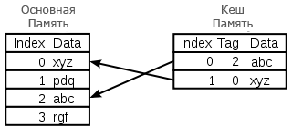


----

#### Полностью ассоциативный кеш <br/> (Fully Associative Cache) <br/> 全关联缓存


Любая строка памяти может быть отображена в любую строку кеша.  
任何内存行都可以映射到任何高速缓存行。

- лучшая эффективность;  
  更高的效率；
- очень много логики.  
  很多逻辑。


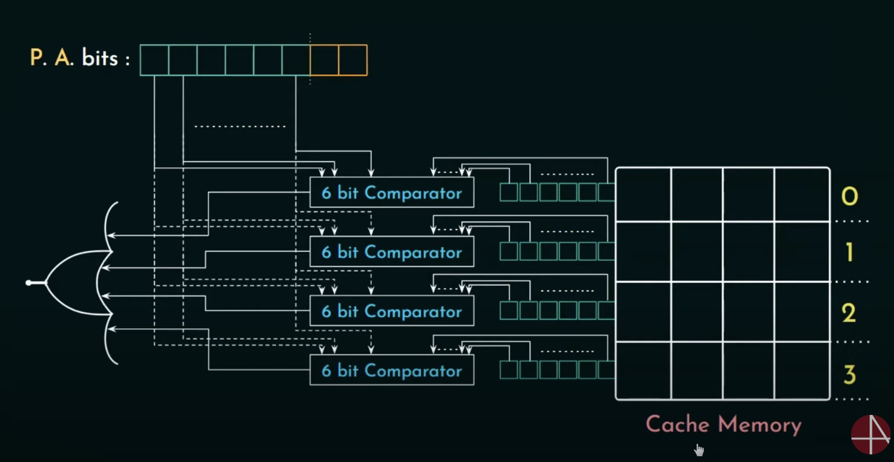


----

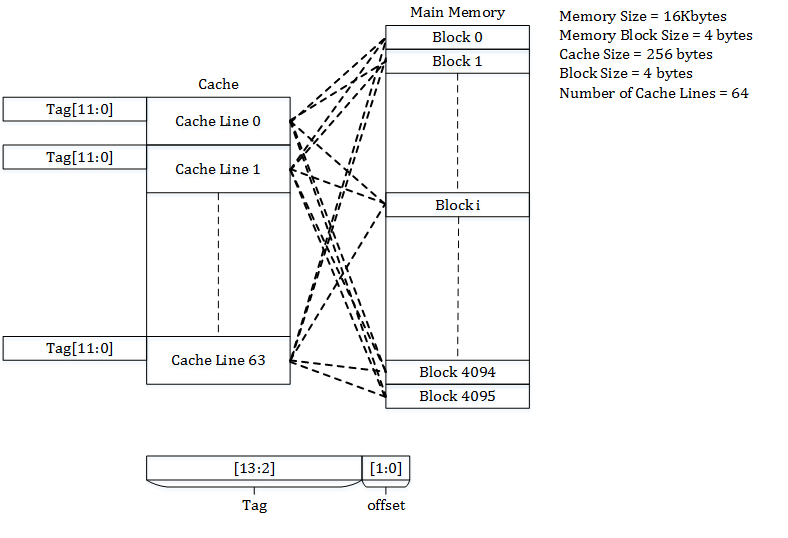

<!-- ----

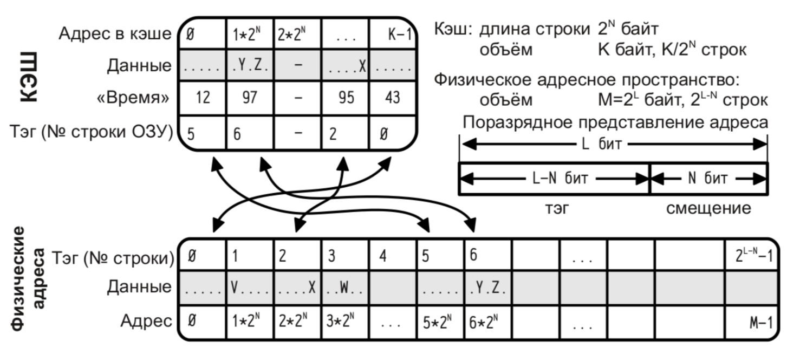

Notes: [Экспериментальное определение характеристик кеш-памяти](https://habr.com/ru/post/148839/) -->

----

#### Кеш с прямым отображением <br/> (Direct Mapping Cache) <br/> 直接映射缓存


Данная строка ОЗУ может быть отображена в единственную строку кеша, но в каждую строку кеша может быть отображено множество возможных строк ОЗУ.  
给定的 RAM 行可以映射到单个高速缓存行，但每个高速缓存行可以有许多可能的 RAM 行映射到它。

Адрес "обрезается" выделением индекса, а значит:  
通过分配索引来“截断”地址，这意味着：

- размер памяти и площадь компараторов сокращаются;  
  内存大小和比较器面积减少；
- коллизии при кешировании могут приводить к технической выгрузке кеш-линий.  
  缓存期间的冲突可能导致缓存行的技术卸载。


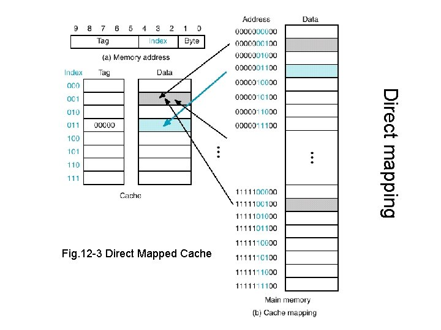


----

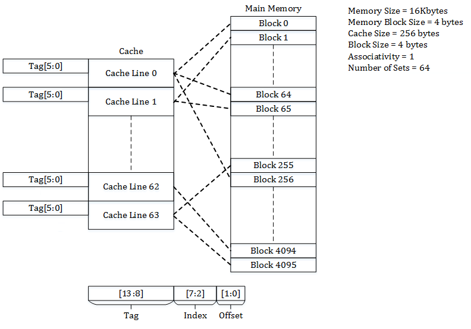

<!-- ----

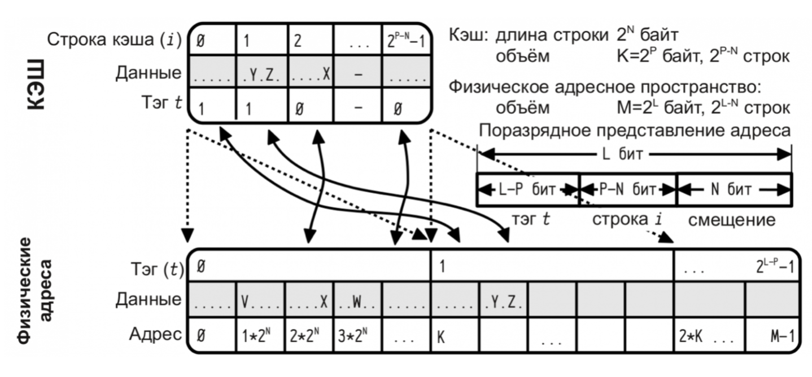 -->

----

#### Множественно-ассоциативный кеш <br/> (N-Way Set Associative Cache) <br/> N路组关联高速缓存


кеш-память делится на несколько "банков", каждый из которых функционирует как кеш с прямым отображением.  
高速缓冲存储器被分成几个“存储体”，每个“存储体”充当直接映射高速缓存。

- Выбор банка осуществляется на основе алгоритма вытеснения.  
  基于抢占算法选择库。
- Больше ассоциативность, ниже скорость, выше эффективность.  
  更强的关联性、更低的速度、更高的效率。


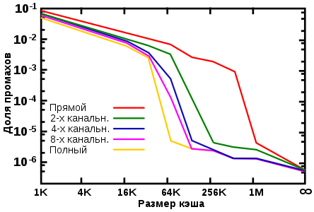


----

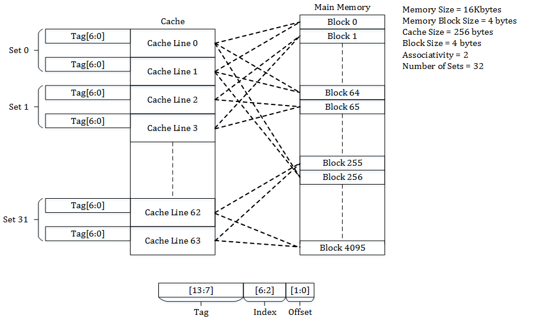

<!-- 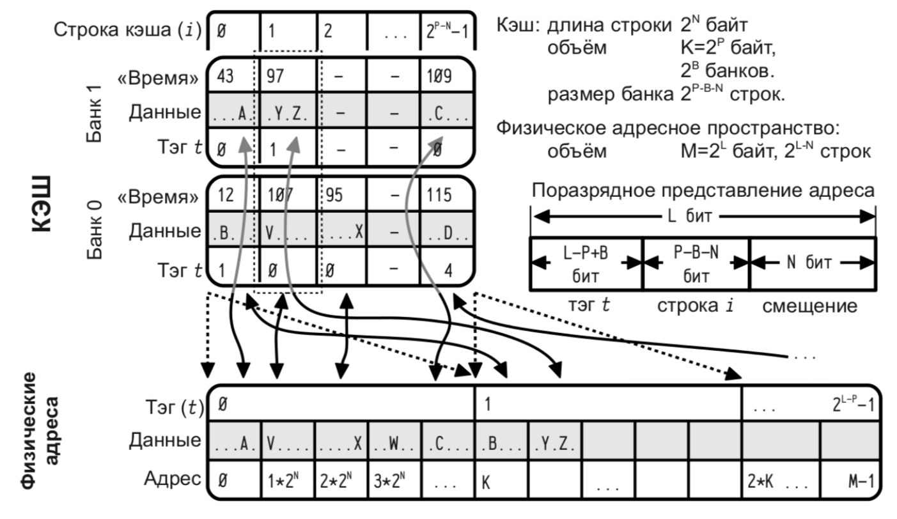 -->

---

### Многоуровневый кеш. Варианты 多级缓存。 选项


- Shared / Private
- Inclusive / Exclusive


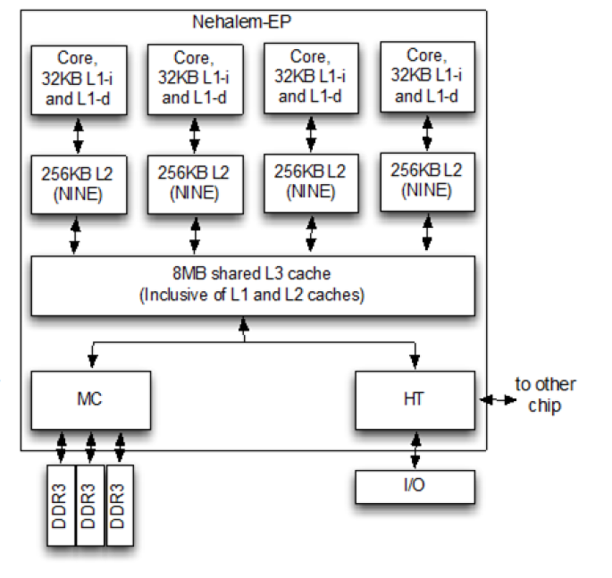


----

#### Inclusive / Exclusive Caches 包含/独占缓存


1. инклюзивная (записи дублируются);  
   包含（记录有重复）；
2. эксклюзивная (записи не дублируются, а перемещаются между кешами разных уровней, поэтому информация в кеше каждого уровня уникальна);  
   独占（条目不重复，而是在不同级别的缓存之间移动，因此每个级别的缓存中的信息都是唯一的）；
3. ни эксклюзивная, ни инклюзивная ([NINE](en.wikipedia.org/wiki/Cache_inclusion_policy#NINE_Policy)) (произвольные варианты).  
   既不排他也不包容([NINE](en.wikipedia.org/wiki/Cache_inclusion_policy#NINE_Policy))（任意选项）。


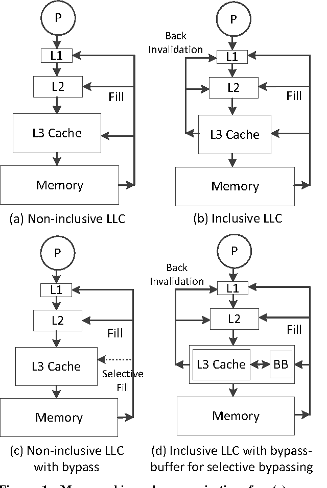 <!-- .element height="600px" -->


----

#### Параллельный доступ. Состояние кеш-линий  
并行访问。 缓存行状态

1. **Modified** -- It means that the value in the cache is dirty, that is the value in the current cache is different from the main memory.  
   **修改** -- 表示缓存中的值是脏的，即当前缓存中的值与主存中的值不同。
2. **Exclusive** -- It means that the value present in the cache is the same as that present in the main memory, that is the value is clean.  
   **独占** -- 表示缓存中存在的值与主存中存在的值相同，即该值是干净的。
3. **Shared** -- It means that the cache value holds the most recent data copy and that is what is shared among all the cache and main memory as well.  
   **共享** -- 这意味着缓存值保存最新的数据副本，并且这也是所有缓存和主内存之间共享的内容。
4. **Owned** -- It means that the current cache holds the block and is now the owner of that block, that is having all rights on that particular block.  
   **拥有** -- 这意味着当前缓存持有该块，并且现在是该块的所有者，即拥有该特定块的所有权利。
5. **Invalid** -- This states that the current cache block itself is invalid and is required to be fetched from other cache or main memory.  
   **无效** -- 这说明当前缓存块本身无效，需要从其他缓存或主存中获取。

----

##### Параллельный доступ. Когерентность 并行访问。 连贯性


- **Справочник** (directory). Состояние памяти содержится в одном месте (физически справочник может быть распределён).  
  **目录**（目录）。 内存状态包含在一处（物理上目录可以分布）。
- **Отслеживание** (snooping). Каждый кеш ведёт свою копию служебной информации о состоянии. Информация обновляется путём отслеживания обращений к памяти по общей шине (инвалидация по записи).  
  **跟踪**（窥探）。 每个缓存都维护自己的服务状态信息副本。 通过跟踪共享总线上的内存访问（写无效）来更新信息。


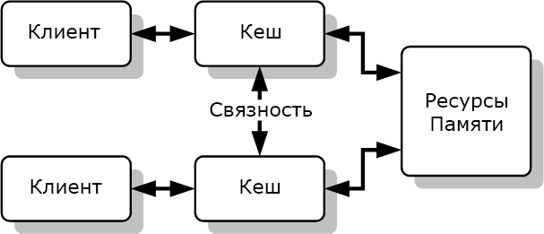

- **Перехват** (snarfing). Когда из какого-либо одного кеша данные переписываются в оперативную память, контроллеры остальных получают сигнал об этом изменении («перехватывают» информацию об изменении данных) и, если необходимо, изменяют соответствующие данные в своих кешах.  
  **拦截**（嗅探）。 当数据从任何一个缓存重写到 RAM 时，其余缓存的控制器会收到有关此更改的信号（“拦截”有关数据更改的信息），并在必要时更改其缓存中的相应数据。


----

##### Параллельный доступ. Offtopic. CAP


CAP-теорема. В распределённых системах нельзя одновременно получить:  
CAP定理。 在分布式系统中你无法同时获得：

- **Consistency** -- на всех работающих узлах одинаковые данные для клиента.  
  **一致性** -- 所有运行的节点都为客户端提供相同的数据。
- **Availability** -- все работающие узлы корректно отвечают на запросы.  
  **可用性** -- 所有正在运行的节点都能正确响应请求。
- **Partition tolerance (brainsplit)** -- даже если связь в системе стала нестабильной (вплоть до разделения системы на куски), но узлы работают, то система в целом продолжает работать.  
  **分区容忍（brainsplit）** - 即使系统中的连接变得不稳定（甚至到了将系统分裂成碎片的程度），但节点仍在工作，整个系统仍然继续工作。


----

##### Параллельный доступ. Offtopic. Consistency 并行访问。 无关。 一致性

- **Сильная согласованность (Strong consistency)**. После завершения обновления любой последующий доступ к данным вернет обновленное значение.  
  **一致性强**。 更新完成后，任何后续对数据的访问都将返回更新后的值。
- **Слабая согласованность (Weak consistency)** / **согласованность в конечном счете (Eventual consistency)**. Система гарантирует, что при отсутствии изменений данных в конечном счёте все запросы будут возвращать последнее обновленное значение. Пример: DNS.  
  **弱一致性** / **最终一致性**。 系统确保如果没有数据更改，所有查询最终都会返回最后更新的值。 示例：DNS。

Notes: <https://habr.com/ru/post/100891/>

---

### Примеры непрозрачности кеш-памяти 缓存不透明的示例

- В теории, кеш-память прозрачна для программиста.  
  理论上，高速缓冲存储器对程序员是透明的。
- На практике, это не так:  
  实际上，情况并非如此：
    - Meltdown (смотрите в докладах лаб. 1)  
      崩溃（参见实验室报告 1）
    - Перемножение матриц.  
      矩阵乘法。
    - Array of Structures (AoS), Structure of Arrays (SoA)  
      结构数组 (AoS)、数组结构 (SoA)
- Классная статья: 很酷的文章：[Экспериментальное определение характеристик кеш-памяти](https://habr.com/ru/post/148839/).

----

#### Перемножение матриц 矩阵乘法


$c_{ij} = \sum_{r=1}^m a_{ir}b_{rj} \left(i=1, 2, \ldots l; j=1, 2, \ldots n \right)$

где:

- a, b -- исходные матрицы;  
  a, b - 初始矩阵；
- с -- результирующая матрица;  
  c ——结果矩阵；
- хранение матриц в памяти реализуется через двумерный массив: `int**`, причем для простоты матрицы квадратные.  
  在内存中存储矩阵是通过二维数组实现的：`int**`，为了简单起见，矩阵是方形的。


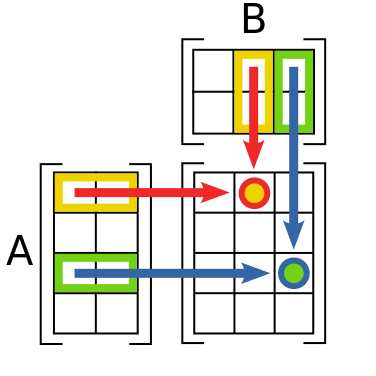


----

##### Наивное перемножение матриц 朴素矩阵乘法


```c
for (int i = 0; i < size; i++) {
  for (int j = 0; j < size; j++) {
    C[i][j] = 0;
    for (int k = 0; k < size; k++) {
      C[i][j] += A[i][k] * B[k][j];
    }
  }
}
```


----

##### Перемножение транспонированных матриц 转置矩阵相乘


```c
B2 = transpose(size, B);
// ...
for (int i = 0; i < size; i++) {
  for (int j = 0; j < size; j++) {
    C[i][j] = 0;
    for (int k = 0; k < size; k++) {
      C[i][j] += A[i][k] * B2[j][k];
    }
  }
}
```


----

##### Паттерн доступа к памяти 内存访问模式

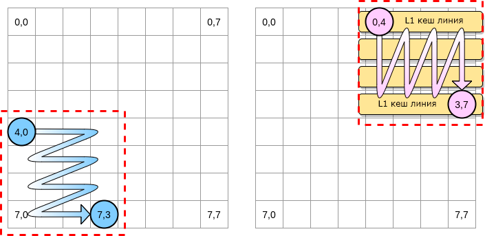

----

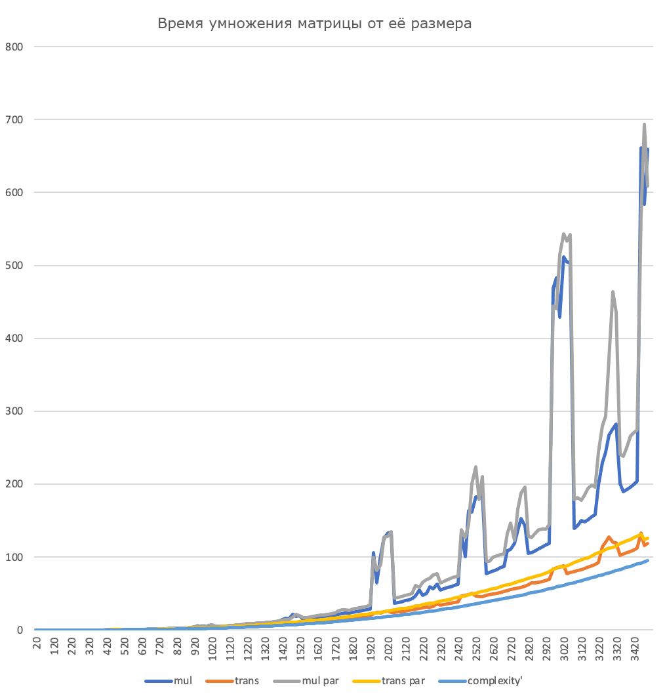 <!-- .element: height="600xpx" -->

----

#### Array of Structures (AoS), Structure of Arrays (SoA) 结构数组 (AoS)、数组结构 (SoA)


```C
struct point3D {
    float x;
    float y;
    float z;
};
struct point3D points[N];
float get_point_x(int i) { return points[i].x; }
```


```C
struct pointlist3D {
    float x[N];
    float y[N];
    float z[N];
};
struct pointlist3D points;
float get_point_x(int i) { return points.x[i]; }
```


- Попадание данных в кеш.  
  数据命中缓存。
- Поддержка структур данных с точки зрения системы команд.  
  从命令系统的角度支持数据结构。
- Поддержка групповых операций с точки зрения системы команд.  
  在指令系统方面支持操作组。
- Пересылка данных в рамках машинных слов.  
  在机器字内传输数据。
- Колоночные базы данных.  
  列数据库。

----

### Meltdown и другие уязвимости, связанные с кеш-памятью 崩溃和其他与缓存相关的漏洞

- Meltdown 崩溃
: аппаратная уязвимость категории утечка по стороннему каналу, обнаруженная в ряде микропроцессоров, в частности, производства Intel и архитектуры ARM. Meltdown использует ошибку реализации спекулятивного выполнения команд в некоторых процессорах Intel и ARM (но не AMD), из-за которой при спекулятивном выполнении инструкций чтения из памяти, процессор игнорирует права доступа к страницам.  
在许多微处理器中发现的被确定为侧通道泄漏的硬件漏洞，特别是由英特尔和 ARM 架构制造的微处理器。 Meltdown 利用了某些 Intel 和 ARM（但不是 AMD）处理器中的推测执行错误，该错误导致处理器在推测执行内存读取指令时忽略页面权限。

Уязвимость позволяет локальному атакующему (при запуске специальной программы) получить несанкционированный доступ на чтение к привилегированной памяти (памяти, используемой ядром операционной системы).  
该漏洞允许本地攻击者（通过运行特殊程序）获得对特权内存（操作系统内核使用的内存）的未经授权的读取访问权限。

--- Wikipedia

---

### Основная память как кеш процессора 主存作为处理器缓存


Фантом ОС Phantom 操作系统 
: операционная система, разрабатываемая российской компанией Digital Zone с 2010 года.  
俄罗斯公司 Digital Zone 自 2010 年以来开发的操作系统。

- Операционная система базируется на концепции персистентной виртуальной памяти, ориентирована на управляемый код и нацелена на применение в носимых и встроенных компьютерах.  
  该操作系统基于持久虚拟内存的概念，专注于托管代码，旨在用于可穿戴和嵌入式计算机。
- В отличие от Unix-концепции "Всё есть файл", Фантом базируется на принципе "Всё есть объект".  
  与 Unix 的“一切都是文件”概念不同，Phantom 基于“一切都是对象”的原则。

[[Фантом (операционная система)](https://ru.wikipedia.org/wiki/Фантом_(операционная_система))]


---

## Параллелизм 并行性

1. Когда нужно работать сразу над несколькими задачами (ввод-вывод, системы управления).  
   当您需要同时处理多项任务时（输入输出、控制系统）。
2. Когда нужно повысить уровень утилизации ресурсов (не простаиваем, а занимаемся чем-то полезным).  
   当你需要提高资源利用率时（我们不会闲着，而是做一些有用的事情）。
3. Когда нужно повысить производительность компьютера (делаем больше дел за единицу времени).  
   当您需要提高计算机性能时（单位时间做更多的事情）。

### Виды параллелизма 并行类型

1. **Уровень битов** (Bit-level Parallelism). "Ширина" комбинационных схем, шин данных и машинного слова.  
   **位级并行性。 组合电路、数据总线和机器字的“宽度”。
2. **Уровень команд** (Instruction-level parallelism). Параллельное выполнение нескольких инструкций.  
   **命令级**（指令级并行）。 多条指令的并行执行。
3. **Уровень задач** (Task/Thread-level parallelism). Параллельное выполнение нескольких программ.  
   **任务级**（任务/线程级并行性）。 并行执行多个程序。

----

### Рост производительности процессоров 处理器性能增长


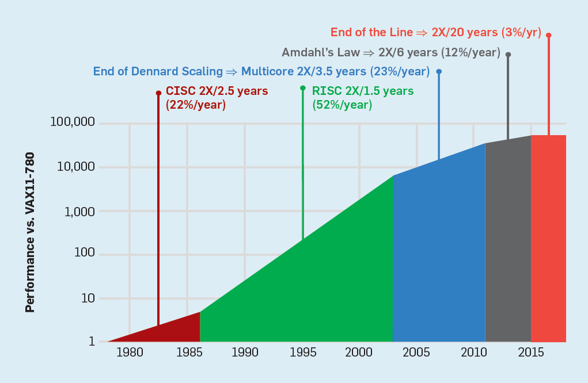

Рост производительности относительно процента задачи, который может быть выполнен параллельно, и количества вычислителей.  
相对于可以并行执行的任务的百分比和计算机数量而言，生产率的提高。


