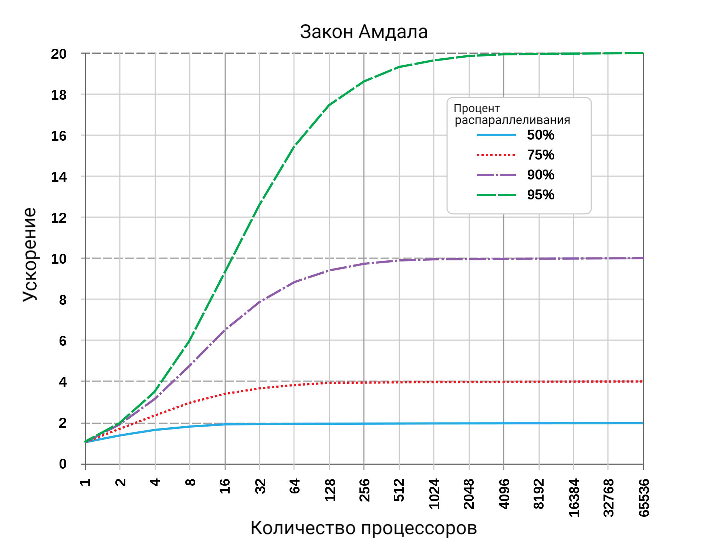

# Архитектура компьютера

## Лекция 14

### Кеширование. Ассоциативность

Пенской А.В., 2022

----

### План лекции

- Кеширование
    - Принципы работы (было)
    - Ассоциативность кеша
    - Иерархия кешей
    - Примеры оптимизации алгоритмов под использование кеша
    - Meltdown и другие уязвимости, связанные с кеш-памятью
    - Расширение понятия кеша на основную память
- Параллелизм. Параллелизм уровня задач

---

## Организация кеш-памяти

Кеш = память + логика (схемы):

- поиска кеш-линии по тегу;
- вытеснения/замещения;
- предзагрузки (prefetch) данных и инструкций;
- взаимодействия с памятью (группировка операций и т.п.);
- синхронизации разных уровней кешей.

Больше данных $\rightarrow$ больше логики.

Масштабирование по времени или по площади:

- 2 линии, 1 такт $\rightarrow$ 2 компаратора,
- 2 такта $\rightarrow$ 1 компаратор.

----

### Ассоциативность кеша

Тег -- идентификатор области памяти, сохранённой в кеш-линии:

<div class="row"><div class="col">

<div>

- адрес ячейки памяти;
- адрес ячейки памяти, обрезанный снизу (младшие биты), для адресации машинным словом или блоком;
- адрес ячейки памяти, обрезанный сверху (старшие биты):
    - 64 бита адресного пространства никто не использует;
    - локальность данных;
- адрес ячейки памяти, обрезанный в середине.

</div> <!-- .element: class="fragment" -->

</div><div class="col">


</div></div>

----

#### Полностью ассоциативный кеш <br/> (Fully Associative Cache)

<div class="row"><div class="col">

Любая строка памяти может быть отображена в любую строку кеша.

- лучшая эффективность;
- очень много логики.

</div><div class="col">


</div></div>

----


<!-- ----


Notes: [Экспериментальное определение характеристик кеш-памяти](https://habr.com/ru/post/148839/) -->

----

#### Кеш с прямым отображением <br/> (Direct Mapping Cache)

<div class="row"><div class="col">

Данная строка ОЗУ может быть отображена в единственную строку кеша, но в каждую строку кеша может быть отображено множество возможных строк ОЗУ.

Адрес "обрезается" выделением индекса, а значит:

- размер памяти и площадь компараторов сокращаются;
- коллизии при кешировании могут приводить к технической выгрузке кеш-линий.

</div><div class="col">


</div></div>

----


<!-- ----

 -->

----

#### Множественно-ассоциативный кеш <br/> (N-Way Set Associative Cache)

<div class="row"><div class="col">

кеш-память делится на несколько "банков", каждый из которых функционирует как кеш с прямым отображением.

- Выбор банка осуществляется на основе алгоритма вытеснения.
- Больше ассоциативность, ниже скорость, выше эффективность.

</div><div class="col">


</div></div>

----


<!--  -->

---

### Многоуровневый кеш. Варианты

<div class="row"><div class="col">

- Shared / Private
- Inclusive / Exclusive

</div><div class="col">


</div></div>

----

#### Inclusive / Exclusive Caches

<div class="row"><div class="col">

1. инклюзивная (записи дублируются);
2. эксклюзивная (записи не дублируются, а перемещаются между кешами разных уровней, поэтому информация в кеше каждого уровня уникальна);
3. ни эксклюзивная, ни инклюзивная ([NINE](en.wikipedia.org/wiki/Cache_inclusion_policy#NINE_Policy)) (произвольные варианты).

</div><div class="col">

 <!-- .element height="600px" -->

</div></div>

----

#### Параллельный доступ. Состояние кеш-линий

1. **Modified** -- It means that the value in the cache is dirty, that is the value in the current cache is different from the main memory.
1. **Exclusive** -- It means that the value present in the cache is the same as that present in the main memory, that is the value is clean.
1. **Shared** -- It means that the cache value holds the most recent data copy and that is what is shared among all the cache and main memory as well.
1. **Owned** -- It means that the current cache holds the block and is now the owner of that block, that is having all rights on that particular block.
1. **Invalid** -- This states that the current cache block itself is invalid and is required to be fetched from other cache or main memory.

----

##### Параллельный доступ. Когерентность

<div class="row"><div class="col">

- **Справочник** (directory). Состояние памяти содержится в одном месте (физически справочник может быть распределён).
- **Отслеживание** (snooping). Каждый кеш ведёт свою копию служебной информации о состоянии. Информация обновляется путём отслеживания обращений к памяти по общей шине (инвалидация по записи).

</div><div class="col">


- **Перехват** (snarfing). Когда из какого-либо одного кеша данные переписываются в оперативную память, контроллеры остальных получают сигнал об этом изменении («перехватывают» информацию об изменении данных) и, если необходимо, изменяют соответствующие данные в своих кешах.

</div></div>

----

##### Параллельный доступ. Offtopic. CAP

<div class="row"><div class="col">

CAP-теорема. В распределённых системах нельзя одновременно получить:

- **Consistency** -- на всех работающих узлах одинаковые данные для клиента.
- **Availability** -- все работающие узлы корректно отвечают на запросы.
- **Partition tolerance (brainsplit)** -- даже если связь в системе стала нестабильной (вплоть до разделения системы на куски), но узлы работают, то система в целом продолжает работать.

</div><div class="col">


</div></div>

----

##### Параллельный доступ. Offtopic. Consistency

- **Сильная согласованность (Strong consistency)**. После завершения обновления любой последующий доступ к данным вернет обновленное значение.
- **Слабая согласованность (Weak consistency)** / **согласованность в конечном счете (Eventual consistency)**. Система гарантирует, что при отсутствии изменений данных в конечном счёте все запросы будут возвращать последнее обновленное значение. Пример: DNS.

Notes: <https://habr.com/ru/post/100891/>

---

### Примеры непрозрачности кеш-памяти

- В теории, кеш-память прозрачна для программиста.
- На практике, это не так:
    - Meltdown (смотрите в докладах лаб. 1)
    - Перемножение матриц.
    - Array of Structures (AoS), Structure of Arrays (SoA)
- Классная статья: [Экспериментальное определение характеристик кеш-памяти](https://habr.com/ru/post/148839/).

----

#### Перемножение матриц

<div class="row"><div class="col">

$c_{ij} = \sum_{r=1}^m a_{ir}b_{rj} \left(i=1, 2, \ldots l; j=1, 2, \ldots n \right)$

где:

- a, b -- исходные матрицы;
- с -- результирующая матрица;
- хранение матриц в памяти реализуется через двумерный массив: `int**`, причем для простоты матрицы квадратные.

</div><div class="col">


</div></div>

----

##### Наивное перемножение матриц

<div class="row"><div class="col">

```c
for (int i = 0; i < size; i++) {
  for (int j = 0; j < size; j++) {
    C[i][j] = 0;
    for (int k = 0; k < size; k++) {
      C[i][j] += A[i][k] * B[k][j];
    }
  }
}
```

</div><div class="col">


</div></div>

----

##### Перемножение транспонированных матриц

<div class="row"><div class="col">

```c
B2 = transpose(size, B);
// ...
for (int i = 0; i < size; i++) {
  for (int j = 0; j < size; j++) {
    C[i][j] = 0;
    for (int k = 0; k < size; k++) {
      C[i][j] += A[i][k] * B2[j][k];
    }
  }
}
```

</div><div class="col">


</div></div>

----

##### Паттерн доступа к памяти


----

 <!-- .element: height="600xpx" -->

----

#### Array of Structures (AoS), Structure of Arrays (SoA)

<div class="row"><div class="col">

```C
struct point3D {
    float x;
    float y;
    float z;
};
struct point3D points[N];
float get_point_x(int i) { return points[i].x; }
```

</div><div class="col">

```C
struct pointlist3D {
    float x[N];
    float y[N];
    float z[N];
};
struct pointlist3D points;
float get_point_x(int i) { return points.x[i]; }
```

</div></div>

- Попадание данных в кеш.
- Поддержка структур данных с точки зрения системы команд.
- Поддержка групповых операций с точки зрения системы команд.
- Пересылка данных в рамках машинных слов.
- Колоночные базы данных.

----

### Meltdown и другие уязвимости, связанные с кеш-памятью

- Meltdown
: аппаратная уязвимость категории утечка по стороннему каналу, обнаруженная в ряде микропроцессоров, в частности, производства Intel и архитектуры ARM. Meltdown использует ошибку реализации спекулятивного выполнения команд в некоторых процессорах Intel и ARM (но не AMD), из-за которой при спекулятивном выполнении инструкций чтения из памяти, процессор игнорирует права доступа к страницам.

Уязвимость позволяет локальному атакующему (при запуске специальной программы) получить несанкционированный доступ на чтение к привилегированной памяти (памяти, используемой ядром операционной системы).

--- Wikipedia

---

### Основная память как кеш процессора

<div class="row"><div class="col">

Фантом ОС
: операционная система, разрабатываемая российской компанией Digital Zone с 2010 года.

- Операционная система базируется на концепции персистентной виртуальной памяти, ориентирована на управляемый код и нацелена на применение в носимых и встроенных компьютерах.
- В отличие от Unix-концепции "Всё есть файл", Фантом базируется на принципе "Всё есть объект".

[[Фантом (операционная система)](https://ru.wikipedia.org/wiki/Фантом_(операционная_система))]

</div><div class="col">


</div></div>

---

## Параллелизм

1. Когда нужно работать сразу над несколькими задачами (ввод-вывод, системы управления).
2. Когда нужно повысить уровень утилизации ресурсов (не простаиваем, а занимаемся чем-то полезным).
3. Когда нужно повысить производительность компьютера (делаем больше дел за единицу времени).

### Виды параллелизма

1. **Уровень битов** (Bit-level Parallelism). "Ширина" комбинационных схем, шин данных и машинного слова.
1. **Уровень команд** (Instruction-level parallelism). Параллельное выполнение нескольких инструкций.
1. **Уровень задач** (Task/Thread-level parallelism). Параллельное выполнение нескольких программ.

----

### Рост производительности процессоров

<div class="row"><div class="col">


Рост производительности относительно процента задачи, который может быть выполнен параллельно, и количества вычислителей.

</div><div class="col">



</div></div>
