# Архитектура компьютера

## Лекция 15

### Параллелизм. Кооперативная многозадачность. Вытесняющая многозадачность. DMA. Изоляция

Пенской А.В., 2022

----

### План лекции

- Параллелизм. Параллелизм уровня задач
    - Кооперативная многозадачность (Cooperative multitasking)
    - Вытесняющая многозадачность (Preemptive multitasking)
        - Система прерываний
            - Watchdog Timer
        - Система прерываний. Ввод-вывод. SPI. Варианты
    - Прямой доступ к памяти (DMA)

---

## Параллелизм уровня задач

**Проблема**: архитектура процессора и надстроек не знала о параллелизме, не думала о нём и никак не была на него рассчитана.

**Иначе**: процессор не был рассчитан на то, что поток инструкций может закончиться.

Пример из мира программирования: **Green Threads**.   Подробности -- в конце раздела.

Варианты параллелизма:

1. Кооперативная многозадачность (Cooperative Multitasking)
2. Вытесняющая многозадачность (Preemptive Multitasking)   или истинная многозадачность

---

## Кооперативная многозадачность (Cooperative Multitasking)

Многозадачность, при которой *следующая задача* выполняется, когда *текущая задача* явно объявит о готовности отдать процессорное время.

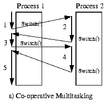

1. Активная программа получает всё процессорное время.
2. Фоновые -- замораживаются.
3. Приложение захватывает столько ресурсов процессора, сколько хочет.
4. Все приложения делят процессор, передавая управление другим.

----

### Cooperative Multitasking. Подходы

Уровень реализации:

1. OS: набор системных вызовов для приостановки задачи.
2. Virtual Machine / Run Time:
    - `event-loop`   + `callbacks`   + `closure`
    - `yield`
    - `async` / `await`
3. Через конечные автоматы   (см. "Программный ввод-вывод")

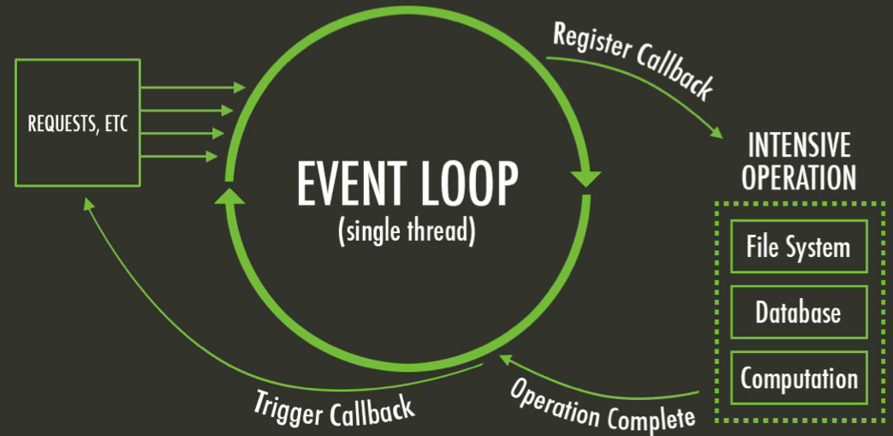

----

### Cooperative Multitasking. Применение

1. Пакетный режим и медленный ввод-вывод (в мейнфреймах),   освободить процессор на время I/O
2. Оптимизации систем, требующих частого переключения задач   (nginx vs. apache vs. node.js)
3. Простые встроенные системы, bare-metal программирование.

----

### Cooperative Multitasking. Анализ

#### Преимущества CM

1. Отсутствие гонок. Точки передачи управления известны. Синхронизация не нужна.
2. Контроль за ресурсами со стороны приложения.

#### Недостатки CM

1. Контроль за ресурсами со стороны приложения.
2. Непредсказуемость длительности выполнения задачи (ошибка, злоупотребление). Риск зависания.
3. Сложность интерактивных приложений. Балансировка ресурсов между потоками (разные авторы).

---

## Вытесняющая многозадачность (Preemptive Multitasking)

(истинная многозадачность)

ОС передаёт управление между программами в случае завершения операций ввода-вывода, событий в аппаратуре компьютера, истечения таймеров и квантов времени, поступления сигналов.

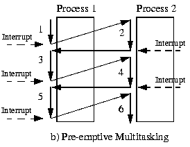

1. Переключение процессов происходит буквально между любыми двумя инструкциями.
2. Распределение процессорного времени осуществляется планировщиком.
3. Возможна "мгновенная" реакция на действия пользователя.

----

### Preemptive Multitasking. Механизмы

1. Механизм **прерывания** процесса -- забрать процессор у задачи независимо от её желания.
2. Механизм **сохранения** состояния задачи.
3. Механизм **планирования** (обычно ОС / ВМ / RunTime) -- какой задаче отдать процессор.
4. Механизм **переключения** на следующую задачу.
5. Механизм **взаимодействия** между задачами.

Offtopic: [Checkpoint/Restore In Userspace, or CRIU](https://criu.org/Main_Page)

----

### Preemptive Multitasking. Анализ

#### Преимущества PM

1. Защищённость процессов и ОС друг от друга по ресурсам.
2. Интерактивные системы (почти мгновенная реакция).

#### Недостатки PM

1. Непредсказуемость момента переключения. Гонки. Синхронизация. Подробнее:   [The Problem with Threads](https://www2.eecs.berkeley.edu/Pubs/TechRpts/2006/EECS-2006-1.pdf).
2. "Тяжесть" потоков на уровне процессора.

Примечания:

- Применение в системах реального времени.
- MapReduce (следующий слайд).

----

##### MapReduce

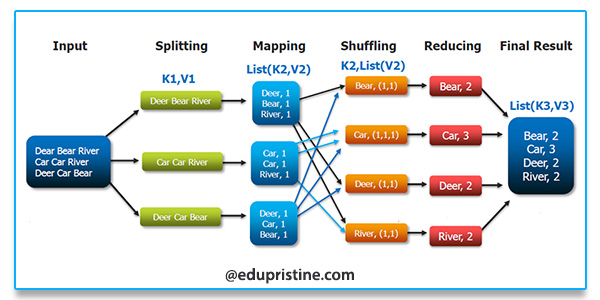

---

*Question*: Что происходит с контроллером, если он поделит на ноль?

---

### Система прерываний. Проблема

В основе архитектуры фон Неймана лежат принципы:

1. последовательного выполнения команд и возможности условного перехода;
2. процессор будет "переваривать" последовательность команд без перерыва столько, сколько сможет;
3. позволяет эффективно построить "число-дробилку".

Не всегда удобны, так как:

1. не позволяют эффективно работать с внешними событиями и устройствами ввода-вывода;
2. не позволяют обрабатывать нештатные ситуации иначе, чем при помощи кодов ошибок или флагов (высокие требования к дисциплине разработки);
3. не позволяют независимо выполнять несколько потоков команд.

----

### Система прерываний (Interruptions)

Позволяет сигнализировать процессору о том, что текущий поток управления должен:

1. быть незамедлительно **прерван**;
2. его состояние **сохранено**;
3. управление **передано** по указанному вектору прерывания;
4. по завершении выполнения обработчика прерывания управление должно быть **возвращено** исходному потоку управления с восстановлением состояния.

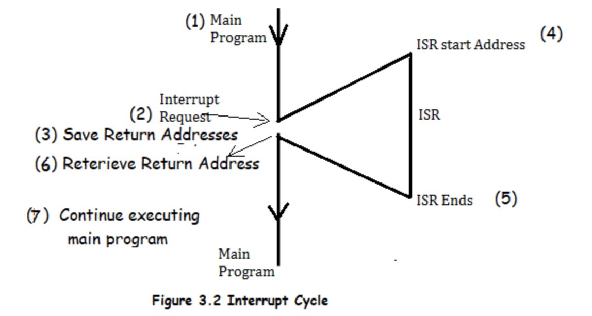

----

#### Система прерываний. Виды прерываний

1. **Асинхронные** (внешние, аппаратные). События от внешних аппаратных устройств. Могут произойти в произвольный момент относительно работы процессора. Например, от таймера, сетевой карты, нажатия клавиши.
2. **Синхронные** (внутренние). События в процессоре. Пример: деление на ноль или переполнение стека, обращение к недопустимым адресам памяти, недопустимый код операции.
3. **Программные** (частный случай синхронного). Инициируется исполнением специальной инструкции. Обращение к операционной системе. Элементы кооперативной многозадачности.

----

#### Система прерываний. Виды

1. Решение о **необходимости** обработки:
    - **Маскируемые** прерывания, которые возможно отключить через специальные регистры. К примеру: критическая секция.
    - **Немаскируемые** прерывания, которые нельзя игнорировать. К примеру: ошибка доступа к памяти, Watchdog таймер.
2. **Приоритизация** прерываний. Приходит другое:
    - **Относительное** прерывание (откладывается).
    - **Абсолютное** (прерываем прерывание).
3. Вид события:
    - По фронту (положительному или отрицательному).
    - По уровню сигнала (требует "сброса"). Позволяет объединять прерывания через ИЛИ, но это Spurious Interrupts.
    - По сообщению (Message Signaled). Реализуется через очередь.
    - По дверному звонку (Doorbell). Сигнализируется наступление прерывания, в то время как информация о нём сохраняется в условленном месте.

----

#### Система прерываний. Устройство

1. Обычно на аппаратном уровне (контроллер прерываний). Скорость критична.
2. Возможна и "потеря прерываний", если количество заявок больше, чем возможно обработать.
3. Обработчик прерываний по возможности компактен и быстр. Практика отложенных вызовов: фиксация отложенной процедуры, её запуск в обычном режиме.

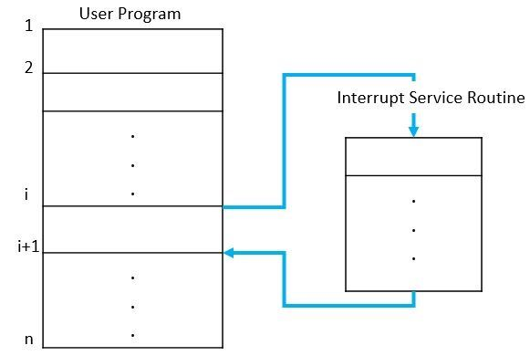 <!-- .element: height="250px" -->

---

#### Система прерываний. Watchdog Timer

Сторожевой таймер -- *аппаратно* реализованная схема контроля над зависанием системы.

A watchdog timer is an *electronic or software* timer that is used to detect and recover from computer malfunctions.

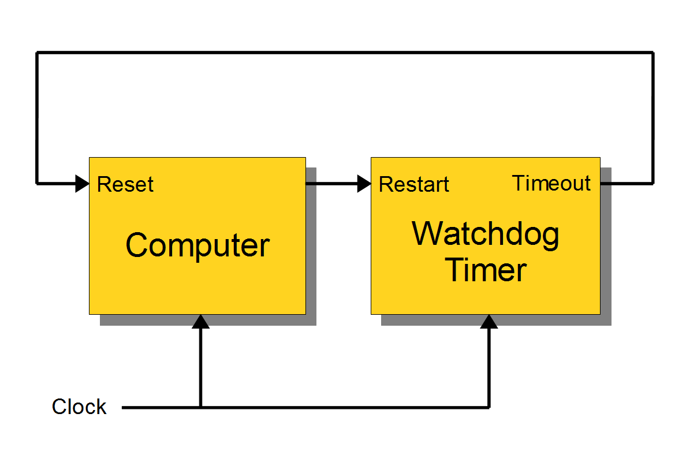

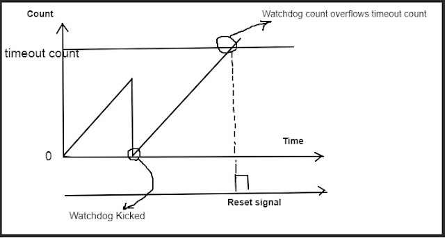

----

### Система прерываний. Ввод-вывод. SPI

Варианты:

1. Прерывание от двух сигналов: CS и SCLK (маскируется, если CS положительный).
2. Прерывание только от CS. Блокирует работу при передаче.
3. Прерывание от объединённых CS и SCLK:
    - работа с буфером внутри прерывания,
    - при передаче данных доступ в буфер запрещён,
    - по завершении передачи основной поток получает доступ к буферу.

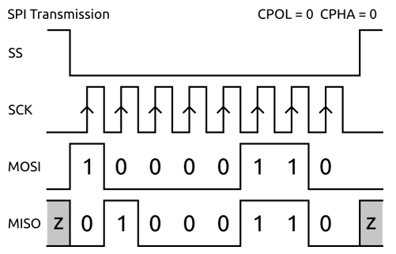

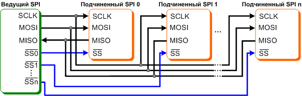

(программно-управляемый   ввод-вывод)

---

#### Прямой доступ к памяти

Как уйти от программно-управляемого ввода-вывода?

Прямой доступа к памяти (Direct Memory Access, DMA). Позволяет процессору отдать команду на перенос данных контроллеру DMA, который её реализует независимо и уведомляет процессор о результатах через систему прерываний.

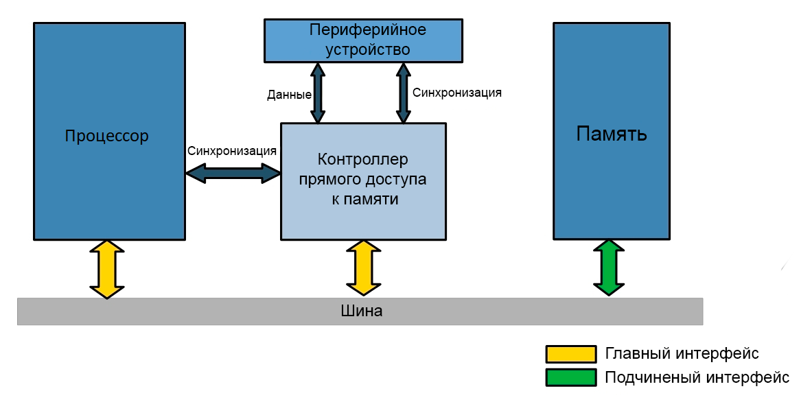

Другой вариант: каналы (процессоры) ввода-вывода. Позволяют процессору определить программу для взаимодействия с внешним устройством. ISA канала адаптирована для ввода-вывода (пример: автоматическая конвертация форматов). Сегодня применяется редко, раньше часто применялся в мэйнфрэймах.

----

#### Прямой доступ к памяти. Принцип работы

- Third-party, где работа с DMA управляется полностью процессором, и любая передача данных должна инициализироваться им.
- Bus mastering, где работа с DMA управляется, в том числе и со стороны устройств ввода-вывода, что позволяет инициализировать передачу данных без участия процессора.

##### Режим работы DMA. Взаимодействие с памятью

- **Пакетный режим** (Burst Mode). Передача данных осуществляется единой операцией, которая не может быть прервана процессором. Приоритет DMA.
- **Циклический режим** (Cycle stealing mode). Для процессора и DMA выделяется фиксированный слот времени в рамках цикла. Предсказуемый вариант.
- **Прозрачный режим** (Transparent Mode). Передача данных, когда процессор не взаимодействует с памятью. Приоритет процессора.
