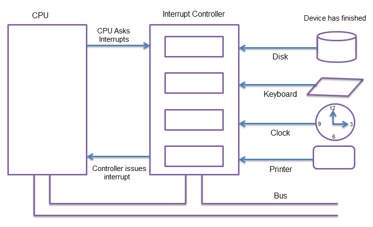

# Архитектура компьютера

## Лекция 15

### Параллелизм. Кооперативная многозадачность. Вытесняющая многозадачность. DMA. Изоляция 并行性。 协作多任务处理。 抢占式多任务处理。 DMA。 绝缘

Пенской А.В., 2022

----

### План лекции

- Параллелизм. Параллелизм уровня задач
    - Кооперативная многозадачность (Cooperative multitasking)
    - Вытесняющая многозадачность (Preemptive multitasking)
        - Система прерываний
            - Watchdog Timer
        - Система прерываний. Ввод-вывод. SPI. Варианты
    - Прямой доступ к памяти (DMA)  

---

- 并行性。 任务级并行性
     - 协作多任务处理
     - 抢占式多任务处理
         - 中断系统
             - 看门狗定时器
         - 中断系统。 输入输出。 SPI。 选项
     - 直接内存访问（DMA）

---

## Параллелизм уровня задач 任务级并行性

**Проблема**: архитектура процессора и надстроек не знала о параллелизме, не думала о нём и никак не была на него рассчитана.  
**问题**：处理器和附加组件的架构不了解并行性，没有考虑并行性，也没有以任何方式为其设计。

**Иначе**: процессор не был рассчитан на то, что поток инструкций может закончиться.  
**否则**：处理器的设计并未考虑到指令流可能结束的情况。

Пример из мира программирования: **Green Threads**.  
编程世界的一个例子：**绿色线程**
Подробности -- в конце раздела.  
 详细信息位于本节末尾。

Варианты параллелизма: 并行度选项：

1. Кооперативная многозадачность (Cooperative Multitasking)  
   协作多任务处理
2. Вытесняющая многозадачность (Preemptive Multitasking)  
   抢占式多任务处理   или истинная многозадачность  
   或真正的多任务处理

---

## Кооперативная многозадачность (Cooperative Multitasking) 协作多任务处理

Многозадачность, при которой *следующая задача* выполняется, когда *текущая задача* явно объявит о готовности отдать процессорное время.  
多任务处理，其中当“当前任务”明确宣布准备放弃 CPU 时间时，执行“下一个任务”。

1. Активная программа получает всё процессорное время.  
   活动程序接收所有处理器时间。
2. Фоновые -- замораживаются.  
   背景被冻结。
3. Приложение захватывает столько ресурсов процессора, сколько хочет.  
   应用程序可以根据需要获取尽可能多的CPU 资源。
4. Все приложения делят процессор, передавая управление другим.  
   所有应用程序共享处理器，将控制权转移给其他应用程序。

----

### Cooperative Multitasking. Подходы 协作多任务处理。 方法

Уровень реализации: 实施级别：

1. OS: набор системных вызовов для приостановки задачи.  
   OS：一组用于挂起任务的系统调用。
2. Virtual Machine / Run Time:  
   虚拟机/运行时间：
    - `event-loop`   + `callbacks`   + `closure`
    - `yield`
    - `async` / `await`
3. Через конечные автоматы  
   通过有限状态机   (см. "Программный ввод-вывод")

----

### Cooperative Multitasking. Применение 协作多任务处理。 应用

1. Пакетный режим и медленный ввод-вывод (в мейнфреймах),  
   批处理模式和缓慢的I/O（在大型机上），   освободить процессор на время I/O  
   释放处理器的I/O时间
2. Оптимизации систем, требующих частого переключения задач  
   需要频繁任务切换的系统的优化   (nginx vs. apache vs. node.js)
3. Простые встроенные системы, bare-metal программирование.  
   简单的嵌入式系统，裸机编程。

----

### Cooperative Multitasking. Анализ 协作多任务处理。 分析

#### Преимущества CM 好处

1. Отсутствие гонок. Точки передачи управления известны. Синхронизация не нужна.  
   禁止赛车。 控制传输点是已知的。 无需同步。
2. Контроль за ресурсами со стороны приложения.  
   应用程序对资源的控制。

#### Недостатки CM

1. Контроль за ресурсами со стороны приложения.  
   应用程序对资源的控制。
2. Непредсказуемость длительности выполнения задачи (ошибка, злоупотребление). Риск зависания.  
   任务持续时间的不可预测性（错误、滥用）。 结冰的危险。
3. Сложность интерактивных приложений. Балансировка ресурсов между потоками (разные авторы).  
   交互式应用程序的复杂性。 平衡线程之间的资源（各个作者）。

---

## Вытесняющая многозадачность (Preemptive Multitasking) 抢占式多任务处理

(истинная многозадачность)

ОС передаёт управление между программами в случае завершения операций ввода-вывода, событий в аппаратуре компьютера, истечения таймеров и квантов времени, поступления сигналов.  
当输入/输出操作完成、计算机硬件中的事件、定时器和时间片到期以及接收到信号时，操作系统在程序之间转移控制。

1. Переключение процессов происходит буквально между любыми двумя инструкциями.  
   进程切换确实发生在任意两条指令之间
2. Распределение процессорного времени осуществляется планировщиком.  
   处理器时间的分配由调度程序进行。
3. Возможна "мгновенная" реакция на действия пользователя.  
   可以对用户操作做出“即时”反应

----

### Preemptive Multitasking. Механизмы 抢占式多任务处理。 机制

1. Механизм **прерывания** процесса -- забрать процессор у задачи независимо от её желания.  
   **中断**进程的机制 - 让处理器脱离任务，无论其意愿如何。
2. Механизм **сохранения** состояния задачи.  
   **保存**任务状态的机制。
3. Механизм **планирования** (обычно ОС / ВМ / RunTime) -- какой задаче отдать процессор.  
   **调度**机制（通常是OS / VM / RunTime） - 将处理器分配给哪个任务。
4. Механизм **переключения** на следующую задачу.  
   **切换**到下一个任务的机制。
5. Механизм **взаимодействия** между задачами.  
   任务之间**交互**的机制。

Offtopic: [Checkpoint/Restore In Userspace, or CRIU](https://criu.org/Main_Page)

----

### Preemptive Multitasking. Анализ 抢占式多任务处理。 分析

#### Преимущества PM

1. Защищённость процессов и ОС друг от друга по ресурсам.  
   进程和操作系统在资源方面的相互安全性。
2. Интерактивные системы (почти мгновенная реакция).  
   交互式系统（几乎瞬时响应）。

#### Недостатки PM

1. Непредсказуемость момента переключения. Гонки. Синхронизация. Подробнее:  
   切换时刻的不可预测性。 种族。 同步。 更多细节：   [The Problem with Threads](https://www2.eecs.berkeley.edu/Pubs/TechRpts/2006/EECS-2006-1.pdf).
2. "Тяжесть" потоков на уровне процессора.  
   处理器级别线程的“重量”。

Примечания: 笔记：

- Применение в системах реального времени.  
  实时系统中的应用。
- MapReduce (следующий слайд).

----

##### MapReduce

---

*Question*: Что происходит с контроллером, если он поделит на ноль?  
*问题*：如果控制器除以零，会发生什么？

---

### Система прерываний. Проблема 中断系统。 问题

В основе архитектуры фон Неймана лежат принципы:  
冯·诺依曼架构基于以下原则：

1. последовательного выполнения команд и возможности условного перехода;  
   命令的顺序执行和条件转换的可能性；
2. процессор будет "переваривать" последовательность команд без перерыва столько, сколько сможет;  
   处理器将尽可能长时间不间断地“消化”命令序列；
3. позволяет эффективно построить "число-дробилку".  
   让您有效打造“数字粉碎机”。

Не всегда удобны, так как:  
并不总是方便，因为：

1. не позволяют эффективно работать с внешними событиями и устройствами ввода-вывода;  
   不允许您有效地处理外部事件和输入/输出设备；
2. не позволяют обрабатывать нештатные ситуации иначе, чем при помощи кодов ошибок или флагов (высокие требования к дисциплине разработки);  
   不允许使用错误代码或标志以外的方式处理异常情况（对开发纪律要求高）；
3. не позволяют независимо выполнять несколько потоков команд.  
   不允许多个命令线程独立执行。

----

### Система прерываний (Interruptions) 中断系统

Позволяет сигнализировать процессору о том, что текущий поток управления должен:  
允许您向处理器发出信号，表明当前控制线程应该：

1. быть незамедлительно **прерван**;  
   立即**被打断**；
2. его состояние **сохранено**;  
   其状态为**已保存**；
3. управление **передано** по указанному вектору прерывания;  
   通过指定的中断向量**转移**；
4. по завершении выполнения обработчика прерывания управление должно быть **возвращено** исходному потоку управления с восстановлением состояния.  
   中断处理程序完成后，控制权必须**返回**到原始控制线程并恢复状态。

----

#### Система прерываний. Виды прерываний 中断系统。 中断类型

1. **Асинхронные** (внешние, аппаратные). События от внешних аппаратных устройств. Могут произойти в произвольный момент относительно работы процессора. Например, от таймера, сетевой карты, нажатия клавиши.  
   **异步**（外部、硬件）。 来自外部硬件设备的事件。 可以在与处理器相关的操作的任何时间发生。 例如，来自定时器、网卡、按键。
2. **Синхронные** (внутренние). События в процессоре. Пример: деление на ноль или переполнение стека, обращение к недопустимым адресам памяти, недопустимый код операции.  
   **同步**（内部）。 处理器中的事件。 示例：除以零或堆栈溢出、访问无效内存地址、无效操作码。
3. **Программные** (частный случай синхронного). Инициируется исполнением специальной инструкции. Обращение к операционной системе. Элементы кооперативной многозадачности.  
   **软件**（同步的特例）。 由执行特殊指令启动。 访问操作系统。 协作多任务处理的要素。

----

#### Система прерываний. Виды 中断系统。 种类

1. Решение о **необходимости** обработки:  
   关于处理的**必要性**的决定：
    - **Маскируемые** прерывания, которые возможно отключить через специальные регистры. К примеру: критическая секция.  
      **可屏蔽**中断，可以通过特殊寄存器禁用。 例如：临界区。
    - **Немаскируемые** прерывания, которые нельзя игнорировать. К примеру: ошибка доступа к памяти, Watchdog таймер.  
      **不可屏蔽**中断不能被忽略。 例如：内存访问错误、看门狗定时器。
2. **Приоритизация** прерываний. Приходит другое:  
   **中断的优先级**。 另一个来了：
    - **Относительное** прерывание (откладывается).  
      **相对**中断（延迟）。
    - **Абсолютное** (прерываем прерывание).  
      **绝对**（中止中断）。
3. Вид события:  
   活动类型：
    - По фронту (положительному или отрицательному).  
      沿着正面（正面或负面）。
    - По уровню сигнала (требует "сброса"). Позволяет объединять прерывания через ИЛИ, но это Spurious Interrupts.  
      按信号电平（需要“重置”）。 允许对中断进行“或”运算，但这些是虚假中断。
    - По сообщению (Message Signaled). Реализуется через очередь.  
      通过消息（消息信号）。 通过队列实现。
    - По дверному звонку (Doorbell). Сигнализируется наступление прерывания, в то время как информация о нём сохраняется в условленном месте.  
      按门铃。 发生中断时会发出信号，而有关中断的信息则存储在指定位置。

----

#### Система прерываний. Устройство 中断系统。 设备

1. Обычно на аппаратном уровне (контроллер прерываний). Скорость критична.  
   通常在硬件级别（中断控制器）。 速度至关重要。
2. Возможна и "потеря прерываний", если количество заявок больше, чем возможно обработать.  
   如果请求数量大于可以处理的数量，“中断丢失”也是可能的。
3. Обработчик прерываний по возможности компактен и быстр. Практика отложенных вызовов: фиксация отложенной процедуры, её запуск в обычном режиме.  
   中断处理程序尽可能紧凑且快速。 练习延迟调用：修复延迟过程，在正常模式下运行它。

 <!-- .element: height="250px" -->

---

#### Система прерываний. Watchdog Timer 中断系统。 看门狗定时器

Сторожевой таймер -- *аппаратно* реализованная схема контроля над зависанием системы.  
看门狗定时器是系统挂起控制电路的“硬件”实现。

A watchdog timer is an *electronic or software* timer that is used to detect and recover from computer malfunctions.  
看门狗定时器是一种“电子或软件”定时器，用于检测计算机故障并从中恢复。

----

### Система прерываний. Ввод-вывод. SPI 中断系统。 输入输出。 SPI

Варианты: 选项：

1. Прерывание от двух сигналов: CS и SCLK (маскируется, если CS положительный).  
   来自两个信号的中断：CS 和 SCLK（如果 CS 为正则屏蔽）。
2. Прерывание только от CS. Блокирует работу при передаче.  
   仅来自CS 的中断。 传输期间阻止操作。
3. Прерывание от объединённых CS и SCLK:  
   来自组合 CS 和 SCLK 的中断：
    - работа с буфером внутри прерывания,  
      在中断内使用缓冲区，
    - при передаче данных доступ в буфер запрещён,  
      传输数据时，禁止访问缓冲区，
    - по завершении передачи основной поток получает доступ к буферу.  
      传输完成后，主线程可以访问缓冲区。   

(программно-управляемый   ввод-вывод)

---

#### Прямой доступ к памяти 直接内存访问

Как уйти от программно-управляемого ввода-вывода?  
如何摆脱软件控制的 I/O？

Прямой доступа к памяти (Direct Memory Access, DMA). Позволяет процессору отдать команду на перенос данных контроллеру DMA, который её реализует независимо и уведомляет процессор о результатах через систему прерываний.  
直接内存访问 (DMA)。 允许处理器发出命令传输数据到DMA控制器，DMA控制器独立实现并通过中断系统将结果通知处理器。

Другой вариант: каналы (процессоры) ввода-вывода. Позволяют процессору определить программу для взаимодействия с внешним устройством. ISA канала адаптирована для ввода-вывода (пример: автоматическая конвертация форматов). Сегодня применяется редко, раньше часто применялся в мэйнфрэймах.  
另一种选择：I/O 通道（处理器）。 允许处理器定义与外部设备通信的程序。 通道 ISA 适用于 I/O（例如：自动格式转换）。 现在它很少被使用，以前它经常在大型机中使用。

----

#### Прямой доступ к памяти. Принцип работы 直接内存访问。 工作原理

- Third-party, где работа с DMA управляется полностью процессором, и любая передача данных должна инициализироваться им.  
  第三方，DMA 的工作完全由处理器控制，任何数据传输都必须由处理器初始化。
- Bus mastering, где работа с DMA управляется, в том числе и со стороны устройств ввода-вывода, что позволяет инициализировать передачу данных без участия процессора.  
  总线主控，控制 DMA 的工作，包括从输入/输出设备一侧，这允许您在没有处理器参与的情况下初始化数据传输。

##### Режим работы DMA. Взаимодействие с памятью DMA 操作模式。 与内存的互动

- **Пакетный режим** (Burst Mode). Передача данных осуществляется единой операцией, которая не может быть прервана процессором. Приоритет DMA.  
  **突发模式**。 数据传输是在单个操作中进行的，不能被处理器中断。 DMA 优先级。
- **Циклический режим** (Cycle stealing mode). Для процессора и DMA выделяется фиксированный слот времени в рамках цикла. Предсказуемый вариант.  
  **循环窃取模式。 处理器和 DMA 在周期内分配固定时隙。 可预测的选项。
- **Прозрачный режим** (Transparent Mode). Передача данных, когда процессор не взаимодействует с памятью. Приоритет процессора.  
  **透明模式**。 当处理器不与内存交互时传输数据。 处理器优先级。
