# Архитектура компьютера

## Лекция 16

### Изоляция задач. Уровневая организация. Disaggregation. Blockchain 任务隔离。 层级组织。 分解。 区块链

Пенской А.В., 2022

----

### План лекции

- Изоляция
    - Банки памяти (Memory Bank)
    - Сегментная память (Segmentation)
    - Виртуальная память
- Взаимодействие между задачами
- Детерминизм многопоточного программирования
- Уровневая организация. Понятие уровня организации вычислительного процесса
- Диалектика Гегеля и принцип развития иерархических систем Седова
- Классификация Флинна  

---

- 隔离
     - 记忆库
     - 分段内存
     - 虚拟内存
- 任务之间的交互
- 多线程编程的确定性
- 层级组织。 计算过程的组织级别的概念
- 黑格尔的辩证法和谢多夫的等级系统发展原理
- 弗林分类

---

## Сосуществование задач 任务共存

Успешный параллелизм задач требует:  
成功的任务并行性需要：

1. Обеспечить **изоляцию** между потоками команд.  
   在命令流之间提供**隔离**。
2. Обеспечить **взаимодействие** между потоками команд.  
   提供命令线程之间的**交互**。

*Вопрос*:

- Как выглядит работа компьютера без изоляции процессов?  
  如果没有进程隔离，计算机操作会是什么样子？
- Что нужно изолировать?  
  哪些情况需要隔离？

<div>

- изоляция инструкций/данных
- изоляция инструкций/данных процедур
- автоматическая память
- heap
- изоляция инструкций/данных задач
- изоляция программных модулей  
---
- 指令/数据隔离
- 程序指令/数据的隔离
- 自动记忆
- 堆
- 任务指令/数据隔离
- 软件模块的隔离

</div> <!-- .element: class="fragment" -->

---

## Изоляция 绝缘

- Банки памяти (Memory Bank) 记忆库
- Сегментация (Segmentation) 分段内存
- Виртуальная память 虚拟内存

----

### Банки памяти (Memory Bank) 记忆库

<div class="row"><div class="col">

- Память имеет большее адресное пространство, чем процессор.  
  内存具有比处理器更大的地址空间。
- Не является инструментом изоляции, но может.  
  不是隔离工具，但它可以。

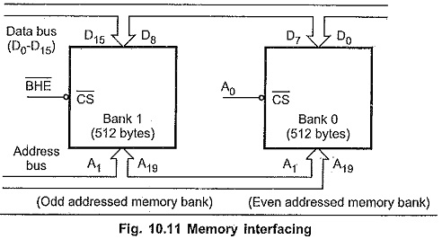

</div><div class="col">

- Расширение машинного слова:  
  机器字扩展：
    - два чипа памяти с 8-битным словом в параллель;  
      两个并行的具有 8 位字的存储芯片；
    - младший бит `0` и `1` соответственно;  
      最低有效位分别为“0”和“1”；
    - машинное слово процессора -- 16 бит.  
      处理器机器字 - 16 位。
- Расширение памяти, изоляция:  
  内存扩展、隔离：
    - 8 бит адресного пространства;  
      8位地址空间；
    - вывести дополнительные 2 бита;  
      输出额外的2位；
    - подать на память в качестве старших бит.  
      作为最高有效位提交到内存。

</div></div>

----

#### Банки памяти. Изоляция 记忆库。 绝缘


---

### Сегментная память (Segmentation) 分段内存

<div class="row"><div class="col">

- Сегментная адресация памяти -- способ логической адресации памяти, где адрес: сегмент + смещение.  
  段内存寻址是逻辑内存寻址的一种方法，其中地址：段+偏移量。
- Сегмент -- выделенная область адресного пространства определённого размера.  
  段是一定大小的地址空间的专用区域。
- Смещение -- адрес ячейки памяти относительно начала сегмента.  
  偏移量 - 内存单元相对于段开头的地址。

</div><div class="col">

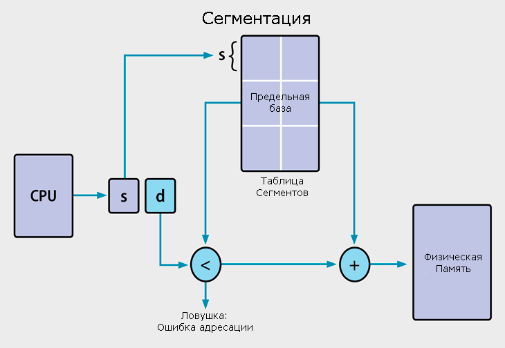

</div></div>

----

#### Сегментная память. Назначение 分段记忆。 目的

<div class="row"><div class="col">

1. Независимая адресация внутри задач относительно сегментов.  
   任务内相对于段的独立寻址。
2. Управление правами доступа в сегменте.  
   段内访问权限的管理。
3. Независимая адресация и изоляция программных модулей друг от друга.  
   程序模块之间独立寻址和隔离。
4. Предоставление одного сегмента памяти разным потокам команд для взаимодействия.  
   提供一个内存段给不同的命令流交互。

</div><div class="col">


</div></div>

----

### Виртуальная память 虚拟内存

<div class="row"><div class="col">

ПО использует виртуальные адреса, транслируемые на лету в физические.  
该软件使用动态转换为物理地址的虚拟地址。

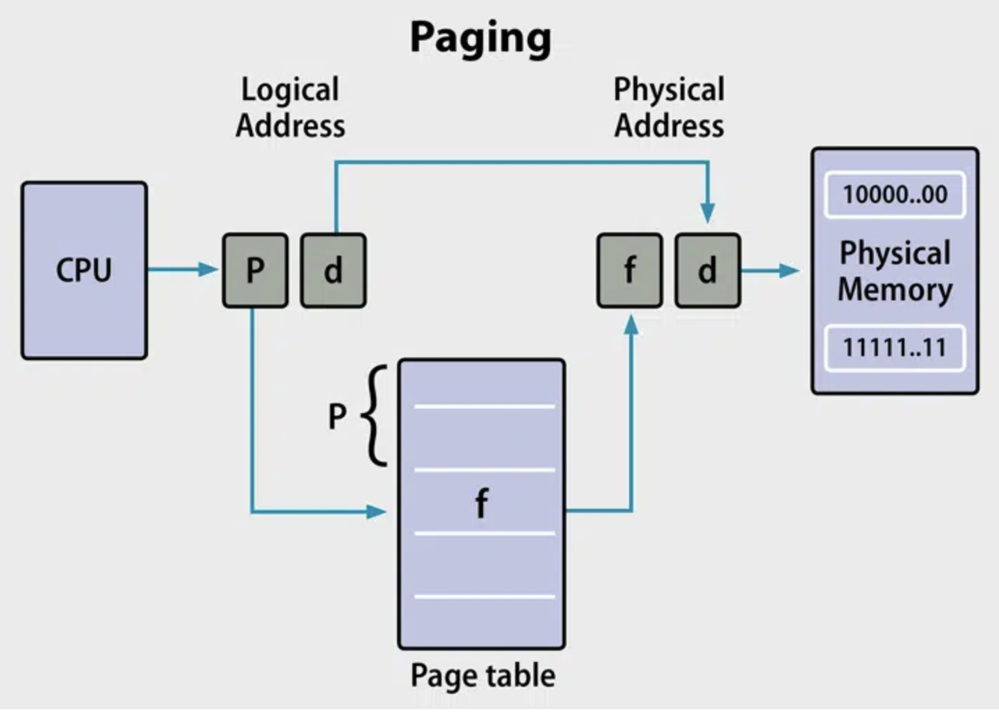

</div><div class="col">

- Развитие и упрощение сегментной памяти.  
  段存储器的开发和简化。
- Прозрачна с точки зрения прикладного ПО.  
  从应用软件的角度来看是透明的。
- Несоответствие физического и виртуального адресного пространства.  
  物理和虚拟地址空间不匹配。
- Расширение адресного пространства до условно бесконечного.  
  将地址空间扩展到有条件无限的地址空间。
- Совмещает дисковую и основную память. Отчасти -- кеш.  
  结合磁盘和主内存。 部分 - 缓存。

</div></div>

----

Вопросы:

1. Как выглядит работа компьютера без виртуальной памяти?  
   如果没有虚拟内存，计算机运行会是什么样子？
2. Что лучше: страничная или сегментная организация памяти?  
   页内存组织和段内存组织哪个更好？

----

#### Сегментная память. Анализ 分段记忆。 分析

<div class="row"><div class="col">

##### Segmentation Advantages

- No internal fragmentation.  
  无内部碎片。
- Segment tables consume less space compared to page tables.  
  与页表相比，段表消耗的空间更少。
- Average segment sizes are larger than most page sizes, which allows segments to store more process data.  
  平均段大小大于大多数页面大小，这允许段存储更多过程数据。
- Less processing overhead.  
  更少的处理开销。
- Simpler to relocate segments than to relocate contiguous address spaces on disk.  
  重新定位段比重新定位磁盘上的连续地址空间更简单。
- Segment tables are smaller than page tables, and take up less memory.  
  段表比页表小，占用内存也少。

</div><div class="col">

##### Segmentation Disadvantages

- Uses legacy technology in x86-64 servers.  
  在 x86-64 服务器中使用传统技术。
- Linux has limited segmentation support.  
  Linux 的分段支持有限。
- Requires programmer intervention.  
  需要程序员干预。
- Subject to serious external fragmentation.  
  受到严重的外部碎片影响。
- Hard to program and make compilers.  
  很难编程和制作编译器。

</div></div>

----

#### Виртуальная память. Анализ 虚拟内存。 分析

<div class="row"><div class="col">

##### Paging Advantages

- On the programmer level, paging is a transparent function and does not require intervention.  
  在程序员层面，分页是一个透明的功能，不需要干预。
- No external fragmentation.  
  无外部碎片。
- Frames do not have to be contiguous.  
  帧不必是连续的。

</div><div class="col">

##### Paging Disadvantages

- Longer memory lookup times than segmentation; remedy with TLB memory caches.  
  内存查找时间比分段更长； 使用 TLB 内存缓存进行补救。
- Не позволяет осуществить изоляцию внутри процесса.  
  不允许在进程内进行隔离。

</div></div>

---

### Взаимодействие между задачами 任务之间的交互

Типы задач в современном компьютере:  
现代计算机中的任务类型：

- **процессы** -- работают в изолированных адресных пространствах, а значит, у одного процесса нет доступа к данным другого процесса;  
  **进程** - 在隔离的地址空间中工作，这意味着一个进程无法访问另一进程的数据；
- **потоки** -- работают в едином адресном пространстве (процесса), а значит, у одного потока есть прямой доступ к данным другого потока.  
  **线程** - 在（进程的）单个地址空间中工作，这意味着一个线程可以直接访问另一个线程的数据。
- **зелёные потоки** -- реализуемые в рамках одного процесса на пользовательском уровне.  
  **绿色线程** - 在用户级别的单个进程中实现。

Взаимодействие -- передача информации между задачами.  
交互是任务之间的信息传递。

----

#### Взаимодействие процессов 流程交互

Основная проблема: как обеспечить доступ между данными изолированных процессов:  
主要问题：如何提供隔离进程之间的数据访问：

- IO: сеть, файл, pipe
- shared memory
- signals

Взаимодействие требует участия ОС.  
交互需要操作系统的参与。

----

#### Взаимодействие потоков 线程交互

Основная проблема: как проконтролировать доступ к данным неизолированных процессов.  
主要问题：如何控制非隔离进程对数据的访问。

- Mutex: ячейка памяти с двумя состояниями (0 -- не заблокировано, 1 -- заблокировано)  
  互斥体：具有两种状态的存储单元（0——未锁定，1——锁定）
- Семафор  
  信号量
- Атомарные операции, compare&swap  
  原子操作、比较和交换
- Software-Transactional Memory (STM)  
  软件事务内存（STM）
- Offtopic: Actor-Model and immutable data (Erlang)  
  题外话：演员模型和不可变数据（Erlang）

Механизмы синхронизации предоставляются ОС / процессором.  
同步机制由操作系统/处理器提供。

----

### Green Threads 绿色线程

Проблема: как остановить долгую задачу без прерываний и ОС?  
问题：如何在不中断和操作系统的情况下停止长时间运行的任务？

- **Erlang/OTP**. Green threads are implemented within a virtual machine. The internal scheduler (counting the number of executed instructions for each thread) allows the virtual machine to ensure an even distribution of processor time and meet the requirements of soft real-time. [Erlang Scheduler: what does it do?](https://erlang.org/pipermail/erlang-questions/2001-April/003132.html)  
  **Erlang/OTP**。 绿色线程在虚拟机内实现。 内部调度器（计算每个线程执行的指令数）使虚拟机能够确保处理器时间的均匀分配，满足软实时的要求。 [Erlang Scheduler：它有什么作用？](https://erlang.org/pipermail/erlang-questions/2001-April/003132.html)

<div class="row"><div class="col">

- **Golang**. Go-routines. It is a compromise between native threads (since it is a compiled language in machine code) and native threads (the language's run-time tracks key points of the algorithm that would interrupt the execution stream without the operating system).  
  **Golang**。 Go 例程。 它是本机线程（因为它是机器代码中的编译语言）和本机线程（该语言的运行时跟踪算法的关键点，这些关键点将在没有操作系统的情况下中断执行流）之间的折衷方案。

</div><div class="col">

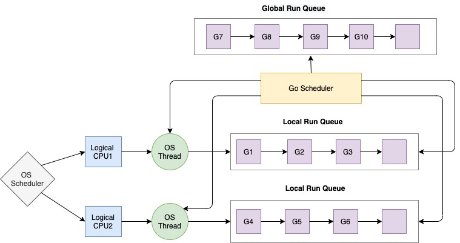

</div></div>

---

## Детерминизм многопоточного программирования 多线程编程的确定性

<div class="row"><div class="col">

```c
// Глобальные переменные с
// разделяемым состоянием.
int x, y, a, b;

// Два зеркальных потока.
void* thread1(void* unused) {
    x = 1;
    a = y;
    return NULL;
}

void* thread2(void* unused) {
    y = 1;
    b = x;
    return NULL;
}
```

</div><div class="col">

```c
while (1) {
    // инициализация начальных значений
    x = 0;
    y = 0;
    a = 0;
    b = 0;
    ...
    // запуск потоков
    pthread_create(&tid1, &attr1, thread1, NULL);
    pthread_create(&tid2, &attr2, thread2, NULL);

    // ожидание остановки потоков
    pthread_join(tid1, NULL);
    pthread_join(tid2, NULL);

    if(a == 0 && b == 0) {
        break;
    }
}
```

</div></div>

Возможна ли остановка алгоритма? 是否可以停止算法？ <br/> (источник: [Другой взгляд на многопоточность](https://habr.com/en/post/590339/))

---

## Уровневая организация 层级组织

----

### Architectural specification 架构规范

<div class="row"><div class="col">

Architecture 架构
: is fundamental concepts or properties of a system in its environment embodied in its elements, relationships, and in the principles of its design and evolution [ISO 42010].  
是系统在其环境中的基本概念或属性，体现在其元素、关系及其设计和演变的原则中[ISO 42010]。

Architectural specification 架构规范
: work product used to express an architecture.  
用于表达架构的工作产品。

The most popular type of architectural specification describes the selected layer of the system, and we call it "horizontal".  
最流行的架构规范类型描述了系统的选定层，我们称之为“水平”。

</div><div class="col">

 <!-- .element: height="250px" -->

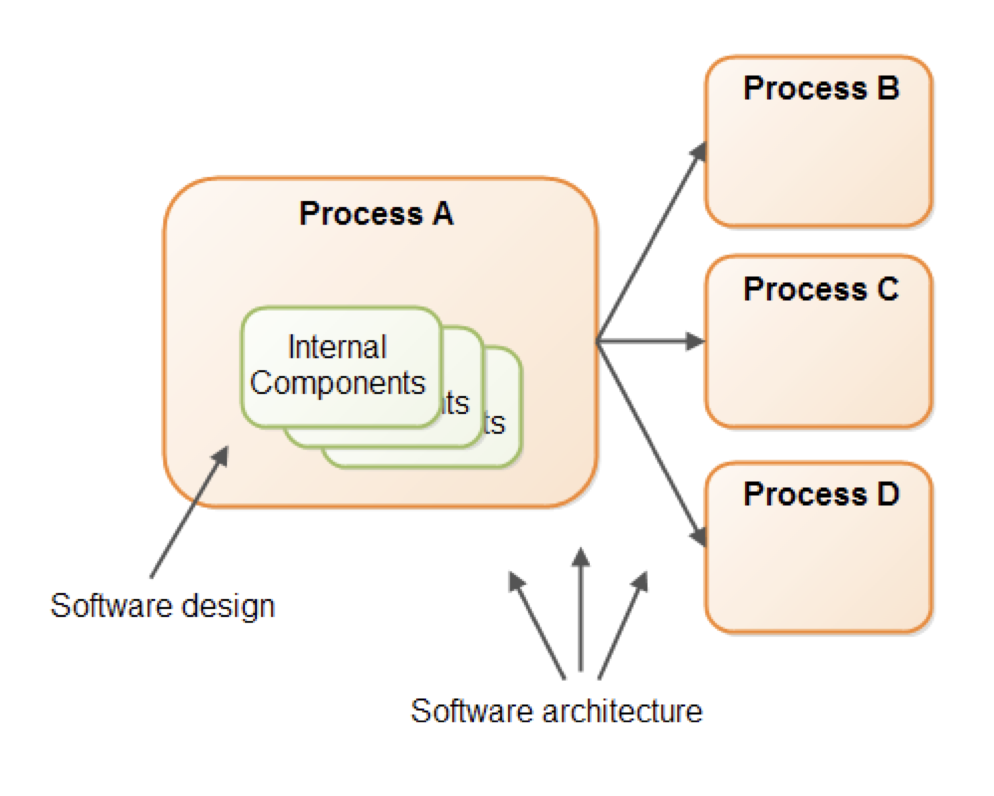 <!-- .element: height="250px" -->

</div></div>

----

### Подход к рассмотрению архитектуры 考虑架构的方法

<div class="row"><div class="col">


Горизонтальный 水平的

</div><div class="col">

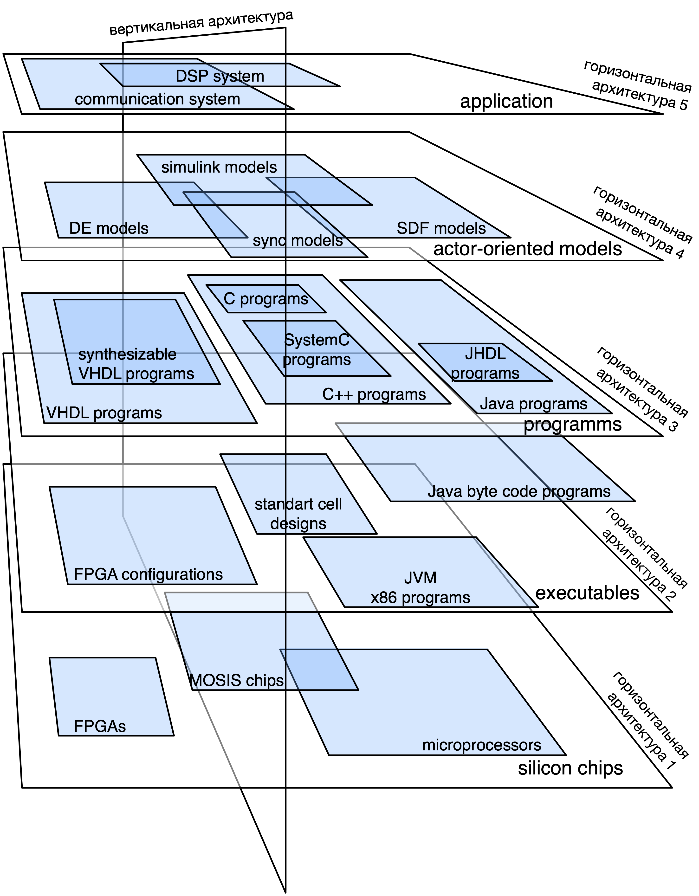 <!-- .element: height="550px" -->

Вертикальный 垂直的

</div></div>

----

### Architectural specification (vertical) 建筑规范（垂直）

<div class="row"><div class="col">

1. Specification of layers and their relationship.  
   层的规范及其关系。
2. In opposite to "horizontal" specification, we offer "vertical" architectural specification.  
   与“水平”规范相反，我们提供“垂直”架构规范。
3. Relationship -- evaluation or actualization.  
   关系——评价或实现。

</div><div class="col">


</div></div>

----

## Формирование уровней 层次的形成

**Уровень компьютерной системы** -- совокупность процессора, вычислительных процессов и моделей. Уровни определяются вне зависимости от конкретной стадии жизненного цикла вычислительной системы и могут включать в себя как архитектурные представления, так и модели, сформированные в процессе отладки.  
**计算机系统级**是一组处理器、计算过程和模型。 级别的确定与计算系统生命周期的特定阶段无关，并且可以包括在调试过程中形成的体系结构视图和模型。

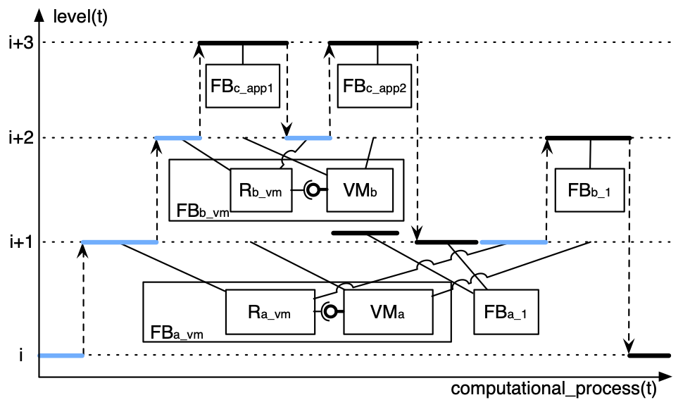 <!-- .element height="400px" -->

---

### Layered Style

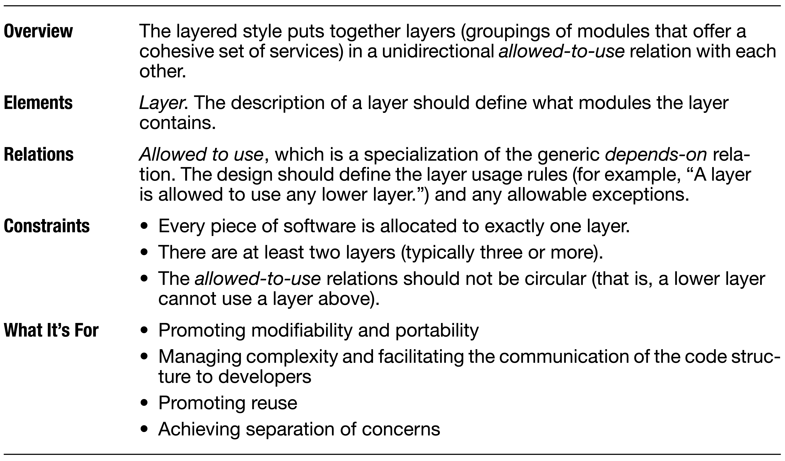  <!-- .element: class="fullscreen" -->

----

<div class="row"><div class="col">

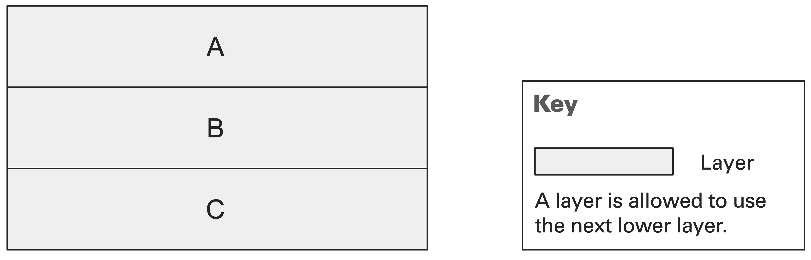  <!-- .element: class="fullscreen" -->

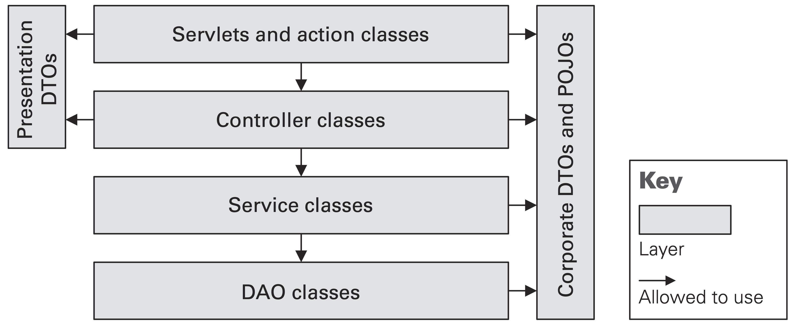  <!-- .element: class="fullscreen" -->

</div><div class="col">

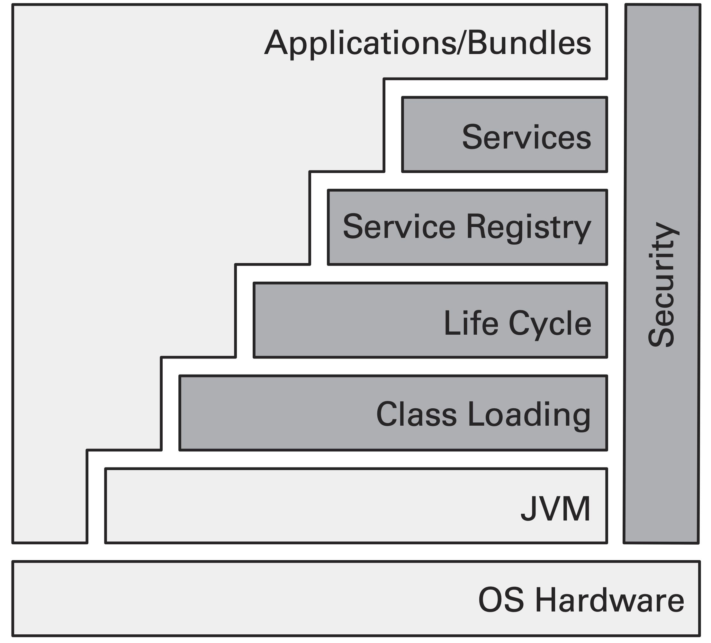 <!-- .element: height="250px" -->

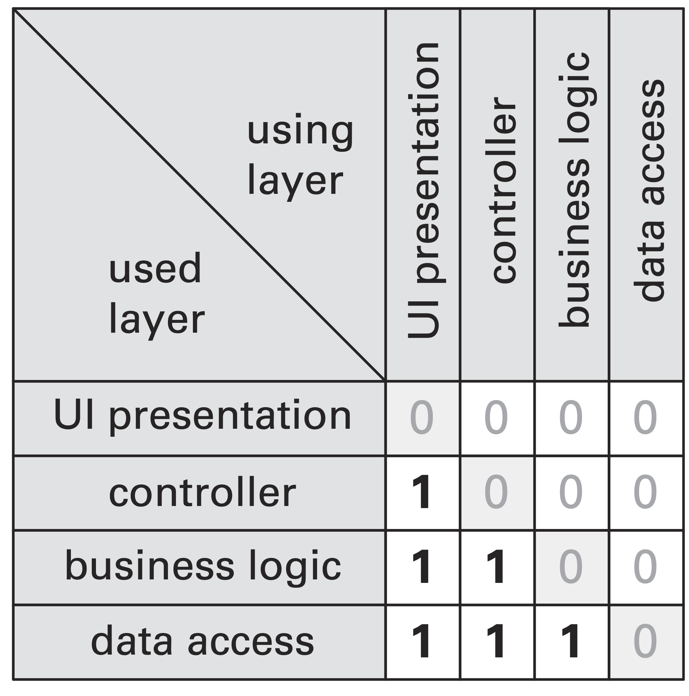 <!-- .element: height="250px" -->

</div></div>

----

### Модифицированный граф актуализации 修改后的更新图

<div class="row"><div class="col">

- Представления ВС в рамках различных ВПл вне зависимости от стадии жизненного цикла.  
  各种国内流离失所者中飞机的代表，无论生命周期的哪个阶段。
- Ориентированный ациклический граф, где вершины -- спецификации, используемые в ВсС, рёбра -- трансляции между ними.  
  有向无环图，其中顶点是 VS 中使用的规范，边是它们之间的平移。
- Анализ инструментальных цепочек и представлений процесса.  
  工具链和流程表示分析。
- Последовательная актуализация спецификаций в физический процесс не позволяет включить в рассмотрение спецификации, используемые для верификации.  
  将规范一致更新到物理过程中不允许包含用于验证的规范。

</div><div class="col">

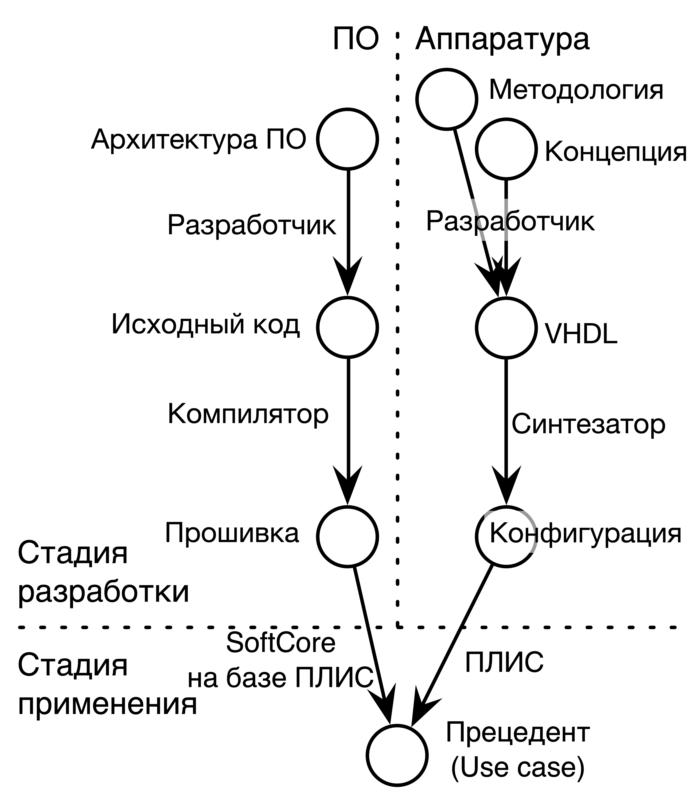

</div></div>

----

### Модель-процесс-вычислитель 模型过程计算机

<div class="row"><div class="col">

- Модель (конфигурация) вычислительного процесса, описывающая вычислительный процесс в рамках ВПл.  
  计算过程的模型（配置），描述VPL框架内的计算过程。
- Вычислитель -- целостный зафиксированный механизм, обеспечивающий вычислительный процесс.  
  计算机是提供计算过程的完整固定机构。
- Вычислительный процесс (ВП) и частичный процесс, который разворачивается вычислителем и соответствует модели по построению или формальному критерию.  
  计算过程（CP）和部分过程，由计算器部署并通过构造或形式标准与模型相对应。
- Компонент ВП -- атомарный или составной шаг вычислителя.  
  VP 组件是计算器的原子或复合步骤。

</div><div class="col">

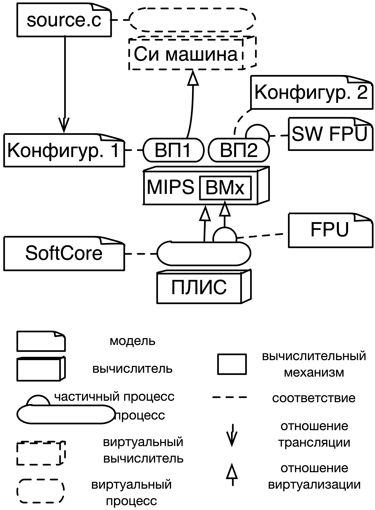

</div></div>

----

<div class="row"><div class="col">

- Вычислительный механизм (ВМх) -- часть вычислителя, обеспечивающая компонент ВП.  
  计算机制(CMx) - 提供VP 组件的计算机的一部分。
- Отношение виртуализации -- абстракция над процессом, фиксирующая вычислитель.  
  虚拟化关系是对修复计算机的过程的抽象。
    - Определяет полное множество атомарных компонентов ВП и позволяет описать любой допустимый ВП.  
      定义 VP 的完整原子组件集，并允许您描述任何有效的 VP。
    - Невыразимость процесса говорит о сбое вычислителя или некорректной виртуализации.  
      进程无法执行表明计算机出现故障或虚拟化不正确。
- Отношение трансляции -- формальное соответствие двух моделей друг другу.  
  翻译关系是两个模型相互之间的正式对应关系。

</div><div class="col">

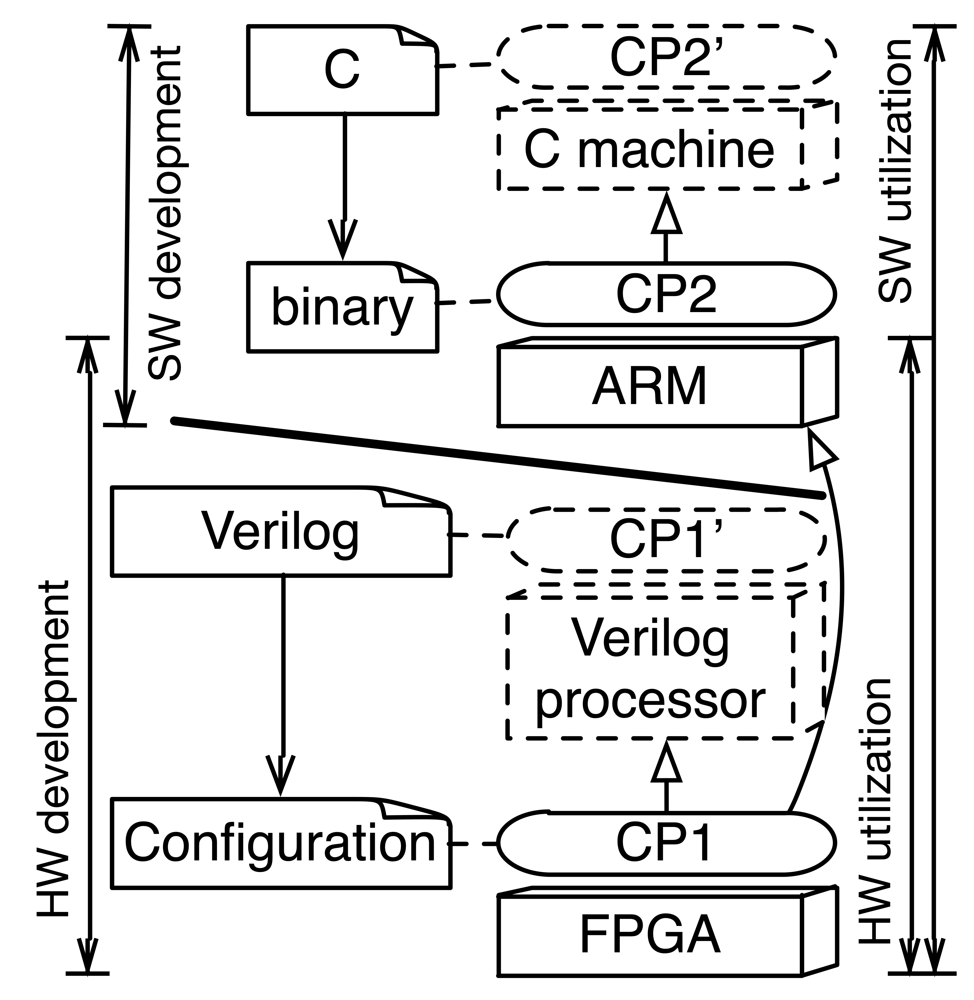

</div></div>

---

## Законы развития 发展规律 <br/> (в том числе и технологий) <br/>（包括技术）

Источник:

[Диалектика Гегеля и Закон Седова <br/> как способ верификации IT трендов <br/> с примерами из Автоматизации тестирования](https://m.youtube.com/watch?v=g8bkugcGeDg)

----

### Диалектика Гегеля 黑格尔辩证法

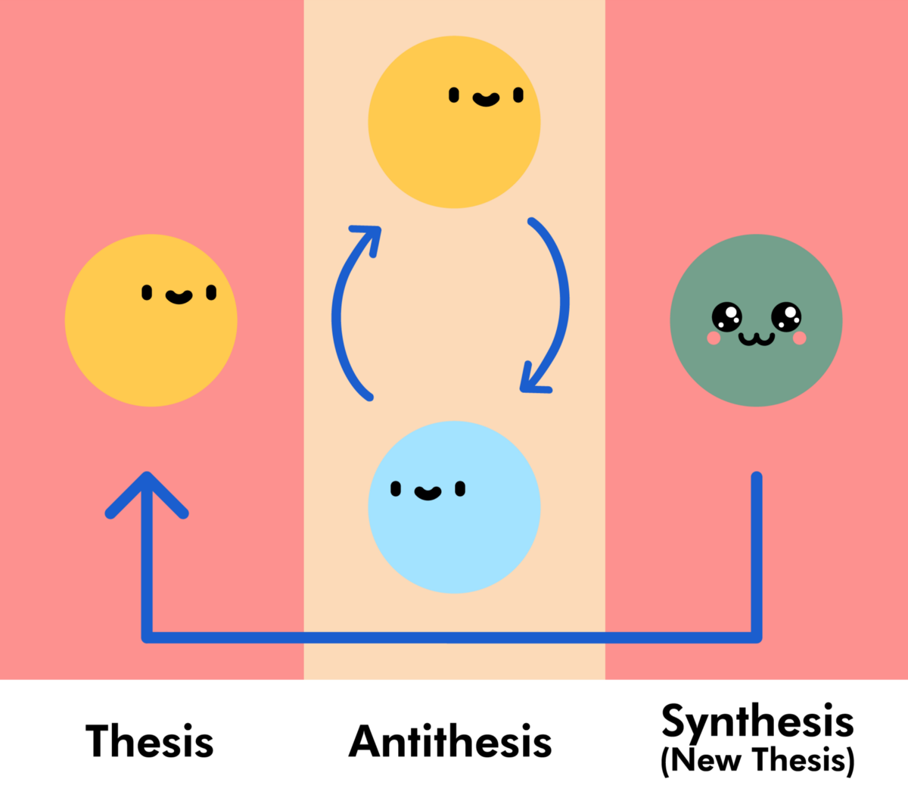

----

### Принцип развития иерархических систем Седова 谢多夫层次系统发展原理

В сложной иерархически организованной системе рост разнообразия на верхнем уровне обеспечивается ограничением разнообразия на предыдущих уровнях, и наоборот, рост разнообразия на нижнем уровне разрушает верхний уровень организации.  
在复杂的层级组织系统中，顶层多样性的增长是通过限制前几层的多样性来保证的，反之亦然，下层多样性的增长会破坏组织的顶层。

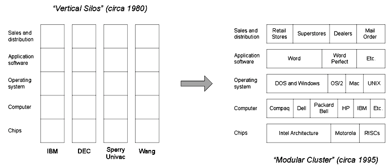

---

## Примечания 笔记

- Оптимизация на уровне компилятора:  
  编译器级别的优化：
    - <https://proebsting.cs.arizona.edu/law.html>
    - Пример задачи с автоматическим распараллеливанием циклов.  
      循环自动并行化任务的示例。
- Представление алгоритмов в процессе компиляции / интерпретации.  
  编译/解释过程中算法的表示。
- Аппаратные ускорители и сопроцессоры (сложность интеграции как в компилятор, так и в "железо").  
  硬件加速器和协处理器（难以集成到编译器和硬件中）。
- Временная предсказуемость.  
  时间可预测性。
- Атаки через косвенные эффекты ("Протечка абстракций").  
  通过间接影响进行攻击（“抽象泄漏”）。

---

## Таксономия Флинна. 分类学弗林。 [S/M]I[S/M]D

Классификация базируется на понятии потока, под которым понимается последовательность элементов, команд или данных, обрабатываемая процессором:  
该分类基于线程的概念，线程是由处理器处理的元素、命令或数据的序列：

<div class="row"><div class="col">

- **SISD (single instruction stream / single data stream)**  
  **SISD（单指令流/单数据流）**

- **SIMD (single instruction stream / multiple data stream)**  
  **SIMD（单指令流/多数据流）**

- **MISD (multiple instruction stream / single data stream)**  
  **MISD（多指令流/单数据流）**

- **MIMD (multiple instruction stream / multiple data stream)**  
  **MIMD（多指令流/多数据流）**

</div><div class="col">


</div></div>

----

### Таксономия Флинна. Недостатки 弗林的分类法。 缺陷

- Невозможность представления совсем не фон Неймановских архитектур (dataflow, векторно-конвейерные).  
  表示的不可能性根本不是诺依曼架构（数据流、向量管道）的背景。
- Чрезмерная заполненность класса MIMD.  
  MIMD 类过于完备。

Источник: [Классификация Флинна](https://parallel.ru/computers/taxonomy/flynn.html)

----

### SIMT （单指令、多线程）

SIMT  (Single instruction, multiple threads) SIMT（单指令、多线程）

- сочетает SIMD и многопоточность.  
  结合了 SIMD 和多线程。
- используется в GPGPU.  
  用于 GPGPU。

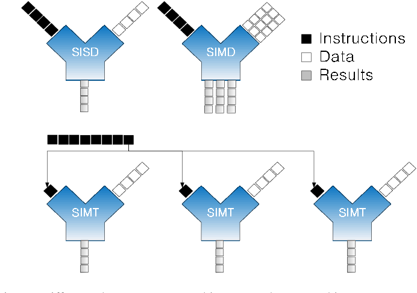
