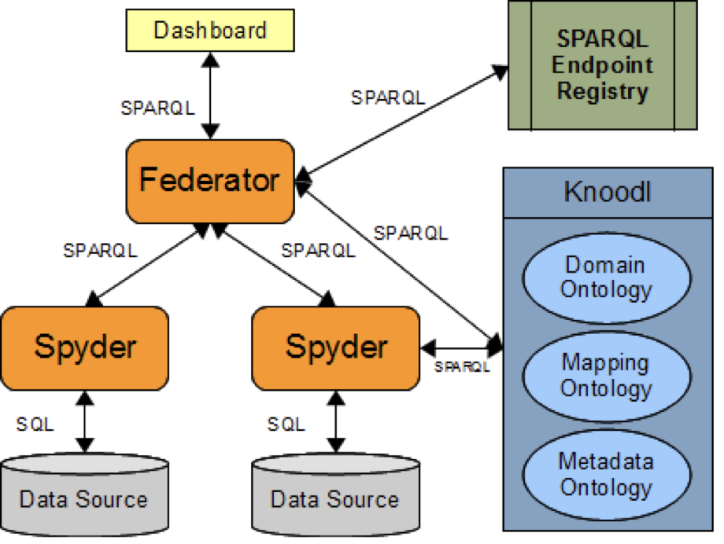

# Архитектура компьютера

## Лекция 16

### Изоляция задач. Уровневая организация. Disaggregation. Blockchain

Пенской А.В., 2022

----

### План лекции

- Изоляция
    - Банки памяти (Memory Bank)
    - Сегментная память (Segmentation)
    - Виртуальная память
- Взаимодействие между задачами
- Детерминизм многопоточного программирования
- Уровневая организация. Понятие уровня организации вычислительного процесса
- Диалектика Гегеля и принцип развития иерархических систем Седова
- Классификация Флинна

---

## Сосуществование задач

Успешный параллелизм задач требует:

1. Обеспечить **изоляцию** между потоками команд.
1. Обеспечить **взаимодействие** между потоками команд.

*Вопрос*:

- Как выглядит работа компьютера без изоляции процессов?
- Что нужно изолировать?

<div>

- изоляция инструкций/данных
- изоляция инструкций/данных процедур
- автоматическая память
- heap
- изоляция инструкций/данных задач
- изоляция программных модулей

</div> <!-- .element: class="fragment" -->

---

## Изоляция

- Банки памяти (Memory Bank)
- Сегментация (Segmentation)
- Виртуальная память

----

### Банки памяти (Memory Bank)

<div class="row"><div class="col">

- Память имеет большее адресное пространство, чем процессор.
- Не является инструментом изоляции, но может.


</div><div class="col">

- Расширение машинного слова:
    - два чипа памяти с 8-битным словом в параллель;
    - младший бит `0` и `1` соответственно;
    - машинное слово процессора -- 16 бит.
- Расширение памяти, изоляция:
    - 8 бит адресного пространства;
    - вывести дополнительные 2 бита;
    - подать на память в качестве старших бит.

</div></div>

----

#### Банки памяти. Изоляция


---

### Сегментная память (Segmentation)

<div class="row"><div class="col">

- Сегментная адресация памяти -- способ логической адресации памяти, где адрес: сегмент + смещение.
- Сегмент -- выделенная область адресного пространства определённого размера.
- Смещение -- адрес ячейки памяти относительно начала сегмента.

</div><div class="col">


</div></div>

----

#### Сегментная память. Назначение

<div class="row"><div class="col">

1. Независимая адресация внутри задач относительно сегментов.
1. Управление правами доступа в сегменте.
1. Независимая адресация и изоляция программных модулей друг от друга.
1. Предоставление одного сегмента памяти разным потокам команд для взаимодействия.

</div><div class="col">


</div></div>

----

### Виртуальная память

<div class="row"><div class="col">

ПО использует виртуальные адреса, транслируемые на лету в физические.


</div><div class="col">

- Развитие и упрощение сегментной памяти.
- Прозрачна с точки зрения прикладного ПО.
- Несоответствие физического и виртуального адресного пространства.
- Расширение адресного пространства до условно бесконечного.
- Совмещает дисковую и основную память. Отчасти -- кеш.

</div></div>

----

Вопросы:

1. Как выглядит работа компьютера без виртуальной памяти?
1. Что лучше: страничная или сегментная организация памяти?

----

#### Сегментная память. Анализ

<div class="row"><div class="col">

##### Segmentation Advantages

- No internal fragmentation.
- Segment tables consume less space compared to page tables.
- Average segment sizes are larger than most page sizes, which allows segments to store more process data.
- Less processing overhead.
- Simpler to relocate segments than to relocate contiguous address spaces on disk.
- Segment tables are smaller than page tables, and take up less memory.

</div><div class="col">

##### Segmentation Disadvantages

- Uses legacy technology in x86-64 servers.
- Linux has limited segmentation support.
- Requires programmer intervention.
- Subject to serious external fragmentation.
- Hard to program and make compilers.

</div></div>

----

#### Виртуальная память. Анализ

<div class="row"><div class="col">

##### Paging Advantages

- On the programmer level, paging is a transparent function and does not require intervention.
- No external fragmentation.
- Frames do not have to be contiguous.

</div><div class="col">

##### Paging Disadvantages

- Longer memory lookup times than segmentation; remedy with TLB memory caches.
- Не позволяет осуществить изоляцию внутри процесса.

</div></div>

---

### Взаимодействие между задачами

Типы задач в современном компьютере:

- **процессы** -- работают в изолированных адресных пространствах, а значит, у одного процесса нет доступа к данным другого процесса;
- **потоки** -- работают в едином адресном пространстве (процесса), а значит, у одного потока есть прямой доступ к данным другого потока.
- **зелёные потоки** -- реализуемые в рамках одного процесса на пользовательском уровне.

Взаимодействие -- передача информации между задачами.

----

#### Взаимодействие процессов

Основная проблема: как обеспечить доступ между данными изолированных процессов:

- IO: сеть, файл, pipe
- shared memory
- signals

Взаимодействие требует участия ОС.

----

#### Взаимодействие потоков

Основная проблема: как проконтролировать доступ к данным неизолированных процессов.

- Mutex: ячейка памяти с двумя состояниями (0 -- не заблокировано, 1 -- заблокировано)
- Семафор
- Атомарные операции, compare&swap
- Software-Transactional Memory (STM)
- Offtopic: Actor-Model and immutable data (Erlang)

Механизмы синхронизации предоставляются ОС / процессором.

----

### Green Threads

Проблема: как остановить долгую задачу без прерываний и ОС?

- **Erlang/OTP**. Green threads are implemented within a virtual machine. The internal scheduler (counting the number of executed instructions for each thread) allows the virtual machine to ensure an even distribution of processor time and meet the requirements of soft real-time. [Erlang Scheduler: what does it do?](https://erlang.org/pipermail/erlang-questions/2001-April/003132.html)

<div class="row"><div class="col">

- **Golang**. Go-routines. It is a compromise between native threads (since it is a compiled language in machine code) and native threads (the language's run-time tracks key points of the algorithm that would interrupt the execution stream without the operating system).

</div><div class="col">


</div></div>

---

## Детерминизм многопоточного программирования

<div class="row"><div class="col">

```c
// Глобальные переменные с
// разделяемым состоянием.
int x, y, a, b;

// Два зеркальных потока.
void* thread1(void* unused) {
    x = 1;
    a = y;
    return NULL;
}

void* thread2(void* unused) {
    y = 1;
    b = x;
    return NULL;
}
```

</div><div class="col">

```c
while (1) {
    // инициализация начальных значений
    x = 0;
    y = 0;
    a = 0;
    b = 0;
    ...
    // запуск потоков
    pthread_create(&tid1, &attr1, thread1, NULL);
    pthread_create(&tid2, &attr2, thread2, NULL);

    // ожидание остановки потоков
    pthread_join(tid1, NULL);
    pthread_join(tid2, NULL);

    if(a == 0 && b == 0) {
        break;
    }
}
```

</div></div>

Возможна ли остановка алгоритма? <br/> (источник: [Другой взгляд на многопоточность](https://habr.com/en/post/590339/))

---

## Уровневая организация

----

### Architectural specification

<div class="row"><div class="col">

Architecture
: is fundamental concepts or properties of a system in its environment embodied in its elements, relationships, and in the principles of its design and evolution [ISO 42010].

Architectural specification
: work product used to express an architecture.

The most popular type of architectural specification describes the selected layer of the system, and we call it "horizontal".

</div><div class="col">

 <!-- .element: height="250px" -->

 <!-- .element: height="250px" -->

</div></div>

----

### Подход к рассмотрению архитектуры

<div class="row"><div class="col">


Горизонтальный

</div><div class="col">

 <!-- .element: height="550px" -->

Вертикальный

</div></div>

----

### Architectural specification (vertical)

<div class="row"><div class="col">

1. Specification of layers and their relationship.
1. In opposite to "horizontal" specification, we offer "vertical" architectural specification.
1. Relationship -- evaluation or actualization.

</div><div class="col">


</div></div>

----

## Формирование уровней

**Уровень компьютерной системы** -- совокупность процессора, вычислительных процессов и моделей. Уровни определяются вне зависимости от конкретной стадии жизненного цикла вычислительной системы и могут включать в себя как архитектурные представления, так и модели, сформированные в процессе отладки.

 <!-- .element height="400px" -->

---

### Layered Style

  <!-- .element: class="fullscreen" -->

----

<div class="row"><div class="col">

  <!-- .element: class="fullscreen" -->

  <!-- .element: class="fullscreen" -->

</div><div class="col">

 <!-- .element: height="250px" -->

 <!-- .element: height="250px" -->

</div></div>

----

### Модифицированный граф актуализации

<div class="row"><div class="col">

- Представления ВС в рамках различных ВПл вне зависимости от стадии жизненного цикла.
- Ориентированный ациклический граф, где вершины -- спецификации, используемые в ВсС, рёбра -- трансляции между ними.
- Анализ инструментальных цепочек и представлений процесса.
- Последовательная актуализация спецификаций в физический процесс не позволяет включить в рассмотрение спецификации, используемые для верификации.

</div><div class="col">


</div></div>

----

### Модель-процесс-вычислитель

<div class="row"><div class="col">

- Модель (конфигурация) вычислительного процесса, описывающая вычислительный процесс в рамках ВПл.
- Вычислитель -- целостный зафиксированный механизм, обеспечивающий вычислительный процесс.
- Вычислительный процесс (ВП) и частичный процесс, который разворачивается вычислителем и соответствует модели по построению или формальному критерию.
- Компонент ВП -- атомарный или составной шаг вычислителя.

</div><div class="col">


</div></div>

----

<div class="row"><div class="col">

- Вычислительный механизм (ВМх) -- часть вычислителя, обеспечивающая компонент ВП.
- Отношение виртуализации -- абстракция над процессом, фиксирующая вычислитель.
    - Определяет полное множество атомарных компонентов ВП и позволяет описать любой допустимый ВП.
    - Невыразимость процесса говорит о сбое вычислителя или некорректной виртуализации.
- Отношение трансляции -- формальное соответствие двух моделей друг другу.

</div><div class="col">


</div></div>

---

## Законы развития <br/> (в том числе и технологий)

Источник:

[Диалектика Гегеля и Закон Седова <br/> как способ верификации IT трендов <br/> с примерами из Автоматизации тестирования](https://m.youtube.com/watch?v=g8bkugcGeDg)

----

### Диалектика Гегеля


----

### Принцип развития иерархических систем Седова

В сложной иерархически организованной системе рост разнообразия на верхнем уровне обеспечивается ограничением разнообразия на предыдущих уровнях, и наоборот, рост разнообразия на нижнем уровне разрушает верхний уровень организации.


---

## Примечания

- Оптимизация на уровне компилятора:
    - <https://proebsting.cs.arizona.edu/law.html>
    - Пример задачи с автоматическим распараллеливанием циклов.
- Представление алгоритмов в процессе компиляции / интерпретации.
- Аппаратные ускорители и сопроцессоры (сложность интеграции как в компилятор, так и в "железо").
- Временная предсказуемость.
- Атаки через косвенные эффекты ("Протечка абстракций").

---

## Таксономия Флинна. [S/M]I[S/M]D

Классификация базируется на понятии потока, под которым понимается последовательность элементов, команд или данных, обрабатываемая процессором:

<div class="row"><div class="col">

- **SISD (single instruction stream / single data stream)**

- **SIMD (single instruction stream / multiple data stream)**

- **MISD (multiple instruction stream / single data stream)**

- **MIMD (multiple instruction stream / multiple data stream)**

</div><div class="col">


</div></div>

----

### Таксономия Флинна. Недостатки

- Невозможность представления совсем не фон Неймановских архитектур (dataflow, векторно-конвейерные).
- Чрезмерная заполненность класса MIMD.

Источник: [Классификация Флинна](https://parallel.ru/computers/taxonomy/flynn.html)

----

### SIMT

SIMT  (Single instruction, multiple threads)

- сочетает SIMD и многопоточность.
- используется в GPGPU.


