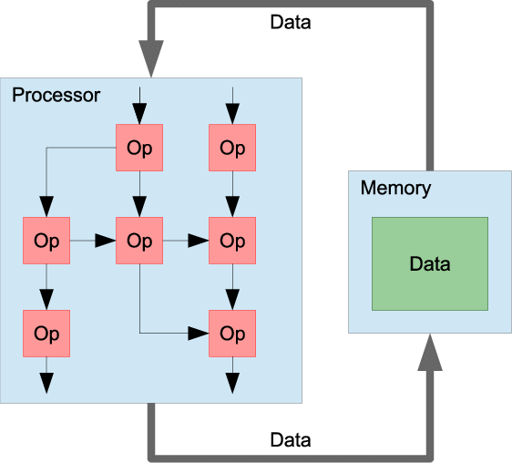

# Заметки

- Потоковые машины (от появления входных данных для выполнения вычислений).

    

- Редукционные компьютеры (от необходимости вычисления результатов).
- High-level Language Computer Architecture or language-directed computer design (когда попытались поднять уровень ассемблера);
    - <https://ru.wikipedia.org/wiki/IAPX_432> -- высокоуровневый процессор от Intel
    - <https://en.wikipedia.org/wiki/Jazelle> -- процессор с поддержкой java
    - <https://en.wikipedia.org/wiki/PicoJava> -- picoJava
- детерминированные по времени процессора (для гарантий реального времени);
- transport triggered architecture (управляем не обработкой данный, а транспортом);
- Coarse-Grained Reconfigurable Arrays (очень странное семейство процессоров)
    - NITTA
    - их классификация из обзора
- <https://en.wikipedia.org/wiki/Reconfigurable_computing>
- процессоры с поддержкой языков программирования высокого уровня, динамических языков.
- специализированные процессоры (эффективный параллелизм под задачу, эффективная работа с кешом, управление точностью вычислений, более эффективное программирование за счет ручной оптимизации под процессор). Связка DSL+ спец процессор

Связка процессов разработки процессоров и инструментальных средств для разработки чипов.

- наследники архитектуры фон Неймана, среди которых:
    - tagged architecture (когда попытались учесть на низком уровне типы данных);

- Модель-ориентированная инженерия.

---

## Забытое

- [Барьеры памяти](https://ru.wikipedia.org/wiki/Барьер_памяти) -- вероятно нужно перенести к суперскалярам.
- Общая память (например, у CPU и GPU)
- Интерфейсы периферийных устройств и их классификация.

<!-- # Заметки -->

<!-- ## Развитие и переосмысление языков описания аппаратуры -->

<!-- - Chisel -->
<!-- - Clash -->
<!-- - Bluespec -->

<!-- , к примеру готовность устройства к передаче данных или наступление заданного события (срабатывание таймера, нажатие на клавишу и т.п.). Внешнее событие (прерывание) приводит к выполнению служебной функции, реализующей или регистрирующую операцию ввода/вывода. Непосредственно ввод-вывод реализуется по-прежнему процессором. -->

<!-- - Channel I/O и прямой доступ к памяти (Direct Memory Access -- DMA). В случае, если необходимо передать большой объём данных, использование для этого процессора является не целесообразным по причине его откровенной избыточности для этих задач. В таком случае могут применяться процессоры ввода-вывода или контроллеры прямого доступа к памяти, которые позволяют процессору задекларировать необходимость передачи данных (откуда, куда, сколько), после чего её сможет реализовать специализированное устройство, которое, собственно, и обеспечит передачу данных и уведомит процессор о результатах через систему прерываний. -->
