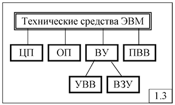

## [MainPage](../index.md)/[Computer NetWork](README.md)/Chapter1 Questions

- [MainPage/Computer NetWork/Chapter1 Questions](#mainpagecomputer-networkchapter1-questions)
- [Раздел 1: Принципы организации компьютерных сетей](#раздел-1-принципы-организации-компьютерных-сетей)
  - [1. В чем отличие между понятиями «данные» и «информация»?  “数据”和“信息”这两个概念有什么区别？](#1-в-чем-отличие-между-понятиями-данные-и-информация--数据和信息这两个概念有什么区别)
  - [2. Что является количественной мерой данных (информации)?  数据（信息）的定量衡量标准是什么？](#2-что-является-количественной-мерой-данных-информации--数据信息的定量衡量标准是什么)
  - [3. В чем разница между понятиями «вычислительная машина» и «вычислительная система»?  “计算机”与“计算系统”这两个概念有什么区别？](#3-в-чем-разница-между-понятиями-вычислительная-машина-и-вычислительная-система--计算机与计算系统这两个概念有什么区别)
  - [4. «Канал связи» и «линия связи» — это одно и то же?  “通信信道”和“通信线路”是同一个概念吗？](#4-канал-связи-и-линия-связи--это-одно-и-то-же--通信信道和通信线路是同一个概念吗)
  - [5. Какое оборудование входит в состав канала связи?  通信信道包含哪些设备？](#5-какое-оборудование-входит-в-состав-канала-связи--通信信道包含哪些设备)
  - [6. Какие устройства относятся к АПД?  哪些设备属于数据传输设备（АПД）？](#6-какие-устройства-относятся-к-апд--哪些设备属于数据传输设备апд)
  - [7. Что представляет собой «составной канал связи»?  什么是“复合通信信道”？](#7-что-представляет-собой-составной-канал-связи--什么是复合通信信道)
  - [8. Классификация каналов связи.  通信信道的分类。](#8-классификация-каналов-связи--通信信道的分类)
  - [9. Как называется канал связи, по которому возможна передача в обоих направлениях, но в разные моменты времени (одновременно)?  可以双向传输数据，但不同时间段传输的通信信道叫什么？](#9-как-называется-канал-связи-по-которому-возможна-передача-в-обоих-направлениях-но-в-разные-моменты-времени-одновременно--可以双向传输数据但不同时间段传输的通信信道叫什么)
  - [10. Канал связи, предоставляемый на определённое время (существующий постоянно между двумя пользователями), называется ...  在特定时间内为两个用户提供的通信信道（始终存在于两个用户之间）称为……？](#10-канал-связи-предоставляемый-на-определённое-время-существующий-постоянно-между-двумя-пользователями-называется---在特定时间内为两个用户提供的通信信道始终存在于两个用户之间称为)
  - [11. В каких единицах принято измерять пропускную способность каналов связи в компьютерных сетях?  计算机网络中通信信道的带宽是以什么单位测量的？](#11-в-каких-единицах-принято-измерять-пропускную-способность-каналов-связи-в-компьютерных-сетях--计算机网络中通信信道的带宽是以什么单位测量的)
  - [12. Пропускная способность канала связи 100 кбит/с – это сколько бит/с?  100 kbit/s 的通信信道带宽是多少 bit/s？](#12-пропускная-способность-канала-связи-100-кбитс--это-сколько-битс--100-kbits-的通信信道带宽是多少-bits)
  - [13. Выберите корректно заданные значения пропускных способностей канала связи в компьютерной сети?  选择正确的计算机网络通信信道带宽值？](#13-выберите-корректно-заданные-значения-пропускных-способностей-канала-связи-в-компьютерной-сети--选择正确的计算机网络通信信道带宽值)
  - [14. Скорость модуляции – это …?  调制速度是什么？](#14-скорость-модуляции--это---调制速度是什么)
  - [15. В каких единицах измеряется полоса пропускания канала (скорость модуляции, пропускная способность)?  通信信道带宽（调制速度，带宽）以什么单位测量？](#15-в-каких-единицах-измеряется-полоса-пропускания-канала-скорость-модуляции-пропускная-способность--通信信道带宽调制速度带宽以什么单位测量)
  - [16. Рассчитать максимально возможную пропускную способность (бит/с) канала связи при условии, что полоса пропускания равна 10 МГц, а отношение мощности сигнала к мощности шума равно 15.  在带宽为10 MHz，信噪比为15的情况下，计算通信信道的最大带宽（bit/s）。](#16-рассчитать-максимально-возможную-пропускную-способность-битс-канала-связи-при-условии-что-полоса-пропускания-равна-10-мгц-а-отношение-мощности-сигнала-к-мощности-шума-равно-15--在带宽为10-mhz信噪比为15的情况下计算通信信道的最大带宽bits)
  - [17. Основные функции узлов связи.  通信节点的主要功能是什么？](#17-основные-функции-узлов-связи--通信节点的主要功能是什么)
  - [18. Понятия маршрутизации, коммутации и мультиплексирования.  路由、交换和复用的概念。](#18-понятия-маршрутизации-коммутации-и-мультиплексирования--路由交换和复用的概念)
  - [19. Методы мультиплексирования в компьютерных сетях.  计算机网络中的复用方法。](#19-методы-мультиплексирования-в-компьютерных-сетях--计算机网络中的复用方法)
  - [20. В чем отличие асинхронного временного мультиплексирования от синхронного?  异步时分复用与同步时分复用有什么区别？](#20-в-чем-отличие-асинхронного-временного-мультиплексирования-от-синхронного--异步时分复用与同步时分复用有什么区别)
  - [21. Какая англоязычная аббревиатура соответствует частотному (временно'му, волновому) мультиплексированию?  频分（时分，波分）复用对应的英文缩写是什么？](#21-какая-англоязычная-аббревиатура-соответствует-частотному-временному-волновому-мультиплексированию--频分时分波分复用对应的英文缩写是什么)
  - [22. Перечислить требования к организации компьютерных сетей.  列举计算机网络组织的要求。](#22-перечислить-требования-к-организации-компьютерных-сетей--列举计算机网络组织的要求)
  - [23. Что означает требование открытости (масштабируемости) компьютерной сети?  计算机网络的开放性（可扩展性）要求是什么意思？](#23-что-означает-требование-открытости-масштабируемости-компьютерной-сети--计算机网络的开放性可扩展性要求是什么意思)
  - [24. Как называются логические программно-организованные точки, через которые взаимодействующие процессы обмениваются сообщениями?  通过哪些逻辑的、软件组织的接口，进行通信的进程交换消息？](#24-как-называются-логические-программно-организованные-точки-через-которые-взаимодействующие-процессы-обмениваются-сообщениями--通过哪些逻辑的软件组织的接口进行通信的进程交换消息)
  - [25. Как называется промежуток времени, в течение которого взаимодействуют процессы?  通信进程的时间间隔叫什么？](#25-как-называется-промежуток-времени-в-течение-которого-взаимодействуют-процессы--通信进程的时间间隔叫什么)
  - [26. Назначение многоуровневой модели взаимодействия открытых систем.  开放系统互联（OSI）多层模型的目的是什么？](#26-назначение-многоуровневой-модели-взаимодействия-открытых-систем--开放系统互联osi多层模型的目的是什么)
  - [27. На каком уровне OSI-модели реализуются функции доступа к среде передачи данных?  在OSI模型中，数据传输介质访问功能在哪一层实现？](#27-на-каком-уровне-osi-модели-реализуются-функции-доступа-к-среде-передачи-данных--在osi模型中数据传输介质访问功能在哪一层实现)
  - [28. На каком уровне OSI-модели реализуются функции маршрутизации?  OSI模型中路由功能在哪一层实现？](#28-на-каком-уровне-osi-модели-реализуются-функции-маршрутизации--osi模型中路由功能在哪一层实现)
  - [29. Как изменяется структура данных при передаче между уровнями управления?  数据结构在不同管理层次间传输时如何变化？](#29-как-изменяется-структура-данных-при-передаче-между-уровнями-управления--数据结构在不同管理层次间传输时如何变化)
  - [30. В чем отличие логической передачи от физической в OSI-модели?  OSI模型中的逻辑传输与物理传输有什么区别？](#30-в-чем-отличие-логической-передачи-от-физической-в-osi-модели--osi模型中的逻辑传输与物理传输有什么区别)
  - [31. Может ли сетевой уровень одной системы послать сообщение канальному уровню другой системы?  网络层能否将消息发送到另一系统的链路层？](#31-может-ли-сетевой-уровень-одной-системы-послать-сообщение-канальному-уровню-другой-системы--网络层能否将消息发送到另一系统的链路层)
  - [32. Функции МАС и LLC-подуровней.  MAC和LLC子层的功能是什么？](#32-функции-мас-и-llc-подуровней--mac和llc子层的功能是什么)
  - [33. Чем отличается состав сетевой операционной системы от операционной системы компьютера?  网络操作系统和计算机操作系统的组成有什么不同？](#33-чем-отличается-состав-сетевой-операционной-системы-от-операционной-системы-компьютера--网络操作系统和计算机操作系统的组成有什么不同)
  - [34. Что такое PDU?  什么是PDU？](#34-что-такое-pdu--什么是pdu)
  - [35. Какая топология СПД обладает максимальной (минимальной) надежностью (производительностью, временем доставки сообщений)?  哪种网络拓扑具有最高（最低）的可靠性（性能，消息传输时间）？](#35-какая-топология-спд-обладает-максимальной-минимальной-надежностью-производительностью-временем-доставки-сообщений--哪种网络拓扑具有最高最低的可靠性性能消息传输时间)
  - [36. В чем отличие логической топологии от физической?  逻辑拓扑与物理拓扑有什么区别？](#36-в-чем-отличие-логической-топологии-от-физической--逻辑拓扑与物理拓扑有什么区别)
  - [37. Пояснить принцип коммутации каналов (пакетов, сообщений, ячеек).  解释电路交换（分组交换，消息交换，单元交换）的原理。](#37-пояснить-принцип-коммутации-каналов-пакетов-сообщений-ячеек--解释电路交换分组交换消息交换单元交换的原理)
  - [38. Какими достоинствами и недостатками обладает коммутация каналов (пакетов, сообщений)?  电路交换（分组交换，消息交换）的优点和缺点是什么？](#38-какими-достоинствами-и-недостатками-обладает-коммутация-каналов-пакетов-сообщений--电路交换分组交换消息交换的优点和缺点是什么)
  - [39. При каком способе коммутации каналы связи должны иметь одинаковые пропускные способности на всем пути передачи?  在哪种交换方式下，通信信道的带宽必须在整个传输路径上保持一致？](#39-при-каком-способе-коммутации-каналы-связи-должны-иметь-одинаковые-пропускные-способности-на-всем-пути-передачи--在哪种交换方式下通信信道的带宽必须在整个传输路径上保持一致)
  - [40. Пояснить, почему при коммутации пакетов буферная память используется более эффективно, чем при коммутации сообщений?  为什么分组交换比消息交换更有效地使用缓冲存储器？](#40-пояснить-почему-при-коммутации-пакетов-буферная-память-используется-более-эффективно-чем-при-коммутации-сообщений--为什么分组交换比消息交换更有效地使用缓冲存储器)
  - [41. Какими преимуществами обладает коммутация пакетов по сравнению с коммутацией сообщений?  分组交换与消息交换相比有什么优势？](#41-какими-преимуществами-обладает-коммутация-пакетов-по-сравнению-с-коммутацией-сообщений--分组交换与消息交换相比有什么优势)
  - [42. Почему при коммутации каналов пропускные способности каналов должны быть одинаковы на всем пути передачи данных?  为什么电路交换要求通信信道在整个数据传输路径上的带宽一致？](#42-почему-при-коммутации-каналов-пропускные-способности-каналов-должны-быть-одинаковы-на-всем-пути-передачи-данных--为什么电路交换要求通信信道在整个数据传输路径上的带宽一致)
  - [43. Какими достоинствами и недостатками обладают дейтаграммный способ передачи пакетов и "виртуальный канал"?  数据报传输方式和“虚拟信道”的优缺点是什么？](#43-какими-достоинствами-и-недостатками-обладают-дейтаграммный-способ-передачи-пакетов-и-виртуальный-канал--数据报传输方式和虚拟信道的优缺点是什么)
  - [44. При каком способе передачи пакеты одного и того же сообщения передаются в сети по разным маршрутам?  在哪种传输方式下，同一消息的分组通过不同的路径传输？](#44-при-каком-способе-передачи-пакеты-одного-и-того-же-сообщения-передаются-в-сети-по-разным-маршрутам--在哪种传输方式下同一消息的分组通过不同的路径传输)
  - [45. Пояснить принцип маршрутизации "по предыдущему опыту".  解释“基于先前经验”路由的原理。](#45-пояснить-принцип-маршрутизации-по-предыдущему-опыту--解释基于先前经验路由的原理)
  - [46. Пояснить принципы локальной, распределенной, централизованной и адаптивной маршрутизации.  解释局部、分布式、集中式和自适应路由的原理。](#46-пояснить-принципы-локальной-распределенной-централизованной-и-адаптивной-маршрутизации--解释局部分布式集中式和自适应路由的原理)
  - [47. Что такое перегрузка в компьютерных сетях, и каковы её отрицательные последствия?  什么是计算机网络的过载及其负面影响？](#47-что-такое-перегрузка-в-компьютерных-сетях-и-каковы-её-отрицательные-последствия--什么是计算机网络的过载及其负面影响)
  - [48. Что такое блокировка в компьютерной сети?  什么是计算机网络中的阻塞？](#48-что-такое-блокировка-в-компьютерной-сети--什么是计算机网络中的阻塞)
  - [49. Нарисовать зависимость производительности сети передачи данных от числа пакетов.  绘制数据包数量与数据传输网络性能的依赖关系。](#49-нарисовать-зависимость-производительности-сети-передачи-данных-от-числа-пакетов--绘制数据包数量与数据传输网络性能的依赖关系)
  - [50. Для чего используется механизм бит-стаффинга?  比特填充机制用于什么？](#50-для-чего-используется-механизм-бит-стаффинга--比特填充机制用于什么)
  - [51. Какой вид после реализации процедуры бит-стаффинга примет кадр, предназначенный для передачи по каналу связи: 11111011110111111111111 (5/4/12 единиц подряд)?  实施比特填充程序后，传输信道中的帧将是什么样子：11111011110111111111111（连续5/4/12个1）？](#51-какой-вид-после-реализации-процедуры-бит-стаффинга-примет-кадр-предназначенный-для-передачи-по-каналу-связи-11111011110111111111111-5412-единиц-подряд--实施比特填充程序后传输信道中的帧将是什么样子11111011110111111111111连续5412个1)
  - [52. Восстановить на приемном конце кадр, переданный в соответствии с процедурой бит-стаффинга и имеющий вид: 100110111110001111101  恢复通过比特填充机制传输的帧，其格式为：100110111110001111101](#52-восстановить-на-приемном-конце-кадр-переданный-в-соответствии-с-процедурой-бит-стаффинга-и-имеющий-вид-100110111110001111101--恢复通过比特填充机制传输的帧其格式为100110111110001111101)
  - [53. Пояснить принцип управление потоком сообщений на основе механизма квитанций.  解释基于确认机制的消息流控制原理。](#53-пояснить-принцип-управление-потоком-сообщений-на-основе-механизма-квитанций--解释基于确认机制的消息流控制原理)
  - [54. Как называется интервал времени, в течение которого узел коммутации компьютерной сети, передавший пакет, ожидает подтверждения?  计算机网络中传输数据包的节点等待确认的时间间隔称为什么？](#54-как-называется-интервал-времени-в-течение-которого-узел-коммутации-компьютерной-сети-передавший-пакет-ожидает-подтверждения--计算机网络中传输数据包的节点等待确认的时间间隔称为什么)
  - [55. Какую цель преследует использование механизма скользящего окна?  使用滑动窗口机制的目的是什么？](#55-какую-цель-преследует-использование-механизма-скользящего-окна--使用滑动窗口机制的目的是什么)
  - [56. Ширина окна равна 128. Узел, передавший 39-й кадр, получил подтверждение о приёме 31-го кадра. Какое максимальное число кадров может ещё передать узел без подтверждения?  窗口宽度为128。传输了第39个帧的节点收到了第31个帧的确认。该节点在不确认的情况下最多还能传输多少帧？](#56-ширина-окна-равна-128-узел-передавший-39-й-кадр-получил-подтверждение-о-приёме-31-го-кадра-какое-максимальное-число-кадров-может-ещё-передать-узел-без-подтверждения--窗口宽度为128传输了第39个帧的节点收到了第31个帧的确认该节点在不确认的情况下最多还能传输多少帧)
  - [57. Как называется множество протоколов разных уровней одной сетевой технологии?  不同层次的协议集合叫什么？](#57-как-называется-множество-протоколов-разных-уровней-одной-сетевой-технологии--不同层次的协议集合叫什么)
  - [58. Какой стек протоколов используется в сети Интернет?  互联网使用哪个协议栈？](#58-какой-стек-протоколов-используется-в-сети-интернет--互联网使用哪个协议栈)
  - [59. Какой стек протоколов разработан компанией IBM и предназначен для удаленной связи с большими компьютерами?  IBM公司开发的哪个协议栈用于与大型计算机的远程通信？](#59-какой-стек-протоколов-разработан-компанией-ibm-и-предназначен-для-удаленной-связи-с-большими-компьютерами--ibm公司开发的哪个协议栈用于与大型计算机的远程通信)
- [Подраздел: Методы модуляции и кодирования](#подраздел-методы-модуляции-и-кодирования)
  - [60. Какие типы сигналов используются в компьютерных сетях для передачи данных?  计算机网络中用于数据传输的信号类型有哪些？](#60-какие-типы-сигналов-используются-в-компьютерных-сетях-для-передачи-данных--计算机网络中用于数据传输的信号类型有哪些)
  - [61. В каких единицах измеряется усиление и ослабление сигнала?  信号的增益和衰减以什么单位测量？](#61-в-каких-единицах-измеряется-усиление-и-ослабление-сигнала--信号的增益和衰减以什么单位测量)
  - [62. Мощность сигнала уменьшилась в 100 раз. Чему равно изменение сигнала в дБ?  信号的功率减少了100倍，信号变化是多少分贝？](#62-мощность-сигнала-уменьшилась-в-100-раз-чему-равно-изменение-сигнала-в-дб--信号的功率减少了100倍信号变化是多少分贝)
  - [63. Как называется отношение выходной мощности сигнала ко входной?  输出信号功率与输入信号功率的比值叫什么？](#63-как-называется-отношение-выходной-мощности-сигнала-ко-входной--输出信号功率与输入信号功率的比值叫什么)
  - [64. Во сколько раз уменьшится мощность сигнала на расстоянии 100 м, если его ослабление равно: d=100 дБ/км?  如果信号衰减为100 dB/km，在100米的距离上信号功率减少多少倍？](#64-во-сколько-раз-уменьшится-мощность-сигнала-на-расстоянии-100-м-если-его-ослабление-равно-d100-дбкм--如果信号衰减为100-dbkm在100米的距离上信号功率减少多少倍)
  - [65. В чем состоит удобство вычисления затухания в децибелах?  用分贝计算衰减有什么方便之处？](#65-в-чем-состоит-удобство-вычисления-затухания-в-децибелах--用分贝计算衰减有什么方便之处)
  - [66. Гармоническое колебание задано уравнением F(t) = X\*sin(Y\*t + Z). Что такое Z (X, Y)?  一个谐波振动的方程为 F(t) = X\*sin(Y\*t + Z). Z、X 和 Y 分别代表什么？](#66-гармоническое-колебание-задано-уравнением-ft--xsinyt--z-что-такое-z-x-y--一个谐波振动的方程为-ft--xsinyt--z-zx-和-y-分别代表什么)
  - [67. Что такое спектр сигнала?  什么是信号的频谱？](#67-что-такое-спектр-сигнала--什么是信号的频谱)
  - [68. Какой спектр частот имеют дискретные сигналы?  离散信号的频谱是什么样的？](#68-какой-спектр-частот-имеют-дискретные-сигналы--离散信号的频谱是什么样的)
  - [69. В каких единицах измеряется линейная частота (спектр, полоса пропускания)?  线性频率（频谱，带宽）以什么单位测量？](#69-в-каких-единицах-измеряется-линейная-частота-спектр-полоса-пропускания--线性频率频谱带宽以什么单位测量)
  - [70. Какие параметры гармонического сигнала могут нести информацию?  谐波信号的哪些参数可以携带信息？](#70-какие-параметры-гармонического-сигнала-могут-нести-информацию--谐波信号的哪些参数可以携带信息)
  - [71. Полоса пропускания (спектр) – это характеристика ...?  带宽（频谱）是……的特性？](#71-полоса-пропускания-спектр--это-характеристика---带宽频谱是的特性)
  - [72. От чего зависит спектр результирующего модулированного сигнала?  结果调制信号的频谱取决于什么？](#72-от-чего-зависит-спектр-результирующего-модулированного-сигнала--结果调制信号的频谱取决于什么)
  - [73. При каком условии обеспечивается качественная передача сигнала?  在什么条件下可以保证信号的高质量传输？](#73-при-каком-условии-обеспечивается-качественная-передача-сигнала--在什么条件下可以保证信号的高质量传输)
  - [74. Что характеризует динамический диапазон (пикфактор)?  动态范围（峰值因数）表征什么？](#74-что-характеризует-динамический-диапазон-пикфактор--动态范围峰值因数表征什么)
  - [75. В каком интервале находится полоса пропускания телефонного канала (канала ТЧ)?  电话信道（话音信道）的带宽范围是多少？](#75-в-каком-интервале-находится-полоса-пропускания-телефонного-канала-канала-тч--电话信道话音信道的带宽范围是多少)
  - [76. Изменение характеристик несущей в соответствии с информативным сигналом – это …?  根据信息信号改变载波的特性是……？](#76-изменение-характеристик-несущей-в-соответствии-с-информативным-сигналом--это---根据信息信号改变载波的特性是)
  - [77. Какие методы модуляции используются для представления непрерывных данных в виде непрерывных сигналов (в виде дискретных сигналов)?  用于将连续数据表示为连续信号（离散信号）的调制方法有哪些？](#77-какие-методы-модуляции-используются-для-представления-непрерывных-данных-в-виде-непрерывных-сигналов-в-виде-дискретных-сигналов--用于将连续数据表示为连续信号离散信号的调制方法有哪些)
  - [78. Как называется аналоговый высокочастотный сигнал, подвергаемый модуляции в соответствии с некоторым информативным сигналом?  被调制的模拟高频信号叫什么？](#78-как-называется-аналоговый-высокочастотный-сигнал-подвергаемый-модуляции-в-соответствии-с-некоторым-информативным-сигналом--被调制的模拟高频信号叫什么)
  - [79. Что такое АИМ (ИКМ)?  什么是脉冲编码调制（АИМ/ИКМ）？](#79-что-такое-аим-икм--什么是脉冲编码调制аимикм)
  - [80. Чему равна скорость передачи речевых данных (кбит/с) при использовании импульсно-кодовой модуляции (адаптивной дифференциальной импульсно- кодовой модуляции)?  使用脉冲编码调制（或自适应差分脉冲编码调制）传输语音数据的速率是多少（kbit/s）？](#80-чему-равна-скорость-передачи-речевых-данных-кбитс-при-использовании-импульсно-кодовой-модуляции-адаптивной-дифференциальной-импульсно--кодовой-модуляции--使用脉冲编码调制或自适应差分脉冲编码调制传输语音数据的速率是多少kbits)
  - [81. Что такое манипуляция?  什么是调制？](#81-что-такое-манипуляция--什么是调制)
  - [82. Во сколько раз увеличивается скорость передачи данных по сравнению с фазовой манипуляцией при использовании метода QPSK?  相对于相位调制，使用QPSK方法数据传输速率增加了多少倍？](#82-во-сколько-раз-увеличивается-скорость-передачи-данных-по-сравнению-с-фазовой-манипуляцией-при-использовании-метода-qpsk--相对于相位调制使用qpsk方法数据传输速率增加了多少倍)
  - [83. Во сколько раз увеличивается скорость передачи данных по сравнению с QPSK при использовании метода QAM-16 (QAM=64)?  相对于QPSK，使用QAM-16（QAM-64）方法数据传输速率增加了多少倍？](#83-во-сколько-раз-увеличивается-скорость-передачи-данных-по-сравнению-с-qpsk-при-использовании-метода-qam-16-qam64--相对于qpsk使用qam-16qam-64方法数据传输速率增加了多少倍)
  - [84. Перечислить требования, предъявляемые к методам цифрового кодирования.  对数字编码方法提出了哪些要求？](#84-перечислить-требования-предъявляемые-к-методам-цифрового-кодирования--对数字编码方法提出了哪些要求)
  - [85. Какие методы кодирования относятся к самосинхронизирующимся?  哪些编码方法属于自同步编码？](#85-какие-методы-кодирования-относятся-к-самосинхронизирующимся--哪些编码方法属于自同步编码)
  - [86. Какими достоинствами (недостатками) обладает метод кодирования NRZ (RZ, MLT-3, Manchester 2, PAM-5, …)?  NRZ（RZ、MLT-3、曼彻斯特2、PAM-5等）编码方法的优点和缺点是什么？](#86-какими-достоинствами-недостатками-обладает-метод-кодирования-nrz-rz-mlt-3-manchester-2-pam-5---nrzrzmlt-3曼彻斯特2pam-5等编码方法的优点和缺点是什么)
  - [87. Выполнить скремблирование последовательности 10000001 с использованием соотношения: Bi = Ai ⊕ Bi-3 ⊕ Bi-5 .  使用关系：Bi = Ai ⊕ Bi-3 ⊕ Bi-5，对序列10000001进行扰频。](#87-выполнить-скремблирование-последовательности-10000001-с-использованием-соотношения-bi--ai--bi-3--bi-5---使用关系bi--ai--bi-3--bi-5对序列10000001进行扰频)
  - [88. Какими достоинствами (недостатками) обладает избыточное кодирование (скремблирование)?  冗余编码（扰频）有哪些优点和缺点？](#88-какими-достоинствами-недостатками-обладает-избыточное-кодирование-скремблирование--冗余编码扰频有哪些优点和缺点)
  - [89. Сколько избыточных (запрещённых) кодов содержится в методе логического кодирования 4В/5В (5В/6В, 8В/10В, …)?  在4B/5B（5B/6B、8B/10B等）编码方法中，有多少个冗余（禁止）编码？](#89-сколько-избыточных-запрещённых-кодов-содержится-в-методе-логического-кодирования-4в5в-5в6в-8в10в---在4b5b5b6b8b10b等编码方法中有多少个冗余禁止编码)
  - [90. Чему равна избыточность (в процентах) логического кодирования 4В/5В (5В/6В, 8В/10В, …)?  4B/5B（5B/6B、8B/10B等）逻辑编码的冗余率（百分比）是多少？](#90-чему-равна-избыточность-в-процентах-логического-кодирования-4в5в-5в6в-8в10в---4b5b5b6b8b10b等逻辑编码的冗余率百分比是多少)

## Раздел 1: Принципы организации компьютерных сетей

### 1. В чем отличие между понятиями «данные» и «информация»?   “数据”和“信息”这两个概念有什么区别？

Данные 数据  
: сведения, необходимые для какого-нибудь вывода, решения.  
某些结论、决定所必需的信息。

Информация  
: сведения, осведомляющие о положении дел, о состоянии чего-нибудь». (Ожегов С.И. Словарь русского языка).  
有关事态、某物状态的信息。” （Ozhegov S.I. 俄语词典）。

Из этих определений следует, что данные - это любое множество сведений, а информация - это сведения, полученные с некоторой целью и несущие в себе новые знания для того, кто эту информацию получает.  
从这些定义可以看出，数据是任何信息集，而信息是为了某种目的而接收的信息，并且为接收该信息的人携带新的知识。

### 2. Что является количественной мерой данных (информации)?   数据（信息）的定量衡量标准是什么？

количественной мерой данных является объём - количество единиц данных, измеренных в байтах, словах, страницах, количестве телефонных номеров в телефонной книге и т.п.  
数据的定量度量是容量——以字节、字、页、电话簿中的电话号码数量等度量的数据单元的数量。 

количественной мерой информации является энтропия - мера неопределенности информации. Чем больше энтропия, тем более ценной является информация.  
信息的定量度量是熵——信息不确定性的度量。熵越高，信息就越有价值。

### 3. В чем разница между понятиями «вычислительная машина» и «вычислительная система»?   “计算机”与“计算系统”这两个概念有什么区别？

Средства вычислительной техники (СВТ) реализуют обработку данных и представляют собой совокупность ЭВМ, вычислительных комплексов и вычислительных систем различных классов.  
计算机技术（СВТ）实现数据处理，是计算机、计算机综合体和各类计算机系统的集合。

**ЭВМ (электронная вычислительная машина, компьютер) - совокупность технических средств, предназначенных для организации ввода, хранения, автоматической обработки по заданной программе и вывода данных (информации).**  
**COMPUTER（电子计算机、计算机）- 按照给定程序组织数据（信息）的输入、存储、自动处理和输出的一套技术手段。**  
К техническим средствам относятся (рис.1.3):  
技术手段包括（图1.3）：  
- центральный процессор (ЦП);  
  中央处理器（CPU）；  
- оперативная (основная) память (ОП);  
  操作（主）内存（RAM）；   
- внешние устройства (ВУ), включающие устройства ввода-вывода (УВВ) и внешние запоминающие устройства (ВЗУ);  
  外部设备（ED），包括输入/​​输出设备（I/O）和外部存储设备（ESD）；   
- процессоры (каналы) ввода-вывода (ПВВ, КВВ).  
  输入输出处理器（通道）（PVV、KVV）   

**Вычислительный комплекс (ВК)  - совокупность технических средств, содержащая несколько центральных процессоров и представляющая собой одну ЭВМ с несколькими ЦП (МПВК -многопроцессорный ВК) или объединение нескольких однопроцессорных ЭВМ (ММВК -многомашинный ВК) (рис. 1.4).**  
**计算综合体（VC）- 包含多个中央处理器的一组技术手段，代表一台具有多个CPU的计算机（MPVC - 多处理器VC）或多个单处理器计算机的组合（MMVC - 多机VC）（图1.4）。**

Основной целью построения ВК является обеспечение высокой надежности и/или производительности, не достижимой для однопроцессорных ЭВМ.  
构建计算机的主要目标是确保高可靠性和/或性能，这是单处理器计算机无法实现的。

**Вычислительная система (ВС) - совокупность технических и программных средств, ориентированных на решение определенной совокупности задач.**  
**计算机系统（CS）是一组旨在解决一组特定问题的硬件和软件工具。**

### 4. «Канал связи» и «линия связи» — это одно и то же?   “通信信道”和“通信线路”是同一个概念吗？

Канал связи (КС) включает в себя линию связи (ЛС) и каналообразующее оборудование.  
通信信道(КС)包括通信线路(ЛС)和信道形成设备。

Линия связи (ЛС) представляет собой физическую среду передачи, по которой передаются сигналы, вместе с аппаратурой передачи данных (АПД), формирующей сигналы, соответствующие типу ЛС (рис. 1.9).  
通信线路（ЛС）是一种物理传输介质，通过它与数据传输设备（АПД）一起传输信号，数据传输设备生成与 LAN 类型相对应的信号（图 1.9）。

Аппаратура передачи данных (АПД) осуществляет преобразование сигналов в соответствии с типом среды передачи (линии связи). К АПД относятся различного типа модемы (модуляторы-демодуляторы), используемые в телефонных и высокочастотных КС: телефонные, кабельные, радиомодемы, xDSL-модемы, адаптеры и т.д.  
数据传输设备（АПД）根据传输介质（通信线路）的类型转换信号。 АПД 包括电话和高频 КС 中使用的各种类型的调制解调器（调制器-解调器）：电话、电缆、无线电调制解调器、xDSL 调制解调器、适配器等。

### 5. Какое оборудование входит в состав канала связи?   通信信道包含哪些设备？

Канал связи (КС) включает в себя линию связи (ЛС) и каналообразующее оборудование.  
通信信道(КС)包括通信线路(ЛС)和信道形成设备。

Линия связи (ЛС) представляет собой физическую среду передачи, по которой передаются сигналы, вместе с аппаратурой передачи данных (АПД), формирующей сигналы, соответствующие типу ЛС (рис. 1.9).  
通信线路（ЛС）是一种物理传输介质，通过它与数据传输设备（АПД）一起传输信号，数据传输设备生成与 LAN 类型相对应的信号（图 1.9）。

Аппаратура передачи данных (АПД) осуществляет преобразование сигналов в соответствии с типом среды передачи (линии связи). К АПД относятся различного типа модемы (модуляторы-демодуляторы), используемые в телефонных и высокочастотных КС: телефонные, кабельные, радиомодемы, xDSL-модемы, адаптеры и т.д.  
数据传输设备（АПД）根据传输介质（通信线路）的类型转换信号。 АПД 包括电话和高频 КС 中使用的各种类型的调制解调器（调制器-解调器）：电话、电缆、无线电调制解调器、xDSL 调制解调器、适配器等。

### 6. Какие устройства относятся к АПД?   哪些设备属于数据传输设备（АПД）？

К АПД относятся различного типа модемы (модуляторы-демодуляторы), используемые в телефонных и высокочастотных КС: телефонные, кабельные, радиомодемы, xDSL-модемы, адаптеры и т.д.  
АПД 包括电话和高频 КС 中使用的各种类型的调制解调器（调制器-解调器）：电话、电缆、无线电调制解调器、xDSL 调制解调器、适配器等。

К устройствам, относящимся к аппаратуре передачи данных (АПД), можно отнести следующие:

Модемы – устройства, которые модулируют цифровые сигналы для передачи по аналоговым линиям связи, а затем демодулируют их на принимающей стороне.
Коммутаторы – сетевые устройства, обеспечивающие передачу данных между различными устройствами в локальной сети.
Маршрутизаторы – устройства, которые направляют сетевой трафик между различными сетями.
Брандмауэры (Firewall) – устройства, которые фильтруют и контролируют сетевой трафик для защиты сети.
Концентраторы (Hubs) – устройства, которые передают данные во все подключенные к ним порты без анализа.
Адаптеры и сетевые карты – устройства, обеспечивающие подключение компьютеров к сетям передачи данных.
Мосты (Bridges) – устройства, которые соединяют разные сети, работая на канальном уровне.
Точки доступа (Access Points) – устройства, предоставляющие беспроводной доступ к локальной сети.

哪些设备属于数据传输设备（АПД）？

- 调制解调器（Modems） – 将数字信号调制为模拟信号进行传输，并在接收端进行解调。
- 交换机（Switches） – 在局域网内实现设备之间的数据传输。
- 路由器（Routers） – 在不同的网络之间路由网络流量。
- 防火墙（Firewalls） – 过滤和控制网络流量以保护网络安全。
- 集线器（Hubs） – 将数据传输到连接到其所有端口的设备，不进行分析。
- 网络适配器和网卡 – 实现计算机与数据传输网络的连接。
- 网桥（Bridges） – 在链路层连接不同的网络。
无线接入点（Access Points） – 提供无线网络接入。

### 7. Что представляет собой «составной канал связи»?   什么是“复合通信信道”？

**Составной канал связи** — это канал передачи данных, который объединяет несколько физических или логических каналов для увеличения пропускной способности или повышения надежности передачи информации. Составные каналы могут быть построены на основе различных технологий, таких как агрегация каналов или мультиплексирование, и используются для передачи данных между устройствами по нескольким путям одновременно.

Примеры технологий, используемых для создания составных каналов:
1. **Мультиплексирование** — технология, при которой несколько потоков данных передаются по одному физическому каналу.
2. **Агрегация каналов** — объединение нескольких физических каналов для создания одного логического канала с большей пропускной способностью.
3. **Резервирование каналов** — использование нескольких каналов для дублирования данных, что повышает надежность.

复合通信信道是指通过结合多个物理或逻辑信道来提高数据传输的带宽或可靠性的通信信道。复合信道可以通过诸如信道聚合或多路复用等技术来构建，用于同时通过多条路径在设备之间传输数据。

常见的复合信道技术包括：
1. **多路复用（Multiplexing）** — 在一个物理信道上传输多个数据流。
2. **信道聚合（Channel Aggregation）** — 将多个物理信道合并为一个具有更大带宽的逻辑信道。
3. **信道备份（Channel Redundancy）** — 使用多个信道对数据进行冗余传输，以提高可靠性。

### 8. Классификация каналов связи.   通信信道的分类。

Классификация сетей ЭВМ (компьютерных сетей), как любых больших и сложных систем, может быть выполнена на основе различных признаков, в качестве которых могут быть использованы (рис.1.14):  
与任何大型复杂系统一样，计算机网络（计算机网络）的分类可以根据各种特征进行分类，可以将其用作（图1.14）：
- размер (территориальный охват) сети;  
  网络的规模（领土覆盖范围）；
- принадлежность;  
  隶属关系
- назначение;  
  目的;
- область применения.  
  适用范围。

1. По размеру (территориальному охвату) сети ЭВМ делятся на:  
   根据规模（地域覆盖范围），计算机网络分为：
   - персональные; 个人的;
   - локальные; 局域的;
   - городские (региональные). 城市（区域）的
   - глобальные. 全球的

   **Персональная сеть** (Personal Area Network, PAN) — это сеть, объединяющая персональные электронные устройства пользователя (телефоны, карманные персональные компьютеры, смартфоны, ноутбуки и т.п.) и характеризующаяся:   
   **个域网**（Personal Area Network，PAN）是一个将用户的个人电子设备（电话、PDA、智能手机、笔记本电脑等）联合起来的网络，其特点是：  
   - небольшим числом абонентов;  
     少量订户；   
   - малым радиусом действия (до нескольких десятков метров);  
     短距离（可达数十米）；   
   - некритичностью к отказам.  
     对失败不加批判。  
   К стандартам таких сетей в настоящее время относятся Bluetooth, Zigbee, Пиконет.  
   目前此类网络的标准包括蓝牙、Zigbee、Piconet。

   **Локальная вычислительная сеть (ЛВС)** (Local Area Network, LAN) - сеть со скоростью передачи данных , как правило, не менее 1 Мбит/с, обеспечивающая связь на небольших расстояниях - от нескольких десятков метров до нескольких километров. Оборудование, подключаемое к ЛВС, может находиться в одном или нескольких соседних зданиях.   
   **局域网（LAN）**（Local Area Network，LAN）——数据传输速度通常至少为1 Mbit/s的网络，提供短距离通信——从几十米到几公里。连接到 LAN 的设备可能位于一栋或多栋相邻的建筑物中。
   Примеры ЛВС: Ethernet, Token Ring.  
   LAN 示例：以太网、令牌环。

   **Городская вычислительная сеть** (Metropolitan Area Network, MAN) - сеть, промежуточная по размеру между ЛВС и глобальной сетью.  
   **城域网 (MAN)** 规模介于 LAN 和全球网络之间的网络。  
   Протоколы и кабельная система для городской вычислительной сети описываются в стандартах комитета IEEE 802.6. MAN реализуется на основе протокола DQDB (Distributed Queue Dual Bus) - двойная шина с распределенной очередью и использует волоконно-оптический кабель для передачи данных со скоростью 100 Мбит/с на территории до 100 км2. MAN может применяться для объединения в одну сеть группы сетей, расположенных в разных зданиях. Последние разработки, связанные с высокоскоростным беспроводным доступом в соответствии со стандартом IEEE 802.16, привели к созданию MAN в виде широкополосных беспроводных ЛВС.  
   城域网的协议和布线在 IEEE 802.6 委员会标准中进行了描述。城域网基于DQDB（分布式队列双总线）协议实现——具有分布式队列的双总线，并使用光缆在最大100平方公里的区域内以100Mbit/s的速度传输数据。城域网可用于将位于不同建筑物的一组网络合并为一个网络。根据 IEEE 802.16 标准的高速无线接入的最新发展导致了宽带无线 LAN 形式的城域网 (MAN) 的创建。

   **Глобальная сеть** (Wide Area Network, WAN) - в отличие от ЛВС охватывает большую территорию и представляет собой объединение нескольких ЛВС, связанных с помощью специального сетевого оборудования (маршрутизаторов, коммутаторов и шлюзов), образующих в случае использования высокоскоростных каналов магистральную сеть передачи данных (магистральную сеть связи). Наиболее широкое применение находят глобальные сети для нужд информационного обмена в коммерческих, научных и других профессиональных целях.  
   **广域网**（Wide Area Network，WAN）——与局域网不同，它覆盖很大的区域，是使用专用网络设备（路由器、交换机和网关）连接的几个局域网的组合，使用时形成骨干网络高速通道数据传输（骨干通信网络）。全球网络最广泛地用于商业、科学和其他专业目的的信息交换需求。

   Для построения глобальных сетей могут использоваться различные сетевые технологии, в том числе TCP/IP, X.25, Frame Relay, ATM, MPLS.  
   为了构建全球网络，可以使用各种网络技术，包括TCP/IP、X.25、帧中继、ATM、MPLS。

   Настоящей глобальной сетью, пожалуй, можно считать только сеть Интернет. Вряд ли глобальной можно считать сеть, объединяющую 2-3 ЛВС, находящиеся в разных городах, расположенных на расстоянии нескольких десятков или даже сотен километров друг от друга. Однако, поскольку для построения такой «простой» сети используются обычно те же сетевые технологии и технические средства, что и в сети Интернет, то такие сети обычно тоже относят к классу глобальных сетей.  
   也许只有互联网才能被认为是真正的全球网络。由位于不同城市、相距数十甚至数百公里的 2-3 个 LAN 联合而成的网络不太可能被视为全球网络。但由于构建这样一个“简单”的网络通常采用与互联网相同的网络技术和技术手段，因此此类网络通常也被归类为全球网络。

2. По принадлежности сети ЭВМ делятся на:  
   按隶属关系，计算机网络分为：
   - офисные - сети, расположенные на территории офиса компании, ограниченной обычно пределами одного здания, и построенные на технологиях LAN;  
     办公室 - 位于公司办公室范围内的网络，通常限于一栋建筑物的边界，并基于 LAN 技术构建； 
   - корпоративные (ведомственные) - сети, представляющие собой объединение нескольких офисных сетей компании, расположенных в разных территориально разнесенных зданиях, находящихся возможно в разных городах и регионах, и построенные на технологиях MAN или WAN;  
     公司（部门）- 网络是位于不同地理位置的建筑物中的多个公司办公网络的组合，可能位于不同的城市和地区，并基于 MAN 或 WAN 技术构建； 
   - частные - сети, построенные обычно на технологии виртуальной частной сети (Virtual Private Network, VPN), позволяющей обеспечить одно или несколько сетевых соединений, которые могут быть трёх видов: узел-узел, узел-сеть и сеть-сеть, образующих логическую сеть поверх другой сети (например, Интернет).  
     专用网络，通常建立在虚拟专用网络（VPN）技术之上，允许提供一个或多个网络连接，可以分为三种类型：节点到节点、节点到网络和网络到网络，在另一个网络（例如互联网）之上形成一个逻辑网络。 

3. По назначению сети ЭВМ делятся на:  
   根据用途，计算机网络分为：
   - вычислительные, предназначенные для решения задач пользователей, ориентированных, в основном, на вычисления;  
     计算，旨在解决用户问题，主要侧重于计算；  
   - информационные, ориентированные на предоставление информационных услуг; примерами таких сетей могут служить сети, предоставляющие справочные и библиотечные услуги;  
     信息，侧重于提供信息服务；此类网络的例子包括提供参考和图书馆服务的网络； 
   - информационно-вычислительные, предназначенные для решения задач пользователей и предоставления информационных услуг;  
     信息和计算，旨在解决用户问题并提供信息服务；
   - информационно-управляющие, предназначенные для управления реальными объектами и процессами.  
     信息和管理，旨在管理真实的对象和过程。 

4. По области применения сети можно разделить на:  
   按应用领域，网络可分为：
- сети хранения данных;  
  数据存储网络；
- серверные фермы.  
  服务器场。

Сеть хранения данных (СХД) (Storage Area Network, SAN) представляет собой множество внешних устройств хранения данных, таких как дисковые массивы, ленточные библиотеки, оптические накопители, подключённые к серверам, при этом операционная система рассматривает подключённые ресурсы, как локальные.  
存储区域网络（SAN）是一组连接到服务器的外部数据存储设备，例如磁盘阵列、磁带库、光盘驱动器，而操作系统将连接的资源视为本地资源。

Следует не путать сеть хранения данных с сетевой системой хранения данных (Network Attached Storage, NAS), представляющей собой компьютер с дисковым массивом, подключенный обычно к локальной сети и поддерживающий работу по принятым в этой сети протоколам. Часто диски в NAS объединены в RAID массив. Несколько таких компьютеров могут быть объединены в одну систему, обеспечивая надёжность хранения данных, простой доступ для пользователей и хорошую масштабируемость.  
不要将存储网络与网络附加存储系统（Network Attached Storage，NAS）混淆，网络附加存储系统是具有磁盘阵列的计算机，通常连接到本地网络并支持使用该网络中采用的协议进行操作。通常 NAS 磁盘会组合成 RAID 阵列。可以将多台这样的计算机组合成一个系统，提供可靠的数据存储、用户访问方便以及良好的可扩展性。

Серверная ферма - это множество серверов, соединенных сетью передачи данных и работающих как единое целое. Серверная ферма обычно является ядром крупного центра обработки данных (ЦОД), обеспечивающего распределенную обработку данных.  
服务器场是一组通过数据网络连接并作为单个单元运行的服务器。服务器场通常是提供分布式数据处理的大型数据中心 (DPC) 的核心。

К перечисленным типам сетей следует добавить:  
应在列出的网络类型中添加：  
- беспроводные ЛВС;  
  无线局域网；
- виртуальные локальные вычислительные сети;  
  虚拟局域网；
- иерархические сети;  
  分层网络；

**Беспроводная ЛВС** (wireless LAN - WLAN) - локальная сеть, использующая для передачи данных инфракрасное излучение или чаще всего радиоволны.  
**无线 LAN**（无线 LAN - WLAN）是一种使用红外辐射或最常见的无线电波来传输数据的本地网络。

**Виртуальная локальная вычислительная сеть** (ВЛВС) (virtual LAN - VLAN) - логическое объединение узлов локальной сети, позволяющее выделить пользователей одной рабочей группы с общими интересами в отдельный сетевой сегмент. При этом объединяемые узлы могут принадлежать различным физическим сегментам.  
**虚拟局域网**（VLAN）（虚拟局域网-VLAN）是本地网络节点的逻辑联合，它允许具有共同兴趣的同一工作组的用户被分配到单独的网段。在这种情况下，被合并的节点可以属于不同的物理段。

**Иерархическая сеть** (hierarchical network) - сеть, в которой главным вычислительным центром является одна хост-машина, а терминалами - остальные сетевые устройства. Это традиционная архитектура, противоположная современной архитектуре распределенных вычислений, в которых интеллектуальные рабочие станции играют более активную роль в вычислительном процессе.  
**分层网络**（分层网络）——以一台主机为主要计算中心，其余网络设备为终端的网络。这是一种传统的架构，与现代分布式计算架构相反，其中智能工作站在计算过程中扮演更积极的角色。

Каналы связи могут быть классифицированы по различным признакам:

1. **По типу передачи сигналов:**
   - **Аналоговые** – передача осуществляется непрерывным сигналом. Примеры: телефонные линии, радиоволны.
   - **Цифровые** – передача данных осуществляется в виде дискретных сигналов (битов). Примеры: интернет, цифровое телевидение.

2. **По направлению передачи данных:**
   - **Симплексные (Simplex)** – передача информации осуществляется только в одном направлении. Пример: радио- и телевизионные трансляции.
   - **Полудуплексные (Half-duplex)** – передача возможна в обоих направлениях, но не одновременно. Пример: рации.
   - **Дуплексные (Full-duplex)** – передача информации возможна в обоих направлениях одновременно. Пример: телефонные линии.

3. **По физической среде передачи:**
   - **Проводные (Wired)** – используются различные виды кабелей, такие как медные провода, оптоволоконные линии. Примеры: Ethernet, телефонные линии.
   - **Беспроводные (Wireless)** – передача осуществляется через радиоволны, инфракрасные лучи, микроволны. Примеры: Wi-Fi, мобильные сети, спутниковая связь.

4. **По протоколу передачи данных:**
   - **Асинхронные** – передача данных осуществляется с произвольными временными интервалами, синхронизация происходит с помощью старт-стоп битов. Пример: старые модемы.
   - **Синхронные** – передача данных происходит непрерывно в синхронизации с тактовым сигналом. Пример: Ethernet, ATM.

5. **По пропускной способности (ширине полосы пропускания):**
   - **Узкополосные** – с небольшой скоростью передачи данных. Пример: аналоговая телефонная линия.
   - **Широкополосные** – с высокой скоростью передачи данных. Пример: оптоволокно, кабельный интернет.

6. **По топологии:**
   - **Точка-точка** – соединение двух устройств напрямую. Пример: модемное соединение.
   - **Многоточечные** – множество устройств подключены к одному каналу. Пример: сеть Ethernet с общей шиной.

7. **По области покрытия:**
   - **Локальные (LAN)** – работают в пределах одного здания или кампуса. Пример: Ethernet.
   - **Глобальные (WAN)** – охватывают большие географические области, такие как города или страны. Пример: интернет.

通信信道的分类：

1. **按信号传输类型分类：**
   - **模拟信道** – 通过连续信号进行传输。例如：电话线、无线电波。
   - **数字信道** – 通过离散信号（比特）进行数据传输。例如：互联网、数字电视。

2. **按数据传输方向分类：**
   - **单工信道（Simplex）** – 数据仅在一个方向上传输。例如：广播、电视传输。
   - **半双工信道（Half-duplex）** – 数据可以在两个方向上传输，但不能同时进行。例如：对讲机。
   - **全双工信道（Full-duplex）** – 数据可以同时在两个方向上传输。例如：电话线路。

3. **按传输介质分类：**
   - **有线信道（Wired）** – 使用电缆，如铜线或光纤。例如：以太网、电话线。
   - **无线信道（Wireless）** – 通过无线电波、红外线、微波传输。例如：Wi-Fi、移动网络、卫星通信。

4. **按数据传输协议分类：**
   - **异步信道** – 数据以任意时间间隔传输，使用起始位和停止位进行同步。例如：旧式调制解调器。
   - **同步信道** – 数据同步传输，与时钟信号同步。例如：以太网、ATM。

5. **按带宽分类：**
   - **窄带信道** – 传输速率较低。例如：模拟电话线。
   - **宽带信道** – 传输速率较高。例如：光纤、宽带互联网。

6. **按拓扑结构分类：**
   - **点对点信道（Point-to-point）** – 两个设备直接连接。例如：调制解调器连接。
   - **多点信道（Multipoint）** – 多个设备共享一个信道。例如：共享总线以太网。

7. **按覆盖范围分类：**
   - **局域信道（LAN）** – 覆盖范围为建筑或校园内部。例如：以太网。
   - **广域信道（WAN）** – 覆盖较大的地理区域，如城市或国家。例如：互联网。

### 9. Как называется канал связи, по которому возможна передача в обоих направлениях, но в разные моменты времени (одновременно)?   可以双向传输数据，但不同时间段传输的通信信道叫什么？

Канал связи, по которому возможна передача данных в обоих направлениях, но не одновременно, называется **полудуплексным каналом** (Half-duplex).

可以双向传输数据，但在不同时间段传输的通信信道叫做**半双工信道**。

### 10. Канал связи, предоставляемый на определённое время (существующий постоянно между двумя пользователями), называется ...   在特定时间内为两个用户提供的通信信道（始终存在于两个用户之间）称为……？

Канал связи, предоставляемый на определённое время и существующий постоянно между двумя пользователями, называется **выделенным каналом** или **каналом с выделенными ресурсами** (Dedicated channel).

在特定时间内始终存在于两个用户之间的通信信道称为**专用信道**。

### 11. В каких единицах принято измерять пропускную способность каналов связи в компьютерных сетях?   计算机网络中通信信道的带宽是以什么单位测量的？

Пропускная способность каналов связи в компьютерных сетях обычно измеряется в **битах в секунду** (bps, **bits per second**). Для более высоких скоростей используются производные единицы:

1. **Килобиты в секунду (Kbps)** — 1 Kbps = 1 000 бит/с
2. **Мегабиты в секунду (Mbps)** — 1 Mbps = 1 000 000 бит/с
3. **Гигабиты в секунду (Gbps)** — 1 Gbps = 1 000 000 000 бит/с
4. **Терабиты в секунду (Tbps)** — 1 Tbps = 1 000 000 000 000 бит/с

在计算机网络中，通信信道的带宽通常以**每秒比特数**（bps, **bits per second**）为单位。对于更高的速度，使用以下衍生单位：

1. **每秒千比特（Kbps）** — 1 Kbps = 1 000 比特/秒
2. **每秒兆比特（Mbps）** — 1 Mbps = 1 000 000 比特/秒
3. **每秒千兆比特（Gbps）** — 1 Gbps = 1 000 000 000 比特/秒
4. **每秒太比特（Tbps）** — 1 Tbps = 1 000 000 000 000 比特/秒

### 12. Пропускная способность канала связи 100 кбит/с – это сколько бит/с?   100 kbit/s 的通信信道带宽是多少 bit/s？

Пропускная способность канала связи 100 кбит/с (килобит в секунду) составляет **100 000 бит/с** (бит в секунду).

100 kbit/s 的通信信道带宽是 **100 000 bit/s**。

### 13. Выберите корректно заданные значения пропускных способностей канала связи в компьютерной сети?   选择正确的计算机网络通信信道带宽值？
### 14. Скорость модуляции – это …?   调制速度是什么？  
**Скорость модуляции** — это количество изменений (событий) сигнала, происходящих за одну секунду в процессе передачи данных по каналу связи. Она измеряется в **бодах** (baud), где 1 бод соответствует одному изменению состояния сигнала в секунду. Изменение состояния может включать изменение амплитуды, частоты или фазы сигнала.

Важно отметить, что скорость модуляции не всегда равна скорости передачи данных (бит/с), так как за одно изменение состояния может передаваться более одного бита информации (в зависимости от типа модуляции, например, QAM или PSK).

调制速度是指在数据传输过程中，每秒钟信号状态发生变化的次数。它以**波特率（baud）**为单位，1 波特表示每秒发生一次信号状态的变化。状态的变化可以是信号的幅度、频率或相位的改变。

需要注意的是，调制速度不一定等于数据传输速度（bit/s），因为在某些调制方式下（如QAM或PSK），一次状态变化可以传输多个比特的信息。

### 15. В каких единицах измеряется полоса пропускания канала (скорость модуляции, пропускная способность)?   通信信道带宽（调制速度，带宽）以什么单位测量？
### 16. Рассчитать максимально возможную пропускную способность (бит/с) канала связи при условии, что полоса пропускания равна 10 МГц, а отношение мощности сигнала к мощности шума равно 15.   在带宽为10 MHz，信噪比为15的情况下，计算通信信道的最大带宽（bit/s）。
### 17. Основные функции узлов связи.   通信节点的主要功能是什么？
### 18. Понятия маршрутизации, коммутации и мультиплексирования.   路由、交换和复用的概念。
### 19. Методы мультиплексирования в компьютерных сетях.   计算机网络中的复用方法。
### 20. В чем отличие асинхронного временного мультиплексирования от синхронного?   异步时分复用与同步时分复用有什么区别？
### 21. Какая англоязычная аббревиатура соответствует частотному (временно'му, волновому) мультиплексированию?   频分（时分，波分）复用对应的英文缩写是什么？
### 22. Перечислить требования к организации компьютерных сетей.   列举计算机网络组织的要求。
### 23. Что означает требование открытости (масштабируемости) компьютерной сети?   计算机网络的开放性（可扩展性）要求是什么意思？
### 24. Как называются логические программно-организованные точки, через которые взаимодействующие процессы обмениваются сообщениями?   通过哪些逻辑的、软件组织的接口，进行通信的进程交换消息？
### 25. Как называется промежуток времени, в течение которого взаимодействуют процессы?   通信进程的时间间隔叫什么？
### 26. Назначение многоуровневой модели взаимодействия открытых систем.   开放系统互联（OSI）多层模型的目的是什么？
### 27. На каком уровне OSI-модели реализуются функции доступа к среде передачи данных?   在OSI模型中，数据传输介质访问功能在哪一层实现？
### 28. На каком уровне OSI-модели реализуются функции маршрутизации?   OSI模型中路由功能在哪一层实现？
### 29. Как изменяется структура данных при передаче между уровнями управления?   数据结构在不同管理层次间传输时如何变化？
### 30. В чем отличие логической передачи от физической в OSI-модели?   OSI模型中的逻辑传输与物理传输有什么区别？
### 31. Может ли сетевой уровень одной системы послать сообщение канальному уровню другой системы?   网络层能否将消息发送到另一系统的链路层？
### 32. Функции МАС и LLC-подуровней.   MAC和LLC子层的功能是什么？
### 33. Чем отличается состав сетевой операционной системы от операционной системы компьютера?   网络操作系统和计算机操作系统的组成有什么不同？
### 34. Что такое PDU?   什么是PDU？
### 35. Какая топология СПД обладает максимальной (минимальной) надежностью (производительностью, временем доставки сообщений)?   哪种网络拓扑具有最高（最低）的可靠性（性能，消息传输时间）？
### 36. В чем отличие логической топологии от физической?   逻辑拓扑与物理拓扑有什么区别？
### 37. Пояснить принцип коммутации каналов (пакетов, сообщений, ячеек).   解释电路交换（分组交换，消息交换，单元交换）的原理。
### 38. Какими достоинствами и недостатками обладает коммутация каналов (пакетов, сообщений)?   电路交换（分组交换，消息交换）的优点和缺点是什么？
### 39. При каком способе коммутации каналы связи должны иметь одинаковые пропускные способности на всем пути передачи?   在哪种交换方式下，通信信道的带宽必须在整个传输路径上保持一致？
### 40. Пояснить, почему при коммутации пакетов буферная память используется более эффективно, чем при коммутации сообщений?   为什么分组交换比消息交换更有效地使用缓冲存储器？
### 41. Какими преимуществами обладает коммутация пакетов по сравнению с коммутацией сообщений?   分组交换与消息交换相比有什么优势？
### 42. Почему при коммутации каналов пропускные способности каналов должны быть одинаковы на всем пути передачи данных?   为什么电路交换要求通信信道在整个数据传输路径上的带宽一致？
### 43. Какими достоинствами и недостатками обладают дейтаграммный способ передачи пакетов и "виртуальный канал"?   数据报传输方式和“虚拟信道”的优缺点是什么？
### 44. При каком способе передачи пакеты одного и того же сообщения передаются в сети по разным маршрутам?   在哪种传输方式下，同一消息的分组通过不同的路径传输？
### 45. Пояснить принцип маршрутизации "по предыдущему опыту".   解释“基于先前经验”路由的原理。
### 46. Пояснить принципы локальной, распределенной, централизованной и адаптивной маршрутизации.   解释局部、分布式、集中式和自适应路由的原理。
### 47. Что такое перегрузка в компьютерных сетях, и каковы её отрицательные последствия?   什么是计算机网络的过载及其负面影响？
### 48. Что такое блокировка в компьютерной сети?   什么是计算机网络中的阻塞？
### 49. Нарисовать зависимость производительности сети передачи данных от числа пакетов.   绘制数据包数量与数据传输网络性能的依赖关系。
### 50. Для чего используется механизм бит-стаффинга?   比特填充机制用于什么？
### 51. Какой вид после реализации процедуры бит-стаффинга примет кадр, предназначенный для передачи по каналу связи: 11111011110111111111111 (5/4/12 единиц подряд)?   实施比特填充程序后，传输信道中的帧将是什么样子：11111011110111111111111（连续5/4/12个1）？
### 52. Восстановить на приемном конце кадр, переданный в соответствии с процедурой бит-стаффинга и имеющий вид: 100110111110001111101   恢复通过比特填充机制传输的帧，其格式为：100110111110001111101
### 53. Пояснить принцип управление потоком сообщений на основе механизма квитанций.   解释基于确认机制的消息流控制原理。
### 54. Как называется интервал времени, в течение которого узел коммутации компьютерной сети, передавший пакет, ожидает подтверждения?   计算机网络中传输数据包的节点等待确认的时间间隔称为什么？
### 55. Какую цель преследует использование механизма скользящего окна?   使用滑动窗口机制的目的是什么？
### 56. Ширина окна равна 128. Узел, передавший 39-й кадр, получил подтверждение о приёме 31-го кадра. Какое максимальное число кадров может ещё передать узел без подтверждения?   窗口宽度为128。传输了第39个帧的节点收到了第31个帧的确认。该节点在不确认的情况下最多还能传输多少帧？
### 57. Как называется множество протоколов разных уровней одной сетевой технологии?   不同层次的协议集合叫什么？
### 58. Какой стек протоколов используется в сети Интернет?   互联网使用哪个协议栈？
### 59. Какой стек протоколов разработан компанией IBM и предназначен для удаленной связи с большими компьютерами?   IBM公司开发的哪个协议栈用于与大型计算机的远程通信？

## Подраздел: Методы модуляции и кодирования

### 60. Какие типы сигналов используются в компьютерных сетях для передачи данных?   计算机网络中用于数据传输的信号类型有哪些？

### 61. В каких единицах измеряется усиление и ослабление сигнала?   信号的增益和衰减以什么单位测量？
### 62. Мощность сигнала уменьшилась в 100 раз. Чему равно изменение сигнала в дБ?   信号的功率减少了100倍，信号变化是多少分贝？
### 63. Как называется отношение выходной мощности сигнала ко входной?   输出信号功率与输入信号功率的比值叫什么？
### 64. Во сколько раз уменьшится мощность сигнала на расстоянии 100 м, если его ослабление равно: d=100 дБ/км?   如果信号衰减为100 dB/km，在100米的距离上信号功率减少多少倍？
### 65. В чем состоит удобство вычисления затухания в децибелах?   用分贝计算衰减有什么方便之处？
### 66. Гармоническое колебание задано уравнением F(t) = X\*sin(Y\*t + Z). Что такое Z (X, Y)?   一个谐波振动的方程为 F(t) = X\*sin(Y\*t + Z). Z、X 和 Y 分别代表什么？
### 67. Что такое спектр сигнала?   什么是信号的频谱？
### 68. Какой спектр частот имеют дискретные сигналы?   离散信号的频谱是什么样的？
### 69. В каких единицах измеряется линейная частота (спектр, полоса пропускания)?   线性频率（频谱，带宽）以什么单位测量？
### 70. Какие параметры гармонического сигнала могут нести информацию?   谐波信号的哪些参数可以携带信息？
### 71. Полоса пропускания (спектр) – это характеристика ...?   带宽（频谱）是……的特性？
### 72. От чего зависит спектр результирующего модулированного сигнала?   结果调制信号的频谱取决于什么？
### 73. При каком условии обеспечивается качественная передача сигнала?   在什么条件下可以保证信号的高质量传输？
### 74. Что характеризует динамический диапазон (пикфактор)?   动态范围（峰值因数）表征什么？
### 75. В каком интервале находится полоса пропускания телефонного канала (канала ТЧ)?   电话信道（话音信道）的带宽范围是多少？
### 76. Изменение характеристик несущей в соответствии с информативным сигналом – это …?   根据信息信号改变载波的特性是……？
### 77. Какие методы модуляции используются для представления непрерывных данных в виде непрерывных сигналов (в виде дискретных сигналов)?   用于将连续数据表示为连续信号（离散信号）的调制方法有哪些？
### 78. Как называется аналоговый высокочастотный сигнал, подвергаемый модуляции в соответствии с некоторым информативным сигналом?   被调制的模拟高频信号叫什么？
### 79. Что такое АИМ (ИКМ)?   什么是脉冲编码调制（АИМ/ИКМ）？
### 80. Чему равна скорость передачи речевых данных (кбит/с) при использовании импульсно-кодовой модуляции (адаптивной дифференциальной импульсно- кодовой модуляции)?   使用脉冲编码调制（或自适应差分脉冲编码调制）传输语音数据的速率是多少（kbit/s）？
### 81. Что такое манипуляция?   什么是调制？
### 82. Во сколько раз увеличивается скорость передачи данных по сравнению с фазовой манипуляцией при использовании метода QPSK?   相对于相位调制，使用QPSK方法数据传输速率增加了多少倍？
### 83. Во сколько раз увеличивается скорость передачи данных по сравнению с QPSK при использовании метода QAM-16 (QAM=64)?   相对于QPSK，使用QAM-16（QAM-64）方法数据传输速率增加了多少倍？
### 84. Перечислить требования, предъявляемые к методам цифрового кодирования.   对数字编码方法提出了哪些要求？
### 85. Какие методы кодирования относятся к самосинхронизирующимся?   哪些编码方法属于自同步编码？
### 86. Какими достоинствами (недостатками) обладает метод кодирования NRZ (RZ, MLT-3, Manchester 2, PAM-5, …)?   NRZ（RZ、MLT-3、曼彻斯特2、PAM-5等）编码方法的优点和缺点是什么？
### 87. Выполнить скремблирование последовательности 10000001 с использованием соотношения: Bi = Ai ⊕ Bi-3 ⊕ Bi-5 .   使用关系：Bi = Ai ⊕ Bi-3 ⊕ Bi-5，对序列10000001进行扰频。
### 88. Какими достоинствами (недостатками) обладает избыточное кодирование (скремблирование)?   冗余编码（扰频）有哪些优点和缺点？
### 89. Сколько избыточных (запрещённых) кодов содержится в методе логического кодирования 4В/5В (5В/6В, 8В/10В, …)?   在4B/5B（5B/6B、8B/10B等）编码方法中，有多少个冗余（禁止）编码？
### 90. Чему равна избыточность (в процентах) логического кодирования 4В/5В (5В/6В, 8В/10В, …)?   4B/5B（5B/6B、8B/10B等）逻辑编码的冗余率（百分比）是多少？