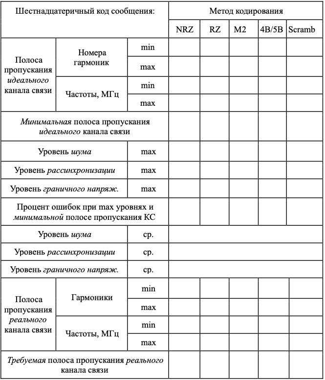
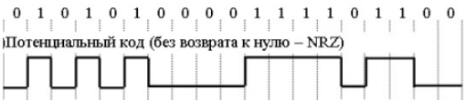

<head>
    <script src="https://cdn.mathjax.org/mathjax/latest/MathJax.js?config=TeX-AMS-MML_HTMLorMML" type="text/javascript"></script>
    <script type="text/x-mathjax-config">
        MathJax.Hub.Config({
            tex2jax: {
            skipTags: ['script', 'noscript', 'style', 'textarea', 'pre'],
            inlineMath: [['$','$']]
            }
        });
    </script>
</head>

## [MainPage](../index.md)/[Computer NetWork](README.md)/HomeWork

# Учебно-исследовательская работа: «Методы кодирования в компьютерных сетях» <br> 教育和研究工作：“计算机网络中的编码方法”

### 1. Цель и краткая характеристика работы <br> 一、工作目的及简要说明

Цель работы: изучение методов физического и логического кодирования, используемых в цифровых сетях передачи данных и исследование влияния свойств канала связи на качество передачи сигналов при различных методах физического и логического кодирования.  
工作目的：研究数字数据网络中使用的物理和逻辑编码方法，并利用各种物理和逻辑编码方法研究通信信道的特性对信号传输质量的影响。

В процессе выполнения учебно-исследовательской работы (УИР) необходимо:  
在开展教育和研究工作（ERW）的过程中，有必要：

- выполнить физическое и логическое кодирование исходного сообщения не менее, чем тремя методами кодирования, выбрав из множества: NRZ, RZ, AMI, MLT-3, NRZI и Manchester 2, и рассчитать частотные характеристики сигналов, используемых для передачи исходного сообщения, а также требуемую полосу пропускания канала связи;  
  使用至少三种编码方法对原始消息进行物理和逻辑编码，从以下各种编码方法中进行选择：NRZ、RZ、AMI、MLT-3、NRZI 和 Manchester 2，并计算用于传输原始消息的信号的频率特性消息，以及所需的通信信道带宽；
- провести сравнительный анализ рассмотренных методов кодирования, выявить и сформулировать достоинства и недостатки;  
  对所考虑的编码方法进行比较分析，识别并制定优点和缺点；
- выбрать наилучший метод для передачи исходного сообщения;  
  选择传输原始消息的最佳方法；
- для заданного исходного сообщения и одного из трех методов кодирования (NRZ, RZ и Manchester) выполнить исследование качества передачи физических сигналов по каналу связи в зависимости от уровня помех и шумов в канале, степени рассинхронизации передатчика и приёмника и уровня граничного напряжения (которое можно трактовать как уровень сигнала, при котором невозможно однозначно идентифицировать значения передаваемых двоичных сигналов);  
  对于给定的初始消息和三种编码方法（NRZ、RZ 和曼彻斯特）之一，根据信道中的干扰和噪声水平、信道中的干扰和噪声程度、对通信信道上物理信号的传输质量进行研究。发送器和接收器的不同步以及边界电压的电平（可以解释为无法明确识别所传输的二进制信号的值的信号电平）；
- выбрать и обосновать наилучший метод для передачи исходного сообщения по реальному каналу связи с учетом затухания, шумов в канале и рассинхронизации.  
  选择并论证通过真实通信信道传输原始消息的最佳方法，同时考虑信道中的衰减、噪声和去同步。

## Часть 1. Методы физического и логического кодирования <br> 第1部分.物理和逻辑编码方法

### 2. Этапы выполнения работы <br> 2. 工作实施阶段

#### Этап 1. Формирование сообщения <br> 第 1 阶段. 形成消息

В качестве исходного сообщения, подлежащего передаче, используются инициалы студента (ФИО), выполняющего задание. Для цифрового представления сообщения используются шестнадцатеричные коды в соответствии с кодировочной таблицей (см. таблицу 1).  
执行任务的学生（全名）的姓名缩写用作要传输的初始消息。 对于消息的数字表示，根据编码表使用十六进制代码（参见表 1）。

Записать исходное сообщение в шестнадцатеричном и двоичном кодах. Определить длину сообщения.  
以十六进制和二进制代码写入原始消息。确定消息长度。

Таблица 1

| Символ | Код | Символ | Код | Символ | Код | Символ | Код | Символ | Код |
|--------|-----|--------|-----|--------|-----|--------|-----|--------|-----|
| А      | С0  | Р      | D0  | а      | Е0  | р      | F0  | пробел | 20  |
| Б      | С1  | С      | D1  | б      | Е1  | с      | F1  | ,      | 2С  |
| В      | С2  | Т      | D2  | в      | Е2  | т      | F2  | .      | 2Е  |
| Г      | СЗ  | У      | D3  | г      | ЕЗ  | у      | F3  | 0      | 30  |
| Д      | С4  | Ф      | D4  | д      | Е4  | ф      | F4  | 1      | 31  |
| Е      | С5  | Х      | D5  | е      | Е5  | х      | F5  | 2      | 32  |
| Ж      | С6  | Ц      | D6  | ж      | Е6  | ц      | F6  | 3      | 33  |
| З      | С7  | Ч      | D7  | з      | Е7  | ч      | F7  | 4      | 34  |
| И      | С8  | Ш      | D8  | и      | Е8  | ш      | F8  | 5      | 35  |
| Й      | С9  | Щ      | D9  | й      | Е9  | щ      | F9  | 6      | 36  |
| К      | СА  | Б      | DA  | к      | ЕА  | ь      | FA  | 7      | 37  |
| Л      | СВ  | Ы      | DB  | л      | ЕВ  | ы      | FB  | 8      | 38  |
| М      | СС  | Ъ      | DC  | м      | ЕС  | ъ      | FC  | 9      | 39  |
| Н      | CD  | Э      | DD  | н      | ED  | э      | FD  |        |     |
| О      | СЕ  | Ю      | DE  | о      | ЕЕ  | ю      | FE  |        |     |
| П      | CF  | Я      | DF  | п      | EF  | я      | FF  |

**Пример: 示例**
```
исходное сообщение:       ФИО  
в шестнадцатеричном коде: D4 C8 CE  
в двоичном коде:          11010100 11001000 11001110  
длина сообщения:          3 байта (24 бит)  
```

#### Этап 2. Физическое кодирование исходного сообщения <br> 第 2 阶段：原始消息的物理编码

Выполнить физическое кодирование исходного сообщения с использованием манчестерского кодирования и ещё любых двух способов кодирования.  
使用曼彻斯特编码和任何两种其他编码方法对原始消息进行物理编码。

Результаты кодирования изобразить **в виде временных диаграмм.**  
**以时间图的形式** 显示编码结果。

Полагая, что пропускная способность канала связи равна 100 Мбит/с, для каждого способа кодирования определить:  
假设通信信道容量为 100 Mbit/s，对于每种编码方法确定：

- верхнюю и нижнюю границы частот в передаваемом сообщении и спектр сигнала;  
  传输消息和信号频谱的频率上限和下限；
- среднее значение частоты в спектре передаваемого сигнала;  
  发射信号频谱中的平均频率值；
- полосу пропускания, необходимую для качественной передачи данного сообщения.  
  该消息的高质量传输所需的带宽。

Провести сравнительный анализ рассмотренных способов кодирования, определить достоинства и недостатки. На основе результатов анализа выбрать наилучший способ кодирования для передачи исходного сообщения и обосновать этот выбор.  
对所考虑的编码方法进行比较分析，确定其优缺点。 根据分析结果，选择传输原始消息的最佳编码方法并证明该选择的合理性。

#### Этап 3. Логическое (избыточное) кодирование исходного сообщения <br> 第 3 阶段：原始消息的逻辑（冗余）编码

Выполнить логическое кодирование исходного сообщения по методу 4В/5В **для одного из методов физического кодирования.** Записать полученное сообщение в двоичном и шестнадцатеричном кодах.  
为**其中一种物理编码**使用 4B/5B 方法对原始消息进行逻辑编码。将编码后的消息以二进制和十六进制形式记录下来。”

Определить длину нового сообщения и его избыточность.  
确定新消息的长度及其冗余度。

Результаты кодирования изобразить в виде временной диаграммы. Определить (полагая, что пропускная способность канала связи равна 100 Мбит/с или 1 Гбит/с):  
以时序图的形式显示编码结果。 确定（假设通信信道容量为 100 Mbit/s或 1 Gbit/s）：

- верхнюю и нижнюю границы частот в передаваемом сообщении и спектр сигнала;  
  传输消息和信号频谱的频率上限和下限；
- среднее значение частоты в спектре передаваемого сигнала;  
  发射信号频谱中的平均频率值；
- полосу пропускания, необходимую для качественной передачи данного сообщения.  
  该消息的高质量传输所需的带宽。

**Сравнить полученные значения со значениями, рассчитанными для исходного физического кода.**  
**将获得的值与原始物理代码计算的值进行比较。**

#### Этап 4. Скремблирование исходного сообщения <br> 第四步：对原始消息进行加扰

Выбрать из представленных ниже полиномов или предложить другой полином для скремблирования исходного сообщения и обосновать этот выбор:  
从下面提供的多项式中进行选择，或提出另一个多项式来加扰原始消息并证明此选择的合理性：

$$B_i = A_i \oplus B_i−3 \oplus B_i−5;$$

$$B_i = A_i \oplus B_i−5 \oplus B_i−7.$$

Выполнить скремблирование исходного сообщения для выбранного на этапе 3 метода физического кодирования.  
根据步骤 3 中选择的物理编码方法对原始消息进行加扰。

Записать полученное скремблированное сообщение в двоичном и шестнадцатеричном кодах и изобразить в виде временных диаграмм.  
将收到的加扰消息以二进制和十六进制代码写下来，并以时序图的形式显示出来。

Определить (полагая, что пропускная способность канала связи равна 100 Мбит/с или 1 Гбит/с):  
确定（假设通信信道容量为100Mbit/s或1Gbit/s）：

- верхнюю и нижнюю границы частот в передаваемом сообщении и спектр сигнала;  
  传输消息和信号频谱的频率上限和下限；
- среднее значение частоты в спектре передаваемого сигнала;  
  发射信号频谱中的平均频率值；
- полосу пропускания, необходимую для качественной передачи данного сообщения.  
  该消息的高质量传输所需的带宽。

Сравнить полученные значения со значениями, рассчитанными для исходного физического кода.  
将获得的值与原始物理代码计算的值进行比较。

#### Этап 5. Сравнительный анализ результатов кодирования <br> 阶段5.编码结果对比分析

Провести обобщенный сравнительный анализ результатов, полученных на этапах 2, 3 и 4, и представить результаты сравнения в виде сводной таблицы.  
对第2、3、4阶段得到的结果进行广义比较分析，并以汇总表的形式呈现比较结果。

## Часть 2. Передача кодированного сообщения по каналу связи <br> 第 2 部分：通过通信通道传输加密消息

#### Этап 6. Определение минимальной полосы пропускания идеального канала связи

Для исследования качества передачи исходного сообщения (сигналов) по каналу связи используется программа «Network Fourier 2.1», описание которой представлено в файле **«Network Fourier-описание».**  
为了研究原始消息（信号）通过通信信道的传输质量，使用“网络傅里叶 2.1”程序，其描述在文件**“网络傅里叶描述”中给出。**

Минимально требуемая полоса пропускания канала связи для качественной передачи сообщения (двоичного сигнала) определяется для идеального канала, в котором:  
高质量传输消息（二进制信号）的通信信道所需的最小带宽是针对理想信道确定的，其中：

- отсутствуют шумы и помехи, искажающие форму сигнала;  
  不存在使信号形状失真的噪声或干扰；
- передатчик и приёмник сигналов абсолютно синхронизированы, т.е. между ними нет рассинхронизации;  
  信号的发射器和接收器绝对同步，即 它们之间不存在不同步；
- сигналы не затухают и нет необходимости устанавливать какой-то уровень граничного напряжения, позволяющего различить единичный и нулевой сигнал.  
  信号不会衰减，并且无需设置任何水平的边界电压来区分单个信号和零信号。

Для этого необходимо установить нулевые значения уровней: шумов (Noise), рассинхронизации (Desync) и граничного напряжения (Voltage).  
为此，您需要将以下级别设置为零：噪声（Noise）、不同步（Desync）和边界电压（Voltage）。

Затем в поле «Enter message» ввести исходное сообщение. В качестве исходного сообщения используется, как и ранее, три байта ФИО студента, выполняющего данное задание.  
然后在“输入消息”字段中输入原始消息。 和以前一样，执行此任务的学生全名的三个字节用作初始消息。

***Указание**. Символы исходного сообщения вводятся в **шестнадцатеричном** виде в **обратном порядке**, т.е. вначале вводится шестнадцатеричный код третьего байта, затем – второго и первого. В качестве признака шестнадцатеричного кода перед вводимым сообщением необходимо **поставить символ** «\» (**обратный слэш**).*  
***笔记**。 原始消息的字符以**十六进制**形式以**相反的顺序**输入，即 首先，输入第三个字节的十六进制代码，然后是第二个和第一个。 作为十六进制代码的符号，在输入的消息之前必须**放置符号**“\”（**反斜杠**）。*

Последовательно изменяя значения нижней и верхней гармоник спектра сигнала, определить граничные значения, при которых сообщение передается без ошибок. Соответствующие им значения частот представляют собой нижнюю и верхнюю границы, определяющие минимальную полосу пропускания канала связи.  
通过依次改变信号频谱的低谐波和高谐波的值，确定消息无错误传输的边界值。 相应的频率值代表确定通信信道最小带宽的下限和上限。

#### Этап 7. Определение максимально допустимых уровней шумов, рассинхронизации и затухания <br> 第 7 阶段：确定噪声、失同步和衰减的最大允许水平

На этом этапе последовательно определяются максимально допустимые уровни шумов, рассинхронизации и затухания, при которых сохраняется качественная передача сообщения, т.е. не наблюдается возникновение ошибок.  
在此阶段，依次确定噪声、失同步和衰减的最大允许水平，在该水平下保持高质量的消息传输，即 没有观察到错误。

Вначале изменяется уровень шумов (Noise) и определяется максимально допустимый уровень шумов, при котором исходное сообщение передается без ошибок. При этом значения уровней рассинхронизации и граничного напряжения должны быть нулевыми.  
首先，改变噪声水平并确定原始消息无错误传输的最大允许噪声水平。 在这种情况下，失同步电平和边界电压的值应为零。

Затем уровень шумов устанавливается в нулевое значение и изменяется уровень рассинхронизации (Desync) и определяется максимально допустимый уровень рассинхронизации, при котором исходное сообщение будет принято без ошибок.  
然后将噪声水平设置为零，并改变不同步水平，并确定最大允许的不同步水平，在该水平下将无错误地接收原始消息。

Затем уровень рассинхронизации устанавливается в нулевое значение и изменяется уровень граничного напряжения (Voltage) и определяется максимально допустимый уровень граничного напряжения, при котором исходное сообщение передается без ошибок.  
然后，将去同步电平设置为零，并且改变边界电压（电压）的电平，并确定边界电压的最大允许电平，在该电平处，原始消息被无错误地传输。

#### Этап 8. Оценка достоверности распознавания сигналов на приемном конце <br> 阶段8.评估接收端信号识别的可靠性

На этом этапе определяется процент ошибок при передаче сообщения при найденных на предыдущем этапе значениях уровней шумов, рассинхронизации и граничного напряжения и минимальной полосы пропускания канала связи.  
在此阶段，消息传输中的错误百分比由前一阶段找到的噪声水平、失同步和边界电压的值以及通信信道的最小带宽决定。

Установить найденные на предыдущем этапе максимально допустимые значения уровней шумов, рассинхронизации и граничного напряжения и определить процент ошибок на приемном конце канала связи.  
设置前一阶段发现的噪声水平、失同步和边界电压的最大允许值，并确定通信通道接收端的错误百分比。

Указание. Этапы 6–8 последовательно выполняются для методов физического (NRZ, RZ и Manchester 2) и логического кодирования (NRZ). Полученные значения заносятся в Таблицу 2. 
笔记。 对于物理（NRZ、RZ 和曼彻斯特 2）和逻辑编码 (NRZ) 方法，顺序执行步骤 6-8。 获得的值输入表2中。

#### Этап 9. Определение значений уровней шумов, рассинхронизации и граничного напряжения для реального канала связи

Рассчитать значения уровней шумов, рассинхронизации и граничного напряжения для реального канала связи как *средние значения по всем рассмотренным методам кодирования*.  
计算真实通信通道的噪声水平、失同步和边界电压值，作为*所有考虑的编码方法的平均值*。

#### Этап 10. Определение требуемой полосы пропускания реального канала связи

Требуемая полоса пропускания реального канала связи определяется из условия, что передача сообщения должна происходить без потерь при рассчитанных уровнях шумов, рассинхронизации и граничного напряжения для всех рассмотренных методов кодирования.  
实际通信信道所需的带宽是根据以下条件确定的：对于所有考虑的编码方法，消息传输必须在计算出的噪声、去同步和边界电压水平下无丢失地进行。

Установить рассчитанные значения уровней шумов, рассинхронизации и граничного напряжения для реального канала связи.  
设置真实通信通道的噪声水平、失同步和边界电压的计算值。

Последовательно изменяя значения порядкового номера нижней гармоники от нуля и верхней гармоники от максимального значения (255) спектра сигнала, определить граничные значения, при которых сообщение передается без ошибок по реальному каналу связи. Соответствующие им значения частот определяют требуемую полосу пропускания канала связи при рассматриваемом методе кодирования.  
通过连续改变信号频谱的从零开始的低次谐波的序号值和从信号频谱的最大值（255）开始的高次谐波的序号值，确定在实际情况下消息无误传输的边界值。沟通渠道。 相应的频率值决定了所考虑的编码方法所需的通信信道带宽。

***Указание**. Этот пункт выполняется для тех же методов физического и логического кодирования. Полученные значения занести в таблицу результатов.*  
***笔记**。 这一点是针对相同的物理和逻辑编码方法来执行的。 将获得的值输入到结果表中。*

#### Этап 11. Анализ полученных результатов и выбор наилучшего способа кодирования исходного сообщения <br> 第 11 阶段：分析获得的结果并选择对原始消息进行编码的最佳方式

Проанализировать полученные результаты и выбрать наилучший способ физического кодирования для передачи исходного сообщения по реальному каналу связи при заданных значениях уровней шумов, рассинхронизации и граничного напряжения, аргументировано обосновав это выбор.  
分析获得的结果，并选择最佳的物理编码方法，以便在给定的噪声水平、去同步和边界电压值下通过真实的通信信道传输原始消息，从而证明该选择的合理性。

Таблица 2



### 3. Порядок выполнения работы <br> 工作执行顺序

1. Ознакомиться с постановкой задачи и изучить необходимые теоретические сведения (файл **«ДЗ_Кодирование. pdf»** – презентация и файл **ДЗ_Конспект.pdf** – комментарии к презентации).  
   熟悉问题的陈述并研究必要的理论信息（文件 **“DZ_Coding.pdf”** - 演示文稿和文件 **DZ_Consect.pdf** - 对演示文稿的评论）。
2. Сформировать исходное сообщение в соответствии с этапом 1.  
   按照步骤1生成初始消息。
3. Выполнить физическое кодирование исходного сообщения не менее, чем тремя способами, включая, в качестве обязательного, манчестерское кодирование. Рассчитать частотные характеристики передаваемого сигнала для рассматриваемых способов кодирования и определить требуемую для эффективной передачи сообщения пропускную способность канала связи (этап 2).  
   至少以三种方式对原始消息进行物理编码，包括强制的曼彻斯特编码。 计算所考虑的编码方法的传输信号的频率特性，并确定有效消息传输所需的通信信道带宽（步骤2）。  
   Пример частотного анализа для метода кодирования NRZ представлен в **Приложении**.  
   **附录**中提供了 NRZ 编码方法的频率分析示例。
4. Выполнить логическое кодирование исходного сообщения для одного из методов физического кодирования, используя избыточное кодирование 4В/5В и скремблирование. Рассчитать частотные характеристики передаваемого сигнала для рассматриваемых способов логического кодирования и определить требуемую для эффективной передачи сообщения пропускную способность канала связи. Сравнить полученные значения со значениями, рассчитанными для физического кодирования (этапы 3 и 4).  
   使用 4B/5B 冗余编码和加扰对其中一种物理编码方法执行原始消息的逻辑编码。 计算所考虑的逻辑编码方法的传输信号的频率特性，并确定有效消息传输所需的通信信道带宽。 将获得的值与物理编码计算的值（步骤3和4）进行比较。
5. Выполнить сравнительный анализ рассмотренных способов кодирования и выбрать наилучший способ для передачи исходного сообщения (этап 5).  
   对所考虑的编码方法进行比较分析，并选择传输原始消息的最佳方法（步骤 5）。
6. С использованием программы моделирования процесса передачи сообщения по реальному каналу связи **«Network Fourier 23»** выполнить исследования в соответствии с этапами 6–10 и занести результаты в таблицу 2.  
   使用模拟在真实通信信道上传输消息过程的程序**“Network Fourier 23”**，按照步骤6-10进行研究，并将结果输入表2。
7. Выполнить сравнительный анализ рассмотренных способов кодирования и выбрать наилучший способ для передачи исходного сообщения (этап 11).  
   对所考虑的编码方法进行比较分析，并选择传输原始消息的最佳方法（步骤 11）。
8. Подготовить и защитить отчёт по выполненной работе.  
   准备并捍卫一份关于所执行工作的报告。

### 4. Требования к содержанию отчёта <br> 报告内容要求

Отчёт в электронном или бумажном виде должен содержать следующие пункты.  
电子或纸质报告必须包含以下内容。
1. Исходное сообщение и его представление в шестнадцатеричном и двоичном виде с указанием длины в байтах и битах.  
   原始消息及其十六进制和二进制表示形式，指示字节和位的长度。
2. Временные диаграммы для рассматриваемых методов физического (включая манчестерское) и логического кодирования первых четырёх байт исходного сообщения.  
   原始消息前四个字节的物理（包括曼彻斯特）和逻辑编码所考虑的方法的时序图。
   Рассчитанные для каждого метода кодирования и сведенные в единую таблицу значения:  
   为每种编码方法计算的值并编译到单个表中：
   - верхней и нижней границы частот в передаваемом сообщении и спектра сигнала;  
     传输消息和信号频谱的频率上限和下限；  
   - средней частоты в спектре передаваемого сигнала;  
     发射信号频谱中的平均频率；  
   - полосы пропускания, необходимой для качественной передачи данного сообщения.  
     高质量传输该消息所需的带宽。
3. Результаты сравнительного анализа рассмотренных методов физического кодирования (достоинства и недостатки), представленные в виде таблицы, и обоснованный выбор **двух** лучших методов физического кодирования для передачи исходного сообщения.  
   对所考虑的物理编码方法（优点和缺点）进行比较分析的结果以表格形式呈现，并合理选择**两种**最佳物理编码方法来传输原始消息。
4. Результаты логического кодирования исходного сообщения по методу 4В/5В для одного из методов физического кодирования, представленные в двоичном и шестнадцатеричном кодах (с указанием длины нового сообщения и его избыточности) и в виде временной диаграммы. Рассчитанные для метода 4В/5В верхняя и нижняя границы частот и требуемая полоса пропускания, и их сравнение со значениями, полученными ранее для соответствующего физического метода кодирования.  
   使用 4B/5B 方法作为物理编码方法之一对原始消息进行逻辑编码的结果，以二进制和十六进制代码（指示新消息的长度及其冗余）和时序图的形式呈现。 针对4V/5V方法计算的频率上限和下限以及所需带宽，以及它们与之前针对相应物理编码方法获得的值的比较。
5. Вид полинома, используемого для скремблирования исходного сообщения, и обоснование его выбора. Последовательность получения разрядов скремблированного сообщения. Результат скремблирования, записанный в виде скремблированного сообщения в двоичном и шестнадцатеричном кодах, и временная диаграмма. Рассчитанные значения для скремблированного сообщения верхней и нижней частот и требуемой полосы пропускания, и их сравнение со значениями, полученными ранее для соответствующего физического метода кодирования.  
   用于扰乱原始消息的多项式类型及其选择的理由。 接收加扰消息比特的序列。 加扰的结果，以二进制和十六进制代码记录为加扰消息，以及时序图。 计算加扰消息的上下频率和所需带宽的值，并将其与先前获得的相应物理编码方法的值进行比较。
6. Краткие выводы с обоснованием наилучшего способа кодирования для передачи исходного сообщения.  
   简短的结论证明了传达原始消息的最佳编码方法的合理性。
7. Скриншоты результатов моделирования процессов передачи кодированного разными методами сообщения с использованием программы “Network Fourier 2.1”, на которых отображается передаваемое сообщение и видны характеристики реального канала связи. Каждый скриншот должен сопровождаться краткими комментариями и выводами.  
   使用“Network Fourier 2.1”程序对不同方法编码的消息传输过程进行建模的结果截图，该程序显示了传输的消息并显示了真实通信信道的特征。 每个屏幕截图都应附有简短的评论和结论。
8. Результаты сравнительного анализа рассмотренных методов кодирования, представленные в виде таблицы 2, с выводами и обоснованным выбором наилучшего способа кодирования для передачи исходного сообщения.  
   对所考虑的编码方法进行比较分析的结果如表 2 所示，得出结论并合理选择传输原始消息的最佳编码方法。
9. Краткие выводы с обоснованием наилучшего способа физического и логического кодирования для передачи исходного сообщения по реальному каналу связи при заданных значениях уровней шумов, рассинхронизации и граничного напряжения.  
   简短的结论证明了在给定的噪声水平、去同步和边界电压值下通过真实通信信道传输原始消息的物理和逻辑编码的最佳方法。

### 5. Контрольные вопросы для самопроверки <br> 答辩问题

При подготовке к защите домашнего задания и компьютерному тестированию следует руководствоваться следующим примерным перечнем вопросов и задач для самостоятельной проработки.  
当准备答辩你的作业和计算机测试时，你应该遵循以下大致的独立学习问题和任务列表。

1. В чем состоит удобство вычисления затухания сигнала в дБ?  
2. Во сколько раз уменьшится мощность сигнала на расстоянии 100 м, если его ослабление равно: d=10 дБ/км?
3. В чем отличие спектра от полосы пропускания?
4. Какой спектр частот характерен для дискретных сигналов?
5. При каких условиях обеспечивается качественная передача сигнала?
6. Какую полосу пропускания имеет телефонный канал тональной частоты?
7. По каким каналам можно передавать дискретные сигналы в их естественном виде – без модуляции (в первичной полосе частот)?
8. Что такое модуляция и для чего она нужна?
9. Чем манипуляция отличается от модуляции?
10. Пояснить принцип амплитудной, частотной и фазовой модуляции.
11. Что такое ИКМ?
12. Пояснить различие между АИМ и ИКМ.
13. Показать, за счет чего обеспечивается скорость передачи данных в 64 кбит/с (56 кбит/с) при ИКМ.
14. Пояснить принцип адаптивной разностной (дифференциальной) ИКМ.
15. Перечислить характеристики цифрового канала связи.
16. От чего зависит пропускная способность канала связи?
17. В чём отличие пропускной способности от скорости передачи данных?
18. Как называется процесс представления непрерывных (дискретных)
данных в виде физических сигналов для их передачи по каналам связи?
19. От чего зависит спектр результирующего модулированного сигнала?
20. Как спектр результирующего модулированного сигнала зависит от скорости модуляции (скорости передачи данных)? Ответ пояснить.
21. Перечислить требования к методам цифрового кодирования.
22. Что такое потенциальное кодирование?
23. При каком методе кодирования скорость модуляции (бод) и скорость передачи данных (бит в секунду) совпадают?
24. Как изменяется спектр сигнала при потенциальном кодировании, если в передаваемом сообщении появляется длинная последовательность нулей или единиц?
25. В каком случае при потенциальном кодировании в спектре сигнала отсутствует постоянная составляющая?
26. Почему потенциальные коды не используются на каналах тональной частоты?
27. Достоинства и недостатки методов кодирования NRZ, RZ, AMI, MLT-3, Манчестер 2, ....
28. У какого из известных вам методов верхняя граница частот имеет наименьшее значение?
29. Нарисовать диаграммы методов кодирования NRZ, RZ, AMI, MLT-3, Манчестер 2... для сообщения, заданного в шестнадцатеричном коде: С5.
30. Определить частоту основной гармоники для сообщения, заданного в шестнадцатеричном коде: С5, при использовании методов кодирования NRZ, RZ, AMI, MLT-3, Манчестер 2....
31. Как битовая скорость связана со спектром результирующего сигнала?
32. Какие методы кодирования относятся к самосинхронизирующимся?
33. Почему проблема синхронизации в компьютерных сетях решается сложнее, чем при обмене данными между компьютером и принтером?
34. От чего зависит стоимость реализации метода кодирования?
35. Что такое постоянная составляющая спектра сигнала и почему она нежелательна?
36. Какие методы кодирования имеют постоянную составляющую в спектре сигнала
37. Перечислить методы логического кодирования.
38. Для чего используются методы логического кодирования?
39. Пояснить суть методов логического кодирования 4В/5В, 5В/6В, 8В/10В, 8В/6Т.
40. Что такое «запрещенные коды» в методах избыточного кодирования?
41. Какой метод избыточного кодирования обладает наибольшей (наименьшей) избыточностью и почему?
42. Сколько избыточных кодов содержит метод кодирования 4В/5В (5В/6В, 8В/10В, 8В/6Т).
43. Основной недостаток методов избыточного кодирования.

1. 以dB为单位计算信号衰减有什么方便？
2. 如果信号衰减等于：d=10 dB/km，那么在 100 m 距离处，信号功率会减少多少倍？
3. 频谱和带宽有什么区别？
4. 离散信号的典型频谱是什么？
5. 什么条件下才能保证信号的高质量传输？
6. 语音电话通道的带宽是多少？
7. 离散信号可以通过哪些通道以其自然形式传输——无需调制（在主频段）？
8. 什么是调制以及为什么需要调制？
9. 操纵与调制有何不同？
10. 解释幅度、频率和相位调制的原理。
11. 什么是PCM？
12. 解释AIM和ICM之间的区别。
13. 展示如何确保 PCM 的数据传输速率为 64 kbit/s (56 kbit/s)。
14. 解释自适应差分（差分）PCM的原理。
15. 列出数字通信渠道的特征。
16. 通信通道的吞吐量由什么决定？
17. 带宽和数据传输速度有什么区别？
18. 表示连续（离散）的过程叫什么名字
数据以物理信号的形式通过通信通道传输？
19. 所得调制信号的频谱取决于什么？
20. 所得调制信号的频谱如何取决于调制速率（数据速率）？解释一下答案。
21. 列出数字编码方法的要求。
22. 什么是潜在编码？
23. 哪种编码方法的调制速率（波特率）和数据速率（每秒比特数）相同？
24. 如果传输的消息中出现一长串 0 或 1，则在潜在编码期间信号频谱会如何变化？
25. 在潜在编码过程中什么情况下信号频谱中没有恒定分量？
26. 为什么语音通道不使用候选码？
27. 编码方法NRZ、RZ、AMI、MLT-3、Manchester 2、...的优缺点
28. 您所知道的哪种方法的频率上限最小？
29. 画出以十六进制代码 C5 给出的消息的编码方法 NRZ、RZ、AMI、MLT-3、Manchester 2...的图表。
30. 使用编码方法 NRZ、RZ、AMI、MLT-3、Manchester 2.... 确定以十六进制代码指定的消息的基波谐波频率：C5。
31. 比特率与结果信号的频谱有何关系？
32. 哪些编码方式是自同步的？
33. 为什么计算机网络中的同步问题比计算机和打印机之间交换数据更难解决？
34. 什么决定了实施编码方法的成本？
35. 信号频谱的恒定分量是什么？为什么它是不需要的？
36. 哪些编码方法在信号频谱中具有恒定分量
37. 列出逻辑编码方法。
38. 逻辑编码方法有什么用？
39. 解释逻辑编码方法4B/5B、5B/6B、8B/10B、8B/6T的本质。
40. 冗余编码方法中的“禁码”是什么？
41. 哪种冗余编码方法具有最大（最小）冗余，为什么？
42. 4B/5B（5B/6B、8B/10B、8B/6T）编码方式包含多少个冗余码？
43. 冗余编码方法的主要缺点。

## ПРИЛОЖЕНИЕ.

### Частотный анализ передаваемых сообщений

Подход, позволяющий выполнить **частотный анализ передаваемого сообщения и приближенно оценить основные частотные характеристики сигнала** при заданном методе кодирования, иллюстрируется *на примере метода потенциального кодирования* NRZ. В качестве частотных характеристик сигнала определяются:  
*使用潜在编码方法* NRZ 的示例说明了一种方法，可以对给定编码方法执行**传输消息的频率分析并近似估计信号**的主要频率特性。 信号的频率特性确定如下：

- **верхняя и нижняя границы частот** в передаваемом сообщении и спектр сигнала;  
  **传输消息和信号频谱中的频率上限和下限**；
- **среднее значение частоты** в спектре передаваемого сигнала;  
  **传输信号频谱中的平均频率值**；
- **полоса пропускания**, необходимая для качественной передачи данного сообщения.  
  此消息的高质量传输所需的**带宽**。

Метод потенциального кодирования *без возврата к нулю* – NRZ (Non Return to Zero) является наиболее простым и очевидным методом кодирования двоичных сообщений, в котором значению бита «1» соответствует высокий уровень потенциала, а значению «0» – низкий.  
电位编码方法*不归零* - NRZ（不归零）是编码二进制消息的最简单和最明显的方法，其中位“1”的值对应于高电位电平，并且该值对应于高电位电平。 “0”对应于低电位。

Ниже на рисунке представлена временная диаграмма, отражающая кодирование заданного двоичного сообщения по методу NRZ.  
下图显示了使用 NRZ 方法对给定二进制消息进行编码的时序图。



Для определения верхней границы частот необходимо найти наиболее высокочастотную составляющую спектра в передаваемом сообщении. В коде NRZ высокочастотная составляющая образуется при передаче чередующихся значений 0 и 1, при этом период синусоиды (гармонического сигнала), используемой для передачи прямоугольных сигналов 0 и 1, будет равен удвоенной длительности битового интервала $t: T = 2t$, где $t$ определяется как величина, обратная значению скорости передачи данных (пропускной способности канала): $t = 1⁄C$. Отсюда верхняя граница частот будет равна $f = 1⁄T = C⁄2$. При пропускной способности канала связи $C = 1$ Мбит⁄с в частота основной гармоники равна $f_в = 500$ кГц.  
为了确定频率上限，需要找到传输消息中频谱的最高频率分量。 在NRZ码中，高频分量是通过传输交替值 0 和 1 而形成的，用于传输方波信号0和1的正弦波（谐波信号）的周期将等于位间隔 $t：T = 2t$，其中 $t$ 定义为数据传输速率（通道容量）的倒数：$t = 1⁄C$。 因此，频率上限将等于 $f = 1⁄T = C⁄2$。 当通信信道容量为 $C = 1$ Mbit⁄s 时，基波谐波的频率等于 $f_в = 500$ kHz。

В общем случае, при кодировании любого сообщения по методу NRZ наибольшая (верхняя) частота достигается при передаче чередующихся значений 0 и 1, а наименьшая (нижняя) – при передаче длинных (в пределе бесконечных) последовательностей нулей и единиц, что делает нижнюю границу частот близкой и в пределе равной нулю: $f_н = 0$. Следовательно, в предельном случае спектр $S = f_в − f_н = f_в = C⁄2$.  
一般来说，当使用 NRZ 方法对任何消息进行编码时，当传输 0 和 1 的交替值时，会实现最高（较高）频率，而当传输长（无限大）零序列时，会实现最低（较低）频率。和 1，这使得频率下限接近并且在限制中等于 0：$f_н = 0$。 因此，在极限情况下，频谱 $S = f_в − f_н = f_в = C⁄2$。

С другой стороны, при передаче конкретного сообщения нижняя частота всегда больше нуля и зависит от максимальной длины последовательностей нулей или единиц, при которой не меняется уровень потенциала. В этом случае для расчета нижней границы частот необходимо в коде передаваемого сообщения найти наиболее длинную последовательность единиц или нулей. В нашем случае низкочастотная составляющая образуется при передаче четырёх последовательных единиц и четырёх последовательных нулей. Период синусоидального сигнала при передаче каждой такой последовательности равен 8 битовым интервалам и нижняя граница частот соответственно будет равна: $f = 1⁄8 t = C⁄8$. Тогда ширина спектра при н передаче данного сообщения кодом NRZ равна $S = f_в − f_н = 0,375C = 375$ кГц  
另一方面，当发送特定消息时，较低频率总是大于零，并且取决于电位电平不改变的零或一序列的最大长度。 在这种情况下，为了计算频率下限，需要找到所传输消息的代码中最长的1或0序列。 在我们的例子中，低频分量是通过传输四个连续的 1 和四个连续的 0 形成的。 传输每个此类序列时，正弦信号的周期等于 8 位间隔，因此频率下限将等于：$f = 1⁄8 t = C⁄8$。 那么使用 NRZ 码传输此消息时的频谱宽度等于 $S = f_в − f_н = 0,375C = 375$ kHz

Отметим, что полученные значения нижней границы частот и, соответственно, спектра справедливы именно для этого конкретного сообщения. При передаче других сообщений эти значения будут другими. Таким образом, можно утверждать, что при кодировании по методу NRZ ширина спектра сигнала $S < C⁄2$.  
请注意，所获得的频率下限值以及相应的频谱对于该特定消息是有效的。 传输其他消息时这些值会有所不同。 因此，可以说，当使用 NRZ 方法进行编码时，信号频谱宽度为 $S < C⁄2$。

Среднее значение частоты передаваемого сообщения находится в интервале $(f_н; f_в)$ и *показывает, какие частоты (низкие или высокие) превалируют в спектре передаваемого сигнала.*  
传输消息的频率平均值位于 $(f_н; f_в)$ 区间内，*显示传输信号频谱中哪些频率（低或高）占主导地位。*

Для приблизительного (оценочного) расчёта среднего значения частоты передаваемого сообщения необходимо для каждого битового интервала (а в некоторых случаях для половины битового интервала) определить соответствующую частоту сигнала, просуммировать их и разделить на количество битовых интервалов. В нашем случае: частота основной гармоники $f_0 = C⁄2$ соответствует 7-ми битовым интервалам, 4-м битовым интервалам 0 соответствует частота вдвое меньшая, чем частота основной гармоники, т.е. $f_0⁄2$, и 8-ми битовым интервалам соответствует частота $f_0⁄4$.  
为了近似（估计）计算传输消息的平均频率，有必要确定每个比特间隔（在某些情况下为半个比特间隔）的相应信号频率，将它们相加并除以位间隔。 在我们的例子中：基波频率 $f_0 = C⁄2$ 对应于 7 位间隔，4 位间隔 0 对应于基波频率的一半频率，即 $f_0⁄2$ 和 8 位间隔对应于频率 $f_0⁄4$。

Тогда средняя частота рассматриваемого сообщения равна:  
那么相关消息的平均频率为：

$$f_{ср} =(7f_0 +4f_0 /2+8f_0 /4)/19\approx 0,58f_0 =290\ кГц$$

Поскольку середине спектра рассматриваемого сообщения соответствует частота $f_{1⁄2}=(f_н + f_в)⁄2 = 0,625f_0 = 312,5$ кГц, можно констатировать, что *в спектре сигнала незначительно преобладают низкие частоты:* $f_{ср} \lt f_{1⁄2}$.  
由于所考虑的消息频谱的中间对应于频率 $f_{1⁄2}=(f_н + f_в)⁄2 = 0.625f_0 = 312.5$ kHz，我们可以说 *低频在信号中稍微占主导地位频谱：* $f_{avg } \lt f_{1⁄2}$。

Для качественной передачи двоичных сигналов по реальному каналу связи и возможности их распознавания на приёмной стороне с минимальным количеством ошибок, желательно на передающей стороне формировать сигналы, приближающиеся к прямоугольной форме. Однако, спектр таких сигналов оказывается слишком большим. В то же время, для качественного распознавания сигнала на приемной стороне при передаче чередующихся значений 0 и 1 достаточно сформировать сигнал, содержащий первые 4 гармоники (поскольку более высокочастотные гармоники оказывают незначительное влияние на результирующий сигнал) с частотами $f_0 = C / 2$ , $f_1 =3f_0$, $f_2 =5f_0$, $f_3 =7f_0$. В этом случае верхняя граница частот $f_в =7f_0$, а ширина спектра сигнала при передаче рассматриваемого сообщения соответственнобудетравна $S= f_в − f_н =7f_0 − f_0 /4=6,75f_0 =3,375$ МГц.  
为了在真实通信信道上高质量地传输二进制信号以及在接收侧以最小数量的错误识别它们的可能性，期望在发送侧生成接近矩形形状的信号。 然而，此类信号的频谱太大。 同时，为了在传输交替值 0 和 1 时在接收侧进行高质量的信号识别，生成包含前 4 个谐波的信号就足够了（因为较高频率的谐波对所得结果的影响微不足道）信号），频率为 $f_0 = C / 2$ 、$f_1 =3f_0$、$f_2 =5f_0$、$f_3 =7f_0$。 在这种情况下，频率上限为 $f_в =7f_0$，传输相关消息时信号频谱的宽度将相应等于 $S= f_в – f_н =7f_0 – f_0 /4=6.75f_0 =3.375 $兆赫。

> 由于在实际传输的过程中，信号无法以绝对的方波进行传输，所以实际传输时使用的是又傅立叶级数展开得到的近似方波。
> 
> 方波经由傅立叶级数展开后可由无数正弦余弦函数相加得到，这里课件认为只取傅立叶级数展开后的前思想家便足以达到高质量传输的要求，而前四项傅立叶级数谐波频率分别为 $f_0, 3f_0, 5f_0, 7f_0$ 
> 
> 故这里的最高频率为不是之前算出的 $f_в = 500$ kHz，而是 $f_в'=7f_0=3500$ kHz
> 然而最低频率仍然为之前算出的 $f_н'=f_н = 1⁄8t=C⁄8=0.25f_0=125$ kHz
> 所以此消息的高质量传输所需的频谱宽度为 $f_в'-f_н'=7f_0-0.25f_0=6.75f_0=3375$ kHz
>
> —— Tolia 注

Полоса пропускания $F$, необходимая для передачи данного сообщения, должна быть больше спектра $S$, например, $F = 4$ МГц.  
传输给定消息所需的带宽 $F$ 必须大于 $S$ 的频谱，例如 $F = 4$ MHz。

Основное достоинство кода NRZ - малая ширина спектра сигнала, которая меньше, чем у других методов кодирования: $S = f_в = 0,5C$ Гц, где $C$ – скорость передачи данных [бит/с].  
NRZ 编码的主要优点是信号频谱宽度小，比其他编码方法更小：$S = f_в = 0.5C$ Hz，其中 $C$ 是数据传输速率 [bit/s]。