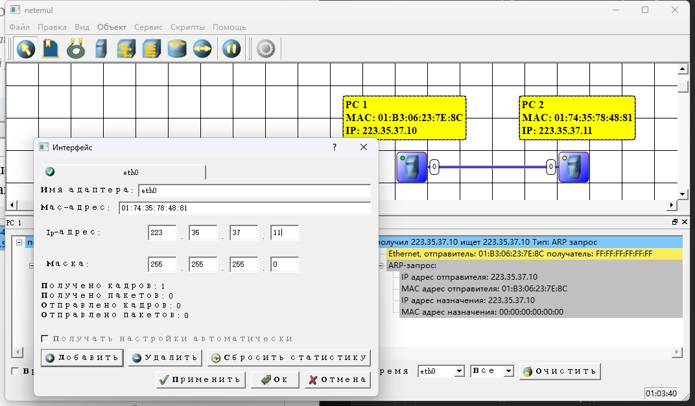
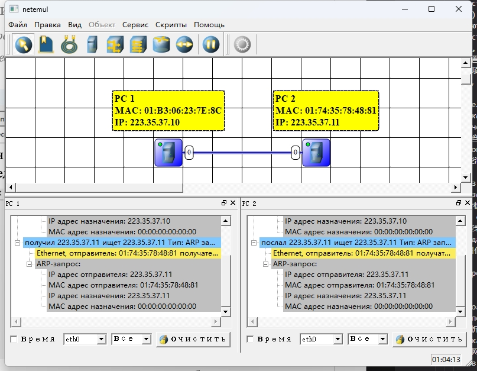
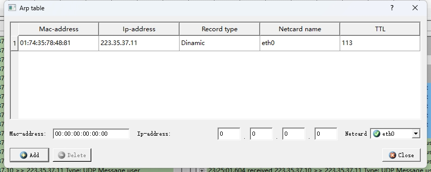
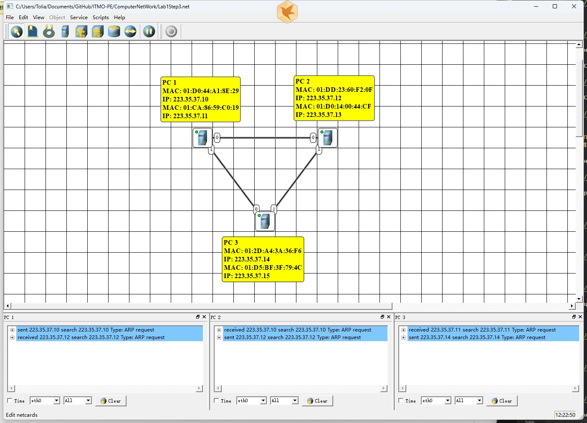

<head>
  <script src="https://cdn.mathjax.org/mathjax/latest/MathJax.js?config=TeX-AMS-MML_HTMLorMML" type="text/javascript"></script>
  <script type="text/x-mathjax-config">
    MathJax.Hub.Config({
      tex2jax: {
      skipTags: ['script', 'noscript', 'style', 'textarea', 'pre'],
      inlineMath: [['$','$']]
      }
    });
  </script>
</head>

## [MainPage](../../../index.md)/[DataBase](../../README.md)/Lab 1

<center>
<p>Университет ИТМО<br>Факультет ФПИ и КТ</p>
<br><br><br><br><br><br>
<h2>Отчёт по лабораторной работе 1</h2>
<h1>«Компьютерные сети»</h1>
</center>

<br><br><br><br><br><br><br><br><br><br>

<div align="right">Студент: Чжоу Хунсян</div>
<div align="right">Группа: P33131</div>
<div align="right">Преподаватель:</div>

<center>
<br><br>
<p>Санкт-Петербург 2024</p>
<br>
</center>

---

> Вариант: Ф = 4, И = 6, О = 0, Н = 31
> Исходный IP адрес: 223.35.37.10

## Цель работы

Изучение принципов построения и настройки моделей компьютерных сетей в среде NetEmul.  

В процессе выполнения лабораторной работы (ЛР) необходимо:  

- построить три простейшие модели компьютерной сети;  
- выполнить настройку сети, заключающуюся в присвоении IP-адресов интерфейсам сети;  
- выполнить тестирование разработанных сетей путем проведения экспериментов по передаче данных на основе протокола UDP;  
- сохранить разработанные модели компьютерных сетей для демонстрации процессов передачи данных при защите лабораторной работы.  

### Этап 1. Знакомство с NetEmul на примере простейшей сети из двух компьютеров

1. Построение сети. 
   
   

   **Таблица маршрутизации** 

   Таблица маршрутизации — это важная структура данных, в которой хранится информация, используемая маршрутизаторами для определения того, как пакеты доставляются к месту назначения.
     
   

   Таблица маршрутизации содержит следующие типы информации:
   - Адрес назначения (Destination)
   Это адрес, куда отправить пакетов 
   - Маска (Mask)
   Вместе используется с Адресом назначения для определения того, к какой подсети принадлежит IP-адрес.
   - Шлюз (Gateway)
   Показывает следующий адрес для передачи пакетов
   - Интерфейс (Interface)  
   Это сетевой интерфейс, по которому пакеты покидают текущий маршрутизатор и доставляются на следующий узел.
   - Метрика (Metric)  
   используется для выражения относительной стоимости или расстояния до пункта назначения.
   - Источник (Source)  
   Относится к источнику, который генерирует или вводит запись маршрутизации.

   **ARP-таблицы**

   Таблица ARP (протокол разрешения адресов) — это таблица, используемая в компьютерных сетях для хранения отношений сопоставления IP-адресов и MAC-адресов. Это помогает устройствам находить физические адреса других устройств в той же подсети для передачи пакетов.

   

   Записи таблицы ARP содержат следующую информацию:

   - Mac-адрес  
     Это физический адрес целевого устройства.
   - Ip-адрес  
     Это IP-адрес целевого устройства
   - Тип записи  
     Указывает тип записи в таблице ARP. Общие типы записей:
     - Статическая запись: Эти записи настраиваются администратором вручную, срок их действия не истекает и не обновляется протоколом динамического ARP. Эти записи обычно используются для критически важной связи между устройствами, гарантируя, что определенные IP-адреса всегда сопоставляются с назначенными MAC-адресами.
     - Динамическая запись: Эти записи генерируются динамически посредством запросов и ответов ARP, имеют определенное время жизни (TTL) и автоматически обновляются или удаляются в зависимости от условий сетевого соединения.
   - Имя адаптера  
     Поле «Имя сетевой карты» представляет имя сетевого интерфейса или сетевого адаптера, используемого для связи. Он определяет интерфейс, через который должны отправляться и получать пакеты.
   - Время жизни  
     Указывает время действия записи ARP в таблице ARP. По истечении срока TTL, если нет нового соединения, запись удаляется, чтобы гарантировать актуальность информации в таблице ARP.

2. Настройка компьютеров и сети.  
   
   Настроить интерфейс PC 1
   
   

   Настроить интерфейс PC 2
   
   

   - *какие* и *зачем* передаются служебные сообщения после назначения IP-адреса;  

     После назначения IP-адреса передаются Ethernet Frame и ARP-Запрос. Когда PC 1 назначается IP-адрес, ему необходимо убедиться, что другие устройства могут правильно отправлять данные на этот IP-адрес. И чтобы отправить данные на целевой IP-адрес, устройству необходим MAC-адрес целевого устройства. Следовательно, чтобы установить сопоставление IP-адреса и MAC-адреса, PC 1 отправляет это сообщение.

   - каково содержание этих сообщений?  
     
     ```
     Ethernet, отправитель: 01:B3:06:23:7E:8C получатель: FF:FF:FF:FF:FF:FF：
     ```

     Эта часть представляет собой кадр Ethernet. MAC-адрес отправителя — 01:B3:06:23:7E:8C, а MAC-адрес получателя — широковещательный адрес FF:FF:FF:FF:FF:FF. Широковещательный адрес используется для отправки кадров всем устройствам в локальной сети.

     ```
     ARP-запрос:
       IP адрес отправителя: 223.35.37.10
       MAC адрес отправителя: 01:B3:06:23:7E:8C
       IP адрес назначения: 223.35.37.10
       MAC адрес назначения: 00:00:00:00:00:00
     ```

     Эта часть представляет запрос ARP.
     - IP-адрес отправителя — 223.35.37.10, который является IP-адресом PC 1.
     - MAC-адрес отправителя — 01:B3:06:23:7E:8C, который является MAC-адресом PC 1.
     - IP-адрес получателя — 223.35.37.10, который является IP-адресом PC 1, что указывает на то, что запрос ARP предназначен для самого PC 1.
     - MAC-адрес получателя состоит из нулей, что является неизвестным MAC-адресом в запросе ARP, поскольку цель запроса ARP — найти MAC-адрес, соответствующий IP-адресу.
  
3. Анализ таблиц.

   PC 1
   
   

   

   PC 2

   

   

4. Тестирование сети (отправка пакетов). 
   
   

   

   

   - какие пакеты и кадры передаются в сети;  
     - UDP-пакет
     - IP-пакет
     - кадр Ethernet:
   - в какой последовательности передаются пакеты и кадры;  
     1. Сгенерируйте данные уровня приложения.
     2. Инкапсулировать пакеты UDP (добавить заголовок UDP).
     3. Инкапсулировать IP-пакеты (добавлять IP-заголовки).
     4. Инкапсулировать кадры Ethernet (добавлять заголовки кадров Ethernet).
     5. Передача кадров Ethernet по физическому носителю.
   - какая информация содержится в пакетах и кадрах;  
      

     1. **UDP-пакет**:
        - Данные уровня приложения: это фактические данные, которые необходимо отправить.
        - UDP-заголовок:
          - Исходный порт: случайно сгенерированный номер порта.
          - Целевой порт: заранее определенный номер порта службы (например, DNS использует порт 53).
          - Длина: общая длина заголовка и данных UDP.
          - Контрольная сумма: используется для обнаружения ошибок.

     2. **IP-пакет данных**:
        - IP-заголовок:
          - Исходный IP-адрес: 223.35.37.10.
          - IP-адрес назначения: 223.35.37.11.
          - Другие поля: такие как TTL (время жизни), протокол (номер протокола UDP равен 17), общая длина и т. д.
        - Часть данных: содержит UDP-пакет верхнего уровня.

     3. **Кадр Ethernet**:
        - Заголовок кадра Ethernet:
          - MAC-адрес назначения: 01:74:35:78:48:81
          - Исходный MAC-адрес: 01:B3:06:23:7E:8C
          - Поле типа: указывает тип полезных данных (0x0800 указывает IPv4).
        - Часть данных: содержит IP-пакет верхнего уровня.
   - появились ли изменения (записи) в *таблицах маршрутизации* и *arp-таблицах*, и если «да», то, когда и как формируются записи?  
     PC 1 и PC 2 находятся в одной подсети, и таблица маршрутизации не изменилась.

     После отправки запроса ARP и получения ответа в таблице ARP добавляется или обновляется запись.

     

     

### Этап 2. Линейная сеть из трех компьютеров

5. Построение сети с тремя компьютерами и анализ таблиц.  
   
   

   Таблиц маршрутизации

   PC 1
   
   

   PC 2

   

   PC 3

   

   Arp-таблиц

   PC 1

   

   PC 2

   

   PC 3

   

   Проанализировать содержимое таблиц маршрутизации и arp-таблиц всех компьютеров. Описать:  
   
      - как изменилось содержимое таблиц;  
        В таблицу ARP добавлена ​​связь между MAC-адресами и IP-адресами других устройств в сети.
      - как формируется каждая запись в таблицах;  
        После установки IP-адреса для PC PC отправит запрос ARP всем устройствам в сети и сохранит взаимосвязь между MAC-адресом PC и IP-адресом в таблицах ARP других устройств.
      - в чем отличие таблицы маршрутизации компьютера, находящегося в центе сети, от таблиц маршрутизации крайних компьютеров?  
        Таблицы маршрутизации для PC 1 и PC 3 относительно просты и содержат только сеть с прямым подключением и возможный маршрут по умолчанию. Таблица маршрутизации PC 2 более сложна, поскольку она соединяет две разные подсети и требует управления информацией о маршрутизации этих двух подсетей.

6. Тестирование сети (отправка пакетов). 

   PC 1 -> PC 2

   

   PC 2 -> PC 3

   

   Проанализировать передачу сообщений с использованием протокола UDP. Пояснить:  
      - какие пакеты и кадры передаются в сети;  
      - в какой последовательности передаются пакеты и кадры;  
      - какая информация содержится в пакетах и кадрах.  

      Последовательность и информация, содержащаяся в пакетах данных и кадрах, которые будут передаваться по сети, следующие:

      **ARP-запрос**:
      - **Кадр Ethernet**:
         - **Исходный MAC-адрес**: MAC-адрес PC1.
         - **MAC-адрес назначения**: широковещательный адрес FF:FF:FF:FF:FF:FF
      - **ARP-пакет**:
         - **MAC-адрес отправителя**: MAC-адрес PC1.
         - **IP-адрес отправителя**: IP-адрес PC1.
         - **MAC-адрес назначения**: 00:00:00:00:00:00
         - **IP-адрес назначения**: IP-адрес назначения.

      **Ответ ARP** (при условии, что целевое устройство существует):
      - **Кадр Ethernet**:
         - **Исходный MAC-адрес**: MAC-адрес целевого устройства.
         - **MAC-адрес назначения**: MAC-адрес PC1.
      - **ARP-пакет**:
         - **MAC-адрес отправителя**: MAC-адрес целевого устройства.
         - **IP-адрес отправителя**: IP-адрес целевого устройства.
         - **MAC-адрес назначения**: MAC-адрес PC1.
         - **IP-адрес назначения**: IP-адрес PC1.

      **UDP-пакетов**

      Как только PC1 узнает MAC-адрес целевого устройства, он начинает передавать пакеты UDP.

      **UDP-пакет**:
      - **Кадр Ethernet**:
         - **Исходный MAC-адрес**: MAC-адрес PC1.
         - **MAC-адрес назначения**: MAC-адрес целевого устройства.
      - **IP-ПАКЕТ**:
         - **Версия**: IPv4.
         - **Длина заголовка**: 20 байт.
         - **Тип услуги**: по умолчанию.
         - **Общая длина**: заголовок IP + заголовок UDP + данные.
         - **Идентификация**: идентификатор, идентифицирующий пакет.
         - **flag**: флаг шардинга.
         - **Смещение среза**: смещение среза.
         - **Время жизни (TTL)**: обычно 64.
         - **Протокол**: UDP (17)
         - **Контрольная сумма заголовка**: контрольная сумма IP-заголовка.
         - **Исходный IP-адрес**: IP-адрес PC1.
         - **IP-адрес назначения**: IP-адрес целевого устройства.
      - **UDP-ПАКЕТ**:
         - **Исходный порт**: случайно выбранный порт.
         - **Порт назначения**: порт, указанный приложением.
         - **Длина**: заголовок UDP + длина данных.
         - **Контрольная сумма**: контрольная сумма UDP (необязательно).
         - **Данные**: фактические данные приложения.

      **Последовательность передачи данных**

      1. **ARP-запрос** (при необходимости):
          - PC1 отправляет широковещательный запрос ARP с вопросом, кому принадлежит целевой IP-адрес.
         
      2. **Ответ ARP** (при необходимости):
          - Целевое устройство отправляет PC1 свой MAC-адрес.

      3. **UDP-пакет**:
          - PC1 отправляет пакет UDP на целевое устройство.


### Этап 3. Полносвязная сеть из трех компьютеров

7. Формирование полносвязной компьютерной сети.  
   
   

   Таблиц маршрутизации

   PC 1
   
   

   PC 2

   

   PC 3

   

   Arp-таблиц

   PC 1

   

   PC 2

   

   PC 3

   

8. Тестирование сети (отправка пакетов). 

   PC 1 -> PC 2

   

   PC 1 -> PC 3

   

   PC 2 -> PC 1

   

   PC 2 -> PC 3

   

   PC 3 -> PC 1

   

   PC 3 -> PC 2

   

   Проанализировать передачу сообщений с использованием протокола UDP. Пояснить:  
      - какие пакеты и кадры передаются в сети;  
      - в какой последовательности передаются пакеты и кадры;  
      - какая информация содержится в пакетах и кадрах.  

      Последовательность и информация, содержащаяся в пакетах данных и кадрах, которые будут передаваться по сети, следующие:

      **ARP-запрос**:
      - **Кадр Ethernet**:
         - **Исходный MAC-адрес**: MAC-адрес PC1.
         - **MAC-адрес назначения**: широковещательный адрес FF:FF:FF:FF:FF:FF
      - **ARP-пакет**:
         - **MAC-адрес отправителя**: MAC-адрес PC1.
         - **IP-адрес отправителя**: IP-адрес PC1.
         - **MAC-адрес назначения**: 00:00:00:00:00:00
         - **IP-адрес назначения**: IP-адрес назначения.

      **Ответ ARP** (при условии, что целевое устройство существует):
      - **Кадр Ethernet**:
         - **Исходный MAC-адрес**: MAC-адрес целевого устройства.
         - **MAC-адрес назначения**: MAC-адрес PC1.
      - **ARP-пакет**:
         - **MAC-адрес отправителя**: MAC-адрес целевого устройства.
         - **IP-адрес отправителя**: IP-адрес целевого устройства.
         - **MAC-адрес назначения**: MAC-адрес PC1.
         - **IP-адрес назначения**: IP-адрес PC1.

      **UDP-пакетов**

      Как только PC1 узнает MAC-адрес целевого устройства, он начинает передавать пакеты UDP.

      **UDP-пакет**:
      - **Кадр Ethernet**:
         - **Исходный MAC-адрес**: MAC-адрес PC1.
         - **MAC-адрес назначения**: MAC-адрес целевого устройства.
      - **IP-ПАКЕТ**:
         - **Версия**: IPv4.
         - **Длина заголовка**: 20 байт.
         - **Тип услуги**: по умолчанию.
         - **Общая длина**: заголовок IP + заголовок UDP + данные.
         - **Идентификация**: идентификатор, идентифицирующий пакет.
         - **flag**: флаг шардинга.
         - **Смещение среза**: смещение среза.
         - **Время жизни (TTL)**: обычно 64.
         - **Протокол**: UDP (17)
         - **Контрольная сумма заголовка**: контрольная сумма IP-заголовка.
         - **Исходный IP-адрес**: IP-адрес PC1.
         - **IP-адрес назначения**: IP-адрес целевого устройства.
      - **UDP-ПАКЕТ**:
         - **Исходный порт**: случайно выбранный порт.
         - **Порт назначения**: порт, указанный приложением.
         - **Длина**: заголовок UDP + длина данных.
         - **Контрольная сумма**: контрольная сумма UDP (необязательно).
         - **Данные**: фактические данные приложения.

      **Последовательность передачи данных**

      1. **ARP-запрос** (при необходимости):
          - PC1 отправляет широковещательный запрос ARP с вопросом, кому принадлежит целевой IP-адрес.
         
      2. **Ответ ARP** (при необходимости):
          - Целевое устройство отправляет PC1 свой MAC-адрес.

      3. **UDP-пакет**:
          - PC1 отправляет пакет UDP на целевое устройство.
