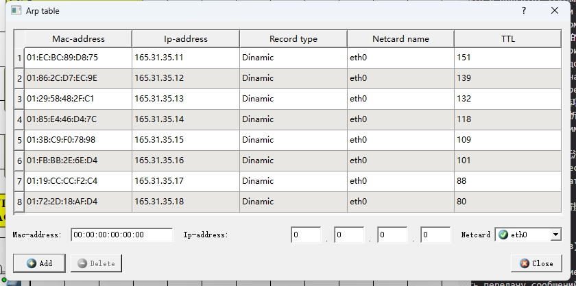
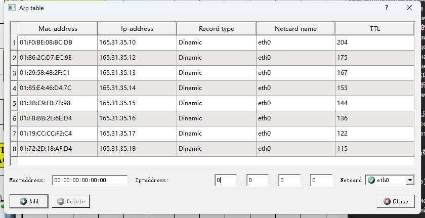
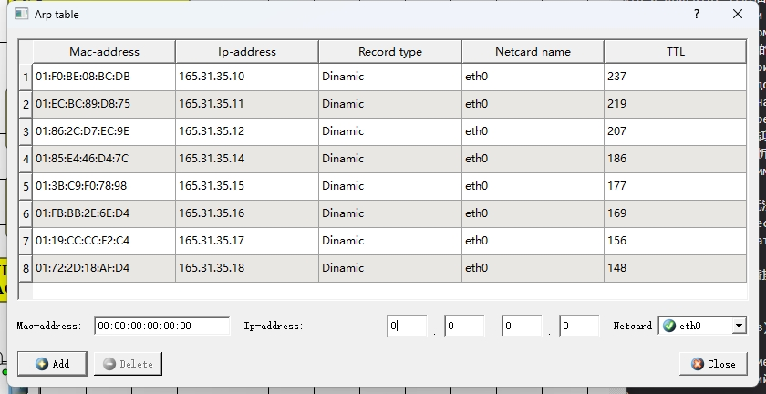
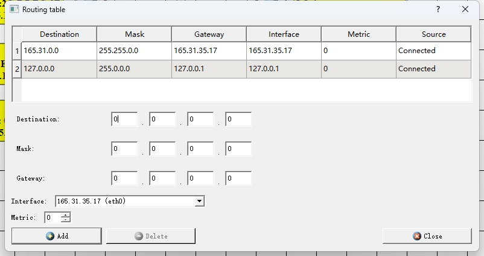
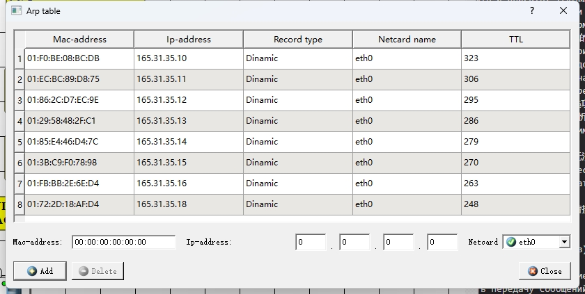
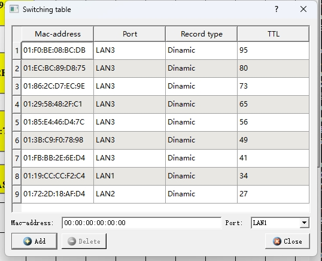

<head>
  
  
</head>

## [MainPage](../../../index.md)/[DataBase](../../README.md)/Lab 1

Университет ИТМО Факультет ФПИ и КТ

      
<h2>Отчёт по лабораторной работе 1</h2>
<h1>«Компьютерные сети»</h1>

          

Студент: Чжоу Хунсян

Группа: P33131

Преподаватель:

  

Санкт-Петербург 2024

 

---

> Вариант: 24
> Количество компьютеро в сети 1 (N1): 4 
> Количество компьютеро в сети 2 (N1): 3 
> Количество компьютеро в сети 3 (N1): 2 
> Класс IP-адресов: В
> IP : 165.31.35.10

## 1. ЦЕЛЬ РАБОТЫ

Изучение принципов настройки и функционирования локальных сетей, построенных с использованием концентраторов и коммутаторов, а также процессов передачи данных на основе стека протоколов TCP/IP, с использованием программы моделирования компьютерных сетей NetEmul.  

В процессе выполнения лабораторной работы (ЛР) необходимо:  
在进行实验室工作（LP）的过程中，有必要：

- построить модели трёх локальных сетей:  
  1) односегментной сети с использованием концентратора,  
  2) односегментной сети с использованием коммутатора;  
  3) многосегментной локальной сети;  
- выполнить настройку сети, заключающуюся в присвоении IP-адресов интерфейсам сети;  
- выполнить тестирование разработанных сетей путем проведения экспериментов по передаче данных (пакетов и кадров) на основе протоколов UDP и TCP;  
- проанализировать результаты тестирования и сформулировать выводы об эффективности смоделированных вариантов построения локальных сетей;  
- сохранить разработанные модели локальных сетей для демонстрации процессов передачи данных при защите лабораторной работы.  

### Этап 1. Локальная сеть с концентратором (Сеть 1) 

1. Построение сети с концентратором.

   

   PC 1

   

   

   PC 2

   

   

   PC 3

   

   

   PC 4

   

   

   Проанализировать содержимое таблиц маршрутизации и arp-таблиц.  
      分析路由表和arp表的内容。
   Описать: 描述：
      - какая информация находится в таблицах;  
        表中有哪些信息；
      - как формируется каждая запись в таблицах?  
        表中的每条记录是如何形成的？

2. Настройка компьютеров.
   
   

   

   

   

   

   - какие и зачем передаются служебные сообщения после назначения IP-адреса;  
        分配IP地址后传输什么以及为什么传输服务消息；
      - каково содержание этих сообщений.  
        这些消息的内容是什么。

3. **Анализ таблиц**  

   PC 1

   

   

   PC 2

   

   

   PC 3

   

   

   PC 4

   

   

   Проанализировать содержание таблиц маршрутизации и arp-таблиц компьютеров и определить:  
   分析计算机的路由表和arp表内容，确定：
   - появились ли в них изменения;  
     它们是否有任何变化；
   - если «да», то какие и почему.
     如果“是”，那么是哪些以及为什么。

4. **Тестирование сети (отправка пакетов)**.

   UDP (PC 1 -> PC 4)

   

   1. Проанализировать передачу сообщений с использованием протокола UDP. Описать:  
      分析使用UDP协议的消息传输。 描述：   
      - какие пакеты и кадры передаются в сети;  
        网络上传输哪些数据包和帧；
      - в какой последовательности передаются пакеты и кадры:  
        数据包和帧按什么顺序传输：
      - какая информация содержится в пакетах и кадрах.  
        数据包和帧中包含哪些信息。

   TCP (PC 2 -> PC 3)

   

   分析使用TCP协议的消息传输。 描述：
      - какие пакеты и кадры передаются в сети;  
        网络上传输哪些数据包和帧；
      - в какой последовательности передаются пакеты и кадры:  
        数据包和帧按什么顺序传输：
      - какая информация содержится в пакетах и кадрах;  
        数据包和帧中包含哪些信息；
      - какие основные отличия при передаче сообщений по протоколу UDP и протоколу TCP.  
        通过UDP协议和TCP协议传输消息时的主要区别是什么。

### Этап 2. Локальная сеть с коммутатором (Сеть 2) 

5. Построение локальной сети с коммутатором. 
   
   

   

   Описать: 描述：  
      - какие поля содержит таблица коммутации;  
        交换表包含哪些字段？
      - в каких единицах измеряется время жизни;  
        寿命用什么单位来衡量？
      - чему равно максимальное значение времени жизни.  
        最大终生价值是多少？

   Не заполняя таблицу коммутации провести эксперименты по передаче данных между компьютерами и описать:  
      在不填写交换表的情况下，进行计算机之间数据传输的实验并描述：
      - как происходит заполнение таблицы коммутации;  
        换算表是如何填写的；
      - на основе анализа какой информации заполняется таблица коммутации;  
        基于对交换表填写了哪些信息的分析；
      - в чем основные отличия передачи сообщений в сети с коммутатором от сети с концентратором;  
        带有交换机的网络和带有集线器的网络中消息传输的主要区别是什么；
      - когда (при каком условии) таблица коммутации будет построена полностью;  
        何时（在什么条件下）完全构建交换表；  
      - чему равно максимальное количество записей (строк) в таблице коммутации.  
        交换表中的最大条目（行）数是多少。

6. **Анализ таблиц**. 

   PC 1

   

   

   PC 2

   

   

   PC 3

   

   

   Проанализировать содержимое таблиц маршрутизации и arp- таблиц ПК и определить:  
   分析PC的路由表和arp表内容，确定：
   - появились ли в них изменения и, если «да», то какие и почему.  
     它们是否发生了变化，如果“是”，那么发生了什么变化以及原因。

7. **Тестирование сети (отправка пакетов)**.  

   UDP (PC 1 -> PC 2)

   

   Проиллюстрировать передачу сообщений с использованием протокола UDP. Описать:  
      说明使用UDP协议的消息传输。 描述：
      - какие и в какой последовательности передаются служебные и пользовательские пакеты и кадры;   
        服务和用户数据包和帧的传输内容和顺序；
      - какие изменения происходят в таблицах маршрутизации, arp- таблицах и в таблице коммутации.  
        路由表、arp 表和交换表中发生了哪些变化。 

   Проиллюстрировать передачу сообщений с использованием протоколов UDP. и TCP. Описать:  
      说明使用UDP 协议的消息传输。 和 TCP。 描述：
      - какие и в какой последовательности передаются служебные и пользовательские пакеты и кадры;  
        服务和用户数据包和帧的传输内容和顺序；
      - какие изменения происходят в таблицах маршрутизации, arp-таблицах и в таблице коммутации.  
        路由表、arp 表和交换表中发生了哪些变化。

   TCP

   

### Этап 3. Многосегментная локальная сеть (Сеть 3) 

8. Формирование сети.  

   

   

   

   

   

   

   

   

   

   

   

   

   

   

   

   

   

   

   

   

9.  Тестирование сети (отправка пакетов).  

   UDP (PC 1 -> PC 8)

   

   Для выбранного варианта связей между проиллюстрировать передачу сообщений с использованием протокола UDP. Описать:  
       对于选定的连接选项，说明使用 UDP 协议传输消息。 描述：
       - какие и в какой последовательности передаются служебные и пользовательские пакеты и кадры;  
         服务和用户数据包和帧的传输内容和顺序；
       - какие изменения происходят в таблицах коммутации и arp- таблицах.  
         交换表和arp表发生了什么变化。

   TCP (PC 1 -> PC 9)

   

   Проиллюстрировать передачу сообщений с использованием протоколов UDP и TCP. Описать:  
       说明使用UDP 和TCP 协议进行消息传输。 描述：
       - какие и в какой последовательности передаются служебные и пользовательские пакеты и кадры;  
         服务和用户数据包和帧的传输内容和顺序；
       - какие изменения происходят в таблицах коммутации и arp- таблицах.  
         交换表和arp表发生了什么变化。