<head>
  <script src="https://cdn.mathjax.org/mathjax/latest/MathJax.js?config=TeX-AMS-MML_HTMLorMML" type="text/javascript"></script>
  <script type="text/x-mathjax-config">
    MathJax.Hub.Config({
      tex2jax: {
      skipTags: ['script', 'noscript', 'style', 'textarea', 'pre'],
      inlineMath: [['$','$']]
      }
    });
  </script>
</head>

## [MainPage](../../../index.md)/[DataBase](../../README.md)/Lab 1

<center>
<p>Университет ИТМО<br>Факультет ФПИ и КТ</p>
<br><br><br><br><br><br>
<h2>Отчёт по лабораторной работе 1</h2>
<h1>«Компьютерные сети»</h1>
</center>

<br><br><br><br><br><br><br><br><br><br>

<div align="right">Студент: Чжоу Хунсян</div>
<div align="right">Группа: P33131</div>
<div align="right">Преподаватель:</div>

<center>
<br><br>
<p>Санкт-Петербург 2024</p>
<br>
</center>

---

## 1. ЦЕЛЬ РАБОТЫ

Изучение принципов настройки и функционирования локальных сетей, построенных с использованием концентраторов и коммутаторов, а также процессов передачи данных на основе стека протоколов TCP/IP, с использованием программы моделирования компьютерных сетей NetEmul.  

В процессе выполнения лабораторной работы (ЛР) необходимо:  

- построить модели трёх локальных сетей:  
  1) односегментной сети с использованием концентратора,  
  2) односегментной сети с использованием коммутатора;  
  3) многосегментной локальной сети;  
- выполнить настройку сети, заключающуюся в присвоении IP-адресов интерфейсам сети;  
- выполнить тестирование разработанных сетей путем проведения экспериментов по передаче данных (пакетов и кадров) на основе протоколов UDP и TCP;  
- проанализировать результаты тестирования и сформулировать выводы об эффективности смоделированных вариантов построения локальных сетей;  
- сохранить разработанные модели локальных сетей для демонстрации процессов передачи данных при защите лабораторной работы.  

### Этап 1. Локальная сеть с концентратором (Сеть 1) 

1. Построение сети с концентратором.

   

   PC 1

   

   

   PC 2

   

   

   PC 3

   

   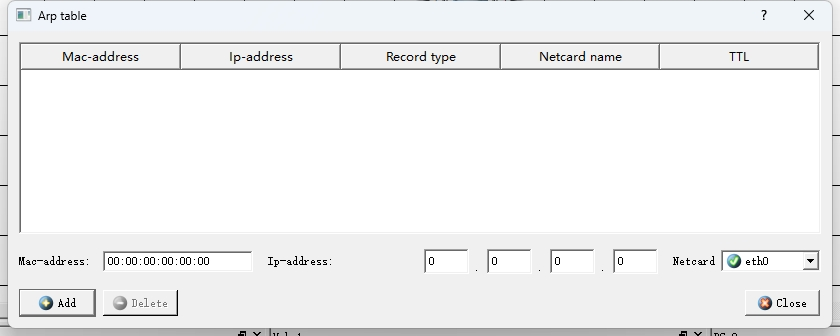

   PC 4

   

   

   Проанализировать содержимое таблиц маршрутизации и arp-таблиц.  
      
   Описать: 
      - какая информация находится в таблицах;  
      - как формируется каждая запись в таблицах?  
       
      **Таблица маршрутизации** — это важная структура данных, в которой хранится информация, используемая маршрутизаторами для определения того, как пакеты доставляются к месту назначения.

      Таблица маршрутизации содержит следующие типы информации:
      - Адрес назначения (Destination)
      Это адрес, куда отправить пакетов 
      - Маска (Mask)
      Вместе используется с Адресом назначения для определения того, к какой подсети принадлежит IP-адрес.
      - Шлюз (Gateway)
      Показывает следующий адрес для передачи пакетов
      - Интерфейс (Interface)  
      Это сетевой интерфейс, по которому пакеты покидают текущий маршрутизатор и доставляются на следующий узел.
      - Метрика (Metric)  
      используется для выражения относительной стоимости или расстояния до пункта назначения.
      - Источник (Source)  
      Относится к источнику, который генерирует или вводит запись маршрутизации.

      **Таблица ARP** (протокол разрешения адресов) — это таблица, используемая в компьютерных сетях для хранения отношений сопоставления IP-адресов и MAC-адресов. Это помогает устройствам находить физические адреса других устройств в той же подсети для передачи пакетов.

      Записи таблицы ARP содержат следующую информацию:

      - Mac-адрес  
        Это физический адрес целевого устройства.
      - Ip-адрес  
        Это IP-адрес целевого устройства
      - Тип записи  
        Указывает тип записи в таблице ARP. Общие типы записей:
        - Статическая запись: Эти записи настраиваются администратором вручную, срок их действия не истекает и не обновляется протоколом динамического ARP. Эти записи обычно используются для критически важной связи между устройствами, гарантируя, что определенные IP-адреса всегда сопоставляются с назначенными MAC-адресами.
        - Динамическая запись: Эти записи генерируются динамически посредством запросов и ответов ARP, имеют определенное время жизни (TTL) и автоматически обновляются или удаляются в зависимости от условий сетевого соединения.
      - Имя адаптера  
        Поле «Имя сетевой карты» представляет имя сетевого интерфейса или сетевого адаптера, используемого для связи. Он определяет интерфейс, через который должны отправляться и получать пакеты.
      - Время жизни  
        Указывает время действия записи ARP в таблице ARP. По истечении срока TTL, если нет нового соединения, запись удаляется, чтобы гарантировать актуальность информации в таблице ARP.
      
        

1. Настройка компьютеров.
   
   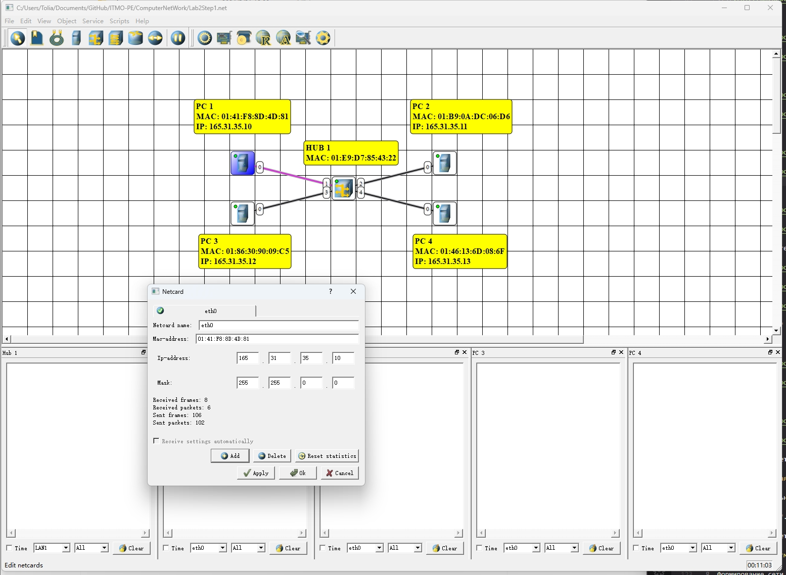

   

   

   

   

   - какие и зачем передаются служебные сообщения после назначения IP-адреса;  
      После назначения IP-адреса передаются Ethernet Frame и ARP-Запрос. Когда PC 1 назначается IP-адрес, ему необходимо убедиться, что другие устройства могут правильно отправлять данные на этот IP-адрес. И чтобы отправить данные на целевой IP-адрес, устройству необходим MAC-адрес целевого устройства. Следовательно, чтобы установить сопоставление IP-адреса и MAC-адреса, PC 1 отправляет это сообщение.
    - каково содержание этих сообщений.  
      ```
      Ethernet, отправитель: 01:B3:06:23:7E:8C получатель: FF:FF:FF:FF:FF:FF：
      ```

      Эта часть представляет собой кадр Ethernet. MAC-адрес отправителя — 01:B3:06:23:7E:8C, а MAC-адрес получателя — широковещательный адрес FF:FF:FF:FF:FF:FF. Широковещательный адрес используется для отправки кадров всем устройствам в локальной сети.

      ```
      ARP-запрос:
        IP адрес отправителя: 223.35.37.10
        MAC адрес отправителя: 01:B3:06:23:7E:8C
        IP адрес назначения: 223.35.37.10
        MAC адрес назначения: 00:00:00:00:00:00
      ```

      Эта часть представляет запрос ARP.
      - IP-адрес отправителя — 223.35.37.10, который является IP-адресом PC 1.
      - MAC-адрес отправителя — 01:B3:06:23:7E:8C, который является MAC-адресом PC 1.
      - IP-адрес получателя — 223.35.37.10, который является IP-адресом PC 1, что указывает на то, что запрос ARP предназначен для самого PC 1.
      - MAC-адрес получателя состоит из нулей, что является неизвестным MAC-адресом в запросе ARP, поскольку цель запроса ARP — найти MAC-адрес, соответствующий IP-адресу.

2. **Анализ таблиц**  

   PC 1

   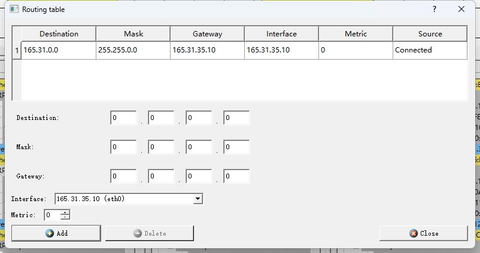

   

   PC 2

   

   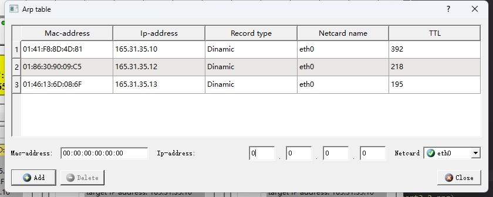

   PC 3

   

   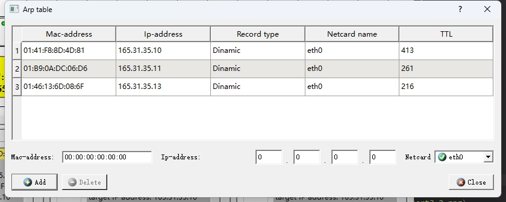

   PC 4

   

   

   Проанализировать содержание таблиц маршрутизации и arp-таблиц компьютеров и определить:  
   - появились ли в них изменения;  
     После установки IP-адреса в ARP-таблицу устройства добавляются записи других устройств.
   - если «да», то какие и почему.
     После установки IP-адреса для PC PC отправит запрос ARP всем устройствам в сети и сохранит взаимосвязь между MAC-адресом PC и IP-адресом в таблицах ARP других устройств.

3. **Тестирование сети (отправка пакетов)**.

   UDP (PC 1 -> PC 4)

   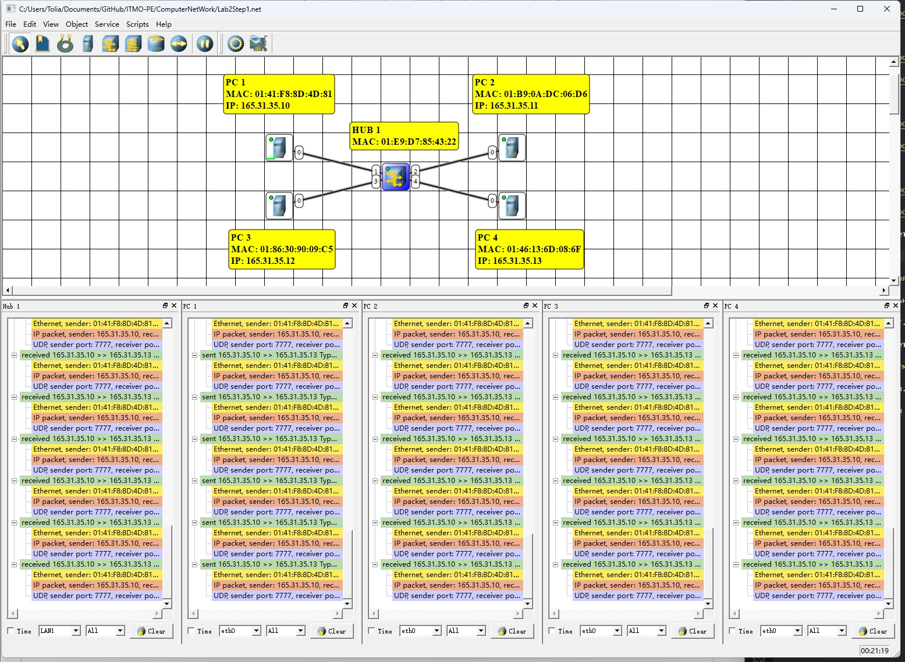

   1. Проанализировать передачу сообщений с использованием протокола UDP. Описать:  
      - какие пакеты и кадры передаются в сети;  
      - в какой последовательности передаются пакеты и кадры:  
      - какая информация содержится в пакетах и кадрах.   

      Последовательность и информация, содержащаяся в пакетах данных и кадрах, которые будут передаваться по сети, следующие:

      **ARP-запрос**:
      - **Кадр Ethernet**:
         - **Исходный MAC-адрес**: MAC-адрес PC1.
         - **MAC-адрес назначения**: широковещательный адрес FF:FF:FF:FF:FF:FF
      - **ARP-пакет**:
         - **MAC-адрес отправителя**: MAC-адрес PC1.
         - **IP-адрес отправителя**: IP-адрес PC1.
         - **MAC-адрес назначения**: 00:00:00:00:00:00
         - **IP-адрес назначения**: IP-адрес назначения.

      **Ответ ARP** (при условии, что целевое устройство существует):
      - **Кадр Ethernet**:
         - **Исходный MAC-адрес**: MAC-адрес целевого устройства.
         - **MAC-адрес назначения**: MAC-адрес PC1.
      - **ARP-пакет**:
         - **MAC-адрес отправителя**: MAC-адрес целевого устройства.
         - **IP-адрес отправителя**: IP-адрес целевого устройства.
         - **MAC-адрес назначения**: MAC-адрес PC1.
         - **IP-адрес назначения**: IP-адрес PC1.

      **UDP-пакетов**

      Как только PC1 узнает MAC-адрес целевого устройства, он начинает передавать пакеты UDP.

      **UDP-пакет**:
      - **Кадр Ethernet**:
         - **Исходный MAC-адрес**: MAC-адрес PC1.
         - **MAC-адрес назначения**: MAC-адрес целевого устройства.
      - **IP-ПАКЕТ**:
         - **Версия**: IPv4.
         - **Длина заголовка**: 20 байт.
         - **Тип услуги**: по умолчанию.
         - **Общая длина**: заголовок IP + заголовок UDP + данные.
         - **Идентификация**: идентификатор, идентифицирующий пакет.
         - **flag**: флаг шардинга.
         - **Смещение среза**: смещение среза.
         - **Время жизни (TTL)**: обычно 64.
         - **Протокол**: UDP (17)
         - **Контрольная сумма заголовка**: контрольная сумма IP-заголовка.
         - **Исходный IP-адрес**: IP-адрес PC1.
         - **IP-адрес назначения**: IP-адрес целевого устройства.
      - **UDP-ПАКЕТ**:
         - **Исходный порт**: случайно выбранный порт.
         - **Порт назначения**: порт, указанный приложением.
         - **Длина**: заголовок UDP + длина данных.
         - **Контрольная сумма**: контрольная сумма UDP (необязательно).
         - **Данные**: фактические данные приложения.

      **Последовательность передачи данных**

      1. **ARP-запрос** (при необходимости):
          - PC1 отправляет широковещательный запрос ARP с вопросом, кому принадлежит целевой IP-адрес.
         
      2. **Ответ ARP** (при необходимости):
          - Целевое устройство отправляет PC1 свой MAC-адрес.

      3. **UDP-пакет**:
          - PC1 отправляет пакет UDP на целевое устройство.  

   TCP (PC 2 -> PC 3)

   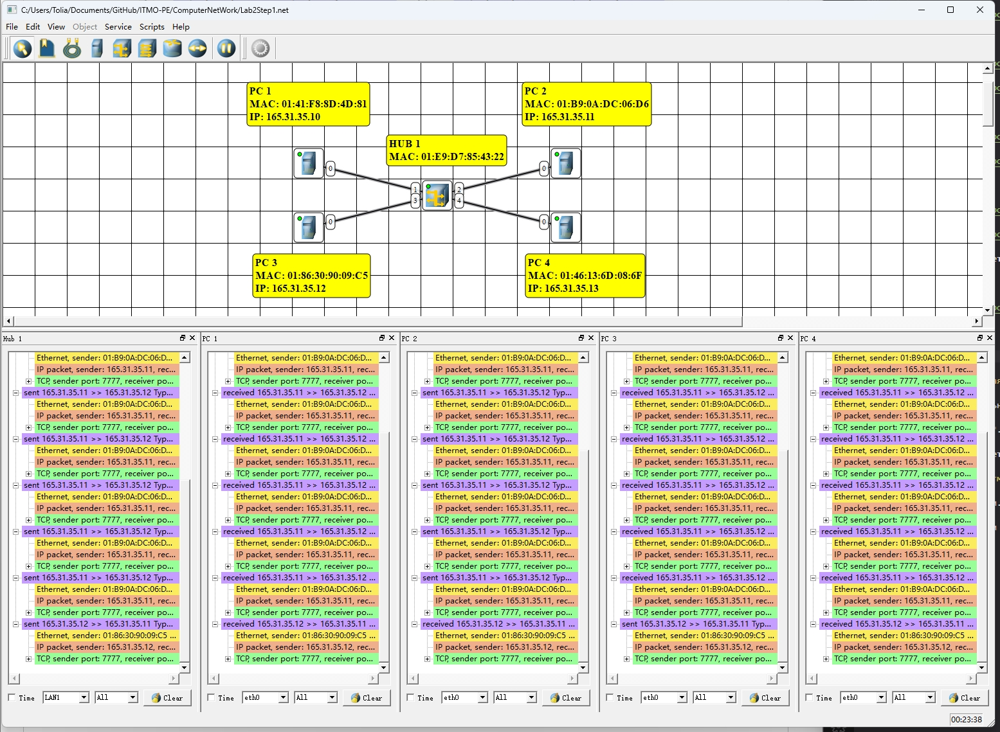

   
     - какие пакеты и кадры передаются в сети;  
     - в какой последовательности передаются пакеты и кадры:  
     - какая информация содержится в пакетах и кадрах;  
     - какие основные отличия при передаче сообщений по протоколу UDP и протоколу TCP.  

     Ниже представлена ​​последовательность и содержание пакетов и кадров, участвующих в процессе передачи, а также основные различия между протоколом TCP и протоколом UDP.

     1. **Запрос ARP и ответ ARP**

        Если перед установкой TCP-соединения ПК1 не знает MAC-адрес целевого ПК (например, ПК2), он сначала отправит запрос ARP.

     **ARP-запрос**:
     - **Кадр Ethernet**:
       - **Исходный MAC-адрес**: MAC-адрес ПК1.
       - **MAC-адрес назначения**: широковещательный адрес FF:FF:FF:FF:FF:FF
     - **ARP-пакет**:
       - **MAC-адрес отправителя**: MAC-адрес ПК1.
       - **IP-адрес отправителя**: IP-адрес ПК1.
       - **MAC-адрес назначения**: 00:00:00:00:00:00
       - **IP-адрес назначения**: IP-адрес ПК2.

     **Ответ ARP**:
     - **Кадр Ethernet**:
       - **Исходный MAC-адрес**: MAC-адрес ПК2.
       - **MAC-адрес назначения**: MAC-адрес ПК1.
     - **ARP-пакет**:
       - **MAC-адрес отправителя**: MAC-адрес ПК2.
       - **IP-адрес отправителя**: IP-адрес ПК2.
       - **MAC-адрес назначения**: MAC-адрес ПК1.
       - **IP-адрес назначения**: IP-адрес ПК1.

    2. **Трехстороннее TCP-подтверждение**

       **Пакет SYN**:
       - **Кадр Ethernet**:
         - **Исходный MAC-адрес**: MAC-адрес ПК1.
         - **MAC-адрес назначения**: MAC-адрес ПК2.
       - **IP-ПАКЕТ**:
         - **Исходный IP-адрес**: IP-адрес ПК1.
         - **IP-адрес назначения**: IP-адрес ПК2.
       - **TCP-сегмент**:
         - **Исходный порт**: произвольный порт.
         - **Порт назначения**: целевой порт службы (например, 80).
         - **Серийный номер**: начальный серийный номер.
         - **флаг**: SYN

      **Пакет SYN-ACK**:
      - **Кадр Ethernet**:
        - **Исходный MAC-адрес**: MAC-адрес ПК2.
        - **MAC-адрес назначения**: MAC-адрес ПК1.
      - **IP-ПАКЕТ**:
        - **Исходный IP-адрес**: IP-адрес ПК2.
        - **IP-адрес назначения**: IP-адрес ПК1.
      - **TCP-сегмент**:
        - **Исходный порт**: порт назначения службы (например, 80).
        - **Порт назначения**: произвольный порт ПК1.
        - **Серийный номер**: начальный серийный номер ПК2.
        - **Номер подтверждения**: первоначальный серийный номер ПК1 + 1.
        - **Флаговый бит**: SYN, ACK

      **Пакет ACK**:
      - **Кадр Ethernet**:
        - **Исходный MAC-адрес**: MAC-адрес ПК1.
        - **MAC-адрес назначения**: MAC-адрес ПК2.
      - **IP-ПАКЕТ**:
        - **Исходный IP-адрес**: IP-адрес ПК1.
        - **IP-адрес назначения**: IP-адрес ПК2.
      - **TCP-сегмент**:
        - **Исходный порт**: произвольный порт ПК1.
        - **Порт назначения**: целевой порт службы (например, 80).
        - **Серийный номер**: начальный серийный номер ПК1 + 1.
        - **Номер подтверждения**: первоначальный серийный номер ПК2 + 1.
        - **флаг**: ПОДТВЕРЖДЕНО

      1. **Передача данных**

      **пакет данных**:
      - **Кадр Ethernet**:
        - **Исходный MAC-адрес**: MAC-адрес ПК1.
        - **MAC-адрес назначения**: MAC-адрес ПК2.
      - **IP-ПАКЕТ**:
        - **Исходный IP-адрес**: IP-адрес ПК1.
        - **IP-адрес назначения**: IP-адрес ПК2.
      - **TCP-сегмент**:
        - **Исходный порт**: произвольный порт ПК1.
        - **Порт назначения**: целевой порт службы (например, 80).
        - **Серийный номер**: текущий серийный номер ПК1.
        - **Номер подтверждения**: текущий серийный номер ПК2.
        - **флаг**: ПОДТВЕРЖДЕНО
        - **данные**: данные уровня приложения.

      Основное отличие протокола TCP от протокола UDP для передачи сообщений

      1. **Способ подключения**:
         - **TCP**: ориентирован на соединение: соединение должно быть установлено до передачи данных (трехстороннее подтверждение), а соединение разрывается (четырехстороннее подтверждение) после завершения передачи.
         - **UDP**: соединение не требуется, перед отправкой данных соединение не требуется, пакеты данных отправляются напрямую.

      2. **Надежность**:
         - **TCP**: обеспечивает надежную передачу данных, гарантируя, что пакеты данных прибудут в порядке и без потерь, а также обеспечивает надежность передачи данных посредством механизма повторной передачи и механизма подтверждения.
         - **UDP**: надежность не гарантируется, пакеты могут быть потеряны, дублированы или повреждены.

      3. **Управление потоком и контроль перегрузки**:
         - **TCP**: он имеет механизмы управления потоком и контроля перегрузки, которые могут регулировать скорость передачи данных в соответствии с условиями сети, чтобы избежать перегрузки сети.
         - **UDP**: не обеспечивает управление потоком и контроль перегрузки и подходит для приложений с высокими требованиями к работе в реальном времени (например, видеоконференции, игры в реальном времени).

      4. **Накладные расходы**:
         - **TCP**: из-за необходимости поддерживать состояние соединения и выполнять управление потоком данных и контроль перегрузки, он требует больших затрат.
         - **UDP**: меньше накладных расходов, поскольку нет необходимости устанавливать соединение и поддерживать состояние.
      

### Этап 2. Локальная сеть с коммутатором (Сеть 2) 

5. Построение локальной сети с коммутатором. 
   
   

   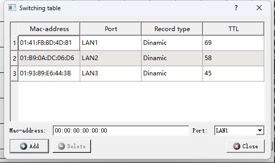

   Описать: 描述：  
      - какие поля содержит таблица коммутации;  
        1. **MAC-адрес**: аппаратный адрес устройства (48-битный адрес).
        2. **Номер порта**: номер порта коммутатора, указывающий физический порт, на котором расположен MAC-адрес.
        3. **Идентификатор VLAN** (если коммутатор поддерживает VLAN): определяет, к какой виртуальной локальной сети (VLAN) он принадлежит.
        4. **TTL** (время жизни): время существования записи, используемое для определения момента удаления записи.
      - в каких единицах измеряется время жизни;  
        Единицей TTL (времени жизни) обычно являются секунды. Это используется для измерения времени существования записи в таблице обмена. По истечении этого времени запись будет удалена, чтобы гарантировать актуальность информации в таблице обмена.
      - чему равно максимальное значение времени жизни.  
        видимо 69

   - Не заполняя таблицу коммутации провести эксперименты по передаче данных между компьютерами и описать:  
      - как происходит заполнение таблицы коммутации;  
        Когда коммутатор подключен к сети, таблица коммутации пуста.  

        Когда один компьютер (например, ПК1) отправляет данные на другой компьютер (например, ПК2), коммутатор получает кадр Ethernet, отправленный ПК1.
        Коммутатор прочитает исходный MAC-адрес кадра, свяжет адрес с номером порта, на котором был получен кадр, и запишет его в таблицу коммутации.
        Если MAC-адрес назначения кадра отсутствует в таблице коммутации, коммутатор рассылает (широковещательно) кадр на все порты, кроме принимающего порта.  

        Когда устройство назначения (ПК2) получает кадр и отвечает, коммутатор считывает MAC-адрес источника ответного кадра, связывает адрес с номером порта, на котором был получен кадр, и записывает его в таблицу коммутации.
      - на основе анализа какой информации заполняется таблица коммутации;  
        Каждая запись в таблице обмена (таблице MAC-адресов) обычно содержит следующие поля:

        1. MAC-адрес: аппаратный адрес устройства (48-битный адрес).
        2. Номер порта: номер порта коммутатора, указывающий физический порт, на котором расположен MAC-адрес.
        3. Тип записи: в таблице обмена обычно используется для указания источника или типа записи MAC-адреса. Коммутаторы используют различные типы записей для оптимизации производительности сети и управления ею.
        4. TTL (время жизни): время существования записи таблицы, используемое для принятия решения о том, когда удалить запись таблицы, чтобы обеспечить своевременное обновление записи таблицы.
      - в чем основные отличия передачи сообщений в сети с коммутатором от сети с концентратором;  
        
      - когда (при каком условии) таблица коммутации будет построена полностью;  
        Полное построение обменной таблицы требует выполнения следующих условий:

        1. Между сетевыми устройствами имеется достаточная связь: коммутатору необходимо получать достаточное количество кадров данных для изучения и записи MAC-адресов и соответствующих номеров портов всех устройств в сети.
        2. Достаточно времени. Коммутатору необходимо время, чтобы постепенно получать сетевой трафик и постоянно обновлять таблицу коммутации на основе полученных кадров данных.
      - чему равно максимальное количество записей (строк) в таблице коммутации.  
        Максимальное количество записей (количество строк) в таблице коммутации зависит от аппаратной конструкции и конфигурации коммутатора. Различные коммутаторы имеют разную емкость таблицы коммутации. Обычно коммерческие коммутаторы могут содержать от тысяч до десятков тысяч записей MAC-адресов. Конкретную мощность можно узнать в технических характеристиках устройства.

6. **Анализ таблиц**. 

   PC 1

   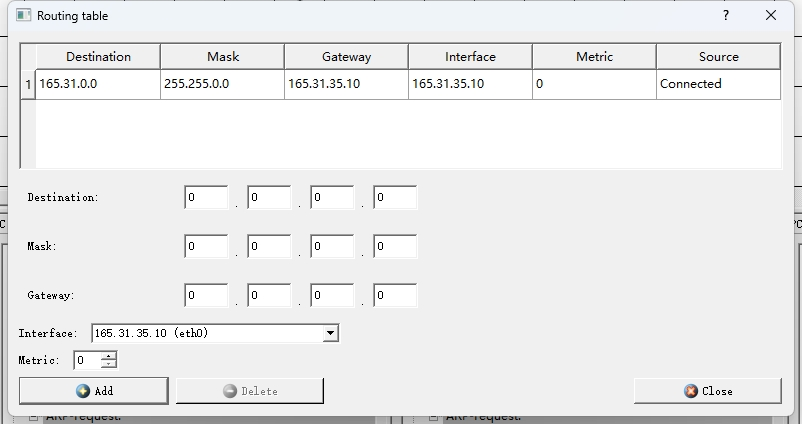

   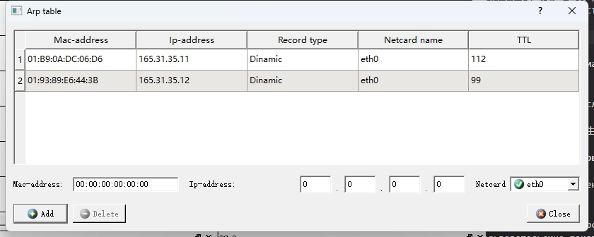

   PC 2

   

   

   PC 3

   

   

   Проанализировать содержимое таблиц маршрутизации и arp- таблиц ПК и определить:  
   - появились ли в них изменения и, если «да», то какие и почему.  
     В таблицу ARP добавлена ​​связь между MAC-адресами и IP-адресами других устройств в сети.

     После установки IP-адреса для PC PC отправит запрос ARP всем устройствам в сети и сохранит взаимосвязь между MAC-адресом PC и IP-адресом в таблицах ARP других устройств.

7. **Тестирование сети (отправка пакетов)**.  

   UDP (PC 1 -> PC 2)

   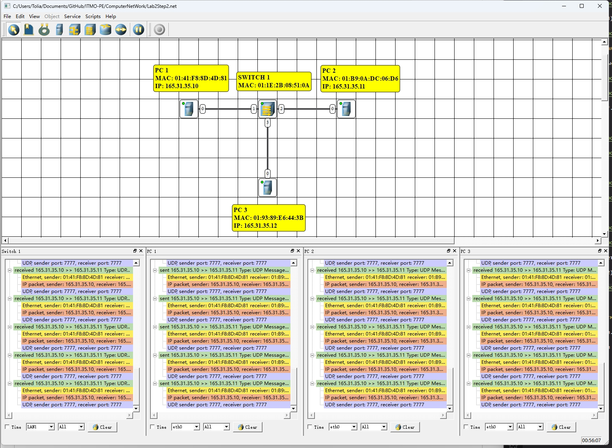

   Проиллюстрировать передачу сообщений с использованием протокола UDP. Описать:  
      - какие и в какой последовательности передаются служебные и пользовательские пакеты и кадры;   
      - какие изменения происходят в таблицах маршрутизации, arp- таблицах и в таблице коммутации.  
   
   Последовательность и информация, содержащаяся в пакетах данных и кадрах, которые будут передаваться по сети, следующие:

   **ARP-запрос**:
   - **Кадр Ethernet**:
      - **Исходный MAC-адрес**: MAC-адрес PC1.
      - **MAC-адрес назначения**: широковещательный адрес FF:FF:FF:FF:FF:FF
   - **ARP-пакет**:
      - **MAC-адрес отправителя**: MAC-адрес PC1.
      - **IP-адрес отправителя**: IP-адрес PC1.
      - **MAC-адрес назначения**: 00:00:00:00:00:00
      - **IP-адрес назначения**: IP-адрес назначения.

   **Ответ ARP** (при условии, что целевое устройство существует):
   - **Кадр Ethernet**:
      - **Исходный MAC-адрес**: MAC-адрес целевого устройства.
      - **MAC-адрес назначения**: MAC-адрес PC1.
   - **ARP-пакет**:
      - **MAC-адрес отправителя**: MAC-адрес целевого устройства.
      - **IP-адрес отправителя**: IP-адрес целевого устройства.
      - **MAC-адрес назначения**: MAC-адрес PC1.
      - **IP-адрес назначения**: IP-адрес PC1.

   **UDP-пакетов**

   Как только PC1 узнает MAC-адрес целевого устройства, он начинает передавать пакеты UDP.

   **UDP-пакет**:
   - **Кадр Ethernet**:
      - **Исходный MAC-адрес**: MAC-адрес PC1.
      - **MAC-адрес назначения**: MAC-адрес целевого устройства.
   - **IP-ПАКЕТ**:
      - **Версия**: IPv4.
      - **Длина заголовка**: 20 байт.
      - **Тип услуги**: по умолчанию.
      - **Общая длина**: заголовок IP + заголовок UDP + данные.
      - **Идентификация**: идентификатор, идентифицирующий пакет.
      - **flag**: флаг шардинга.
      - **Смещение среза**: смещение среза.
      - **Время жизни (TTL)**: обычно 64.
      - **Протокол**: UDP (17)
      - **Контрольная сумма заголовка**: контрольная сумма IP-заголовка.
      - **Исходный IP-адрес**: IP-адрес PC1.
      - **IP-адрес назначения**: IP-адрес целевого устройства.
   - **UDP-ПАКЕТ**:
      - **Исходный порт**: случайно выбранный порт.
      - **Порт назначения**: порт, указанный приложением.
      - **Длина**: заголовок UDP + длина данных.
      - **Контрольная сумма**: контрольная сумма UDP (необязательно).
      - **Данные**: фактические данные приложения.

   **Последовательность передачи данных**

   1. **ARP-запрос** (при необходимости):
       - PC1 отправляет широковещательный запрос ARP с вопросом, кому принадлежит целевой IP-адрес.
      
   2. **Ответ ARP** (при необходимости):
       - Целевое устройство отправляет PC1 свой MAC-адрес.

   3. **UDP-пакет**:
       - PC1 отправляет пакет UDP на целевое устройство.  

   Проиллюстрировать передачу сообщений с использованием протоколов UDP. и TCP. Описать:  
     - какие и в какой последовательности передаются служебные и пользовательские пакеты и кадры;  
       Ниже представлена ​​последовательность и содержание пакетов и кадров, участвующих в процессе передачи, а также основные различия между протоколом TCP и протоколом UDP.

     1. **Запрос ARP и ответ ARP**

        Если перед установкой TCP-соединения ПК1 не знает MAC-адрес целевого ПК (например, ПК2), он сначала отправит запрос ARP.

     **ARP-запрос**:
     - **Кадр Ethernet**:
       - **Исходный MAC-адрес**: MAC-адрес ПК1.
       - **MAC-адрес назначения**: широковещательный адрес FF:FF:FF:FF:FF:FF
     - **ARP-пакет**:
       - **MAC-адрес отправителя**: MAC-адрес ПК1.
       - **IP-адрес отправителя**: IP-адрес ПК1.
       - **MAC-адрес назначения**: 00:00:00:00:00:00
       - **IP-адрес назначения**: IP-адрес ПК2.

     **Ответ ARP**:
     - **Кадр Ethernet**:
       - **Исходный MAC-адрес**: MAC-адрес ПК2.
       - **MAC-адрес назначения**: MAC-адрес ПК1.
     - **ARP-пакет**:
       - **MAC-адрес отправителя**: MAC-адрес ПК2.
       - **IP-адрес отправителя**: IP-адрес ПК2.
       - **MAC-адрес назначения**: MAC-адрес ПК1.
       - **IP-адрес назначения**: IP-адрес ПК1.

    1. **Трехстороннее TCP-подтверждение**

       **Пакет SYN**:
       - **Кадр Ethernet**:
         - **Исходный MAC-адрес**: MAC-адрес ПК1.
         - **MAC-адрес назначения**: MAC-адрес ПК2.
       - **IP-ПАКЕТ**:
         - **Исходный IP-адрес**: IP-адрес ПК1.
         - **IP-адрес назначения**: IP-адрес ПК2.
       - **TCP-сегмент**:
         - **Исходный порт**: произвольный порт.
         - **Порт назначения**: целевой порт службы (например, 80).
         - **Серийный номер**: начальный серийный номер.
         - **флаг**: SYN

      **Пакет SYN-ACK**:
      - **Кадр Ethernet**:
        - **Исходный MAC-адрес**: MAC-адрес ПК2.
        - **MAC-адрес назначения**: MAC-адрес ПК1.
      - **IP-ПАКЕТ**:
        - **Исходный IP-адрес**: IP-адрес ПК2.
        - **IP-адрес назначения**: IP-адрес ПК1.
      - **TCP-сегмент**:
        - **Исходный порт**: порт назначения службы (например, 80).
        - **Порт назначения**: произвольный порт ПК1.
        - **Серийный номер**: начальный серийный номер ПК2.
        - **Номер подтверждения**: первоначальный серийный номер ПК1 + 1.
        - **Флаговый бит**: SYN, ACK

      **Пакет ACK**:
      - **Кадр Ethernet**:
        - **Исходный MAC-адрес**: MAC-адрес ПК1.
        - **MAC-адрес назначения**: MAC-адрес ПК2.
      - **IP-ПАКЕТ**:
        - **Исходный IP-адрес**: IP-адрес ПК1.
        - **IP-адрес назначения**: IP-адрес ПК2.
      - **TCP-сегмент**:
        - **Исходный порт**: произвольный порт ПК1.
        - **Порт назначения**: целевой порт службы (например, 80).
        - **Серийный номер**: начальный серийный номер ПК1 + 1.
        - **Номер подтверждения**: первоначальный серийный номер ПК2 + 1.
        - **флаг**: ПОДТВЕРЖДЕНО

      1. **Передача данных**

      **пакет данных**:
      - **Кадр Ethernet**:
        - **Исходный MAC-адрес**: MAC-адрес ПК1.
        - **MAC-адрес назначения**: MAC-адрес ПК2.
      - **IP-ПАКЕТ**:
        - **Исходный IP-адрес**: IP-адрес ПК1.
        - **IP-адрес назначения**: IP-адрес ПК2.
      - **TCP-сегмент**:
        - **Исходный порт**: произвольный порт ПК1.
        - **Порт назначения**: целевой порт службы (например, 80).
        - **Серийный номер**: текущий серийный номер ПК1.
        - **Номер подтверждения**: текущий серийный номер ПК2.
        - **флаг**: ПОДТВЕРЖДЕНО
        - **данные**: данные уровня приложения.

   TCP

   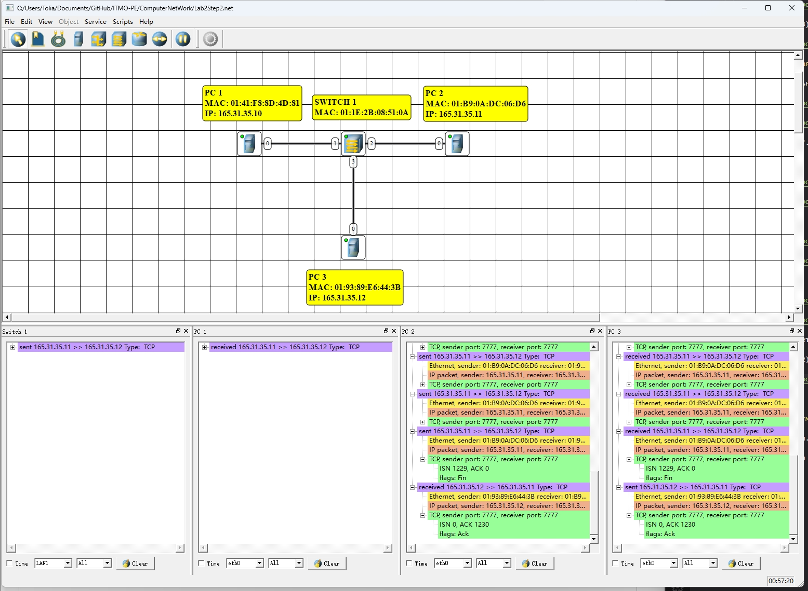

### Этап 3. Многосегментная локальная сеть (Сеть 3) 

8. Формирование сети.  

   

   

   

   

   

   

   

   

   

   

   

   

   

   

   

   

   

   

   

   

9.  Тестирование сети (отправка пакетов).  

   UDP (PC 1 -> PC 8)

   


   TCP (PC 1 -> PC 9)

   

