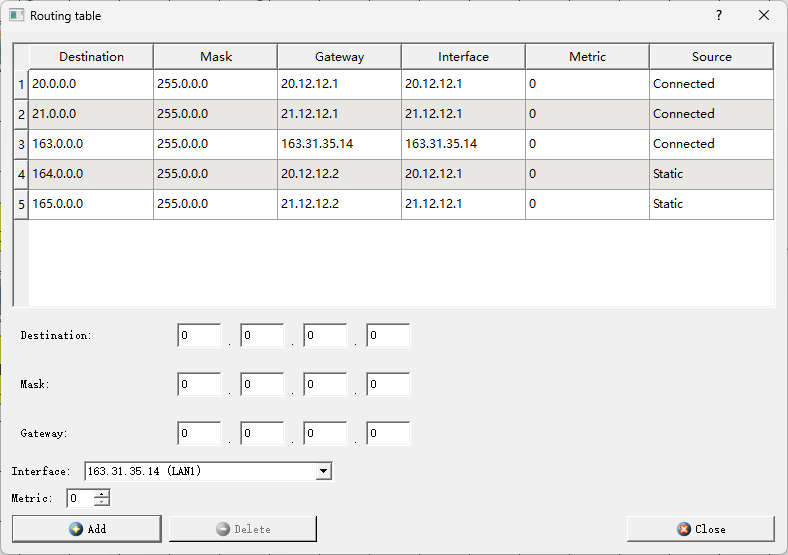

<head>
  
  
</head>

## [MainPage](../../../index.md)/[DataBase](../../README.md)/Lab 1

Университет ИТМО Факультет ФПИ и КТ

      
<h2>Отчёт по лабораторной работе 1</h2>
<h1>«Компьютерные сети»</h1>

          

Студент: Чжоу Хунсян

Группа: P33131

Преподаватель:

  

Санкт-Петербург 2024

 

---

## 1. ЦЕЛЬ РАБОТЫ

Изучение принципов конфигурирования и процессов функционирования компьютерных сетей, представляющих собой несколько подсетей, связанных с помощью маршрутизаторов, процессов автоматического распределения сетевых адресов, принципов статической маршрутизации и динамической маршрутизации, а также передачи данных на основе протоколов UDP и TCP.  

В процессе выполнения лабораторной работы необходимо:  
- построить модели компьютерных сетей, представляющих собой несколько подсетей, объединенных в одну автономную сеть, в соответствии с заданными вариантами топологий, представленными в Приложении (В1 – В6);  
- выполнить настройку сети при статической маршрутизации, заключающуюся в присвоении IP-адресов интерфейсам сети и ручном заполнении таблиц маршрутизации;  
- промоделировать работу сети при использовании динамической маршрутизации на основе протокола RIP и при автоматическом распределении IP-адресов на основе протокола DHCP;  
- выполнить тестирование построенных сетей путем проведения экспериментов по передаче данных на основе протоколов UDP и TCP;  
- проанализировать результаты тестирования и сформулировать выводы об эффективности сетей с разными топологиями;
- сохранить разработанные модели локальных сетей для демонстрации процессов передачи данных при защите лабораторной работы.  

### ЗАДАНИЕ 1. Сеть с одним маршрутизатором (вариант В1)

1. Построение и настройка сети с маршрутизатором.  
   使用路由器构建和配置网络。

   

   1. Проанализировать содержимое таблиц маршрутизации. Описать:  
      - какая информация находится в таблицах;  
      - каким образом сформированы записи в таблицах?  

   

   **Таблица маршрутизации** — это важная структура данных, в которой хранится информация, используемая маршрутизаторами для определения того, как пакеты доставляются к месту назначения.

      Таблица маршрутизации содержит следующие типы информации:
      - Адрес назначения (Destination)
      Это адрес, куда отправить пакетов 
      - Маска (Mask)
      Вместе используется с Адресом назначения для определения того, к какой подсети принадлежит IP-адрес.
      - Шлюз (Gateway)
      Показывает следующий адрес для передачи пакетов
      - Интерфейс (Interface)  
      Это сетевой интерфейс, по которому пакеты покидают текущий маршрутизатор и доставляются на следующий узел.
      - Метрика (Metric)  
      используется для выражения относительной стоимости или расстояния до пункта назначения.
      - Источник (Source)  
      Относится к источнику, который генерирует или вводит запись маршрутизации.

2. Тестирование сети (отправка пакетов).
   1. Проиллюстрировать передачу сообщений с использованием протокола UDP. Описать:  

      

      - какие пакеты и в какой последовательности передаются пакеты в сети;   

      - какая информация содержится в пакетах и кадрах.  
        Последовательность и информация, содержащаяся в пакетах данных и кадрах, которые будут передаваться по сети, следующие:

      Последовательность передачи пакетов в сети
      1. Подготовка сообщения
      2. Формирование UDP-пакета
         1. Заголовок UDP
         2. Данные: Сообщение, передаваемое приложением.
      3. Инкапсуляция в IP-пакет
         1. Заголовок IP
         2. Поле данных: UDP-пакет.
      4. Передача через сеть
      5. Декодирование IP-пакета
      6. Декодирование UDP-пакетаИнформация в пакетах и кадрах
      Информация в пакетах и кадрах
       - UDP-пакет:
         - Заголовок UDP:
         - Данные: Сообщение, передаваемое приложением.
       - IP-пакет:
         - Заголовок IP:
         - Поле данных: UDP-пакет.
       - Кадр канального уровня:
         - Заголовок Ethernet:
           - MAC-адрес назначения
           - MAC-адрес источника
           - Тип
       - Поле данных: IP-пакет.

   2. Проанализировать передачу сообщений с использованием протокола TCP. Описать:  

      

      - какие пакеты и в какой последовательности передаются пакеты в сети;  
        Последовательность передачи пакетов в сети
        1. Установление соединения (трехэтапное рукопожатие)
        2. Передача данных:
           - полученного сегмента.
        3. Закрытие соединения:

      - какая информация содержится в пакетах и кадрах;  
        数据包和帧中包含哪些信息； 

        Информация в пакетах и кадрах
        - TCP-пакет:
          - Заголовок TCP
          - Данные: Сообщение, передаваемое приложением.
        - IP-пакет:
          - Структура аналогична UDP-упаковке.
        - Кадр канального уровня:
          - Структура аналогична UDP-упаковке.

      - в чем отличия при передаче сообщений по протоколам UDP и TCP по сравнению с сетями без маршрутизаторов.  
        Ключевая разница при отправке сообщений по UDP и TCP с использованием маршрутизатора и без него заключается, на наш взгляд, в том, что нам напрямую недоступен компьютер другой подсети, мы знаем только его IP, с помощью механизма маршрутизации. Нам удается выбрать нужное направление и донести информацию до адресата. Поэтому в журналах мы видим MAC-адрес не конечного узла, с которым обмениваемся, а MAC-адреса одного из интерфейсов маршрутизатора. 

### ЗАДАНИЕ 2. Сеть двумя маршрутизаторами (вариант В2)

3. Построение сети. 建立网络。

   
   
   Теперь два маршрутизатора, каждый из которых подключен к двум подсетям (-> в таблице маршрутизации только 2 записи). Непростая ситуация с подсетью №2, так как она имеет подключение сразу к 2 маршрутизаторам, из-за этого непонятно, какой шлюз по умолчанию выставлять. 

   Если выставить на компьютере №3 шлюз по умолчанию равный IP-адресу интерфейса первого маршрутизатора, то ко второму маршрутизатору и, соответственно, к третьей подсети у нас доступа не будет.  
   Решение проблемы только если добавить по умолчанию, чтобы шлюзы маршрутизаторов ссылались друг на друга.

4. Тестирование сети (отправка пакетов).

   1. Проиллюстрировать передачу сообщений с использованием протокола UDP. Описать:    

      

   2. Проанализировать передачу сообщений с использованием протокола TCP. Описать:  

      

   Отправка пакетов по UDP и TCP не будет отличаться от предыдущего пункта. Точнее механизм и само содержание пакетов отличаться не будет, но будут отличаться маршруты. А точнее их доступность. Так, например, мы не сможем передать с 1 подсети сообщение в третью подсеть, так как нам маршрутизатор (своеобразное окно в Европу), подключенный к первой подсети, может взаимодействовать только с первой и второй подсетями. До третьей нам не добраться. (Без добавления в таблицу маршрутизации статической записи на другой маршрутизатор). 

### Этап 3. ЗАДАНИЕ 3. Сеть тремя маршрутизаторами

5. Построение сети.  
   建立网络。

   
 
   1. Проанализировать содержимое таблиц маршрутизации. Описать:  
      - какая информация находится в таблице;   
      - как сформированы записи (строки) в таблице?  

      Таблицы маршрутизации выглядят подобно двум предыдущим моделям. За исключением того, что, так как маршрутизаторы соединены между собой, они составляют собой мнимую своеобразную подсеть -> нам нужна новая группа адресов для 3 дополнительных подсетей. 2 из которых для каждого маршрутизатора мы и наблюдаем в таблице маршрутизации.

      Из-за появления новых подсетей (трех пар маршрутизаторов) возникает необходимость в добавлении статических маршрутов в таблицу маршрутизации. Иначе у нас не будет возможности из одной подсети попасть во вторую. Нам нужно задать правило.

      Таким образом, таблица маршрутизации для маршрутизаторов выглядит следующим образом:

      Router 1

      

      Router 2

      

      Router 3

      

   2. Добавить в таблицы маршрутизации статические маршруты, обосновав их необходимость.  

6. Тестирование сети (отправка пакетов).  
   1. Проиллюстрировать передачу сообщений с использованием протокола UDP и статической маршрутизации. Если сеть не функционирует или передача пакетов осуществляется некорректно, внести необходимые минимальные изменения в рассматриваемой сети, обеспечивающие корректное функционирование (передачу пакетов). Описать:   

     

   - какие изменения пришлось внести в сети и почему;  

     За счет того, что в начале топология была выбрана «с умом» (надеюсь), изменения в сети вносить не пришлось, добавив статические записи в таблицу маршрутизации и наладив взаимодействие двух маршрутизаторов друг с другом, нам удалось добиться доступности одной подсети другой. -> передача по протоколам UDP и TCP осуществилась корректно.

     Передача ничем принципиальным не отличается от предыдущих случаев, за исключением добавления + 1 уровня на пути к конечной подсети (за счет коммуникации двух маршрутизаторов).

   2. Проанализировать передачу сообщений с использованием протокола TCP. Описать:  
      分析使用TCP协议的消息传输。描述： 

       

7. Настройка динамической маршрутизации по протоколу RIP.  
   
   

   1. Открыть таблицы маршрутизации каждого маршрутизатора и убедиться, что таблицы маршрутизации заполнились. Описать:  

      Router 1

      

      Router 2

      

      Router 3

      

      - какие изменения произошли в таблицах маршрутизации;  

        В таблицах маршрутизации появились новые записи RIP, с которыми напрямую не связаны. 

      - как часто посылались пакеты протокола RIP.  

        Примерно посылались каждые 30 секунд 

8. Настройка автоматического получения сетевых настроек по протоколу DHCP.  

   

   1.  Проверить работоспособность построенной сети, передав пакеты между компьютерами в разных подсетях.  

   

