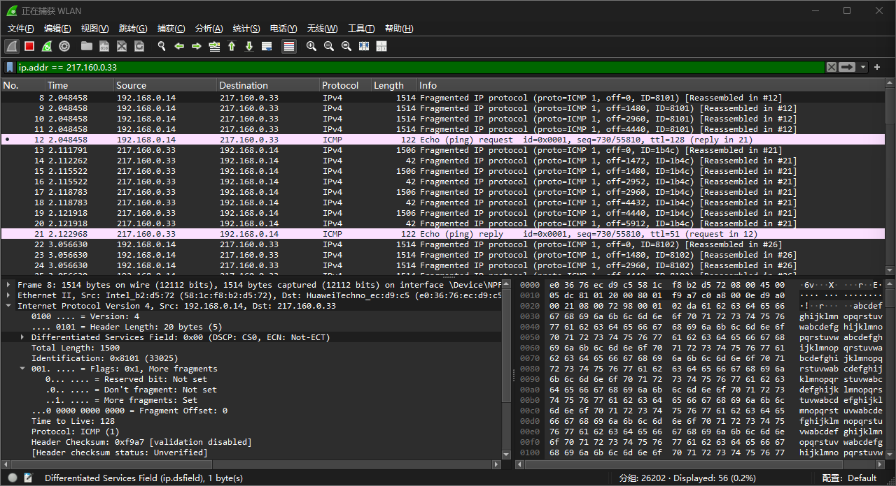

<head>
  
  
</head>

## [MainPage](../../../index.md)/[DataBase](../../README.md)/Lab 1

Университет ИТМО Факультет ФПИ и КТ

      
<h2>Отчёт по лабораторной работе 1</h2>
<h1>«Компьютерные сети»</h1>

          

Студент: Чжоу Хунсян

Группа: P33131

Преподаватель:

  

Санкт-Петербург 2024

 

---
 
## 1. Цель и краткая характеристика работы

Цель работы – изучить структуру протокольных блоков данных, анализируя реальный трафик на компьютере студента с помощью бесплатно распространяемой утилиты Wireshark.  
这项工作的目的是通过使用免费的 Wireshark 实用程序分析学生计算机上的真实流量来研究协议数据块的结构。

В процессе выполнения домашнего задания выполняются наблюдения за передаваемым трафиком с компьютера пользователя в Интернет и в обратном направлении. Применение специализированной утилиты Wireshark позволяет наблюдать структуру передаваемых кадров, пакетов и сегментов данных различных сетевых протоколов. При выполнении УИР рекомендуется выполнить анализ последовательности команд и определить назначение служебных данных, используемых для организации обмена данными в протоколах: ARP, DNS, FTP, HTTP, DHCP.  
在做作业时，会观察从用户计算机到互联网以及相反方向的传输流量。使用专用的 Wireshark 实用程序可以观察各种网络协议传输的帧、数据包和数据段的结构。执行 URI 时，建议分析命令序列并确定用于组织协议中数据交换的服务数据的用途：ARP、DNS、FTP、HTTP、DHCP。

## 2. URL(Zhou Hongxiang)

https://zhousfive.de/

(217.160.0.33)

## 3. Выполнение работ

### 4.1. Анализ трафика утилиты ping

1. **Имеет ли место фрагментация исходного пакета, какое поле на это указывает?**  
   Да, фрагментация исходного пакета имеет место. На втором скриншоте из Wireshark видно, что передаваемый ICMP-пакет разделён на несколько фрагментов. В Wireshark это отображено как "Fragmented IP protocol". Поля, указывающие на фрагментацию, включают:
   - Поле "Flags" в заголовке IP-пакета: Бит "More Fragments" (MF) установлен (значение равно 1), что указывает, что пакет был фрагментирован.
   - Поле "Fragment Offset": Указывает смещение текущего фрагмента относительно начала исходного пакета.
2. **Какая информация указывает, является ли фрагмент пакета последним или промежуточным?**  
   Информация, которая указывает, является ли фрагмент последним или промежуточным, находится в поле "Flags" в заголовке IP-пакета:
   - Если бит "More Fragments" (MF) установлен (равен 1), это означает, что это промежуточный фрагмент, и за ним последуют другие фрагменты.
   - Если бит MF сброшен (равен 0), это означает, что это последний фрагмент пакета.
3. **Чему равно количество фрагментов при передаче ping-пакетов?**  
   На скриншоте видно, что при передаче `ping -l 6000` пакет был разделён на 5 фрагментов. Wireshark показывает несколько IP-пакетов с одинаковым значением идентификатора (ID) и разным значением смещения фрагмента ("Fragment Offset").
4. **Построить график, в котором на оси абсцисс находится размер_пакета, а по оси ординат – количество фрагментов, на которое был разделён каждый ping-пакет.**  
   Размер пакета | количество фрагментов
   --------------|----------------------
   1000 | 1
   2000 | 2
   3000 | 3
   4000 | 3
   5000 | 4
   6000 | 5
   7000 | 5
   8000 | 6
   9000 | 7
   10000 | 7

5. Как изменить поле TTL с помощью утилиты ping?  
   Чтобы изменить значение TTL при использовании утилиты `ping`, используйте следующие команды:
   - В Windows: `ping -i [значение TTL] [адрес]`
   - В Linux/Unix: `ping -t [значение TTL] [адрес]`
6. **Что содержится в поле данных ping-пакета?**  
   Поле данных ping-пакета содержит дополнительные данные, отправленные вместе с ICMP-запросом. По умолчанию это могут быть псевдослучайные байты или повторяющийся шаблон данных. На втором скриншоте видно содержимое поля данных в шестнадцатеричном и текстовом представлении.

### 4.2. Анализ трафика утилиты tracert (traceroute)

1. Сколько байт содержится в заголовке IP? Сколько байт содержится в поле данных?  
   
     

   **IP Header Length**: 20 bytes  
   **Data Field**: 64 bytes
2. Как и почему изменяется поле TTL в следующих друг за другом ICMP-пакетах tracert? Для ответа на этот вопрос нужно проследить изменение TTL при передаче по маршруту, состоящему из более чем двух хопов.  
   Как изменить：
   1.	Начальное значение TTL: При запуске tracert, первый ICMP-пакет (или UDP-пакет в случае с traceroute на Unix) отправляется с TTL равным 1.
   2.	Увеличение TTL: В каждом последующем ICMP-пакете значение TTL увеличивается на 1. Таким образом, второй пакет будет иметь TTL равным 2, третий - 3, и так далее.
   3.	Продолжение увеличения: Это продолжается до тех пор, пока пакет не достигнет целевого хоста или не будет превышен максимальный TTL (обычно 30 по умолчанию).

   Цель поля TTL - предотвратить бесконечное зацикливание пакетов в сети. Каждый раз, когда он проходит через маршрутизатор, значение TTL уменьшается на 1. Когда значение TTL уменьшается до 0, маршрутизатор отбрасывает пакет и возвращает отправителю ICMP-сообщение «Время превышено».

     

3. Чем отличаются ICMP-пакеты, генерируемые утилитой tracert, от ICMP-пакетов, генерируемых утилитой ping (см. предыдущее задание).  

    

    
   
   - Утилита ping отправляет ICMP Echo Request пакеты на конкретный хост и ожидает ICMP Echo Reply.
   - Утилита tracert отправляет серию ICMP Echo Request пакетов с увеличивающимся TTL для отслеживания маршрута к удаленному хосту и в поле данных содержат нули

4. Чем отличаются полученные пакеты «ICMP reply» от «ICMP error» и зачем нужны оба этих типа ответов?  
   ICMP Echo Reply: Это стандартный ответ на ICMP Echo-запрос. Когда хост получает Echo-запрос (например, от команды Ping), он отвечает Echo-ответом, указывая, что он доступен.  

   ICMP Error (Time Exceeded): Этот пакет генерируется маршрутизатором, когда TTL пакета достигает 0. Он сообщает отправителю, что пакет был уничтожен из-за превышения времени жизни. Tracert использует эти пакеты для определения промежуточных маршрутизаторов.  

   Зачем нужны оба: Echo Reply используется для подтверждения доступности узла. Time Exceeded пакеты нужны для диагностики сети, они позволяют узнать о промежуточных маршрутизаторах на пути к целевому хосту.
5. Что изменится в работе tracert, если убрать ключ «-d»? Какой дополнительный трафик при этом будет генерироваться?  
   Если убрать ключ -d: Tracert попытается выполнить обратное разрешение IP-адресов в DNS-имена (то есть преобразовать IP-адреса маршрутизаторов на пути в имена хостов).  

   Дополнительный трафик: При этом генерируются дополнительные DNS-запросы для каждого IP-адреса, который tracert обнаруживает на пути к конечной точке. Это приводит к небольшому увеличению времени выполнения команды и дополнительной нагрузке на DNS-сервер.

### 4.3. Анализ HTTP-трафика

Потому что сайт у варианта не пользует HTTP, поэтому мы здесь используем другой сайт: http://www.moe.gov.cn/

 

 

Для этого в поле с детальной информацией о пакете нужно развернуть строку «HTTP». Затем необходимо обновить страницу в браузере так, чтобы вместо «HTTP GET» был сгенерирован «HTTP CONDITIONAL GET» (так называемый «условный GET»). Условные запросы GET содержат поля If- Modified-Since, If-Match, If-Range и подобные, которые позволяют при повторном запросе не передавать редко изменяемые данные. В ответ на условный GET тело запрашиваемого ресурса передается только в том случае, если этот ресурс изменялся после даты «If-Modified-Since». Если ресурс не изменялся, сервер вернет код статуса «304 Not Modified».  
为此，在包含有关包的详细信息的字段中，您需要展开“HTTP”行。然后你需要刷新浏览器中的页面，以便生成“HTTP CONDITIONAL GET”（即所谓的“条件GET”），而不是“HTTP GET”。条件 GET 请求包含 If-Modified-Since、If-Match、If-Range 和类似字段，这使您可以避免在重复请求期间传输很少更改的数据。为了响应条件 GET，仅当该资源自“If-Modified-Since”日期以来已被修改时，才会传输所请求资源的正文。如果资源未被修改，服务器将返回“304 Not Modified”状态码。

По результатам анализа собранной трассы покажите, каким образом протокол HTTP передавал содержимое страницы при первичном посещении страницы и при вторичном запросе-обновлении от браузера (т.е. при различных видах GET-запросов).  
根据收集的跟踪分析结果，显示 HTTP 协议在初次访问页面期间以及浏览器的二次更新请求期间（即使用各种类型的 GET 请求）如何传输页面内容。

### 4.4. Анализ DNS-трафика

Необходимо отследить и проанализировать трафик протокола DNS, сгенерированный в результате выполнения следующих действий:  
您应该监控和分析由以下操作生成的 DNS 协议流量：

- настроить Wireshark-фильтр: «ip.addr == ваш_IP_адрес»;  
  配置 Wireshark 过滤器：“ip.addr == your_IP_address”；
- очистить кэш DNS с помощью команды ipconfig в командной строке: ipconfig/flushdns  
  在命令行上使用 ipconfig 命令刷新 DNS 缓存：ipconfig/flushdns
- очистить кэш браузера;  
  清除浏览器缓存；
- зайти на Интернет-сайт, заданный по варианту.  
  转至选项指定的 Internet 站点。

 

 

 

По результатам анализа собранной трассы, ответьте на следующие вопросы.  
根据收集的路线分析结果，回答以下问题。

1. Почему адрес, на который отправлен DNS-запрос, не совпадает с адресом посещаемого сайта?  
   为什么DNS请求发送的地址与访问站点的地址不匹配？
2. Какие бывают типы DNS-запросов?  
   DNS查询有哪些类型？
3. В какой ситуации нужно выполнять независимые DNS-запросы для получения содержащихся на сайте изображений?  
   在什么情况下您应该执行独立的 DNS 查询来检索站点上包含的图像？

### 4.5. Анализ ARP-трафика

Необходимо отследить и проанализировать трафик протокола ARP, сгенерированный в результате выполнения следующих действий:  
您应该监控和分析由以下操作生成的 ARP 流量：

- очистить ARP-таблицу командой «netsh interface ip delete arpcache» (проверить очистилась ли таблица можно с помощью команды команды «arp -a», выводящей таблицу на экран);  
  使用“netsh interface ip delete arpcache”命令清除ARP表（您可以使用“arp -a”命令检查该表是否已被清除，该命令会在屏幕上显示该表）；
- очистить кэш браузера;  
  清除浏览器缓存；
- зайти на Интернет-сайт, заданный по варианту.  
  转至选项指定的 Internet 站点。

По результатам анализа собранной трассы, ответьте на следующие вопросы.  
根据收集的路线分析结果，回答以下问题。

1. Какие МАС-адреса присутствуют в захваченных пакетах ARP-протокола? Что означают эти адреса? Какие устройства они идентифицируют?  
   捕获的ARP数据包中存在哪些MAC地址？这些地址是什么意思？他们识别什么设备？
2. Какие МАС-адреса присутствуют в захваченных HTTP-пакетах и что означают эти адреса? Что означают эти адреса? Какие устройства они идентифицируют?  
   捕获的HTTP数据包中存在哪些MAC地址以及这些地址的含义是什么？这些地址是什么意思？他们识别什么设备？
3. Для чего ARP-запрос содержит IP-адрес источника?  
   为什么ARP请求中会包含源IP地址？

### 4.6. Анализ трафика утилиты nslookup

Необходимо отследить и проанализировать трафик протокола DNS, сгенерированный в результате выполнения следующих действий:  
您应该监控和分析由以下操作生成的 DNS 协议流量：

1. Настроить Wireshark-фильтр: «ip.addr == ваш_IP_адрес».  
   设置 Wireshark 过滤器：“ip.addr == your_IP_address”。
2. Запустить в командной строке команду «nslookup адрес_сайта_по_варианту».  
   在命令行上运行命令“nslookup site_address_by_option”。
3. Дождаться отправки трёх DNS-запросов и трёх DNS-ответов (в работе нужно использовать только последние из них, т.к. первые два набора запросов/ответов специфичны для nslookup и не генерируются другими сетевыми приложениями).  
   等待发送三个 DNS 请求和三个 DNS 响应（在您的工作中，您只需要使用其中最后一个，因为前两组请求/响应是特定于 nslookup 的，不是由其他网络应用程序生成的） 。
4. Повторить предыдущие два шага, используя команду: «nslookup -type=NS имя_сайта_по_варианту».  
   使用命令“nslookup -type=NS site_name_by_option”重复前两个步骤。

По результатам анализа собранной трассы, ответьте на следующие вопросы.  
根据收集的路线分析结果，回答以下问题。

1. Чем различается трасса трафика в п.2 и п.4, указанных выше?  
   上述第2段和第4段的交通路线有什么区别？
2. Что содержится в поле «Answers» DNS-ответа?  
   DNS响应的“Anwers”字段包含什么？
3. Каковы имена серверов, возвращающих авторитативный (authoritative) отклик?  
   返回权威响应的服务器名称是什么？
