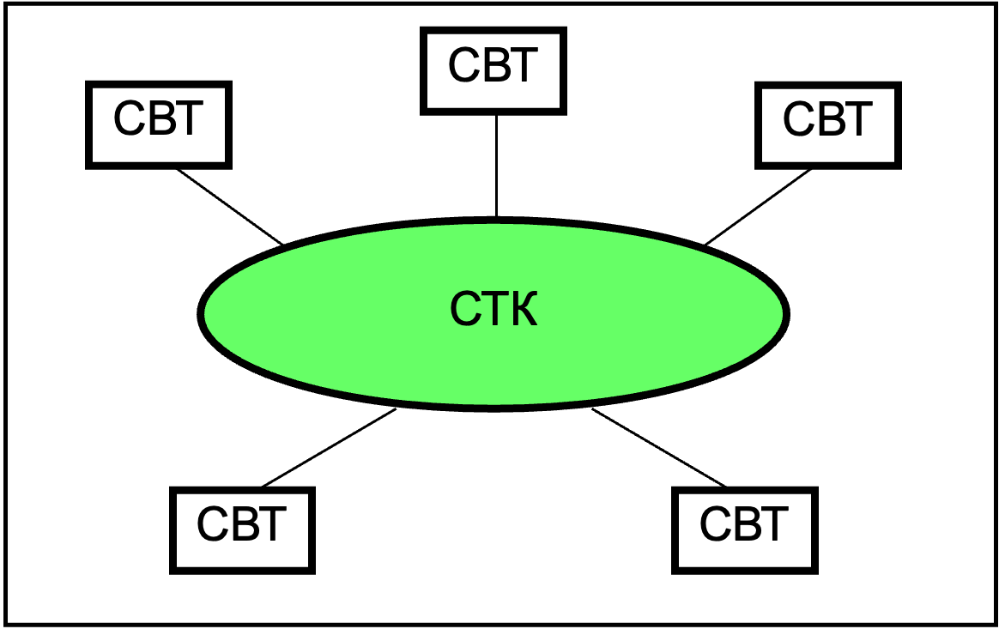
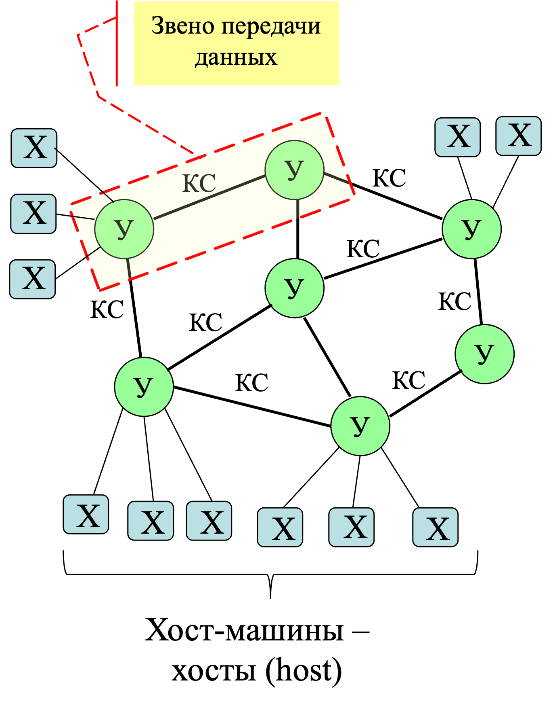
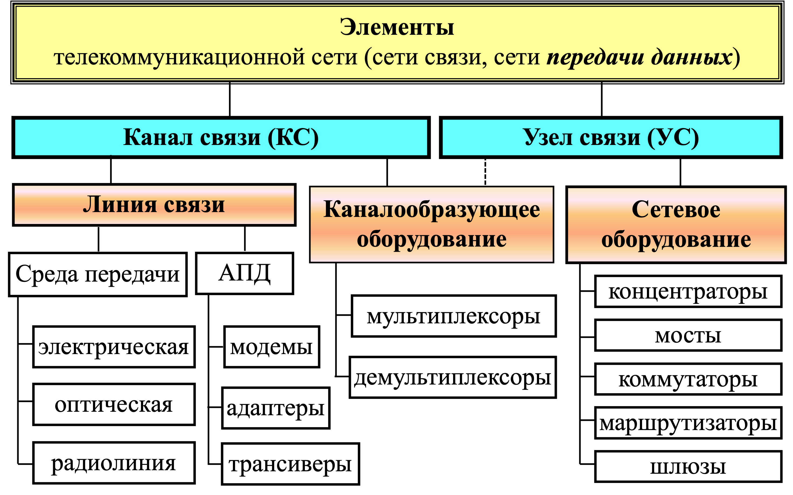
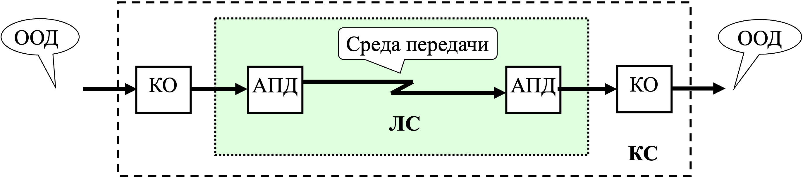
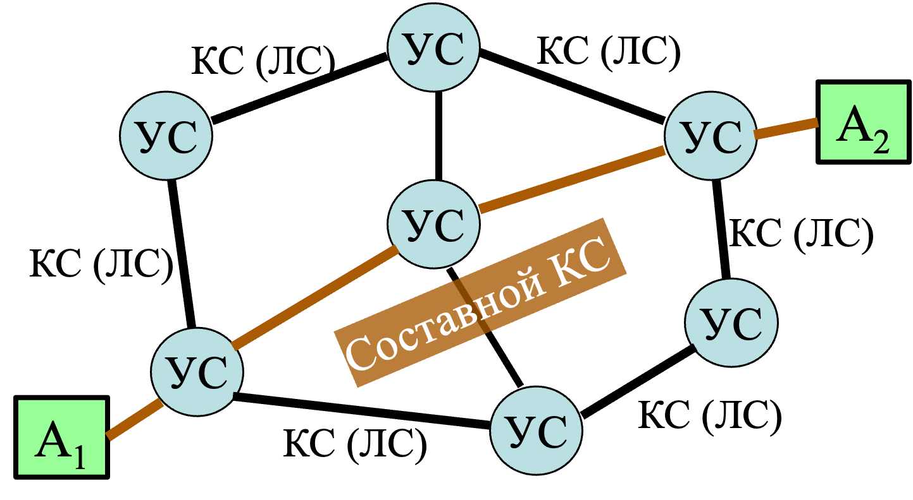
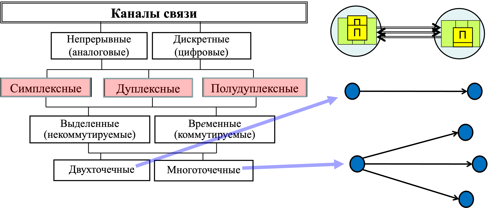
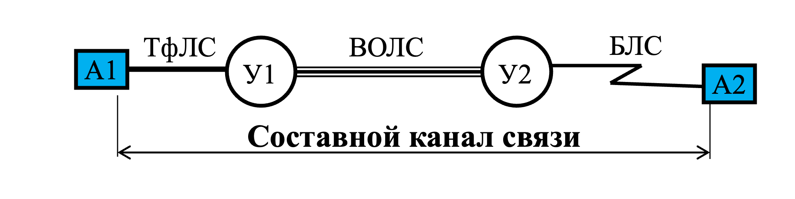
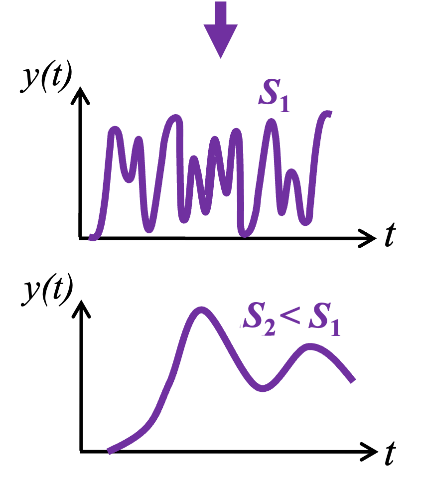
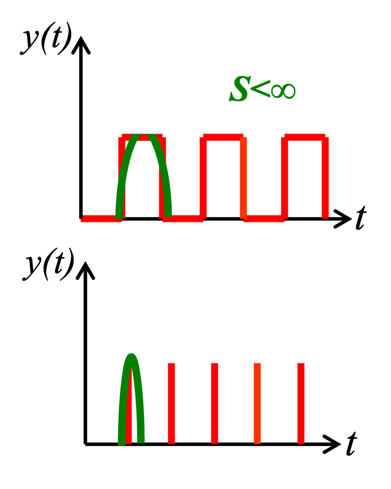
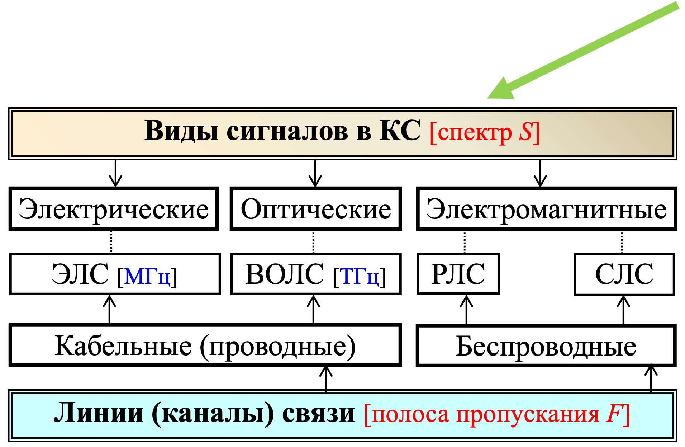

## [MainPage](../../index.md)/[Computer NetWork](../README.md)/Lecture Chapter1

# Раздел 1. Принципы организации компьютерных сетей

## 1.1. Основные понятия и терминология

### Понятие компьютерной сети

Компьютерная сеть (сеть ЭВМ, вычислительная сеть)  
: совокупность средств ВТ и телекоммуникаций:  СВТ+СТК.

Средства телекоммуникаций (СТК)  
: взаимосвязанная совокупность каналов связи и каналообразующей аппаратуры, образующих телекоммуникационную сеть или сеть передачи данных (СПД)  (передача данных).

Функции компьютерной сети
: обработка и передача(данных или информации?)



Данные  
: "сведения, необходимые для какого-нибудь вывода, решения" (Ожегов С.И. Словарь русского языка). Количественная мера данных – объем.

Информация  
: "сведения, осведомляющие о положении дел, о состоянии чего-нибудь" (Ожегов С.И. Словарь русского языка). Количественная мера информации – информационная энтропия. 

$$H=-\sum_{i=1}^np_i\log_2p_i$$

Информационная энтропия  
: мера неопределённости, определяемая через вероятность 𝑝_𝑖 появления i-го символа некоторого алфавита или i-го сообщения:

| n | p1   | p2   | p3   | p4   | H    |
|---|------|------|------|------|------|
| 2 | 0,5  | 0,5  | -    | -    | 1    |
| 2 | 0,1  | 0,9  | -    | -    | 0,47 |
| 4 | 0,25 | 0,25 | 0,25 | 0,25 | 2    |
| 4 | 0,1  | 0,2  | 0,3  | 0,4  | 1,85 |
| 4 | 0,01 | 0,04 | 0,3  | 0,65 | 1, 2 |

```text
  +--------+
  | Данные |
  +--------+
      |
      V
 +-----------+
 | Обработка |
 +-----------+
      |
      V
+------------+
| Информация |
+------------+
```

### Элементы компьютерной сети



Узлы компьютерной сети (У)
- Узлы связи (У): коммутации, маршрутизации, передачи данных 
- Узлы (центры) обработки данных – хосты (Х):
компьютеры, вычислительные машины, комплексы и системы

Структура (формат) сообщения:

```text
+-----------+------------------------------+----------+
| Заголовок |            Данные            | Концевик |
+-----------+------------------------------+----------+ 
```

### Средства вычислительной техники

ЭВМ (электронная вычислительная машина, компьютер) = совокупность технических средств, реализующих ввод, вывод, хранение и обработку данных (информации) [MIPS, FLOPS]

Вычислительный комплекс (ВК) = совокупность технических средств, содержащая несколько центральных процессоров:
- многопроцессорный ВК (МПВК);
- многомашинный ВК (ММВК).

Основная цель построения ВК – обеспечение высокой надежности и/или производительности.

Вычислительная система (ВС)  = технические + программные средства [задач/с, …]

### Средства телекоммуникаций





АПД – аппаратура передачи данных (приемопередатчики – трансиверы)
КО – каналообразующее оборудование (мультиплексоры и демультиплексоры)
ООД – оконечное оборудование данных (компьютеры, узлы связи – маршрутизаторы, коммутаторы)



Основные функции УС
- маршрутизация
- коммутация
- мультиплексирование
- демультиплексирование

Топология телекоммуникационной сети – способ объединения УС с помощью  КС (ЛС).

### Классификация каналов связи



Каналы связи
- Непрерывные (аналоговые)
- Дискретные (цифровые)

- Симплексные
- Дуплексные
- Полудуплексные

- Выделенные (некоммутируемые)
- Временные (коммутируемые)

- Двухточечные
- Многоточечные



### Данные и сигналы

Данные / информация -> Сигналы
- непрерывные
  
  

- дискретные

  

Виды сигналов в КС 



- Электрические
- Оптические
- Электромагнитные

Кодирование  
: представление дискретных данных в виде дискретных сигналов:  потенциальных и импульсных.

Модуляция  
: перенос сигнала в заданную полосу частот путем изменения параметров сигнала (амплитуды, частоты, фазы) в соответствии с информативным сигналом. 

### Характеристики каналов связи 

1. Полоса пропускания (частот) [Гц]: 

   $$F=1/T$$  

   где  $Т$ – период синусоидального сигнала;

2. Скорость модуляции [бод]:
   
   $$B=2F=\frac{2}{T}=\frac{1}{t_b}$$

   где $t_b$ – длина единичного (битового) интервала:

3. Пропускная способность канала связи:
   
   $$C=1/t_b\ [бит/с\ или\ bps\ –\ bits\ per\ second] $$

   1. формула Шеннона:

      $$C=F\log_2(1+\frac{P_с}{P_ш})\qquad\frac{P_с}{P_ш}\ -\ SNR(Signal-to-Noise Ratio)$$ 

      Пример:  
      
      $$F=100\ Мгц,\ \frac{P_с}{P_ш}=1 \rightarrow C=100 Мбит/с;$$  

      $$F=100\ Мгц,\ \frac{P_с}{P_ш}=3 \rightarrow C=200 Мбит/с;$$ 

   2. формула Найквиста:
      
      $$C=\frac{1}{t}\log_2n_c=2F\log_2n_c=B\log_2n_c$$

      Пример: 

      $$n_c=2 \rightarrow C=200\ Мбит/с;$$


## 1.2. Многоуровневая организация компьютерных сетей
## 1.3. Структурная  организация компьютерных сетей
## 1.4. Функциональная  организация компьютерных сетей
## 1.5. Сетевые  протоколы


