## [MainPage](../../index.md)/[Computer NetWork](../README.md)/Textbook

# Раздел 1. ОБЩИЕ ПРИНЦИПЫ ОРГАНИЗАЦИИ СЕТЕЙ ЭВМ

## 1.1. Основные понятия и терминология

### 1.1.1. Понятие сети ЭВМ

Сеть ЭВМ (рис.1.1) - совокупность средств вычислительной техники (СВТ), представляющих собой множество ЭВМ, объединённых с помощью средств телекоммуникаций (СТК). Сеть ЭВМ реализует две основные функции:  
计算机网络（图1.1）是计算机技术 (СВТ)的集合，是利用电信(СТК)联合起来的一组计算机。计算机网络实现两个主要功能：

- обработку данных;  
  数据处理；
- передачу данных.  
  数据传输。

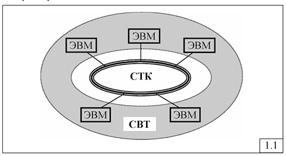

Наряду с термином «сеть ЭВМ» широко используются близкие по смыслу термины «компьютерная сеть» и «вычислительная сеть», которые обычно рассматриваются как синонимы. Однако некоторые незначительные различия между указанными терминами мы будем иметь в виду при дальнейшем изложении материала.  
与“计算机网络”一词一起，密切相关的术语“计算机网络”和“计算机网络”通常被视为同义词，被广泛使用。然而，在进一步介绍材料时，我们将记住这些术语之间的一些细微差别。

Из данного выше определения (рис.1.1) следует, что «сеть ЭВМ» представляет собой множество ЭВМ (компьютеров), объединённых в единую сеть с помощью средств телекоммуникаций, образующих базовую сеть передачи данных (СПД). Другими словами, «сеть ЭВМ» или «компьютерная сеть» - это объединение ЭВМ (компьютеров), в отличие, например, от телефонной сети, объединяющей автоматические телефонные станции (АТС). Поэтому эти два термина будем рассматривать и использовать ниже как эквивалентные. Термин же «вычислительная сеть» скорее характеризует назначение сети - выполнение вычислений, что отличает её, например, от «информационной сети», предоставляющей информационные услуги, или от «телекоммуникационной сети», предназначенной для передачи данных.  
从上面给出的定义（图1.1）可以看出，“计算机网络”是一组使用电信技术联合成单一网络的计算机（计算机），形成基本数据传输网络（DTN）。换句话说，“计算机网络”或“计算机网络”是计算机（计算机）的联合体，与例如联合自动电话交换机（PBX）的电话网络相反。因此，这两个术语将被认为是等同的并且在下面使用。术语“计算机网络”更确切地描述了网络的目的——执行计算，这将其与提供信息服务的“信息网络”或用于数据传输的“电信网络”区分开来。

Отдельные сети ЭВМ могут объединяться между собой, образуя большие компьютерные сети, которые в свою очередь могут объединяться и образовывать сверхбольшие глобальные сети. Такое объединение сетей приводит к иерархической структуре, в которой небольшие сети являются подсетями сетей более высокого ранга.  
单独的计算机网络可以相互组合，形成大型计算机网络，而大型计算机网络又可以组合形成超大型全球网络。这种网络聚合产生了分层结构，其中较小的网络是较高级别网络的子网。

Итак, сеть ЭВМ реализует передачу и обработку данных. Однако часто можно услышать или прочитать, что в сети передаётся и обрабатывается информация. Так что же на самом деле передаётся и обрабатывается в сети: данные или информация? Для ответа на этот вопрос необходимо определить понятия «данные» и «информация».  
这样，计算机网络就实现了数据的传输和处理。然而，您经常可以听到或读到信息是在网络上传输和处理的。那么网络上实际传输和处理的是什么：数据还是信息？要回答这个问题，需要先定义“数据”和“信息”的概念。

Существуют различные подходы к определению понятий «данные» и «информация» в разных областях человеческой деятельности: в биологии, в кибернетике, в философии и т.д. Создана даже специальная научная дисциплина «Теория информации».  
在人类活动的不同领域（生物学、控制论、哲学等），有不同的方法来定义“数据”和“信息”的概念。甚至还创建了专门的科学学科“信息论”。

Среди всех существующих определений понятий «данные» и «информация» воспользуемся общепринятыми традиционными определениями, для чего обратимся к «Словарю русского языка» С.И.Ожегова, и попытаемся сформулировать разницу между этими двумя терминами.  
在“数据”和“信息”概念的所有现有定义中，我们将使用普遍接受的传统定义，为此我们求助于S.I. Ozhegov的《俄语词典》，并尝试阐明这两个术语之间的区别。

### 1.1.2. Данные и информация

Данные 数据  
: сведения, необходимые для какого-нибудь вывода, решения.  
某些结论、决定所必需的信息。

Информация  
: сведения, осведомляющие о положении дел, о состоянии чего-нибудь». (Ожегов С.И. Словарь русского языка).  
有关事态、某物状态的信息。” （Ozhegov S.I. 俄语词典）。

Из этих определений следует, что данные - это любое множество сведений, а информация - это сведения, полученные с некоторой целью и несущие в себе новые знания для того, кто эту информацию получает.  
从这些定义可以看出，数据是任何信息集，而信息是为了某种目的而接收的信息，并且为接收该信息的人携带新的知识。

Например, телефонная книга Foдepжит данные в виде множества телефонных номеров различных организаций. Извлекая же номер некоторой конкретной организации, в которую мы хотим позвонить, мы получаем информацию в виде телефонного номера (или нескольких телефонных номеров) этой организации. По этой же причине мы говорим «база данных» (а не «база информации»), но, формируя запрос к базе данных, мы получаем информацию в виде сведений, представляющих для нас определённый интерес.  
例如，电话簿包含各种组织的许多电话号码形式的数据。通过检索我们想要呼叫的特定组织的号码，我们获得该组织的电话号码（或多个电话号码）形式的信息。出于同样的原因，我们说“数据库”（而不是“信息库”），但是当我们创建对数据库的查询时，我们会收到我们特别感兴趣的信息形式的信息。

«Информация» - понятие субъективное. Сведения, которые являются информацией для одного человека, могут не быть информацией для другого. Например, сведения типа «Париж - столица Франции, а Лондон - столица Англии» являются информацией для школьника, который впервые узнал об этом, и не являются информацией (чем-то новым и ранее не известным) для взрослого человека.  
“信息”是一个主观概念。对于一个人来说是信息的信息对于另一个人来说可能不是信息。例如，诸如“巴黎是法国首都，伦敦是英国首都”之类的信息是针对首次了解此信息的学童的信息，而不是针对成年人的信息（新的和以前未知的信息）。

Следует также иметь в виду, что количественной мерой данных является объём - количество единиц данных, измеренных в байтах, словах, страницах, количестве телефонных номеров в телефонной книге и т.п. В то же время, количественной мерой информации является энтропия - мера неопределенности информации. Чем больше энтропия, тем более ценной является информация.  
还应该记住，数据的定量度量是容量——以字节、字、页、电话簿中的电话号码数量等度量的数据单元的数量。同时，信息的定量度量是熵——信息不确定性的度量。熵越高，信息就越有价值。

Таким образом, можно сказать, что в компьютерной сети передаются и данные, и информация.  
因此，我们可以说数据和信息都是在计算机网络上传输的。

Взаимосвязь понятий «данные» и «информация» в рассматриваемом контексте иллюстрируется рис.1.2, показывающим, что информация извлекается из множества данных в результате некоторых манипуляций (обработки данных).  
在所考虑的上下文中，“数据”和“信息”概念之间的关系如图 1.2 所示，该图显示信息是通过某些操作（数据处理）从一组数据中提取的。

### 1.1.3. Средства вычислительной техники

Средства вычислительной техники (СВТ) реализуют обработку данных и представляют собой совокупность ЭВМ, вычислительных комплексов и вычислительных систем различных классов.  
计算机技术（СВТ）实现数据处理，是计算机、计算机综合体和各类计算机系统的集合。

Определим смысловое значение каждого из упомянутых терминов - «ЭВМ», «вычислительный комплекс», «вычислительная система» - и покажем существующую между ними разницу.  
让我们定义每个提到的术语的语义含义——“计算机”、“计算复杂”、“计算系统”——并展示它们之间的区别。

**ЭВМ (электронная вычислительная машина, компьютер) - совокупность технических средств, предназначенных для организации ввода, хранения, автоматической обработки по заданной программе и вывода данных (информации).**  
**COMPUTER（电子计算机、计算机）- 按照给定程序组织数据（信息）的输入、存储、自动处理和输出的一套技术手段。**  
К техническим средствам относятся (рис.1.3):  
技术手段包括（图1.3）：  
- центральный процессор (ЦП);  
  中央处理器（CPU）；  
- оперативная (основная) память (ОП);  
  操作（主）内存（RAM）；   
- внешние устройства (ВУ), включающие устройства ввода-вывода (УВВ) и внешние запоминающие устройства (ВЗУ);  
  外部设备（ED），包括输入/​​输出设备（I/O）和外部存储设备（ESD）；   
- процессоры (каналы) ввода-вывода (ПВВ, КВВ).  
  输入输出处理器（通道）（PVV、KVV）   

**Вычислительный комплекс (ВК)  - совокупность технических средств, содержащая несколько центральных процессоров и представляющая собой одну ЭВМ с несколькими ЦП (МПВК -многопроцессорный ВК) или объединение нескольких однопроцессорных ЭВМ (ММВК -многомашинный ВК) (рис. 1.4).**  
**计算综合体（VC）- 包含多个中央处理器的一组技术手段，代表一台具有多个CPU的计算机（MPVC - 多处理器VC）或多个单处理器计算机的组合（MMVC - 多机VC）（图1.4）。**

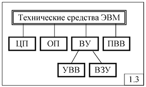

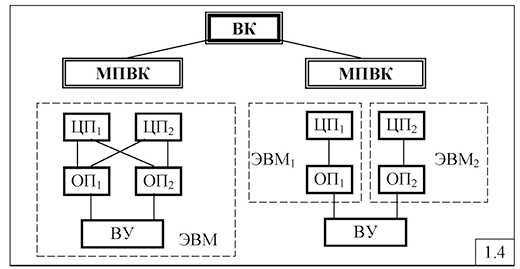

Основной целью построения ВК является обеспечение высокой надежности и/или производительности, не достижимой для однопроцессорных ЭВМ.  
构建计算机的主要目标是确保高可靠性和/或性能，这是单处理器计算机无法实现的。

**Вычислительная система (ВС) - совокупность технических и программных средств, ориентированных на решение определенной совокупности задач.**  
**计算机系统（CS）是一组旨在解决一组特定问题的硬件和软件工具。**

К программным средствам относятся (рис.1.5):  
软件工具包括（图1.5）：

- системное программное обеспечение, представляющее собой совокупность стандартных программных средств, обеспечивающих функционирование ВС и включающих операционную систему (ОС), основными составляющими которой для организации эффективного функционирования ВС, являются управляющие программы (УП), а также трансляторы с алгоритмических языков и библиотеки математических и служебных программ;  
  系统软件，这是一组确保飞机功能的标准软件，包括操作系统（OS），其主要组成部分是控制程序（CP），以组织飞机的有效功能算法语言以及数学和服务程序库的翻译人员；
- прикладное программное обеспечение в виде множества прикладных программ (ПП), обеспечивающих ориентацию ВС на решение задач конкретной области применения.  
  多种应用程序（AP）形式的应用软件，确保飞机能够解决特定应用领域的问题。

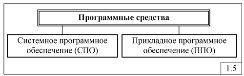

Понятие «вычислительная система» в рассматриваемом контексте полностью согласуется с понятием «система», сформулированным в общей теории систем, в соответствии с которым система должна обладать структурной и функциональной организацией, а также фундаментальными свойствами: целостностью, связностью, организованностью и интегративностью. Последнее означает, что система обладает свойствами (функциями), которые не присущи ни одному из элементов, входящих в состав системы.  
所考虑的上下文中的“计算系统”概念与一般系统理论中提出的“系统”概念完全一致，根据该概念，系统必须具有结构和功能组织，以及基本属性：完整性、连贯性、组织性和综合性。后者意味着系统具有组成系统的任何元素所固有的属性（功能）。

Именно программные средства обеспечивают функциональную организацию ВС, реализуемую управляющими программами операционной системы и прикладными программами. Свойство интегративности в значительной степени обеспечивается прикладными программами. Действительно, элементы (устройства) ЭВМ обеспечивают функции обработки данных (ЦП), хранения данных (ОП, ВЗУ), ввода и вывода данных (УВВ). В то же время вычислительная система с соответствующим программным обеспечением может выполнять функции перевода с одного языка на другой, играть в шахматы и другие игры, воспроизводить звук, фото- и видеоизображения и т.д., то есть ВС обладает функциями, не присущими отдельным устройствам ЭВМ.  
它是提供飞行器功能组织的软件，由操作系统控制程序和应用程序实现。可积性在很大程度上是由应用程序来保证的。事实上，计算机元件（设备）提供数据处理（CPU）、数据存储（OP、VZU）、数据输入和输出（DVA）的功能。同时，配备适当软件的计算机系统可以执行从一种语言到另一种语言的翻译功能、下棋等游戏、再现声音、照片和视频等，即计算机具有个人所不具备的功能。设备 计算机。

Таким образом, многопроцессорный (многомашинный) ВК, рассматриваемый в совокупности с программным обеспечением, можно называть многопроцессорной (многомашинной) вычислительной системой - МПВС (ММВС), а суперЭВМ с программным обеспечением - высокопроизводительной ВС (ВПВС).  
因此，多处理器（多机）计算机，与软件结合起来考虑，可以称为多处理器（多机）计算系统——MPCS（MMCS），与软件结合的超级计算机——高性能计算机系统（HPCS）。

Ещё одной отличительной особенностью ЭВМ от ВС является единица измерения производительности. Производительность ЭВМ измеряется в MIPS (миллион инструкций, команд или операций в секунду) или в FLOPS (операций с плавающей точкой в секунду - для суперЭВМ), а производительность ВС - в количестве задач, выполняемых системой за единицу времени, называемой системной производительностью.  
计算机区别于计算机的另一个显着特征是生产力的计量单位。计算机性能以 MIPS（每秒百万条指令、命令或操作）或 FLOPS（每秒浮点运算 - 对于超级计算机）来衡量，计算机性能以系统每单位时间执行的任务数来衡量，称为系统表现。

Очевидно, что системная производительность зависит как от параметров технических средств ВС, так и от параметров программных средств, в частности, прикладных программ. Ясно, что количество «коротких» задач, выполняемых системой за единицу времени в ВС, всегда будет больше, чем «длинных» задач.  
显然，系统性能既取决于飞行器硬件参数，也取决于软件参数，特别是应用程序参数。显然，计算机系统中单位时间内系统执行的“短”任务的数量总是大于“长”任务的数量。

На системном уровне в качестве основной единицы работы ВС рассматривается задача, представляющая совокупность определенной прикладной программы с определенным набором данных (рис. 1.6).  
在系统层面，代表一组特定应用程序和一组特定数据的任务被视为计算机的主要工作单元（图1.6）。

Причиной инициализации задачи может быть задание (команда, запрос, транзакция).  
任务初始化的原因可以是一个任务（命令、请求、事务）。

Выполнение задач в ВС называется вычислительным процессом.  
在计算机中执行任务称为计算过程。

Определенный порядок (последовательность) прохождения задач через систему, то есть управление вычислительным процессом, осуществляется управляющими программами ОС.  
任务通过系统的一定顺序（序列），即计算过程的控制，是由操作系统控制程序执行的。

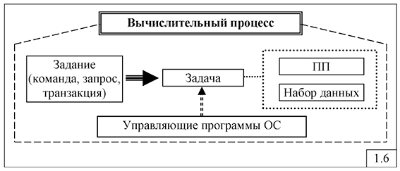

К программным средствам ВС тесно примыкают базы данных и системы управления базами данных, которые можно рассматривать как самостоятельную составляющую ВС - информационное обеспечение (рис.1.7).  
与计算机软件密切相关的是数据库和数据库管理系统，可以认为它们是计算机的一个独立组成部分——信息支撑（图1.7）。

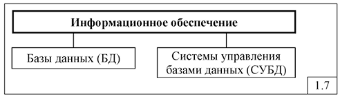

База данных (БД) - упорядоченные наборы данных (файлы), имеющие определенную структуру.  
数据库 (DB) - 具有特定结构的有序数据集（文件）。

Системы управления базами данных (СУБД) - специальные программные средства, предназначенные для формирования, модификации и выборки данных.  
数据库管理系统（DBMS）是专门为生成、修改和检索数据而设计的软件。

Часто термин "вычислительная система" используется в качестве обобщенного понятия. При этом предполагается, что ВС может быть построена на базе однопроцессорной ЭВМ, многомашинного или многопроцессорного вычислительного комплекса, а компьютерная сеть, представляющая собой объединение нескольких ВС, может рассматриваться как система более высокого уровня.  
通常，术语“计算系统”被用作一般概念。假设计算机系统可以建立在单处理器计算机、多机或多处理器计算系统的基础上，而计算机网络是若干计算机系统的组合，可以认为是一个更高层的计算机网络。等级系统。

Компьютерная сеть кроме функций ввода, хранения, обработки и вывода данных реализует функции по передаче данных на значительные расстояния между абонентами сети, в качестве которых выступают ВС и пользователи сети, имеющие доступ к ресурсам сети с помощью удаленных терминалов.  
除了数据的输入、存储、处理和输出功能之外，计算机网络还实现在网络用户之间长距离传输数据的功能，网络用户是可以使用远程终端访问网络资源的飞机和网络用户。

### 1.1.4. Средства телекоммуникаций

Средства телекоммуникаций (СТК) реализуют передачу данных и образуют телекоммуникационную сеть (сеть связи, сеть передачи данных), состоящую из узлов связи (УС), объединенных каналами связи (КС) для передачи данных (рис.1.8).  
电信设施(СТК)实现数据传输，形成电信网络（通信网络、数据传输网络），由通信节点(УС)组成，通过通信通道 (КС) 联合起来进行数据传输（图1.8）。

Способ объединения УС и КС определяет топологию (конфигурацию) телекоммуникационной сети.  
УС和КС的组合方法决定了电信网络的拓扑（配置）。

Канал связи (КС) включает в себя линию связи (ЛС) и каналообразующее оборудование.  
通信信道(КС)包括通信线路(ЛС)和信道形成设备。

Линия связи (ЛС) представляет собой физическую среду передачи, по которой передаются сигналы, вместе с аппаратурой передачи данных (АПД), формирующей сигналы, соответствующие типу ЛС (рис. 1.9).  
通信线路（ЛС）是一种物理传输介质，通过它与数据传输设备（АПД）一起传输信号，数据传输设备生成与 LAN 类型相对应的信号（图 1.9）。

Аппаратура передачи данных (АПД) осуществляет преобразование сигналов в соответствии с типом среды передачи (линии связи). К АПД относятся различного типа модемы (модуляторы-демодуляторы), используемые в телефонных и высокочастотных КС: телефонные, кабельные, радиомодемы, xDSL-модемы, адаптеры и т.д.  
数据传输设备（АПД）根据传输介质（通信线路）的类型转换信号。 АПД 包括电话和高频 КС 中使用的各种类型的调制解调器（调制器-解调器）：电话、电缆、无线电调制解调器、xDSL 调制解调器、适配器等。

Каналообразующее оборудование (КО) предназначено для формирования канала передачи данных между двумя взаимодействующи­ ми абонентами, при этом в одной и той же линии связи одновременно может быть сформировано несколько каналов за счет использования различных методов уплотнения.  
通道形成设备（КО）旨在在两个交互的用户之间形成数据传输通道，同时通过使用各种压缩方法可以在同一条通信线路上同时形成多个通道。

Технология уплотнения и формирования многоканальных систем передачи данных в компьютерных сетях называется мультиплексирова­ нием и реализуется мультиплексорами и демультиплексорами. Обычно каналообразующее оборудование входит в состав узлов телекоммуникационной сети.  
计算机网络中多路数据传输系统的压缩和形成技术称为复用，由复用器和解复用器实现。通常，信道形成设备是电信网络节点的一部分。

Основными функциями узлов связи являются:  
通信节点的主要功能是：

- маршрутизация, заключающаяся в выборе направления передачи (маршрута) данных;   
  路由，包括选择数据传输的方向（路由）；
- коммутация, заключающаяся в установлении физического или логического соединения между входными и выходными портами узла;  
  交换，包括在节点的输入和输出端口之间建立物理或逻辑连接；
- мультиплексирование, заключающееся в объединении нескольких входящих в узел потоков данных в один выходящий из узла поток;  
  多路复用，包括将进入节点的多个数据流组合成离开该节点的一个数据流；
- демультиплексирование, заключающееся в разделении одного входящего в узел потока данных на несколько выходящих из узла потоков.  
  解复用，包括将进入节点的一个数据流分成离开该节点的多个数据流。

В качестве узлов связи в вычислительных сетях используются специализированные сетевые устройства: концентраторы, мосты, коммутаторы, маршрутизаторы и шлюзы.  
专用网络设备用作计算机网络中的通信节点：集线器、网桥、交换机、路由器和网关。

В качестве оконечного оборудования данных (ООД) (рис.1.9) могут выступать компьютеры и сетевое оборудование (мосты, коммутаторы, маршрутизаторы), находящееся в узлах сети.  
位于网络节点的计算机和网络设备（网桥、交换机、路由器）可以充当数据终端设备（DTE）（图1.9）。

Состав ЭВМ, вычислительного комплекса, системы и сети, а также взаимосвязь между рассмотренными понятиями иллюстрируется рис.1.10.  
计算机、计算机复合体、系统和网络的组成以及所考虑的概念之间的关系如图 1.10 所示。

### 1.1.5. Понятия архитектуры и технологии компьютерной сети

В широком смысле под архитектурой компьютерной сети будем понимать множество технических и инженерных решений по структурной и функциональной организации сети, обеспечивающих определенную совокупность ее свойств и характеристик, рассматриваемую с точки зрения пользователя сети и отличающую данную конкретную сеть от любой другой сети.  
从广义上讲，计算机网络体系结构是指针对网络的结构和功能组织的各种技术和工程解决方案，提供一组特定的属性和特征，从网络用户的角度考虑并区分该特定网络与任何其他网络的区别。

Под технологией компьютерной сети (сетевой технологией) будем понимать совокупность способов организации (реализации) передачи и обработки данных, обеспечивающих достижение определенных целей, формулируемых в виде требований к качеству (эффективности) обработки и передачи данных.  
计算机网络技术（网络技术）是指一套组织（实施）数据传输和处理的方法，以确保实现一定的目标，并以数据处理和传输的质量（效率）要求的形式制定。

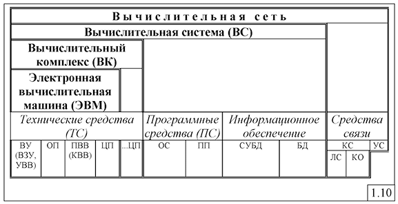

## 1.2. Состав и типы компьютерных сетей

Концептуально компьютерную FeTb можно представить как совокупность взаимосвязанных узлов (рис.1.11).

Узел сети - совокупность средств, объединенных каналами связи и реализующих функции: 
- выбора направления и организации передачи данных (средства коммутации и маршрутизации); такие узлы называются узлами связи (узлами коммутации, узлами передачи данных);
- обработки данных (средства обработки данных); такие узлы называются узлами (центрами) обработки данных.

В качестве узлов связи могут использоваться коммутато­ ры и маршрутизаторы, а в качестве узлов обработки данных - компьютеры, предоставляющие свои информационные и вычисли­ тельные ресурсы пользователям сети и называемые х ост-машина- ми или просто хостами (host).

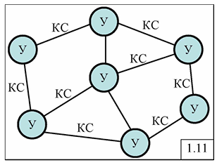

В сети Internet термин "хост-машина" трактуется более широко: хост-машиной называет­ ся любой пользовательский компьютер, подключенный к сети.

Совокупность средств коммуникаций (связи) для передачи данных, состоящая из каналов связи и узлов связи, образует сеть связи, называемую также телекоммуникационной сетью или сетью передачи данных (СПД). Следует иметь в виду, что понятие «сеть передачи данных» имеет более узкий смысл по сравнению с понятием «сеть связи». СПД предназначена для передачи компьютерных (цифровых) данных, в то время как в сети связи (или, что то же самое, телекоммуникационной сети) могут передаваться как цифровые (дискретные), так и непрерывные (аналоговые) данные, к которым относятся речь, аудио и видео.

Два узла, связанные каналом связи, образуют звено передачи данных (рис.1.12).

Данные в компьютерной сети передаются в виде сообщений.

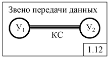

Сообщение представляет собой единицу данных, передаваемую между пользователями сети как единое целое и имеющую определённый смысл. В качестве сообщений могут выступать программные файлы, электронные письма, неподвижные изображения, видеофильмы и т.п. Сообщение представляется в определённом формате (рис.1.13), содержащем в общем случае заголовок и концевик. В заголовке указывается адрес получателя данного сообщения и адрес отправителя, а также дополнительная служебная информация (тип и длина сообщения, приоритет и т.д.), необходимая для эффективной передачи сообщения в сети. Концевик обычно содержит контрольную сумму, используемую для обнаружения ошибок, которые могут появиться при передаче сообщения по сети.

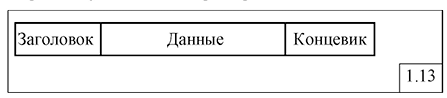

Сообщение при передаче через телекоммуникационную сеть может быть разбито на несколько блоков данных, каждый из которых представляется в формате, аналогичном сообщению (рис.1.13). Такой блок данных отличается от сообщения тем, что имеет ограниченную длину, в то время как длина сообщения в принципе не ограничена. Так, например, сообщение, представляющее собой видеофильм длиной в несколько гигабайт, при передаче через телекоммуникационную сеть может быть разбито на множество блоков данных, длина которых не будет превышать 1000 байт, причём каждый такой блок данных будет иметь заголовок с одинаковыми адресами отправителя и получателя.

### 1.2.2. Классификация сетей ЭВМ

Классификация сетей ЭВМ (компьютерных сетей), как любых больших и сложных систем, может быть выполнена на основе различных признаков, в качестве которых могут быть использованы (рис.1.14):  
与任何大型复杂系统一样，计算机网络（计算机网络）的分类可以根据各种特征进行分类，可以将其用作（图1.14）：
- размер (территориальный охват) сети;  
  网络的规模（领土覆盖范围）；
- принадлежность;  
  隶属关系
- назначение;  
  目的;
- область применения.  
  适用范围。

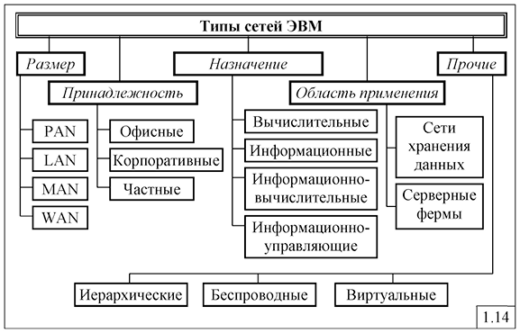

1. По размеру (территориальному охвату) сети ЭВМ делятся на:  
   根据规模（地域覆盖范围），计算机网络分为：
   - персональные; 个人的;
   - локальные; 局域的;
   - городские (региональные). 城市（区域）的
   - глобальные. 全球的

   **Персональная сеть** (Personal Area Network, PAN) — это сеть, объединяющая персональные электронные устройства пользователя (телефоны, карманные персональные компьютеры, смартфоны, ноутбуки и т.п.) и характеризующаяся:   
   **个域网**（Personal Area Network，PAN）是一个将用户的个人电子设备（电话、PDA、智能手机、笔记本电脑等）联合起来的网络，其特点是：  
   - небольшим числом абонентов;  
     少量订户；   
   - малым радиусом действия (до нескольких десятков метров);  
     短距离（可达数十米）；   
   - некритичностью к отказам.  
     对失败不加批判。  
   К стандартам таких сетей в настоящее время относятся Bluetooth, Zigbee, Пиконет.  
   目前此类网络的标准包括蓝牙、Zigbee、Piconet。

   **Локальная вычислительная сеть (ЛВС)** (Local Area Network, LAN) - сеть со скоростью передачи данных , как правило, не менее 1 Мбит/с, обеспечивающая связь на небольших расстояниях - от нескольких десятков метров до нескольких километров. Оборудование, подключаемое к ЛВС, может находиться в одном или нескольких соседних зданиях.   
   **局域网（LAN）**（Local Area Network，LAN）——数据传输速度通常至少为1 Mbit/s的网络，提供短距离通信——从几十米到几公里。连接到 LAN 的设备可能位于一栋或多栋相邻的建筑物中。
   Примеры ЛВС: Ethernet, Token Ring.  
   LAN 示例：以太网、令牌环。

   **Городская вычислительная сеть** (Metropolitan Area Network, MAN) - сеть, промежуточная по размеру между ЛВС и глобальной сетью.  
   **城域网 (MAN)** 规模介于 LAN 和全球网络之间的网络。  
   Протоколы и кабельная система для городской вычислительной сети описываются в стандартах комитета IEEE 802.6. MAN реализуется на основе протокола DQDB (Distributed Queue Dual Bus) - двойная шина с распределенной очередью и использует волоконно-оптический кабель для передачи данных со скоростью 100 Мбит/с на территории до 100 км2. MAN может применяться для объединения в одну сеть группы сетей, расположенных в разных зданиях. Последние разработки, связанные с высокоскоростным беспроводным доступом в соответствии со стандартом IEEE 802.16, привели к созданию MAN в виде широкополосных беспроводных ЛВС.  
   城域网的协议和布线在 IEEE 802.6 委员会标准中进行了描述。城域网基于DQDB（分布式队列双总线）协议实现——具有分布式队列的双总线，并使用光缆在最大100平方公里的区域内以100Mbit/s的速度传输数据。城域网可用于将位于不同建筑物的一组网络合并为一个网络。根据 IEEE 802.16 标准的高速无线接入的最新发展导致了宽带无线 LAN 形式的城域网 (MAN) 的创建。

   **Глобальная сеть** (Wide Area Network, WAN) - в отличие от ЛВС охватывает большую территорию и представляет собой объединение нескольких ЛВС, связанных с помощью специального сетевого оборудования (маршрутизаторов, коммутаторов и шлюзов), образующих в случае использования высокоскоростных каналов магистральную сеть передачи данных (магистральную сеть связи). Наиболее широкое применение находят глобальные сети для нужд информационного обмена в коммерческих, научных и других профессиональных целях.  
   **广域网**（Wide Area Network，WAN）——与局域网不同，它覆盖很大的区域，是使用专用网络设备（路由器、交换机和网关）连接的几个局域网的组合，使用时形成骨干网络高速通道数据传输（骨干通信网络）。全球网络最广泛地用于商业、科学和其他专业目的的信息交换需求。

   Для построения глобальных сетей могут использоваться различные сетевые технологии, в том числе TCP/IP, X.25, Frame Relay, ATM, MPLS.  
   为了构建全球网络，可以使用各种网络技术，包括TCP/IP、X.25、帧中继、ATM、MPLS。

   Настоящей глобальной сетью, пожалуй, можно считать только сеть Интернет. Вряд ли глобальной можно считать сеть, объединяющую 2-3 ЛВС, находящиеся в разных городах, расположенных на расстоянии нескольких десятков или даже сотен километров друг от друга. Однако, поскольку для построения такой «простой» сети используются обычно те же сетевые технологии и технические средства, что и в сети Интернет, то такие сети обычно тоже относят к классу глобальных сетей.  
   也许只有互联网才能被认为是真正的全球网络。由位于不同城市、相距数十甚至数百公里的 2-3 个 LAN 联合而成的网络不太可能被视为全球网络。但由于构建这样一个“简单”的网络通常采用与互联网相同的网络技术和技术手段，因此此类网络通常也被归类为全球网络。

2. По принадлежности сети ЭВМ делятся на:  
   按隶属关系，计算机网络分为：
   - офисные - сети, расположенные на территории офиса компании, ограниченной обычно пределами одного здания, и построенные на технологиях LAN;  
     办公室 - 位于公司办公室范围内的网络，通常限于一栋建筑物的边界，并基于 LAN 技术构建； 
   - корпоративные (ведомственные) - сети, представляющие собой объединение нескольких офисных сетей компании, расположенных в разных территориально разнесенных зданиях, находящихся возможно в разных городах и регионах, и построенные на технологиях MAN или WAN;  
     公司（部门）- 网络是位于不同地理位置的建筑物中的多个公司办公网络的组合，可能位于不同的城市和地区，并基于 MAN 或 WAN 技术构建； 
   - частные - сети, построенные обычно на технологии виртуальной частной сети (Virtual Private Network, VPN), позволяющей обеспечить одно или несколько сетевых соединений, которые могут быть трёх видов: узел-узел, узел-сеть и сеть-сеть, образующих логическую сеть поверх другой сети (например, Интернет).  
     专用网络，通常建立在虚拟专用网络（VPN）技术之上，允许提供一个或多个网络连接，可以分为三种类型：节点到节点、节点到网络和网络到网络，在另一个网络（例如互联网）之上形成一个逻辑网络。 

3. По назначению сети ЭВМ делятся на:  
   根据用途，计算机网络分为：
   - вычислительные, предназначенные для решения задач пользователей, ориентированных, в основном, на вычисления;  
     计算，旨在解决用户问题，主要侧重于计算；  
   - информационные, ориентированные на предоставление информационных услуг; примерами таких сетей могут служить сети, предоставляющие справочные и библиотечные услуги;  
     信息，侧重于提供信息服务；此类网络的例子包括提供参考和图书馆服务的网络； 
   - информационно-вычислительные, предназначенные для решения задач пользователей и предоставления информационных услуг;  
     信息和计算，旨在解决用户问题并提供信息服务；
   - информационно-управляющие, предназначенные для управления реальными объектами и процессами.  
     信息和管理，旨在管理真实的对象和过程。 

4. По области применения сети можно разделить на:  
   按应用领域，网络可分为：
- сети хранения данных;  
  数据存储网络；
- серверные фермы.  
  服务器场。

Сеть хранения данных (СХД) (Storage Area Network, SAN) представляет собой множество внешних устройств хранения данных, таких как дисковые массивы, ленточные библиотеки, оптические накопители, подключённые к серверам, при этом операционная система рассматривает подключённые ресурсы, как локальные.  
存储区域网络（SAN）是一组连接到服务器的外部数据存储设备，例如磁盘阵列、磁带库、光盘驱动器，而操作系统将连接的资源视为本地资源。

Следует не путать сеть хранения данных с сетевой системой хранения данных (Network Attached Storage, NAS), представляющей собой компьютер с дисковым массивом, подключенный обычно к локальной сети и поддерживающий работу по принятым в этой сети протоколам. Часто диски в NAS объединены в RAID массив. Несколько таких компьютеров могут быть объединены в одну систему, обеспечивая надёжность хранения данных, простой доступ для пользователей и хорошую масштабируемость.  
不要将存储网络与网络附加存储系统（Network Attached Storage，NAS）混淆，网络附加存储系统是具有磁盘阵列的计算机，通常连接到本地网络并支持使用该网络中采用的协议进行操作。通常 NAS 磁盘会组合成 RAID 阵列。可以将多台这样的计算机组合成一个系统，提供可靠的数据存储、用户访问方便以及良好的可扩展性。

Серверная ферма - это множество серверов, соединенных сетью передачи данных и работающих как единое целое. Серверная ферма обычно является ядром крупного центра обработки данных (ЦОД), обеспечивающего распределенную обработку данных.  
服务器场是一组通过数据网络连接并作为单个单元运行的服务器。服务器场通常是提供分布式数据处理的大型数据中心 (DPC) 的核心。

К перечисленным типам сетей следует добавить:  
应在列出的网络类型中添加：  
- беспроводные ЛВС;  
  无线局域网；
- виртуальные локальные вычислительные сети;  
  虚拟局域网；
- иерархические сети;  
  分层网络；

**Беспроводная ЛВС** (wireless LAN - WLAN) - локальная сеть, использующая для передачи данных инфракрасное излучение или чаще всего радиоволны.  
**无线 LAN**（无线 LAN - WLAN）是一种使用红外辐射或最常见的无线电波来传输数据的本地网络。

**Виртуальная локальная вычислительная сеть** (ВЛВС) (virtual LAN - VLAN) - логическое объединение узлов локальной сети, позволяющее выделить пользователей одной рабочей группы с общими интересами в отдельный сетевой сегмент. При этом объединяемые узлы могут принадлежать различным физическим сегментам.  
**虚拟局域网**（VLAN）（虚拟局域网-VLAN）是本地网络节点的逻辑联合，它允许具有共同兴趣的同一工作组的用户被分配到单独的网段。在这种情况下，被合并的节点可以属于不同的物理段。

**Иерархическая сеть** (hierarchical network) - сеть, в которой главным вычислительным центром является одна хост-машина, а терминалами - остальные сетевые устройства. Это традиционная архитектура, противоположная современной архитектуре распределенных вычислений, в которых интеллектуальные рабочие станции играют более активную роль в вычислительном процессе.  
**分层网络**（分层网络）——以一台主机为主要计算中心，其余网络设备为终端的网络。这是一种传统的架构，与现代分布式计算架构相反，其中智能工作站在计算过程中扮演更积极的角色。

### 1.2.3. Администрирование компьютерных сетей

Важным требованием к любой компьютерной сети, обеспечивающим эффективное функционирование, является её управляемость, заключающаяся в возможности:   
对于任何确保有效运行的计算机网络来说，一个重要的要求是其可控性，它包括以下能力：  

- централизованного наблюдения и контроля состояния основных элементов сети, отдельных подсистем и сети в целом;  
  集中监视和控制网络主要元件、各个子系统和整个网络的状态；
- выявления и устранения возникающих в процессе функционирования сети проблем, таких как сбои и отказы отдельных устройств сети, определение и устранение перегрузок и т.д.;  
  识别和消除网络运行过程中出现的问题，例如单个网络设备的故障和失灵，识别和消除过载等；
- сбора и анализа данных для оценки производительности сети и планирования развития сети;  
  收集和分析数据以评估网络性能并规划网络发展；
- обеспечения информационной безопасности и защиты данных и т.п.  
  确保信息安全和数据保护等。

Для реализации перечисленных возможностей необходимо в сети иметь специальные автоматизированные средства администрирования, взаимодействующие с техническими и программными средствами сети с помощью коммуникационных протоколов.  
为了实现上述功能，网络上需要有专门的自动化管理工具，使用通信协议与网络的硬件和软件进行交互。

Поддержка и обеспечение эффективного функционирования компьютерной сети за счет принятия своевременных организационных решений по управлению сетью на основе анализа характеристик функционирования и текущего состояния сети реализуется в рамках администрирования компьютерной сети сетевым администратором.  
通过基于对网络的功能特征和当前状态的分析及时做出网络管理的组织决策来支持和确保计算机网络的有效运行是网络管理员对计算机网络的管理的一部分。

К основным функциям администрирования сети относятся:  
网络管理的主要职能包括：
- наблюдение за потоками данных;  
  监控数据流；
- установка новых версий программного обеспечения;  
  安装新软件版本；
- создание и поддержание таблиц маршрутизации и коммутации;  
  路由表和交换表的创建和维护；
- диагностика состояния компонентов сети;  
  网络组件状态的诊断；
- контроль ошибок и устранение простых отказов;  
  错误控制和简单故障的消除；
- замена отказавших узлов резервными;  
  用备份节点替换故障节点；
- реконфигурация сети;  
  网络重新配置；
- поддержка отказоустойчивости компьютерной сети;  
  支持计算机网络容错；
- добавление новых пользователей;  
  添加新用户；
- определение прав пользователей сети при их обращении к разным ресурсам: файлам, каталогам, принтерам и т.д.;  
  确定网络用户访问不同资源（文件、目录、打印机等）时的权限；
- ограничение возможностей пользователей в выполнении тех или иных системных действий.  
  限制用户执行某些系统操作的能力。

### 1.2.4. Типы данных

Первоначально сети ЭВМ строились для обработки и передачи компьютерных данных, представляемых в цифровой (дискретной) форме.  
最初，计算机网络的建立是为了处理和传输以数字（离散）形式呈现的计算机数据。

Современные компьютерные сети ориентированы на передачу и обработку самых разнообразных данных, которые могут быть разделены на следующие типы (рис.1.15).  
现代计算机网络专注于传输和处理各种数据，可分为以下类型（图1.15）。

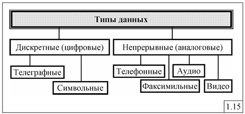

1. Телеграфные даннве - дискретные данные, представляемые в виде импульсов постоянного или переменного тока, передаваемые по телеграфным каналам связи (ТгКС).  
   电报数据 - 离散数据，以直流或交流脉冲的形式呈现，通过电报通信通道 (TgCC) 传输。
2. Телефонные (голосовые) данные - речь в спектре частот от 80 до 12000 Гц, передаваемая по телефонным КС (ТфКС), называемым также каналами тональной частоты (ТЧ). Речь по таким каналам передаётся в ограниченной полосе частот от 300 Гц до 3400 Гц, что обеспечивает разборчивость фраз более 99%.  
   电话（语音）数据 - 频谱为 80 至 12000 Hz 的语音，通过电话 CS (TfKS) 传输，也称为语音 (VoF) 通道。通过此类通道的语音在 300 Hz 至 3400 Hz 的有限频带内传输，这确保了超过 99% 的短语清晰度。
3. Факсимильные данные - неподвижные изображения.  
   传真数据-静止图像。
4. Аудиоданные (звуковое вещание) - в отличие от телефонных, кроме речи передается музыка, пение и т.п. в спектре частот от 20 Гц до 20 кГц. Для качественной передачи аудио данных достаточна полоса частот от 30 Гц до 15 кГц.  
   音频数据（声音广播）——与电话数据不同，除了语音之外，还传输音乐、歌声等。频谱范围为 20 Hz 至 20 kHz。对于音频数据的高质量传输，30Hz至15kHz的频带就足够了。 
5. Видеоданные (телевизионное вещание) - совокупность движущихся изображений и звукового сопровождения в спектре частот от 40 Гц до 6 МГц. В современных компьютерных сетях различают видеоданные трёх типов, отличающиеся требованиями к качеству передачи:  
   视频数据（电视广播）- 频谱从 40 Hz 到 6 MHz 的一组运动图像和声音。现代计算机网络中，视频数据分为三种类型，对传输质量的要求不同：
- видеоконференцсвязь, представляющая собой медленно изменяющиеся изображения и характеризующаяся невысокими требованиями к качеству передачи;  
  视频会议，图像变化缓慢，对传输质量要求不高；
- телевизионное вещание обычного качества;  
  普通质量的电视广播；
- телевизионное вещание высокой чёткости. 6. Символьные (цифровые, компьютерные) данные - совокупность символов, например двоичных символов в компьютерах.  
  高清晰度电视广播。 6. 字符（数字、计算机）数据——符号的集合，例如计算机中的二进制字符。

Телеграфные и цифровые данные по своей природе относятся к дискретным данным, остальные - к непрерывным данным, но которые могут быть представлены (закодированы) в цифровой форме.  
电报和数字数据本质上是离散数据，其余数据是连续数据，但可以以数字形式表示（编码）。

Телефонные, аудио - и видеоданные относятся к так называемым мультимедийным данным, к которым предъявляются специфические требования к качеству передачи по сравнению с обычными компьютерными (цифровыми) данными.  
电话、音频和视频数据属于所谓的多媒体数据，与传统的计算机（数字）数据相比，它对传输质量有特定的要求。

## 1.3. Многоуровневая организация вычислительных сетей

### 1.3.1. Требования к организации компьютерных сетей

Для обеспечения эффективного функционирования к компьютерным сетям предъявляются требования, основными среди которых являются (рис.1.16):  

1) открытость - возможность добавления в сеть новых компонентов (узлов и каналов связи, средств обработки данных) без изменения существующих технических и программных средств; 
2) гибкость - сохранение работоспособности при изменении структуры сети в результате сбоев и отказов отдельных компонентов сети или при замене оборудования; 
3) совместимость - возможность работы в сети оборудования разного типа и разных производителей; 
4) масштабируемость - способность сети увеличивать свою производительность при добавлении ресурсов (узлов и каналов связи); 
5) эффективность - обеспечение требуемого качества обслуживания пользователей, задаваемого в виде показателей производительности, времени ы х задержек, надежности и т.д., при минимальных затратах.

Указанные требования реализуются за счет многоуровневой организации управления процессами в сети, в основе которой лежат понятия процесса, уровня, интерфейса и протокола (рис.1.17).

## 1.4. Принципы структурной организации компьютерных сетей

## 1.5. Принципы функциональной организации компьютерных сетей

## 1.6. Параметры и характеристики компьютерных сетей

## 1.7. Сетевые протоколы

# Раздел 2. СРЕДСТВА ТЕЛЕКОММУНИКАЦИЙ

## 2.1. Основные понятия техники связи

## 2.2. Система связи

## 2.3. Методы модуляции и кодирования данных

## 2.3. Методы модуляции и кодирования данных

## 2.5. Беспроводные системы связи

## 2.6. Телекоммуникационные сети

# Раздел 3. ЛОКАЛЬНЫЕ ВЫЧИСЛИТЕЛЬНЫЕ СЕТИ

## 3.1. Принципы организации ЛВС

## 3.2. ЛВС Ethernet

## 3.3. Высокоскоростные технологии Ethernet

## 3.4. ЛВС Token Ring

## 3.5. ЛВС FDDI

## 3.6. Беспроводные ЛВС

# Раздел 4. ГЛОБАЛЬНЫЕ ВЫЧИСЛИТЕЛЬНЫЕ СЕТЕ

## 4.1. Принципы организации глобальных сетей

## 4.2. Технические средства объединения сетей

## 4.3. Сети с установлением соединений

## 4.4. Глобальная сеть Internet

## 4.5. MPLS-технология

## 4.6. Пример передачи данных в составной сети

## 4.7. Безопасность компьютерных сетей