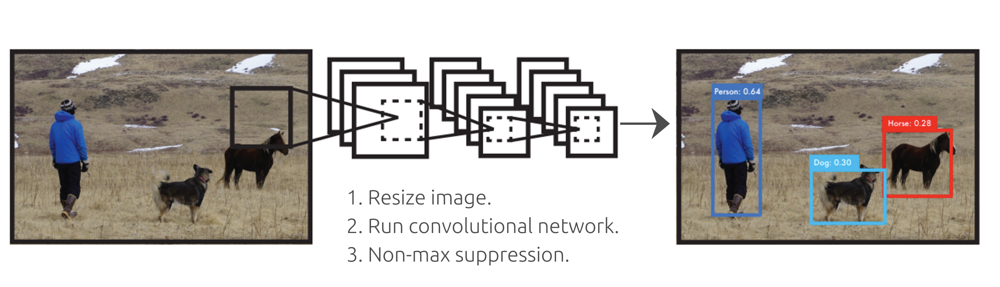

## [MainPage](../index.md)/[Computer Vision](./README.md)/Lecture

课程链接：[开放教育](https://apps.openedu.ru/learning/course/course-v1:ITMOUniversity+COMPVIS+spring_2024_ITMO_bac/home)

- [1. Введение. Предобработка изображений 介绍 图像预处理](#1-введение-предобработка-изображений-介绍-图像预处理)
  - [1.0 О курсе 关于课程](#10-о-курсе-关于课程)
  - [1.1 Введение. Объект изучения. Процесс формирования изображения](#11-введение-объект-изучения-процесс-формирования-изображения)
  - [1.2 Повышение разрешения](#12-повышение-разрешения)
  - [1.3 Основные цветовые преобразования в составе комбинированной схемы коррекции цвета](#13-основные-цветовые-преобразования-в-составе-комбинированной-схемы-коррекции-цвета)
  - [1.4 Дополнительные цветовые преобразования в составе комбинированной схемы коррекции цвета](#14-дополнительные-цветовые-преобразования-в-составе-комбинированной-схемы-коррекции-цвета)
- [2. Классификация изображений](#2-классификация-изображений)
  - [2.1 Введение. Классические/не нейросетевые/общие методы для классификации изображений](#21-введение-классическиене-нейросетевыеобщие-методы-для-классификации-изображений)
  - [2.2 Введение. Классические/не нейросетевые/общие методы для классификации изображений](#22-введение-классическиене-нейросетевыеобщие-методы-для-классификации-изображений)
  - [2.3 Введение. Классические/не нейросетевые/общие методы для классификации изображений](#23-введение-классическиене-нейросетевыеобщие-методы-для-классификации-изображений)
  - [2.4 Введение. Классические/не нейросетевые/общие методы для классификации изображений](#24-введение-классическиене-нейросетевыеобщие-методы-для-классификации-изображений)
  - [2.5 Введение. Классические/не нейросетевые/общие методы для классификации изображений](#25-введение-классическиене-нейросетевыеобщие-методы-для-классификации-изображений)
  - [2.6 Введение. Классические/не нейросетевые/общие методы для классификации изображений](#26-введение-классическиене-нейросетевыеобщие-методы-для-классификации-изображений)

# 1. Введение. Предобработка изображений  介绍 图像预处理

## 1.0 О курсе 关于课程

**Здравствуйте, уважаемые слушатели!**  
**亲爱的听众朋友们大家好！**

**Добро пожаловать на курс «Компьютерное зрение».**  
**欢迎来到计算机视觉课程。**

В курсе рассматриваются основные задачи из области компьютерного зрения, вокруг которых сконцентрировано внимание научного сообщества и промышленности: задачи классификации, сегментации, детектирования объектов. В рамках данного курса изучаются наиболее распространенные современные методы решения рассматриваемых проблем.  
该课程研究了计算机视觉领域的主要任务，科学界和工业界的注意力集中在这些任务上：分类、分割、对象检测问题。本课程探讨解决所考虑问题的最常见的现代方法。

**АВТОР ОНЛАЙН-КУРСА:**  
**在线课程作者：**

Самарин Алексей Владимирович

## 1.1 Введение. Объект изучения. Процесс формирования изображения

<iframe width="560" height="315" src="https://www.youtube.com/embed/jxsKSIpaoHw?si=mxwW_LSgerkMNM06" title="YouTube video player" frameborder="0" allow="accelerometer; autoplay; clipboard-write; encrypted-media; gyroscope; picture-in-picture; web-share" referrerpolicy="strict-origin-when-cross-origin" allowfullscreen></iframe>

- [视频课程链接(Youtube)](https://www.youtube.com/watch?v=jxsKSIpaoHw&t=1s)

- [视频课程原文及翻译](./LectureRAW/Lecture1-1.md)

## 1.2 Повышение разрешения

<iframe width="560" height="315" src="https://www.youtube.com/embed/roEJDiJg3X4?si=EA0rlTTuC3Iw172x" title="YouTube video player" frameborder="0" allow="accelerometer; autoplay; clipboard-write; encrypted-media; gyroscope; picture-in-picture; web-share" referrerpolicy="strict-origin-when-cross-origin" allowfullscreen></iframe>

- [视频课程链接(Youtube)](https://www.youtube.com/watch?v=roEJDiJg3X4)

- [视频课程原文及翻译](./LectureRAW/Lecture1-2.md)

## 1.3 Основные цветовые преобразования в составе комбинированной схемы коррекции цвета

<iframe width="560" height="315" src="https://www.youtube.com/embed/KES76i-Cv4c?si=nvb_EY3HPyTvZELY" title="YouTube video player" frameborder="0" allow="accelerometer; autoplay; clipboard-write; encrypted-media; gyroscope; picture-in-picture; web-share" referrerpolicy="strict-origin-when-cross-origin" allowfullscreen></iframe>

- [视频课程链接(Youtube)](https://www.youtube.com/watch?v=KES76i-Cv4c)

- [视频课程原文及翻译](./LectureRAW/Lecture1-3.md)

## 1.4 Дополнительные цветовые преобразования в составе комбинированной схемы коррекции цвета

<iframe width="560" height="315" src="https://www.youtube.com/embed/0yBdAqbvu9w?si=hN7RXbqsjHi5L3R2" title="YouTube video player" frameborder="0" allow="accelerometer; autoplay; clipboard-write; encrypted-media; gyroscope; picture-in-picture; web-share" referrerpolicy="strict-origin-when-cross-origin" allowfullscreen></iframe>

- [视频课程链接(Youtube)](https://www.youtube.com/watch?v=0yBdAqbvu9w)

- [视频课程原文及翻译](./LectureRAW/Lecture1-4.md)

# 2. Классификация изображений

## 2.1 Введение. Классические/не нейросетевые/общие методы для классификации изображений

<iframe width="560" height="315" src="https://www.youtube.com/embed/lAnudqhAo5k?si=glebJP8g2AVQ0eQA" title="YouTube video player" frameborder="0" allow="accelerometer; autoplay; clipboard-write; encrypted-media; gyroscope; picture-in-picture; web-share" referrerpolicy="strict-origin-when-cross-origin" allowfullscreen></iframe>

- [视频课程链接(Youtube)](https://www.youtube.com/watch?v=lAnudqhAo5k)

- [视频课程原文及翻译](./LectureRAW/Lecture1-x.md)

## 2.2 Введение. Классические/не нейросетевые/общие методы для классификации изображений

<iframe width="560" height="315" src="https://www.youtube.com/embed/Vkrhju1RC5w?si=SrM2G0ZVpEw6WNTb" title="YouTube video player" frameborder="0" allow="accelerometer; autoplay; clipboard-write; encrypted-media; gyroscope; picture-in-picture; web-share" referrerpolicy="strict-origin-when-cross-origin" allowfullscreen></iframe>

- [视频课程链接(Youtube)](https://www.youtube.com/watch?v=Vkrhju1RC5w)

- [视频课程原文及翻译](./LectureRAW/Lecture1-x.md)

## 2.3 Введение. Классические/не нейросетевые/общие методы для классификации изображений

- [视频课程链接(Youtube)](https://www.youtube.com/watch?v=lAnudqhAo5k)

- [视频课程原文及翻译](./LectureRAW/Lecture1-x.md)

## 2.4 Введение. Классические/не нейросетевые/общие методы для классификации изображений

- [视频课程链接(Youtube)](https://www.youtube.com/watch?v=lAnudqhAo5k)

- [视频课程原文及翻译](./LectureRAW/Lecture1-x.md)

## 2.5 Введение. Классические/не нейросетевые/общие методы для классификации изображений

- [视频课程链接(Youtube)](https://www.youtube.com/watch?v=lAnudqhAo5k)

- [视频课程原文及翻译](./LectureRAW/Lecture1-x.md)

## 2.6 Введение. Классические/не нейросетевые/общие методы для классификации изображений

- [视频课程链接(Youtube)](https://www.youtube.com/watch?v=lAnudqhAo5k)

- [视频课程原文及翻译](./LectureRAW/Lecture1-x.md)
