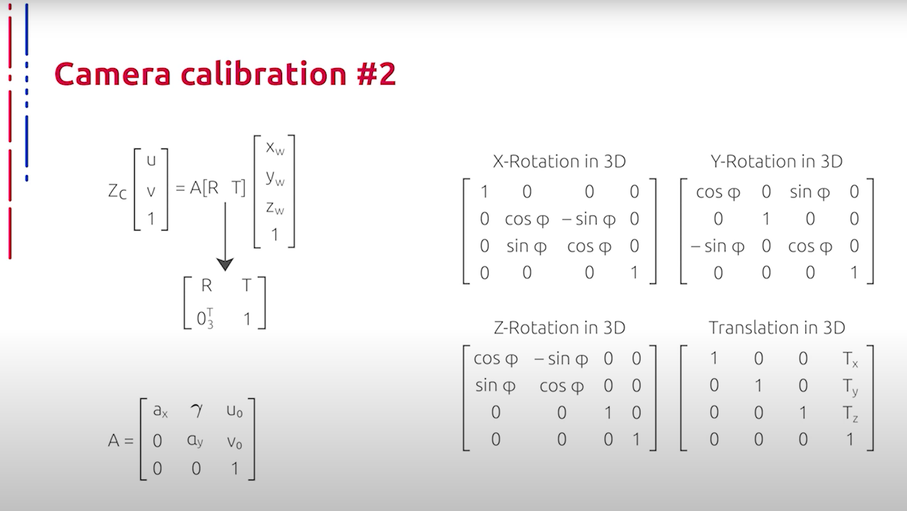

## [MainPage](../../index.md)/[Computer Vision](../README.md)/[Lecture1-1](../Lecture.md)/RAW

语音识别：Youtube 转文本  
断句与标点：ChatGPT 4o  
翻译：ChatGPT 4o   

# Введение. Объект изучения. Процесс формирования изображения   介绍 研究对象 成像过程

В настоящее время бурно развивается компьютерное зрение со всеми его многочисленными применениями в различных аспектах нашей жизни. Данный курс посвящен рассмотрению теоретических и практических аспектов основных задач компьютерного зрения, с которыми индустриальные специалисты и учёные сталкиваются в процессе своей деятельности. Без решения этих задач, пожалуй, не обходится ни один продукт, построенный на основе технологий компьютерного зрения.  
目前，计算机视觉在各个领域的应用正在快速发展。本课程专门研究计算机视觉基本任务的理论和实际方面，这些任务是工业专家和科学家在工作中经常遇到的。没有解决这些任务，几乎不可能构建基于计算机视觉技术的产品。

Каждая лекция данного курса посвящена разбору отдельного типа задачи из общего стека компьютерного зрения. Лекции относительно независимы, однако настоятельно рекомендуется изучать их в хронологическом порядке. Первая лекция данного курса посвящена обработке и предварительной обработке изображений. На самом деле, данная задача отнюдь не является самой простой и доступной для начинающих, однако она, как правило, в том или ином виде решается на первой стадии построения общего стека системы компьютерного зрения. Более того, понимание общих принципов формирования изображений крайне важно для понимания предметной области в целом и часто полезно при решении отдельных задач.  
本课程的每一节课都专注于计算机视觉整体任务中单独一种任务的分析。虽然各讲内容相对独立，但强烈建议按时间顺序学习。课程的第一节课介绍图像处理和预处理任务。实际上，这一任务并不是最简单且容易上手的，但它通常在构建计算机视觉系统的初始阶段以某种形式得到解决。此外，理解图像形成的基本原理对于整体理解领域非常重要，并且在解决单独任务时往往有用。

Следует отметить, что компьютерное зрение - область необъятная, объединяющая своей проблематикой целый ряд отраслей науки, техники, промышленности и прочих составляющих. Поэтому при прохождении данного курса мы вынуждены ограничить как ширину рассматриваемого контекста, так и глубину погружения в контекст каждой задачи. Одним из таких допущений является рассмотрение только RGB-представления цветовой схемы изображений. RGB - это аббревиатура английских слов Red, Green & Blue, то есть красный, зелёный, синий, описывающая способ кодирования цвета для цветового воспроизведения с помощью трёх цветов, которые принято называть основными. Выбор основных цветов обусловлен особенностями физиологии восприятия цвета сетчаткой человеческого глаза. RGB-модель является аддитивной: цвета получаются путём добавления к чёрному цвету. При отсутствии излучения мы получаем тёмное пятно, то есть чёрный цвет, а при смешении всех трёх цветовых компонент в равной максимальной интенсивности получаем белый цвет.  
需要注意的是，计算机视觉是一个广阔的领域，涵盖了许多科学、技术、工业等方面。因此，在学习本课程时，我们不得不限制所讨论的上下文的宽度和每个任务的深入程度。一个这样的限制是只考虑图像的RGB表示。RGB是英文Red（红）、Green（绿）和Blue（蓝）的缩写，描述了一种通过三种主要颜色来编码颜色的方法。选择这三种主要颜色是因为人眼视网膜的颜色感知生理特性。RGB模型是加法性的：通过向黑色添加颜色来获得不同的颜色。当没有辐射时，我们看到的是黑色，而在最大强度下混合这三种颜色时，我们看到的是白色。

Если цвет экрана, освещенного цветным прожектором, обозначить как тройку (R1, G1, B1), а цвет того же экрана, освещённого другим прожектором, обозначить как (R2, G2, B2), то при освещении того же экрана двумя прожекторами мы получим свет, который обозначается как тройка (R1+R2, G1+G2, B1+B2). Изображения в данной цветовой модели состоят из трёх каналов. При смешении основных, например, синего и красного, получается пурпурный цвет, зелёного и красного - жёлтый, зелёного и синего - циановый. Как уже говорилось ранее, при смешении всех трёх основных излучений получается белый цвет. Для большинства приложений значения координат RGB можно считать принадлежащими отрезку от нуля до единицы включительно, что представляет пространство RGB в виде куба со стороной единицы. В компьютерах для представления каждой из координат используется один октет, значение которого обозначается для удобства целыми числами от 0 до 255 включительно, где 0 - минимальная, а 255 - максимальная интенсивность.  
如果用三元组(R1, G1, B1)表示被彩色聚光灯照亮的屏幕颜色，而另一个彩色聚光灯照亮的相同屏幕颜色表示为(R2, G2, B2)，那么用两个聚光灯照亮的同一屏幕的颜色表示为三元组(R1+R2, G1+G2, B1+B2)。在这种色彩模型中，图像由三个通道组成。混合基本颜色，如蓝色和红色，得到紫色；绿色和红色，得到黄色；绿色和蓝色，得到青色。正如之前所说，混合这三种基本辐射得到白色。对于大多数应用，可以认为RGB坐标的值属于从0到1的区间，这样RGB空间表示为单位立方体。在计算机中，每个坐标通常用一个字节表示，其值为0到255，其中0表示最小强度，255表示最大强度。

Рассмотрим подробнее процесс получения изображений и формирования самого RGB-представления, каждый пиксель которого представлен значениями трёх цветовых компонент. С процессом получения изображений неразрывно связан процесс калибровки камеры, который представляет собой оптимальную настройку параметров камеры для получения как можно более качественного изображения объекта. Для лучшего понимания кратко обсудим устройство и принцип действия современной камеры. Свет от солнца или искусственного источника сначала отражается от сцены, находящейся перед объективом камеры, а затем проходит через объектив и, если он есть, затвор к задней стенке корпуса камеры на матрицу, то есть сенсор, который производит конвертацию пучков света в цифровое изображение. Этот процесс аналогичен прохождению света через хрусталик человеческого глаза к колбочкам и палочкам, расположенным на задней стенке глаза, а также к зрительному нерву.  
让我们更详细地看看图像的获取过程和RGB表示的形成，每个像素由三个颜色分量的值表示。图像获取过程紧密相关的一个步骤是相机校准，它代表了相机参数的最佳设置，以获得尽可能高质量的目标图像。为了更好地理解这一点，我们简要讨论现代相机的结构和工作原理。来自太阳或人工光源的光线首先从位于相机镜头前的场景反射，然后通过镜头和（如果有的话）快门到达相机机身后面的传感器，即感光元件，该元件将光束转换为数字图像。这个过程类似于光线通过人眼晶状体到达位于眼睛后面的视杆细胞和视锥细胞，以及视神经的过程。

Когда же свет достигает задней стенки корпуса камеры, он попадает на чувствительный элемент датчика изображения, который преобразует свет в электрическое напряжение. Затем полученная таким образом информация обрабатывается процессором для исключения помех, расчета значений цвета, формирования файла данных об изображении и записи всей этой информации на носитель, например, карту для хранения цифровых изображений. После этого камера подготавливается к экспонированию следующего изображения.  
当光线到达相机机身后部时，它会打在图像传感器的敏感元件上，将光转换为电压。然后，通过处理器处理这些信息以消除噪音，计算颜色值，形成图像数据文件，并将所有信息记录在存储设备上，如存储卡。之后，相机准备曝光下一个图像。

Теперь поговорим о формализации самого процесса отображения точек объекта из пространства, связанного с геометрией сцены, в пространство, связанное с позициями и значениями соответствующих пикселей в RGB-представлении, полученным в результате фотографирования целевого объекта. Изначально объект представлен в координатах, связанных с фотографируемой сценой; обычно их принято называть мировыми координатами. Далее объект репроецируется в координаты, связанные с оптическим центром камеры, после чего происходит отображение в координаты, связанные с матрицей камеры, грубо говоря, координаты RGB-представления.  
接下来我们讨论将物体点从与场景几何相关的空间映射到与获得的RGB表示中像素的位置和值相关的空间的过程。最初，物体用与拍摄场景相关的坐标表示；通常称之为世界坐标。接着，物体再投影到与相机光学中心相关的坐标，然后映射到与相机矩阵相关的坐标，基本上是RGB表示的坐标。

Рассмотрим подробнее формальное описание только что упомянутых процессов, необходимое для лучшего понимания предметной области и работы с изображениями. Отметим, что для удобства и унификации описания операций все преобразования представления элементов пространств формализуются в нотации однородных координат. Однородные координаты обладают тем свойством, что определяемый ими объект не меняется при умножении всех координат на одно и то же ненулевое число. Из-за этого количество координат, необходимое для представления точки, всегда на одну больше, чем размерность пространства, в котором эти координаты используются. Например, для представления точки на прямой в однородном пространстве необходимы две координаты, а три координаты - для представления точки на плоскости в двумерном пространстве. В однородных координатах возможно представить даже точки, находящиеся в бесконечности. От однородных координат к аффинным можно перейти следующим образом: в трёхмерном пространстве можно провести плоскость, не проходящую через начало координат, тогда проходящая через начало координат прямая либо параллельна этой плоскости (в этом случае точка называется бесконечно удалённой), либо пересекает её в единственной точке; тогда ей можно сопоставить координаты этой точки на плоскости. Прямые на проективной плоскости - это плоскости в трёхмерном пространстве, проходящие через начало координат. Точки, записанные в однородных координатах, можно сопоставить прямой, которая в однородных координатах записывается так же. Таким образом, прямые на проективной плоскости образуют вторую проективную плоскость - в этом и заключается принцип проективной двойственности.  
让我们更详细地描述这些过程，以便更好地理解该领域和图像处理。为了方便和统一描述操作，所有空间元素的表示转换在齐次坐标表示法中形式化。齐次坐标具有这样的性质，即通过将所有坐标乘以相同的非零数，所定义的对象不会改变。因此，表示点所需的坐标数量总是比该坐标使用的空间的维数多一个。例如，在一维空间中表示点需要两个坐标，而在二维空间中表示点需要三个坐标。在齐次坐标中，甚至可以表示无穷远处的点。从齐次坐标转换到仿射坐标的方法如下：在三维空间中可以画一条不经过原点的平面，若通过原点的直线与该平面平行（此时该点称为无穷远点），或与其唯一交点相交；则可以将其对应于平面上的该点的坐标。二维平面上的直线是通过原点的平面。在齐次坐标中表示的点可以与直线对应，而直线在齐次坐标中同样表示。因此，二维平面上的直线组成了第二个二维平面，这就是投影对偶性原理。

На слайде представлен простейший стек формирования изображения, записанный в однородных координатах, разумеется, без учёта дисторсии. Наибольший интерес здесь представляют параметры внешней и внутренней калибровки. Матрица внутренней калибровки содержит 5 значимых параметров. Эти параметры соответствуют фокусному расстоянию, углу наклона пикселей и принципиальной точке, то есть точке пересечения плоскости изображения с оптической осью, совпадающей с центром фотографии и которая в реальных камерах, как правило, бывает немного смещена из-за оптических искажений.  
幻灯片上展示了在齐次坐标中表示的图像形成的基本栈，当然，不考虑畸变。最有趣的是外部和内部校准参数。内部校准矩阵包含5个重要参数。这些参数对应于焦距、像素倾斜角度和主点，即图像平面与光轴的交点，通常是照片的中心，但由于光学失真，在实际相机中会略有偏移。

Итак, αx и αy соответствуют фокусному расстоянию, измеренному в ширине и высоте пикселей, u0 и v0 - координатам принципиальной точки, γ - углу наклона пикселей. Нелинейные параметры внутренней калибровки, такие как коэффициенты дисторсии, также имеют важное значение, хотя и не могут быть включены в линейную модель, описываемую матрицей внутренней калибровки. Большинство современных алгоритмов калибровки камеры определяют их вместе с параметрами нелинейной части модели. Параметры внутренней калибровки относятся только к камере, но не к сцене, поэтому они изменяются только в том случае, когда меняются соответствующие настройки камеры. Матрица размерностью 3 на 3 поворота и вектор размерностью 3 на 1 переноса - это параметры внешней калибровки, определяющие преобразования координат, переводящие координаты точек сцены из мировой системы координат в систему координат, связанную с камерой, или что эквивалентно предыдущему определению. Параметры внешней калибровки задают положение камеры в мировой системе координат. Параметры внешней калибровки связаны непосредственно с фотографируемой сценой, поэтому, в отличие от параметров внутренней калибровки, каждой фотографии соответствует свой набор этих параметров. Сам процесс калибровки, грубо говоря, представляет собой одновременно и разрешение соотношений между внутренними и внешними параметрами калибровки, используя информацию о ряде точек сцены и взаимное соответствие полученных изображений в зависимости от алгоритма калибровки.  
所以，αx和αy对应于以像素宽度和高度测量的焦距，u0和v0是主点的坐标，γ是像素的倾斜角。内部校准的非线性参数，如畸变系数，也很重要，尽管不能包含在内部校准矩阵描述的线性模型中。大多数现代相机校准算法将它们与模型的非线性部分参数一起确定。内部校准参数仅与相机相关，但与场景无关，因此只有在相机设置改变时才会改变。3×3旋转矩阵和3×1平移向量是外部校准参数，它们定义了将场景点的坐标从世界坐标系转换为与相机相关的坐标系的变换，或者说是与相机相关的变换。外部校准参数定义了相机在世界坐标系中的位置。外部校准参数直接与拍摄场景相关，因此不同于内部校准参数，每张照片都有自己的一组外部校准参数。校准过程本质上是同时解决内部和外部校准参数之间关系的过程，使用一些场景点的信息和图像之间的相互对应，具体取决于校准算法。

Итак, в общих чертах мы сформулировали процесс получения цифрового изображения в RGB-пространстве. Теперь рассмотрим основные типы предварительной манипуляции, то есть предобработки или препроцессинга полученного изображения, которые зачастую применяются для увеличения эффективности остальной системы компьютерного зрения и могут опционально присутствовать в той или иной системе. Начнём с задачи увеличения разрешения исходного изображения. Актуальность и область применения данного типа обработки не нуждаются в объяснении. До начала бума глубокого обучения задачи улучшения изображения решались зачастую на основе классической схемы. На первой стадии, как правило, происходило растягивание исходного изображения в пространстве и заполнение образовавшихся пустот при помощи интерполяции. На второй стадии опционально применялись различные техники фильтрации для улучшения визуальных характеристик полученного изображения, например, добавление резкости, чёткости и тому подобное. При этом общая идеология подбора параметров и гиперпараметров при нахождении общего вида данных преобразований остаётся похожей и по сей день.  
总的来说，我们概述了获取RGB空间数字图像的过程。现在，我们来讨论主要的预处理类型，即预处理获取的图像，以提高计算机视觉系统的整体效率，并可能在某些系统中可选地存在。我们先从提高原始图像分辨率的任务开始。该处理的相关性和应用领域无需解释。在深度学习兴起之前，图像增强任务通常基于经典方案解决。在第一阶段，通常是空间上拉伸原始图像，并通过插值填充形成的空白。在第二阶段，可以选择性地应用各种滤波技术来改善获得图像的视觉特性，例如增加锐度、清晰度等。即使在今天，在确定这些转换的一般形式时，选择参数和超参数的总体理念仍然相似。