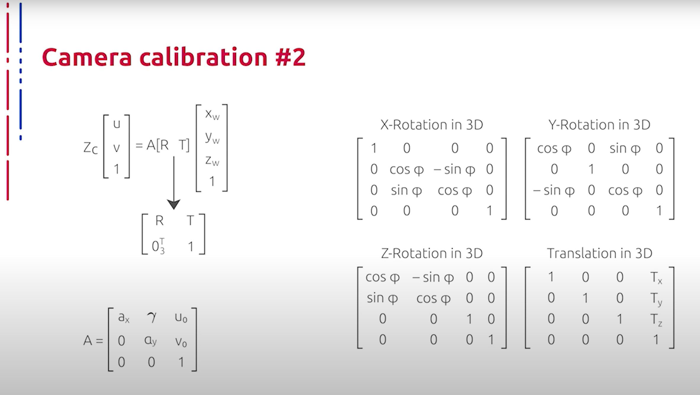
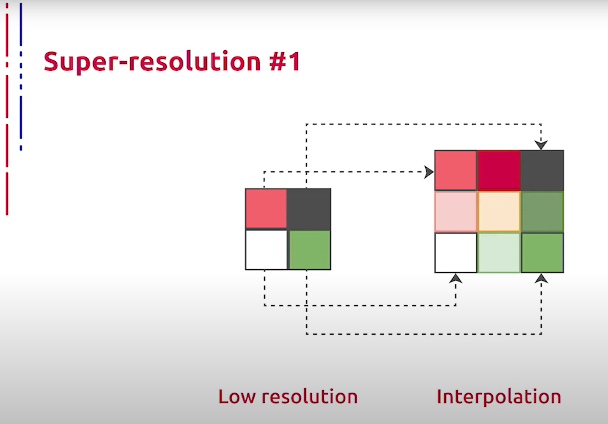
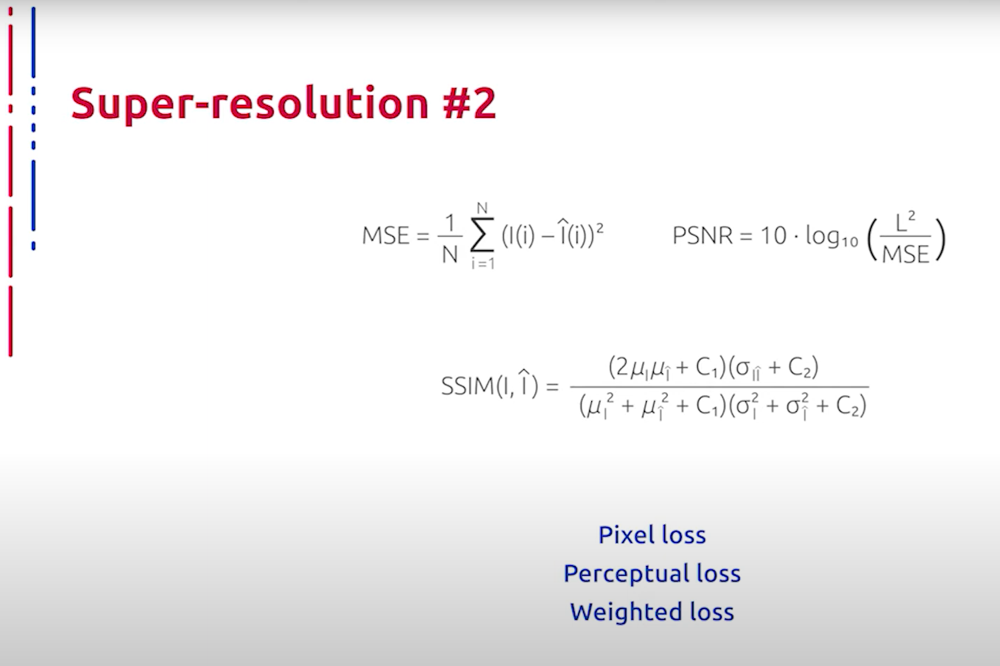
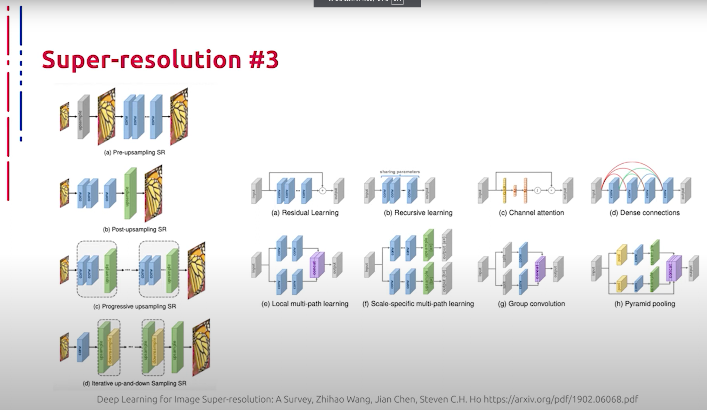

## [MainPage](../../index.md)/[Computer Vision](../README.md)/[Lecture](../Lecture.md)/1-2 RAW

语音识别：Youtube 转文本  
断句与标点：ChatGPT 4o  
翻译：ChatGPT 4o   

<!--  -->

# Повышение разрешения   超分辨率技术

Изображение низкого разрешения представляется в качестве результата деградационного процесса изображения в высоком разрешении, после чего определяется некоторый вид обратного преобразования от низкого разрешения к высокому и происходит подстройка параметров для уменьшения различия между исходным изображением в высоком разрешении и восстановленным. Наиболее распространенными типами интерполяции являются:  
低分辨率图像作为高分辨率图像退化过程的结果呈现，随后定义了一种从低分辨率到高分辨率的逆变换类型，并调整参数以减少高分辨率原始图像与恢复图像之间的差异。最常见的插值类型包括：

- Интерполяция методом ближайшего соседа: это простой и понятный алгоритм. Он выбирает значение ближайшего пикселя для каждой позиции, которая должна быть интерполирована, независимо от любых других пикселей. Таким образом, этот метод очень быстрый, но обычно порождает блочные артефакты и худшее качество по сравнению с остальными методами интерполяции.  
  最近邻插值：这是一个简单易懂的算法。它为每个需要插值的位置选择最近像素的值，而不考虑其他任何像素。因此，该方法非常快，但通常会产生块状伪影，质量比其他插值方法差。
- Билинейная интерполяция: сначала выполняет линейную интерполяцию по одной оси изображения, а затем действует на другой. Очевидно, для этого используются окна в 2 на 2 пикселя. Данный метод показывает намного лучшее качество, чем интерполяция методом ближайшего соседа, сохраняя при этом относительно высокую скорость.  
  双线性插值：首先沿图像的一条轴执行线性插值，然后沿另一条轴执行。显然，这需要使用2x2像素的窗口。该方法显示的质量比最近邻插值好得多，同时保持相对较高的速度。
- Точно так же бикубическая интерполяция выполняет кубическую интерполяцию вдоль каждой из двух осей. При данном типе интерполяции окно занимает 4 на 4 пикселя, что приводит к более плавным результатам с меньшим количеством артефактов, но гораздо меньшей скоростью работы.  
  同样，双三次插值沿两条轴中的每条执行三次插值。这种插值类型使用4x4像素的窗口，产生更平滑的结果和更少的伪影，但速度较慢。

Рассмотрим подробнее, как именно измеряется соответствие между исходным изображением и восстановленным. Сходство между двумя изображениями одинакового разрешения может быть задано как попиксельной метрикой на основе L1 или L2, так и более информативными обесхожностями, такими как SSIM и perceptual loss, а также взвешенной суммой всех перечисленных функций.  
接下来我们详细讨论一下如何衡量原始图像与恢复图像之间的一致性。两个相同分辨率的图像之间的相似性可以用基于L1或L2的像素度量来表示，也可以用更有信息量的度量，如SSIM和感知损失，还可以是所有列出功能的加权总和。

- Пиковое отношение сигнала к шуму (от английского PSNR) является инженерным термином, означающим соотношение между максимальным возможным значением сигнала и мощностью шума, искажающего значение сигналов. PSNR наиболее часто используется для измерения уровня искажения при сжатии изображений. Проще всего его определить через среднеквадратичную ошибку (MSE).  
  峰值信噪比（PSNR）是一个工程术语，表示信号的最大可能值与失真信号值的噪声功率之间的比率。PSNR最常用于测量图像压缩时的失真水平。最简单的方法是通过均方误差（MSE）来确定。
- Индекс структурного сходства (SSIM, от английского Structural Similarity Index) является одним из методов измерения схожести между двумя изображениями. SSIM индекс — это метод полного сопоставления, другими словами, он производит измерения качества на основе исходного изображения, несжатого или без искажений. SSIM индекс является развитием традиционных методов, таких как PSNR и метода среднеквадратичной ошибки (MSE), которые оказались несовместимы с физиологией человеческого восприятия. Отличительной особенностью метода, помимо упомянутых ранее MSE и PSNR, является то, что метод учитывает восприятие ошибки благодаря учету структурного изменения информации. Идея заключается в том, что пиксели имеют сильную взаимосвязь, особенно когда они близки в пространстве, и данные зависимости несут важную информацию о структуре объектов и сцене в целом.  
  结构相似性指数（SSIM）是测量两个图像之间相似性的方法之一。SSIM指数是一种完全匹配的方法，换句话说，它基于未压缩或无失真的原始图像来衡量质量。SSIM指数是PSNR和MSE等传统方法的发展，这些方法被证明与人类视觉感知的生理学不兼容。除了之前提到的MSE和PSNR之外，该方法的一个显著特点是，它通过考虑结构信息的变化来考虑误差的感知。其思想是，像素之间尤其在空间上靠近时有强关联，这些依赖关系携带了关于对象结构和整个场景的重要信息。
- Perceptual loss используется при сравнении высокоуровневых различий изображений, таких как несоответствие содержимого и стиля. Обычно perceptual loss задается как сумма поэлементных расстояний между промежуточными значениями карт признаков для каждого из изображений, пропущенных через общий нейросетевой кодировщик визуальных признаков.  
  感知损失用于比较图像的高级差异，如内容和风格的不一致性。通常，感知损失被定义为通过通用神经网络视觉特征编码器传递的每个图像的特征图中间值之间的逐元素距离的总和。

Теперь перейдем к современным методам повышения разрешения исходного изображения. Данные методы построены на основе нейросетевых кодировщиков, которые на входе принимают изображения низкого разрешения, а на выходе получают изображения в высоком разрешении. На слайде представлены основные конструктивные элементы и общие схемы построения таких кодировщиков. Конструктивные блоки для данной задачи используются самые разные: от residual connections и skip connections до механизмов внимания и блоков пирамидального масштабирования. Здесь нас скорее интересуют сами парадигмы построения кодировщика в целом.  
现在我们转向现代的提高原始图像分辨率的方法。这些方法基于神经网络编码器，其输入为低分辨率图像，输出为高分辨率图像。幻灯片中展示了这些编码器的主要构造元素和一般构造方案。用于此任务的构造模块种类繁多，从残差连接和跳跃连接到注意力机制和金字塔缩放块。这里我们更感兴趣的是编码器构造的总体范式。

1. Прямое обучение: данная парадигма обусловлена сложностью прямого обучения отображению из низкоразмерного пространства в многомерное пространство, поэтому в подобных подходах используются традиционные алгоритмы повышения размерности для получения изображений с более высоким разрешением с последующим их улучшением с помощью нейросетевых кодировщиков. Иногда для повышения размерности используется обычная интерполяция, после чего используется движок для улучшения качества изображения с фиксированной размерностью. Мы рассмотрим такой механизм далее в нашей лекции.  
   直接学习：这种范式是由于从低维空间到高维空间的直接学习的复杂性，因此在这些方法中使用传统的提高分辨率的算法来获得高分辨率图像，然后用神经网络编码器进行改进。有时使用常规插值来提高分辨率，然后使用引擎来改进固定分辨率的图像。我们将在本讲座中进一步讨论这种机制。
2. Постепенное повышение разрешения: здесь нейросеть нужно только улучшить полученное на первой стадии изображение, что значительно снижает трудность обучения. Кроме того, такие модели могут принимать в качестве входных данных интерполированные изображения с произвольными размерами и коэффициентами масштабирования и давать высококачественные результаты. Также нельзя не отметить склонность данного подхода к порождению артефактов из-за грубого увеличения размерности на первых стадиях (post-upscaling resolution). Чтобы повысить вычислительную эффективность, возможно производить большую часть вычислений в низкоразмерном пространстве, не используя повышающие кодировщики, поскольку процесс извлечения признаков с наибольшими вычислительными затратами происходит только в низкоразмерном пространстве, и разрешение увеличивается только в конце. Вычислительная сложность значительно уменьшается.  
   逐步提高分辨率：在这里，神经网络只需改进在第一阶段获得的图像，这显著降低了学习难度。此外，这些模型可以接受任意大小和缩放系数的插值图像作为输入，并提供高质量的结果。还应注意，由于在初始阶段粗略增加尺寸，这种方法倾向于产生伪影（后插值分辨率）。为了提高计算效率，可以在低维空间进行大部分计算，而不使用提升编码器，因为特征提取过程的最高计算成本仅发生在低维空间，并且只有在最后阶段才增加分辨率。计算复杂性显著降低。

Данные подходы получили наибольшее распространение. Progressively-upscaling resolution предполагает постепенное увеличение размерности, то есть несколько блоков пост-upscaling resolution, следующих друг за другом. Данный метод позволяет постепенно увеличивать размерность, что повышает точность по сравнению с классическим пост-upscaling resolution, при этом контролируя прирост накладных расходов на вычисления. Alternating downscaling and upscaling resolution предполагает чередование upscaling и downscaling. Наличие последнего позволяет представить всю схему в виде некоторого авто-кодировщика, что позволяет стабилизировать работу модели.  
这些方法得到了最广泛的应用。逐步提高分辨率的方案假定逐步增加尺寸，即多个后插值分辨率块相继进行。与经典的后插值分辨率相比，该方法允许逐步增加尺寸，从而提高了准确性，同时控制计算开销的增加。交替降尺度和升尺度的分辨率方案假定交替进行升尺度和降尺度。后者的存在允许将整个方案表示为某种自编码器，从而稳定模型的运行。